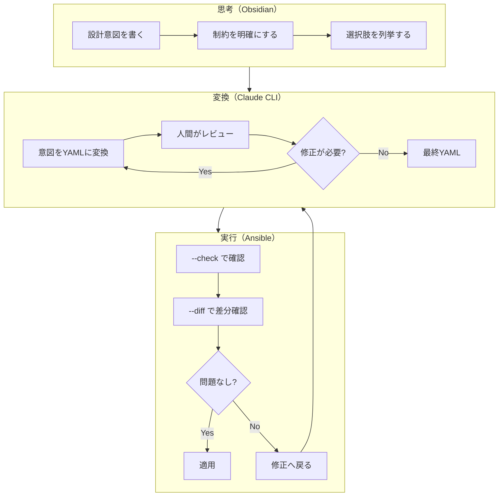

## SEOを意識した代替タイトル案（10件）

1. **設計を腐らせない技術：Obsidian × Claude CLI × Ansible の三層ワークフロー**
2. **思考→変換→実行を分離する：AI時代の設計資産化アプローチ**
3. **Obsidianで設計を書き、Claude CLIで変換し、Ansibleで実行する意味**
4. **なぜ「考えたこと」を残すのか：Ansible × Obsidian × AI の設計ワークフロー**
5. **AIに任せすぎない設計術：Obsidian × Claude CLI × Ansible の役割分担**
6. **設計が揮発しない構造を作る：思考・変換・実行の分離アプローチ**
7. **判断の履歴を残す技術：Obsidian × Claude CLI × Ansible で設計を資産化**
8. **エンジニアの「考える」を守る：AI時代の三層ワークフロー設計**
9. **思考を先に固定する：Obsidian × Claude CLI × Ansible の設計思想**
10. **設計という行為を資産にする：AI × IaC × ナレッジ管理の統合アプローチ**

---

## この記事の問い

**「設計という行為そのものを資産化できるか？」**

効率化や自動化の話ではない。

人間が考えたこと、判断したこと、迷ったこと。それらを「揮発させず」に残し、未来の自分やチームが参照できる形にする。

この記事では、Obsidian × Claude CLI × Ansible という組み合わせを通じて、その可能性を論じる。

---

## 目次

1. [なぜ「Ansible × Claude CLI」だけでは足りなかったのか](#1-なぜansible--claude-cliだけでは足りなかったのか)
2. [Obsidianが担う「実行されない設計」という価値](#2-obsidianが担う実行されない設計という価値)
3. [思考・変換・実行を分離する三層構造](#3-思考変換実行を分離する三層構造)
4. [ここで初めて「追加するツール」](#4-ここで初めて追加するツール)
5. [従来のワークフローとの決定的な違い](#5-従来のワークフローとの決定的な違い)
6. [「設計が資産になる」とはどういうことか](#6-設計が資産になるとはどういうことか)
7. [実務での最小フロー（例示）](#7-実務での最小フロー例示)
8. [うまくいかないパターン](#8-うまくいかないパターン)
9. [向いている人・向いていない人](#9-向いている人向いていない人)
10. [結論：AI時代にエンジニアが担う役割](#10-結論ai時代にエンジニアが担う役割)

---

## 1. なぜ「Ansible × Claude CLI」だけでは足りなかったのか

### 効率化はできた

前回の記事で、Claude CLI × Ansible の組み合わせについて論じた。

設計の試行コストが下がった。YAMLを書く前に構造を検討できるようになった。AIに叩き台を作らせ、人間がレビューする。このワークフローは、確かに機能する。

### しかし思考の置き場がなかった

だが、しばらく運用して気づいたことがある。

**「なぜこの設計にしたのか」が、どこにも残っていない。**

Claude CLIとの会話は流れていく。生成されたYAMLには意図が書かれていない。コミットメッセージに「〇〇を追加」とは書けるが、「なぜ〇〇を追加したのか」は書ききれない。

3ヶ月後、自分が書いたplaybookを見て、「なぜこの構造にしたんだっけ」と首をかしげる。

### 設計が揮発してしまう問題

これは「設計の揮発」だ。

思考したことは確かにある。判断したことも確かにある。しかし、それが形として残っていない。

コードは残る。しかし、コードに至る思考は残らない。

AIとの協働は、この問題を加速させる。人間が書いたコードには、書いた人間の思考の痕跡が残りやすい。AIが生成したコードには、人間の思考が直接反映されない。

**効率化と引き換えに、設計が揮発しやすくなった。**

これが、Ansible × Claude CLI だけでは足りなかった理由だ。

---

## 2. Obsidianが担う「実行されない設計」という価値

### なぜ実行されないことが重要か

Obsidianに書くノートは、コンパイルされない。実行されない。デプロイされない。

これが重要だ。

実行されるコードには、制約がある。構文が正しくなければならない。依存関係を満たさなければならない。動かなければ意味がない。

この制約が、思考を歪める。

「本当はこうしたいけど、実装が面倒だから妥協しよう」
「この設計の方が美しいけど、今の構成では動かないから諦めよう」

実行可能性に縛られて、本来の意図が失われる。

Obsidianに書くノートには、この制約がない。

### Why / What を嘘なく書ける場所

「なぜこの構成にしたいのか」（Why）
「何を実現したいのか」（What）

これを、実装の制約を気にせず書ける場所が必要だ。

YAMLに書くのは「どうやるか」（How）だ。Howは制約だらけだ。

WhyとWhatを先に固定し、Howは後から考える。この順序を守るために、実行されない設計の場所が要る。

### YAMLやShellより長生きする理由

Ansibleのplaybookは、Ansibleのバージョンに依存する。モジュールの仕様が変われば、書き直しが必要になる。

シェルスクリプトも同様だ。OSが変われば動かなくなる。

しかし、「なぜこの構成にしたかったのか」という意図は、ツールのバージョンに依存しない。

5年後、Ansibleが別のツールに置き換わったとしても、設計意図のノートは読める。

**思考は、コードより長生きする。**

だから、思考を書く場所を分離する価値がある。

---

## 3. 思考・変換・実行を分離する三層構造

### 全体像

```
┌─────────────────────────────────────────────────┐
│                  人間の思考                      │
│  ┌───────────────────────────────────────────┐  │
│  │         Obsidian（思考・意図・制約）        │  │
│  │  - なぜこの設計か                          │  │
│  │  - 何を実現したいか                        │  │
│  │  - どんな制約があるか                      │  │
│  │  - 迷った選択肢とその理由                  │  │
│  └───────────────────────────────────────────┘  │
└─────────────────────────────────────────────────┘
                        ↓
                    明示的な指示
                        ↓
┌─────────────────────────────────────────────────┐
│                  AIによる変換                    │
│  ┌───────────────────────────────────────────┐  │
│  │      Claude CLI（翻訳・提案・修正）         │  │
│  │  - 意図をYAMLに変換                        │  │
│  │  - 複数案を提示                            │  │
│  │  - エラーを分析                            │  │
│  └───────────────────────────────────────────┘  │
└─────────────────────────────────────────────────┘
                        ↓
                    人間のレビュー
                        ↓
┌─────────────────────────────────────────────────┐
│                  宣言的な実行                    │
│  ┌───────────────────────────────────────────┐  │
│  │      Ansible（安全な実行と検証）            │  │
│  │  - 冪等性のある適用                        │  │
│  │  - --check で事前確認                      │  │
│  │  - --diff で変更内容確認                   │  │
│  └───────────────────────────────────────────┘  │
└─────────────────────────────────────────────────┘
```

### Obsidian：思考・意図・制約

Obsidianは、この構造の最上流に位置する。

ここに書くのは：
- **Why**：なぜこの設計をするのか
- **What**：何を実現したいのか
- **Constraints**：どんな制約があるか
- **Alternatives**：検討した他の選択肢と、なぜ採用しなかったか

実装の詳細は書かない。書くのは「意図」だ。

### Claude CLI：翻訳・提案・修正

Claude CLIは、思考を実行可能なコードに変換する。

Obsidianのノートを読み込ませ、「この意図をAnsibleのplaybookにして」と依頼する。

AIは翻訳者だ。人間の言葉を、機械が理解できる言葉に変換する。

ただし、翻訳者は原文を書かない。原文を書くのは人間だ。

### Ansible：安全な実行と検証

Ansibleは、この構造の最下流に位置する。

生成されたplaybookを、`--check` で事前確認し、`--diff` で変更内容を確認し、問題なければ適用する。

Ansibleの冪等性が、AI生成コードの安全性を担保する。

### それぞれを混ぜない設計の意味

この三層を混ぜてはいけない。

- Obsidianに実装の詳細を書き始めると、思考が制約される
- Claude CLIに設計判断を委ねると、意図が不明確になる
- Ansibleで直接ロジックを書くと、冪等性が崩れる

各層には、明確な役割がある。その境界を守ることが、この構造の価値を保つ。

---

## 4. ここで初めて「追加するツール」

三層構造だけでは、まだ足りない部分がある。ここで初めて、補助的なツールを導入する。

ただし、ツールは役割を補強するためだけに使う。ツールを増やすこと自体が目的ではない。

### 4-1. Git：コード管理ではなく「判断ログ」

Gitは、コードのバージョン管理ツールだ。しかし、この構造ではより大きな役割を担う。

**Obsidianのノートも含めてGit管理する。**

これにより：
- 設計意図の変遷が追える
- 「なぜこの時点でこう判断したか」が履歴に残る
- playbookの変更と、その背景にある思考の変更が紐づく

コミットメッセージには、「何を変えたか」だけでなく「なぜ変えたか」を書く。

```
feat: nginx設定をgzip圧縮対応に変更

Why: フロントエンドのビルドサイズが増加し、初期表示が遅くなったため
What: 静的ファイルをgzip圧縮して配信
Alternative: CDN導入も検討したが、コスト面で今回は見送り

Related: design-notes/2026-01-performance-improvement.md
```

このコミットメッセージは、3年後に読んでも意味が分かる。

### 4-2. Mermaid：人間のための可視化

Mermaidは、テキストから図を生成するツールだ。

この構造では、**思考→変換→実行の流れを可視化する**ために使う。



この図は、AIのためではなく人間のためにある。

複雑な構造を頭に入れておくのは難しい。図として固定しておくことで、「今どのフェーズにいるか」を見失わない。

**図が設計を守る。**

### 4-3. ansible --check / --diff / ansible-lint

これらは、AI生成物を無条件に信じないための安全装置だ。

```bash
# 適用前に変更内容を確認
ansible-playbook site.yml --check --diff

# 静的解析でベストプラクティス違反を検出
ansible-lint site.yml
```

`--check` は、実際には何も変更せず、「何が変わるか」を表示する。
`--diff` は、ファイルの変更差分を表示する。
`ansible-lint` は、静的解析でベストプラクティス違反を検出する。

これらは、**人間の判断ポイントを明確にする**役割を担う。

「AIが生成したから正しい」ではない。「人間が確認して、問題ないと判断した」から適用する。この判断の瞬間を、ツールが作り出す。

### 4-4. Taskfile / Makefile（条件付き）

自動化ではなく「実行スイッチ」として使う。

```makefile
.PHONY: check apply lint

check:  ## 変更内容を確認（dry-run）
	ansible-playbook site.yml --check --diff

lint:  ## 静的解析
	ansible-lint site.yml

apply:  ## 変更を適用（要確認）
	@echo "Are you sure? [y/N]" && read ans && [ $${ans:-N} = y ]
	ansible-playbook site.yml
```

`make apply` を実行すると、確認プロンプトが出る。

これは自動化ではない。**判断と操作を分離するための最小導線**だ。

「何をするか」を考える時間と、「実行する」瞬間を分ける。この間に、人間の判断が入る。

### 使わないツールとその理由

**Docker**：この構造の本質は「思考の分離」であり、実行環境の隔離ではない。環境の再現性が必要なら使えばいいが、思想を実現するために必須ではない。

**Terraform**：インフラのプロビジョニングには適しているが、この記事のスコープはローカル環境やサーバー設定の構成管理だ。レイヤーが異なる。

**その他の流行ツール**：ツールを増やすほど、構造は複雑になる。この構造の価値は「分離」にある。ツールが増えると、分離が曖昧になる。

**使わない選択も、設計の一部だ。**

---

## 5. 従来のワークフローとの決定的な違い

### 頭で考えて即コードを書く世界

従来のワークフローは、こうだった：

1. 頭の中で設計を考える
2. エディタを開いてコードを書く
3. 動かしてみる
4. エラーが出たら修正する
5. 動いたら完了

思考は頭の中にある。コードは画面の中にある。この2つをつなぐのは、エンジニアの手だ。

このワークフローの問題は、**思考が外部化されない**ことだ。

頭の中で考えたことは、コードを書いた瞬間に揮発する。「なぜそう書いたか」は、本人の記憶に依存する。

### 思考を先に固定し、後からコードを生成する世界

新しいワークフローは、こうなる：

1. Obsidianに設計意図を書く
2. 制約と選択肢を明確にする
3. Claude CLIに変換を依頼する
4. 生成されたコードをレビューする
5. Ansibleで安全に適用する

思考が先にある。コードは後から生成される。

このワークフローの価値は、**思考が外部化される**ことだ。

Obsidianに書かれた設計意図は、コードが書かれた後も残る。3年後でも読める。他人でも読める。

### 試行錯誤の質がどう変わるか

従来のワークフローでは、試行錯誤は「コードの修正」だった。

書いて、動かして、エラーを見て、修正する。このループを回す。

新しいワークフローでは、試行錯誤は「設計の検討」になる。

Obsidianで複数の設計案を書き出す。それぞれの案をClaude CLIに変換させる。生成されたコードを見比べて、どの設計が良いか判断する。

**試行錯誤が、コードレベルから設計レベルに引き上げられる。**

---

## 6. 「設計が資産になる」とはどういうことか

### ノートが残る

Obsidianのノートは、Git管理される。消えない。

「2026年1月、パフォーマンス改善のためにnginx設定を見直した。CDNは見送り、gzip圧縮で対応。理由はコスト」

この記録は、5年後でも参照できる。

### 判断が追える

コミット履歴を辿れば、判断の変遷が分かる。

「最初はこう設計した」
「3ヶ月後、この問題が発生したから、こう変更した」
「半年後、別のアプローチに切り替えた」

この流れが追えることで、**同じ失敗を繰り返さない**。

「前にこれ試して、うまくいかなかったよな」が、記憶ではなく記録として残る。

### 再設計・引き継ぎが可能になる

設計意図が残っていれば、再設計ができる。

「この設計は、当時のこういう制約の下で、こういう判断をした結果だ。今は制約が変わったから、別のアプローチを検討できる」

引き継ぎも可能になる。

新しいメンバーが「なぜこの構成なのか」を理解できる。「前任者に聞かないと分からない」状態を避けられる。

**設計が資産になるとは、「未来の自分や他人が、この設計を理解し、発展させられる」ということだ。**

---

## 7. 実務での最小フロー（例示）

手順書ではなく、構造の理解を目的として、最小のフローを示す。

### Obsidian設計ノート（テンプレ例）

```markdown
# nginx設定の見直し

## Why（なぜやるのか）
- フロントエンドのビルドサイズが1.2MBを超えた
- 初期表示が3秒以上かかっている
- ユーザーからの遅いという声がある

## What（何を実現したいか）
- 静的ファイルの転送サイズを削減
- 初期表示を1秒以内に

## Constraints（制約）
- 既存のnginx設定を大きく変えたくない
- CDNは予算的に今回は見送り
- HTTP/2は対応済み

## Alternatives（検討した選択肢）
1. gzip圧縮を有効化 → 採用（コストゼロ、効果大）
2. Brotli圧縮 → 見送り（nginx再ビルドが必要）
3. CDN導入 → 見送り（コスト、今回のスコープ外）

## Decision（決定）
gzip圧縮を有効化する。
圧縮レベルは6（デフォルト）で開始し、必要に応じて調整。
```

### Claude CLIに渡すプロンプト例

```bash
cat design-notes/nginx-optimization.md | claude "この設計意図に基づいて、
Ansibleのtaskを生成してください。

条件：
- 既存のnginx.confを上書きではなく、gzip設定のみ追加
- templateモジュールを使用
- 冪等性を担保
- handler でnginx reload"
```

### Ansibleでcheck/diffする流れ

```bash
# 生成されたplaybookを保存
# ... (Claude CLIの出力をファイルに保存)

# 静的解析
ansible-lint roles/nginx/tasks/main.yml

# 変更内容を確認（dry-run）
ansible-playbook site.yml --check --diff --tags nginx

# 問題なければ適用
ansible-playbook site.yml --tags nginx
```

このフローで重要なのは、**各段階で人間の判断が入る**ことだ。

- 設計ノートを書く → 人間
- Claude CLIの出力をレビューする → 人間
- --check の結果を見て適用を判断する → 人間

AIは変換を担当するが、判断は人間が担当する。

---

## 8. うまくいかないパターン

### Obsidianがただのメモになる

設計意図ではなく、作業ログを書いてしまうパターン。

```markdown
# 今日やったこと
- nginxの設定を変えた
- 動いた
```

これはメモであり、設計ではない。Why / What / Constraints が書かれていなければ、3ヶ月後に読んでも意味が分からない。

**対策**：テンプレートを用意し、Why / What / Constraints / Alternatives / Decision を必ず埋める。

### AIに設計まで丸投げする

「nginx を速くして」とだけ指示するパターン。

AIは何かしら生成する。しかし、それが「自分が求めていたもの」かどうかは分からない。

**対策**：設計はObsidianで固める。Claude CLIには「変換」だけを依頼する。

### 宣言的ツールを理解せず使う

Ansibleの冪等性を理解せず、`shell` モジュールでスクリプトを実行するパターン。

```yaml
# ❌ アンチパターン
- name: gzipを有効化
  shell: |
    sed -i 's/#gzip on/gzip on/' /etc/nginx/nginx.conf
    systemctl reload nginx
```

これはAnsibleを使う意味がない。Shellスクリプトと変わらない。

**対策**：Ansibleのモジュールを理解する。`template` や `lineinfile` を適切に使う。

---

## 9. 向いている人・向いていない人

### 向いている人

- **設計と判断を自分でしたい人**
  - AIに任せるのではなく、自分で考え、AIには変換を手伝ってもらう

- **「なぜ」を大事にする人**
  - 動けばいい、ではなく、なぜこの設計なのかを言語化したい

- **長期的な保守を意識する人**
  - 3年後の自分、あるいは後任者が困らないようにしたい

- **複数の選択肢を検討してから決めたい人**
  - 最初に思いついた案で即実装、ではなく、複数案を比較したい

### 向いていない人

- **正解だけ欲しい人**
  - 「とりあえず動くものをくれ」というスタンスには合わない

- **考える時間を省きたい人**
  - この構造は、考える時間を増やす。書く時間は減るが、考える時間は減らない

- **ツールを覚えるのが面倒な人**
  - Obsidian、Claude CLI、Ansibleの3つを使いこなす必要がある

### 無理に使う必要はない

この構造は、万人向けではない。

今の運用がうまくいっているなら、変える必要はない。「設計が揮発する」という問題を感じていないなら、この構造は過剰だ。

「試してみたい」と思った人だけが、試せばいい。

---

## 10. 結論：AI時代にエンジニアが担う役割

### 書くことではなく、決めること

AIがコードを書けるようになった。

では、エンジニアは何をするのか。

**決める**のだ。

- 何を実現したいのか、決める
- どの選択肢を採用するのか、決める
- 生成されたコードを適用するか、決める
- 問題が起きたとき、どう対処するか、決める

書く能力の価値は下がった。決める能力の価値は、むしろ上がった。

### この構成は「考えるための補助輪」

Obsidian × Claude CLI × Ansible という構成は、考えることを代替しない。

むしろ、**考えることを支援する**。

- Obsidianは、思考を外部化する場所を提供する
- Claude CLIは、思考を実行可能なコードに変換する
- Ansibleは、安全に実行し、結果を確認する手段を提供する

この構成は、考えることを放棄するためのものではない。**考えることに集中するためのもの**だ。

AIに任せられることは任せる。しかし、判断は手放さない。

それが、この構成の思想であり、AI時代にエンジニアが担うべき役割だと、私は考える。

---

## 追加出力

### この記事を一文で表す要約（3パターン）

1. **思考（Obsidian）→ 変換（Claude CLI）→ 実行（Ansible）を分離することで、設計という行為そのものを資産化できる。**

2. **AIには変換を任せ、判断は人間が担う。この分業を支えるのが、三層構造のワークフローだ。**

3. **コードは残るが、思考は揮発する。だから思考を先に固定し、外部化する場所が要る。**

---

### X（Twitter）向け紹介文

```
Ansible × Claude CLI だけでは、設計が揮発する。

「なぜこの構成にしたか」が残らない。
3ヶ月後、自分の書いたplaybookを見て首をかしげる。

思考（Obsidian）→ 変換（Claude CLI）→ 実行（Ansible）

この三層を分離することで、設計を資産にできるか。
煽らず、静かに考えた記事です。

#Obsidian #Ansible #ClaudeCLI
```

---

### 続編として考えられるテーマ案（5件）

1. **チームで設計を共有する：Obsidianノートのテンプレートと運用ルール**
   - 個人の思考を、チームの資産にするための仕組み

2. **設計レビューの技術：AIが生成したコードを人間がどう評価するか**
   - レビューの観点、チェックリスト、見落としやすいポイント

3. **失敗から学ぶ設計ノート：うまくいかなかった判断をどう記録するか**
   - 成功だけでなく、失敗と「なぜ失敗したか」を残す方法

4. **設計ノートの粒度：何を書き、何を書かないか**
   - 詳細すぎると続かない、粗すぎると役に立たない、その間をどう見つけるか

5. **この構造を他のツールに適用する：Terraform / Kubernetes への展開可能性**
   - Ansible以外のIaCツールで、同じ思想が成立するか
