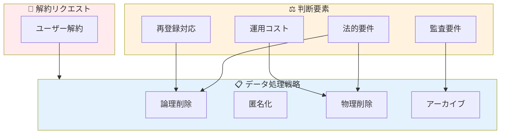
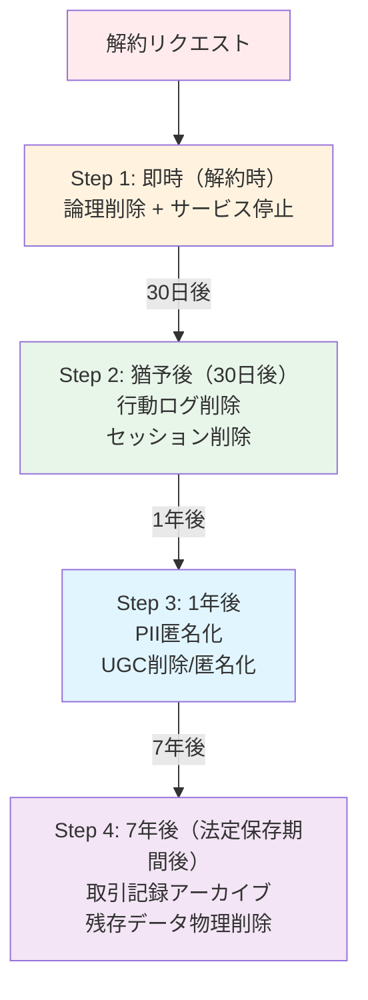

## 「解約したら全部消せばいいんでしょ？」という誤解

SaaS やアプリを運用していると、必ず直面する問題がある。

**「解約したユーザーのデータ、どうする？」**

一見シンプルに見えるこの問題。実は、考慮すべきことが山ほどある。

```sql
-- こんな単純な話ではない
DELETE FROM users WHERE id = 123;
DELETE FROM orders WHERE user_id = 123;
DELETE FROM payments WHERE user_id = 123;
-- ...本当にこれでいいのか？
```

現場でよく聞く声：

- 「GDPR があるから全部消さないといけないんでしょ？」
- 「消したら売上データが合わなくなった...」
- 「解約したユーザーが戻ってきたけど、データ全部消えてて怒られた」
- 「監査で『このユーザーの取引履歴を見せて』と言われたけど、消してしまった」

**「全部消す」も「全部残す」も間違いだ。**

この記事では、法務・運用・設計の3つの観点から、解約時のデータ削除戦略を徹底的に解説する。

---

## なぜ「全部消す」が危険なのか

### 問題1：法的に消せないデータがある

```
【日本の法的保存義務の例】

┌─────────────────────────────────────────────────┐
│ 帳簿・取引記録        │ 7年間（法人税法）      │
│ 請求書・領収書        │ 7年間（法人税法）      │
│ 契約書              │ 10年間（商法）        │
│ 労働関係書類         │ 3〜5年間（労働基準法）  │
│ 医療記録            │ 5年間（医師法）        │
│ 金融取引記録         │ 10年間（犯収法）       │
└─────────────────────────────────────────────────┘
```

**解約したからといって、取引記録を消すと法令違反になる可能性がある。**

### 問題2：監査・訴訟対応ができなくなる

```
シナリオ：解約から1年後に訴訟

弁護士「この顧客との取引履歴を証拠として提出してください」
あなた「解約時に消しました...」
弁護士「...」
```

### 問題3：ビジネスインテリジェンスが失われる

```sql
-- 月次売上レポート
SELECT
    DATE_TRUNC('month', created_at) as month,
    SUM(amount) as revenue
FROM orders
GROUP BY 1;

-- 解約ユーザーの注文を消していたら...
-- → 過去の売上が変わってしまう
-- → 前年同月比が計算できない
```

### 問題4：再登録時のトラブル

```
ユーザー「また使いたくなったので再登録しました」
システム「新規ユーザーとして登録されました」
ユーザー「前のデータは？ ポイントは？ 購入履歴は？」
システム「全て削除済みです」
ユーザー「...もう使いません」
```

---

## なぜ「全部残す」も危険なのか

### 問題1：法的に消さなければいけないデータがある

```
【GDPR / 個人情報保護法の要求】

- ユーザーには「削除を求める権利」がある
- 必要以上に個人情報を保持してはいけない
- 目的を達成したら削除すべき

違反した場合：
- GDPR: 年間売上の4%または2000万ユーロの制裁金
- 日本: 1億円以下の罰金（2022年改正）
```

### 問題2：セキュリティリスクが増大する

```
保持しているデータ量 ∝ 情報漏洩時の被害

解約から5年経ったユーザーの個人情報が漏洩
→「なぜまだ持っていたのか」と問われる
→ レピュテーションダメージ
→ 集団訴訟のリスク
```

### 問題3：ストレージコストが際限なく増える

```
月間解約率 5%、月間新規 1000人のサービス

1年後: 約 600人分の「死んだデータ」
5年後: 約 3000人分の「死んだデータ」

これらのデータも：
- バックアップされる
- インデックスが作られる
- クエリのパフォーマンスに影響する
```

---

## データの分類：消すべきもの、残すべきもの

### 4つのカテゴリで考える

```
┌─────────────────────────────────────────────────────────────┐
│                    データの分類マトリクス                    │
├─────────────────┬──────────────────┬───────────────────────┤
│   カテゴリ       │     具体例        │   解約時の処理         │
├─────────────────┼──────────────────┼───────────────────────┤
│ ① 識別情報      │ 氏名、メール、    │ 匿名化 or 削除        │
│   (PII)        │ 住所、電話番号    │ （法的保存期間後）      │
├─────────────────┼──────────────────┼───────────────────────┤
│ ② 取引記録      │ 注文、決済、      │ 保持（匿名化も可）     │
│                │ 請求書           │ （法定保存期間）        │
├─────────────────┼──────────────────┼───────────────────────┤
│ ③ 行動ログ      │ アクセスログ、    │ 集計後削除 or         │
│                │ 操作履歴         │ 一定期間で削除         │
├─────────────────┼──────────────────┼───────────────────────┤
│ ④ ユーザー生成  │ 投稿、コメント、  │ ポリシーによる         │
│   コンテンツ    │ アップロード     │ （削除 or 匿名化）     │
└─────────────────┴──────────────────┴───────────────────────┘
```

### 各カテゴリの詳細

#### ① 識別情報（PII: Personally Identifiable Information）

```sql
-- users テーブルの例
CREATE TABLE users (
    id BIGINT PRIMARY KEY,
    email VARCHAR(255),        -- PII: 匿名化対象
    name VARCHAR(100),         -- PII: 匿名化対象
    phone VARCHAR(20),         -- PII: 匿名化対象
    address TEXT,              -- PII: 匿名化対象
    created_at TIMESTAMP,      -- 保持
    canceled_at TIMESTAMP,     -- 保持
    status VARCHAR(20)         -- 保持
);
```

**処理方針：**
- 解約即時：論理削除（`status = 'canceled'`）
- 一定期間後：匿名化または物理削除

#### ② 取引記録

```sql
-- orders テーブルの例
CREATE TABLE orders (
    id BIGINT PRIMARY KEY,
    user_id BIGINT,            -- FK（ただし制約は外す）
    order_number VARCHAR(50),   -- 保持（監査用）
    amount DECIMAL(10,2),      -- 保持（会計用）
    tax DECIMAL(10,2),         -- 保持（会計用）
    created_at TIMESTAMP,      -- 保持
    -- ユーザー情報のスナップショット
    billing_name VARCHAR(100), -- 保持（請求書に必要）
    billing_address TEXT       -- 保持（請求書に必要）
);
```

**処理方針：**
- 法定保存期間（7年〜10年）は保持
- ユーザー削除後も取引記録は残す
- 必要に応じて匿名化（user_id を NULL に）

#### ③ 行動ログ

```sql
-- access_logs テーブルの例
CREATE TABLE access_logs (
    id BIGINT PRIMARY KEY,
    user_id BIGINT,
    ip_address INET,           -- PII: 一定期間で削除
    user_agent TEXT,
    path VARCHAR(255),
    created_at TIMESTAMP
);
```

**処理方針：**
- 集計・分析用途なら、集計後に生データ削除
- セキュリティ用途なら、90日〜1年で削除
- 解約と同時に削除してもよい

#### ④ ユーザー生成コンテンツ（UGC）

```sql
-- posts テーブルの例
CREATE TABLE posts (
    id BIGINT PRIMARY KEY,
    user_id BIGINT,
    content TEXT,
    created_at TIMESTAMP,
    deleted_at TIMESTAMP       -- 論理削除用
);
```

**処理方針：**
- サービスの性質による
- SNS：投稿を残すか、匿名化するか、削除するか
- ファイルストレージ：ユーザーデータは削除すべき

---

## 実装パターン：4つの削除戦略

### パターン1：論理削除（Soft Delete）

```sql
-- 削除フラグを立てるだけ
UPDATE users
SET
    status = 'canceled',
    canceled_at = NOW()
WHERE id = 123;

-- アプリケーション側で除外
SELECT * FROM users WHERE status != 'canceled';
```

**メリット：**
- 復元が容易
- 参照整合性を維持
- 監査対応が容易

**デメリット：**
- データは消えない（ストレージ、パフォーマンス）
- 全クエリに条件が必要
- プライバシー要件を満たさない可能性

**向いているケース：**
- 解約後の猶予期間（30日以内なら復元可能など）
- 再登録の可能性が高いサービス

### パターン2：匿名化（Anonymization）

```sql
-- PIIを匿名化、取引記録は保持
UPDATE users
SET
    email = CONCAT('deleted_', id, '@anonymized.local'),
    name = CONCAT('Deleted User #', id),
    phone = NULL,
    address = NULL,
    status = 'anonymized',
    anonymized_at = NOW()
WHERE id = 123;

-- 取引記録はそのまま
-- orders.user_id = 123 は残る
-- billing_name, billing_address はスナップショットとして残す
```

**メリット：**
- 取引記録を保持しつつPIIを削除
- 統計・分析に使える
- 法的要件と privacy のバランス

**デメリット：**
- 完全な匿名化は難しい（再識別リスク）
- 復元不可能

**向いているケース：**
- 取引履歴を長期保存する必要があるサービス
- GDPR対応が必要だが、データ分析も重要

### パターン3：物理削除（Hard Delete）

```sql
-- 関連データを含めて完全削除
BEGIN;

-- 依存テーブルから先に削除
DELETE FROM access_logs WHERE user_id = 123;
DELETE FROM user_sessions WHERE user_id = 123;
DELETE FROM notifications WHERE user_id = 123;

-- 取引記録は user_id を NULL に
UPDATE orders SET user_id = NULL WHERE user_id = 123;

-- ユーザー本体を削除
DELETE FROM users WHERE id = 123;

COMMIT;
```

**メリット：**
- 完全にデータが消える
- ストレージ削減
- プライバシー要件を完全に満たす

**デメリット：**
- 復元不可能
- 参照整合性の問題
- 監査対応が困難

**向いているケース：**
- 法定保存期間を過ぎたデータ
- 明示的な削除リクエスト（GDPR等）

### パターン4：アーカイブ（Archive）

```sql
-- 別テーブル/別DBにアーカイブ
INSERT INTO archived_users
SELECT *, NOW() as archived_at
FROM users
WHERE id = 123;

-- 本体から削除
DELETE FROM users WHERE id = 123;
```

**メリット：**
- 本番DBのパフォーマンス維持
- 必要時に復元可能
- 監査対応可能

**デメリット：**
- アーカイブ先の管理が必要
- 復元時の整合性確保が複雑

**向いているケース：**
- 大量データの長期保存
- 監査要件が厳しい業界（金融、医療）

---

## 実装例：段階的削除パイプライン

### アーキテクチャ



### 実装コード（Python + SQLAlchemy）

```python
from datetime import datetime, timedelta
from enum import Enum
from sqlalchemy import update, delete
from sqlalchemy.orm import Session

class DeletionStage(Enum):
    ACTIVE = "active"
    CANCELED = "canceled"          # Step 1
    LOGS_DELETED = "logs_deleted"  # Step 2
    ANONYMIZED = "anonymized"      # Step 3
    ARCHIVED = "archived"          # Step 4


class UserDeletionService:
    """段階的ユーザーデータ削除サービス"""

    def __init__(self, db: Session):
        self.db = db

    def cancel_user(self, user_id: int) -> None:
        """Step 1: 解約時の即時処理"""
        # 論理削除
        self.db.execute(
            update(User)
            .where(User.id == user_id)
            .values(
                status=DeletionStage.CANCELED.value,
                canceled_at=datetime.utcnow(),
                # ログイン不可にする
                password_hash=None,
                api_key=None,
            )
        )

        # アクティブセッションを無効化
        self.db.execute(
            delete(UserSession).where(UserSession.user_id == user_id)
        )

        # サブスクリプションをキャンセル
        self._cancel_subscription(user_id)

        self.db.commit()

        # 確認メール送信
        self._send_cancellation_email(user_id)

    def delete_logs(self, user_id: int) -> None:
        """Step 2: 行動ログの削除（30日後）"""
        user = self.db.query(User).filter(User.id == user_id).first()

        if not self._is_ready_for_stage(user, DeletionStage.CANCELED, days=30):
            return

        # アクセスログ削除
        self.db.execute(
            delete(AccessLog).where(AccessLog.user_id == user_id)
        )

        # 通知履歴削除
        self.db.execute(
            delete(Notification).where(Notification.user_id == user_id)
        )

        # ステータス更新
        user.status = DeletionStage.LOGS_DELETED.value
        self.db.commit()

    def anonymize_user(self, user_id: int) -> None:
        """Step 3: PII匿名化（1年後）"""
        user = self.db.query(User).filter(User.id == user_id).first()

        if not self._is_ready_for_stage(user, DeletionStage.LOGS_DELETED, days=365):
            return

        # PII匿名化
        self.db.execute(
            update(User)
            .where(User.id == user_id)
            .values(
                email=f"deleted_{user_id}@anonymized.local",
                name=f"Deleted User #{user_id}",
                phone=None,
                address=None,
                status=DeletionStage.ANONYMIZED.value,
                anonymized_at=datetime.utcnow(),
            )
        )

        # UGCの匿名化（サービスポリシーによる）
        self.db.execute(
            update(Post)
            .where(Post.user_id == user_id)
            .values(
                author_name="削除されたユーザー",
                # content は残す（または削除）
            )
        )

        self.db.commit()

    def archive_and_delete(self, user_id: int) -> None:
        """Step 4: アーカイブと物理削除（7年後）"""
        user = self.db.query(User).filter(User.id == user_id).first()

        if not self._is_ready_for_stage(user, DeletionStage.ANONYMIZED, days=365*7):
            return

        # 取引記録をアーカイブ
        self._archive_orders(user_id)

        # 物理削除
        self.db.execute(delete(User).where(User.id == user_id))

        self.db.commit()

    def _is_ready_for_stage(
        self, user, required_status: DeletionStage, days: int
    ) -> bool:
        """次の段階に進める状態かチェック"""
        if user is None:
            return False
        if user.status != required_status.value:
            return False
        if user.canceled_at is None:
            return False

        threshold = datetime.utcnow() - timedelta(days=days)
        return user.canceled_at < threshold

    def _archive_orders(self, user_id: int) -> None:
        """取引記録を別テーブルにアーカイブ"""
        orders = self.db.query(Order).filter(Order.user_id == user_id).all()

        for order in orders:
            archived = ArchivedOrder(
                original_id=order.id,
                order_number=order.order_number,
                amount=order.amount,
                tax=order.tax,
                created_at=order.created_at,
                billing_name=order.billing_name,  # スナップショット
                billing_address=order.billing_address,
                archived_at=datetime.utcnow(),
            )
            self.db.add(archived)

        # 元の注文から user_id を削除（参照整合性のため）
        self.db.execute(
            update(Order)
            .where(Order.user_id == user_id)
            .values(user_id=None)
        )
```

### バッチジョブの実装

```python
# deletion_batch.py
from datetime import datetime

def run_deletion_pipeline():
    """定期実行バッチ（毎日実行）"""
    db = get_db_session()
    service = UserDeletionService(db)

    # Step 2: 30日経過したユーザーのログ削除
    canceled_users = db.query(User).filter(
        User.status == DeletionStage.CANCELED.value,
        User.canceled_at < datetime.utcnow() - timedelta(days=30)
    ).all()

    for user in canceled_users:
        try:
            service.delete_logs(user.id)
            logger.info(f"Logs deleted for user {user.id}")
        except Exception as e:
            logger.error(f"Failed to delete logs for user {user.id}: {e}")

    # Step 3: 1年経過したユーザーの匿名化
    logs_deleted_users = db.query(User).filter(
        User.status == DeletionStage.LOGS_DELETED.value,
        User.canceled_at < datetime.utcnow() - timedelta(days=365)
    ).all()

    for user in logs_deleted_users:
        try:
            service.anonymize_user(user.id)
            logger.info(f"User {user.id} anonymized")
        except Exception as e:
            logger.error(f"Failed to anonymize user {user.id}: {e}")

    # Step 4: 7年経過したユーザーのアーカイブ・削除
    anonymized_users = db.query(User).filter(
        User.status == DeletionStage.ANONYMIZED.value,
        User.canceled_at < datetime.utcnow() - timedelta(days=365*7)
    ).all()

    for user in anonymized_users:
        try:
            service.archive_and_delete(user.id)
            logger.info(f"User {user.id} archived and deleted")
        except Exception as e:
            logger.error(f"Failed to archive user {user.id}: {e}")
```

---

## テーブル設計のベストプラクティス

### 1. 取引記録にはスナップショットを持つ

```sql
-- ❌ 悪い例：user_id だけで参照
CREATE TABLE orders (
    id BIGINT PRIMARY KEY,
    user_id BIGINT REFERENCES users(id),  -- ユーザー削除で困る
    amount DECIMAL(10,2)
);

-- ✅ 良い例：請求時点の情報をスナップショット
CREATE TABLE orders (
    id BIGINT PRIMARY KEY,
    user_id BIGINT,  -- 参照のみ（FK制約なし）
    amount DECIMAL(10,2),
    -- スナップショット
    billing_name VARCHAR(100) NOT NULL,
    billing_email VARCHAR(255) NOT NULL,
    billing_address TEXT,
    created_at TIMESTAMP NOT NULL
);
```

### 2. 削除用のメタデータカラムを用意

```sql
CREATE TABLE users (
    id BIGINT PRIMARY KEY,
    email VARCHAR(255),
    name VARCHAR(100),

    -- 削除管理用
    status VARCHAR(20) DEFAULT 'active',
    canceled_at TIMESTAMP,
    anonymized_at TIMESTAMP,
    deletion_scheduled_at TIMESTAMP,  -- 物理削除予定日

    -- 監査用
    created_at TIMESTAMP DEFAULT NOW(),
    updated_at TIMESTAMP DEFAULT NOW()
);

-- インデックス
CREATE INDEX idx_users_status ON users(status);
CREATE INDEX idx_users_canceled_at ON users(canceled_at)
    WHERE status = 'canceled';
```

### 3. 外部キー制約の見直し

```sql
-- ❌ 外部キー制約があると削除できない
ALTER TABLE orders
ADD CONSTRAINT fk_orders_user
FOREIGN KEY (user_id) REFERENCES users(id);

-- ✅ 制約を外すか、ON DELETE SET NULL
ALTER TABLE orders
ADD CONSTRAINT fk_orders_user
FOREIGN KEY (user_id) REFERENCES users(id)
ON DELETE SET NULL;

-- または、アプリケーション層で整合性を管理
-- FK制約なしで user_id を持つ
```

### 4. 削除対象を明確にするビュー

```sql
-- 削除パイプラインの可視化
CREATE VIEW deletion_pipeline AS
SELECT
    id,
    email,
    status,
    canceled_at,
    CASE
        WHEN status = 'canceled'
             AND canceled_at < NOW() - INTERVAL '30 days'
        THEN 'ready_for_log_deletion'

        WHEN status = 'logs_deleted'
             AND canceled_at < NOW() - INTERVAL '1 year'
        THEN 'ready_for_anonymization'

        WHEN status = 'anonymized'
             AND canceled_at < NOW() - INTERVAL '7 years'
        THEN 'ready_for_archive'

        ELSE 'waiting'
    END as next_action
FROM users
WHERE status IN ('canceled', 'logs_deleted', 'anonymized');
```

---

## 法的要件チェックリスト

### GDPR（EU一般データ保護規則）

```
□ 削除リクエストから30日以内に対応できるか
□ 「忘れられる権利」を実装しているか
□ 処理の法的根拠がある間だけデータを保持しているか
□ データ保護影響評価（DPIA）を実施したか
□ 削除完了を通知する仕組みがあるか
```

### 日本の個人情報保護法

```
□ 利用目的の達成後、遅滞なく削除しているか
□ 本人からの削除請求に対応できるか
□ 安全管理措置を講じているか
□ 第三者提供したデータの削除を連絡できるか
```

### 業界別の追加要件

```
【金融】
□ 犯収法に基づく取引記録を10年保存しているか
□ 金融検査に対応できる記録があるか

【医療】
□ 診療記録を5年以上保存しているか
□ 患者の同意なく削除していないか

【EC/小売】
□ 帳簿・取引記録を7年保存しているか
□ 返品・クレーム対応に必要な情報を保持しているか
```

---

## よくある質問と回答

### Q1: 解約後すぐに全削除を求められたら？

```
A: 法的保存義務があるデータは削除できないことを説明する。

対応例：
1. PIIは即時匿名化
2. 取引記録は法定期間まで保持（匿名化済み）
3. 行動ログは即時削除
4. 削除完了レポートを送付
```

### Q2: 再登録したユーザーのデータを復元したい

```
A: 論理削除期間中（30日など）であれば復元可能な設計にする。

実装例：
- canceled_at から30日以内なら復元可能
- 復元時に email の一意性をチェック
- 復元したことを明示的に記録
```

### Q3: 取引記録と個人情報をどう紐付ける？

```
A: 取引時点でスナップショットを保存し、後から紐付けに依存しない。

設計原則：
- orders テーブルに billing_name, billing_email を持つ
- users テーブルが消えても orders は自己完結
- 監査時は orders 単体で対応可能
```

### Q4: 外部サービスに連携したデータは？

```
A: データ連携先にも削除リクエストを送る必要がある。

チェックリスト：
□ Analytics（Google Analytics等）のユーザーデータ削除
□ CRM（Salesforce等）の顧客データ削除
□ メール配信サービスのリスト削除
□ CDN/ストレージのキャッシュ削除
```

### Q5: 削除漏れを防ぐには？

```
A: データマッピングと自動化テストを実装する。

1. 全テーブルの user_id カラムをリストアップ
2. 削除パイプラインでカバーされているか確認
3. 定期的に「孤立データ」をチェック

-- 孤立データ検出クエリ
SELECT 'orders' as table_name, COUNT(*)
FROM orders o
LEFT JOIN users u ON o.user_id = u.id
WHERE o.user_id IS NOT NULL AND u.id IS NULL;
```

---

## 使い分け早見表

### データタイプ別の処理方針

| データタイプ | 解約時 | 30日後 | 1年後 | 7年後 |
|-------------|-------|-------|-------|-------|
| **メールアドレス** | 論理削除 | - | 匿名化 | 物理削除 |
| **氏名・住所** | 論理削除 | - | 匿名化 | 物理削除 |
| **パスワード** | 即時削除 | - | - | - |
| **APIキー** | 即時削除 | - | - | - |
| **決済情報** | 即時削除 | - | - | - |
| **取引記録** | 保持 | 保持 | 保持 | アーカイブ |
| **アクセスログ** | 保持 | 削除 | - | - |
| **投稿/UGC** | 論理削除 | - | 匿名化/削除 | - |
| **ファイル** | 論理削除 | 物理削除 | - | - |

### 業種別の推奨パターン

| 業種 | 基本パターン | 特記事項 |
|------|-------------|---------|
| **SaaS（一般）** | 段階的削除 | 再登録対応を考慮 |
| **EC** | 匿名化 + 長期保存 | 取引記録7年保存 |
| **金融** | アーカイブ | 10年保存、監査対応 |
| **医療** | アーカイブ | 5年以上保存 |
| **SNS** | 匿名化 or 削除 | UGCのポリシー明確化 |
| **ゲーム** | 論理削除 | 復帰ユーザー対応 |

---

## まとめ：迷ったときの判断基準

### 3つの原則

```
1. 消さなければいけないもの → 消す（PII、認証情報）
2. 消してはいけないもの → 残す（法定保存データ）
3. どちらでもよいもの → ビジネス判断（コストvs価値）
```

### 最低限やるべきこと

```
□ データの分類を行う（PII / 取引記録 / ログ / UGC）
□ 法的保存期間を確認する
□ 段階的削除パイプラインを実装する
□ 取引記録にスナップショットを持たせる
□ 削除完了を証明できる仕組みを作る
```

### やってはいけないこと

```
✗ 解約時に全データを即時物理削除
✗ 取引記録をユーザーと一緒に消す
✗ 法定保存期間を無視する
✗ 「あとで考える」で放置する
```

---

## 設計判断の背景

「全部消す」か「全部残す」の二択で考えがちだが、現実はそう単純ではない。法務、運用、プライバシー、ビジネス要件が複雑に絡み合う。この記事では、それぞれの観点を整理し、段階的に処理する設計パターンを提示した。

## 現場での判断基準

新しいサービスを設計するとき、まず「解約後のデータをどうするか」を考えるようにしている。後から考えると、テーブル設計やFK制約の見直しが必要になり、大きな手戻りになるからだ。特に取引記録のスナップショットは、最初から設計に入れておくべきだ。

## 見るべきポイント

他のエンジニアの設計をレビューするとき、「このユーザーを削除したらどうなる？」と聞くようにしている。FK制約で削除できない、取引記録が消える、ログが孤立する、といった問題が見つかることが多い。解約フローは、設計の健全性を測る良いリトマス試験紙になる。
