## この記事の対象読者

- 「キャッシュ」と聞くと、なんとなくRedisを思い浮かべる人
- キャッシュを入れたのに、なぜか速くならない経験がある人
- 本番環境でキャッシュ関連の障害を経験したことがある人
- システム設計でキャッシュをどこに入れるべきか悩む人

この記事では、**キャッシュの基本概念**から、**7つのキャッシュ層**、**4つのキャッシュパターン**、**実務で遭遇する問題とその対策**まで、体系的に解説します。

---

## キャッシュとは何か？

### 一言で言うと

**キャッシュ** とは、**「同じ計算や取得を繰り返さないように、結果を一時保存する仕組み」** です。

### なぜキャッシュが必要なのか

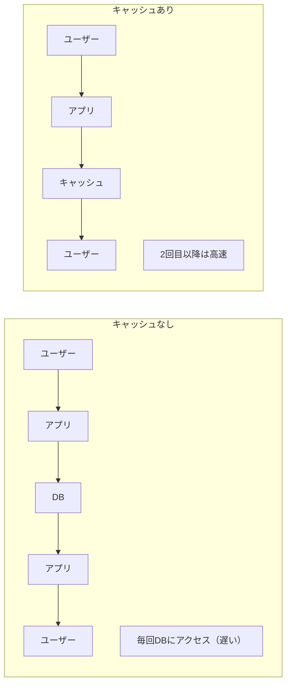

### キャッシュの本質

キャッシュは **「時間とスペースのトレードオフ」** です。

| 項目 | キャッシュなし | キャッシュあり |
|------|--------------|---------------|
| **速度** | 遅い | 速い |
| **メモリ使用量** | 少ない | 多い |
| **データの鮮度** | 常に最新 | 古い可能性がある |
| **複雑さ** | シンプル | 複雑 |

**キャッシュを入れる = 複雑さを受け入れる** ということを忘れてはいけません。

---

## 7つのキャッシュ層

キャッシュは「どこに置くか」で性質が大きく変わります。

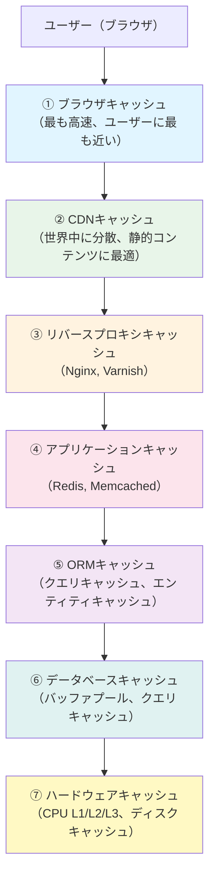

---

## 第1層：ブラウザキャッシュ

### 概要

**ブラウザキャッシュ** は、ユーザーのブラウザに保存されるキャッシュです。

**最もユーザーに近い** ため、ヒットすれば **ネットワーク通信すら発生しない** 最速のキャッシュです。

### 制御方法：HTTPヘッダー

```http
# レスポンスヘッダーでキャッシュを制御
Cache-Control: max-age=3600        # 1時間キャッシュ
Cache-Control: no-cache            # 毎回サーバーに確認
Cache-Control: no-store            # キャッシュしない
Cache-Control: private             # ブラウザのみ（CDNはNG）
Cache-Control: public              # CDNもOK
```

### 実践的な設定例

```nginx
# Nginx設定例

# 静的ファイル（CSS, JS, 画像）→ 長期キャッシュ
location ~* \.(css|js|png|jpg|gif|ico|woff2)$ {
    expires 1y;
    add_header Cache-Control "public, immutable";
}

# HTML → 短期キャッシュ or キャッシュなし
location ~* \.html$ {
    expires 5m;
    add_header Cache-Control "no-cache";
}

# API → キャッシュしない
location /api/ {
    add_header Cache-Control "no-store";
}
```

### ETagとLast-Modified

```http
# サーバーレスポンス
ETag: "abc123"
Last-Modified: Wed, 13 Dec 2025 10:00:00 GMT

# クライアントの次のリクエスト
If-None-Match: "abc123"
If-Modified-Since: Wed, 13 Dec 2025 10:00:00 GMT

# 変更がなければ 304 Not Modified を返す（本文なし = 高速）
```

### キャッシュバスティング

ファイルを更新したのに、ブラウザが古いキャッシュを使い続ける問題の解決策：

```html
<!-- ファイル名にハッシュを含める -->
<link rel="stylesheet" href="/css/style.a1b2c3d4.css">
<script src="/js/app.e5f6g7h8.js"></script>
```

ビルドツール（Webpack, Vite）が自動でハッシュを付与してくれます。

---

## 第2層：CDNキャッシュ

### 概要

**CDN（Content Delivery Network）** は、世界中に分散配置されたサーバーにコンテンツをキャッシュします。

```
【CDNなし】
日本のユーザー → 米国のオリジンサーバー（遅い）

【CDNあり】
日本のユーザー → 日本のCDNエッジ → 米国のオリジン
                 ↓
              キャッシュヒットなら
              ここで返す（速い）
```

### 主要なCDNサービス

| サービス | 特徴 |
|----------|------|
| **CloudFlare** | 無料プランあり、WAF付き |
| **AWS CloudFront** | AWS連携が容易 |
| **Fastly** | リアルタイム設定変更、VCL |
| **Akamai** | 最大規模、エンタープライズ向け |

### CDNのキャッシュ制御

```http
# オリジンサーバーからCDNへの指示
Cache-Control: public, max-age=3600, s-maxage=86400
#                                    ↑ CDN用（1日）
```

| ディレクティブ | 意味 |
|---------------|------|
| `s-maxage` | 共有キャッシュ（CDN）用のTTL |
| `max-age` | ブラウザ用のTTL |
| `stale-while-revalidate` | 古いキャッシュを返しつつ裏で更新 |
| `stale-if-error` | オリジン障害時に古いキャッシュを返す |

### Surrogate-Key（タグベース無効化）

```http
# レスポンスにタグを付ける
Surrogate-Key: product-123 category-electronics

# 特定のタグだけ無効化（Fastlyの例）
curl -X POST "https://api.fastly.com/service/{id}/purge/product-123"
```

これにより、**商品ID=123のキャッシュだけ**を選択的に削除できます。

### CDNを使うべきケース

| ユースケース | CDNの効果 |
|-------------|----------|
| 画像・動画配信 | ◎ 非常に効果的 |
| 静的HTML/CSS/JS | ◎ 非常に効果的 |
| APIレスポンス | △ 慎重に設計 |
| ユーザー固有データ | × 使わない |

---

## 第3層：リバースプロキシキャッシュ

### 概要

**リバースプロキシ** は、アプリケーションサーバーの前段に配置され、レスポンスをキャッシュします。

```
ユーザー → Nginx/Varnish → アプリサーバー → DB
              ↓
         ここでキャッシュ
```

### Nginxのプロキシキャッシュ

```nginx
# キャッシュ領域の定義
proxy_cache_path /var/cache/nginx
    levels=1:2
    keys_zone=my_cache:10m
    max_size=10g
    inactive=60m
    use_temp_path=off;

server {
    location / {
        proxy_cache my_cache;
        proxy_cache_valid 200 1h;      # 200 OK は1時間
        proxy_cache_valid 404 1m;      # 404 は1分
        proxy_cache_use_stale error timeout updating;
        proxy_cache_lock on;           # 同時リクエストを1つに

        add_header X-Cache-Status $upstream_cache_status;

        proxy_pass http://backend;
    }
}
```

### キャッシュステータスの確認

```bash
# レスポンスヘッダーを確認
curl -I https://example.com/api/data

# X-Cache-Status の値
# HIT      → キャッシュから返した
# MISS     → キャッシュなし、オリジンから取得
# EXPIRED  → 期限切れ、オリジンから再取得
# STALE    → 古いキャッシュを返した
# UPDATING → 更新中に古いキャッシュを返した
```

### Varnish（専用キャッシュサーバー）

Varnishは **キャッシュに特化** したリバースプロキシです。

```vcl
# VCL（Varnish Configuration Language）
sub vcl_recv {
    # ログインユーザーはキャッシュしない
    if (req.http.Cookie ~ "session_id") {
        return (pass);
    }

    # APIはキャッシュしない
    if (req.url ~ "^/api/") {
        return (pass);
    }
}

sub vcl_backend_response {
    # 画像は1日キャッシュ
    if (bereq.url ~ "\.(png|jpg|gif)$") {
        set beresp.ttl = 1d;
    }
}
```

---

## 第4層：アプリケーションキャッシュ

### 概要

**アプリケーションキャッシュ** は、アプリケーションコード内で明示的に管理するキャッシュです。

代表的なツール：
- **Redis**: 高機能、データ構造が豊富
- **Memcached**: シンプル、高速

### RedisとMemcachedの比較

| 項目 | Redis | Memcached |
|------|-------|-----------|
| データ構造 | 豊富（String, Hash, List, Set, Sorted Set） | String のみ |
| 永続化 | あり（RDB, AOF） | なし |
| レプリケーション | あり | なし |
| クラスタ | あり | なし（クライアント側で分散） |
| メモリ効率 | 低め | 高め |
| 用途 | 汎用 | 純粋なキャッシュ |

### Redisの基本操作

```bash
# 接続
redis-cli

# 基本的なキャッシュ操作
SET user:1234 '{"name":"John","age":30}' EX 3600  # 1時間で期限切れ
GET user:1234
DEL user:1234

# 存在しない場合のみセット（ロックに使える）
SETNX lock:resource "1"

# TTL確認
TTL user:1234  # 残り秒数を返す
```

### Pythonでの使用例

```python
import redis
import json

r = redis.Redis(host='localhost', port=6379, db=0)

def get_user(user_id: int) -> dict:
    # キャッシュキーを定義
    cache_key = f"user:{user_id}"

    # キャッシュから取得を試みる
    cached = r.get(cache_key)
    if cached:
        return json.loads(cached)

    # キャッシュミス → DBから取得
    user = db.query(User).filter(User.id == user_id).first()

    # キャッシュに保存（1時間）
    r.setex(cache_key, 3600, json.dumps(user.to_dict()))

    return user.to_dict()

def update_user(user_id: int, data: dict):
    # DBを更新
    db.query(User).filter(User.id == user_id).update(data)
    db.commit()

    # キャッシュを削除（次回アクセス時に再生成される）
    r.delete(f"user:{user_id}")
```

### キャッシュキーの設計

```python
# 悪い例
cache_key = "user_data"  # 誰のデータ？

# 良い例
cache_key = f"user:{user_id}:profile"  # 明確

# 名前空間を使う
cache_key = f"v1:users:{user_id}:profile"
#            ↑ バージョン（スキーマ変更時に便利）
```

---

## 第5層：ORMキャッシュ

### 概要

ORM（Object-Relational Mapping）レベルで、クエリ結果やエンティティをキャッシュします。

### Django ORMのキャッシュ

```python
from django.core.cache import cache

# クエリキャッシュ
def get_active_products():
    cache_key = "products:active"
    products = cache.get(cache_key)

    if products is None:
        products = list(Product.objects.filter(is_active=True))
        cache.set(cache_key, products, timeout=300)

    return products

# django-cacheopsを使う場合
from cacheops import cached

@cached(timeout=60*15)
def get_product(product_id):
    return Product.objects.get(id=product_id)
```

### SQLAlchemyのキャッシュ

```python
from dogpile.cache import make_region

region = make_region().configure(
    'dogpile.cache.redis',
    arguments={
        'host': 'localhost',
        'port': 6379,
        'db': 0,
    }
)

@region.cache_on_arguments(expiration_time=3600)
def get_user_orders(user_id: int):
    return session.query(Order).filter(Order.user_id == user_id).all()
```

### N+1問題とキャッシュ

```python
# 悪い例：N+1問題
for user in users:
    print(user.profile.bio)  # ユーザーごとにクエリが発生

# 良い例：Eager Loading
users = User.objects.select_related('profile').all()
for user in users:
    print(user.profile.bio)  # 追加クエリなし
```

キャッシュを入れる前に、まず **N+1問題を解決** することが重要です。

---

## 第6層：データベースキャッシュ

### 概要

データベース自体が内部でキャッシュを持っています。

### MySQLのバッファプール

```sql
-- バッファプールのサイズ確認
SHOW VARIABLES LIKE 'innodb_buffer_pool_size';

-- バッファプールの使用状況
SHOW STATUS LIKE 'Innodb_buffer_pool%';
```

```
+---------------------------------------+-------------+
| Variable_name                         | Value       |
+---------------------------------------+-------------+
| Innodb_buffer_pool_read_requests      | 123456789   | ← キャッシュから読んだ回数
| Innodb_buffer_pool_reads              | 12345       | ← ディスクから読んだ回数
+---------------------------------------+-------------+
```

**ヒット率の計算：**
```
ヒット率 = 1 - (reads / read_requests)
         = 1 - (12345 / 123456789)
         = 99.99%
```

### PostgreSQLの共有バッファ

```sql
-- 設定確認
SHOW shared_buffers;

-- キャッシュヒット率
SELECT
    sum(blks_hit) / (sum(blks_hit) + sum(blks_read)) AS cache_hit_ratio
FROM pg_stat_database;
```

### クエリキャッシュ（MySQL 5.7以前）

```sql
-- ※ MySQL 8.0では廃止されました
SHOW VARIABLES LIKE 'query_cache%';
```

MySQL 8.0でクエリキャッシュが廃止された理由：
- マルチコア環境でのスケーラビリティ問題
- テーブル更新時のキャッシュ無効化オーバーヘッド
- アプリケーション層でのキャッシュの方が効率的

---

## 第7層：ハードウェアキャッシュ

### CPUキャッシュ（L1/L2/L3）

```
┌─────────────────────────────────────────────────────────┐
│                        CPU                              │
│  ┌─────────────┐  ┌─────────────┐  ┌─────────────┐     │
│  │   Core 0    │  │   Core 1    │  │   Core 2    │     │
│  │ ┌─────────┐ │  │ ┌─────────┐ │  │ ┌─────────┐ │     │
│  │ │ L1 32KB │ │  │ │ L1 32KB │ │  │ │ L1 32KB │ │     │
│  │ │ L2 256KB│ │  │ │ L2 256KB│ │  │ │ L2 256KB│ │     │
│  │ └─────────┘ │  │ └─────────┘ │  │ └─────────┘ │     │
│  └─────────────┘  └─────────────┘  └─────────────┘     │
│  ┌─────────────────────────────────────────────────┐   │
│  │              L3 Cache（共有）8MB                 │   │
│  └─────────────────────────────────────────────────┘   │
└─────────────────────────────────────────────────────────┘
                            ↓
┌─────────────────────────────────────────────────────────┐
│                    メインメモリ 32GB                     │
└─────────────────────────────────────────────────────────┘
```

| レベル | サイズ | レイテンシ |
|--------|--------|-----------|
| L1 | 32KB | ~1ns |
| L2 | 256KB | ~4ns |
| L3 | 8MB | ~12ns |
| メモリ | 32GB | ~100ns |
| SSD | 1TB | ~100μs |
| HDD | 4TB | ~10ms |

**100万倍の差** があることを意識しましょう。

### キャッシュラインとFalse Sharing

```c
// 悪い例：False Sharing
struct Counter {
    int count1;  // Core 0 が更新
    int count2;  // Core 1 が更新
};
// 同じキャッシュライン(64B)に入るとお互いを無効化しあう

// 良い例：パディングで分離
struct Counter {
    int count1;
    char padding[60];  // 64バイト境界に揃える
    int count2;
};
```

### ディスクキャッシュ

```bash
# Linux のページキャッシュ確認
free -h
#               total   used   free  shared  buff/cache  available
# Mem:           31Gi   8.0Gi  12Gi   256Mi       11Gi       22Gi
#                                              ↑ ディスクキャッシュ

# ページキャッシュをクリア（検証用）
sync; echo 3 > /proc/sys/vm/drop_caches
```

---

## 4つのキャッシュパターン

キャッシュの実装方法には、主に4つのパターンがあります。用途に応じて使い分けることが重要です。

```mermaid
graph TB
    subgraph CacheAside["Cache-Aside（最も一般的）"]
        CA1[アプリ] -->|1. 確認| CA_Cache[キャッシュ]
        CA_Cache -->|2. ミス| CA1
        CA1 -->|3. 取得| CA_DB[DB]
        CA_DB -->|4. 返却| CA1
        CA1 -->|5. 保存| CA_Cache
    end

    subgraph ReadThrough["Read-Through（キャッシュが代行）"]
        RT1[アプリ] -->|1. リクエスト| RT_Cache[キャッシュ]
        RT_Cache -->|2. ミス時| RT_DB[DB]
        RT_DB -->|3. 取得| RT_Cache
        RT_Cache -->|4. 返却| RT1
    end

    subgraph WriteThrough["Write-Through（同期的）"]
        WT1[アプリ] -->|1. 書込| WT_Cache[キャッシュ]
        WT_Cache -->|2. 同期書込| WT_DB[DB]
        WT_DB -->|3. 完了| WT_Cache
        WT_Cache -->|4. 完了| WT1
    end

    subgraph WriteBack["Write-Back（非同期）"]
        WB1[アプリ] -->|1. 書込| WB_Cache[キャッシュ]
        WB_Cache -->|2. 即座に完了| WB1
        WB_Cache -.->|3. 非同期書込| WB_DB[DB]
    end

    style CacheAside fill:#e1f5ff,stroke:#01579b
    style ReadThrough fill:#e8f5e9,stroke:#1b5e20
    style WriteThrough fill:#fff3e0,stroke:#e65100
    style WriteBack fill:#fce4ec,stroke:#880e4f
```

| パターン | 読み取り | 書き込み | 整合性 | 複雑さ |
|---------|---------|---------|-------|-------|
| **Cache-Aside** | アプリが制御 | DB→キャッシュ削除 | △ | 低 |
| **Read-Through** | キャッシュが代行 | N/A | ○ | 中 |
| **Write-Through** | N/A | 同期的 | ◎ | 中 |
| **Write-Back** | N/A | 非同期的 | △ | 高 |

---

### 1. Cache-Aside（Lazy Loading）

最も一般的なパターン。アプリケーションがキャッシュを管理します。

#### 処理フロー

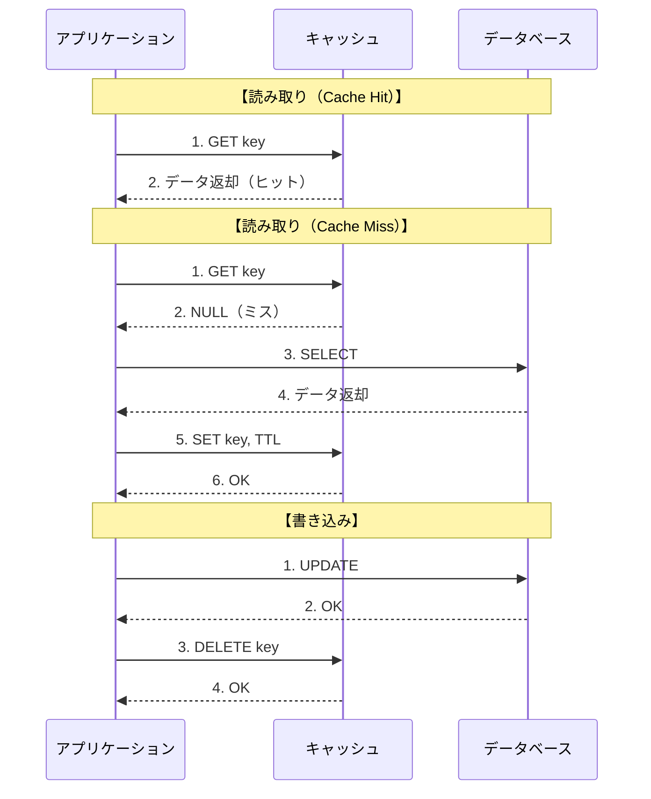

**設計ポイント：**
- 書き込み時は**キャッシュ削除**（更新ではない）が基本
  - 理由：更新だとレースコンディションで古いデータが残る可能性
- 次回読み取り時に最新データがキャッシュされる（Lazy Loading）

```python
def get_user(user_id):
    # 1. キャッシュを確認
    cached = cache.get(f"user:{user_id}")
    if cached:
        return cached  # 2. あれば返す

    # 3. なければDBから取得
    user = db.query(User).get(user_id)
    cache.set(f"user:{user_id}", user, ttl=3600)
    return user

def update_user(user_id, data):
    # 1. DBを更新
    db.query(User).filter(id=user_id).update(data)
    # 2. キャッシュを削除
    cache.delete(f"user:{user_id}")
```

**メリット：**
- シンプル
- 必要なデータだけキャッシュされる

**デメリット：**
- キャッシュミス時にレイテンシが増加
- データの不整合リスク

---

### 2. Write-Through

書き込み時に、DBとキャッシュを同時に更新します。

#### 処理フロー

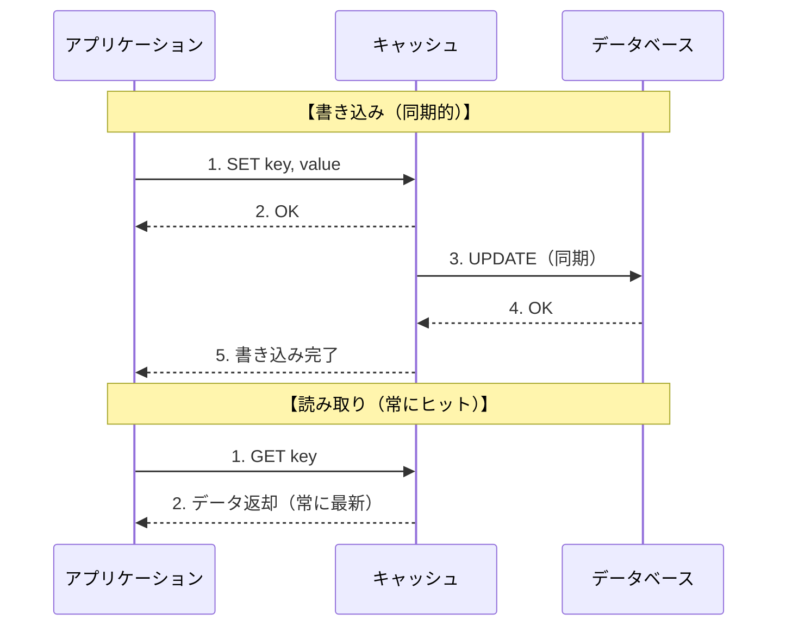

**設計ポイント：**
- キャッシュとDBの**整合性が常に保たれる**
- 書き込みがDBの速度に律速される（遅い）
- トランザクション管理が重要

```python
def update_user(user_id, data):
    # トランザクションで整合性を保証
    try:
        db.begin()
        db.query(User).filter(id=user_id).update(data)
        cache.set(f"user:{user_id}", data, ttl=3600)
        db.commit()
    except:
        db.rollback()
        cache.delete(f"user:{user_id}")
        raise
```

**メリット：**
- データの整合性が高い
- 読み取りが常に高速

**デメリット：**
- 書き込みが遅い
- 使われないデータもキャッシュされる

---

### 3. Write-Behind（Write-Back）

書き込みをキャッシュに行い、DBへは非同期で反映します。

#### 処理フロー

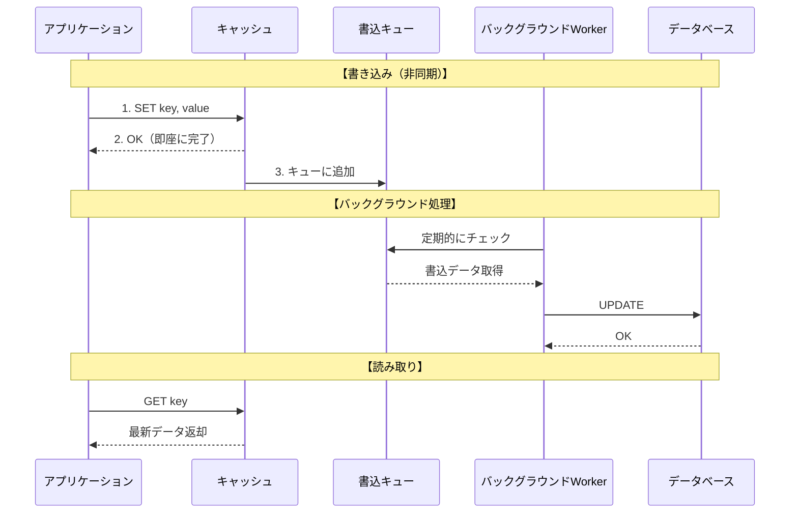

**設計ポイント：**
- 書き込みが**超高速**（キャッシュ速度）
- キャッシュクラッシュ時にデータロスリスク
- DBへの書き込みをバッチ化できる（効率的）

```python
import asyncio
from collections import deque

write_queue = deque()

def update_user(user_id, data):
    # キャッシュを即座に更新
    cache.set(f"user:{user_id}", data)
    # 書き込みキューに追加
    write_queue.append(("user", user_id, data))

async def background_writer():
    while True:
        if write_queue:
            table, id, data = write_queue.popleft()
            await db.async_update(table, id, data)
        await asyncio.sleep(0.1)
```

**メリット：**
- 書き込みが非常に高速
- DBへの書き込みをバッチ化できる

**デメリット：**
- データロスのリスク（キャッシュがクラッシュすると）
- 複雑な実装

---

### 4. Read-Through

キャッシュがDBからの読み取りを代行します。

#### 処理フロー

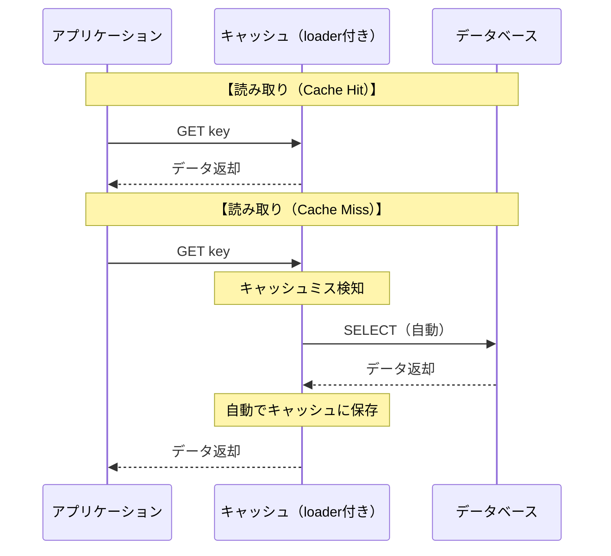

**Cache-Asideとの違い：**

| 項目 | Cache-Aside | Read-Through |
|-----|------------|--------------|
| DB取得ロジック | アプリが実装 | キャッシュが実装 |
| キャッシュミス時 | アプリが明示的にDBアクセス | キャッシュが自動でDBアクセス |
| 実装場所 | アプリケーション層 | キャッシュ層 |
| 柔軟性 | 高い | 低い |

```python
class ReadThroughCache:
    def __init__(self, loader_func):
        self.cache = {}
        self.loader = loader_func

    def get(self, key):
        if key not in self.cache:
            self.cache[key] = self.loader(key)
        return self.cache[key]

# 使用例
cache = ReadThroughCache(loader_func=lambda k: db.get_user(k))
user = cache.get("user:1234")
```

---

## TTL（Time To Live）の設計

### キャッシュエビクション戦略

キャッシュが満杯になったとき、どのデータを削除するかの戦略です。


| 戦略 | 削除対象 | メリット | デメリット | 用途 |
|-----|---------|---------|----------|------|
| **TTL** | 期限切れ | シンプル | 古くても使われるデータも削除 | 一般的 |
| **LRU** | 最も古くアクセス | バランス良い | 実装がやや複雑 | Redis default |
| **LFU** | 最も使用頻度低い | 人気データを保持 | 新規データが削除されやすい | 特殊用途 |
| **FIFO** | 最も古く追加 | 実装簡単 | アクセス頻度無視 | 非推奨 |

### TTLの決め方

```python
# TTLの決め方
TTL = min(
    データの変更頻度に基づく時間,
    ビジネス要件上許容できる遅延,
    メモリ制約から逆算した時間
)
```

### 用途別のTTL目安

| データ種別 | TTL | 理由 |
|-----------|-----|------|
| セッション | 30分〜24時間 | セキュリティとUXのバランス |
| ユーザープロフィール | 5分〜1時間 | 頻繁には変わらない |
| 商品情報 | 1分〜5分 | 在庫・価格は変動する |
| 検索結果 | 30秒〜5分 | 鮮度が重要 |
| 設定・マスターデータ | 1時間〜1日 | ほぼ変わらない |
| 静的コンテンツ | 1日〜1年 | 変更時はキャッシュバスト |

### TTLにジッターを入れる

```python
import random

def get_ttl_with_jitter(base_ttl: int) -> int:
    """TTLにランダムな揺らぎを加える"""
    jitter = random.uniform(-0.1, 0.1)  # ±10%
    return int(base_ttl * (1 + jitter))

# 使用例
cache.set("key", value, ttl=get_ttl_with_jitter(3600))
# 3240〜3960秒のランダムなTTL
```

これにより、**キャッシュ雪崩** を防げます。

---

## キャッシュの無効化

> "There are only two hard things in Computer Science: cache invalidation and naming things."
> — Phil Karlton

### 無効化の戦略

| 戦略 | 説明 | 使いどころ |
|------|------|-----------|
| TTL | 時間経過で自動削除 | 多くのケース |
| イベント駆動 | 更新時に明示的に削除 | 整合性が重要 |
| バージョニング | キーにバージョンを含める | スキーマ変更時 |
| タグベース | タグで関連キャッシュを一括削除 | 複雑な依存関係 |

### イベント駆動の無効化

```python
# 商品更新時に関連キャッシュを全て削除
def update_product(product_id, data):
    db.update_product(product_id, data)

    # 関連するキャッシュを全て削除
    cache.delete(f"product:{product_id}")
    cache.delete(f"product:{product_id}:detail")
    cache.delete(f"category:{product.category_id}:products")
    cache.delete("products:featured")
    cache.delete("products:bestsellers")
```

### バージョニング

```python
CACHE_VERSION = "v3"  # スキーマ変更時にインクリメント

def cache_key(key: str) -> str:
    return f"{CACHE_VERSION}:{key}"

# 使用例
cache.set(cache_key("user:1234"), user_data)
```

古いバージョンのキャッシュは自然にTTLで消えていきます。

---

## キャッシュの問題と対策

### 1. キャッシュスタンペード（Thundering Herd）

**問題：** キャッシュが切れた瞬間に、大量のリクエストが同時にDBに殺到する

#### 問題の可視化

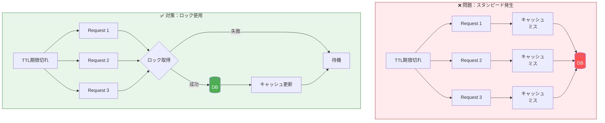

**対策1：ロック**

```python
import time

def get_with_lock(key: str):
    value = cache.get(key)
    if value:
        return value

    lock_key = f"lock:{key}"

    # ロックを取得（最初の1リクエストだけ）
    if cache.setnx(lock_key, "1", ex=10):
        try:
            value = db.get(key)
            cache.set(key, value, ttl=3600)
            return value
        finally:
            cache.delete(lock_key)
    else:
        # ロックを取れなかったら少し待ってリトライ
        time.sleep(0.1)
        return get_with_lock(key)
```

**対策2：確率的早期再計算（Probabilistic Early Recomputation）**

```python
import random
import math

def get_with_early_recompute(key: str, beta: float = 1.0):
    value, expiry = cache.get_with_expiry(key)

    if value is None:
        return recompute_and_cache(key)

    now = time.time()
    ttl = expiry - now

    # 期限が近づくにつれ、再計算の確率が上がる
    # delta = 計算にかかる時間
    delta = 0.1  # 100ms

    if ttl - delta * beta * math.log(random.random()) <= 0:
        return recompute_and_cache(key)

    return value
```

### 2. キャッシュペネトレーション

**問題：** 存在しないキーへのリクエストが毎回DBに到達する

#### 問題と対策の可視化

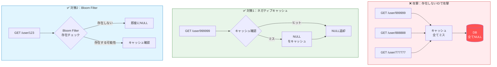

**攻撃例：**

```python
# 悪者がランダムなIDでリクエスト
GET /user/999999999  # 存在しない → 毎回DB

# 攻撃例
for i in range(1000000):
    requests.get(f"/user/{random.randint(1, 999999999)}")
```

**対策1：ネガティブキャッシュ**

```python
def get_user(user_id):
    cached = cache.get(f"user:{user_id}")
    if cached == "NULL":  # 存在しないことをキャッシュ
        return None
    if cached:
        return cached

    user = db.get_user(user_id)
    if user is None:
        cache.set(f"user:{user_id}", "NULL", ttl=60)  # 短めのTTL
        return None

    cache.set(f"user:{user_id}", user, ttl=3600)
    return user
```

**対策2：Bloom Filter**

```python
from pybloom_live import BloomFilter

# 起動時に全ユーザーIDでBloom Filterを初期化
user_bloom = BloomFilter(capacity=1000000, error_rate=0.001)
for user_id in db.get_all_user_ids():
    user_bloom.add(user_id)

def get_user(user_id):
    # Bloom Filterでチェック（高速）
    if user_id not in user_bloom:
        return None  # 確実に存在しない

    # 以降は通常のキャッシュロジック
    cached = cache.get(f"user:{user_id}")
    ...
```

### 3. キャッシュ雪崩（Cache Avalanche）

**問題：** 大量のキャッシュが同時に期限切れになり、DBに負荷が集中

#### 問題と対策の可視化

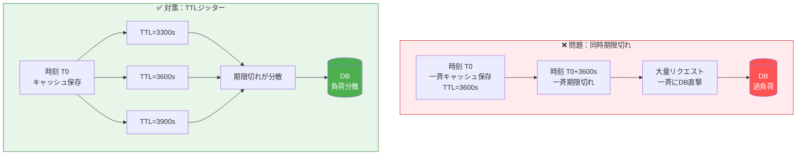

**対策：TTLにジッター（揺らぎ）を追加**

```python
import random

# 全てのキャッシュが同時に切れないよう、TTLをばらけさせる
base_ttl = 3600
jitter = random.randint(-300, 300)  # ±5分（約±8%）
cache.set(key, value, ttl=base_ttl + jitter)

# 例：
# Key1: TTL=3300s（55分）
# Key2: TTL=3600s（60分）
# Key3: TTL=3900s（65分）
# → 期限切れが10分間に分散
```

### 4. ホットキー問題

**問題：** 特定のキーにアクセスが集中し、そのキーを持つノードがボトルネックに

#### 問題と対策の可視化

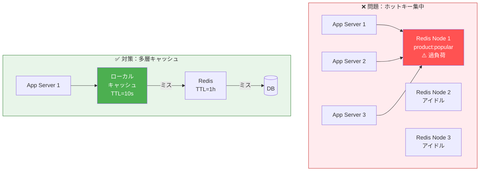

**対策1：ローカルキャッシュの併用**

```python
from cachetools import TTLCache

# アプリケーションプロセス内のキャッシュ
local_cache = TTLCache(maxsize=100, ttl=10)

def get_popular_product(product_id):
    # まずローカルキャッシュを確認
    if product_id in local_cache:
        return local_cache[product_id]

    # 次にRedis
    product = cache.get(f"product:{product_id}")
    if product:
        local_cache[product_id] = product  # ローカルにも保存
        return product

    # 最後にDB
    product = db.get_product(product_id)
    cache.set(f"product:{product_id}", product)
    local_cache[product_id] = product
    return product
```

**対策2：レプリカからの読み取り**

```python
# Redisのレプリカを使い分ける
import random

replicas = ["redis-replica-1", "redis-replica-2", "redis-replica-3"]

def get_from_replica(key):
    replica = random.choice(replicas)
    return redis.Redis(host=replica).get(key)
```

---

## 実践的なキャッシュ設計

### ケース1：ECサイトの商品ページ

階層的なキャッシュで、データの特性に応じたTTLを設定します。

#### 階層的キャッシュ構成

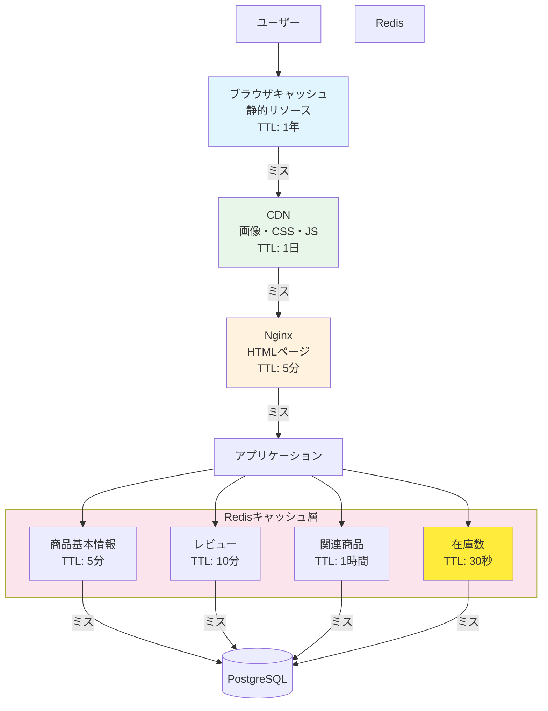

**TTL設計の根拠：**

| データ | TTL | 理由 |
|-------|-----|------|
| 静的リソース | 1年 | ほぼ不変、バージョニングで管理 |
| 商品画像 | 1日 | 頻繁には変わらない |
| HTMLページ | 5分 | 価格・在庫変更に対応 |
| 商品基本情報 | 5分 | ある程度の遅延許容 |
| レビュー | 10分 | リアルタイム性低い |
| 関連商品 | 1時間 | ほぼ変わらない |
| 在庫数 | 30秒 | **最も鮮度が重要** |

#### 実装例

```python
# 階層的なキャッシュ設計

# 1. ページ全体のHTMLキャッシュ（CDN + Nginx）
# Cache-Control: public, max-age=60, s-maxage=300

# 2. 商品データキャッシュ（Redis）
def get_product_page_data(product_id):
    return {
        "product": get_product(product_id),           # TTL: 5分
        "reviews": get_reviews(product_id),           # TTL: 10分
        "related": get_related_products(product_id),  # TTL: 1時間
        "inventory": get_inventory(product_id),       # TTL: 30秒
    }

# 3. 在庫はリアルタイム性が重要なので短いTTL
def get_inventory(product_id):
    key = f"inventory:{product_id}"
    cached = cache.get(key)
    if cached:
        return cached

    inventory = db.get_inventory(product_id)
    cache.set(key, inventory, ttl=30)
    return inventory
```

### ケース2：ソーシャルメディアのタイムライン

```python
# ファンアウト・オン・リード vs ファンアウト・オン・ライト

# ファンアウト・オン・リード（読み取り時にマージ）
def get_timeline(user_id):
    following_ids = get_following(user_id)  # フォロー中のユーザー

    posts = []
    for following_id in following_ids:
        user_posts = cache.get(f"posts:{following_id}")
        posts.extend(user_posts or [])

    return sorted(posts, key=lambda x: x["created_at"], reverse=True)[:100]

# ファンアウト・オン・ライト（書き込み時に配信）
def create_post(user_id, content):
    post = db.create_post(user_id, content)

    # フォロワー全員のタイムラインキャッシュを更新
    follower_ids = get_followers(user_id)
    for follower_id in follower_ids:
        cache.lpush(f"timeline:{follower_id}", post)
        cache.ltrim(f"timeline:{follower_id}", 0, 99)  # 100件まで
```

### ケース3：APIレート制限

```python
def rate_limit(user_id: str, limit: int = 100, window: int = 60) -> bool:
    """
    スライディングウィンドウでのレート制限
    """
    key = f"rate:{user_id}"
    now = time.time()

    pipe = redis.pipeline()

    # 古いエントリを削除
    pipe.zremrangebyscore(key, 0, now - window)

    # 現在のリクエストを追加
    pipe.zadd(key, {str(now): now})

    # カウント
    pipe.zcard(key)

    # TTL設定
    pipe.expire(key, window)

    results = pipe.execute()
    request_count = results[2]

    return request_count <= limit
```

---

## 監視とデバッグ

### Redisの監視

```bash
# リアルタイム統計
redis-cli info stats

# キーの統計
redis-cli info keyspace

# スロークエリログ
redis-cli slowlog get 10

# メモリ使用量
redis-cli info memory

# 特定キーのメモリ使用量
redis-cli memory usage "user:1234"
```

### ヒット率の計算

```python
# Redisの統計から計算
info = redis.info("stats")
hits = info["keyspace_hits"]
misses = info["keyspace_misses"]
hit_rate = hits / (hits + misses) * 100
print(f"Cache hit rate: {hit_rate:.2f}%")
```

**目標ヒット率の目安：**
- 90%未満 → TTLやキャッシュ戦略を見直す
- 95%以上 → 良好
- 99%以上 → 優秀

### キャッシュのデバッグ

```python
import logging

logger = logging.getLogger("cache")

def get_with_logging(key: str):
    value = cache.get(key)

    if value is None:
        logger.info(f"CACHE MISS: {key}")
    else:
        logger.debug(f"CACHE HIT: {key}")

    return value
```

---

## キャッシュを入れる前に考えること

### キャッシュ戦略選定フローチャート

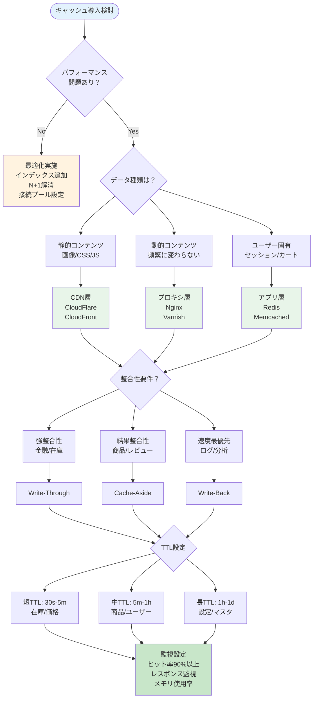

### チェックリスト

1. **本当にキャッシュが必要か？**
   - まずはクエリの最適化（インデックス、N+1解消）
   - コネクションプーリングの適切な設定
   - 非同期処理への切り替え

2. **どの層にキャッシュを入れるか？**
   - 静的コンテンツ → CDN
   - 動的だが変更少ない → リバースプロキシ
   - ユーザー固有 → アプリケーションキャッシュ

3. **データの整合性要件は？**
   - 強い整合性 → Write-Through
   - 結果整合性でOK → Cache-Aside
   - 最速が必要 → Write-Behind

4. **障害時の挙動は？**
   - キャッシュがダウンしたらどうなる？
   - 古いデータを返すのはOK？

### アンチパターン

| アンチパターン | 問題点 |
|--------------|--------|
| 何でもキャッシュ | メモリ浪費、複雑化 |
| 永久キャッシュ | データが腐る |
| キャッシュ前提の設計 | 障害時に全滅 |
| キーの設計なし | 衝突、管理不能 |

---

## まとめ

### キャッシュの7層

| 層 | 場所 | 特徴 |
|----|------|------|
| 1 | ブラウザ | 最速、ユーザーごと |
| 2 | CDN | グローバル分散 |
| 3 | リバースプロキシ | サーバー側で制御 |
| 4 | アプリケーション | 柔軟、明示的 |
| 5 | ORM | 自動化しやすい |
| 6 | データベース | 透過的 |
| 7 | ハードウェア | 意識しにくい |

### 4つのパターン

| パターン | 特徴 | 使いどころ |
|---------|------|-----------|
| Cache-Aside | シンプル | 一般的なケース |
| Write-Through | 整合性重視 | 金融系など |
| Write-Behind | 速度重視 | ログ、分析系 |
| Read-Through | 抽象化 | フレームワーク |

### 心がけ

1. **キャッシュは複雑さを増す** — 必要な場所にだけ入れる
2. **TTLは短めから始める** — 問題が起きたら調整
3. **監視を忘れない** — ヒット率を常に見る
4. **障害を想定する** — キャッシュなしでも動くように

---

## 参考リンク

- [Redis公式ドキュメント](https://redis.io/documentation)
- [Varnish公式](https://varnish-cache.org/)
- [CloudFlare Cache](https://developers.cloudflare.com/cache/)
- [Designing Data-Intensive Applications](https://dataintensive.net/) - Martin Kleppmann
- [System Design Primer - Caching](https://github.com/donnemartin/system-design-primer#cache)
