## はじめに

「CAP定理？3つから2つ選ぶやつでしょ」

これは半分正解で、半分間違いだ。

CAP定理は単なる「2択」ではない。
分散システムを設計するときの**本質的なトレードオフ**を示している。

- なぜ3つを同時に満たせないのか
- 「ネットワーク分断」は避けられるのか
- 実際のデータベースはどう選択しているのか

この記事では、CAP定理の本質から、実務での設計判断までを解説する。

---

## CAP定理とは

### 3つの特性

| 特性 | 英語 | 意味 |
|------|------|------|
| C | Consistency | 一貫性：全ノードが同じデータを返す |
| A | Availability | 可用性：リクエストに常に応答を返す |
| P | Partition Tolerance | 分断耐性：ネットワーク分断でも動作する |

### CAP定理の主張

> 分散システムにおいて、C・A・Pの3つを同時に満たすことはできない。
> 最大で2つまでしか保証できない。

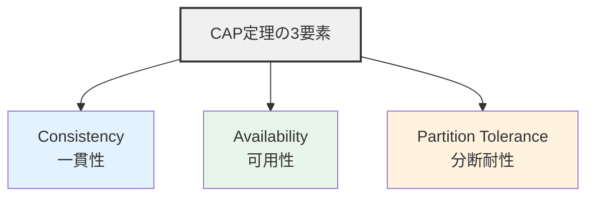

### よくある誤解

**誤解**: 「3つから2つを選ぶ」

**現実**: ネットワーク分断（P）は**避けられない**。
だから実質的には「分断が起きたとき、CとAのどちらを優先するか」という選択。

---

## なぜ3つを同時に満たせないのか

### シナリオ: ネットワーク分断が起きた

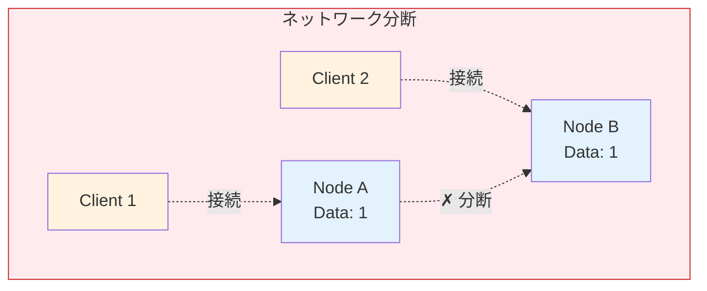

### Client 1 が Node A に書き込み

```mermaid
sequenceDiagram
    participant C1 as Client 1
    participant NA as Node A
    participant NB as Node B

    C1->>NA: WRITE data = 2
    NA->>NA: Data = 2
    NA-xNB: ✗ 分断により同期できない
    Note over NB: Data = 1 (古いまま)

    style NA fill:#e3f2fd
    style NB fill:#ffebee
```

### Client 2 が Node B から読み取りしようとする

**ここで選択が必要**:

#### 選択1: 一貫性（C）を優先

```mermaid
sequenceDiagram
    participant C2 as Client 2
    participant NB as Node B
    participant NA as Node A

    C2->>NB: READ data
    NB-xNA: ✗ 同期できない
    NB-->>C2: ERROR (利用不可)
    Note over C2,NB: 一貫性は保たれる<br/>不正確なデータは返さない<br/>可用性を失う

    style NB fill:#e3f2fd,stroke:#1976d2
    style C2 fill:#ffebee
```

**結果**: 一貫性は保たれる（不正確なデータを返さない）が、可用性を失う

#### 選択2: 可用性（A）を優先

```mermaid
sequenceDiagram
    participant C2 as Client 2
    participant NB as Node B
    participant NA as Node A

    C2->>NB: READ data
    NB-xNA: ✗ 同期できない
    NB-->>C2: data = 1 (古いデータ)
    Note over C2,NB: 可用性は保たれる<br/>応答は返す<br/>一貫性を失う

    style NB fill:#e8f5e9,stroke:#4caf50
    style C2 fill:#fff9c4
```

**結果**: 可用性は保たれる（応答は返す）が、一貫性を失う

### これがCAP定理の本質

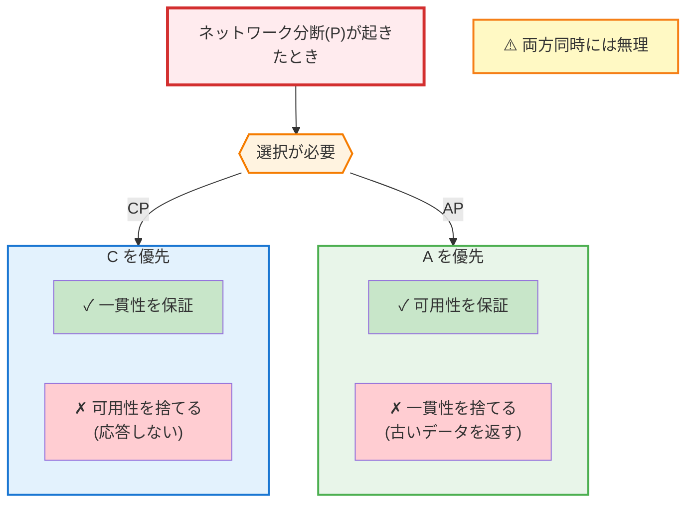

---

## CP、AP、CAの分類

### CP（一貫性 + 分断耐性）

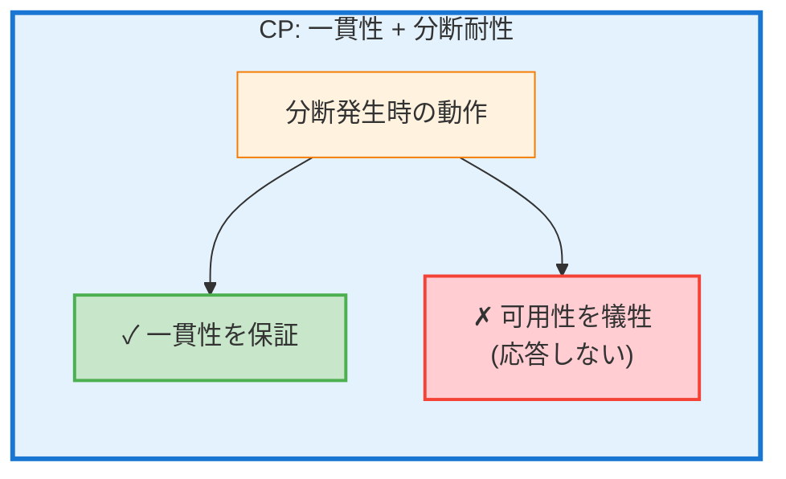

**代表的なシステム**:
- **HBase**: 強い一貫性、分断時は一部が利用不可
- **MongoDB**: デフォルトはCP（writeConcern: majority）
- **Redis Cluster**: 分断時、マイノリティ側は書き込み不可
- **Zookeeper**: 一貫性重視、過半数のノードが必要

**ユースケース**:
- 金融取引
- 在庫管理
- 予約システム
- 一貫性が絶対に必要なシステム

### AP（可用性 + 分断耐性）

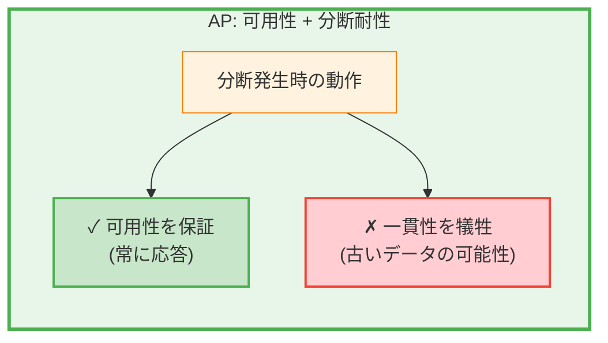

**代表的なシステム**:
- **Cassandra**: 結果整合性、常に書き込み可能
- **DynamoDB**: 結果整合性モード
- **CouchDB**: 結果整合性、コンフリクト解決
- **Riak**: 結果整合性

**ユースケース**:
- SNSのタイムライン
- ショッピングカート
- センサーデータ収集
- 可用性が最優先のシステム

### CA（一貫性 + 可用性）

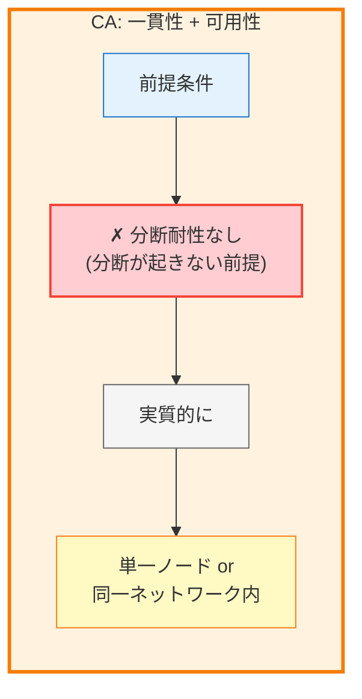

**代表的なシステム**:
- **単一ノードのRDBMS**: PostgreSQL、MySQL（レプリケーションなし）
- **同一DC内のクラスタ**: 分断が起きにくい環境

**現実**: 分散システムでは分断は避けられないため、純粋なCAは存在しない

### まとめ

| 分類 | 分断時の動作 | 代表例 |
|------|------------|-------|
| CP | 可用性を犠牲 | HBase, MongoDB, Zookeeper |
| AP | 一貫性を犠牲 | Cassandra, DynamoDB, CouchDB |
| CA | 分断は起きない前提 | 単一ノードRDBMS |

---

## 一貫性のレベル

CAP定理の「C」は強い一貫性を指すが、実際にはいくつかのレベルがある。

### 強い一貫性（Strong Consistency）

```mermaid
sequenceDiagram
    participant C as Client
    participant N1 as Node 1
    participant N2 as Node 2

    C->>N1: Write: data = 2
    N1->>N2: 同期レプリケーション
    N2-->>N1: ACK
    N1-->>C: 完了

    C->>N2: Read
    N2-->>C: data = 2 ✓
    Note over C,N2: 全ての読み取りが<br/>最新の書き込みを返す

    style N1 fill:#e3f2fd,stroke:#1976d2
    style N2 fill:#e3f2fd,stroke:#1976d2
    style C fill:#c8e6c9,stroke:#4caf50
```

**実現方法**: 同期レプリケーション、2フェーズコミット

### 結果整合性（Eventual Consistency）

```mermaid
sequenceDiagram
    participant C as Client
    participant N1 as Node 1
    participant N2 as Node 2

    C->>N1: Write: data = 2
    N1-->>C: 即座に完了
    Note over N1,N2: 非同期でレプリケーション
    N1--)N2: バックグラウンド同期

    C->>N2: Read (すぐ)
    N2-->>C: data = 1 (古いかも)

    Note over N2: 少し待つ...
    N2->>N2: 同期完了

    C->>N2: Read (後で)
    N2-->>C: data = 2 ✓
    Note over C,N2: 時間が経てば<br/>全ノードが同じデータになる

    style N1 fill:#e8f5e9,stroke:#4caf50
    style N2 fill:#e8f5e9,stroke:#4caf50
    style C fill:#fff9c4,stroke:#f57f17
```

**実現方法**: 非同期レプリケーション、バックグラウンド同期

### その他のレベル

| レベル | 説明 |
|--------|------|
| Causal Consistency | 因果関係のある操作の順序を保証 |
| Read Your Writes | 自分の書き込みは必ず読める |
| Monotonic Reads | 一度読んだ値より古い値は読まない |
| Session Consistency | セッション内での一貫性を保証 |

### 実務での選択

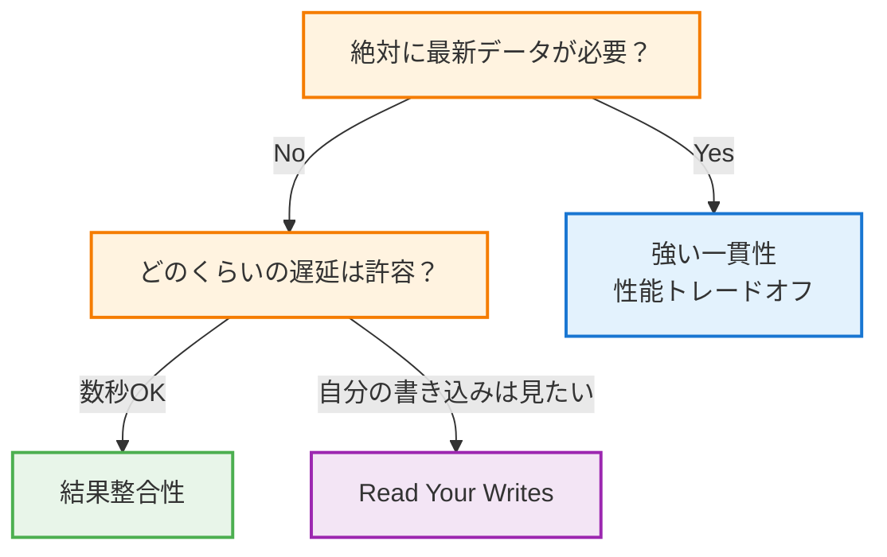

---

## 実際のデータベースの選択

### MongoDB

```javascript
// CP: 強い一貫性（デフォルト）
db.collection.insertOne(
  { name: "test" },
  { writeConcern: { w: "majority" } }
);

// AP寄り: 結果整合性（ローカル書き込み）
db.collection.insertOne(
  { name: "test" },
  { writeConcern: { w: 1 } }
);

// 読み取りも設定可能
db.collection.find().readConcern("majority");    // 強い一貫性
db.collection.find().readConcern("local");       // 結果整合性
```

### Cassandra

```cql
-- AP: 結果整合性（デフォルト）
CREATE KEYSPACE myapp WITH replication = {
  'class': 'SimpleStrategy',
  'replication_factor': 3
};

-- 一貫性レベルの指定
CONSISTENCY QUORUM;  -- 過半数が応答すればOK（CP寄り）
CONSISTENCY ONE;     -- 1ノードでOK（AP寄り）
CONSISTENCY ALL;     -- 全ノード（強い一貫性、可用性低下）
```

**Cassandraの一貫性レベル**:

| レベル | 説明 | 特性 |
|--------|------|------|
| ONE | 1ノードでOK | 最も高い可用性、低い一貫性 |
| QUORUM | 過半数 | バランス型 |
| ALL | 全ノード | 最も高い一貫性、低い可用性 |
| LOCAL_QUORUM | DC内の過半数 | DC障害に強い |

### DynamoDB

```python
import boto3

dynamodb = boto3.resource('dynamodb')
table = dynamodb.Table('MyTable')

# 結果整合性（デフォルト、安い）
response = table.get_item(Key={'id': '123'})

# 強い一貫性（高い、レイテンシ増加）
response = table.get_item(
    Key={'id': '123'},
    ConsistentRead=True
)
```

### PostgreSQL（同期レプリケーション）

```sql
-- postgresql.conf
synchronous_commit = on
synchronous_standby_names = 'replica1'

-- CP: 同期レプリケーションで強い一貫性
-- Replica に反映されるまで COMMIT が完了しない
```

---

## PACELC定理

CAP定理の拡張。より現実的なトレードオフを示す。

### PACELC の意味

```
P: Partition（分断時）
  A: Availability
  C: Consistency

E: Else（通常時）
  L: Latency
  C: Consistency
```

**読み方**:
- 分断時は A か C を選ぶ（CAP定理）
- 通常時も L（レイテンシ）か C を選ぶ必要がある

### なぜ通常時もトレードオフがあるのか

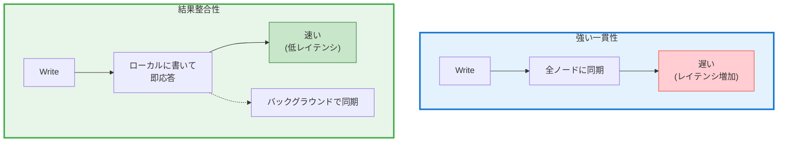

### データベースの分類（PACELC）

| システム | 分断時 (PAC) | 通常時 (ELC) |
|----------|-------------|-------------|
| Cassandra | AP | EL（低レイテンシ） |
| DynamoDB | AP | EL |
| MongoDB | CP | EC（一貫性） |
| PostgreSQL | CP | EC |
| PNUTS (Yahoo) | AP | EC |

### 実務での意味

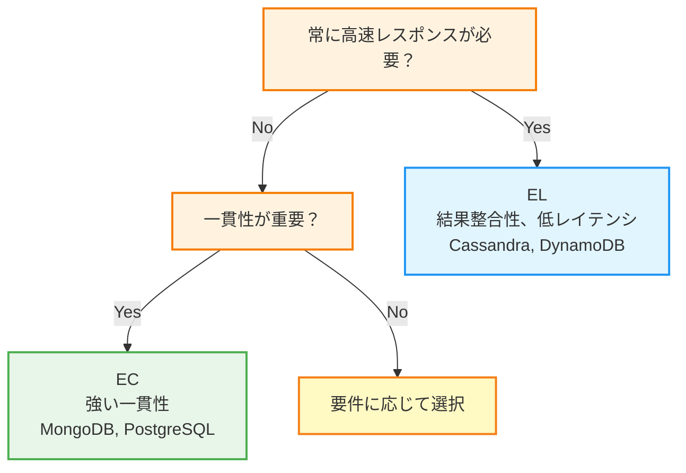

---

## 実務での設計判断

### ユースケース別の選択

#### 1. 金融取引システム

```
要件:
- 残高の一貫性が絶対
- 多少の遅延は許容
- 分断時はエラーでも構わない

選択: CP + EC
例: PostgreSQL（同期レプリケーション）
```

#### 2. SNSのタイムライン

```
要件:
- 常に表示できることが重要
- 最新じゃなくてもOK（数秒遅れは許容）
- 高スループット

選択: AP + EL
例: Cassandra
```

#### 3. ECサイトの商品カタログ

```
要件:
- 常に表示できること
- 価格は最新じゃないと困る（決済時に再確認）
- 在庫は結果整合性でも許容（カートに入れた後で確認）

選択: AP + EL（閲覧）、CP（決済）
例: DynamoDB（閲覧）+ RDS（決済）
```

#### 4. IoTセンサーデータ

```
要件:
- 大量のデータを書き込み
- 多少の欠損は許容
- リアルタイム分析

選択: AP + EL
例: Cassandra, InfluxDB
```

### ハイブリッドアプローチ

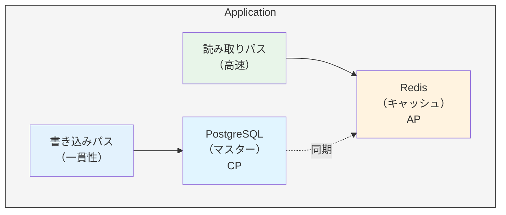

```python
class HybridDataStore:
    def __init__(self):
        self.cache = Redis()         # AP: 高速な読み取り
        self.master = PostgreSQL()   # CP: 一貫性のある書き込み

    def read(self, key):
        # まずキャッシュから
        value = self.cache.get(key)
        if value:
            return value

        # なければマスターから
        value = self.master.query(key)
        self.cache.set(key, value, ttl=60)
        return value

    def write(self, key, value):
        # マスターに書き込み（一貫性保証）
        self.master.write(key, value)

        # キャッシュを更新
        self.cache.set(key, value)
```

---

## 分断への対処パターン

### 1. フェイルオーバー（CP）

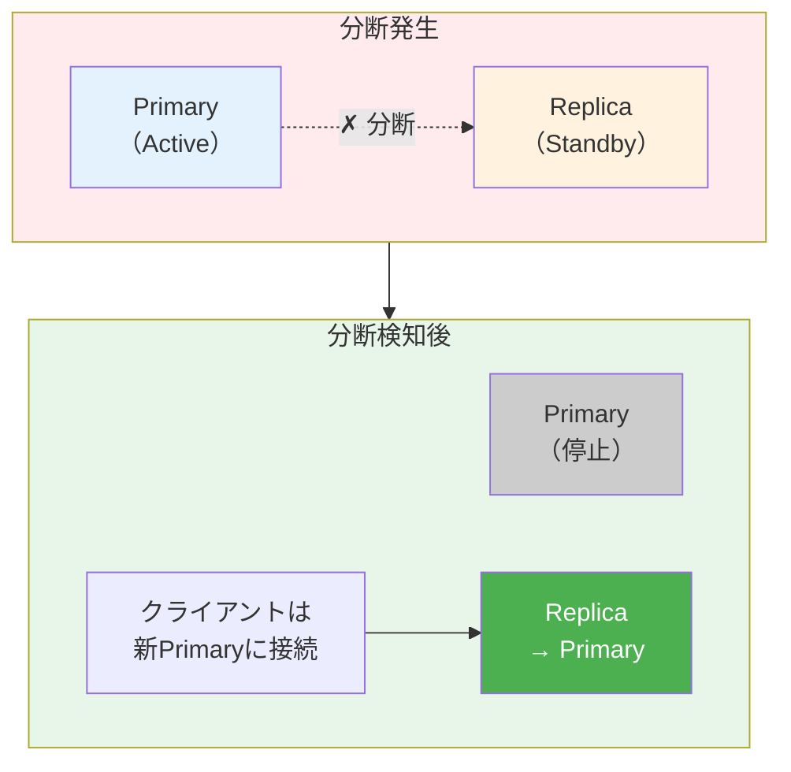

### 2. 読み取り専用モード

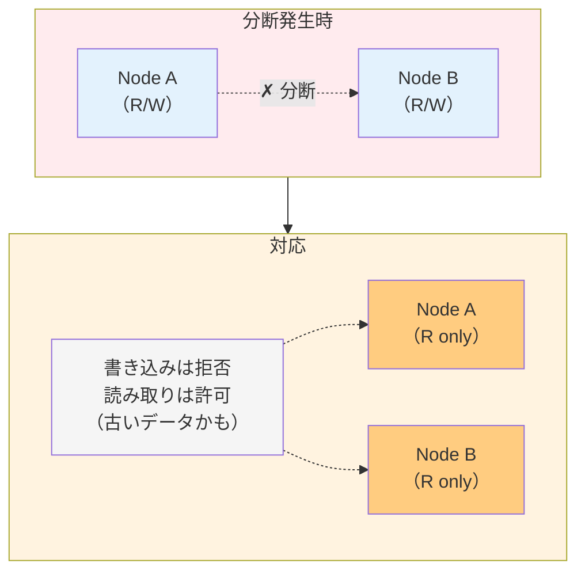

### 3. Quorum（過半数）

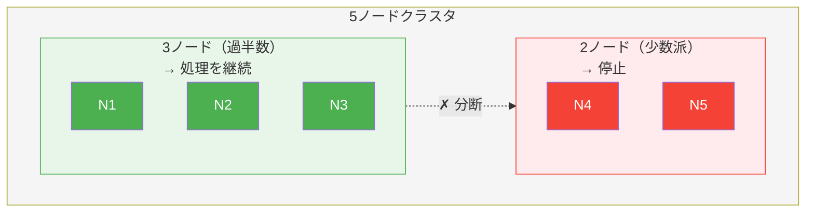

```python
# Quorum の計算
def can_process(available_nodes, total_nodes):
    quorum = (total_nodes // 2) + 1
    return available_nodes >= quorum

# 例: 5ノード中3ノードが利用可能
can_process(3, 5)  # True: 過半数があるので処理継続
can_process(2, 5)  # False: 過半数がないので停止
```

### 4. 結果整合性 + コンフリクト解決

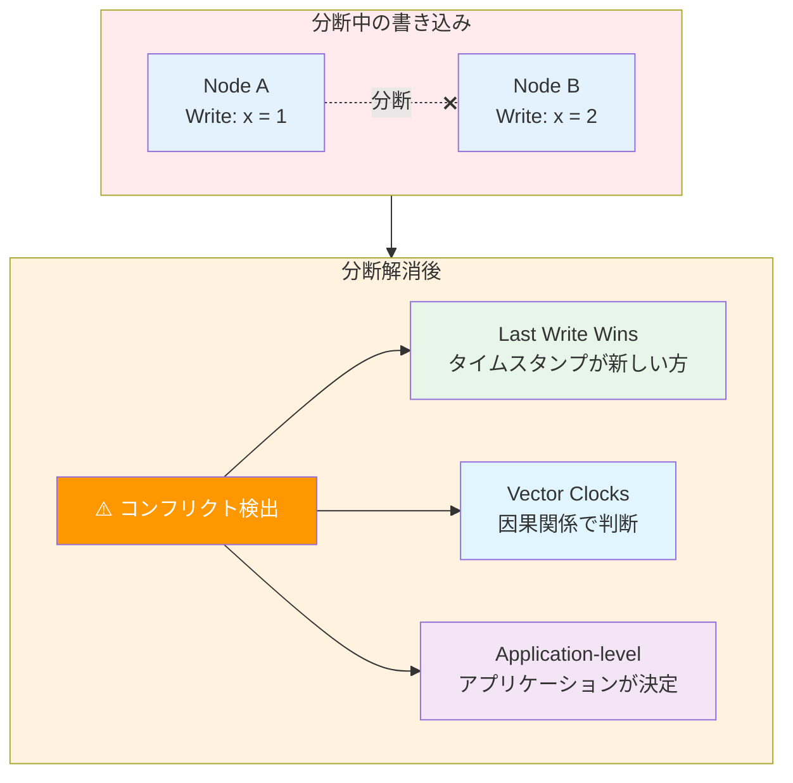

---

## 監視と運用

### 監視すべきメトリクス

| メトリクス | 説明 | 意味 |
|-----------|------|------|
| Replication Lag | レプリカの遅延 | 一貫性の度合い |
| Network Latency | ノード間の遅延 | 分断の予兆 |
| Node Health | ノードの状態 | 可用性 |
| Quorum Status | 過半数の状態 | 処理可能かどうか |

### アラート例

```yaml
groups:
  - name: cap_related
    rules:
      - alert: HighReplicationLag
        expr: replication_lag_seconds > 10
        for: 5m
        labels:
          severity: warning
        annotations:
          summary: "Replication lag is high - eventual consistency window is large"

      - alert: NetworkPartitionDetected
        expr: node_connectivity < 0.5
        for: 1m
        labels:
          severity: critical
        annotations:
          summary: "Network partition detected - CAP tradeoff in effect"

      - alert: QuorumLost
        expr: available_nodes < (total_nodes / 2) + 1
        for: 30s
        labels:
          severity: critical
        annotations:
          summary: "Quorum lost - system may become unavailable"
```

---

## 実務チェックリスト

### 設計時

- [ ] データの一貫性要件は明確か
- [ ] 可用性の要件は明確か
- [ ] 分断時の動作は決まっているか
- [ ] 結果整合性は許容できるか

### 実装時

- [ ] 一貫性レベルは適切に設定されているか
- [ ] フェイルオーバーの仕組みはあるか
- [ ] コンフリクト解決の戦略はあるか

### 運用時

- [ ] レプリケーション遅延は監視されているか
- [ ] ネットワーク分断は検知できるか
- [ ] 分断時の手順は文書化されているか

---

## まとめ

CAP定理の本質は、**分散システムにおける避けられないトレードオフ**だ。

### 重要なポイント

1. **分断（P）は避けられない**
   - 実質的には「分断時に C か A を選ぶ」
   - 「3つから2つ選ぶ」は誤解を招く表現

2. **一貫性にはレベルがある**
   - 強い一貫性と結果整合性の間にも選択肢がある
   - 要件に応じて適切なレベルを選ぶ

3. **PACELC も考慮**
   - 通常時もレイテンシと一貫性のトレードオフがある
   - 「常に高速」か「常に一貫」か

### 設計の指針

| 要件 | 選択 | 例 |
|------|------|-----|
| 一貫性が絶対 | CP + EC | 金融、予約 |
| 可用性が絶対 | AP + EL | SNS、IoT |
| バランス | 用途に応じて使い分け | ECサイト |

**CAP定理を理解することは、分散システムを設計する上での基礎教養だ。**

「何を捨てるか」を意識的に選択できるようになれば、より良いシステム設計ができる。
