## この記事で得られること

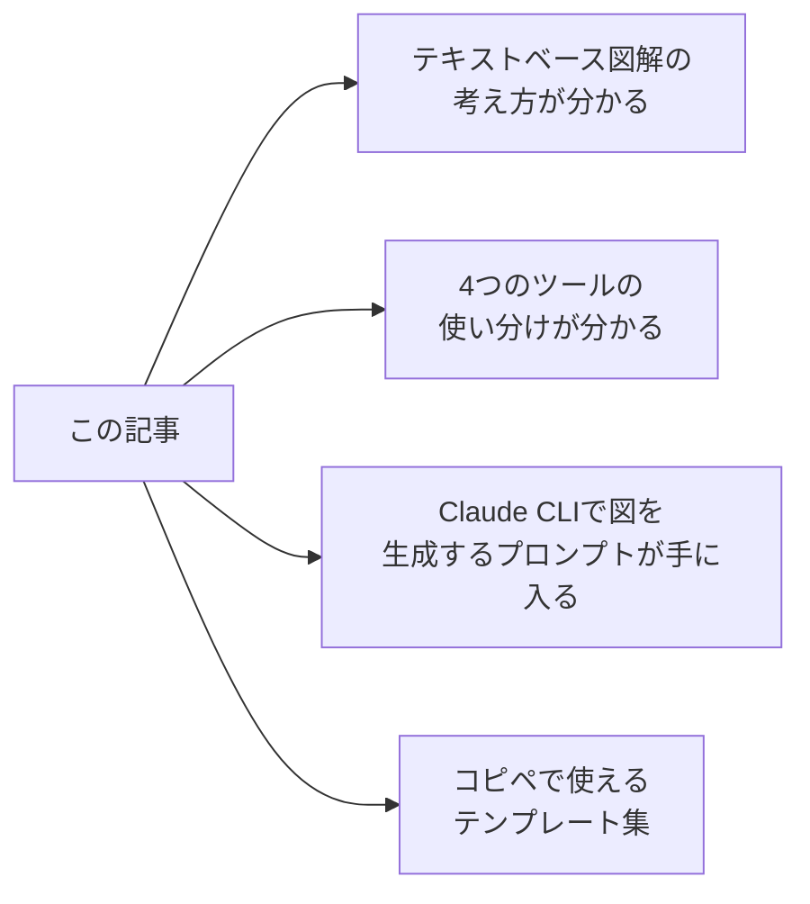

- **GUIツールを開かずに**設計図・アーキテクチャ図・シーケンス図を量産できる
- Mermaid / PlantUML / D2 / Graphviz の**使い分け基準**が明確になる
- Claude CLIに投げる**実践的なプロンプト例**がそのまま使える
- 「AIに図を描かせる」のではなく「**AIに図のソースを書かせる**」発想が身につく

---

## 目次

1. [Claude CLIだけで図解する、という考え方](#1-claude-cliだけで図解するという考え方)
2. [テキストベース図解ツールの全体マップ](#2-テキストベース図解ツールの全体マップ)
   - [🎯 同じ題材で4ツール比較：シーケンス図](#-同じ題材で4ツール比較一目で分かる違い)
   - [🏗️ 同じ題材で4ツール比較：アーキテクチャ図](#️-同じ題材で4ツール比較アーキテクチャ図)
3. [環境構築クイックスタート](#3-環境構築クイックスタート)
4. [Mermaid：Markdown & Hugo向けの定番](#4-mermaidmarkdown--hugo向けの定番)
5. [PlantUML：本格UMLと長期保守に強い選択肢](#5-plantuml本格umlと長期保守に強い選択肢)
6. [D2：構造図・アーキ図向けのモダンDSL](#6-d2構造図アーキ図向けのモダンdsl)
7. [Graphviz（DOT）：古典だけど今も強い基礎ツール](#7-graphvizdot古典だけど今も強い基礎ツール)
8. [Claude CLIとの組み合わせパターン集](#8-claude-cliとの組み合わせパターン集)
9. [用途別：どのツールを選べばいいか](#9-用途別どのツールを選べばいいか)
10. [よくあるハマりポイントと対策](#10-よくあるハマりポイントと対策)
11. [まとめ：Claude CLI時代の"図解リテラシー"](#11-まとめclaude-cli時代の図解リテラシー)

---

## 1. Claude CLIだけで図解する、という考え方

### なぜGUIではなくテキストベース図解か

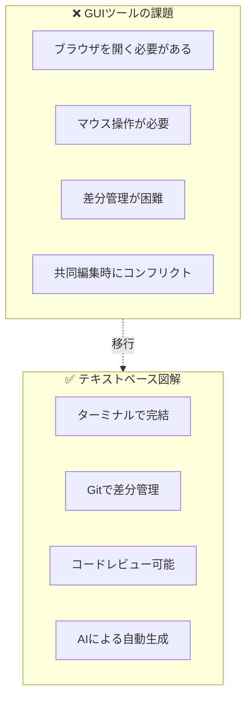

draw.io、Miro、Lucidchartなどの**GUIツール**は直感的で便利ですが、ターミナル中心のワークフローには馴染みません。

| 観点 | GUIツール | テキストベース図解 |
|------|-----------|-------------------|
| 作業環境 | ブラウザ必須 | ターミナルで完結 |
| バージョン管理 | 専用機能 or 手動 | Gitでそのまま管理 |
| 差分レビュー | スクリーンショット比較 | `git diff` で一目瞭然 |
| AI連携 | 手作業でコピペ | CLIからシームレス |
| 再現性 | 環境依存 | テキストがあれば再現可能 |

### Git管理・レビューとの相性

テキストベースの図解は、**ソースコードと同じワークフロー**で管理できます。

```bash
# 図の変更もコードレビューの対象に
$ git diff docs/architecture.mmd

-    A --> B[旧サービス]
+    A --> B[新サービス]
+    A --> C[追加されたサービス]
```

これにより：
- **Pull Requestで図の変更をレビュー**できる
- 変更履歴が**コミットログ**に残る
- **CI/CDパイプライン**で図を自動生成することも可能

### 「AIに図を描かせる」のではなく「AIに図のソースを書かせる」発想

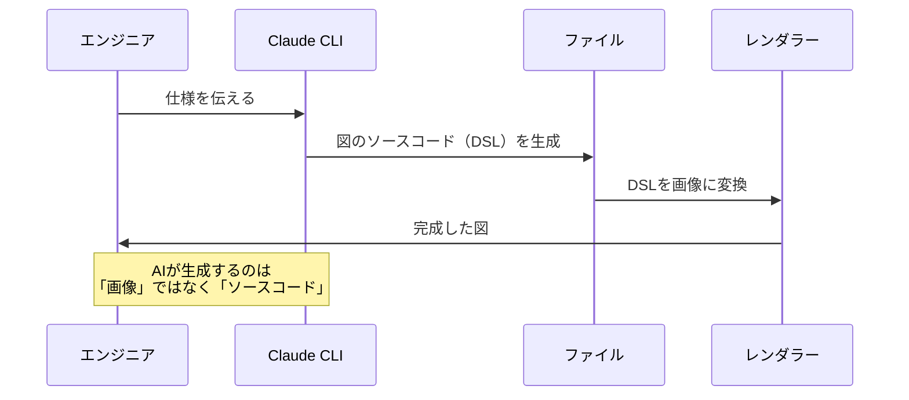

Claude CLIは**画像を直接生成するわけではありません**。生成するのは：

- Mermaidコード
- PlantUMLコード
- D2コード
- DOT言語（Graphviz）

これらの**テキストベースのDSL（ドメイン固有言語）**を生成し、レンダリングは専用ツールに任せます。

**このアプローチのメリット：**
1. 生成されたソースを**手動で微調整**できる
2. **バージョン管理**が容易
3. 同じソースから**異なるフォーマット**（PNG、SVG、PDF）を生成可能

---

## 2. テキストベース図解ツールの全体マップ

### 4つのツールの概要

まずはコード例を出さずに、各ツールの**立ち位置と用途**を整理します。

### 🎯 同じ題材で4ツール比較：一目で分かる違い

**百聞は一見にしかず**。同じ「認証フロー」を4つのツールで描いてみましょう。

> **Note**: PlantUML/D2/Graphvizの図は[Kroki](https://kroki.io/)サービスを使って画像化しています。Krokiは複数の図解ツールに対応した統一APIを提供しており、URLにエンコードしたコードを埋め込むだけで動的に画像を生成できます。

---

#### 題材：ログイン認証フロー

```
ユーザー → フロントエンド → APIサーバー → データベース
1. ログインリクエスト
2. 認証処理
3. トークン発行
4. レスポンス
```

---

#### Mermaid版

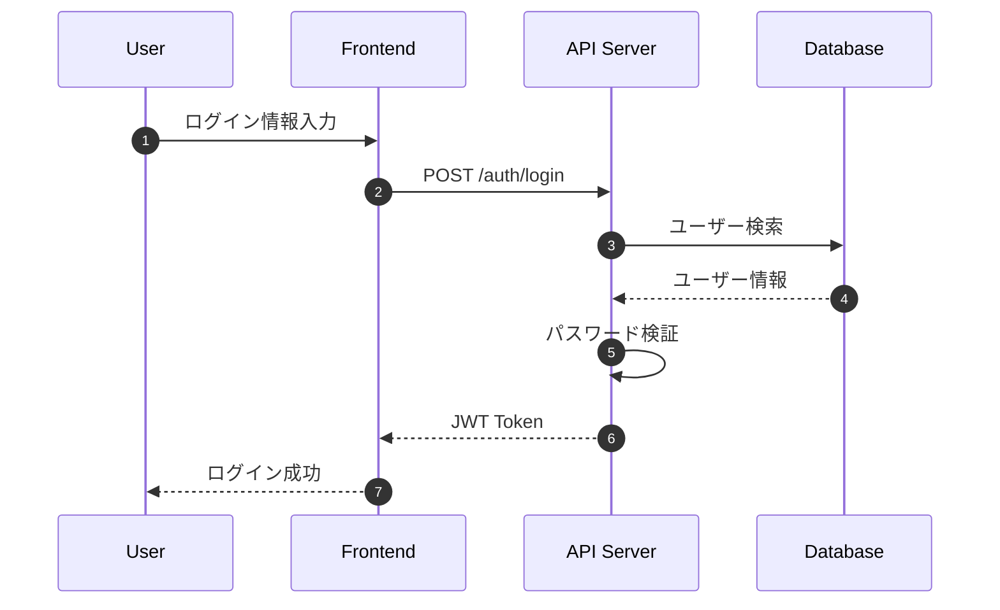

**特徴**: Markdown内で直接レンダリング。最も簡潔な記法。

---

#### PlantUML版


<details>
<summary>ソースコード（クリックで展開）</summary>

```text
@startuml
title Login Authentication Flow

actor User as U
participant "Frontend" as F
participant "API Server" as A
database "Database" as D

autonumber

U -> F: Enter login info
F -> A: POST /auth/login
A -> D: Search user
D --> A: User info
A -> A: Verify password
A --> F: JWT Token
F --> U: Login success

@enduml
```

</details>

**特徴**: `@startuml`〜`@enduml`で囲む。actor/database等のステレオタイプが豊富。

---

#### D2版


<details>
<summary>ソースコード（クリックで展開）</summary>

```text
direction: right

user: User {
  shape: person
}

frontend: Frontend

api: API Server

database: Database {
  shape: cylinder
}

user -> frontend: 1. Login info
frontend -> api: 2. POST /auth/login
api -> database: 3. Search user
database -> api: 4. User info
api -> api: 5. Verify password
api -> frontend: 6. JWT Token
frontend -> user: 7. Login success
```

</details>

**特徴**: `shape`でアイコン指定。モダンで美しいデフォルトスタイル。

---

#### Graphviz (DOT)版


<details>
<summary>ソースコード（クリックで展開）</summary>

```text
digraph AuthFlow {
    rankdir=LR;
    node [shape=box, style=filled, fillcolor=lightblue];

    User [shape=ellipse, fillcolor=lightyellow];
    Frontend [label="Frontend"];
    API [label="API Server"];
    Database [shape=cylinder, fillcolor=lightgreen];

    User -> Frontend [label="1. Login info"];
    Frontend -> API [label="2. POST /auth/login"];
    API -> Database [label="3. Search user"];
    Database -> API [label="4. User info", style=dashed];
    API -> API [label="5. Verify password"];
    API -> Frontend [label="6. JWT Token", style=dashed];
    Frontend -> User [label="7. Login success", style=dashed];
}
```

</details>

**特徴**: `rankdir`でレイアウト方向指定。細かいスタイル制御が可能。

---

### 📊 4ツール比較まとめ（この題材から分かること）

| 観点 | Mermaid | PlantUML | D2 | Graphviz |
|------|---------|----------|-----|----------|
| **記法の簡潔さ** | ◎ 最も短い | ○ やや冗長 | ○ 読みやすい | △ 冗長 |
| **シーケンス図の表現力** | ◎ | ◎ | △ | ✕ 不向き |
| **そのままブログに貼れる** | ◎ | ✕ 要変換 | ✕ 要変換 | ✕ 要変換 |
| **見た目の美しさ** | ○ | ○ | ◎ | △ |
| **カスタマイズ性** | △ | ◎ | ○ | ◎ |

> **結論**: シーケンス図なら **Mermaid** か **PlantUML** がベスト。D2/Graphvizはシーケンス図より構成図向き。

---

### 🏗️ 同じ題材で4ツール比較：アーキテクチャ図

次に、**3層アーキテクチャ**を4ツールで描き比べます。

---

#### 題材：Webアプリの3層アーキテクチャ

```
[ユーザー] → [Webサーバー] → [APIサーバー] → [データベース]
              ↓
           [キャッシュ]
```

---

#### Mermaid版

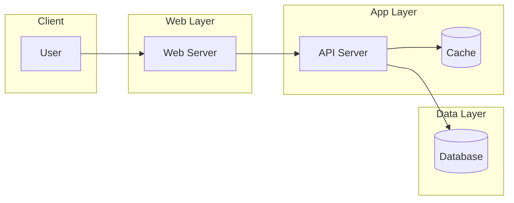

**特徴**: `subgraph`でグループ化。`[( )]`でシリンダー形状。

---

#### PlantUML版


<details>
<summary>ソースコード（クリックで展開）</summary>

```text
@startuml
title 3-Tier Architecture

package "Client" {
    actor User
}

package "Web Layer" {
    [Web Server] as W
}

package "App Layer" {
    [API Server] as A
    database "Cache" as C
}

package "Data Layer" {
    database "Database" as D
}

User --> W
W --> A
A --> C
A --> D

@enduml
```

</details>

**特徴**: `package`でグループ化。コンポーネント図として正式なUML。

---

#### D2版


<details>
<summary>ソースコード（クリックで展開）</summary>

```text
direction: right

client: Client {
    user: User {
        shape: person
    }
}

web: Web Layer {
    server: Web Server
}

app: App Layer {
    api: API Server
    cache: Cache {
        shape: cylinder
    }
}

data: Data Layer {
    db: Database {
        shape: cylinder
    }
}

client.user -> web.server
web.server -> app.api
app.api -> app.cache
app.api -> data.db
```

</details>

**特徴**: ネストした構造が自然に書ける。`direction`でレイアウト指定。

---

#### Graphviz (DOT)版


<details>
<summary>ソースコード（クリックで展開）</summary>

```text
digraph Architecture {
    rankdir=LR;
    compound=true;

    subgraph cluster_client {
        label="Client";
        style=filled;
        fillcolor=lightyellow;
        User [shape=ellipse];
    }

    subgraph cluster_web {
        label="Web Layer";
        style=filled;
        fillcolor=lightblue;
        WebServer [label="Web Server"];
    }

    subgraph cluster_app {
        label="App Layer";
        style=filled;
        fillcolor=lightgreen;
        APIServer [label="API Server"];
        Cache [shape=cylinder];
    }

    subgraph cluster_data {
        label="Data Layer";
        style=filled;
        fillcolor=lightpink;
        Database [shape=cylinder];
    }

    User -> WebServer;
    WebServer -> APIServer;
    APIServer -> Cache;
    APIServer -> Database;
}
```

</details>

**特徴**: `cluster_`プレフィックスで囲み。スタイル制御が最も細かい。

---

### 📊 4ツール比較まとめ（アーキテクチャ図）

| 観点 | Mermaid | PlantUML | D2 | Graphviz |
|------|---------|----------|-----|----------|
| **記法の簡潔さ** | ○ | ○ | ◎ 最も直感的 | △ |
| **アーキ図の表現力** | ○ | ○ | ◎ | ◎ |
| **そのままブログに貼れる** | ◎ | ✕ | ✕ | ✕ |
| **見た目の美しさ** | ○ | ○ | ◎ モダン | △ クラシック |
| **ネスト構造** | △ 1階層のみ | ○ | ◎ 深いネスト可 | ○ |

> **結論**: アーキテクチャ図なら **D2** が最も表現力が高い。ブログ埋め込み前提なら **Mermaid**。

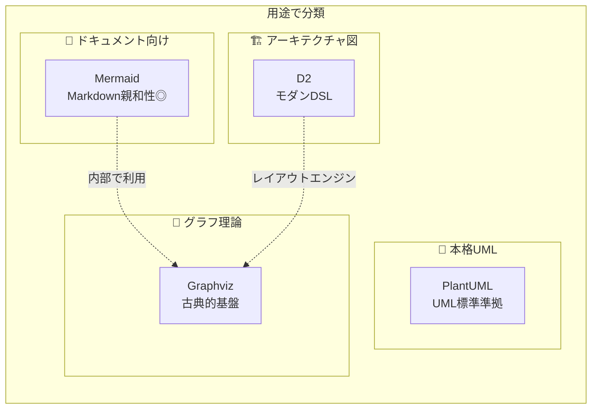

### Mermaid / PlantUML / D2 / Graphviz のざっくり比較

| ツール | 主な用途 | 学習コスト | Markdown埋め込み | 特徴 |
|--------|---------|-----------|------------------|------|
| **Mermaid** | フロー図、シーケンス図 | 低 | ◎ ネイティブ対応 | GitHub/GitLab/Hugoで直接レンダリング |
| **PlantUML** | 本格UML（クラス図、ER図など） | 中 | △ 要変換 | UML標準に準拠、企業ドキュメント向き |
| **D2** | アーキテクチャ図、構成図 | 中 | △ 要変換 | モダンな構文、美しいデフォルトスタイル |
| **Graphviz** | 関係グラフ、依存関係図 | 中〜高 | △ 要変換 | 他ツールの基盤、高度なレイアウト制御 |

### どんな図が描けるか（機能マトリクス）

| 図の種類 | Mermaid | PlantUML | D2 | Graphviz |
|---------|---------|----------|-----|----------|
| フローチャート | ✅ | ✅ | ✅ | ✅ |
| シーケンス図 | ✅ | ✅ | ✅ | ⚠️ |
| クラス図 | ✅ | ✅ | ✅ | ⚠️ |
| ER図 | ✅ | ✅ | ✅ | ⚠️ |
| 状態遷移図 | ✅ | ✅ | ⚠️ | ✅ |
| ガントチャート | ✅ | ✅ | ❌ | ❌ |
| 円グラフ | ✅ | ❌ | ❌ | ❌ |
| マインドマップ | ✅ | ✅ | ❌ | ⚠️ |
| アーキテクチャ図 | ⚠️ | ⚠️ | ✅ | ✅ |
| インフラ構成図 | ⚠️ | ⚠️ | ✅ | ⚠️ |

✅ = 得意 / ⚠️ = 可能だが他ツール推奨 / ❌ = 非対応

---

## 3. 環境構築クイックスタート

各ツールの**最小限のセットアップ手順**を紹介します。

### Mermaid CLI（mmdc）

```bash
# Node.jsが必要
npm install -g @mermaid-js/mermaid-cli

# 確認
mmdc --version

# 使い方
mmdc -i input.mmd -o output.png
mmdc -i input.mmd -o output.svg
```

> **Note**: Hugo や GitHub では、Markdown内に直接Mermaidを書けばレンダリングされるため、CLI不要な場合も多いです。

### PlantUML

```bash
# Javaが必要
# macOS
brew install plantuml

# Ubuntu/Debian
sudo apt install plantuml

# 確認
plantuml -version

# 使い方
plantuml input.puml           # PNG生成
plantuml -tsvg input.puml     # SVG生成
```

### D2

```bash
# macOS
brew install d2

# Linux（公式インストールスクリプト）
curl -fsSL https://d2lang.com/install.sh | sh

# 確認
d2 --version

# 使い方
d2 input.d2 output.png
d2 input.d2 output.svg
d2 --watch input.d2 output.svg  # ホットリロード
```

### Graphviz

```bash
# macOS
brew install graphviz

# Ubuntu/Debian
sudo apt install graphviz

# 確認
dot -V

# 使い方
dot -Tpng input.dot -o output.png
dot -Tsvg input.dot -o output.svg
```

### Claude CLI

```bash
# Claude CLIのインストール（公式手順に従う）
# https://docs.anthropic.com/en/docs/claude-cli

# 基本的な使い方
claude "Mermaidでフローチャートを書いて"

# ファイル内容を渡す
cat spec.md | claude "この仕様からシーケンス図を生成して"

# 結果をファイルに保存
claude "認証フローのMermaid図を書いて" > auth-flow.mmd
```

---

## 4. Mermaid：Markdown & Hugo向けの定番

### Mermaidとは

**Mermaid**は、Markdown内に直接埋め込めるテキストベースの図解ツールです。GitHub、GitLab、Notion、Hugoなど多くのプラットフォームでネイティブサポートされています。

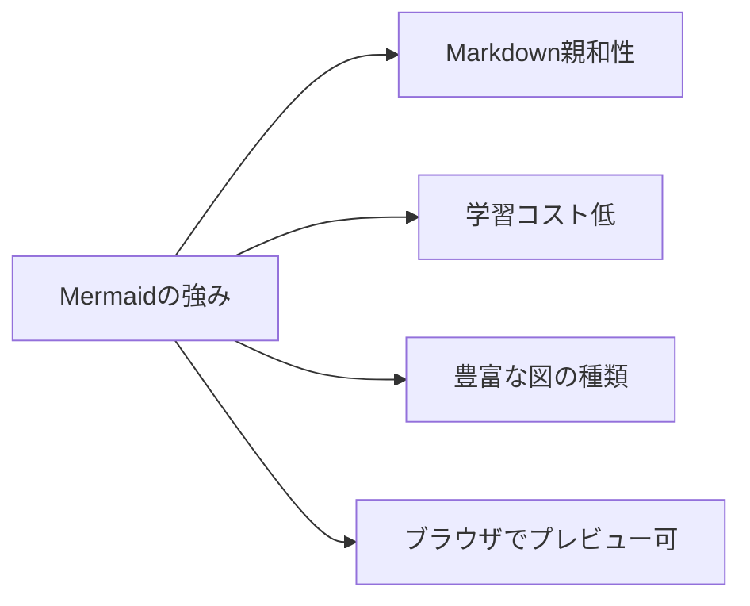

### 対応している図の種類

1. **フローチャート**（graph / flowchart）
2. **シーケンス図**（sequenceDiagram）
3. **クラス図**（classDiagram）
4. **状態遷移図**（stateDiagram-v2）
5. **ER図**（erDiagram）
6. **ガントチャート**（gantt）
7. **円グラフ**（pie）
8. **マインドマップ**（mindmap）
9. **タイムライン**（timeline）
10. **Git グラフ**（gitGraph）

### 実践例：フローチャート

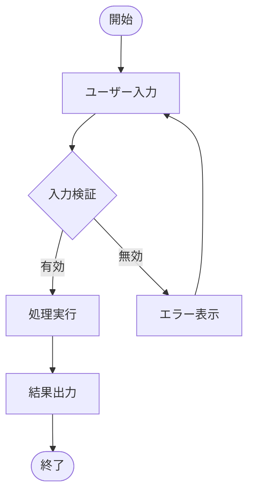

**ソースコード：**

````markdown

````

### 実践例：シーケンス図

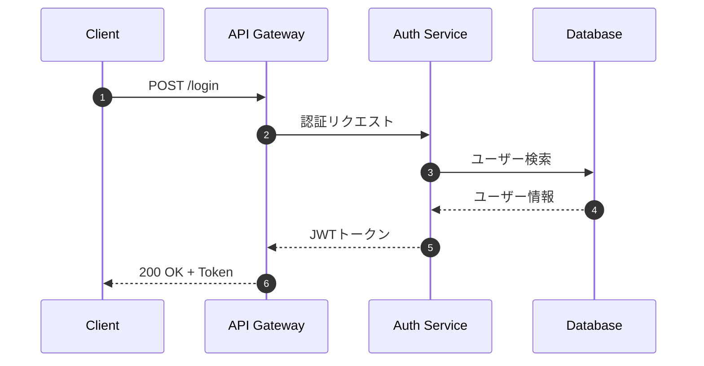

### 実践例：ER図

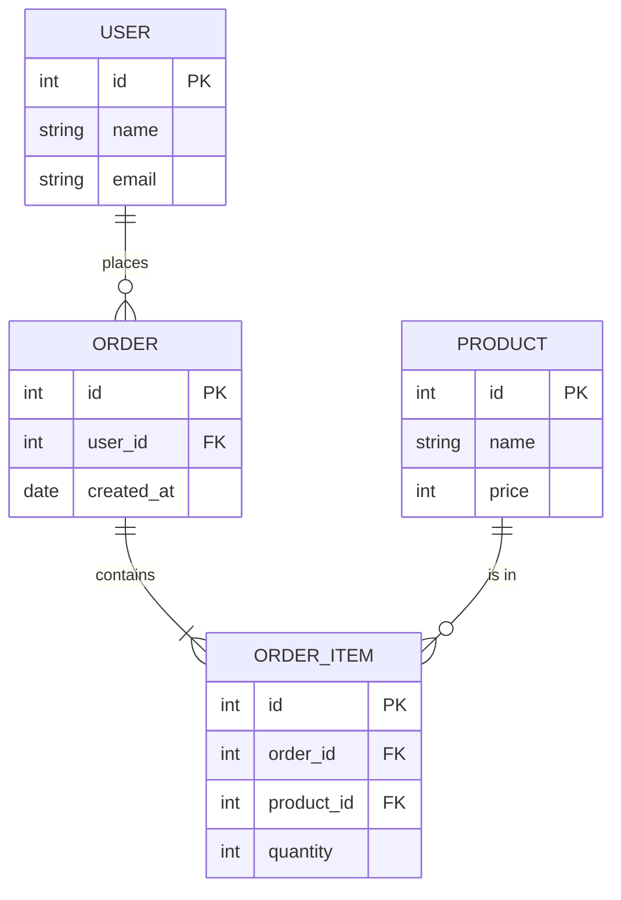

### Claude CLIに投げるプロンプト例

#### プロンプト例1：仕様書からシーケンス図を生成

```bash
cat << 'EOF' | claude "この仕様からMermaidのシーケンス図を生成してください。コードブロックのみ出力してください。"
## ログイン仕様
1. ユーザーがメールアドレスとパスワードを入力
2. フロントエンドがAPIサーバーにPOSTリクエスト
3. APIサーバーがDBでユーザーを検索
4. パスワードをbcryptで検証
5. 成功時：JWTトークンを発行してレスポンス
6. 失敗時：401エラーを返却
EOF
```

#### プロンプト例2：処理フローからフローチャートを生成

```bash
claude "次の処理フローをMermaidのflowchartで図解してください：
1. ファイルをアップロード
2. ファイル形式をチェック（JPG/PNG/GIFのみ許可）
3. 不正なら「形式エラー」を表示して終了
4. ファイルサイズをチェック（5MB以下のみ）
5. 超過なら「サイズエラー」を表示して終了
6. S3にアップロード
7. URLをDBに保存
8. 成功レスポンスを返却"
```

#### プロンプト例3：テーブル定義からER図を生成

```bash
cat schema.sql | claude "このSQLスキーマからMermaidのER図を生成してください"
```

### 技術ブログでの使いどころ

| ユースケース | 図の種類 | 効果 |
|-------------|---------|------|
| API設計の説明 | シーケンス図 | リクエスト/レスポンスの流れが一目瞭然 |
| アルゴリズム解説 | フローチャート | 条件分岐が視覚的に理解できる |
| DB設計の紹介 | ER図 | テーブル間の関係を直感的に把握 |
| プロジェクト進捗 | ガントチャート | スケジュールを可視化 |
| 機能一覧 | マインドマップ | 階層構造を俯瞰 |

---

## 5. PlantUML：本格UMLと長期保守に強い選択肢

### PlantUMLとは

**PlantUML**は、UML標準に準拠した本格的な図解ツールです。Mermaidより記法は冗長ですが、その分**細かい制御**が可能です。

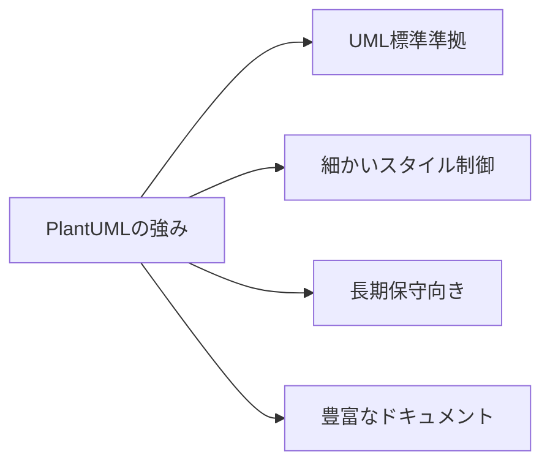

### Mermaidとの使い分け

| 観点 | Mermaid | PlantUML |
|------|---------|----------|
| 学習コスト | 低い | やや高い |
| 記法の簡潔さ | 簡潔 | やや冗長 |
| UML準拠度 | 緩め | 厳密 |
| スタイルカスタマイズ | 限定的 | 柔軟 |
| 企業ドキュメント | △ | ◎ |
| 技術ブログ | ◎ | ○ |

**使い分けの指針：**
- **ブログやREADME** → Mermaid
- **設計書や仕様書** → PlantUML
- **UML標準が求められる場面** → PlantUML

### 実践例：シーケンス図

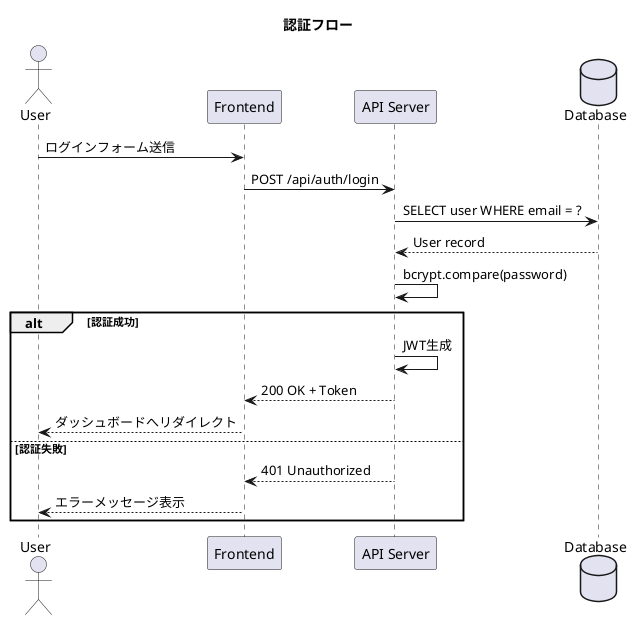

### 実践例：クラス図

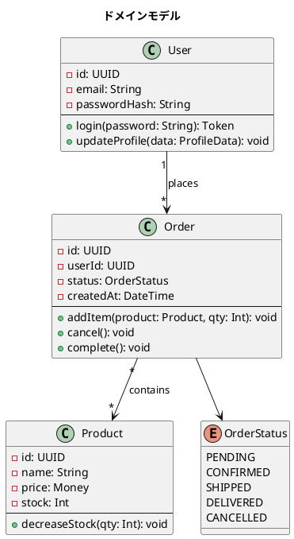

### 実践例：コンポーネント図

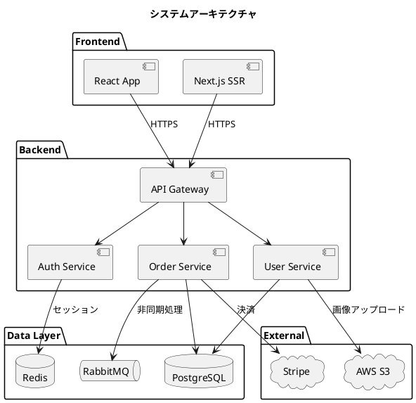

### Claude CLIに投げるプロンプト例

#### プロンプト例1：クラス設計からクラス図を生成

```bash
cat << 'EOF' | claude "このクラス設計からPlantUMLのクラス図を生成してください。@startumlと@endumlで囲んでください。"
## Userクラス
- プロパティ: id, email, name, createdAt
- メソッド: updateProfile(), changePassword()

## Postクラス
- プロパティ: id, title, content, authorId, publishedAt
- メソッド: publish(), unpublish(), edit()

## Commentクラス
- プロパティ: id, postId, authorId, content, createdAt
- メソッド: edit(), delete()

## 関係
- UserはPostを複数持つ（1対多）
- PostはCommentを複数持つ（1対多）
- UserはCommentを複数持つ（1対多）
EOF
```

#### プロンプト例2：API仕様からシーケンス図を生成

```bash
cat openapi.yaml | claude "このOpenAPI仕様の主要なエンドポイントをPlantUMLのシーケンス図で表現してください"
```

### CLIでのワークフロー

```bash
# 1. Claude CLIでPlantUMLコードを生成
claude "ユーザー登録フローをPlantUMLで" > register.puml

# 2. PlantUMLでレンダリング
plantuml register.puml           # PNG生成
plantuml -tsvg register.puml     # SVG生成

# 3. 確認
open register.png  # macOS
xdg-open register.png  # Linux
```

---

## 6. D2：構造図・アーキ図向けのモダンDSL

### D2とは

**D2**（Declarative Diagramming）は、2022年にリリースされた比較的新しい図解ツールです。特に**アーキテクチャ図やインフラ構成図**に強みがあります。

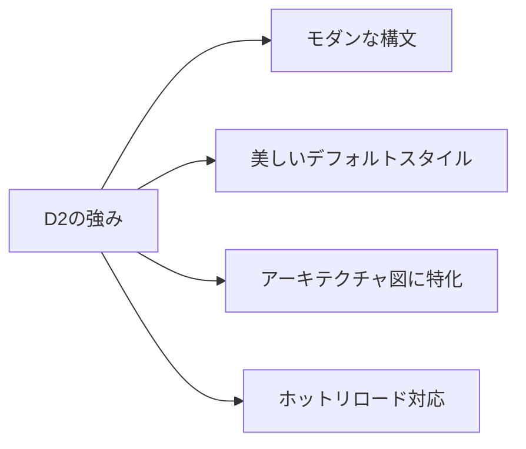

### D2の特徴

| 特徴 | 説明 |
|------|------|
| **宣言的記法** | 直感的で読みやすい構文 |
| **自動レイアウト** | 複数のレイアウトエンジン選択可能 |
| **スタイリング** | 豊富なテーマとカスタマイズ |
| **アイコン対応** | クラウドプロバイダのアイコンを組み込み |
| **アニメーション** | SVGアニメーション対応 |

### 実践例：インフラ構成図

```d2
direction: right

users: Users {
  icon: https://icons.terrastruct.com/essentials/003-user.svg
}

load_balancer: Load Balancer {
  icon: https://icons.terrastruct.com/aws/Networking%20&%20Content%20Delivery/Elastic-Load-Balancing.svg
}

web: Web Servers {
  icon: https://icons.terrastruct.com/aws/Compute/Amazon-EC2.svg

  web1: Server 1
  web2: Server 2
  web3: Server 3
}

api: API Servers {
  icon: https://icons.terrastruct.com/aws/Compute/AWS-Lambda.svg

  api1: Lambda 1
  api2: Lambda 2
}

cache: Redis Cache {
  icon: https://icons.terrastruct.com/aws/Database/Amazon-ElastiCache.svg
}

db: PostgreSQL {
  icon: https://icons.terrastruct.com/aws/Database/Amazon-RDS.svg

  primary: Primary
  replica: Read Replica

  primary -> replica: Replication
}

storage: S3 Storage {
  icon: https://icons.terrastruct.com/aws/Storage/Amazon-Simple-Storage-Service-S3.svg
}

users -> load_balancer: HTTPS
load_balancer -> web.web1
load_balancer -> web.web2
load_balancer -> web.web3
web -> api
api -> cache: Read/Write
api -> db.primary: Write
api -> db.replica: Read
api -> storage: Upload/Download
```

### 実践例：サービス間の関係図

```d2
title: マイクロサービスアーキテクチャ {
  near: top-center
}

gateway: API Gateway {
  shape: hexagon
}

auth: Auth Service {
  jwt: JWT Handler
  oauth: OAuth Provider
}

user: User Service {
  crud: CRUD Operations
  profile: Profile Manager
}

order: Order Service {
  cart: Cart Manager
  checkout: Checkout
}

payment: Payment Service {
  stripe: Stripe Integration
  invoice: Invoice Generator
}

notification: Notification Service {
  email: Email Sender
  push: Push Notification
}

queue: Message Queue {
  shape: queue
}

db: Databases {
  user_db: Users DB {
    shape: cylinder
  }
  order_db: Orders DB {
    shape: cylinder
  }
}

gateway -> auth: Authenticate
gateway -> user: User API
gateway -> order: Order API

auth -> user: Validate User
order -> payment: Process Payment
payment -> notification: Send Receipt
order -> notification: Order Updates

order -> queue: Async Events
queue -> notification: Consume

user -> db.user_db
order -> db.order_db
```

### 実践例：フローチャート

```d2
start: Start {
  shape: oval
}

input: Receive File Upload

validate_type: Check File Type {
  shape: diamond
}

validate_size: Check File Size {
  shape: diamond
}

type_error: Show Type Error {
  style: {
    fill: "#ffcccc"
  }
}

size_error: Show Size Error {
  style: {
    fill: "#ffcccc"
  }
}

upload: Upload to S3

save_db: Save URL to DB

success: Return Success {
  style: {
    fill: "#ccffcc"
  }
}

end: End {
  shape: oval
}

start -> input
input -> validate_type
validate_type -> type_error: Invalid
validate_type -> validate_size: Valid
type_error -> end
validate_size -> size_error: Too Large
validate_size -> upload: OK
size_error -> end
upload -> save_db
save_db -> success
success -> end
```

### Claude CLIに投げるプロンプト例

#### プロンプト例1：インフラ構成をD2で図解

```bash
cat << 'EOF' | claude "このインフラ構成をD2形式で図解してください。AWSアイコンは使わず、シンプルな形状で表現してください。"
## インフラ構成
- フロントエンド: CloudFront + S3で静的ホスティング
- バックエンド: ECS Fargate で3台のコンテナ
- DB: Aurora PostgreSQL（Writer 1台 + Reader 2台）
- キャッシュ: ElastiCache Redis
- キュー: SQS
- ストレージ: S3
EOF
```

#### プロンプト例2：マイクロサービス構成をD2で図解

```bash
claude "ECサイトのマイクロサービス構成をD2で図解してください。
サービス: API Gateway, 認証, ユーザー管理, 商品管理, 注文管理, 決済, 通知
通信: 同期はHTTPS、非同期はメッセージキュー経由"
```

### メリット・デメリット

**メリット：**
- モダンで直感的な構文
- 美しいデフォルトスタイル
- `--watch` オプションでホットリロード
- 複数のレイアウトエンジン（dagre, elk, tala）

**デメリット：**
- 比較的新しいため情報が少ない
- シーケンス図はMermaid/PlantUMLより弱い
- ガントチャートなど一部の図は非対応

---

## 7. Graphviz（DOT）：古典だけど今も強い基礎ツール

### Graphvizとは

**Graphviz**は1991年にAT&Tで開発された、グラフ描画ツールの古典です。**DOT言語**という専用DSLで記述します。

MermaidやD2も内部でGraphvizのレイアウトエンジンを利用しており、まさに**図解ツールの基盤**です。

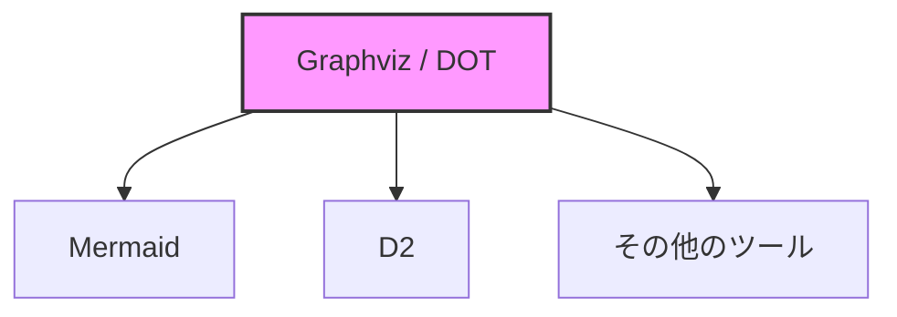

### DOT言語の基本構文

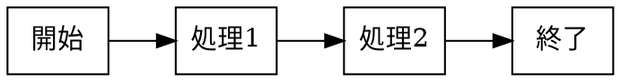

### 実践例：依存関係グラフ

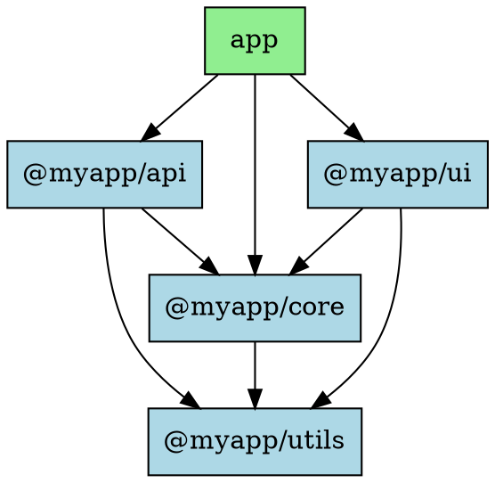

### 実践例：状態遷移図

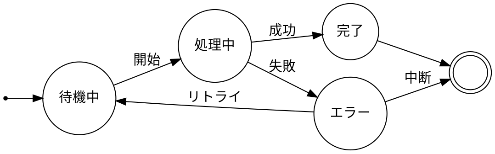

### Claude CLIに投げるプロンプト例

#### プロンプト例1：モジュール依存関係をDOTで生成

```bash
cat package.json | claude "このpackage.jsonの依存関係をGraphviz DOT形式で図解してください。devDependenciesは別の色にしてください。"
```

#### プロンプト例2：ディレクトリ構造をDOTで表現

```bash
tree -d src/ | claude "このディレクトリ構造をGraphviz DOT形式で木構造として表現してください"
```

### 他ツールに吸収されている場面

直接Graphvizを使う場面は減っていますが、以下のケースでは今も有用です：

1. **既存資産がDOT形式** → 無理に移行せず使い続ける
2. **複雑なグラフ理論的な図** → 最も柔軟なレイアウト制御
3. **他ツールで表現できない図** → 最終手段として

---

## 8. Claude CLIとの組み合わせパターン集

### 基本パターン：仕様 → 図DSL → レンダリング

```mermaid
flowchart LR
    A[仕様書<br>Markdown/テキスト] --> B[Claude CLI]
    B --> C[図のDSL<br>Mermaid/PlantUML/D2/DOT]
    C --> D[レンダリングツール<br>mmdc/plantuml/d2/dot]
    D --> E[画像/SVG]
```

### パターン1：標準入力から生成してファイル保存

```bash
# 仕様書を渡してMermaid生成
cat spec.md | claude "この仕様からMermaidのシーケンス図を生成。コードブロックのみ出力。" > sequence.mmd

# Mermaid CLIでレンダリング
mmdc -i sequence.mmd -o sequence.png
```

### パターン2：ワンライナーで図を生成

```bash
# 直接プロンプトを渡す
claude "3層アーキテクチャをMermaidで" > architecture.mmd && mmdc -i architecture.mmd -o architecture.png
```

### パターン3：既存コードから図を生成

```bash
# Pythonクラスからクラス図を生成
cat models.py | claude "このPythonコードからPlantUMLのクラス図を生成" > class-diagram.puml
plantuml class-diagram.puml
```

### パターン4：複数ファイルをまとめて処理

```bash
# 複数のAPIエンドポイントからシーケンス図を一括生成
for file in api/*.py; do
  name=$(basename "$file" .py)
  cat "$file" | claude "このAPIハンドラのフローをMermaidシーケンス図で" > "docs/diagrams/${name}.mmd"
done
```

### パターン5：リファクタリング前後の比較図

```bash
# Before
git show HEAD~1:src/architecture.ts | claude "このコードのアーキテクチャをD2で" > before.d2

# After
cat src/architecture.ts | claude "このコードのアーキテクチャをD2で" > after.d2

# 両方をレンダリングして比較
d2 before.d2 before.png
d2 after.d2 after.png
```

### プロンプトテンプレート集

#### テンプレート1：シーケンス図生成

```bash
claude "以下の処理フローをMermaidのシーケンス図で表現してください。

条件:
- 参加者は日本語で命名
- autonumberを付与
- エラーケースもaltで表現

処理フロー:
$FLOW_DESCRIPTION"
```

#### テンプレート2：ER図生成

```bash
claude "以下のテーブル定義からMermaidのER図を生成してください。

条件:
- リレーションは ||--o{ などの記法を正しく使用
- 主キーにはPK、外部キーにはFKを明記

テーブル:
$TABLE_DEFINITIONS"
```

#### テンプレート3：アーキテクチャ図生成

```bash
claude "以下のシステム構成をD2で図解してください。

条件:
- 外部サービスは雲の形で表現
- データベースは円柱形で表現
- 通信プロトコルをラベルに記載

構成:
$SYSTEM_ARCHITECTURE"
```

#### テンプレート4：フローチャート生成

```bash
claude "以下のビジネスロジックをMermaidのflowchartで表現してください。

条件:
- 開始・終了は楕円
- 条件分岐は菱形
- 処理は長方形
- Yes/Noを日本語で

ロジック:
$BUSINESS_LOGIC"
```

### 生成 → プレビュー → 画像化の流れ

```mermaid
sequenceDiagram
    participant Dev as 開発者
    participant Claude as Claude CLI
    participant Editor as エディタ/ブラウザ
    participant CLI as レンダリングCLI

    Dev->>Claude: プロンプト + 仕様
    Claude->>Dev: DSLコード
    Dev->>Editor: DSLをプレビュー

    alt 修正が必要
        Dev->>Dev: 手動で微調整
    end

    Dev->>CLI: レンダリング実行
    CLI->>Dev: PNG/SVG出力
```

**プレビュー方法：**

| ツール | プレビュー方法 |
|--------|---------------|
| Mermaid | [Mermaid Live Editor](https://mermaid.live/) またはVSCode拡張 |
| PlantUML | [PlantUML Web Server](http://www.plantuml.com/plantuml/) またはVSCode拡張 |
| D2 | `d2 --watch input.d2 output.svg` でホットリロード |
| Graphviz | [Graphviz Online](https://dreampuf.github.io/GraphvizOnline/) またはVSCode拡張 |

---

## 9. 用途別：どのツールを選べばいいか

### ツール選択フローチャート

```mermaid
flowchart TD
    Start([図を作りたい]) --> Q1{Markdownに<br>直接埋め込む?}

    Q1 -->|はい| Mermaid[✅ Mermaid]
    Q1 -->|いいえ| Q2{UML標準に<br>準拠が必要?}

    Q2 -->|はい| PlantUML[✅ PlantUML]
    Q2 -->|いいえ| Q3{インフラ/アーキ図?}

    Q3 -->|はい| D2[✅ D2]
    Q3 -->|いいえ| Q4{複雑なグラフ?}

    Q4 -->|はい| Graphviz[✅ Graphviz]
    Q4 -->|いいえ| Simple[Mermaidで十分]

    Simple --> Mermaid
```

### ユースケース別の推奨ツール

| ユースケース | 第一候補 | 代替 | 理由 |
|-------------|---------|------|------|
| **技術ブログの図解** | Mermaid | - | Markdown埋め込み可能、学習コスト低 |
| **README.mdの図** | Mermaid | - | GitHubで直接レンダリング |
| **設計書のUML** | PlantUML | Mermaid | UML標準準拠、細かい制御可能 |
| **クラス図（詳細）** | PlantUML | Mermaid | 可視性・メソッド表現が豊富 |
| **シーケンス図** | Mermaid | PlantUML | 簡潔な記法、十分な表現力 |
| **インフラ構成図** | D2 | PlantUML | モダンな見た目、アイコン対応 |
| **マイクロサービス図** | D2 | Mermaid | 複雑な関係を美しく表現 |
| **依存関係グラフ** | Graphviz | D2 | 自動レイアウトが優秀 |
| **ガントチャート** | Mermaid | PlantUML | ネイティブ対応 |
| **ER図** | Mermaid | PlantUML | 簡潔に書ける |

### 迷ったときの判断基準

```mermaid
graph TB
    subgraph "迷ったらMermaid"
        M1[学習コストを抑えたい]
        M2[Markdown/Hugoで使う]
        M3[GitHub/GitLabで見せたい]
        M4[とりあえず図を作りたい]
    end

    subgraph "PlantUMLを選ぶとき"
        P1[UML標準が求められる]
        P2[細かいスタイル制御したい]
        P3[既存のPlantUML資産がある]
    end

    subgraph "D2を選ぶとき"
        D1[インフラ/アーキ図メイン]
        D2[モダンな見た目が欲しい]
        D3[ホットリロードで編集したい]
    end

    subgraph "Graphvizを選ぶとき"
        G1[既存DOT資産がある]
        G2[複雑なグラフ理論的な図]
        G3[他ツールで無理だった]
    end
```

---

## 10. よくあるハマりポイントと対策

### ハマり1：図が読めないほどカオスになる

**症状：** ノードが多すぎて線が交差しまくり、何が何だか分からない

```mermaid
graph LR
    A[問題] --> B[対策]

    B --> C[サブグラフで分割]
    B --> D[rankdirを変える]
    B --> E[図を複数に分ける]
```

**対策：**

1. **サブグラフで論理的にグループ化**
```mermaid
graph TB
    subgraph Frontend
        A[React] --> B[Next.js]
    end
    subgraph Backend
        C[API] --> D[DB]
    end
    Frontend --> Backend
```

2. **方向を変えてみる（TB → LR など）**
3. **1つの図に詰め込みすぎない → 複数の図に分割**

### ハマり2：AIに任せすぎると中身が分からなくなる

**症状：** Claude が生成した図のDSLが理解できず、修正できない

**対策：**

1. **基本構文は自分で学ぶ**
   - 最低限の読み書きができるレベルまで習得
   - 公式ドキュメントのチュートリアルを一度やる

2. **生成後に必ず読む**
   - 何が書いてあるか理解してからコミット
   - 分からない記法があったら調べる

3. **少しずつ生成させる**
   - 「全部作って」ではなく「この部分だけ」で依頼
   - 大きな図は部分ごとに生成して自分で組み立てる

### ハマり3：レイアウトが思い通りにならない

**症状：** ノードの配置が意図と違う、線が変なところを通る

**対策：**

1. **割り切る**
   - テキストベース図解の限界を受け入れる
   - 「だいたい合ってればOK」の精神

2. **ヒントを与える**
   - Mermaid: `subgraph`で論理グループ化
   - Graphviz: `rank=same`で同じ高さに配置
   - D2: `direction`で方向指定

3. **別のレイアウトエンジンを試す**
   - D2: `--layout elk` や `--layout dagre`
   - Graphviz: `dot`の代わりに`neato`や`fdp`

### ハマり4：Mermaidでエラーが出る

**症状：** 特殊文字やキーワードでパースエラー

**対策：**

```mermaid
graph LR
    A["特殊文字は引用符で囲む"]
    B["コロン(:)は要注意"]
    C["改行は<br>で"]
```

1. **ノード名に特殊文字を使わない**
2. **どうしても使うなら引用符で囲む**
3. **Mermaid Live Editor でエラーを確認**

### ハマり5：バージョン間の非互換

**症状：** ローカルで動くのにGitHub/Hugoで動かない

**対策：**

1. **ターゲット環境のMermaidバージョンを確認**
2. **新しい記法は避ける（安全側に倒す）**
3. **プレビュー環境を本番に合わせる**

---

## 11. まとめ：Claude CLI時代の"図解リテラシー"

### 「図を描く」から「図のソースを書く」へ

```mermaid
graph TB
    subgraph 従来["従来のワークフロー"]
        O1[GUIツールを開く] --> O2[マウスで描画]
        O2 --> O3[画像をエクスポート]
        O3 --> O4[ドキュメントに貼り付け]
    end

    subgraph 新時代["Claude CLI時代"]
        N1[仕様をテキストで記述] --> N2[Claude CLIで図DSL生成]
        N2 --> N3[必要に応じて微調整]
        N3 --> N4[CLIでレンダリング or Markdownに埋め込み]
    end

    従来 -.->|"パラダイムシフト"| 新時代
```

### テキストベース図解の習慣を持つメリット

| メリット | 説明 |
|---------|------|
| **再現性** | 同じソースから同じ図が生成される |
| **バージョン管理** | Gitで差分管理、履歴追跡 |
| **コードレビュー** | PRで図の変更もレビュー可能 |
| **自動化** | CI/CDで図を自動生成 |
| **AI連携** | Claude CLIでソース生成 → 人間が微調整 |
| **ポータビリティ** | テキストなのでどこでも編集可能 |

### ツール選択の最終まとめ

```mermaid
graph LR
    subgraph 推奨["迷ったらこれ"]
        Mermaid[Mermaid]
    end

    subgraph 用途別["用途で選ぶ"]
        PlantUML[PlantUML<br>本格UML]
        D2[D2<br>アーキ図]
        Graphviz[Graphviz<br>複雑なグラフ]
    end

    Start([図を作りたい]) --> Mermaid
    Mermaid -.->|"足りなければ"| 用途別
```

### これからの図解ワークフロー

1. **Claude CLIに仕様を渡す** → 図のDSLを生成させる
2. **生成されたDSLを読んで理解する** → 必要なら微調整
3. **Markdown に埋め込む or CLIでレンダリング**
4. **Gitでバージョン管理**

この流れを習慣化すれば、ターミナルから一歩も出ずに、**再現性が高く、レビュー可能な図**を量産できます。

---

## 参考リンク

### 公式ドキュメント

- **Mermaid**: [https://mermaid.js.org/](https://mermaid.js.org/)
- **PlantUML**: [https://plantuml.com/](https://plantuml.com/)
- **D2**: [https://d2lang.com/](https://d2lang.com/)
- **Graphviz**: [https://graphviz.org/](https://graphviz.org/)

### Claude CLI

- **Anthropic公式ドキュメント**: [https://docs.anthropic.com/](https://docs.anthropic.com/)
- **Claude Code**: [https://claude.ai/code](https://claude.ai/code)

### プレビューツール

- **Mermaid Live Editor**: [https://mermaid.live/](https://mermaid.live/)
- **PlantUML Web Server**: [http://www.plantuml.com/plantuml/](http://www.plantuml.com/plantuml/)
- **D2 Playground**: [https://play.d2lang.com/](https://play.d2lang.com/)
- **Graphviz Online**: [https://dreampuf.github.io/GraphvizOnline/](https://dreampuf.github.io/GraphvizOnline/)

### VSCode拡張機能

- **Mermaid Preview**: Markdown内のMermaidをプレビュー
- **PlantUML**: PlantUMLのシンタックスハイライトとプレビュー
- **D2**: D2ファイルのシンタックスハイライト
- **Graphviz Preview**: DOTファイルのプレビュー

---

**この記事が役に立ったら、ぜひ実践してみてください。**

ターミナルだけで図を量産する体験は、一度味わうと戻れなくなります。
