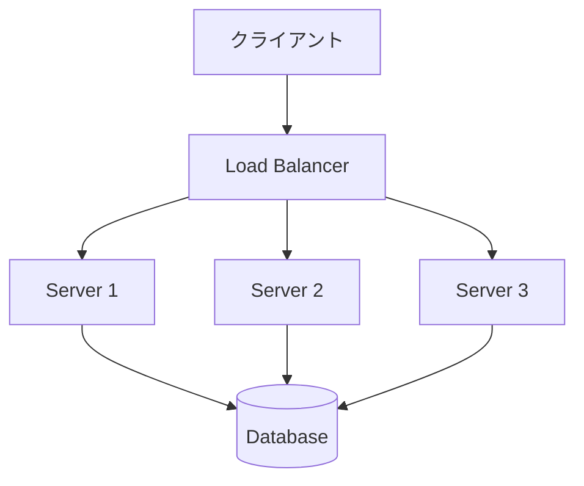
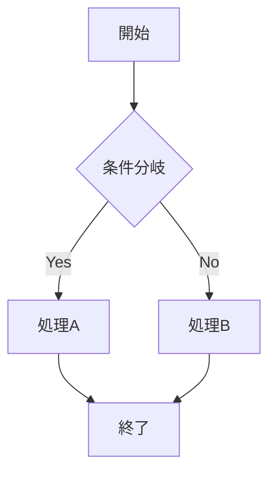
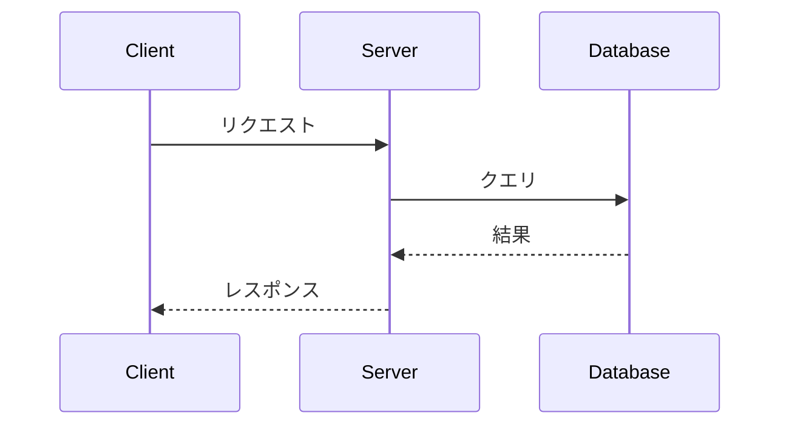
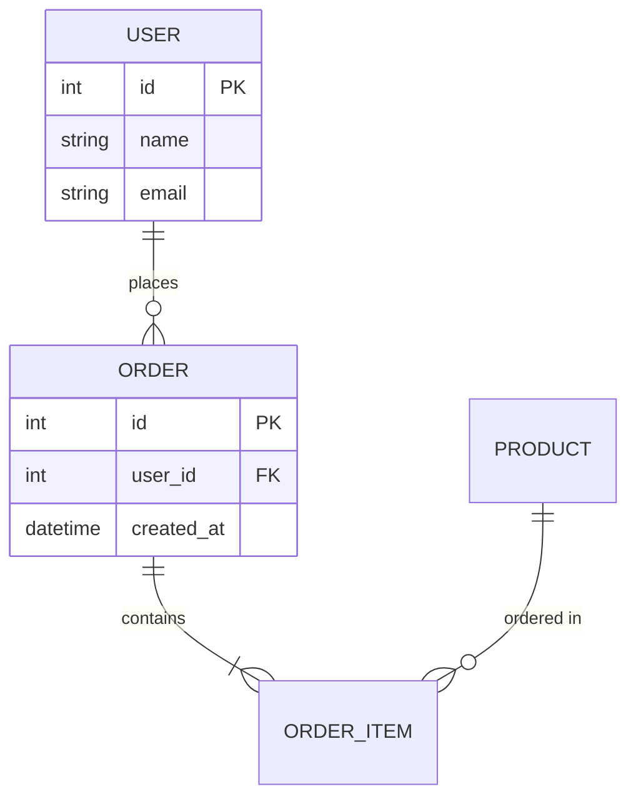
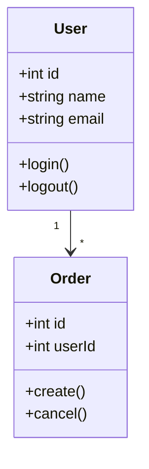
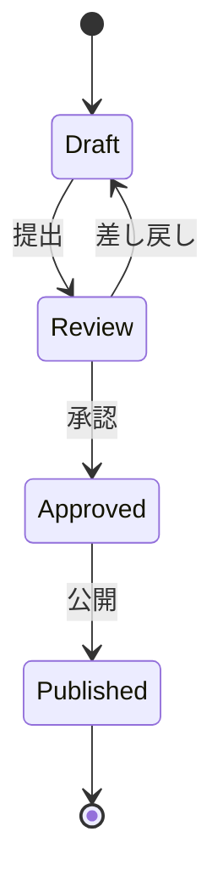
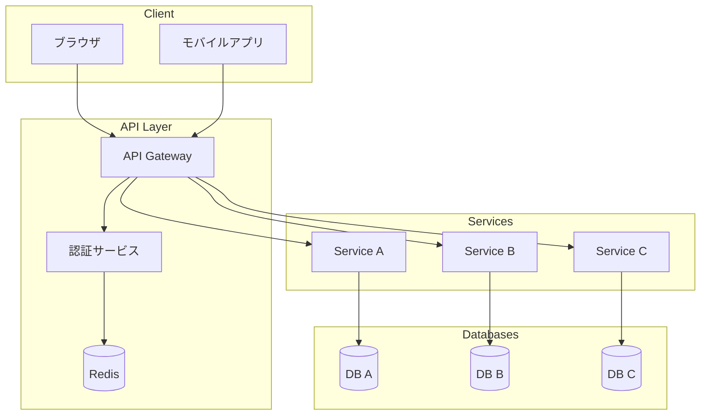

## はじめに

Claude Code、使ってますか？

「コード書いてもらう」だけで使っていたら、もったいない。

- システム設計図を自動生成
- カスタムコマンドでワークフロー自動化
- MCPサーバーでGitHub連携
- フックで自動フォーマット

**知っているかどうかで、生産性が3倍変わる。**

この記事では、実務で使えるClaude Codeのおすすめスキルを紹介する。

---

## 図の生成：Mermaid記法

### Claude Codeで図を作る最強の方法

Claude Codeに「図を作って」と頼むと、**Mermaid記法**で生成してくれる。

```
あなた: 「ロードバランサーの構成図を作って」

Claude: 以下のMermaid図を生成しました：
```



### Mermaidで作れる図

#### 1. フローチャート



#### 2. シーケンス図



#### 3. ER図



#### 4. クラス図



#### 5. 状態遷移図



### Hugoブログでの表示方法

PaperModテーマでMermaidを有効化:

```toml
# hugo.toml
[params]
  mermaid = true
```

または、`layouts/partials/extend_head.html`を作成:

```html
<script src="https://cdn.jsdelivr.net/npm/mermaid/dist/mermaid.min.js"></script>
<script>
  mermaid.initialize({ startOnLoad: true, theme: 'neutral' });
</script>
```

### 実践的なプロンプト例

```
「以下のシステムの構成図をMermaidで作成してください：
- クライアントからAPIゲートウェイを経由
- 認証サービスでJWT検証
- マイクロサービスA,B,Cに振り分け
- 各サービスは専用DBを持つ
- Redisでセッション管理」
```

**結果**:



---

## MCPサーバー：Claude Codeの拡張機能

### MCPとは

**Model Context Protocol**: Claude Codeに外部ツールを接続する仕組み。

```
Claude Code + MCP Server = 超強力なツール
```

### おすすめMCPサーバー

#### 1. GitHub MCP

```json
// ~/.claude/settings.json
{
  "mcpServers": {
    "github": {
      "command": "npx",
      "args": ["-y", "@modelcontextprotocol/server-github"],
      "env": {
        "GITHUB_PERSONAL_ACCESS_TOKEN": "ghp_xxxxx"
      }
    }
  }
}
```

**できること**:
- PRの作成・レビュー
- Issueの管理
- リポジトリの検索
- ファイルの取得

```
あなた: 「このリポジトリの最新PRを確認して」
Claude: [GitHub MCPを使用してPR一覧を取得]
```

#### 2. Filesystem MCP

```json
{
  "mcpServers": {
    "filesystem": {
      "command": "npx",
      "args": ["-y", "@modelcontextprotocol/server-filesystem", "/path/to/allowed/dir"]
    }
  }
}
```

**できること**:
- ファイルの読み書き
- ディレクトリ操作
- ファイル検索

#### 3. Brave Search MCP

```json
{
  "mcpServers": {
    "brave-search": {
      "command": "npx",
      "args": ["-y", "@anthropic/mcp-brave-search"],
      "env": {
        "BRAVE_API_KEY": "xxxxx"
      }
    }
  }
}
```

**できること**:
- Web検索
- 最新情報の取得
- リファレンス収集

```
あなた: 「Next.js 15の新機能について調べて」
Claude: [Brave Searchで検索して最新情報を取得]
```

#### 4. SQLite MCP

```json
{
  "mcpServers": {
    "sqlite": {
      "command": "npx",
      "args": ["-y", "@modelcontextprotocol/server-sqlite", "--db-path", "/path/to/db.sqlite"]
    }
  }
}
```

**できること**:
- SQLクエリの実行
- データベースの操作
- スキーマの確認

### MCPサーバーの確認

```bash
# 現在有効なMCPサーバーを確認
claude mcp list
```

---

## カスタムコマンド：ワークフローの自動化

### カスタムコマンドとは

よく使う操作を、スラッシュコマンドとして登録できる。

```
.claude/commands/
├── new-post.md      # /new-post で呼び出し
├── review.md        # /review で呼び出し
└── deploy-check.md  # /deploy-check で呼び出し
```

### 実践例1: ブログ記事作成

`.claude/commands/new-post.md`:

```markdown
---
description: 新規ブログ記事を作成
---

以下の手順で新規ブログ記事を作成してください：

1. `hugo new posts/$ARGUMENTS.md` を実行
2. フロントマターを以下のテンプレートで設定:
   ```yaml
   ---
   title: "$ARGUMENTS"
   date: [今日の日付]
   draft: false
   tags: []
   description: ""
   ---
   ```
3. 記事の構成案を提示
```

**使い方**:

```
/new-post システム設計の基礎
```

### 実践例2: PRレビュー

`.claude/commands/review.md`:

```markdown
---
description: 現在のブランチの変更をレビュー
---

以下の手順でコードレビューを行ってください：

1. `git diff main...HEAD` で変更を確認
2. 以下の観点でレビュー:
   - バグの可能性
   - パフォーマンス問題
   - セキュリティリスク
   - 可読性
3. 改善提案があれば具体的なコードを示す
```

### 実践例3: デプロイ前チェック

`.claude/commands/deploy-check.md`:

```markdown
---
description: デプロイ前のチェックを実行
---

以下のチェックを実行してください：

1. `hugo --minify` でビルドエラーがないか確認
2. 未コミットの変更がないか確認
3. 画像ファイルのパスが正しいか確認
4. 内部リンクが壊れていないか確認

問題があれば報告し、なければ「デプロイ準備完了」と表示
```

### グローバルコマンド

全プロジェクトで使えるコマンドは `~/.claude/commands/` に置く:

```
~/.claude/commands/
├── git-status.md     # どのプロジェクトでも使える
├── explain.md        # コード説明
└── refactor.md       # リファクタリング
```

---

## フック：自動化の真骨頂

### フックとは

特定のイベント時に、自動でスクリプトを実行する仕組み。

```
Edit/Write → フック発火 → Prettier実行
```

### フックのイベント

| イベント | タイミング | 用途 |
|---------|----------|------|
| PreToolUse | ツール実行前 | 入力検証、危険操作のブロック |
| PostToolUse | ツール実行後 | 自動フォーマット、ログ記録 |

### 実践例1: Markdown自動フォーマット

```json
// ~/.claude/settings.json
{
  "hooks": {
    "PostToolUse": [
      {
        "matcher": "Edit|Write",
        "filePattern": ".*\\.md$",
        "command": "prettier --write $CLAUDE_FILE_PATH"
      }
    ]
  }
}
```

### 実践例2: TypeScript型チェック

```json
{
  "hooks": {
    "PostToolUse": [
      {
        "matcher": "Edit|Write",
        "filePattern": ".*\\.tsx?$",
        "command": "npx tsc --noEmit"
      }
    ]
  }
}
```

### 実践例3: 危険なファイルの保護

```json
{
  "hooks": {
    "PreToolUse": [
      {
        "matcher": "Edit|Write|Delete",
        "filePattern": ".*\\.env.*",
        "command": "echo '環境変数ファイルは編集禁止' && exit 1"
      }
    ]
  }
}
```

### フックの設定方法

```bash
# インタラクティブに設定
/hooks
```

---

## CLAUDE.md：プロジェクト専用の指示書

### CLAUDE.mdとは

プロジェクトごとのルールや手順を記述するファイル。
Claude Codeは常にこれを参照する。

### 配置場所と優先順位

```
~/.claude/CLAUDE.md        # グローバル（全プロジェクト共通）
./CLAUDE.md                # プロジェクトルート
./src/CLAUDE.md            # ディレクトリ固有（そのディレクトリ以下で適用）
```

### 実践的なCLAUDE.md例

```markdown
# CLAUDE.md

## プロジェクト概要

フリーランスエンジニアのポートフォリオ・ブログサイト。
Hugo + PaperMod + GitHub Pages。

## コマンド

```bash
# 開発サーバー
hugo server -D

# ビルド
hugo --minify

# 新規記事
hugo new posts/記事名.md
```

## コーディング規約

### 記事のフロントマター（必須）

```yaml
---
title: "記事タイトル"
date: 2024-12-14
draft: false
categories: ["AI・開発ツール"]
tags: ["タグ1", "タグ2"]
description: "記事の説明"
cover:
  image: "images/covers/xxx.jpg"
---
```

### タグの命名規則

- 技術系: AWS, Docker, Kubernetes, Go, Python
- 設計系: システム設計, アーキテクチャ, 設計思想
- キャリア: フリーランス, 働き方, キャリア

## 画像の配置

- カバー画像: `static/images/covers/`
- 記事内画像: `static/images/posts/`

## デプロイ

mainブランチにpushすると、GitHub Actionsが自動デプロイ。

## 注意事項

- 記事は日本語で書く
- コードブロックには言語を指定する
- 外部リンクは必ず動作確認する
```

### グローバルCLAUDE.md

`~/.claude/CLAUDE.md`:

```markdown
# グローバル設定

## 言語設定

- 回答は日本語で
- コメントも日本語で

## コーディングスタイル

- インデント: 2スペース
- 文字列: シングルクォート優先
- セミコロン: なし（JavaScript/TypeScript）

## Git

- コミットメッセージは日本語OK
- 絵文字プレフィックスを使用
  - ✨ feat: 新機能
  - 🐛 fix: バグ修正
  - 📝 docs: ドキュメント
  - ♻️ refactor: リファクタリング

## 私の呼び方

「やっくん隊長」と呼んでください
```

---

## 実践テクニック集

### 1. 複数ファイルの一括編集

```
「src/components/ 以下の全ファイルで、
console.log を console.debug に置換して」
```

### 2. コードの説明生成

```
「このファイルの処理フローを、
Mermaidのシーケンス図で説明して」
```

### 3. テストの自動生成

```
「この関数のユニットテストを書いて。
エッジケースも含めて網羅的に」
```

### 4. リファクタリング提案

```
「このコードの問題点を指摘して、
リファクタリング案を3つ提示して」
```

### 5. ドキュメント生成

```
「このAPIの仕様を、OpenAPI形式で出力して」
```

### 6. エラー解析

```
「このエラーログを分析して、
原因と解決策を教えて」
```

### 7. パフォーマンス分析

```
「このクエリのボトルネックを分析して、
最適化案を提示して」
```

---

## おすすめの設定まとめ

### 最低限やっておくべき設定

```json
// ~/.claude/settings.json
{
  "mcpServers": {
    "github": {
      "command": "npx",
      "args": ["-y", "@modelcontextprotocol/server-github"],
      "env": {
        "GITHUB_PERSONAL_ACCESS_TOKEN": "ghp_xxxxx"
      }
    },
    "filesystem": {
      "command": "npx",
      "args": ["-y", "@modelcontextprotocol/server-filesystem", "/home/user/workspace"]
    }
  },
  "hooks": {
    "PostToolUse": [
      {
        "matcher": "Edit|Write",
        "filePattern": ".*\\.(js|ts|jsx|tsx)$",
        "command": "prettier --write $CLAUDE_FILE_PATH"
      }
    ]
  }
}
```

### カスタムコマンドディレクトリ

```
~/.claude/commands/
├── explain.md       # コード説明
├── review.md        # レビュー
├── test.md          # テスト生成
└── refactor.md      # リファクタリング

.claude/commands/    # プロジェクト固有
├── new-post.md      # ブログ記事作成
├── deploy.md        # デプロイ
└── check.md         # チェック
```

---

## まとめ

Claude Codeの真価は、**カスタマイズにある**。

### 今すぐやるべきこと

1. **CLAUDE.md を作成** - プロジェクトのルールを教える
2. **GitHub MCPを設定** - PR/Issue連携
3. **カスタムコマンドを作成** - よく使う操作を自動化
4. **Mermaidを活用** - 図の生成を依頼

### 知っていると便利なこと

- MCPサーバーで機能拡張
- フックで自動フォーマット
- スラッシュコマンドでショートカット

**道具は、使い方を知っているかどうかで価値が変わる。**

Claude Codeを「ただのAIチャット」ではなく、
「自分専用の開発アシスタント」に育てていこう。
