## はじめに

「データベースが落ちたら、全部止まる」

これは、単一DBの宿命だ。

でも、レプリケーションを「なんとなく」設定していないだろうか。

- 同期と非同期、何が違う？
- レプリケーション遅延で読み取りがおかしくなる
- フェイルオーバーしたら、データが消えた

レプリケーションは「置くだけ」では不十分だ。

この記事では、レプリケーションの本質から、実務で遭遇する問題と解決策までを解説する。

---

## なぜレプリケーションが必要か

### 単一データベースの問題

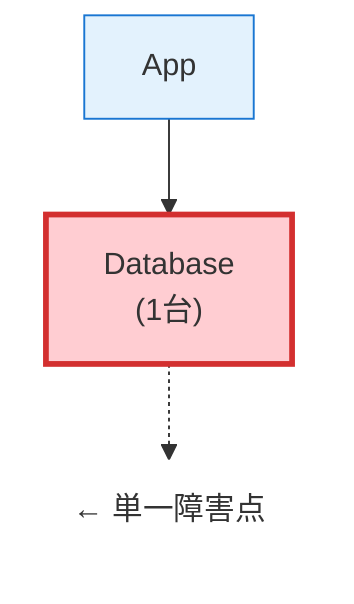

**問題点**:

| 問題 | 説明 |
|------|------|
| 可用性 | DBが落ちたら全停止 |
| 読み取り性能 | 全リクエストが1台に集中 |
| バックアップ | 運用中のバックアップが難しい |
| 災害対策 | 物理的な障害で全データ消失 |

### レプリケーションによる解決

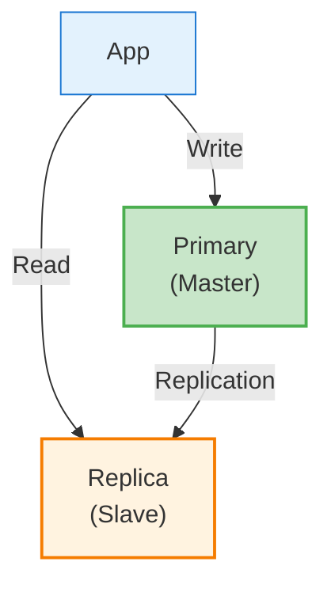

**メリット**:

| メリット | 説明 |
|---------|------|
| 高可用性 | Primaryが落ちてもReplicaが引き継ぐ |
| 読み取りスケール | Replicaで読み取り負荷を分散 |
| バックアップ | Replicaからバックアップを取得 |
| 災害対策 | 別リージョンにReplicaを配置 |

---

## レプリケーションの基本概念

### 書き込みと読み取りの分離

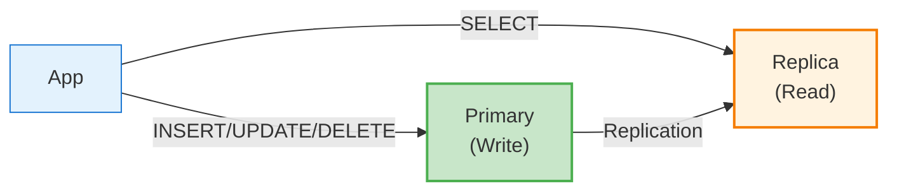

**Primaryへ書き込み、Replicaから読み取り**

これにより:
- 書き込み負荷と読み取り負荷を分離
- 読み取りはスケールアウト可能（Replicaを増やす）

### レプリケーションの仕組み（MySQL）

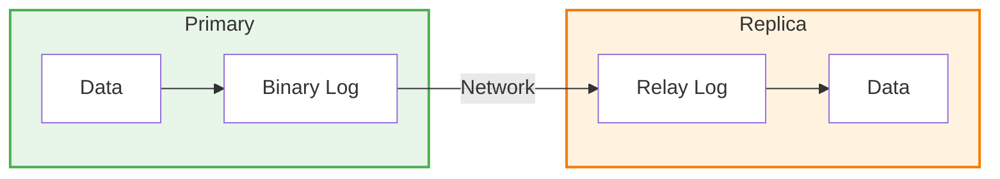

1. Primaryで変更が発生
2. 変更がBinary Logに書き込まれる
3. ReplicaがBinary Logを取得（I/O Thread）
4. Relay Logに書き込む
5. SQL Threadが変更を適用

---

## 同期レプリケーション vs 非同期レプリケーション

### 非同期レプリケーション

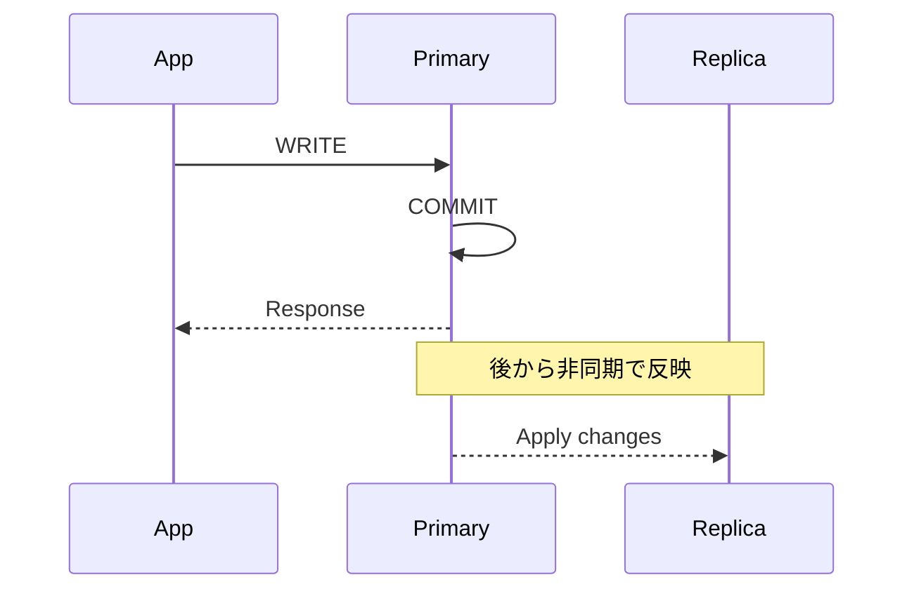

**特徴**:
- Primaryは、Replicaへの反映を待たずにコミット
- 高速（レイテンシが低い）
- Primaryが落ちると、未反映のデータが消える可能性

**MySQL設定**:

```sql
-- デフォルトで非同期
-- 特別な設定は不要
```

### 同期レプリケーション

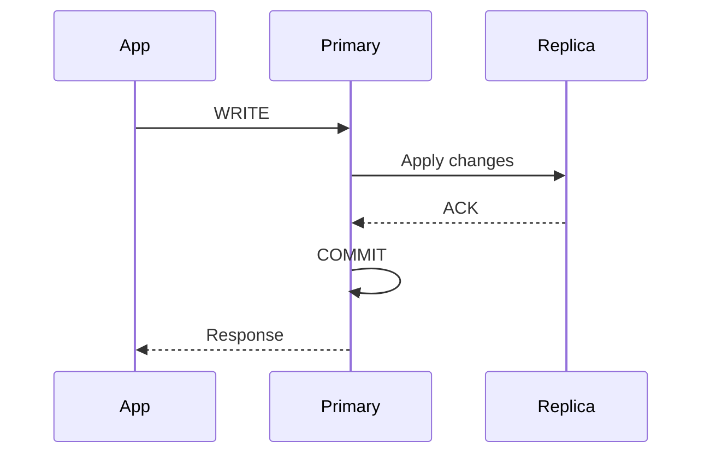

**特徴**:
- Primaryは、Replicaへの反映を待ってからコミット
- データ損失なし
- 遅い（Replicaのレイテンシが加算）

**MySQL（準同期レプリケーション）**:

```sql
-- Primary側
INSTALL PLUGIN rpl_semi_sync_master SONAME 'semisync_master.so';
SET GLOBAL rpl_semi_sync_master_enabled = 1;
SET GLOBAL rpl_semi_sync_master_timeout = 1000;  -- 1秒でタイムアウト

-- Replica側
INSTALL PLUGIN rpl_semi_sync_slave SONAME 'semisync_slave.so';
SET GLOBAL rpl_semi_sync_slave_enabled = 1;
```

### 半同期（セミシンク）レプリケーション

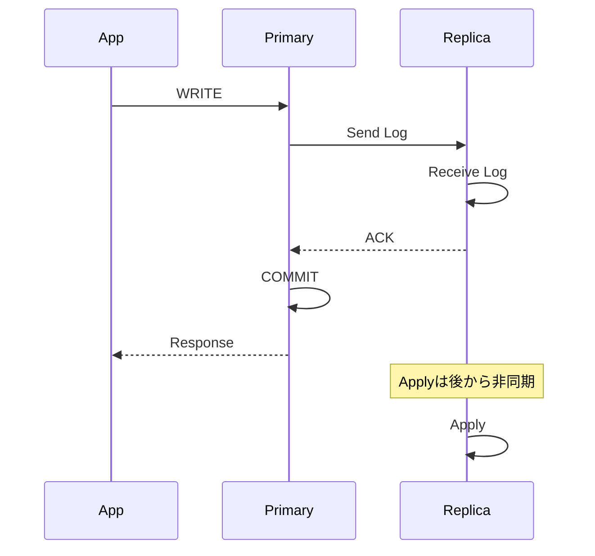

**特徴**:
- ReplicaがログをReceiveしたらACK
- 適用（Apply）は待たない
- 同期と非同期の中間

### 比較表

| 項目 | 非同期 | 半同期 | 同期 |
|------|--------|--------|------|
| レイテンシ | ✅ 低い | ⚪ 中程度 | ❌ 高い |
| データ安全性 | ❌ 損失あり得る | ⚪ ログ受信まで保証 | ✅ 完全保証 |
| 可用性 | ✅ 高い | ⚪ 中程度 | ❌ Replica依存 |
| 実装難易度 | ✅ 簡単 | ⚪ 中程度 | ❌ 複雑 |

### 実務での選択

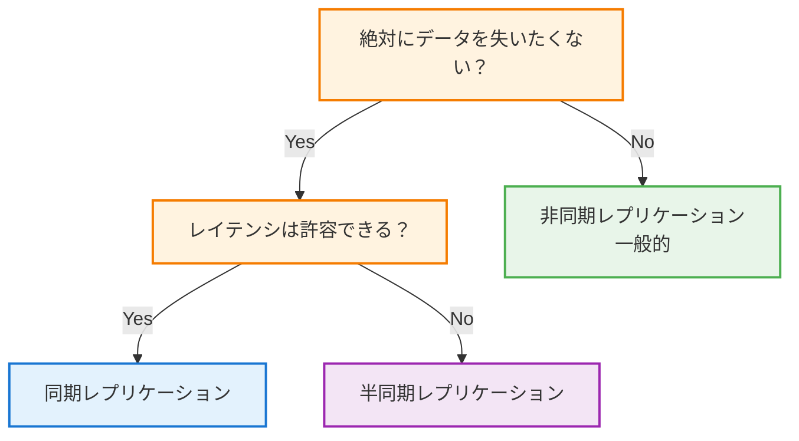

---

## レプリケーション構成パターン

### 1. シングルPrimary + シングルReplica

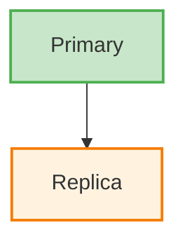

**最もシンプルな構成**

- ユースケース: 小〜中規模サービス
- メリット: シンプル、管理が楽
- デメリット: Replicaが1台しかない

### 2. シングルPrimary + マルチReplica

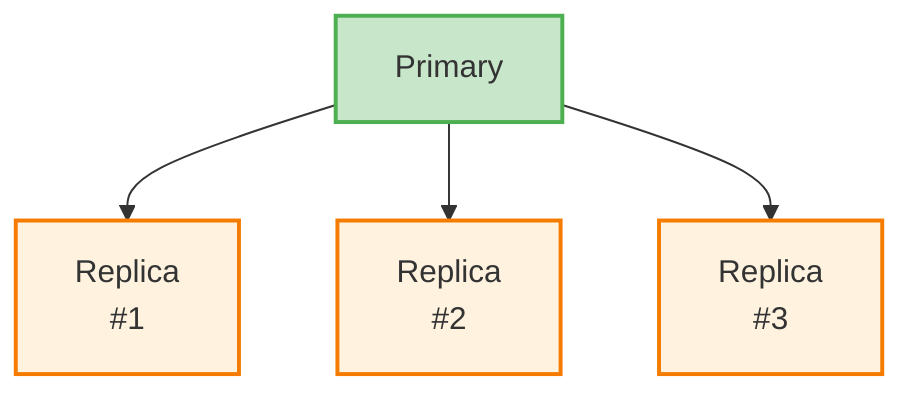

**読み取り負荷が高い場合**

- ユースケース: 読み取り重視のサービス
- メリット: 読み取りスケール
- デメリット: Primaryの書き込み負荷は変わらない

### 3. チェーンレプリケーション


**Primaryの負荷を減らす**

- ユースケース: Replica数が多い場合
- メリット: Primaryの負荷軽減
- デメリット: レプリケーション遅延が累積

### 4. マルチPrimary（マスターマスター）


**両方で書き込み可能**

- ユースケース: 地理的に分散したシステム
- メリット: 書き込みも分散可能
- デメリット: コンフリクトの解決が複雑

**注意**: 同じ行を両方で更新するとコンフリクトが発生

### 5. グループレプリケーション（MySQL）

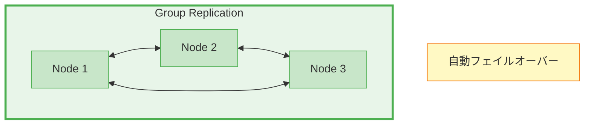

**特徴**:
- 複数ノードがグループを形成
- Paxosベースの合意
- 自動フェイルオーバー

---

## 【実装】MySQL レプリケーション

### Primary（マスター）の設定

```ini
# /etc/mysql/mysql.conf.d/mysqld.cnf

[mysqld]
server-id = 1
log_bin = /var/log/mysql/mysql-bin.log
binlog_format = ROW
binlog_row_image = FULL
expire_logs_days = 7
max_binlog_size = 100M

# レプリケーション対象のデータベース（省略時は全DB）
# binlog_do_db = myapp_production

# GTID（推奨）
gtid_mode = ON
enforce_gtid_consistency = ON
```

```sql
-- レプリケーション用ユーザー作成
CREATE USER 'repl'@'%' IDENTIFIED BY 'password';
GRANT REPLICATION SLAVE ON *.* TO 'repl'@'%';
FLUSH PRIVILEGES;

-- バイナリログの位置を確認
SHOW MASTER STATUS;
-- +------------------+----------+
-- | File             | Position |
-- +------------------+----------+
-- | mysql-bin.000001 | 154      |
-- +------------------+----------+
```

### Replica（スレーブ）の設定

```ini
# /etc/mysql/mysql.conf.d/mysqld.cnf

[mysqld]
server-id = 2  # Primaryと異なる値
relay_log = /var/log/mysql/relay-bin.log
read_only = ON  # 書き込み禁止（安全のため）

# GTID（推奨）
gtid_mode = ON
enforce_gtid_consistency = ON
```

```sql
-- レプリケーション設定（GTID使用時）
CHANGE MASTER TO
    MASTER_HOST = '192.168.1.100',
    MASTER_USER = 'repl',
    MASTER_PASSWORD = 'password',
    MASTER_AUTO_POSITION = 1;

-- レプリケーション開始
START SLAVE;

-- 状態確認
SHOW SLAVE STATUS\G
-- Slave_IO_Running: Yes
-- Slave_SQL_Running: Yes
-- Seconds_Behind_Master: 0  ← 遅延
```

### 初期データの同期

```bash
# Primaryでダンプ取得
mysqldump -u root -p \
    --all-databases \
    --single-transaction \
    --master-data=2 \
    --gtid \
    > backup.sql

# Replicaにリストア
mysql -u root -p < backup.sql
```

---

## 【実装】PostgreSQL レプリケーション

### ストリーミングレプリケーション

```ini
# postgresql.conf (Primary)

wal_level = replica
max_wal_senders = 10
wal_keep_size = 1GB

# 同期レプリケーションの場合
# synchronous_commit = on
# synchronous_standby_names = 'replica1'
```

```
# pg_hba.conf (Primary)
host replication repl_user 192.168.1.0/24 md5
```

```sql
-- レプリケーション用ユーザー作成
CREATE USER repl_user WITH REPLICATION PASSWORD 'password';
```

### Standby（Replica）の設定

```bash
# ベースバックアップを取得
pg_basebackup -h primary_host -D /var/lib/postgresql/data \
    -U repl_user -P -R
```

```ini
# postgresql.conf (Standby)

primary_conninfo = 'host=192.168.1.100 port=5432 user=repl_user password=password'
hot_standby = on
```

```bash
# Standby起動
systemctl start postgresql
```

### 状態確認

```sql
-- Primary側
SELECT * FROM pg_stat_replication;

-- Standby側
SELECT * FROM pg_stat_wal_receiver;
```

---

## 【実務】レプリケーション遅延

### 遅延が発生する原因

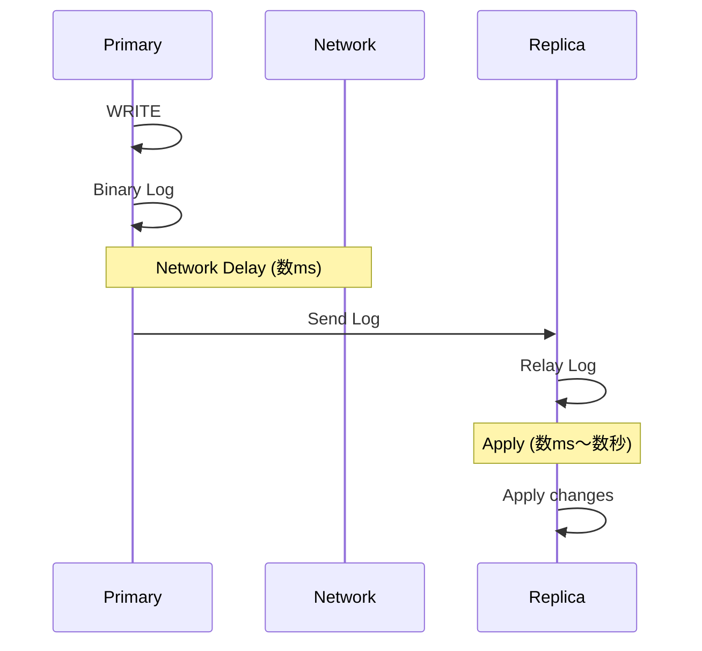

**遅延の原因**:

| 原因 | 説明 |
|------|------|
| ネットワーク遅延 | Primary-Replica間の通信遅延 |
| 大量の書き込み | Replicaが追いつけない |
| 重いクエリ | Replicaでの適用に時間がかかる |
| ロック競合 | Replicaでのロック待ち |
| ハードウェア性能 | ReplicaのCPU/I/Oが遅い |

### 遅延の確認

```sql
-- MySQL
SHOW SLAVE STATUS\G
-- Seconds_Behind_Master: 5  ← 5秒遅延

-- PostgreSQL
SELECT now() - pg_last_xact_replay_timestamp() AS replication_lag;
```

### 遅延による問題

```
1. ユーザーがデータを登録
2. Primaryに書き込み
3. 即座に一覧を読み取り（Replicaから）
4. さっき登録したデータがない！（遅延のため）
```

これは**Read-Your-Writes問題**と呼ばれる。

### 解決策1: 書き込み後はPrimaryから読む

```python
class Database:
    def __init__(self):
        self.primary = create_connection('primary')
        self.replica = create_connection('replica')
        self._use_primary_until = 0

    def write(self, query, params):
        self.primary.execute(query, params)
        # 書き込み後5秒間はPrimaryを使う
        self._use_primary_until = time.time() + 5

    def read(self, query, params):
        if time.time() < self._use_primary_until:
            return self.primary.execute(query, params)
        return self.replica.execute(query, params)
```

### 解決策2: セッション単位でPrimaryを使う

```python
# 書き込みしたユーザーは、そのセッション中はPrimaryを使う
@app.after_request
def after_request(response):
    if request.method in ['POST', 'PUT', 'DELETE']:
        session['use_primary'] = True
        session['use_primary_until'] = time.time() + 10
    return response

@app.before_request
def before_request():
    if session.get('use_primary') and time.time() < session.get('use_primary_until', 0):
        g.db = get_primary_connection()
    else:
        g.db = get_replica_connection()
```

### 解決策3: レプリケーション遅延を待つ

```sql
-- MySQL: GTIDが反映されるまで待つ
SELECT WAIT_FOR_EXECUTED_GTID_SET('uuid:1-100', 5);
-- 5秒以内に反映されればOK
```

```python
# Pythonでの実装
def read_after_write(gtid, query, params):
    # GTIDが反映されるまで待つ（最大5秒）
    replica.execute(f"SELECT WAIT_FOR_EXECUTED_GTID_SET('{gtid}', 5)")

    # 反映されたら読み取り
    return replica.execute(query, params)
```

### 解決策4: 同期レプリケーション

遅延を許容できない場合は、同期レプリケーションを使う。
ただし、パフォーマンスとトレードオフ。

---

## 【実務】フェイルオーバー

### 手動フェイルオーバー

```
1. Primaryの障害を検知
2. Replicaを新Primaryに昇格
3. アプリケーションの接続先を変更
```

```sql
-- MySQL: Replicaを昇格
STOP SLAVE;
RESET SLAVE ALL;
SET GLOBAL read_only = OFF;
```

```sql
-- PostgreSQL: Standbyを昇格
SELECT pg_promote();
```

### 自動フェイルオーバー

#### MHA（MySQL）

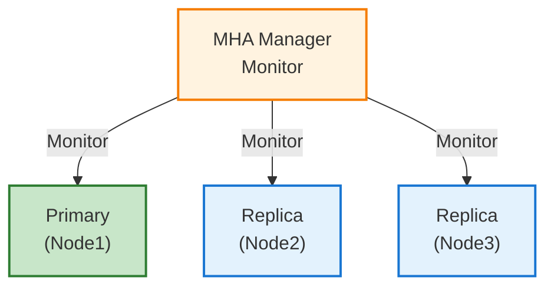

**MHAの動作**:
1. Primaryの障害を検知
2. 最新のReplicaを選択
3. 差分のリレーログを適用
4. 新Primaryに昇格
5. 他のReplicaを新Primaryに接続

#### Orchestrator（MySQL）

```yaml
# orchestrator.conf.json
{
  "MySQLTopologyUser": "orchestrator",
  "MySQLTopologyPassword": "password",
  "RecoveryPeriodBlockSeconds": 3600,
  "RecoverMasterClusterFilters": ["*"],
  "PromotionIgnoreHostnameFilters": [".*-backup"],
  "DetectSemiSyncEnforcedQuery": "SELECT @@rpl_semi_sync_master_enabled"
}
```

#### Patroni（PostgreSQL）

```yaml
# patroni.yml
scope: postgres-cluster
namespace: /db/
name: node1

restapi:
  listen: 0.0.0.0:8008
  connect_address: 192.168.1.1:8008

etcd:
  host: 192.168.1.10:2379

bootstrap:
  dcs:
    ttl: 30
    loop_wait: 10
    retry_timeout: 10
    maximum_lag_on_failover: 1048576
    postgresql:
      use_pg_rewind: true
      parameters:
        wal_level: replica
        hot_standby: "on"
        max_wal_senders: 10

postgresql:
  listen: 0.0.0.0:5432
  connect_address: 192.168.1.1:5432
  data_dir: /var/lib/postgresql/data
  authentication:
    replication:
      username: replicator
      password: password
    superuser:
      username: postgres
      password: password
```

### フェイルオーバー時の注意点

#### 1. データ損失の可能性

```
非同期レプリケーションの場合:
Primary: WRITE ──► COMMIT ──► 障害発生
                              ↓
                        このデータは
                        Replicaに未反映
```

**対策**: 半同期/同期レプリケーションを使う

#### 2. スプリットブレイン

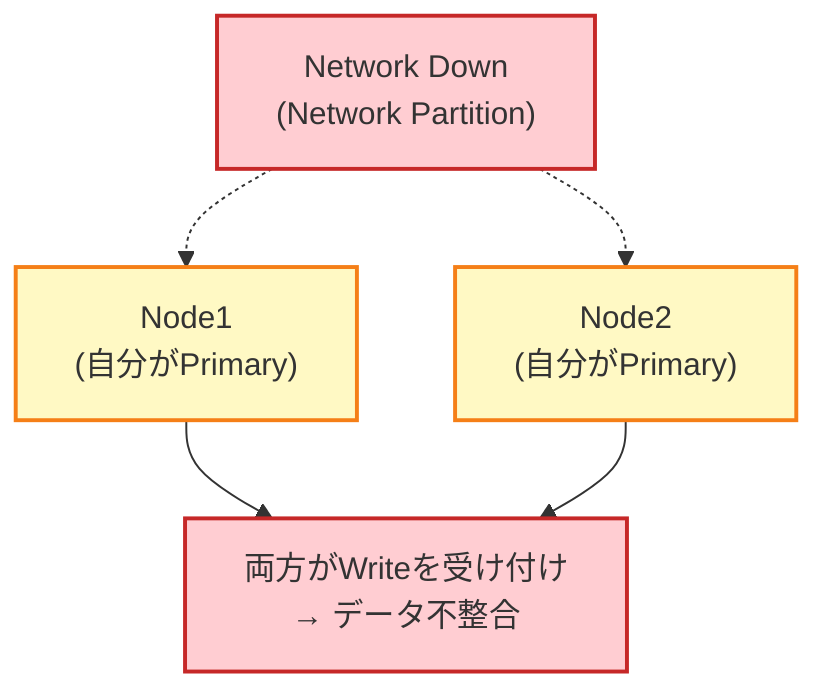

**対策**:
- STONITH（Shoot The Other Node In The Head）
- フェンシング（確実にノードを停止）
- クォーラム（過半数ルール）

#### 3. 接続の切り替え

```python
# VIPを使う場合
# フェイルオーバー時にVIPが新Primaryに移動
db = connect('192.168.1.100')  # VIP

# ProxySQL/HAProxyを使う場合
db = connect('proxy.internal')  # Proxyが振り分け

# DNSを使う場合
db = connect('primary.db.internal')  # DNS更新
```

---

## 【実務】読み取り負荷分散

### アプリケーションレイヤーでの分散

```python
import random

class DBRouter:
    def __init__(self):
        self.primary = create_connection('primary')
        self.replicas = [
            create_connection('replica1'),
            create_connection('replica2'),
            create_connection('replica3'),
        ]

    def get_connection(self, for_write=False):
        if for_write:
            return self.primary
        return random.choice(self.replicas)
```

### Django での設定

```python
# settings.py
DATABASES = {
    'default': {
        'ENGINE': 'django.db.backends.mysql',
        'HOST': 'primary.db.internal',
        # ...
    },
    'replica': {
        'ENGINE': 'django.db.backends.mysql',
        'HOST': 'replica.db.internal',
        # ...
    }
}

# routers.py
class PrimaryReplicaRouter:
    def db_for_read(self, model, **hints):
        return 'replica'

    def db_for_write(self, model, **hints):
        return 'default'

    def allow_relation(self, obj1, obj2, **hints):
        return True

    def allow_migrate(self, db, app_label, model_name=None, **hints):
        return db == 'default'
```

### ProxySQLによる分散

```sql
-- ProxySQL設定
INSERT INTO mysql_servers (hostgroup_id, hostname, port, weight) VALUES
    (10, 'primary.db.internal', 3306, 1),    -- Write用
    (20, 'replica1.db.internal', 3306, 1),   -- Read用
    (20, 'replica2.db.internal', 3306, 1);

-- クエリルール
INSERT INTO mysql_query_rules (rule_id, active, match_pattern, destination_hostgroup) VALUES
    (1, 1, '^SELECT.*FOR UPDATE', 10),  -- FOR UPDATEはPrimaryへ
    (2, 1, '^SELECT', 20),              -- その他のSELECTはReplicaへ
    (3, 1, '.*', 10);                   -- それ以外はPrimaryへ

LOAD MYSQL SERVERS TO RUNTIME;
LOAD MYSQL QUERY RULES TO RUNTIME;
SAVE MYSQL SERVERS TO DISK;
SAVE MYSQL QUERY RULES TO DISK;
```

---

## 【実務】監視

### 監視すべきメトリクス

| メトリクス | 説明 | アラート閾値（例） |
|-----------|------|------------------|
| Replication Lag | レプリケーション遅延 | > 10秒 |
| Slave IO Running | I/Oスレッドの状態 | No |
| Slave SQL Running | SQLスレッドの状態 | No |
| Binary Log Position | バイナリログの位置 | 乖離が大きい |
| Connection Count | 接続数 | > 80% of max |

### MySQLの監視クエリ

```sql
-- レプリケーション状態
SHOW SLAVE STATUS\G

-- 重要な値
-- Slave_IO_Running: Yes
-- Slave_SQL_Running: Yes
-- Seconds_Behind_Master: 0
-- Last_Error: (空であること)
```

### Prometheusでの監視

```yaml
# prometheus.yml
scrape_configs:
  - job_name: 'mysql'
    static_configs:
      - targets: ['primary:9104', 'replica1:9104', 'replica2:9104']
```

```yaml
# アラートルール
groups:
  - name: mysql_replication
    rules:
      - alert: MySQLReplicationLag
        expr: mysql_slave_status_seconds_behind_master > 30
        for: 5m
        labels:
          severity: warning
        annotations:
          summary: "MySQL replication lag is high"

      - alert: MySQLReplicationStopped
        expr: mysql_slave_status_slave_io_running == 0 or mysql_slave_status_slave_sql_running == 0
        for: 1m
        labels:
          severity: critical
        annotations:
          summary: "MySQL replication has stopped"
```

---

## AWS RDSでのレプリケーション

### リードレプリカ作成

```hcl
# Terraform

# Primary（ソースDB）
resource "aws_db_instance" "primary" {
  identifier           = "mydb-primary"
  engine               = "mysql"
  engine_version       = "8.0"
  instance_class       = "db.r5.large"
  allocated_storage    = 100
  backup_retention_period = 7
  multi_az             = true

  # ...
}

# リードレプリカ
resource "aws_db_instance" "replica" {
  identifier           = "mydb-replica"
  replicate_source_db  = aws_db_instance.primary.identifier
  instance_class       = "db.r5.large"

  # リードレプリカはread_only
  # バックアップは取れない（backup_retention_period = 0）
}
```

### マルチAZ vs リードレプリカ

| 項目 | マルチAZ | リードレプリカ |
|------|---------|---------------|
| 目的 | 高可用性 | 読み取りスケール |
| 同期方式 | 同期 | 非同期 |
| 読み取り | ❌ 不可 | ✅ 可能 |
| フェイルオーバー | ✅ 自動 | ⚪ 手動昇格 |
| 別リージョン | ❌ 不可 | ✅ 可能 |

### Aurora のレプリケーション

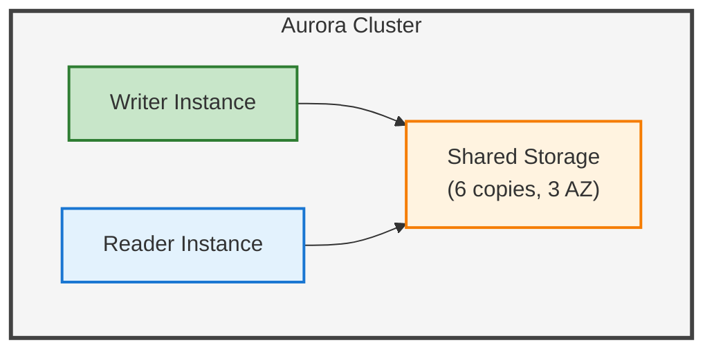

**Auroraの特徴**:
- ストレージレイヤーでレプリケーション
- 遅延が小さい（通常10ms以下）
- 最大15のリードレプリカ
- 自動フェイルオーバー

---

## 実務チェックリスト

### 設計時

- [ ] レプリケーション方式（同期/非同期）は決めたか
- [ ] 構成パターンは決めたか
- [ ] レプリケーション遅延の許容範囲は決めたか
- [ ] フェイルオーバー方式は決めたか

### 実装時

- [ ] 読み取り/書き込みの分離は実装されているか
- [ ] レプリケーション遅延の対策は実装されているか
- [ ] 接続の切り替え方式は実装されているか

### 運用時

- [ ] レプリケーション状態の監視は設定されているか
- [ ] 遅延アラートは設定されているか
- [ ] フェイルオーバー手順は文書化されているか
- [ ] 定期的なフェイルオーバーテストは実施しているか

---

## まとめ

レプリケーションの本質は、**データの複製による可用性と性能の向上**だ。

### 同期方式の選択

| 要件 | 選択 |
|------|------|
| 高性能、多少の損失OK | 非同期 |
| バランス型 | 半同期 |
| データ損失NG | 同期 |

### 構成パターン

| 要件 | 構成 |
|------|------|
| シンプル | Single Primary + Single Replica |
| 読み取りスケール | Single Primary + Multi Replica |
| 高可用性 | Group Replication / Patroni |

### 実務で気をつけること

1. **レプリケーション遅延**: Read-Your-Writes問題の対策
2. **フェイルオーバー**: 自動化と定期テスト
3. **監視**: 遅延とレプリケーション状態の監視

「とりあえずReplica置いた」ではなく、**要件に合った設計**をしよう。

それが、スケールする・落ちないDBの第一歩だ。
