## はじめに

「レプリカを増やしても、書き込みが追いつかない」

レプリケーションは読み取りをスケールさせる。
でも、**書き込みは1台のPrimaryに集中**する。

ユーザーが100万人を超えたとき、1台のDBでは限界が来る。

そこで必要になるのが、**シャーディング**だ。

データを複数のDBに分割して、書き込みも読み取りもスケールさせる。

この記事では、シャーディングの本質から、実装パターン、落とし穴と解決策までを解説する。

---

## パーティショニング vs シャーディング

### パーティショニング（単一DB内の分割）

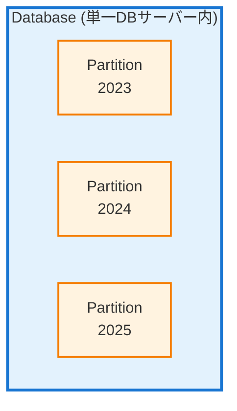

**特徴**:
- 同じDBサーバー内でテーブルを分割
- 管理が楽（1台のDB）
- スケールには限界がある

### シャーディング（複数DBへの分割）

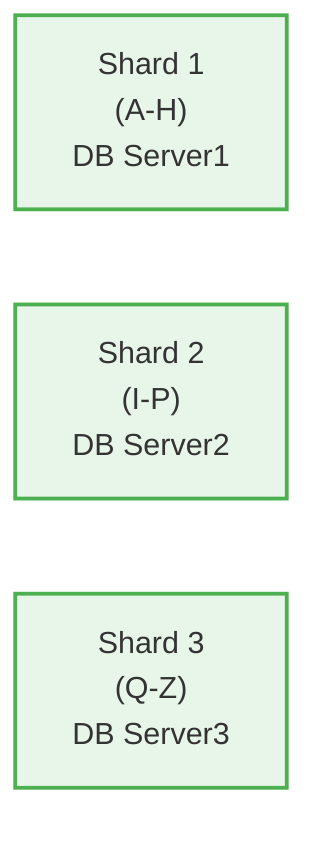

**特徴**:
- 異なるDBサーバーにデータを分散
- 水平スケールが可能
- 複雑さが増す

### 使い分け

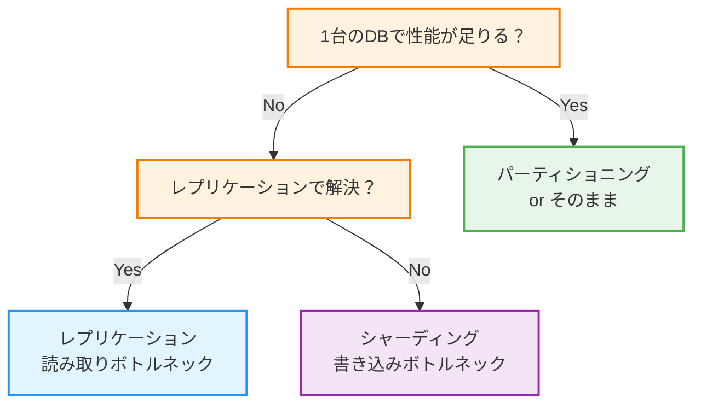

---

## 垂直分割 vs 水平分割

### 垂直分割（テーブル単位）

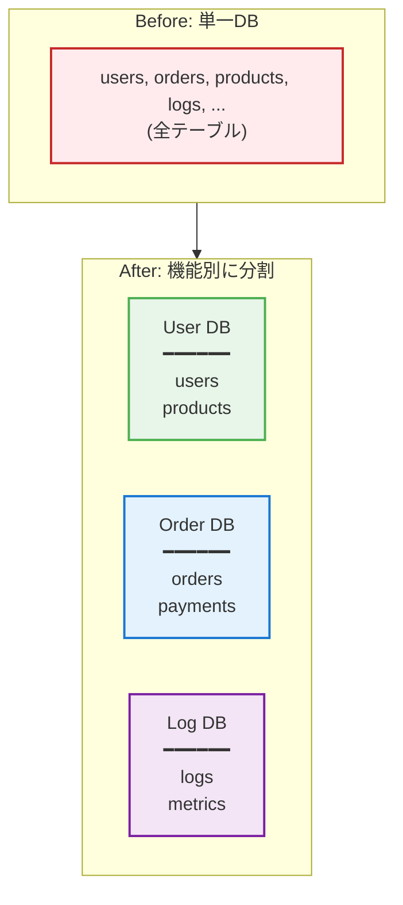

**特徴**:
- 機能単位でDBを分ける
- マイクロサービスとの相性が良い
- JOIN が制限される

**実装例**:

```python
# 機能ごとに接続先を変える
class DatabaseRouter:
    def __init__(self):
        self.user_db = create_connection('user-db')
        self.order_db = create_connection('order-db')
        self.log_db = create_connection('log-db')

    def get_connection(self, table):
        if table in ['users', 'profiles', 'settings']:
            return self.user_db
        elif table in ['orders', 'order_items', 'payments']:
            return self.order_db
        elif table in ['logs', 'metrics', 'events']:
            return self.log_db
```

### 水平分割（行単位）

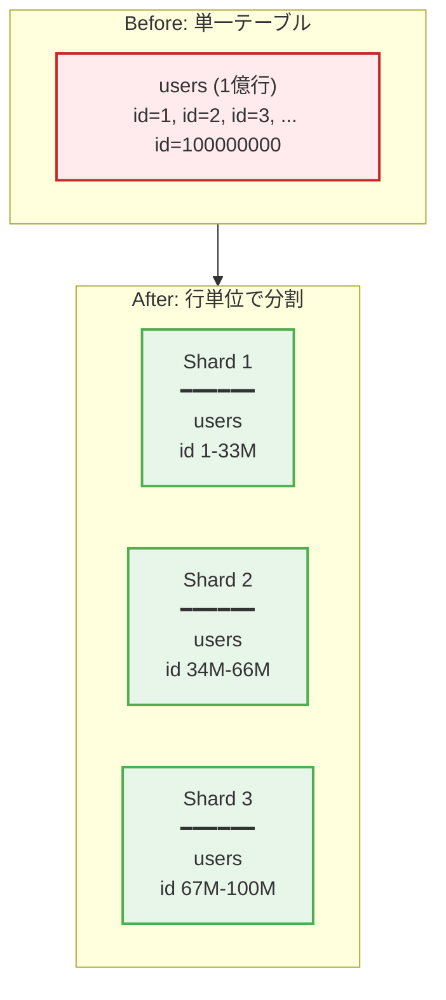

**特徴**:
- 同じテーブルの行を複数DBに分散
- 書き込みがスケール
- 実装が複雑

---

## シャーディング戦略

### 1. レンジベースシャーディング

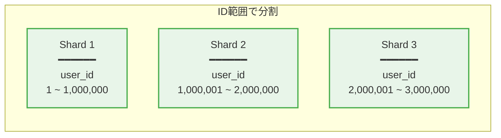

```python
def get_shard(user_id):
    if user_id <= 1_000_000:
        return 'shard1'
    elif user_id <= 2_000_000:
        return 'shard2'
    else:
        return 'shard3'
```

**メリット**:
- 実装がシンプル
- 範囲クエリが効率的（例: 最近のユーザー）

**デメリット**:
- **ホットスポット問題**: 新規ユーザーが1つのシャードに集中
- シャード追加時のリバランスが大変

### 2. ハッシュベースシャーディング

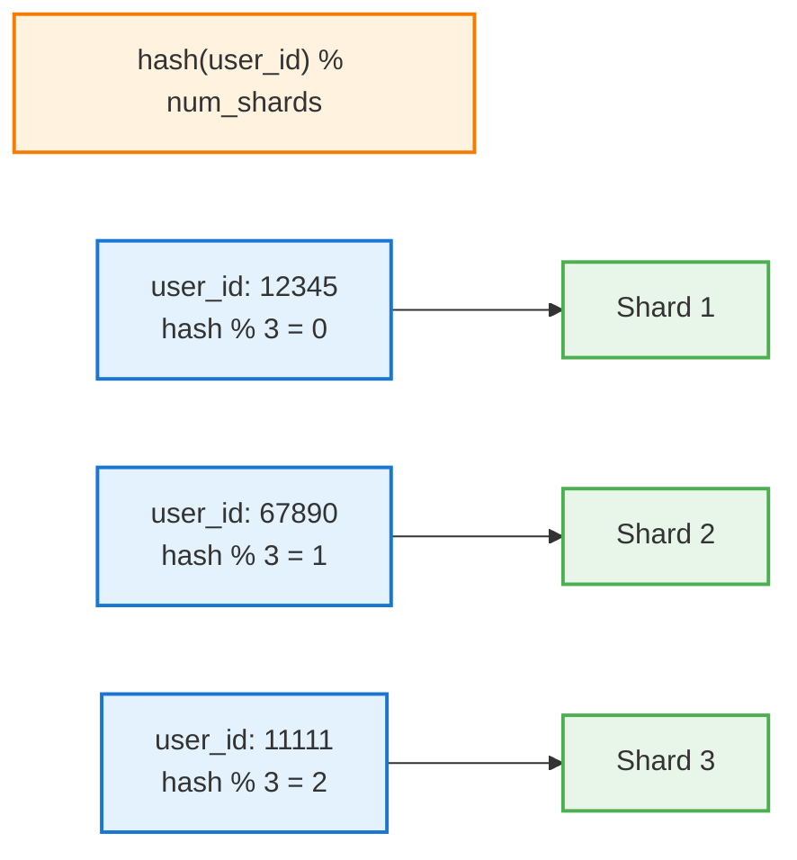

```python
import hashlib

def get_shard(user_id, num_shards=3):
    hash_value = int(hashlib.md5(str(user_id).encode()).hexdigest(), 16)
    return f'shard{hash_value % num_shards + 1}'
```

**メリット**:
- データが均等に分散
- ホットスポットが発生しにくい

**デメリット**:
- 範囲クエリが非効率（全シャードをスキャン）
- **リシャーディング問題**: シャード数が変わると大量のデータ移動

### 3. 一貫性ハッシュ（Consistent Hashing）

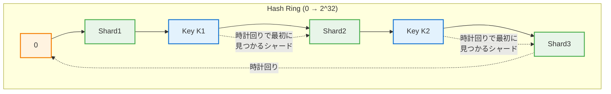

```python
import hashlib
from bisect import bisect_right

class ConsistentHash:
    def __init__(self, nodes, virtual_nodes=150):
        self.ring = []
        self.node_map = {}
        self.virtual_nodes = virtual_nodes

        for node in nodes:
            self.add_node(node)

    def _hash(self, key):
        return int(hashlib.md5(key.encode()).hexdigest(), 16)

    def add_node(self, node):
        for i in range(self.virtual_nodes):
            virtual_key = f"{node}:{i}"
            hash_value = self._hash(virtual_key)
            self.ring.append(hash_value)
            self.node_map[hash_value] = node
        self.ring.sort()

    def remove_node(self, node):
        for i in range(self.virtual_nodes):
            virtual_key = f"{node}:{i}"
            hash_value = self._hash(virtual_key)
            self.ring.remove(hash_value)
            del self.node_map[hash_value]

    def get_node(self, key):
        if not self.ring:
            return None
        hash_value = self._hash(key)
        idx = bisect_right(self.ring, hash_value) % len(self.ring)
        return self.node_map[self.ring[idx]]

# 使用例
ch = ConsistentHash(['shard1', 'shard2', 'shard3'])
print(ch.get_node('user:12345'))  # → shard2
print(ch.get_node('user:67890'))  # → shard1

# ノード追加時、影響を受けるのは隣接するノードのデータのみ
ch.add_node('shard4')
```

**メリット**:
- シャード追加・削除時のデータ移動が最小限
- スケールしやすい

**デメリット**:
- 実装が複雑
- Virtual Nodesの数の調整が必要

### 4. ディレクトリベースシャーディング

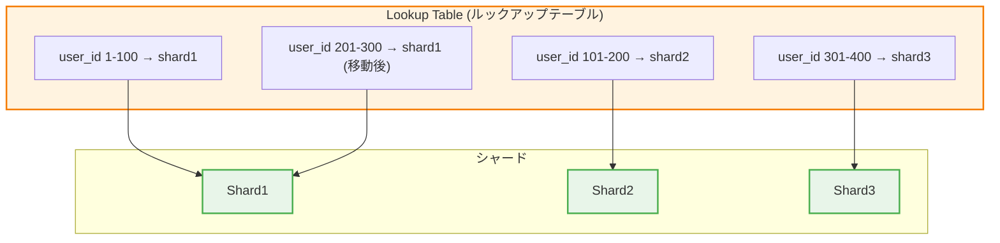

```python
class DirectoryShard:
    def __init__(self):
        # ルックアップテーブル（Redis等に保存）
        self.directory = {}

    def assign_shard(self, user_id, shard):
        self.directory[user_id] = shard

    def get_shard(self, user_id):
        return self.directory.get(user_id)

    def migrate(self, user_id, new_shard):
        # データ移動
        old_shard = self.directory[user_id]
        migrate_data(old_shard, new_shard, user_id)
        # ディレクトリ更新
        self.directory[user_id] = new_shard
```

**メリット**:
- 柔軟なデータ配置
- 任意のタイミングでリバランス可能

**デメリット**:
- ルックアップテーブルが単一障害点になりうる
- ルックアップのオーバーヘッド

### シャーディング戦略の比較

| 戦略 | 分散の均一性 | 範囲クエリ | リシャーディング | 複雑さ |
|------|------------|----------|----------------|--------|
| レンジ | ❌ 偏りやすい | ✅ 効率的 | ❌ 大変 | ✅ 簡単 |
| ハッシュ | ✅ 均一 | ❌ 非効率 | ❌ 大変 | ⚪ 普通 |
| 一貫性ハッシュ | ✅ 均一 | ❌ 非効率 | ✅ 最小限 | ❌ 複雑 |
| ディレクトリ | ✅ 制御可能 | ⚪ 条件による | ✅ 柔軟 | ❌ 複雑 |

---

## シャードキーの選択

### 良いシャードキーの条件

1. **高カーディナリティ**: 多くのユニークな値を持つ
2. **均等な分布**: データが偏らない
3. **クエリパターンに合致**: よく使うクエリで効率的

### 例: ECサイトの注文テーブル

```sql
CREATE TABLE orders (
    order_id BIGINT PRIMARY KEY,
    user_id BIGINT,
    shop_id BIGINT,
    product_id BIGINT,
    amount DECIMAL,
    created_at TIMESTAMP
);
```

**候補**:

| シャードキー | 評価 |
|------------|------|
| order_id | ⚪ 均等だが、user_idでのクエリが全シャードスキャン |
| user_id | ✅ ユーザーの注文履歴が1シャードで完結 |
| shop_id | ⚪ ショップ分析は効率的だが、ユーザークエリが非効率 |
| created_at | ❌ 最新データに書き込み集中（ホットスポット） |

**推奨**: `user_id` をシャードキーにする

```python
def get_order_shard(user_id):
    return hash(user_id) % NUM_SHARDS
```

これにより:
- 「このユーザーの注文一覧」が1シャードで完結
- ユーザーごとの書き込みが分散

---

## 【実務】クロスシャードクエリの課題

### 問題: JOINができない

```sql
-- シャーディング前
SELECT u.name, o.amount
FROM users u
JOIN orders o ON u.id = o.user_id
WHERE o.created_at > '2024-01-01';

-- シャーディング後
-- users と orders が別シャードにあると JOIN できない
```

### 解決策1: アプリケーション層でJOIN

```python
def get_user_orders(user_id):
    # 1. ユーザー情報を取得
    user_shard = get_shard('users', user_id)
    user = user_shard.query("SELECT * FROM users WHERE id = ?", user_id)

    # 2. 注文情報を取得
    order_shard = get_shard('orders', user_id)
    orders = order_shard.query("SELECT * FROM orders WHERE user_id = ?", user_id)

    # 3. アプリケーション層で結合
    return {
        'user': user,
        'orders': orders
    }
```

### 解決策2: データの非正規化

```sql
-- 注文テーブルにユーザー名を含める（非正規化）
CREATE TABLE orders (
    order_id BIGINT PRIMARY KEY,
    user_id BIGINT,
    user_name VARCHAR(100),  -- 非正規化
    amount DECIMAL,
    created_at TIMESTAMP
);
```

**メリット**: JOINなしでデータ取得
**デメリット**: データの重複、更新時の整合性

### 解決策3: グローバルテーブル

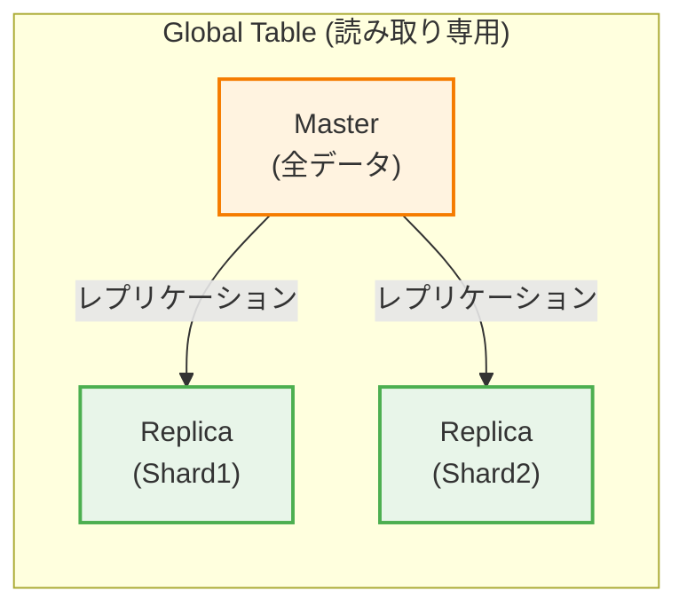

更新頻度が低いマスタデータ（国リスト、カテゴリ等）は全シャードにレプリカを置く。

### 解決策4: Scatter-Gather パターン

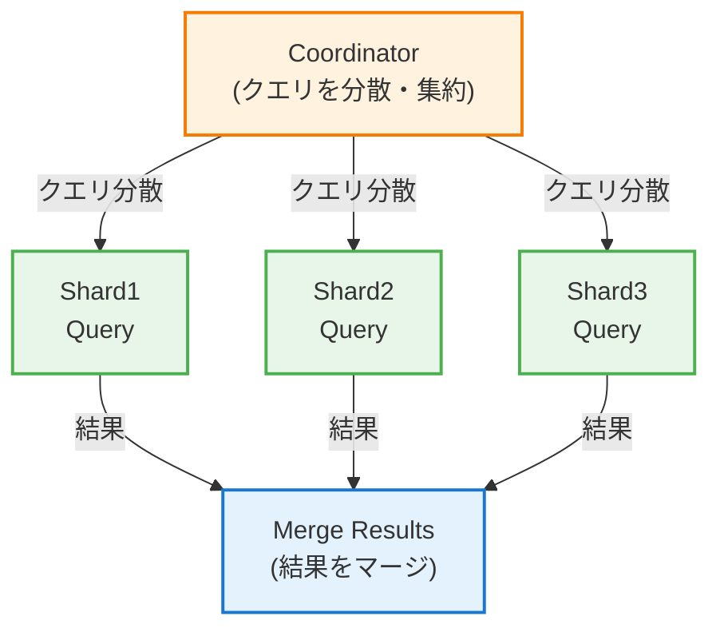

```python
async def scatter_gather_query(query, params):
    # 全シャードに並列でクエリを投げる
    tasks = [
        shard.query(query, params)
        for shard in all_shards
    ]
    results = await asyncio.gather(*tasks)

    # 結果をマージ
    return merge_results(results)

# 使用例: 全ユーザーの売上合計
async def get_total_sales():
    results = await scatter_gather_query(
        "SELECT SUM(amount) as total FROM orders WHERE created_at > ?",
        ['2024-01-01']
    )
    return sum(r['total'] for r in results)
```

---

## 【実務】トランザクションの課題

### 問題: 分散トランザクション

```python
# user_id=1 のユーザーが user_id=2 のユーザーに送金
# しかし、user_id=1 と user_id=2 は別シャード！

def transfer(from_user, to_user, amount):
    # Shard1: from_user の残高を減らす
    shard1.execute("UPDATE accounts SET balance = balance - ? WHERE user_id = ?",
                   amount, from_user)

    # ここで障害発生したら？
    # → from_user の残高だけ減って、to_user に届かない

    # Shard2: to_user の残高を増やす
    shard2.execute("UPDATE accounts SET balance = balance + ? WHERE user_id = ?",
                   amount, to_user)
```

### 解決策1: 2フェーズコミット（2PC）

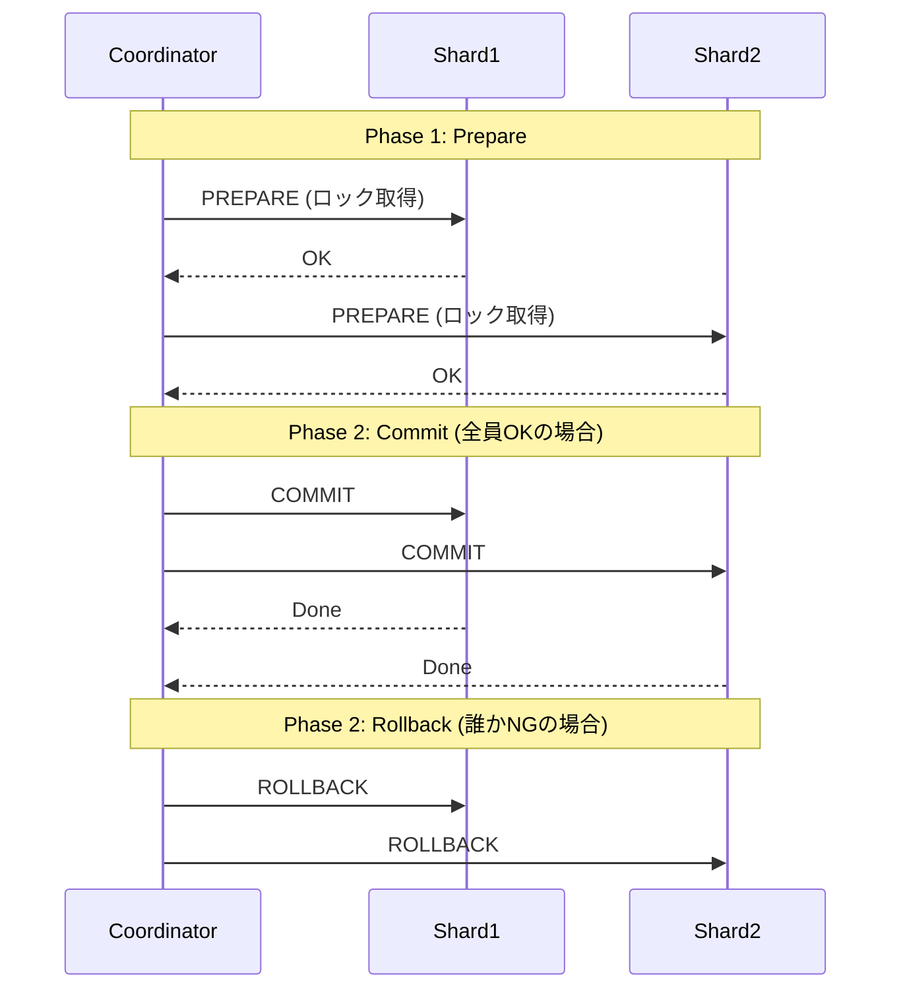

**問題点**:
- 遅い（ロック時間が長い）
- Coordinatorが単一障害点
- 障害時のリカバリが複雑

### 解決策2: Saga パターン

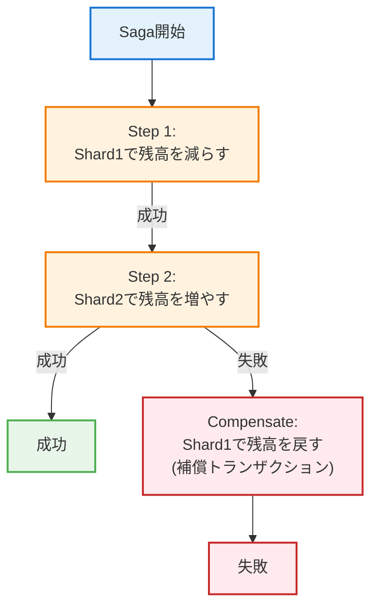

```python
class TransferSaga:
    def execute(self, from_user, to_user, amount):
        try:
            # Step 1: 送金元の残高を減らす
            self.debit(from_user, amount)

            try:
                # Step 2: 送金先の残高を増やす
                self.credit(to_user, amount)
            except Exception:
                # 補償: 送金元の残高を戻す
                self.compensate_debit(from_user, amount)
                raise

        except Exception as e:
            raise TransferFailed(str(e))

    def debit(self, user_id, amount):
        shard = get_shard(user_id)
        shard.execute(
            "UPDATE accounts SET balance = balance - ? WHERE user_id = ? AND balance >= ?",
            amount, user_id, amount
        )

    def credit(self, user_id, amount):
        shard = get_shard(user_id)
        shard.execute(
            "UPDATE accounts SET balance = balance + ? WHERE user_id = ?",
            amount, user_id
        )

    def compensate_debit(self, user_id, amount):
        shard = get_shard(user_id)
        shard.execute(
            "UPDATE accounts SET balance = balance + ? WHERE user_id = ?",
            amount, user_id
        )
```

### 解決策3: シャード設計で回避

```
# 送金を同一シャード内で完結させる
# → 組織単位でシャーディング

組織A のユーザー同士の送金 → Shard1 内で完結
組織B のユーザー同士の送金 → Shard2 内で完結
組織間の送金 → 非同期処理（後述）
```

---

## 【実装】MySQL パーティショニング

### レンジパーティション

```sql
CREATE TABLE orders (
    order_id BIGINT AUTO_INCREMENT,
    user_id BIGINT,
    amount DECIMAL(10,2),
    created_at DATETIME,
    PRIMARY KEY (order_id, created_at)
) PARTITION BY RANGE (YEAR(created_at)) (
    PARTITION p2022 VALUES LESS THAN (2023),
    PARTITION p2023 VALUES LESS THAN (2024),
    PARTITION p2024 VALUES LESS THAN (2025),
    PARTITION p2025 VALUES LESS THAN (2026),
    PARTITION pmax VALUES LESS THAN MAXVALUE
);

-- パーティション追加
ALTER TABLE orders ADD PARTITION (
    PARTITION p2026 VALUES LESS THAN (2027)
);

-- 古いパーティションの削除（高速）
ALTER TABLE orders DROP PARTITION p2022;
```

### ハッシュパーティション

```sql
CREATE TABLE users (
    user_id BIGINT PRIMARY KEY,
    name VARCHAR(100),
    email VARCHAR(255)
) PARTITION BY HASH(user_id) PARTITIONS 4;
```

### リストパーティション

```sql
CREATE TABLE orders (
    order_id BIGINT,
    region VARCHAR(10),
    amount DECIMAL(10,2),
    PRIMARY KEY (order_id, region)
) PARTITION BY LIST COLUMNS(region) (
    PARTITION p_east VALUES IN ('tokyo', 'osaka'),
    PARTITION p_west VALUES IN ('fukuoka', 'hiroshima'),
    PARTITION p_other VALUES IN ('other')
);
```

---

## 【実装】アプリケーション層シャーディング

### シンプルな実装

```python
import hashlib
from typing import Dict, Any

class ShardManager:
    def __init__(self, shard_configs: Dict[str, str]):
        """
        shard_configs: {'shard0': 'mysql://...', 'shard1': 'mysql://...', ...}
        """
        self.shards = {
            name: create_connection(url)
            for name, url in shard_configs.items()
        }
        self.num_shards = len(self.shards)

    def _hash(self, key: str) -> int:
        return int(hashlib.md5(str(key).encode()).hexdigest(), 16)

    def get_shard(self, shard_key: Any):
        """シャードキーから接続を取得"""
        shard_index = self._hash(str(shard_key)) % self.num_shards
        return self.shards[f'shard{shard_index}']

    def get_all_shards(self):
        """全シャードを取得（scatter-gather用）"""
        return list(self.shards.values())

# 使用例
shard_manager = ShardManager({
    'shard0': 'mysql://host1/db',
    'shard1': 'mysql://host2/db',
    'shard2': 'mysql://host3/db',
})

# ユーザー作成
def create_user(user_id, name, email):
    shard = shard_manager.get_shard(user_id)
    shard.execute(
        "INSERT INTO users (id, name, email) VALUES (?, ?, ?)",
        (user_id, name, email)
    )

# ユーザー取得
def get_user(user_id):
    shard = shard_manager.get_shard(user_id)
    return shard.query("SELECT * FROM users WHERE id = ?", (user_id,))

# 全ユーザー数（scatter-gather）
def count_all_users():
    total = 0
    for shard in shard_manager.get_all_shards():
        result = shard.query("SELECT COUNT(*) as cnt FROM users")
        total += result['cnt']
    return total
```

### Django でのシャーディング

```python
# settings.py
DATABASES = {
    'default': {},
    'shard0': {
        'ENGINE': 'django.db.backends.mysql',
        'HOST': 'shard0.db.internal',
        'NAME': 'app',
    },
    'shard1': {
        'ENGINE': 'django.db.backends.mysql',
        'HOST': 'shard1.db.internal',
        'NAME': 'app',
    },
    'shard2': {
        'ENGINE': 'django.db.backends.mysql',
        'HOST': 'shard2.db.internal',
        'NAME': 'app',
    },
}

# routers.py
class ShardRouter:
    def db_for_read(self, model, **hints):
        if hasattr(model, 'shard_key'):
            shard_key = hints.get('shard_key')
            if shard_key:
                return self._get_shard(shard_key)
        return 'default'

    def db_for_write(self, model, **hints):
        return self.db_for_read(model, **hints)

    def _get_shard(self, shard_key):
        shard_index = hash(str(shard_key)) % 3
        return f'shard{shard_index}'

# models.py
class User(models.Model):
    shard_key = 'id'  # シャードキーを指定

    id = models.BigAutoField(primary_key=True)
    name = models.CharField(max_length=100)

    class Meta:
        app_label = 'users'

# 使用例
user = User.objects.using(router._get_shard(user_id)).get(id=user_id)
```

---

## 【実務】リシャーディング（シャード追加）

### 問題

```
シャード数: 3 → 4 に増やしたい

Before: hash(key) % 3
After:  hash(key) % 4

→ 大量のデータ移動が発生
```

### 解決策1: 一貫性ハッシュ

前述の一貫性ハッシュを使えば、影響は最小限。

### 解決策2: ダブルライト

```
1. 新シャードを追加
2. 書き込みを新旧両方に行う（ダブルライト）
3. 旧シャードのデータを新シャードにコピー
4. 読み取りを新シャードに切り替え
5. 旧シャードへの書き込みを停止
6. 旧シャードを削除
```

```python
class DoubleWriteShardManager:
    def __init__(self):
        self.old_shards = {...}  # 旧シャード構成
        self.new_shards = {...}  # 新シャード構成
        self.migration_mode = True

    def write(self, shard_key, query, params):
        if self.migration_mode:
            # 両方に書き込み
            old_shard = self._get_old_shard(shard_key)
            new_shard = self._get_new_shard(shard_key)
            old_shard.execute(query, params)
            new_shard.execute(query, params)
        else:
            # 新シャードのみ
            new_shard = self._get_new_shard(shard_key)
            new_shard.execute(query, params)

    def read(self, shard_key, query, params):
        if self.migration_mode:
            # 旧シャードから読み取り（移行完了まで）
            old_shard = self._get_old_shard(shard_key)
            return old_shard.query(query, params)
        else:
            # 新シャードから読み取り
            new_shard = self._get_new_shard(shard_key)
            return new_shard.query(query, params)
```

### 解決策3: Vitess / ProxySQL

シャーディングミドルウェアを使う。

```yaml
# Vitess: シャード構成
keyspaces:
  - name: commerce
    sharded: true
    vindexes:
      - name: hash
        type: hash
    tables:
      - name: users
        column_vindexes:
          - column: user_id
            name: hash
```

---

## シャーディングが必要なサインと判断基準

### シャーディングを検討すべきサイン

| サイン | 説明 |
|--------|------|
| 書き込みがボトルネック | レプリカを増やしても解決しない |
| テーブルサイズが巨大 | インデックスがメモリに収まらない |
| バックアップが長時間 | 数時間〜数日かかる |
| スキーマ変更が困難 | ALTER TABLE に何時間もかかる |

### 判断基準（目安）

```
データ量: 数百GB〜数TB
行数: 数億行以上
書き込み: 数万TPS以上
```

ただし、**シャーディングは最後の手段**。

まずは:
1. クエリ最適化
2. インデックス追加
3. キャッシュ導入
4. レプリケーション

これらで解決できないか検討する。

---

## 実務チェックリスト

### 設計時

- [ ] シャーディングが本当に必要か検討したか
- [ ] シャードキーは適切か
- [ ] クロスシャードクエリは最小限か
- [ ] トランザクションの要件は整理されているか

### 実装時

- [ ] シャードルーティングは実装されているか
- [ ] scatter-gatherが必要なクエリは特定されているか
- [ ] 監視・ログは各シャードで取れているか

### 運用時

- [ ] リシャーディングの手順は文書化されているか
- [ ] 各シャードの負荷は監視されているか
- [ ] ホットスポットは検知できるか

---

## まとめ

シャーディングの本質は、**データ分割による水平スケール**だ。

### いつ使うか

| 状況 | 対処 |
|------|------|
| 読み取りがボトルネック | レプリケーション |
| 書き込みがボトルネック | シャーディング |
| 両方 | レプリケーション + シャーディング |

### 戦略の選択

| 要件 | 戦略 |
|------|------|
| シンプルさ重視 | レンジ or ハッシュ |
| スケール重視 | 一貫性ハッシュ |
| 柔軟性重視 | ディレクトリ |

### 注意点

- シャードキーの選択が最重要
- クロスシャードクエリは避ける設計を
- トランザクションは複雑になる
- リシャーディングの計画を事前に

**シャーディングは魔法ではない。複雑さとのトレードオフを理解して使おう。**
