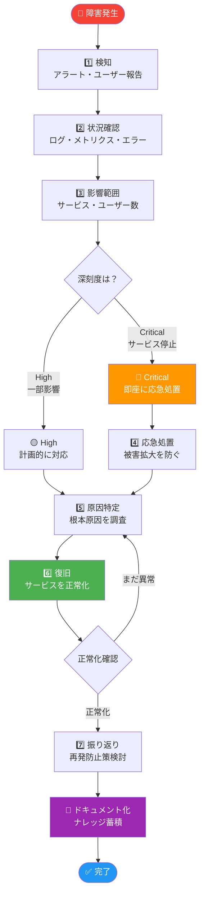
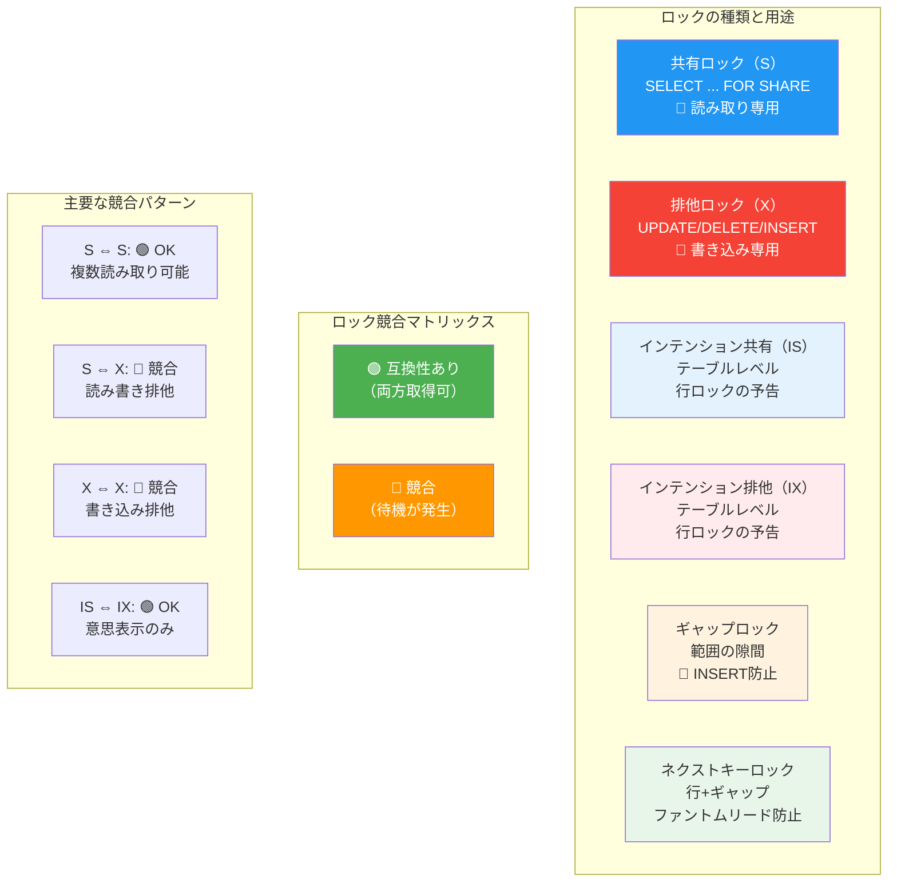
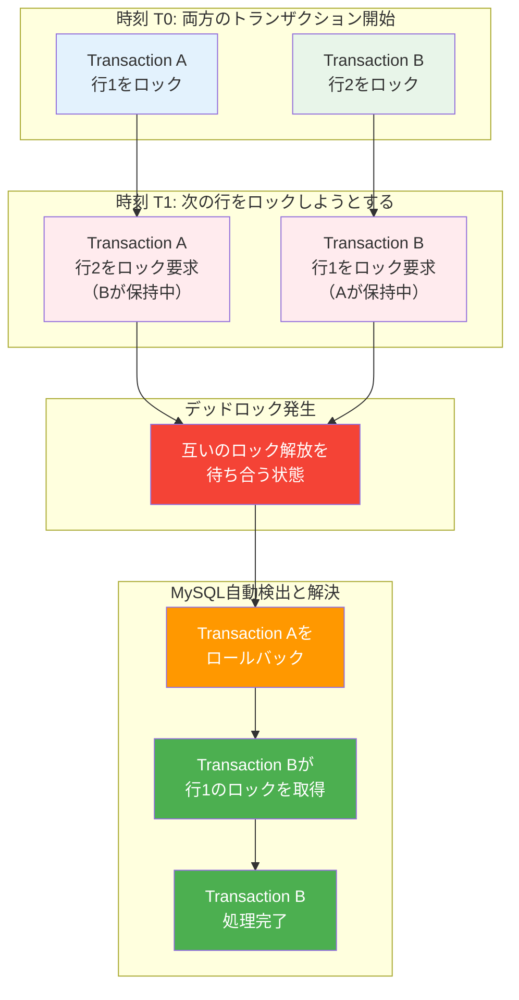
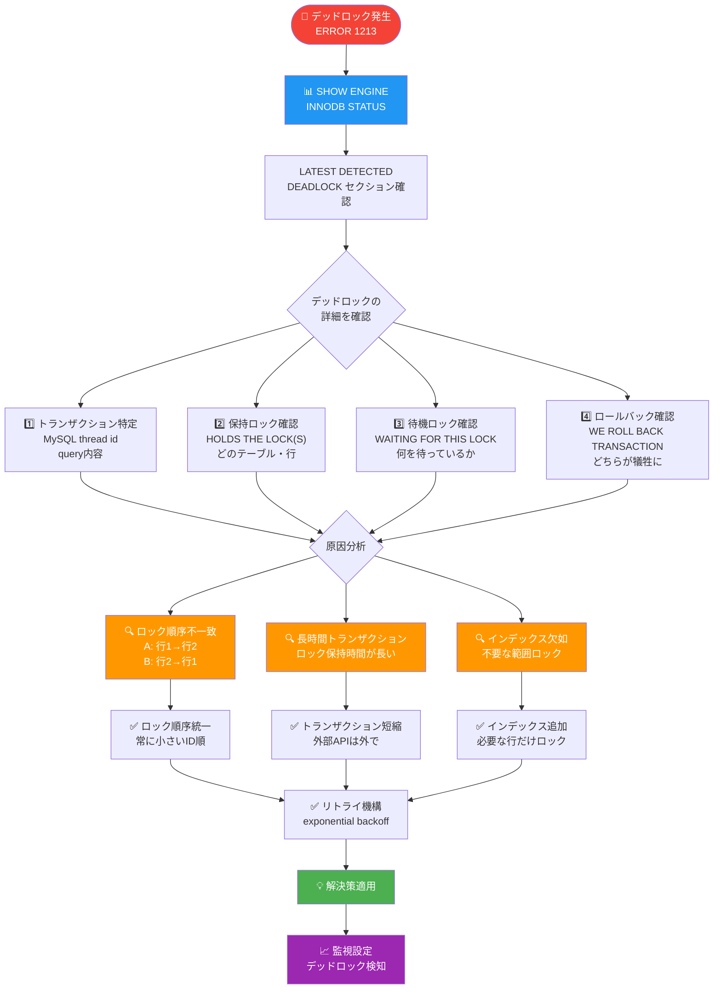
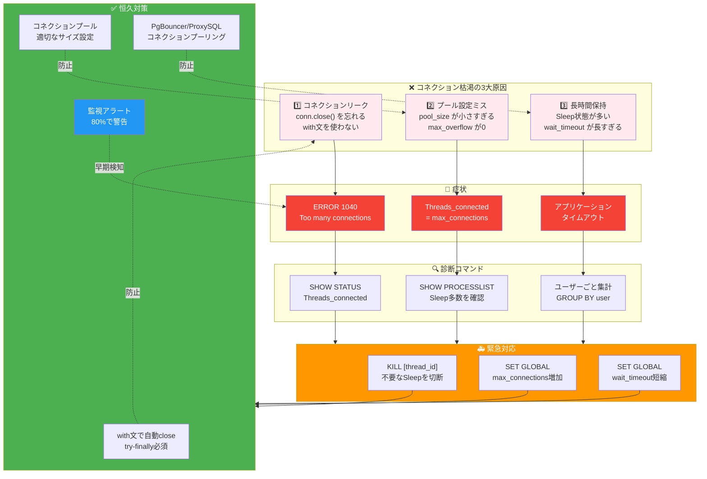
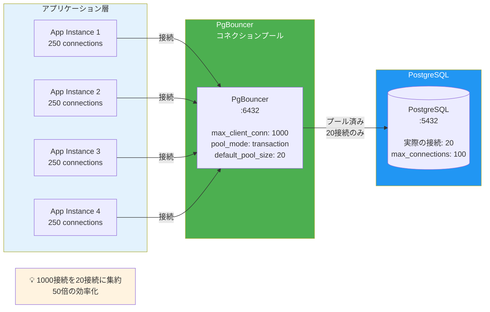
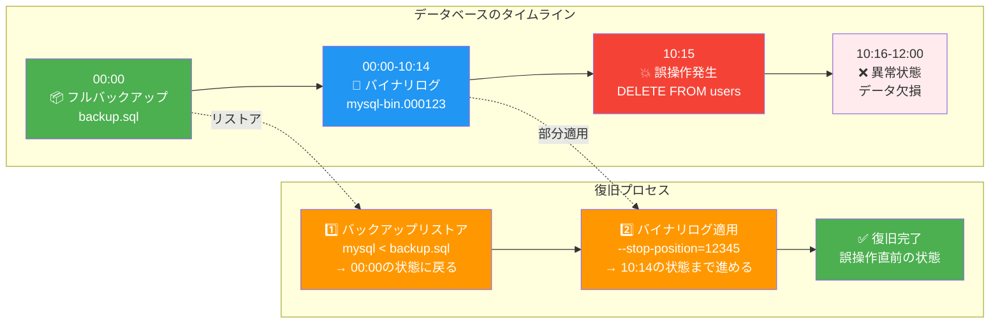
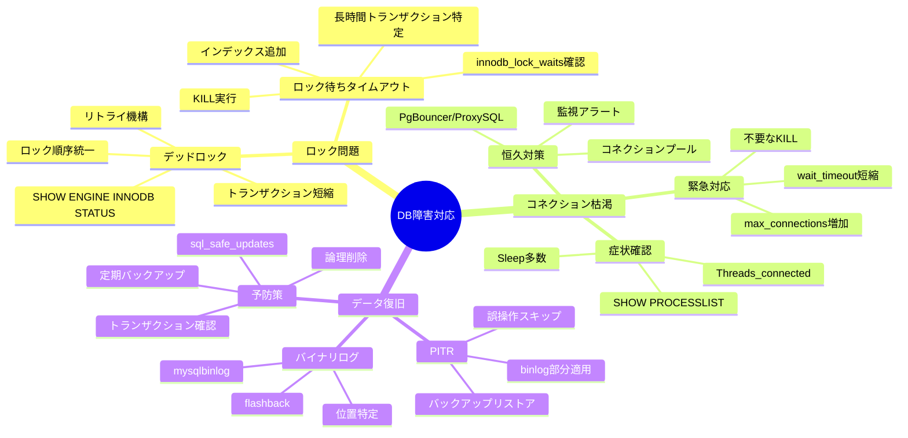

## この記事の対象読者

- 本番環境でDB障害に遭遇して焦った経験がある人
- 「ロック待ちでタイムアウト」のエラーを見たことがある人
- 「Too many connections」で冷や汗をかいたことがある人
- 誤ってDELETE文を実行してしまったことがある（または怖い）人

この記事では、**ロック関連の障害調査**、**コネクション枯渇の対応**、**データ誤削除からの復旧**まで、実務で遭遇するデータベース障害の対応方法を体系的に解説します。

---

## 障害対応の心構え

### まず落ち着く

障害発生時、最初にやることは **深呼吸** です。

```
❌ やってはいけないこと
- 焦ってよく分からないコマンドを打つ
- 原因特定前に再起動する
- ログを見ずに「たぶんこれだろう」で対応する

✅ やるべきこと
- 現状を把握する（何が起きているか）
- 影響範囲を確認する（どこまで影響しているか）
- 記録を残す（後で振り返れるように）
```

### 障害対応の基本フロー



**重要ポイント：**
- **深呼吸してから行動** — 焦りは禁物
- **記録を残す** — 後で振り返れるように
- **影響範囲を把握** — 優先順位を決める

---

# 第1部：ロック関連の障害

## ロックとは何か

### 基本概念

**ロック** は、複数のトランザクションが同時に同じデータを変更することを防ぐ仕組みです。

```sql
-- トランザクションA
BEGIN;
UPDATE accounts SET balance = balance - 1000 WHERE id = 1;
-- ここでロックを取得（id=1の行）
-- ...処理中...
COMMIT;
-- ロック解放

-- トランザクションB（同時実行）
BEGIN;
UPDATE accounts SET balance = balance + 1000 WHERE id = 1;
-- Aがロックを持っているので待機...
-- Aがコミットするまで待つ
```

### ロックの種類（MySQL InnoDB）



**ロック競合の完全マトリックス：**

|  | S（共有） | X（排他） | IS | IX |
|--|---------|---------|-----|-----|
| **S** | 🟢 OK | 🔴 競合 | 🟢 OK | 🔴 競合 |
| **X** | 🔴 競合 | 🔴 競合 | 🔴 競合 | 🔴 競合 |
| **IS** | 🟢 OK | 🔴 競合 | 🟢 OK | 🟢 OK |
| **IX** | 🔴 競合 | 🔴 競合 | 🟢 OK | 🟢 OK |

**実務での使い分け：**
- **SELECT ... FOR SHARE** → 共有ロック（複数読み可）
- **SELECT ... FOR UPDATE** → 排他ロック（完全排他）
- **UPDATE/DELETE** → 自動で排他ロック
- **REPEATABLE READ** → ギャップロック・ネクストキーロック自動適用

---

## デッドロック

### デッドロックとは

**デッドロック** は、2つ以上のトランザクションが互いのロック解放を待ち合う状態です。



**デッドロック発生の条件（4つ全て満たす）：**
1. **相互排除** — リソースが排他的に使われる
2. **保持と待機** — ロックを保持しながら別のロックを待つ
3. **非プリエンプション** — ロックは自発的にしか解放されない
4. **循環待機** — ロック待ちが循環する（A→B→A）

### デッドロックの検出

MySQLはデッドロックを自動検出し、**片方のトランザクションをロールバック** します。

```sql
-- エラーメッセージ
ERROR 1213 (40001): Deadlock found when trying to get lock;
try restarting transaction
```

### デッドロックの調査（MySQL）

```sql
-- 最新のデッドロック情報を表示
SHOW ENGINE INNODB STATUS\G
```

出力の `LATEST DETECTED DEADLOCK` セクションを確認：

```
------------------------
LATEST DETECTED DEADLOCK
------------------------
2025-12-13 10:30:45 0x7f1234567890
*** (1) TRANSACTION:
TRANSACTION 12345, ACTIVE 5 sec starting index read
mysql tables in use 1, locked 1
LOCK WAIT 3 lock struct(s), heap size 1136, 2 row lock(s)
MySQL thread id 100, OS thread handle 123456, query id 5000 localhost app
UPDATE accounts SET balance = balance - 1000 WHERE id = 1

*** (1) HOLDS THE LOCK(S):
RECORD LOCKS space id 50 page no 3 n bits 72 index PRIMARY of table `mydb`.`accounts`
trx id 12345 lock_mode X locks rec but not gap

*** (1) WAITING FOR THIS LOCK TO BE GRANTED:
RECORD LOCKS space id 50 page no 4 n bits 72 index PRIMARY of table `mydb`.`accounts`
trx id 12345 lock_mode X locks rec but not gap waiting

*** (2) TRANSACTION:
TRANSACTION 12346, ACTIVE 3 sec starting index read
...

*** WE ROLL BACK TRANSACTION (2)
```

### デッドロックの分析ポイント



**分析の4つのステップ：**

1. **どのトランザクションが関与しているか**
   → MySQL thread id, query を確認

2. **どのロックを持っているか**
   → HOLDS THE LOCK(S) を確認

3. **どのロックを待っているか**
   → WAITING FOR THIS LOCK を確認

4. **どちらがロールバックされたか**
   → WE ROLL BACK TRANSACTION を確認

### デッドロックの解決策

**1. ロック順序を統一する**

```python
# 悪い例：順序がバラバラ
def transfer_bad(from_id, to_id, amount):
    # トランザクションAは1→2の順
    # トランザクションBは2→1の順
    # → デッドロックの可能性
    update_account(from_id, -amount)
    update_account(to_id, +amount)

# 良い例：常に小さいIDから処理
def transfer_good(from_id, to_id, amount):
    ids = sorted([from_id, to_id])
    if from_id == ids[0]:
        update_account(ids[0], -amount)
        update_account(ids[1], +amount)
    else:
        update_account(ids[0], +amount)
        update_account(ids[1], -amount)
```

**2. トランザクションを短くする**

```python
# 悪い例：トランザクション内で外部API呼び出し
def process_order_bad():
    with db.transaction():
        order = create_order()
        payment = call_payment_api()  # ← 遅い！ロック長時間保持
        update_order(order, payment)

# 良い例：外部呼び出しはトランザクション外
def process_order_good():
    order = create_order_draft()
    payment = call_payment_api()  # トランザクション外
    with db.transaction():
        finalize_order(order, payment)  # 最小限の処理
```

**3. リトライ機構を実装する**

```python
import time
from mysql.connector import errors

def execute_with_retry(func, max_retries=3):
    for attempt in range(max_retries):
        try:
            return func()
        except errors.DatabaseError as e:
            if e.errno == 1213:  # Deadlock
                if attempt < max_retries - 1:
                    time.sleep(0.1 * (2 ** attempt))  # 指数バックオフ
                    continue
            raise
```

---

## ロック待ちタイムアウト

### 症状

```sql
ERROR 1205 (HY000): Lock wait timeout exceeded;
try restarting transaction
```

デッドロックではないが、ロック待ちが長すぎてタイムアウトした状態です。

### ロック待ちの調査（MySQL）

```sql
-- 現在のロック待ち状況を確認
SELECT
    r.trx_id AS waiting_trx_id,
    r.trx_mysql_thread_id AS waiting_thread,
    r.trx_query AS waiting_query,
    b.trx_id AS blocking_trx_id,
    b.trx_mysql_thread_id AS blocking_thread,
    b.trx_query AS blocking_query
FROM
    information_schema.innodb_lock_waits w
    JOIN information_schema.innodb_trx b ON b.trx_id = w.blocking_trx_id
    JOIN information_schema.innodb_trx r ON r.trx_id = w.requesting_trx_id;
```

**MySQL 8.0以降：**

```sql
-- performance_schemaを使用
SELECT
    waiting.THREAD_ID AS waiting_thread,
    waiting.EVENT_NAME AS waiting_event,
    waiting.OBJECT_NAME AS waiting_table,
    blocking.THREAD_ID AS blocking_thread,
    blocking.EVENT_NAME AS blocking_event
FROM
    performance_schema.data_lock_waits w
    JOIN performance_schema.data_locks waiting
        ON w.REQUESTING_ENGINE_LOCK_ID = waiting.ENGINE_LOCK_ID
    JOIN performance_schema.data_locks blocking
        ON w.BLOCKING_ENGINE_LOCK_ID = blocking.ENGINE_LOCK_ID;
```

### 実行中のトランザクション一覧

```sql
-- 全トランザクションを表示
SELECT
    trx_id,
    trx_state,
    trx_started,
    trx_mysql_thread_id,
    trx_query,
    trx_rows_locked,
    trx_rows_modified
FROM
    information_schema.innodb_trx
ORDER BY
    trx_started;
```

### プロセスリストの確認

```sql
-- 全接続を表示
SHOW FULL PROCESSLIST;

-- または
SELECT
    id,
    user,
    host,
    db,
    command,
    time,
    state,
    info
FROM
    information_schema.processlist
WHERE
    command != 'Sleep'
ORDER BY
    time DESC;
```

### 長時間ロックを持つトランザクションを特定

```sql
-- 60秒以上実行中のトランザクション
SELECT
    trx_id,
    trx_started,
    TIMESTAMPDIFF(SECOND, trx_started, NOW()) AS duration_sec,
    trx_mysql_thread_id,
    trx_query
FROM
    information_schema.innodb_trx
WHERE
    TIMESTAMPDIFF(SECOND, trx_started, NOW()) > 60
ORDER BY
    trx_started;
```

### ブロッキングトランザクションの強制終了

```sql
-- 問題のスレッドを特定したら
KILL [thread_id];

-- 例
KILL 12345;
```

**注意：** KILLはトランザクションをロールバックします。影響を理解してから実行してください。

---

## ロック関連の調査（PostgreSQL）

### 現在のロック状況

```sql
-- ロック待ちを確認
SELECT
    blocked.pid AS blocked_pid,
    blocked.usename AS blocked_user,
    blocked.query AS blocked_query,
    blocking.pid AS blocking_pid,
    blocking.usename AS blocking_user,
    blocking.query AS blocking_query
FROM
    pg_catalog.pg_locks blocked_locks
    JOIN pg_catalog.pg_stat_activity blocked
        ON blocked.pid = blocked_locks.pid
    JOIN pg_catalog.pg_locks blocking_locks
        ON blocking_locks.locktype = blocked_locks.locktype
        AND blocking_locks.database IS NOT DISTINCT FROM blocked_locks.database
        AND blocking_locks.relation IS NOT DISTINCT FROM blocked_locks.relation
        AND blocking_locks.pid != blocked_locks.pid
    JOIN pg_catalog.pg_stat_activity blocking
        ON blocking.pid = blocking_locks.pid
WHERE
    NOT blocked_locks.granted;
```

### 長時間実行中のクエリ

```sql
SELECT
    pid,
    usename,
    now() - pg_stat_activity.query_start AS duration,
    query,
    state
FROM
    pg_stat_activity
WHERE
    (now() - pg_stat_activity.query_start) > interval '5 minutes'
    AND state != 'idle'
ORDER BY
    duration DESC;
```

### トランザクションの強制終了

```sql
-- 穏やかに終了（SIGTERM）
SELECT pg_cancel_backend(pid);

-- 強制終了（SIGKILL）
SELECT pg_terminate_backend(pid);
```

---

## ロック問題の予防

### 1. 適切なインデックス

```sql
-- インデックスがないと全行スキャン→全行ロック
-- 悪い例
UPDATE orders SET status = 'shipped' WHERE customer_id = 123;
-- customer_idにインデックスがないと全行ロック

-- 良い例：インデックスを作成
CREATE INDEX idx_orders_customer_id ON orders(customer_id);
```

### 2. SELECT ... FOR UPDATE の使い方

```sql
-- 明示的にロックを取得
SELECT * FROM accounts WHERE id = 1 FOR UPDATE;

-- NOWAIT：ロックが取れなければ即エラー
SELECT * FROM accounts WHERE id = 1 FOR UPDATE NOWAIT;

-- SKIP LOCKED：ロック中の行をスキップ（キュー処理に便利）
SELECT * FROM tasks WHERE status = 'pending'
FOR UPDATE SKIP LOCKED
LIMIT 1;
```

### 3. トランザクション分離レベル

```sql
-- 現在の分離レベルを確認
SELECT @@transaction_isolation;  -- MySQL
SHOW transaction_isolation;       -- PostgreSQL

-- 分離レベルを設定
SET TRANSACTION ISOLATION LEVEL READ COMMITTED;
```

| 分離レベル | ロックの強さ | 用途 |
|-----------|-------------|------|
| READ UNCOMMITTED | 最も弱い | ほぼ使わない |
| READ COMMITTED | 弱い | 一般的なWebアプリ |
| REPEATABLE READ | 中程度 | MySQLデフォルト |
| SERIALIZABLE | 最も強い | 厳密な整合性が必要 |

---

# 第2部：コネクション枯渇

## 症状

```
# MySQL
ERROR 1040 (HY000): Too many connections

# PostgreSQL
FATAL: sorry, too many clients already
```

## 現状確認（MySQL）

```sql
-- 最大接続数
SHOW VARIABLES LIKE 'max_connections';

-- 現在の接続数
SHOW STATUS LIKE 'Threads_connected';

-- 接続の詳細
SELECT
    user,
    host,
    db,
    command,
    time,
    state
FROM
    information_schema.processlist
ORDER BY
    time DESC;

-- ユーザーごとの接続数
SELECT
    user,
    COUNT(*) AS connections
FROM
    information_schema.processlist
GROUP BY
    user
ORDER BY
    connections DESC;
```

## 現状確認（PostgreSQL）

```sql
-- 最大接続数
SHOW max_connections;

-- 現在の接続数
SELECT count(*) FROM pg_stat_activity;

-- 接続の詳細
SELECT
    pid,
    usename,
    application_name,
    client_addr,
    state,
    query_start,
    query
FROM
    pg_stat_activity
ORDER BY
    query_start;

-- 状態ごとの接続数
SELECT
    state,
    COUNT(*)
FROM
    pg_stat_activity
GROUP BY
    state;
```

## コネクション枯渇の原因と対策



### 1. コネクションリーク

```python
# 悪い例：コネクションを閉じていない
def get_user_bad(user_id):
    conn = mysql.connector.connect(...)
    cursor = conn.cursor()
    cursor.execute("SELECT * FROM users WHERE id = %s", (user_id,))
    return cursor.fetchone()
    # conn.close() がない！

# 良い例：with文で自動クローズ
def get_user_good(user_id):
    with mysql.connector.connect(...) as conn:
        with conn.cursor() as cursor:
            cursor.execute("SELECT * FROM users WHERE id = %s", (user_id,))
            return cursor.fetchone()
    # withを抜けると自動でclose
```

### 2. コネクションプールの設定ミス

```python
# SQLAlchemyの例
from sqlalchemy import create_engine

# 悪い例：プールサイズが小さすぎる
engine = create_engine(
    "mysql://...",
    pool_size=5,        # 本番で5は少なすぎる
    max_overflow=0      # オーバーフロー禁止
)

# 良い例：適切なサイズ
engine = create_engine(
    "mysql://...",
    pool_size=20,
    max_overflow=10,     # 一時的に30まで増加可能
    pool_timeout=30,     # プール取得のタイムアウト
    pool_recycle=3600,   # 1時間でコネクションを再作成
    pool_pre_ping=True   # 使用前に接続確認
)
```

### 3. 長時間接続の保持

```sql
-- Sleepが多い場合は接続が解放されていない
SELECT
    command,
    COUNT(*) AS count,
    AVG(time) AS avg_time
FROM
    information_schema.processlist
GROUP BY
    command;
```

```
+-------------+-------+----------+
| command     | count | avg_time |
+-------------+-------+----------+
| Sleep       | 150   | 300.5    |  ← Sleep が多い = コネクションリーク
| Query       | 5     | 0.1      |
+-------------+-------+----------+
```

## 緊急対応

### 1. 不要なコネクションを切断

```sql
-- MySQL: Sleepが長いコネクションを特定
SELECT
    id,
    user,
    host,
    time
FROM
    information_schema.processlist
WHERE
    command = 'Sleep'
    AND time > 300
ORDER BY
    time DESC;

-- 切断
KILL [id];
```

### 2. 最大接続数を一時的に増やす

```sql
-- MySQL（動的変更可能）
SET GLOBAL max_connections = 500;

-- PostgreSQL（再起動が必要）
-- postgresql.conf を編集
max_connections = 500
```

### 3. wait_timeout を短くする

```sql
-- MySQL: アイドルコネクションのタイムアウト
SET GLOBAL wait_timeout = 300;      -- 5分（デフォルト8時間）
SET GLOBAL interactive_timeout = 300;
```

## コネクション管理のベストプラクティス

### 1. コネクションプール必須

```python
# Pythonの例（各フレームワーク）

# Django
DATABASES = {
    'default': {
        'ENGINE': 'django.db.backends.mysql',
        'CONN_MAX_AGE': 300,  # 5分間コネクションを再利用
        'CONN_HEALTH_CHECKS': True,  # Django 4.1+
    }
}

# FastAPI + SQLAlchemy
from sqlalchemy.pool import QueuePool

engine = create_engine(
    DATABASE_URL,
    poolclass=QueuePool,
    pool_size=10,
    max_overflow=20,
)
```

### 2. PgBouncer（PostgreSQL用プロキシ）



**設定例：**

```ini
# pgbouncer.ini
[databases]
mydb = host=localhost dbname=mydb

[pgbouncer]
listen_addr = 127.0.0.1
listen_port = 6432
auth_type = md5
auth_file = /etc/pgbouncer/userlist.txt

# プールモード
pool_mode = transaction  # トランザクション単位でプール

# サイズ設定
max_client_conn = 1000   # クライアントからの最大接続
default_pool_size = 20   # DBへの実際の接続数
```

**効果：**
- **Before**: 1000アプリ接続 → 1000 DB接続 → 枯渇
- **After**: 1000アプリ接続 → 20 DB接続 → 余裕

### 3. ProxySQL（MySQL用プロキシ）

```sql
-- ProxySQLの設定
INSERT INTO mysql_servers (hostgroup_id, hostname, port)
VALUES (1, 'mysql-master', 3306);

-- コネクションプール設定
UPDATE global_variables
SET variable_value = '100'
WHERE variable_name = 'mysql-max_connections';

-- 読み取りクエリの分散
INSERT INTO mysql_query_rules (rule_id, match_pattern, destination_hostgroup)
VALUES (1, '^SELECT', 2);  -- SELECTはレプリカへ
```

---

# 第3部：データ誤削除からの復旧

## 最悪のシナリオ

```sql
-- やってしまった...
DELETE FROM users;  -- WHERE句を忘れた！

-- または
DROP TABLE orders;  -- 間違えた！
```

**まず落ち着いてください。** 復旧方法はあります。

## 復旧方法の概要

| 方法 | 条件 | 復旧可能範囲 |
|------|------|-------------|
| バイナリログ | binlog有効 | 任意の時点 |
| バックアップ+PITR | バックアップ+binlog | 任意の時点 |
| スナップショット | クラウド/LVM | スナップショット時点 |
| レプリカから | レプリカが遅延 | レプリカの時点 |
| 論理バックアップ | mysqldump等 | バックアップ時点 |

---

## バイナリログからの復旧（MySQL）

### 前提条件

```sql
-- バイナリログが有効か確認
SHOW VARIABLES LIKE 'log_bin';
-- ON であれば使用可能

-- バイナリログの一覧
SHOW BINARY LOGS;
```

### 手順1：該当のバイナリログを特定

```bash
# 現在のバイナリログファイル
mysql -e "SHOW MASTER STATUS"

# バイナリログの内容を確認（人間が読める形式）
mysqlbinlog --base64-output=DECODE-ROWS -v \
    /var/lib/mysql/mysql-bin.000123 | less
```

### 手順2：誤操作の位置を特定

```bash
# 特定の時間範囲で検索
mysqlbinlog --base64-output=DECODE-ROWS -v \
    --start-datetime="2025-12-13 10:00:00" \
    --stop-datetime="2025-12-13 10:30:00" \
    /var/lib/mysql/mysql-bin.000123 | grep -A 20 "DELETE"
```

出力例：
```
# at 12345
#251213 10:15:30 server id 1  end_log_pos 12500
# DELETE FROM users WHERE id = 100
### DELETE FROM `mydb`.`users`
### WHERE
###   @1=100
###   @2='john@example.com'
###   @3='John Doe'
```

### 手順3：復旧SQLを生成

```bash
# mysqlbinlog でDELETEをINSERTに変換
# --flashback オプション（MariaDB）または手動で変換

# 誤操作の直前までのログを抽出
mysqlbinlog \
    --start-position=1000 \
    --stop-position=12345 \
    /var/lib/mysql/mysql-bin.000123 > recovery.sql

# 適用
mysql < recovery.sql
```

### Flashback（MariaDB）

MariaDBには `--flashback` オプションがあり、DELETEをINSERTに自動変換できます：

```bash
# DELETEをINSERTに変換
mysqlbinlog --flashback \
    --start-position=12345 \
    --stop-position=12500 \
    /var/lib/mysql/mariadb-bin.000123 > flashback.sql

# 実行
mysql < flashback.sql
```

---

## ポイントインタイムリカバリ（PITR）

### 概念

```mermaid
gantt
    title ポイントインタイムリカバリ（PITR）のタイムライン
    dateFormat HH:mm
    axisFormat %H:%M

    section データ状態
    正常稼働          :done, normal1, 00:00, 10:00
    誤操作発生        :crit, error, 10:15, 10:16
    異常状態          :active, abnormal, 10:16, 12:00

    section 復旧作業
    バックアップ時点  :milestone, backup, 00:00, 0m
    誤操作発生時刻    :milestone, mistake, 10:15, 0m
    復旧目標時点      :milestone, target, 10:14, 0m
```





**復旧の流れ：**
1. **00:00のバックアップ** をリストア → データベースが00:00の状態に戻る
2. **00:00〜10:14のバイナリログ** を適用 → 誤操作直前まで進める
3. **10:15の誤操作** はスキップ
4. **復旧完了** — 10:14時点のデータが復元される

### 手順（MySQL）

```bash
# 1. バックアップをリストア
mysql -u root -p mydb < backup_20251213.sql

# 2. 必要なバイナリログを特定
ls -la /var/lib/mysql/mysql-bin.*

# 3. 誤操作の位置を特定
mysqlbinlog --base64-output=DECODE-ROWS -v \
    /var/lib/mysql/mysql-bin.000123 | less

# 4. 誤操作の直前までバイナリログを適用
mysqlbinlog \
    --stop-position=12345 \
    /var/lib/mysql/mysql-bin.000120 \
    /var/lib/mysql/mysql-bin.000121 \
    /var/lib/mysql/mysql-bin.000122 \
    /var/lib/mysql/mysql-bin.000123 | mysql -u root -p mydb
```

---

## WALからの復旧（PostgreSQL）

### 前提条件

```sql
-- アーカイブモードが有効か確認
SHOW archive_mode;
-- on であれば使用可能

-- WALの場所
SHOW archive_command;
```

### 手順

```bash
# 1. PostgreSQLを停止
systemctl stop postgresql

# 2. データディレクトリをバックアップから復元
rm -rf /var/lib/postgresql/14/main/*
tar xzf backup_20251213.tar.gz -C /var/lib/postgresql/14/main/

# 3. recovery.signal を作成（PostgreSQL 12+）
touch /var/lib/postgresql/14/main/recovery.signal

# 4. postgresql.conf に復旧設定を追加
cat >> /var/lib/postgresql/14/main/postgresql.conf << EOF
restore_command = 'cp /var/lib/postgresql/wal_archive/%f %p'
recovery_target_time = '2025-12-13 10:15:00'
recovery_target_action = 'promote'
EOF

# 5. 起動
systemctl start postgresql
```

### pg_basebackup でのバックアップ

```bash
# フルバックアップ
pg_basebackup -h localhost -U postgres \
    -D /backup/base_20251213 \
    -Ft -z -P

# WALアーカイブ設定（postgresql.conf）
archive_mode = on
archive_command = 'cp %p /var/lib/postgresql/wal_archive/%f'
```

---

## AWS RDSでの復旧

### スナップショットからの復旧

```bash
# 利用可能なスナップショットを確認
aws rds describe-db-snapshots \
    --db-instance-identifier mydb

# スナップショットから新しいインスタンスを作成
aws rds restore-db-instance-from-db-snapshot \
    --db-instance-identifier mydb-restored \
    --db-snapshot-identifier mydb-snapshot-20251213
```

### ポイントインタイムリカバリ

```bash
# 特定の時点に復旧
aws rds restore-db-instance-to-point-in-time \
    --source-db-instance-identifier mydb \
    --target-db-instance-identifier mydb-pitr \
    --restore-time "2025-12-13T10:15:00Z"

# 最新の復旧可能時刻を確認
aws rds describe-db-instances \
    --db-instance-identifier mydb \
    --query 'DBInstances[0].LatestRestorableTime'
```

---

## 削除防止策

### 1. トランザクションで確認

```sql
-- 常にトランザクションで実行
BEGIN;

DELETE FROM users WHERE id = 100;

-- 結果を確認
SELECT * FROM users WHERE id = 100;

-- 問題なければ
COMMIT;

-- 問題があれば
ROLLBACK;
```

### 2. 論理削除（Soft Delete）

```sql
-- 物理削除の代わりに論理削除
ALTER TABLE users ADD COLUMN deleted_at TIMESTAMP NULL;

-- DELETE の代わりに UPDATE
UPDATE users SET deleted_at = NOW() WHERE id = 100;

-- アプリケーション側で除外
SELECT * FROM users WHERE deleted_at IS NULL;
```

### 3. トリガーでバックアップ

```sql
-- 削除前にバックアップテーブルに保存
CREATE TABLE users_deleted_backup (
    backup_id INT AUTO_INCREMENT PRIMARY KEY,
    deleted_at TIMESTAMP DEFAULT CURRENT_TIMESTAMP,
    original_id INT,
    email VARCHAR(255),
    name VARCHAR(255)
    -- ... 他のカラム
);

DELIMITER //
CREATE TRIGGER backup_before_delete
BEFORE DELETE ON users
FOR EACH ROW
BEGIN
    INSERT INTO users_deleted_backup (original_id, email, name)
    VALUES (OLD.id, OLD.email, OLD.name);
END//
DELIMITER ;
```

### 4. 安全なDELETEスクリプト

```bash
#!/bin/bash
# safe_delete.sh

TABLE=$1
WHERE_CLAUSE=$2

# 削除対象を表示
echo "以下のレコードが削除されます："
mysql -e "SELECT * FROM $TABLE WHERE $WHERE_CLAUSE LIMIT 10"

# 件数を表示
COUNT=$(mysql -N -e "SELECT COUNT(*) FROM $TABLE WHERE $WHERE_CLAUSE")
echo "合計: $COUNT 件"

# 確認
read -p "本当に削除しますか？ (yes/no): " CONFIRM
if [ "$CONFIRM" != "yes" ]; then
    echo "中止しました"
    exit 1
fi

# 削除実行
mysql -e "DELETE FROM $TABLE WHERE $WHERE_CLAUSE"
echo "削除完了"
```

### 5. MySQLのsql_safe_updates

```sql
-- WHERE句なしのUPDATE/DELETEを禁止
SET sql_safe_updates = 1;

-- これはエラーになる
DELETE FROM users;
-- ERROR 1175: You are using safe update mode...

-- WHEREが必要
DELETE FROM users WHERE id = 100;  -- OK
```

---

## 障害対応チェックリスト

### ロック問題

```
□ SHOW ENGINE INNODB STATUS でデッドロック確認
□ information_schema.innodb_trx で長時間トランザクション確認
□ information_schema.innodb_lock_waits でロック待ち確認
□ 問題のトランザクションを特定
□ 必要に応じて KILL で強制終了
□ アプリケーションにリトライ機構を追加
```

### コネクション枯渇

```
□ SHOW STATUS LIKE 'Threads_connected' で現状確認
□ SHOW PROCESSLIST で接続の内訳を確認
□ Sleep が多い場合はコネクションリークを疑う
□ 不要なコネクションを KILL
□ 必要に応じて max_connections を増加
□ コネクションプールの設定を見直し
```

### データ復旧

```
□ まず追加の変更を止める（READ ONLY化）
□ バイナリログ/WALが有効か確認
□ 誤操作の時刻・位置を特定
□ バックアップからのリストアを計画
□ バイナリログ/WALを誤操作直前まで適用
□ データを確認
□ サービス復旧
```

---

## 監視と予防

### 監視すべきメトリクス

```yaml
# Prometheus + MySQL Exporter の例
groups:
  - name: mysql_alerts
    rules:
      # コネクション使用率
      - alert: MySQLTooManyConnections
        expr: mysql_global_status_threads_connected / mysql_global_variables_max_connections > 0.8
        for: 5m
        labels:
          severity: warning
        annotations:
          summary: "MySQL connections > 80%"

      # デッドロック検知
      - alert: MySQLDeadlocks
        expr: rate(mysql_global_status_innodb_deadlocks[5m]) > 0
        for: 1m
        labels:
          severity: warning
        annotations:
          summary: "Deadlock detected"

      # 長時間クエリ
      - alert: MySQLSlowQueries
        expr: rate(mysql_global_status_slow_queries[5m]) > 1
        for: 5m
        labels:
          severity: warning
        annotations:
          summary: "Slow queries increasing"
```

### 定期バックアップ

```bash
#!/bin/bash
# backup.sh

DATE=$(date +%Y%m%d_%H%M%S)
BACKUP_DIR="/backup/mysql"

# フルバックアップ（週次）
if [ "$(date +%u)" = "1" ]; then
    mysqldump --all-databases \
        --single-transaction \
        --routines \
        --triggers \
        --events \
        > "${BACKUP_DIR}/full_${DATE}.sql"
fi

# 差分バックアップ用にバイナリログをローテート
mysql -e "FLUSH BINARY LOGS"

# バイナリログをアーカイブ
cp /var/lib/mysql/mysql-bin.* "${BACKUP_DIR}/binlogs/"

# 古いバックアップを削除（30日以上前）
find "${BACKUP_DIR}" -name "*.sql" -mtime +30 -delete
```

---

## まとめ

### データベース障害対応の全体マップ



### ロック問題

| 症状 | 調査 | 対応 |
|------|------|------|
| デッドロック | SHOW ENGINE INNODB STATUS | リトライ機構、ロック順序統一 |
| ロック待ち | innodb_lock_waits | 長時間トランザクションをKILL |
| 遅いクエリ | SHOW PROCESSLIST | インデックス追加、クエリ最適化 |

### コネクション問題

| 症状 | 調査 | 対応 |
|------|------|------|
| Too many connections | Threads_connected確認 | max_connections増加、プール設定見直し |
| コネクションリーク | Sleepが多い | アプリケーション修正、wait_timeout短縮 |

### データ復旧

| 状況 | 方法 | 条件 |
|------|------|------|
| 直後に気づいた | ROLLBACK | トランザクション内 |
| 数分後 | バイナリログ | binlog有効 |
| 数時間後 | PITR | バックアップ+binlog |
| 翌日 | バックアップ復元 | バックアップあり |

### 心がけ

1. **バックアップは命綱** — 定期的に取得、復旧テストも実施
2. **監視は早期発見の鍵** — 異常を検知できる体制を
3. **DELETE/DROPは慎重に** — トランザクション、確認、論理削除
4. **ドキュメントを残す** — 障害対応の手順を整備

---

## 参考リンク

- [MySQL公式: InnoDBロック](https://dev.mysql.com/doc/refman/8.0/ja/innodb-locking.html)
- [PostgreSQL公式: ロック管理](https://www.postgresql.org/docs/current/explicit-locking.html)
- [MySQL公式: ポイントインタイムリカバリ](https://dev.mysql.com/doc/refman/8.0/ja/point-in-time-recovery.html)
- [Percona: MySQL Troubleshooting](https://www.percona.com/blog/)
- [AWS RDS: ベストプラクティス](https://docs.aws.amazon.com/AmazonRDS/latest/UserGuide/CHAP_BestPractices.html)
