## この記事の対象読者

- 「コンテナが起動しない」と言われて焦った経験がある人
- `docker logs` しか知らない人
- 本番環境でDockerを運用している/これからする人
- コンテナ内で何が起きているか分からず困った経験がある人

この記事では、**コンテナの状態確認**から、**ログ調査**、**リソース調査**、**ネットワーク調査**、**よくある障害パターン**まで、Docker障害調査を体系的に解説します。

---

## 障害調査の基本フロー

```mermaid
flowchart TB
    Start["🔍 障害発生"] --> Step1["1️⃣ 状態確認<br/>コンテナは動いているか？<br/><code>docker ps -a</code>"]
    Step1 --> Step2["2️⃣ ログ確認<br/>何が出力されているか？<br/><code>docker logs</code>"]
    Step2 --> Step3["3️⃣ リソース確認<br/>CPU/メモリ/ディスクは足りているか？<br/><code>docker stats</code>"]
    Step3 --> Step4["4️⃣ ネットワーク確認<br/>通信できているか？<br/><code>docker network inspect</code>"]
    Step4 --> Step5["5️⃣ 設定確認<br/>環境変数、マウント、ポートは正しいか？<br/><code>docker inspect</code>"]
    Step5 --> Step6["6️⃣ コンテナ内調査<br/>中に入って確認<br/><code>docker exec</code>"]
    Step6 --> Resolve["✅ 問題解決"]

    style Start fill:#ffebee
    style Resolve fill:#e8f5e9
    style Step1 fill:#e3f2fd
    style Step2 fill:#e3f2fd
    style Step3 fill:#e3f2fd
    style Step4 fill:#e3f2fd
    style Step5 fill:#e3f2fd
    style Step6 fill:#e3f2fd
```



---

# 第1部：コンテナの状態確認

## docker ps：稼働中のコンテナ一覧

```bash
# 稼働中のコンテナ
docker ps

# 全てのコンテナ（停止中も含む）
docker ps -a

# 最近終了したコンテナ
docker ps -a --filter "status=exited"

# 特定の名前でフィルタ
docker ps -a --filter "name=web"

# フォーマットをカスタマイズ
docker ps --format "table {{.Names}}\t{{.Status}}\t{{.Ports}}"
```

出力例：
```
CONTAINER ID   IMAGE          COMMAND                  STATUS                      NAMES
abc123         nginx:latest   "/docker-entrypoint.…"   Up 2 hours                  web
def456         mysql:8        "docker-entrypoint.s…"   Exited (1) 5 minutes ago    db
ghi789         redis:7        "docker-entrypoint.s…"   Up 2 hours                  cache
```

## STATUSの読み方

| STATUS | 意味 | 対応 |
|--------|------|------|
| `Up X hours` | 正常稼働中 | - |
| `Exited (0)` | 正常終了 | 意図した終了か確認 |
| `Exited (1)` | エラー終了 | ログを確認 |
| `Exited (137)` | SIGKILL（OOMKilled等） | メモリ確認 |
| `Exited (143)` | SIGTERM（正常停止） | docker stopされた |
| `Restarting` | 再起動ループ | ログとヘルスチェック確認 |
| `Created` | 作成のみ（起動していない） | docker start が必要 |
| `Dead` | 削除に失敗 | docker rm -f で強制削除 |

### STATUS別の調査フロー

```mermaid
flowchart TB
    Start["docker ps -a で STATUS 確認"] --> Check{STATUS は？}

    Check -->|"Up X hours/minutes"| Healthy["✅ 正常稼働中<br/>パフォーマンス監視へ"]
    Check -->|"Exited (0)"| Exit0["🔍 正常終了<br/>意図した終了か確認"]
    Check -->|"Exited (1)"| Exit1["🔴 エラー終了<br/>docker logs で原因調査"]
    Check -->|"Exited (137)"| Exit137["💥 OOMKilled<br/>メモリ不足調査<br/>docker stats / inspect"]
    Check -->|"Exited (143)"| Exit143["🛑 SIGTERM<br/>docker stop された<br/>正常停止"]
    Check -->|Restarting| Restarting["🔄 再起動ループ<br/>1. docker logs<br/>2. ヘルスチェック確認<br/>3. restart policy 確認"]
    Check -->|Created| Created["📦 未起動<br/>docker start [container]"]
    Check -->|Dead| Dead["⚠️ 削除失敗<br/>docker rm -f [container]"]

    Exit0 --> End
    Exit1 --> Logs["docker logs -f [container]"]
    Exit137 --> Memory["docker stats<br/>docker inspect --format='{{.HostConfig.Memory}}'"]
    Exit143 --> End
    Restarting --> Logs
    Created --> Start2["コンテナ起動"]
    Dead --> Remove["強制削除"]

    style Healthy fill:#e8f5e9
    style Exit0 fill:#e3f2fd
    style Exit1 fill:#ffebee
    style Exit137 fill:#ffebee
    style Exit143 fill:#fff3e0
    style Restarting fill:#fff3e0
    style Created fill:#e3f2fd
    style Dead fill:#ffebee
```



## 終了コードの意味

```bash
# 終了コードを確認
docker inspect --format='{{.State.ExitCode}}' [container]
```

| 終了コード | 意味 |
|-----------|------|
| 0 | 正常終了 |
| 1 | アプリケーションエラー |
| 126 | コマンド実行権限なし |
| 127 | コマンドが見つからない |
| 128+n | シグナルnで終了 |
| 137 | SIGKILL (128+9) - OOMKilled |
| 143 | SIGTERM (128+15) - 正常停止 |
| 255 | 終了コード範囲外 |

## docker inspect：詳細情報

```bash
# 全情報を表示
docker inspect [container]

# 特定の情報だけ取得
docker inspect --format='{{.State.Status}}' [container]
docker inspect --format='{{.State.StartedAt}}' [container]
docker inspect --format='{{.RestartCount}}' [container]

# ネットワーク情報
docker inspect --format='{{range .NetworkSettings.Networks}}{{.IPAddress}}{{end}}' [container]

# マウント情報
docker inspect --format='{{json .Mounts}}' [container] | jq

# 環境変数
docker inspect --format='{{json .Config.Env}}' [container] | jq

# ヘルスチェック状態
docker inspect --format='{{json .State.Health}}' [container] | jq
```

## OOMKilledの確認

```bash
# OOMKilledかどうか確認
docker inspect --format='{{.State.OOMKilled}}' [container]
# true ならメモリ不足で強制終了された

# メモリ制限を確認
docker inspect --format='{{.HostConfig.Memory}}' [container]
# 0 なら無制限
```

---

# 第2部：ログ調査

## docker logs：基本

```bash
# ログを表示
docker logs [container]

# 最新のN行
docker logs --tail 100 [container]

# リアルタイムで追従
docker logs -f [container]

# タイムスタンプ付き
docker logs -t [container]

# 特定の時間以降
docker logs --since "2025-12-13T10:00:00" [container]
docker logs --since "10m" [container]  # 10分前から

# 特定の時間まで
docker logs --until "2025-12-13T11:00:00" [container]

# 組み合わせ
docker logs -f --tail 100 -t [container]
```

## ログの検索

```bash
# エラーを検索
docker logs [container] 2>&1 | grep -i error

# 特定のリクエストを検索
docker logs [container] 2>&1 | grep "POST /api/users"

# 時間範囲でフィルタしてエラー検索
docker logs --since "1h" [container] 2>&1 | grep -i "exception"

# エラー前後の行も表示
docker logs [container] 2>&1 | grep -B 5 -A 10 "FATAL"
```

## ログドライバーの確認

```bash
# ログドライバーを確認
docker inspect --format='{{.HostConfig.LogConfig.Type}}' [container]
```

| ログドライバー | 説明 | docker logs |
|--------------|------|-------------|
| json-file | デフォルト、JSONファイル | ✅ 使える |
| local | 最適化されたローカルファイル | ✅ 使える |
| syslog | syslogに送信 | ❌ 使えない |
| journald | journaldに送信 | ❌ 使えない |
| fluentd | Fluentdに送信 | ❌ 使えない |
| awslogs | CloudWatch Logsに送信 | ❌ 使えない |

**注意:** syslog、fluentd等を使っている場合、`docker logs` は使えません。

### ログドライバー別の調査方法

```mermaid
flowchart TB
    Start["ログドライバー確認<br/><code>docker inspect --format='{{.HostConfig.LogConfig.Type}}'</code>"] --> Check{ログドライバーは？}

    Check -->|json-file| JsonFile["📄 json-file<br/>デフォルト"]
    Check -->|local| Local["📄 local<br/>最適化版"]
    Check -->|syslog| Syslog["🌐 syslog"]
    Check -->|journald| Journald["🌐 journald"]
    Check -->|fluentd| Fluentd["🌐 fluentd"]
    Check -->|awslogs| Awslogs["☁️ awslogs"]

    JsonFile --> DockerLogs1["✅ docker logs 使用可<br/><code>docker logs -f [container]</code>"]
    Local --> DockerLogs2["✅ docker logs 使用可<br/><code>docker logs -f [container]</code>"]

    Syslog --> External1["❌ docker logs 不可<br/>📋 代替手段：<br/><code>journalctl -u docker</code><br/><code>tail -f /var/log/syslog</code>"]
    Journald --> External2["❌ docker logs 不可<br/>📋 代替手段：<br/><code>journalctl CONTAINER_NAME=[name]</code>"]
    Fluentd --> External3["❌ docker logs 不可<br/>📋 代替手段：<br/>Fluentdの出力先を確認<br/>（Elasticsearch, S3等）"]
    Awslogs --> External4["❌ docker logs 不可<br/>📋 代替手段：<br/>AWS CloudWatch Logsで確認<br/><code>aws logs tail /aws/ecs/[name]</code>"]

    DockerLogs1 --> End["✅ ログ取得完了"]
    DockerLogs2 --> End
    External1 --> End
    External2 --> End
    External3 --> End
    External4 --> End

    style JsonFile fill:#e8f5e9
    style Local fill:#e8f5e9
    style DockerLogs1 fill:#e3f2fd
    style DockerLogs2 fill:#e3f2fd
    style Syslog fill:#fff3e0
    style Journald fill:#fff3e0
    style Fluentd fill:#fff3e0
    style Awslogs fill:#e1f5fe
    style External1 fill:#fff3e0
    style External2 fill:#fff3e0
    style External3 fill:#fff3e0
    style External4 fill:#e1f5fe
```



## ログファイルの直接確認

```bash
# Dockerのログファイルの場所
/var/lib/docker/containers/[container-id]/[container-id]-json.log

# 巨大なログファイルの確認
ls -lh /var/lib/docker/containers/*/

# ログファイルを直接tail
tail -f /var/lib/docker/containers/[container-id]/*-json.log | jq

# ログファイルのサイズ（全コンテナ）
du -sh /var/lib/docker/containers/*/*.log | sort -h
```

## ログローテーション設定

```json
// /etc/docker/daemon.json
{
  "log-driver": "json-file",
  "log-opts": {
    "max-size": "100m",
    "max-file": "3"
  }
}
```

```bash
# 設定を反映
systemctl restart docker
```

---

## 調査手法の選択：Docker環境に入る vs ローカルからログ取得

障害調査時に「コンテナ内に入るべきか」「ホストからログを取得すべきか」を適切に判断することは重要です。

```mermaid
flowchart TB
    Start["🔍 調査開始"] --> Q1{"コンテナは<br/>Running状態？"}

    Q1 -->|Yes| Q2{"何を調べる？"}
    Q1 -->|No| HostLogs["📋 ホストから調査<br/><code>docker logs</code><br/><code>docker inspect</code>"]

    Q2 -->|ログ| Q3{"ログドライバーは？"}
    Q2 -->|プロセス状態| ExecShell["🖥️ コンテナ内調査<br/><code>docker exec -it [container] /bin/sh</code>"]
    Q2 -->|ファイル内容| ExecOrCp["🖥️ コンテナ内調査 or<br/>📦 ファイルコピー<br/><code>docker cp [container]:/path .</code>"]
    Q2 -->|設定値| HostInspect["📋 ホストから調査<br/><code>docker inspect</code>"]

    Q3 -->|json-file| HostLogs
    Q3 -->|syslog/fluentd| ExternalLogs["🌐 外部ログシステムで確認<br/>（Splunk, CloudWatch, etc.）"]

    HostLogs --> End["✅ 調査完了"]
    ExecShell --> End
    ExecOrCp --> End
    HostInspect --> End
    ExternalLogs --> End

    style Start fill:#e3f2fd
    style End fill:#e8f5e9
    style ExecShell fill:#fff3e0
    style ExecOrCp fill:#fff3e0
    style HostLogs fill:#e3f2fd
    style HostInspect fill:#e3f2fd
    style ExternalLogs fill:#f3e5f5
```



### 判断基準

#### ホストから調査すべきケース

1. **コンテナが停止している**
   - `docker logs [container]` で最後の出力を確認
   - `docker inspect [container]` でExitCodeを確認

2. **ログを確認したい（json-fileドライバー）**
   - `docker logs -f [container]` でリアルタイム監視
   - 過去のログも簡単に参照可能

3. **設定値を確認したい**
   - 環境変数、マウント、ポート設定は `docker inspect` で十分

4. **セキュリティ上コンテナに入れない**
   - 本番環境で直接execできない場合
   - `docker cp` でファイルをコピーして調査

#### コンテナ内に入るべきケース

1. **プロセスの動作を調べたい**
   ```bash
   docker exec -it [container] /bin/sh
   ps aux | grep [process]
   top -b -n 1
   ```

2. **ファイルシステムの状態を確認**
   ```bash
   docker exec [container] ls -lah /var/log
   docker exec [container] df -h
   docker exec [container] cat /etc/config.conf
   ```

3. **デバッグコマンドを実行**
   ```bash
   docker exec [container] curl localhost:8080/health
   docker exec [container] netstat -tuln
   ```

4. **ログファイルが複数ある**
   - stdoutだけでなく、アプリケーションが独自にログファイルを生成している場合

---

# 第3部：リソース調査

## docker stats：リアルタイム監視

```bash
# 全コンテナのリソース使用状況
docker stats

# 特定のコンテナ
docker stats [container1] [container2]

# 1回だけ表示（スクリプト用）
docker stats --no-stream

# フォーマットをカスタマイズ
docker stats --format "table {{.Name}}\t{{.CPUPerc}}\t{{.MemUsage}}"
```

出力例：
```
CONTAINER ID   NAME   CPU %    MEM USAGE / LIMIT     MEM %    NET I/O          BLOCK I/O
abc123         web    25.50%   512MiB / 1GiB         50.00%   1.2GB / 500MB    100MB / 50MB
def456         db     80.20%   2GiB / 2GiB           100.00%  500MB / 1.5GB    5GB / 2GB
```

## CPU使用率が高い場合

```bash
# コンテナ内のプロセスを確認
docker exec [container] ps aux --sort=-%cpu | head -20

# topで確認
docker exec -it [container] top

# htopがあれば
docker exec -it [container] htop
```

## メモリ使用量の詳細

```bash
# メモリ制限と使用量
docker stats --no-stream --format "table {{.Name}}\t{{.MemUsage}}\t{{.MemPerc}}"

# cgroup から詳細を取得（コンテナ内から）
docker exec [container] cat /sys/fs/cgroup/memory/memory.usage_in_bytes
docker exec [container] cat /sys/fs/cgroup/memory/memory.limit_in_bytes

# OOM発生回数
docker exec [container] cat /sys/fs/cgroup/memory/memory.oom_control
```

## メモリ不足（OOMKilled）の調査

```mermaid
flowchart TB
    Start["コンテナがExited (137)"] --> Check1["🔍 OOMKilled確認<br/><code>docker inspect --format='{{.State.OOMKilled}}'</code>"]

    Check1 -->|true| OOM["💥 OOMKilledを検出"]
    Check1 -->|false| Other["他の原因でSIGKILL"]

    OOM --> Step1["1️⃣ メモリ制限確認<br/><code>docker inspect --format='{{.HostConfig.Memory}}'</code>"]
    Step1 --> Step2["2️⃣ 実際の使用量確認<br/><code>docker stats --no-stream</code>"]
    Step2 --> Step3["3️⃣ システムログ確認<br/><code>dmesg | grep -i oom</code><br/><code>journalctl -k | grep -i killed</code>"]
    Step3 --> Step4["4️⃣ ホストメモリ確認<br/><code>free -h</code>"]

    Step4 --> Analysis{原因は？}

    Analysis -->|"制限が低すぎる"| Fix1["✅ メモリ制限を増やす<br/><code>docker run --memory=2g</code><br/>または<br/><code>docker-compose.yml</code>で<br/>mem_limit: 2g"]
    Analysis -->|"メモリリークの可能性"| Fix2["🔍 アプリケーション調査<br/>・ヒープダンプ取得<br/>・プロファイリング<br/>・ログ解析"]
    Analysis -->|"ホストメモリ不足"| Fix3["⚠️ ホストリソース増強<br/>・不要コンテナ削除<br/>・スワップ設定<br/>・インスタンスサイズアップ"]

    Fix1 --> Restart["🔄 コンテナ再起動"]
    Fix2 --> Restart
    Fix3 --> Restart

    style Start fill:#ffebee
    style OOM fill:#ffebee
    style Other fill:#fff3e0
    style Fix1 fill:#e8f5e9
    style Fix2 fill:#e3f2fd
    style Fix3 fill:#fff3e0
    style Restart fill:#e8f5e9
```



```bash
# システムログでOOMを確認
dmesg | grep -i "oom\|killed"

# journalctlで確認
journalctl -k | grep -i "oom\|killed"

# 特定のコンテナがOOMKilledされたか
docker inspect --format='{{.State.OOMKilled}}' [container]

# ホストのメモリ状況
free -h
```

## ディスク使用量

```bash
# Dockerが使用しているディスク容量
docker system df

# 詳細表示
docker system df -v
```

出力例：
```
TYPE            TOTAL     ACTIVE    SIZE      RECLAIMABLE
Images          20        5         5.5GB     3.2GB (58%)
Containers      10        3         500MB     200MB (40%)
Local Volumes   15        8         10GB      2GB (20%)
Build Cache     50        0         2GB       2GB (100%)
```

```bash
# イメージのサイズ一覧
docker images --format "table {{.Repository}}:{{.Tag}}\t{{.Size}}" | sort -k2 -h

# 使われていないリソースを削除
docker system prune        # 停止コンテナ、未使用ネットワーク、dangling イメージ
docker system prune -a     # 上記 + 使われていない全イメージ
docker volume prune        # 未使用ボリューム
docker builder prune       # ビルドキャッシュ
```

## コンテナ内のディスク使用量

```bash
# コンテナ内でディスク使用量確認
docker exec [container] df -h

# 大きいファイルを探す
docker exec [container] du -sh /* 2>/dev/null | sort -h

# 特定ディレクトリの詳細
docker exec [container] du -sh /var/log/*
```

---

# 第4部：ネットワーク調査

## ネットワークの基本確認

```bash
# Docker ネットワーク一覧
docker network ls

# ネットワークの詳細
docker network inspect [network-name]

# コンテナのIPアドレス
docker inspect --format='{{range .NetworkSettings.Networks}}{{.IPAddress}}{{end}}' [container]

# 公開ポートの確認
docker port [container]
```

## コンテナ間の疎通確認

### ネットワーク疎通調査フロー

```mermaid
flowchart TB
    Start["🔍 ネットワーク疎通問題"] --> Step1["1️⃣ ネットワーク設定確認<br/><code>docker network inspect [network]</code><br/><code>docker inspect [container]</code>"]

    Step1 --> Q1{同じネットワーク？}

    Q1 -->|No| Fix1["❌ 異なるネットワーク<br/>✅ 同じネットワークに接続<br/><code>docker network connect [network] [container]</code>"]
    Q1 -->|Yes| Step2["2️⃣ DNS解決確認<br/><code>docker exec [A] nslookup [B]</code>"]

    Step2 --> Q2{名前解決できる？}

    Q2 -->|No| Fix2["❌ DNS問題<br/>✅ 確認：<br/>・/etc/resolv.conf<br/>・Docker内蔵DNS (127.0.0.11)<br/>・ネットワークモード"]
    Q2 -->|Yes| Step3["3️⃣ ICMP疎通確認<br/><code>docker exec [A] ping [B]</code>"]

    Step3 --> Q3{Ping通る？}

    Q3 -->|No| Fix3["❌ ネットワーク到達性問題<br/>✅ 確認：<br/>・ファイアウォール<br/>・ルーティング<br/>・ネットワークモード"]
    Q3 -->|Yes| Step4["4️⃣ ポート疎通確認<br/><code>docker exec [B] ss -tlnp</code><br/><code>docker exec [A] telnet [B] [port]</code>"]

    Step4 --> Q4{ポート開いてる？}

    Q4 -->|No| Fix4["❌ ポートが開いていない<br/>✅ 確認：<br/>・アプリ起動状況<br/>・LISTEN状態<br/>・バインドアドレス (0.0.0.0 vs 127.0.0.1)"]
    Q4 -->|Yes| Step5["5️⃣ アプリ疎通確認<br/><code>docker exec [A] curl -v http://[B]:[port]/health</code>"]

    Step5 --> Q5{HTTP応答OK？}

    Q5 -->|No| Fix5["❌ アプリケーション問題<br/>✅ 確認：<br/>・アプリログ<br/>・ヘルスチェック<br/>・認証/認可"]
    Q5 -->|Yes| Success["✅ 疎通成功"]

    Fix1 --> Retry["🔄 再テスト"]
    Fix2 --> Retry
    Fix3 --> Retry
    Fix4 --> Retry
    Fix5 --> Retry
    Retry --> Step1

    style Start fill:#ffebee
    style Success fill:#e8f5e9
    style Fix1 fill:#fff3e0
    style Fix2 fill:#fff3e0
    style Fix3 fill:#fff3e0
    style Fix4 fill:#fff3e0
    style Fix5 fill:#fff3e0
    style Step1 fill:#e3f2fd
    style Step2 fill:#e3f2fd
    style Step3 fill:#e3f2fd
    style Step4 fill:#e3f2fd
    style Step5 fill:#e3f2fd
```



```bash
# コンテナAからコンテナBへping
docker exec [containerA] ping [containerB]
docker exec [containerA] ping [containerB-ip]

# コンテナ名で解決できるか
docker exec [containerA] nslookup [containerB]
docker exec [containerA] getent hosts [containerB]

# HTTPで疎通確認
docker exec [containerA] curl -v http://[containerB]:8080/health

# telnetでポート確認
docker exec [containerA] telnet [containerB] 3306
```

## ポートのリッスン状況

```bash
# コンテナ内でリッスンしているポート
docker exec [container] ss -tlnp
docker exec [container] netstat -tlnp

# ホストからコンテナのポートに接続
curl -v http://localhost:8080/
telnet localhost 8080
```

## DNS問題の調査

```bash
# コンテナのDNS設定
docker exec [container] cat /etc/resolv.conf

# DNS解決テスト
docker exec [container] nslookup google.com
docker exec [container] dig google.com

# Docker内蔵DNSサーバー（127.0.0.11）
docker exec [container] nslookup [other-container] 127.0.0.11
```

## ネットワークモードの確認

```bash
docker inspect --format='{{.HostConfig.NetworkMode}}' [container]
```

| モード | 説明 | 用途 |
|--------|------|------|
| bridge | デフォルト、仮想ブリッジ | 一般的なコンテナ |
| host | ホストのネットワークを共有 | パフォーマンス重視 |
| none | ネットワークなし | セキュリティ重視 |
| container:[name] | 他コンテナと共有 | サイドカー |

## tcpdumpでパケットキャプチャ

```bash
# コンテナ内でtcpdumpを実行（インストールが必要な場合あり）
docker exec [container] tcpdump -i eth0 -n port 80

# ホストからコンテナのネットワークをキャプチャ
# コンテナのvethインターフェースを特定
docker exec [container] cat /sys/class/net/eth0/iflink
# ホストで対応するvethを探す
ip link | grep [iflink番号]
# キャプチャ
tcpdump -i veth123abc -n port 80

# nsenterを使う方法
PID=$(docker inspect --format '{{.State.Pid}}' [container])
nsenter -t $PID -n tcpdump -i eth0 -n port 80
```

## iptablesの確認

```bash
# DockerのNATルール
iptables -t nat -L -n -v | grep DOCKER

# フィルタルール
iptables -L -n -v | grep DOCKER

# 特定ポートの転送ルール
iptables -t nat -L DOCKER -n -v
```

---

# 第5部：コンテナ内調査

## docker exec：コンテナに入る

```bash
# シェルで入る
docker exec -it [container] /bin/bash
docker exec -it [container] /bin/sh  # bashがない場合

# 特定ユーザーで実行
docker exec -u root -it [container] /bin/bash

# 環境変数を追加して実行
docker exec -e DEBUG=1 [container] /app/debug.sh

# ワーキングディレクトリを指定
docker exec -w /app [container] ls -la
```

## 停止したコンテナの調査

```bash
# 停止したコンテナからファイルをコピー
docker cp [container]:/var/log/app.log ./app.log
docker cp [container]:/etc/nginx/nginx.conf ./nginx.conf

# コンテナをイメージとして保存して調査
docker commit [container] debug-image
docker run -it debug-image /bin/bash

# コンテナのファイルシステムをtar出力
docker export [container] > container-fs.tar
tar tvf container-fs.tar | grep error
```

## デバッグ用コンテナを横に立てる

コンテナにデバッグツールがない場合：

```bash
# 同じネットワークにデバッグコンテナを起動
docker run -it --rm \
    --network container:[target-container] \
    nicolaka/netshoot \
    /bin/bash

# netshootには以下が入っている
# - curl, wget
# - dig, nslookup
# - tcpdump, tshark
# - iperf, netcat
# - strace, ltrace
# などなど
```

## プロセスの調査

```bash
# プロセス一覧
docker exec [container] ps aux

# プロセスツリー
docker exec [container] pstree -p

# 特定プロセスの詳細
docker exec [container] cat /proc/[pid]/status
docker exec [container] cat /proc/[pid]/cmdline

# ファイルディスクリプタ
docker exec [container] ls -la /proc/[pid]/fd/

# straceでシステムコール追跡
docker exec [container] strace -p [pid] -f
```

## ファイルシステムの調査

```bash
# 変更されたファイルを確認
docker diff [container]
# A = Added, C = Changed, D = Deleted

# マウントポイントの確認
docker exec [container] mount | grep -v "^proc\|^sys\|^dev"

# ファイルの権限確認
docker exec [container] ls -la /app/
docker exec [container] stat /app/config.yml

# 書き込み可能か確認
docker exec [container] touch /app/test && echo "writable" || echo "readonly"
```

---

# 第6部：Docker Compose環境

## docker compose での調査

```bash
# サービス一覧と状態
docker compose ps

# 全サービスのログ
docker compose logs

# 特定サービスのログ
docker compose logs [service]

# リアルタイム追従
docker compose logs -f [service]

# 直近のログ
docker compose logs --tail 100 [service]

# サービスの詳細
docker compose config  # 展開後の設定を表示
```

## サービス間の依存関係

```yaml
# docker-compose.yml
services:
  web:
    depends_on:
      db:
        condition: service_healthy  # ヘルスチェックを待つ
      redis:
        condition: service_started
    healthcheck:
      test: ["CMD", "curl", "-f", "http://localhost:8080/health"]
      interval: 30s
      timeout: 10s
      retries: 3
      start_period: 40s

  db:
    healthcheck:
      test: ["CMD", "mysqladmin", "ping", "-h", "localhost"]
      interval: 10s
      timeout: 5s
      retries: 5
```

## ヘルスチェックの状態確認

```bash
# ヘルスチェック状態
docker inspect --format='{{json .State.Health}}' [container] | jq

# 出力例
{
  "Status": "healthy",
  "FailingStreak": 0,
  "Log": [
    {
      "Start": "2025-12-13T10:00:00.000000000Z",
      "End": "2025-12-13T10:00:01.000000000Z",
      "ExitCode": 0,
      "Output": "OK"
    }
  ]
}
```

| Status | 意味 |
|--------|------|
| starting | ヘルスチェック中（start_period内） |
| healthy | 正常 |
| unhealthy | 異常 |

## 環境変数の確認

```bash
# docker-compose.yml の環境変数が正しく設定されているか
docker compose exec [service] env | sort

# 特定の環境変数
docker compose exec [service] echo $DATABASE_URL

# 秘匿情報を確認（注意して使用）
docker compose exec [service] printenv | grep -i password
```

## ボリュームの調査

```bash
# ボリューム一覧
docker volume ls

# ボリュームの詳細
docker volume inspect [volume-name]

# ボリュームの中身を確認
docker run --rm -v [volume-name]:/data alpine ls -la /data

# ボリュームのサイズ
docker run --rm -v [volume-name]:/data alpine du -sh /data
```

---

# 第7部：よくある障害パターン

## 1. コンテナが起動しない

### 症状

```bash
docker ps -a
# STATUS: Exited (1) ...
```

### 起動失敗調査フロー

```mermaid
flowchart TB
    Start["コンテナがExitedで停止"] --> Step1["1️⃣ ログ確認<br/><code>docker logs [container]</code>"]

    Step1 --> Step2["2️⃣ 終了コード確認<br/><code>docker inspect --format='{{.State.ExitCode}}'</code>"]

    Step2 --> Check{終了コードは？}

    Check -->|127| Error127["❌ コマンドが見つからない<br/>✅ 確認：<br/>・ENTRYPOINTのパス<br/>・CMDのスペル<br/>・実行ファイルの存在"]
    Check -->|126| Error126["❌ 権限がない<br/>✅ 確認：<br/>・chmod +x<br/>・ファイル所有者<br/>・実行権限"]
    Check -->|1| Error1["❌ アプリケーションエラー<br/>次のステップへ"]
    Check -->|その他| ErrorOther["❌ その他のエラー<br/>シグナル確認"]

    Error1 --> Step3["3️⃣ コマンド/ENTRYPOINT確認<br/><code>docker inspect --format='{{.Config.Cmd}}'</code><br/><code>docker inspect --format='{{.Config.Entrypoint}}'</code>"]

    Step3 --> Step4["4️⃣ 環境変数確認<br/><code>docker inspect --format='{{json .Config.Env}}' | jq</code>"]

    Step4 --> Step5["5️⃣ シェルで対話的デバッグ<br/><code>docker run -it --entrypoint /bin/sh [image]</code>"]

    Step5 --> Analysis{問題は？}

    Analysis -->|"設定ファイルエラー"| Fix1["✅ 設定ファイルのシンタックスチェック<br/>・YAML/JSON検証<br/>・パス確認<br/>・必須項目確認"]
    Analysis -->|"依存サービス未起動"| Fix2["✅ 依存関係を設定<br/><code>depends_on</code>追加<br/>ヘルスチェック待機"]
    Analysis -->|"ポート競合"| Fix3["✅ ポート番号変更<br/><code>-p 8081:8080</code><br/>または競合プロセス停止"]
    Analysis -->|"環境変数不足"| Fix4["✅ 環境変数を追加<br/><code>-e VAR=value</code><br/><code>.env</code>ファイル確認"]

    Error127 --> Retry["🔄 修正後再起動"]
    Error126 --> Retry
    Fix1 --> Retry
    Fix2 --> Retry
    Fix3 --> Retry
    Fix4 --> Retry

    style Start fill:#ffebee
    style Error127 fill:#ffebee
    style Error126 fill:#ffebee
    style Error1 fill:#fff3e0
    style ErrorOther fill:#fff3e0
    style Fix1 fill:#e8f5e9
    style Fix2 fill:#e8f5e9
    style Fix3 fill:#e8f5e9
    style Fix4 fill:#e8f5e9
    style Retry fill:#e8f5e9
    style Step1 fill:#e3f2fd
    style Step2 fill:#e3f2fd
    style Step3 fill:#e3f2fd
    style Step4 fill:#e3f2fd
    style Step5 fill:#e3f2fd
```



### 調査手順

```bash
# 1. ログを確認
docker logs [container]

# 2. 終了コードを確認
docker inspect --format='{{.State.ExitCode}}' [container]

# 3. コマンドを確認
docker inspect --format='{{.Config.Cmd}}' [container]
docker inspect --format='{{.Config.Entrypoint}}' [container]

# 4. 環境変数を確認
docker inspect --format='{{json .Config.Env}}' [container] | jq

# 5. シェルで起動してデバッグ
docker run -it --entrypoint /bin/sh [image]
```

### よくある原因

| 原因 | 解決策 |
|------|--------|
| コマンドが見つからない (127) | パス確認、イメージ確認 |
| 権限がない (126) | chmod +x、ユーザー確認 |
| 設定ファイルエラー | シンタックス確認 |
| 依存サービスに接続できない | depends_on、ヘルスチェック |
| ポートが既に使われている | 別のポートを使う |

## 2. コンテナがOOMKilledされる

### 症状

```bash
docker inspect --format='{{.State.OOMKilled}}' [container]
# true
```

### 調査手順

```bash
# 1. メモリ使用量を確認
docker stats --no-stream [container]

# 2. メモリ制限を確認
docker inspect --format='{{.HostConfig.Memory}}' [container]

# 3. システムログでOOM確認
dmesg | grep -i "oom\|killed" | tail -20

# 4. コンテナ内のメモリ消費プロセス
docker exec [container] ps aux --sort=-%mem | head -10
```

### 解決策

```yaml
# docker-compose.yml でメモリ制限を増やす
services:
  app:
    deploy:
      resources:
        limits:
          memory: 2G
        reservations:
          memory: 1G

# または docker run
docker run -m 2g --memory-reservation 1g [image]
```

## 3. コンテナ間で通信できない

### 症状

```bash
docker exec web curl http://api:8080
# curl: (6) Could not resolve host: api
```

### 調査手順

```bash
# 1. 両方のコンテナが同じネットワークにいるか
docker inspect --format='{{json .NetworkSettings.Networks}}' web | jq
docker inspect --format='{{json .NetworkSettings.Networks}}' api | jq

# 2. コンテナ名で解決できるか
docker exec web nslookup api

# 3. IPアドレスで接続できるか
docker exec web ping [api-ip-address]

# 4. ポートでリッスンしているか
docker exec api ss -tlnp
```

### 解決策

```yaml
# 同じネットワークに所属させる
services:
  web:
    networks:
      - app-network
  api:
    networks:
      - app-network

networks:
  app-network:
    driver: bridge
```

## 4. ディスクが足りない

### 症状

```bash
docker run [image]
# no space left on device
```

### 調査手順

```bash
# 1. ホストのディスク状況
df -h

# 2. Dockerが使用している容量
docker system df -v

# 3. 大きいログファイル
du -sh /var/lib/docker/containers/*/*.log | sort -h | tail -10

# 4. 大きいイメージ
docker images --format "{{.Size}}\t{{.Repository}}:{{.Tag}}" | sort -h | tail -10
```

### 解決策

```bash
# 未使用リソースを削除
docker system prune -a --volumes

# ログのサイズ制限（daemon.json）
{
  "log-opts": {
    "max-size": "100m",
    "max-file": "3"
  }
}

# 特定コンテナのログを削除（緊急時）
truncate -s 0 /var/lib/docker/containers/[container-id]/*-json.log
```

## 5. イメージのビルドが失敗する

### 症状

```bash
docker build -t myapp .
# ERROR: failed to solve: ...
```

### 調査手順

```bash
# 1. キャッシュなしでビルド
docker build --no-cache -t myapp .

# 2. 途中のステージで止める
docker build --target builder -t myapp:builder .

# 3. 失敗したレイヤーを調査
docker run -it [last-successful-layer] /bin/bash

# 4. BuildKitを無効にして詳細ログ
DOCKER_BUILDKIT=0 docker build -t myapp .
```

### よくある原因

| エラー | 原因 | 解決策 |
|--------|------|--------|
| COPY failed | ファイルがない/.dockerignore | パス確認 |
| RUN failed | コマンドエラー | シェルで確認 |
| network error | DNS/プロキシ | ネットワーク設定 |
| no space | ディスク不足 | docker system prune |

## 6. コンテナが遅い

### 症状

レスポンスが遅い、処理がタイムアウトする

### 調査手順

```bash
# 1. リソース使用状況
docker stats [container]

# 2. CPU制限を確認
docker inspect --format='{{.HostConfig.CpuQuota}}' [container]
docker inspect --format='{{.HostConfig.CpuPeriod}}' [container]
# CPU制限 = CpuQuota / CpuPeriod（0なら無制限）

# 3. I/O待ちを確認
docker exec [container] iostat -x 1 5

# 4. ネットワーク遅延を確認
docker exec [container] ping -c 10 [target]

# 5. ボリュームI/Oを確認
docker exec [container] dd if=/dev/zero of=/tmp/test bs=1M count=100 oflag=direct
```

### 解決策

```yaml
# リソース制限を緩和
services:
  app:
    deploy:
      resources:
        limits:
          cpus: '2.0'
          memory: 4G

# または高速なストレージドライバを使用
# overlay2を使用しているか確認
docker info | grep "Storage Driver"
```

---

# 第8部：デバッグテクニック集

## 1. シグナルを送る

```bash
# SIGHUPを送る（設定再読み込み）
docker kill -s HUP [container]

# SIGUSRを送る（デバッグ情報出力）
docker kill -s USR1 [container]

# スレッドダンプを取得（Java）
docker exec [container] kill -3 1
docker logs [container] | grep -A 100 "Full thread dump"
```

## 2. コンテナをデバッグモードで再起動

```bash
# 環境変数を変えて再起動
docker run -it \
    --env DEBUG=true \
    --env LOG_LEVEL=debug \
    [image]

# エントリポイントを上書き
docker run -it --entrypoint /bin/bash [image]
```

## 3. Dockerイベントの監視

```bash
# リアルタイムでイベントを監視
docker events

# 特定のイベントをフィルタ
docker events --filter 'event=die'
docker events --filter 'container=[name]'
docker events --filter 'type=container'

# 時間範囲を指定
docker events --since '2025-12-13T10:00:00' --until '2025-12-13T11:00:00'
```

## 4. Dockerデーモンのログ

```bash
# systemdの場合
journalctl -u docker.service -f

# ログファイルの場合
tail -f /var/log/docker.log

# デバッグモードで起動
# /etc/docker/daemon.json
{
  "debug": true
}
systemctl restart docker
```

## 5. ホストからコンテナのプロセスを見る

```bash
# コンテナのPIDを取得
docker inspect --format='{{.State.Pid}}' [container]

# ホストからプロセスを確認
ps aux | grep [pid]

# /procを直接見る
ls -la /proc/[pid]/

# nsenterでコンテナの名前空間に入る
nsenter -t [pid] -n ip addr    # ネットワーク名前空間
nsenter -t [pid] -m ls /       # マウント名前空間
nsenter -t [pid] -p ps aux     # PID名前空間
```

## 6. レイヤーの調査

```bash
# イメージのレイヤーを確認
docker history [image]

# 各レイヤーのサイズ
docker history --no-trunc [image]

# 特定レイヤーの中身を確認
docker save [image] -o image.tar
tar xf image.tar
# 各レイヤーはblobs/sha256/以下にある
```

---

# 第9部：監視と予防

## docker healthcheck

```dockerfile
# Dockerfile
HEALTHCHECK --interval=30s --timeout=10s --start-period=5s --retries=3 \
    CMD curl -f http://localhost:8080/health || exit 1
```

```yaml
# docker-compose.yml
services:
  app:
    healthcheck:
      test: ["CMD", "curl", "-f", "http://localhost:8080/health"]
      interval: 30s
      timeout: 10s
      retries: 3
      start_period: 5s
```

## 再起動ポリシー

```yaml
services:
  app:
    restart: unless-stopped
    # no: 再起動しない
    # always: 常に再起動
    # on-failure: 異常終了時のみ
    # unless-stopped: 手動停止以外で再起動
```

## ログ集約

```yaml
# Fluentdにログを送信
services:
  app:
    logging:
      driver: fluentd
      options:
        fluentd-address: localhost:24224
        tag: docker.{{.Name}}
```

## Prometheus + cAdvisorで監視

```yaml
# docker-compose.yml
services:
  cadvisor:
    image: gcr.io/cadvisor/cadvisor:latest
    volumes:
      - /:/rootfs:ro
      - /var/run:/var/run:ro
      - /sys:/sys:ro
      - /var/lib/docker/:/var/lib/docker:ro
    ports:
      - "8080:8080"

  prometheus:
    image: prom/prometheus:latest
    volumes:
      - ./prometheus.yml:/etc/prometheus/prometheus.yml
    ports:
      - "9090:9090"
```

---

## 障害調査チェックリスト

```
□ docker ps -a でコンテナの状態確認
□ docker logs でエラーログ確認
□ docker inspect で終了コード、OOMKilled確認
□ docker stats でリソース使用状況確認
□ docker network inspect でネットワーク確認
□ docker exec で中に入って調査
□ dmesg / journalctl でホストのログ確認
□ docker events でイベント履歴確認
```

---

## コマンド早見表

| 目的 | コマンド |
|------|---------|
| コンテナ状態 | `docker ps -a` |
| ログ確認 | `docker logs -f --tail 100 [c]` |
| 詳細情報 | `docker inspect [c]` |
| リソース | `docker stats [c]` |
| シェル | `docker exec -it [c] /bin/bash` |
| ファイルコピー | `docker cp [c]:/path ./` |
| ネットワーク | `docker network inspect [n]` |
| ディスク | `docker system df -v` |
| 掃除 | `docker system prune -a` |
| イベント | `docker events --filter container=[c]` |

---

## まとめ

### 調査の優先順位

```
1. ログを見る（docker logs）
2. 状態を見る（docker inspect）
3. リソースを見る（docker stats）
4. 中に入る（docker exec）
5. ホストを見る（dmesg, journalctl）
```

### 心がけ

1. **まずログを見る** — 9割の問題はログに答えがある
2. **終了コードを確認** — 137はOOM、143は正常停止
3. **リソース制限を意識** — メモリ/CPU制限を把握
4. **ネットワークは名前解決から** — 同じネットワークにいるか
5. **停止コンテナもデータは残る** — docker cp で救出可能

---

## 参考リンク

- [Docker公式: トラブルシューティング](https://docs.docker.com/config/daemon/)
- [Docker公式: ログ](https://docs.docker.com/config/containers/logging/)
- [nicolaka/netshoot](https://github.com/nicolaka/netshoot) - ネットワークデバッグコンテナ
- [cAdvisor](https://github.com/google/cadvisor) - コンテナ監視
- [Dive](https://github.com/wagoodman/dive) - イメージレイヤー分析
