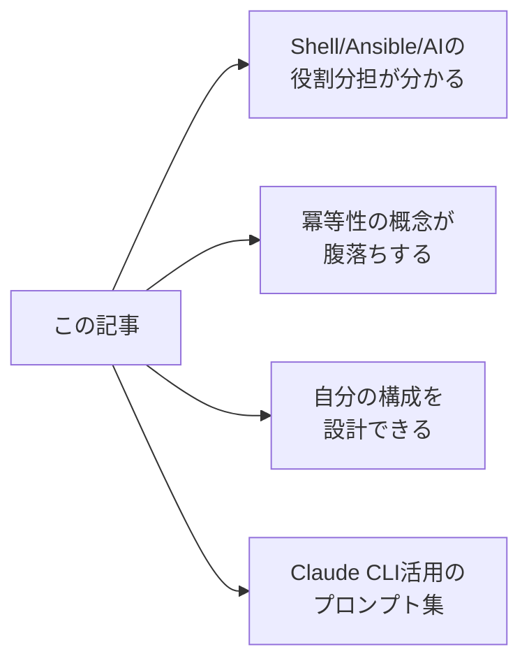
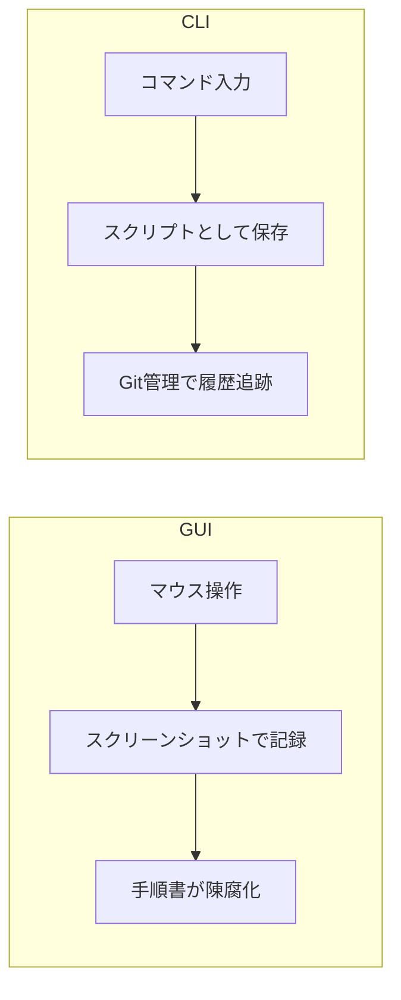
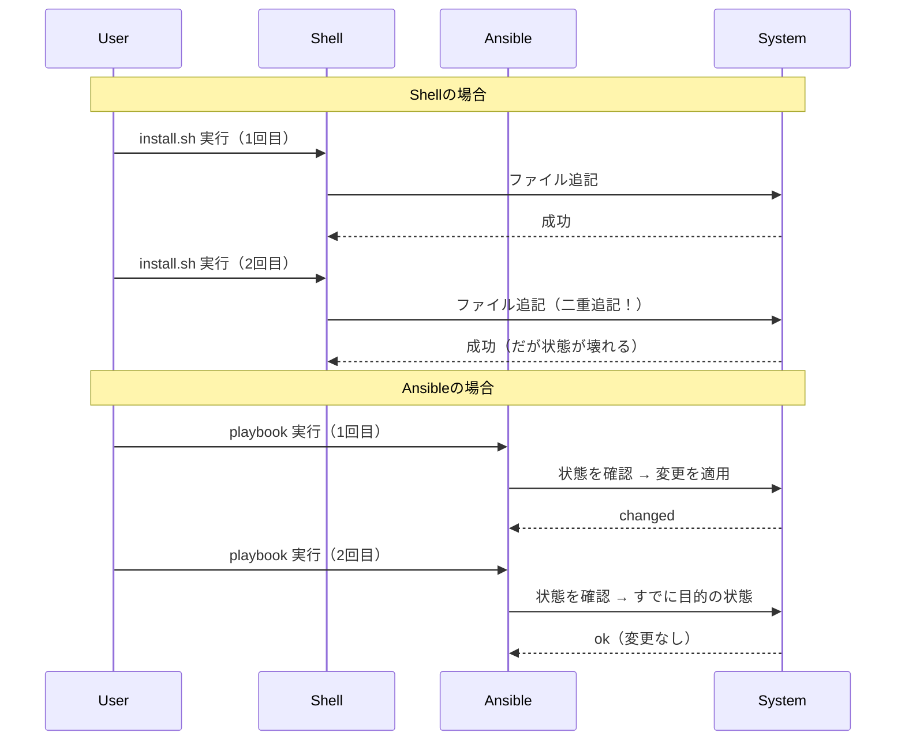
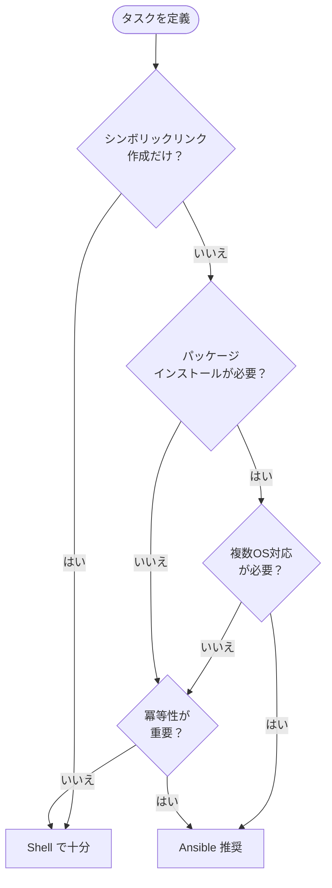
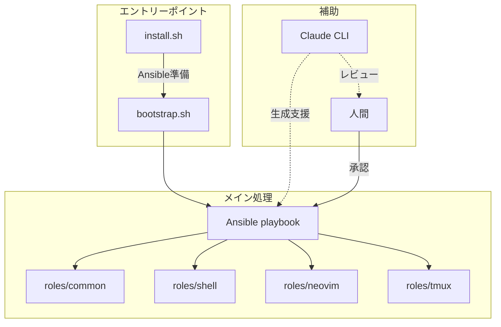
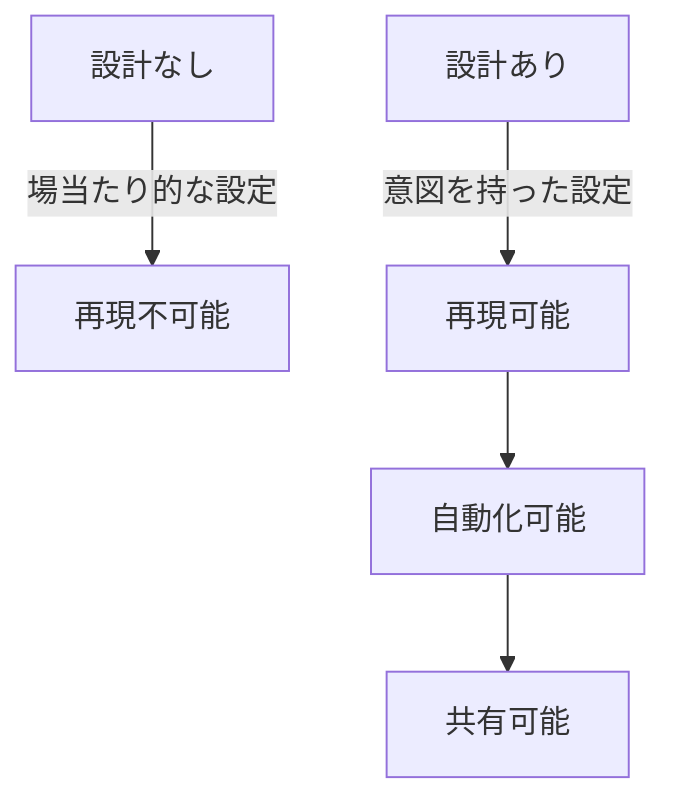

## SEOを意識した代替タイトル案（10件）

1. **【2025年版】dotfiles管理の決定版：Shell × Ansible × Claude CLIで作る再現可能な開発環境**
2. **dotfilesを「壊れない設計」にする方法：Shell / Ansible / AIの最適な役割分担**
3. **Ansible × Claude CLIでdotfiles運用が変わる：冪等性と生成AIを両立する設計パターン**
4. **脱・install.sh地獄：dotfilesをAnsible + AIで進化させる実践ガイド**
5. **エンジニアのdotfiles最終形態：Shell → Ansible → AI時代の環境構築術**
6. **dotfilesは思想である：Shell / Ansible / Claude CLIで作る「自分専用OS」設計**
7. **【実践】Claude CLIでdotfiles運用を効率化する：Ansible連携プロンプト集付き**
8. **dotfiles運用で失敗しない設計：Shell vs Ansible vs AIの使い分け完全ガイド**
9. **開発環境を「再現可能」にする技術：dotfiles × Ansible × Claude CLIの三位一体**
10. **dotfilesに冪等性を持たせる：ShellからAnsibleへの移行判断と実装パターン**

---

## この記事で得られること



- dotfilesの「進化の方向性」と**判断軸**が明確になる
- Shell / Ansible / AI それぞれの**強みと限界**を理解できる
- 冪等性・再現性・スピードを両立する**設計パターン**が手に入る
- Claude CLIを実務で活用する**コピペ可能なプロンプト集**

---

## 目次

1. [dotfilesは"設定ファイル"ではなく"思想"である](#1-dotfilesは設定ファイルではなく思想である)
2. [Shellだけで始めるdotfiles運用（最初の正解）](#2-shellだけで始めるdotfiles運用最初の正解)
3. [Ansibleは「重い」のではなく「未来向け」である](#3-ansibleは重いのではなく未来向けである)
4. [Shell vs Ansible：どちらを使うべきか？](#4-shell-vs-ansibleどちらを使うべきか)
5. [AI（Claude CLI）を"実行者"にしてはいけない理由](#5-aiclaude-cliを実行者にしてはいけない理由)
6. [最強パターン：Shell × Ansible × Claude CLI](#6-最強パターンshell--ansible--claude-cli)
7. [Claude CLI 実践プロンプト集（コピペ可）](#7-claude-cli-実践プロンプト集コピペ可)
8. [よくある失敗パターンとアンチパターン](#8-よくある失敗パターンとアンチパターン)
9. [この構成が向いている人／向いていない人](#9-この構成が向いている人向いていない人)
10. [まとめ：dotfilesは"自分専用のOS設計"である](#10-まとめdotfilesは自分専用のos設計である)

---

## 1. dotfilesは"設定ファイル"ではなく"思想"である

### なぜdotfilesを書くのか

dotfilesとは、ホームディレクトリに置かれる `.` で始まる設定ファイル群のことです。`.bashrc`、`.zshrc`、`.vimrc`、`.gitconfig` など、日常的に使うツールの設定が含まれます。

しかし、dotfilesを**Git管理する**というのは、単なるバックアップではありません。


dotfilesをGit管理するエンジニアは、以下の問いに答えを持っています：

- 新しいマシンをセットアップするとき、何時間かかるか？
- 環境が壊れたとき、元に戻せるか？
- なぜその設定にしたのか、3年後の自分に説明できるか？

### 環境構築に時間をかける意味

「環境構築に時間をかけるのは無駄」という意見があります。確かに、一度しか使わない環境なら、手動設定で十分です。

しかし、以下のケースでは**投資対効果が逆転**します：

| ケース | 手動設定 | dotfiles管理 |
|--------|---------|--------------|
| PC 1台、5年使う | ◎ 問題なし | △ 過剰投資 |
| PC 2台以上持ち | △ 同期が大変 | ◎ 効果あり |
| 年1回OSクリーンインストール | ✕ 毎回地獄 | ◎ 必須 |
| チームで環境共有したい | ✕ 不可能 | ◎ 唯一の方法 |

環境構築に時間をかけることは、**未来の自分への投資**です。

### GUIではなくCLIに寄せる理由

dotfilesを活用するエンジニアの多くは、GUIよりCLIを好みます。これは趣味の問題ではなく、**再現性と自動化**の観点から合理的な選択です。



**CLIの利点：**
- **テキストとして保存できる** → Git管理可能
- **自動化できる** → スクリプト化
- **差分が取れる** → 変更履歴の追跡
- **SSHで同じ操作ができる** → リモート環境との一貫性

GUIは「今」を便利にし、CLIは「未来」を便利にします。

---

## 2. Shellだけで始めるdotfiles運用（最初の正解）

### install.sh の役割

dotfiles運用の出発点は、多くの場合 `install.sh` です。

```bash
#!/bin/bash
set -euo pipefail

DOTFILES_DIR="$(cd "$(dirname "$0")" && pwd)"

# シンボリックリンクを作成
ln -sf "$DOTFILES_DIR/.zshrc" "$HOME/.zshrc"
ln -sf "$DOTFILES_DIR/.vimrc" "$HOME/.vimrc"
ln -sf "$DOTFILES_DIR/.gitconfig" "$HOME/.gitconfig"
ln -sf "$DOTFILES_DIR/.tmux.conf" "$HOME/.tmux.conf"

# 必要なディレクトリを作成
mkdir -p "$HOME/.config/nvim"
ln -sf "$DOTFILES_DIR/nvim/init.lua" "$HOME/.config/nvim/init.lua"

echo "Dotfiles installed successfully!"
```

この `install.sh` には明確な役割があります：

1. **シンボリックリンクの作成** — dotfilesリポジトリと実際の設定ファイルを紐付け
2. **必要なディレクトリの作成** — 存在しない場合に備える
3. **冪等性の担保**（部分的） — `ln -sf` で既存リンクを上書き

### Shellの強み

Shellスクリプトには、他のツールにはない強みがあります：

| 強み | 説明 |
|------|------|
| **即座に動く** | 依存関係なし、どのUNIX系OSでも動作 |
| **理解しやすい** | 1行ずつ何をしているか明確 |
| **デバッグしやすい** | `set -x` で実行内容を追跡 |
| **学習コスト低** | 新しいツールを覚える必要なし |

特に**シンボリックリンクの作成**や**環境変数の設定**など、単純なタスクではShellが最適解です。

### Shellの限界（冪等性・再実行・分岐地獄）

しかし、dotfilesが成長するにつれ、Shellの限界が見えてきます。

#### 限界1：冪等性の担保が難しい

```bash
# ❌ 冪等性がない（2回実行すると二重追記）
echo 'export PATH="$HOME/.local/bin:$PATH"' >> ~/.zshrc

# ⚠️ 部分的な冪等性（存在チェック）
if ! grep -q 'export PATH="$HOME/.local/bin:$PATH"' ~/.zshrc; then
  echo 'export PATH="$HOME/.local/bin:$PATH"' >> ~/.zshrc
fi
```

冪等性とは「何度実行しても同じ結果になる」性質です。Shellでこれを担保しようとすると、コードが肥大化します。

#### 限界2：条件分岐地獄

```bash
# OS判定
if [[ "$OSTYPE" == "darwin"* ]]; then
  # macOS
  brew install ripgrep
elif [[ -f /etc/debian_version ]]; then
  # Debian/Ubuntu
  sudo apt-get install -y ripgrep
elif [[ -f /etc/redhat-release ]]; then
  # RHEL/CentOS
  sudo dnf install -y ripgrep
fi
```

OSやディストリビューションごとの分岐が増えると、保守が困難になります。

#### 限界3：状態管理の欠如

Shellは「コマンドを順番に実行する」ツールです。「現在の状態」を把握し、「あるべき状態」との差分を埋める、という発想がありません。

---

## 3. Ansibleは「重い」のではなく「未来向け」である

### 冪等性とは何か（Shellとの決定的違い）

**冪等性（idempotency）**とは、同じ操作を何度実行しても、結果が同じになる性質です。



Ansibleは「**あるべき状態を宣言する**」ツールです。現在の状態を確認し、目的の状態と異なる場合のみ変更を加えます。

### 状態を宣言するという考え方

Shellは「手順」を記述します：

```bash
# Shell: 手順を記述
ln -sf ~/dotfiles/.zshrc ~/.zshrc
```

Ansibleは「あるべき状態」を記述します：

```yaml
# Ansible: 状態を宣言
- name: .zshrc のシンボリックリンクを作成
  ansible.builtin.file:
    src: "{{ dotfiles_dir }}/.zshrc"
    dest: "{{ ansible_env.HOME }}/.zshrc"
    state: link
```

一見、Ansibleの方が冗長に見えます。しかし、この「宣言的」なアプローチには大きな利点があります：

| 観点 | Shell（手続き型） | Ansible（宣言型） |
|------|------------------|------------------|
| 再実行 | 副作用のリスク | 安全に再実行可能 |
| 状態確認 | 手動で確認 | 自動で差分検出 |
| エラー時 | 途中で止まる | 状態を報告してくれる |
| ドキュメント性 | コメント頼り | YAML自体が意図を示す |

### 個人用途でもAnsibleが効いてくる瞬間

「Ansibleはサーバー管理用でしょ？個人のdotfilesには大げさ」という声をよく聞きます。

確かに、PC 1台だけなら過剰かもしれません。しかし、以下の瞬間にAnsibleの価値が実感できます：

1. **新しいPCをセットアップするとき**
   - `ansible-playbook site.yml` 一発で完了
   - 「あれ、何入れてたっけ？」がなくなる

2. **OSをクリーンインストールするとき**
   - 手順書なしで再現できる
   - 抜け漏れがない

3. **半年後に「なぜこの設定にしたか」思い出すとき**
   - YAMLの構造が意図を示す
   - タスク名がドキュメントになる

4. **チームメンバーに環境を共有するとき**
   - 「俺の.zshrc」ではなく「チームの開発環境」として提供

---

## 4. Shell vs Ansible：どちらを使うべきか？

### 明確な使い分け基準

Shell と Ansible は**競合ではなく共存**します。以下の基準で使い分けましょう：



**Shellが適切なケース：**
- シンボリックリンクの作成
- 環境変数の設定
- 単純なファイルコピー
- 単一OS向けの簡易スクリプト

**Ansibleが適切なケース：**
- パッケージのインストール（brew, apt, dnf）
- 複数OSへの対応
- 冪等性が重要なタスク
- チームで共有する環境構築

### 「Shell → Ansible」へ移行する判断タイミング

以下のサインが見えたら、Ansibleへの移行を検討しましょう：

1. **`install.sh` が300行を超えた**
   - 可読性が低下し、保守が困難に

2. **OS分岐の `if-else` が3つ以上ある**
   - Ansibleの `when` 句の方がシンプル

3. **「2回目の実行が怖い」と感じる**
   - 冪等性がないサイン

4. **「あのツール入れたっけ？」が頻発する**
   - 状態管理の欠如

5. **新しいPCのセットアップに2時間以上かかる**
   - 自動化の効果が大きい

### 無理にAnsibleを使わなくていい理由

一方で、**Ansibleを使わない選択も正解**です：

- **PC 1台だけ、OSも固定** → Shellで十分
- **dotfilesの内容がシンプル** → 複雑なツールは不要
- **Ansibleを学ぶ時間がない** → 動くものを優先
- **YAMLが嫌い** → 精神衛生も大事

重要なのは「**自分の運用に合っているか**」です。Ansibleは手段であり、目的ではありません。

---

## 5. AI（Claude CLI）を"実行者"にしてはいけない理由

### AIに全部やらせると壊れる理由

Claude CLIは強力なツールですが、**dotfiles管理の主役にしてはいけません**。


AIに全自動で任せると、以下の問題が発生します：

1. **コンテキストの欠如**
   - AIはあなたの環境を完全には知らない
   - 既存設定との競合を見逃す

2. **ハルシネーション**
   - 存在しないオプションを提案することがある
   - 古いバージョンの構文を出力することがある

3. **責任の所在**
   - 「AIが書いたから」は言い訳にならない
   - 本番環境を壊した責任は人間にある

### AIは「生成・差分・レビュー」に使う

Claude CLIの適切な使い方は、**人間のアシスタント**として活用することです：

| 役割 | 人間 | AI（Claude CLI） |
|------|------|------------------|
| **設計** | ◎ 主担当 | △ 提案のみ |
| **生成** | △ 面倒な作業 | ◎ 得意 |
| **レビュー** | ◎ 最終判断 | ◎ 見落とし防止 |
| **実行** | ◎ 責任を持つ | ✕ 任せない |

**AIが得意なこと：**
- ボイラープレートコードの生成
- 既存コードの説明・分析
- エラーログの解析
- セキュリティチェック

**人間がやるべきこと：**
- 設計方針の決定
- 生成物のレビュー
- 本番への適用判断
- 意図の言語化

### 真実のソースは人間＋Ansibleに置く

dotfiles運用において、**真実のソース（Source of Truth）**は以下のように配置します：

```
真実のソース
├── 設計意図 → 人間の頭 + README.md
├── あるべき状態 → Ansible playbook
└── 実際の設定 → Git管理されたdotfiles
```

AIは「アドバイザー」であり、「決定者」ではありません。

---

## 6. 最強パターン：Shell × Ansible × Claude CLI

### 全体ディレクトリ構成

以下は、Shell / Ansible / Claude CLI を組み合わせた推奨構成です：

```
dotfiles/
├── README.md                    # 設計意図・使い方
├── install.sh                   # エントリーポイント（軽量）
├── Makefile                     # タスクランナー
│
├── ansible/
│   ├── site.yml                 # メインplaybook
│   ├── inventory/
│   │   └── localhost.yml        # ローカル用インベントリ
│   ├── group_vars/
│   │   └── all.yml              # 共通変数
│   └── roles/
│       ├── common/              # 共通設定
│       │   └── tasks/
│       │       └── main.yml
│       ├── shell/               # シェル設定
│       │   ├── tasks/
│       │   │   └── main.yml
│       │   └── files/
│       │       ├── .zshrc
│       │       └── .zprofile
│       ├── neovim/              # Neovim設定
│       │   ├── tasks/
│       │   │   └── main.yml
│       │   └── files/
│       │       └── init.lua
│       ├── tmux/                # tmux設定
│       │   ├── tasks/
│       │   │   └── main.yml
│       │   └── files/
│       │       └── .tmux.conf
│       └── git/                 # Git設定
│           ├── tasks/
│           │   └── main.yml
│           └── templates/
│               └── .gitconfig.j2
│
├── scripts/                     # 補助スクリプト
│   ├── bootstrap.sh             # Ansible前の準備
│   └── update.sh                # 更新用
│
└── .claude/                     # Claude CLI用プロンプト
    └── commands/
        ├── review.md            # レビュー用
        └── generate-role.md     # role生成用
```

### 役割分担の整理



| コンポーネント | 役割 | 実行タイミング |
|---------------|------|---------------|
| `install.sh` | エントリーポイント、Ansible実行 | 初回セットアップ |
| `bootstrap.sh` | Ansible/Homebrewのインストール | Ansible実行前 |
| `ansible/` | 冪等性のある環境構築 | セットアップ/更新時 |
| `scripts/` | 補助的なタスク | 必要に応じて |
| `.claude/` | AI支援プロンプト | 開発時 |

### 冪等性・安全性・スピードを両立する設計

**冪等性**：Ansibleの宣言的アプローチで担保

```yaml
# roles/shell/tasks/main.yml
- name: .zshrc のシンボリックリンクを作成
  ansible.builtin.file:
    src: "{{ role_path }}/files/.zshrc"
    dest: "{{ ansible_env.HOME }}/.zshrc"
    state: link
    force: yes
```

**安全性**：変更前の確認と段階的適用

```bash
# Makefile
.PHONY: check apply

check:  ## 変更内容を確認（dry-run）
	ansible-playbook ansible/site.yml --check --diff

apply:  ## 変更を適用
	ansible-playbook ansible/site.yml
```

**スピード**：タグによる部分実行

```yaml
# ansible/site.yml
- hosts: localhost
  roles:
    - { role: common, tags: ['common'] }
    - { role: shell, tags: ['shell', 'zsh'] }
    - { role: neovim, tags: ['neovim', 'editor'] }
    - { role: tmux, tags: ['tmux'] }
```

```bash
# Neovim設定だけ更新
make apply TAGS=neovim

# Makefile内
apply:
	ansible-playbook ansible/site.yml $(if $(TAGS),--tags $(TAGS),)
```

---

## 7. Claude CLI 実践プロンプト集（コピペ可）

### Ansible role を生成させるプロンプト

```bash
# 新しいroleの雛形を生成
claude "Ansibleのroleを生成してください。

## 要件
- role名: nodejs
- 目的: Node.jsとnpmをインストールし、グローバルパッケージを管理
- 対応OS: macOS (Homebrew), Ubuntu (apt)
- 冪等性を担保すること

## 出力形式
- tasks/main.yml
- defaults/main.yml（変数のデフォルト値）
- vars/main.yml（OS別の変数）

## 追加要件
- Node.jsのバージョンは変数で指定可能に
- pnpmもインストール
- グローバルパッケージのリストは変数で定義"
```

### 実行ログから修正させるプロンプト

```bash
# エラーログを渡して修正案を得る
cat ansible-error.log | claude "このAnsible実行ログのエラーを分析し、
修正案を提示してください。

## 出力形式
1. エラーの原因（1-2文で簡潔に）
2. 修正すべきファイルと変更内容
3. 修正後のYAMLコード

## 注意
- 冪等性を壊さないこと
- OS固有の問題であれば when 句で対応
- shell/command モジュールは最終手段"
```

### セキュリティ／品質レビュー用プロンプト

```bash
# 既存roleのレビュー
cat roles/shell/tasks/main.yml | claude "このAnsible taskファイルをレビューしてください。

## チェック項目
1. セキュリティリスク（パーミッション、シークレット管理）
2. 冪等性（何度実行しても安全か）
3. 可読性（タスク名、コメント）
4. ベストプラクティス（shell/commandの多用、ハードコード）

## 出力形式
- 問題点: 重要度（高/中/低）と説明
- 改善案: 具体的なコード修正
- 良い点: 1-2個（モチベーション維持のため）"
```

### 設定ファイルの説明生成

```bash
# 複雑な設定ファイルの説明を生成
cat .zshrc | claude "この.zshrcの内容を分析し、
各セクションの目的を説明してください。

## 出力形式
1. 全体の構成（目次形式）
2. 各セクションの説明（何をしているか、なぜ必要か）
3. 改善提案（あれば）

## 注意
- 初学者にも分かる説明
- 不要な設定があれば指摘"
```

### .claude/commands/ の活用

プロジェクト内に `.claude/commands/` を作成し、よく使うプロンプトを保存しておくと便利です：

```markdown
<!-- .claude/commands/review-role.md -->
# Ansible Roleレビュー

以下のAnsible roleをレビューしてください。

## チェック項目
1. 冪等性が担保されているか
2. shell/command モジュールを不必要に使っていないか
3. 変数のデフォルト値が適切か
4. タスク名が意図を示しているか

## 出力
- 問題点と改善案を箇条書きで
```

```bash
# 使い方
cat roles/neovim/tasks/main.yml | claude /review-role
```

---

## 8. よくある失敗パターンとアンチパターン

### アンチパターン1：Shellにifを書きすぎる

```bash
# ❌ アンチパターン
if [[ "$OSTYPE" == "darwin"* ]]; then
  if command -v brew &> /dev/null; then
    if ! brew list ripgrep &> /dev/null; then
      brew install ripgrep
    fi
  else
    echo "Homebrew not found, installing..."
    /bin/bash -c "$(curl -fsSL https://raw.githubusercontent.com/Homebrew/install/HEAD/install.sh)"
    brew install ripgrep
  fi
elif [[ -f /etc/debian_version ]]; then
  if ! dpkg -l ripgrep &> /dev/null; then
    sudo apt-get update
    sudo apt-get install -y ripgrep
  fi
fi
```

**問題点：**
- 可読性が低い
- テストが困難
- 新しいOSの追加が大変

**改善：Ansibleを使う**

```yaml
# ✅ 改善後
- name: ripgrep をインストール
  ansible.builtin.package:
    name: ripgrep
    state: present
  become: "{{ ansible_os_family != 'Darwin' }}"
```

### アンチパターン2：AIの出力をレビューせず適用する

```bash
# ❌ アンチパターン
claude "Neovimの設定を最適化して" > ~/.config/nvim/init.lua
# そのまま適用して、既存設定が消える...
```

**問題点：**
- 既存設定との競合
- 意図しない変更
- ロールバックが困難

**改善：差分確認してから適用**

```bash
# ✅ 改善後
claude "Neovimの設定を最適化して" > /tmp/init.lua.new
diff ~/.config/nvim/init.lua /tmp/init.lua.new
# 差分を確認してから手動でマージ
```

### アンチパターン3：Ansibleでshell/commandを多用する

```yaml
# ❌ アンチパターン
- name: ripgrep をインストール
  ansible.builtin.shell: |
    if ! command -v rg &> /dev/null; then
      brew install ripgrep
    fi
  args:
    executable: /bin/bash
```

**問題点：**
- 冪等性がモジュールに任せられていない
- changedの判定が不正確
- Shellの限界を引き継いでしまう

**改善：適切なモジュールを使う**

```yaml
# ✅ 改善後
- name: ripgrep をインストール (Homebrew)
  community.general.homebrew:
    name: ripgrep
    state: present
  when: ansible_os_family == 'Darwin'
```

### アンチパターン4：設計意図がどこにも残っていない

```yaml
# ❌ アンチパターン
- file:
    src: "{{ dotfiles_dir }}/.zshrc"
    dest: "{{ ansible_env.HOME }}/.zshrc"
    state: link
```

**問題点：**
- なぜこの設定なのか分からない
- 3ヶ月後の自分が困る
- 他人が理解できない

**改善：タスク名と変数名で意図を示す**

```yaml
# ✅ 改善後
- name: zsh設定ファイルをホームディレクトリにリンク（dotfilesで一元管理するため）
  ansible.builtin.file:
    src: "{{ role_path }}/files/.zshrc"
    dest: "{{ ansible_env.HOME }}/.zshrc"
    state: link
    force: yes  # 既存ファイルがあっても上書き
```

---

## 9. この構成が向いている人／向いていない人

### 向いている人

#### 個人最適化タイプ

「自分の環境を徹底的にカスタマイズしたい」人には最適です。

- キーバインドを1つ1つ吟味する
- プラグインの設定を細かく調整する
- 「なぜこの設定か」を言語化したい

#### 複数PC持ち

仕事用と個人用、デスクトップとラップトップなど、複数のマシンを使う人。

- 環境の同期が自動化される
- 新しいマシンのセットアップが1コマンド
- 差分を吸収できる（OSごとの分岐など）

#### チーム展開したい人

開発チームで環境を共有したい人。

- 「俺のdotfiles」から「チームの開発環境」へ
- オンボーディングの時間短縮
- 環境差異によるバグの削減

### 向いていない人

#### 「動けばいい」タイプ

環境構築に時間をかけたくない人には、この構成は過剰です。

- 手動設定の方が早い場合もある
- 投資対効果を考える

#### PC 1台で十分な人

長期間同じマシンを使い続け、クリーンインストールもしない人。

- dotfiles管理自体が不要かもしれない
- シンプルなバックアップで十分

#### 学習コストを避けたい人

Ansibleを新しく学ぶ時間がない、または学びたくない人。

- Shellだけでも運用は可能
- 無理にツールを増やす必要はない

### 「dotfilesに興味ない人」への注意書き

この記事を読んで「大変そう」と感じたら、**それが正直な感想**です。

dotfiles運用は**全員に必要なわけではありません**。以下のような人は、無理に始めなくて大丈夫です：

- 環境構築は年に1回あるかないか
- 手動設定でも1時間で終わる
- 設定を共有する相手がいない

環境構築に**繰り返し時間を取られている**と感じたときに、この記事を思い出してください。

---

## 10. まとめ：dotfilesは"自分専用のOS設計"である

### 設計を持つことの価値

dotfilesをGit管理するということは、**自分の開発環境に設計を持つ**ということです。



設計を持つことで：
- **再現性**が担保される
- **変更履歴**が追跡できる
- **意図**が言語化される
- **未来の自分**が困らない

### AI時代におけるエンジニアの役割

Claude CLIをはじめとする生成AIは、dotfiles運用を**効率化**してくれます。しかし、**設計の責任は人間にあります**。

| 役割 | AI以前 | AI時代 |
|------|--------|--------|
| 設計 | 人間 | 人間 |
| 実装 | 人間（手作業） | AI支援 + 人間レビュー |
| 保守 | 人間 | AI支援 + 人間判断 |
| 責任 | 人間 | 人間 |

AIは「道具」であり、「決定者」ではありません。

### 小さく始めて、壊れずに育てる

この記事で紹介した構成は、**最終形態**です。最初からこの形を目指す必要はありません。

**段階的な成長パス：**

1. **Step 0**: dotfilesをGitリポジトリに入れる
2. **Step 1**: `install.sh` でシンボリックリンクを自動化
3. **Step 2**: パッケージインストールをスクリプト化
4. **Step 3**: Ansibleで冪等性を担保（ここで多くの人は十分）
5. **Step 4**: Claude CLIで生成・レビューを効率化
6. **Step 5**: チーム展開を視野に入れた設計

**重要なのは、各ステップで「壊れない」こと**です。

- 動いているものを壊さない
- 小さな変更を積み重ねる
- 常にロールバック可能にしておく

---

## 参考リンク

### 公式ドキュメント

- **Ansible**: [https://docs.ansible.com/](https://docs.ansible.com/)
- **Claude CLI**: [https://docs.anthropic.com/](https://docs.anthropic.com/)
- **Homebrew**: [https://docs.brew.sh/](https://docs.brew.sh/)

### dotfiles管理ツール

> 本記事ではAnsibleを推奨していますが、以下のようなdotfiles専用ツールも存在します。用途に応じて選択してください。

- **chezmoi**: [https://www.chezmoi.io/](https://www.chezmoi.io/) — テンプレート機能が強力
- **GNU Stow**: [https://www.gnu.org/software/stow/](https://www.gnu.org/software/stow/) — シンボリックリンク管理に特化
- **yadm**: [https://yadm.io/](https://yadm.io/) — Gitラッパー、暗号化対応

### 参考になるdotfilesリポジトリ

実際のdotfiles構成を参考にしたい場合は、GitHubで「dotfiles」で検索すると多くの例が見つかります。ただし、他人のdotfilesを**そのままコピーせず**、設計意図を理解した上で自分の構成に取り入れることを推奨します。

---

## 追加出力

### 内部リンクに使える関連記事タイトル案（5件）

1. **Neovim環境構築ガイド：Luaベースの設定とプラグイン管理**
2. **zshカスタマイズ完全入門：プロンプト・補完・プラグインの設計**
3. **tmux × Neovim連携術：ターミナル多重化の最適解**
4. **Claude CLIプロンプトエンジニアリング：開発タスク別テンプレート集**
5. **Homebrewマスターガイド：Brewfile運用とCI/CD連携**

### SNS投稿用紹介文（X向け・技術者向け）

```
【新記事】dotfiles運用の最終形

Shell × Ansible × Claude CLI の役割分担を整理しました。

- Shellの限界と「冪等性」の概念
- Ansibleを個人用途で使う判断基準
- AIを"実行者"にしてはいけない理由
- コピペ可能なClaude CLIプロンプト集

「自分専用OS」の設計思想を持つエンジニアへ。

#dotfiles #Ansible #ClaudeCLI #開発環境
```

### この記事を読んだ後にやるべきNext Action（チェックリスト）

- [ ] 自分のdotfilesがGit管理されているか確認する
- [ ] `install.sh` があるなら、行数をカウントする（300行超えたらAnsible検討）
- [ ] 「2回目の実行が怖い」スクリプトがないか確認する
- [ ] Ansibleをローカルにインストールしてみる（`brew install ansible` / `pip install ansible`）
- [ ] 1つのrole（例: git設定）をAnsibleで書き直してみる
- [ ] Claude CLIで既存の設定ファイルをレビューさせてみる
- [ ] README.mdに「なぜこの設計にしたか」を書く
- [ ] 次にPCをセットアップするとき、タイマーで時間を計る

---

**この記事が参考になったら、ぜひ自分のdotfilesを見直してみてください。**

「壊れない開発環境」は、小さな改善の積み重ねで作られます。
