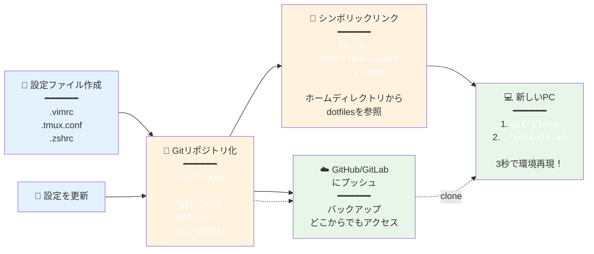
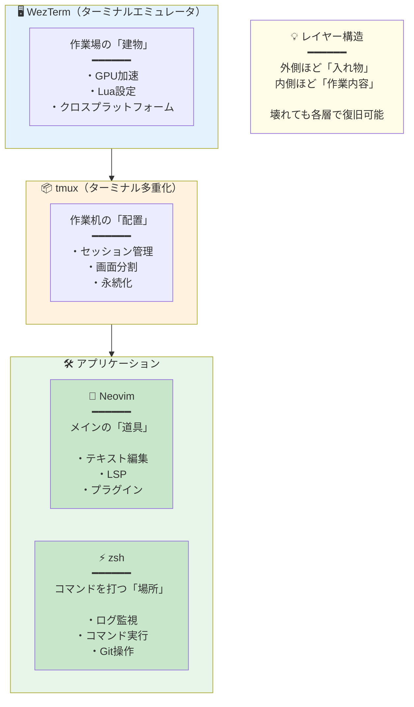
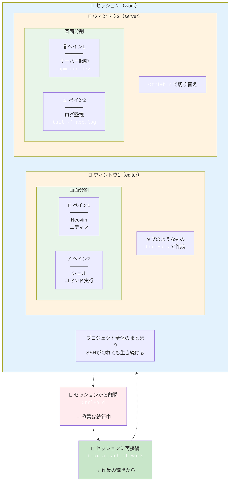
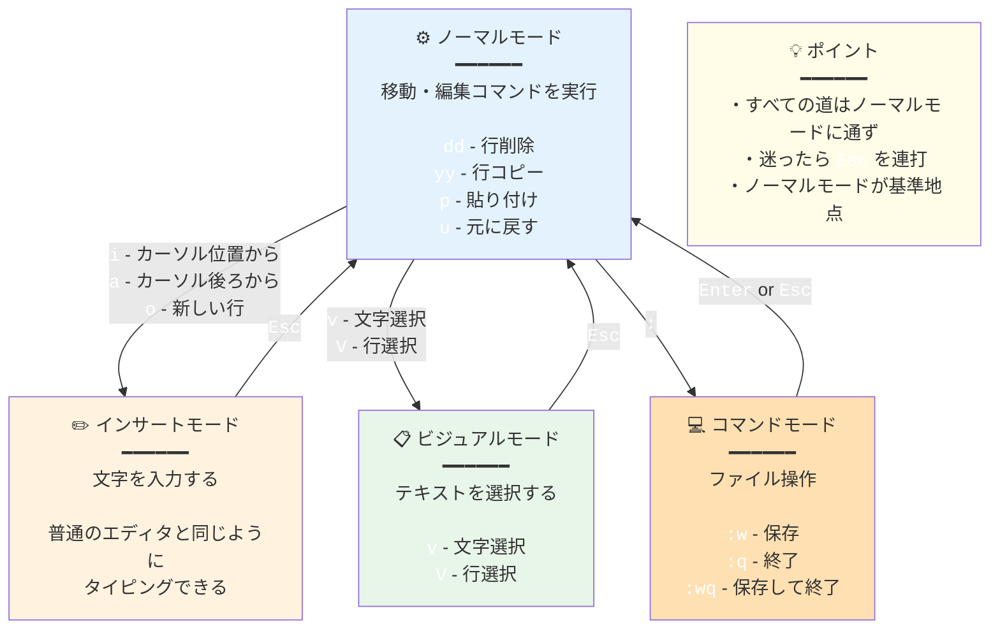
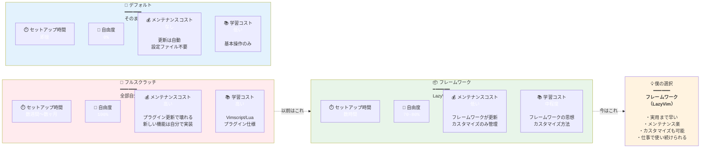
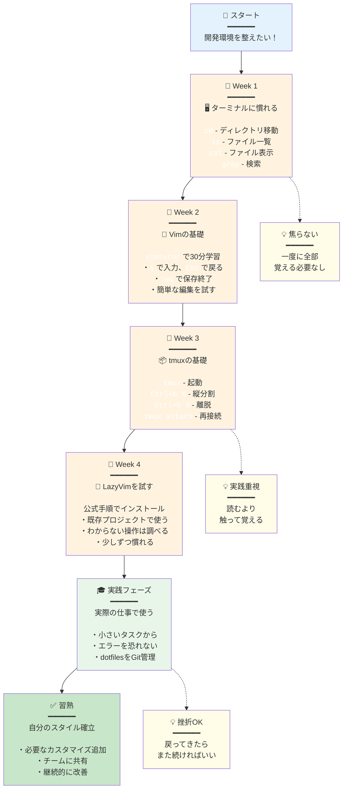

## この記事の対象読者

- 「dotfiles」という言葉を聞いたことがあるけど、よく分からない人
- 開発環境を整えたいけど、何から始めればいいか分からない人
- Vim/Neovim、tmuxに興味があるけど、敷居が高いと感じている人

この記事では、**dotfilesの基本概念**から、**僕が実際に使っているツール**、そして**なぜこの構成を選んだのか**という仕事の流儀まで解説します。

---

## dotfilesとは何か？

### 一言で言うと

**dotfiles（ドットファイル）** とは、Unix/Linux/macOSで使われる **設定ファイル** のことです。

ファイル名が `.`（ドット）で始まるため、dotfilesと呼ばれます。

### 具体例

```
~/.bashrc      → シェル（Bash）の設定
~/.zshrc       → シェル（Zsh）の設定
~/.vimrc       → Vimエディタの設定
~/.gitconfig   → Gitの設定
~/.tmux.conf   → tmuxの設定
```

### なぜ「隠しファイル」なのか？

Unix系OSでは、`.` で始まるファイルは **デフォルトで非表示** になります。

```bash
ls        # 通常のファイルのみ表示
ls -a     # dotfiles（隠しファイル）も表示
```

設定ファイルは普段触らないので、邪魔にならないよう隠されています。

---

## なぜdotfilesを管理するのか？

### メリット

| メリット | 説明 |
|----------|------|
| **環境の再現** | 新しいPCでも同じ環境をすぐ構築できる |
| **バックアップ** | 設定を失う心配がない |
| **バージョン管理** | Gitで変更履歴を追える |
| **共有** | チームで設定を共有できる |

### 一般的な管理方法

```bash
# 1. dotfilesをGitリポジトリで管理
~/dotfiles/
├── .vimrc
├── .tmux.conf
├── .zshrc
└── install.sh   # シンボリックリンクを張るスクリプト

# 2. ホームディレクトリにシンボリックリンクを作成
ln -s ~/dotfiles/.vimrc ~/.vimrc
```

#### dotfiles管理のワークフロー



---

## 僕の開発環境の全体像



| ツール | 役割 | 一言で |
|--------|------|--------|
| **WezTerm** | ターミナルエミュレータ | 「作業場の建物」 |
| **tmux** | ターミナル多重化 | 「作業机の配置」 |
| **Neovim** | テキストエディタ | 「メインの道具」 |
| **zsh** | シェル | 「コマンドを打つ場所」 |

---

## 各ツールの解説

### 1. WezTerm（ターミナルエミュレータ）

#### ターミナルとは？

**ターミナル（端末）** は、コマンドを入力してコンピュータを操作するためのアプリです。

Windowsの「コマンドプロンプト」、macOSの「ターミナル.app」のようなものです。

#### WezTermを選んだ理由

| 特徴 | 説明 |
|------|------|
| **軽量** | 起動が速く、メモリ消費が少ない |
| **安定** | 落ちない、固まらない |
| **Lua設定** | 設定ファイルがLuaで書ける（プログラマブル） |
| **クロスプラットフォーム** | Windows/Mac/Linux対応 |

#### 設定例（~/.wezterm.lua）

```lua
local wezterm = require 'wezterm'
local config = {}

config.font = wezterm.font 'JetBrains Mono'
config.font_size = 14.0
config.color_scheme = 'Tokyo Night'

-- 透過設定
config.window_background_opacity = 0.95

return config
```

**公式サイト:** https://wezfurlong.org/wezterm/

---

### 2. tmux（ターミナル多重化ツール）

#### tmuxとは？

**tmux** は、1つのターミナル内で **複数の画面を管理** できるツールです。

#### 何がうれしいのか？

```
通常のターミナル:
┌──────────────┐
│              │  ← 1画面だけ
│   シェル     │
│              │
└──────────────┘

tmuxを使うと:
┌──────────┬──────────┐
│          │          │
│  エディタ │   ログ   │  ← 分割できる
│          │          │
├──────────┴──────────┤
│     コマンド実行     │
└─────────────────────┘
```

#### tmuxの主要概念

| 概念 | 説明 |
|------|------|
| **セッション** | 作業全体のまとまり（プロジェクト単位） |
| **ウィンドウ** | タブのようなもの |
| **ペイン** | 画面の分割 |

##### セッション・ウィンドウ・ペインの階層構造



#### 最大のメリット：セッションの永続化

```bash
# SSHで接続中に回線が切れても...
# tmuxのセッションは生き続ける

tmux attach  # 再接続すれば、作業の続きからできる
```

これが「**安心に近い感覚**」の正体です。

#### 基本的な使い方

```bash
tmux                    # 新しいセッションを開始
tmux new -s work        # "work"という名前でセッション開始
tmux ls                 # セッション一覧
tmux attach -t work     # "work"セッションに接続
```

#### キーバインド（デフォルト）

| キー | 動作 |
|------|------|
| `Ctrl+b %` | 縦分割 |
| `Ctrl+b "` | 横分割 |
| `Ctrl+b o` | ペイン移動 |
| `Ctrl+b d` | セッションから離脱 |
| `Ctrl+b c` | 新しいウィンドウ |

**公式サイト:** https://github.com/tmux/tmux

---

### 3. Neovim（テキストエディタ）

#### VimとNeovimの違い

| | Vim | Neovim |
|--|-----|--------|
| 歴史 | 1991年〜 | 2014年〜（Vimからフォーク） |
| 設定言語 | Vimscript | Vimscript + **Lua** |
| プラグイン | 豊富 | 豊富 + モダンなエコシステム |
| 非同期処理 | 後から追加 | 最初から対応 |

**Neovim**は、Vimをモダンに書き直したプロジェクトです。

#### なぜVim系エディタを使うのか？

VS Codeではなく、あえてVim系を使う理由：

| 理由 | 説明 |
|------|------|
| **キーボード完結** | マウスに手を伸ばす必要がない |
| **起動が一瞬** | 0.1秒で立ち上がる |
| **どこでも使える** | SSH先のサーバーでも同じ操作感 |
| **思考が止まらない** | 「操作」ではなく「編集」に集中できる |

#### 起動速度の比較

```
Neovim:  ~0.05秒
VS Code: ~3-5秒（プロジェクトによる）
```

これは設計思想の違いです：

- **Neovim**: 必要最小限で起動 → 後から機能を読み込む
- **VS Code**: 全部準備してから起動

#### モード（Vimの基本概念）

Vimには「モード」という概念があります：

| モード | 用途 | 切り替え |
|--------|------|----------|
| **ノーマル** | 移動・編集コマンド | `Esc` |
| **インサート** | 文字入力 | `i`, `a`, `o` |
| **ビジュアル** | 選択 | `v`, `V` |
| **コマンド** | 保存・終了など | `:` |

##### Vimのモード遷移



最初は戸惑いますが、慣れると**「書く」と「動かす」を分離**できることの快適さが分かります。

**公式サイト:** https://neovim.io/

---

### 4. LazyVim（Neovimの設定フレームワーク）

#### LazyVimとは？

**LazyVim**は、Neovimの **設定済みフレームワーク** です。

昔は `.vimrc` を何百行も書いて育てていましたが、今はLazyVimを使っています。

#### なぜLazyVimか？

| 特徴 | 説明 |
|------|------|
| **すぐ使える** | インストールするだけで実用的な環境 |
| **遅延ロード** | 必要になるまでプラグインを読み込まない（高速） |
| **モジュール式** | 必要な機能だけ有効化できる |
| **更新が安定** | 破壊的変更が少ない |

#### LazyVimに含まれる主要機能

- **LSP（Language Server Protocol）**: コード補完、定義ジャンプ
- **Treesitter**: シンタックスハイライト
- **Telescope**: ファイル検索、文字列検索
- **Git連携**: 差分表示、blame
- **ファイラー**: Neo-tree

#### 「全部を自分で作らない」という判断

以前は設定を一から書くのが楽しかった。

でも今は、**メンテナンスコスト**を考えて、土台は既存のものを使い、**カスタマイズは最小限**にしています。

これは「**過剰設計を避ける**」という仕事観とも一致しています。

##### カスタマイズレベルの比較



**公式サイト:** https://www.lazyvim.org/

---

## 僕のdotfiles構成

```
~/dotfiles/
├── .config/
│   ├── nvim/           # Neovim設定（LazyVim）
│   │   └── lua/
│   │       └── plugins/  # カスタムプラグイン
│   └── wezterm/        # WezTerm設定
├── .tmux.conf          # tmux設定
├── .zshrc              # シェル設定
└── install.sh          # セットアップスクリプト
```

### 設定のポイント

1. **最小限のカスタマイズ**: デフォルトを尊重し、本当に必要なものだけ変える
2. **ポータビリティ**: 新しい環境でも動くように依存を減らす
3. **ドキュメント化**: なぜその設定にしたかをコメントで残す

---

## dotfilesに現れる仕事の流儀

ここまでツールの説明をしてきましたが、本当に伝えたいのは **「なぜこの構成なのか」** です。

### 速さより「戻れること」

- すぐ再現できる
- 他の環境でも使える
- 壊れたら戻せる
- 説明できる

僕のdotfilesは「最強」ではありません。
でも、**仕事で使い続けられる形**にはなっています。

### dotfilesを見れば、その人が分かる

- 何を面倒だと感じているか
- どこで妥協しているか
- 何を自動化し、何を残しているか
- 他人が触れることを想定しているか

派手さはないけど、**仕事の姿勢は確実に滲み出る**。

---

## まとめ

| ツール | 何をするもの | 僕が選んだ理由 |
|--------|--------------|----------------|
| WezTerm | ターミナル | 軽い、安定、Lua設定 |
| tmux | 画面分割・セッション管理 | 作業が途切れない安心感 |
| Neovim | テキスト編集 | 思考を止めずに手を動かせる |
| LazyVim | Neovimの土台 | メンテナンスコストを下げる |

dotfilesは、単なる設定ファイルではなく、**自分がどう考えて仕事をしているかの履歴**です。

---

## 始め方（初心者向け）

1. **まずはターミナルに慣れる**: 普段使いのターミナルでコマンドを打つ
2. **Vimtutor**: `vimtutor` コマンドで基本操作を学ぶ（30分）
3. **tmuxを触る**: `tmux` で起動、`Ctrl+b %` で分割
4. **LazyVimを試す**: 公式のインストール手順に従う

##### 初心者向け学習ロードマップ



いきなり全部を変える必要はありません。
**一つずつ、必要になったら足していく**のがおすすめです。

---

## 参考リンク

- [Neovim公式](https://neovim.io/)
- [LazyVim公式](https://www.lazyvim.org/)
- [tmux公式](https://github.com/tmux/tmux)
- [WezTerm公式](https://wezfurlong.org/wezterm/)
- [Vim日本語ドキュメント](https://vim-jp.org/vimdoc-ja/)
