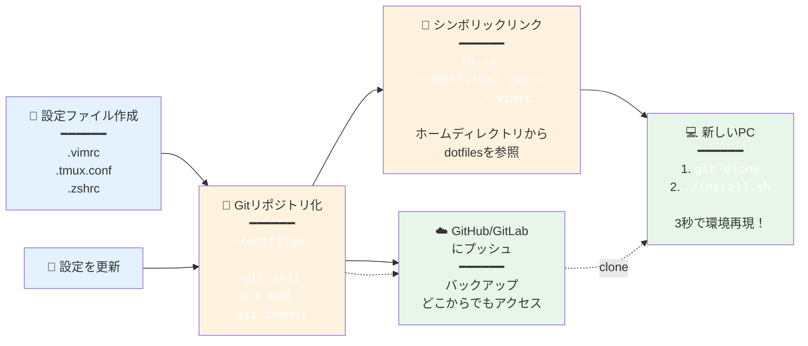
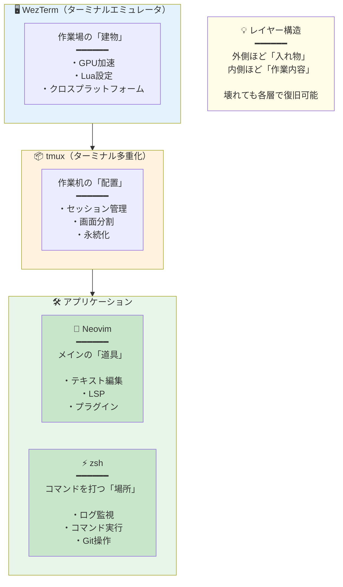
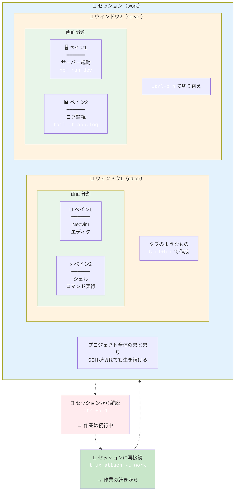
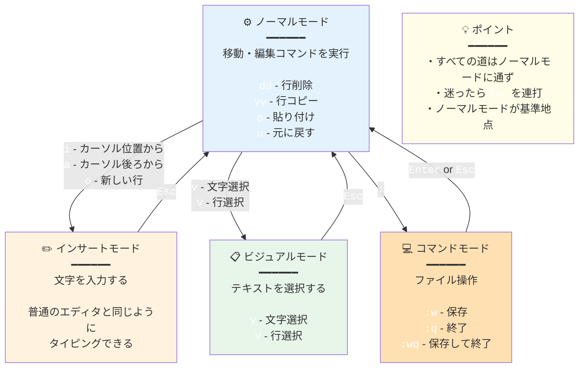
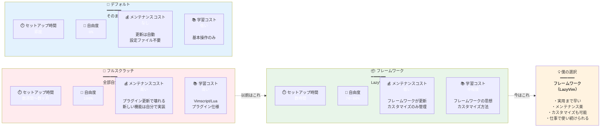
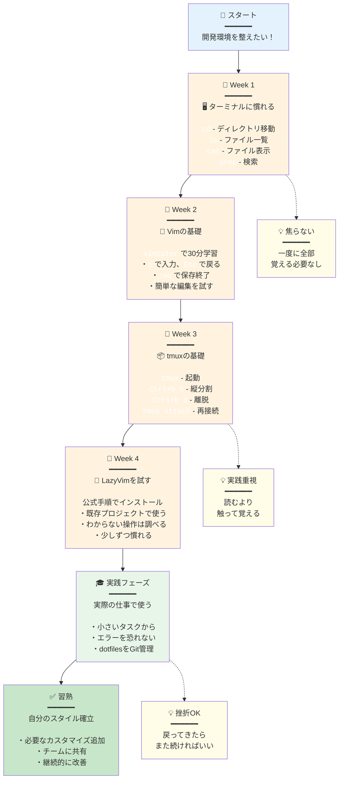
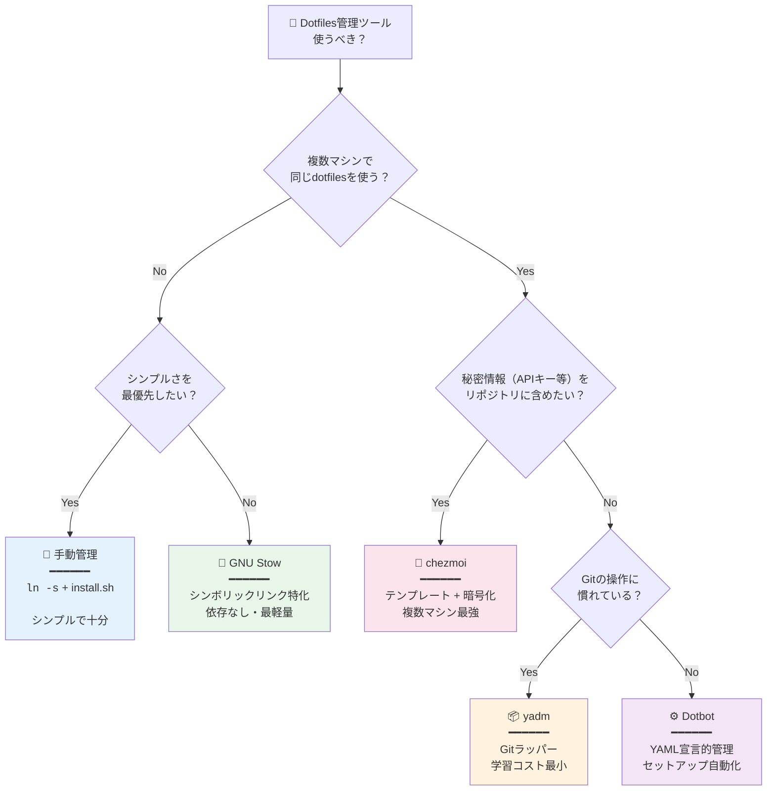

## この記事の対象読者

- 「dotfiles」という言葉を聞いたことがあるけど、よく分からない人
- 開発環境を整えたいけど、何から始めればいいか分からない人
- Vim/Neovim、tmuxに興味があるけど、敷居が高いと感じている人

この記事では、**dotfilesの基本概念**から、**僕が実際に使っているツール**、そして**なぜこの構成を選んだのか**という仕事の流儀まで解説します。

---

## dotfilesとは何か？

### 一言で言うと

**dotfiles（ドットファイル）** とは、Unix/Linux/macOSで使われる **設定ファイル** のことです。

ファイル名が `.`（ドット）で始まるため、dotfilesと呼ばれます。

### 具体例

```
~/.bashrc      → シェル（Bash）の設定
~/.zshrc       → シェル（Zsh）の設定
~/.vimrc       → Vimエディタの設定
~/.gitconfig   → Gitの設定
~/.tmux.conf   → tmuxの設定
```

### なぜ「隠しファイル」なのか？

Unix系OSでは、`.` で始まるファイルは **デフォルトで非表示** になります。

```bash
ls        # 通常のファイルのみ表示
ls -a     # dotfiles（隠しファイル）も表示
```

設定ファイルは普段触らないので、邪魔にならないよう隠されています。

---

## なぜdotfilesを管理するのか？

### メリット

| メリット | 説明 |
|----------|------|
| **環境の再現** | 新しいPCでも同じ環境をすぐ構築できる |
| **バックアップ** | 設定を失う心配がない |
| **バージョン管理** | Gitで変更履歴を追える |
| **共有** | チームで設定を共有できる |

### 一般的な管理方法

```bash
# 1. dotfilesをGitリポジトリで管理
~/dotfiles/
├── .vimrc
├── .tmux.conf
├── .zshrc
└── install.sh   # シンボリックリンクを張るスクリプト

# 2. ホームディレクトリにシンボリックリンクを作成
ln -s ~/dotfiles/.vimrc ~/.vimrc
```

#### dotfiles管理のワークフロー



---

## 僕の開発環境の全体像



| ツール | 役割 | 一言で |
|--------|------|--------|
| **WezTerm** | ターミナルエミュレータ | 「作業場の建物」 |
| **tmux** | ターミナル多重化 | 「作業机の配置」 |
| **Neovim** | テキストエディタ | 「メインの道具」 |
| **zsh** | シェル | 「コマンドを打つ場所」 |

---

## 各ツールの解説

### 1. WezTerm（ターミナルエミュレータ）

#### ターミナルとは？

**ターミナル（端末）** は、コマンドを入力してコンピュータを操作するためのアプリです。

Windowsの「コマンドプロンプト」、macOSの「ターミナル.app」のようなものです。

#### WezTermを選んだ理由

| 特徴 | 説明 |
|------|------|
| **軽量** | 起動が速く、メモリ消費が少ない |
| **安定** | 落ちない、固まらない |
| **Lua設定** | 設定ファイルがLuaで書ける（プログラマブル） |
| **クロスプラットフォーム** | Windows/Mac/Linux対応 |

#### 設定例（~/.wezterm.lua）

```lua
local wezterm = require 'wezterm'
local config = {}

config.font = wezterm.font 'JetBrains Mono'
config.font_size = 14.0
config.color_scheme = 'Tokyo Night'

-- 透過設定
config.window_background_opacity = 0.95

return config
```

**公式サイト:** https://wezfurlong.org/wezterm/

---

### 2. tmux（ターミナル多重化ツール）

#### tmuxとは？

**tmux** は、1つのターミナル内で **複数の画面を管理** できるツールです。

#### 何がうれしいのか？

```
通常のターミナル:
┌──────────────┐
│              │  ← 1画面だけ
│   シェル     │
│              │
└──────────────┘

tmuxを使うと:
┌──────────┬──────────┐
│          │          │
│  エディタ │   ログ   │  ← 分割できる
│          │          │
├──────────┴──────────┤
│     コマンド実行     │
└─────────────────────┘
```

#### tmuxの主要概念

| 概念 | 説明 |
|------|------|
| **セッション** | 作業全体のまとまり（プロジェクト単位） |
| **ウィンドウ** | タブのようなもの |
| **ペイン** | 画面の分割 |

##### セッション・ウィンドウ・ペインの階層構造



#### 最大のメリット：セッションの永続化

```bash
# SSHで接続中に回線が切れても...
# tmuxのセッションは生き続ける

tmux attach  # 再接続すれば、作業の続きからできる
```

これが「**安心に近い感覚**」の正体です。

#### 基本的な使い方

```bash
tmux                    # 新しいセッションを開始
tmux new -s work        # "work"という名前でセッション開始
tmux ls                 # セッション一覧
tmux attach -t work     # "work"セッションに接続
```

#### キーバインド（デフォルト）

| キー | 動作 |
|------|------|
| `Ctrl+b %` | 縦分割 |
| `Ctrl+b "` | 横分割 |
| `Ctrl+b o` | ペイン移動 |
| `Ctrl+b d` | セッションから離脱 |
| `Ctrl+b c` | 新しいウィンドウ |

**公式サイト:** https://github.com/tmux/tmux

---

### 3. Neovim（テキストエディタ）

#### VimとNeovimの違い

| | Vim | Neovim |
|--|-----|--------|
| 歴史 | 1991年〜 | 2014年〜（Vimからフォーク） |
| 設定言語 | Vimscript | Vimscript + **Lua** |
| プラグイン | 豊富 | 豊富 + モダンなエコシステム |
| 非同期処理 | 後から追加 | 最初から対応 |

**Neovim**は、Vimをモダンに書き直したプロジェクトです。

#### なぜVim系エディタを使うのか？

VS Codeではなく、あえてVim系を使う理由：

| 理由 | 説明 |
|------|------|
| **キーボード完結** | マウスに手を伸ばす必要がない |
| **起動が一瞬** | 0.1秒で立ち上がる |
| **どこでも使える** | SSH先のサーバーでも同じ操作感 |
| **思考が止まらない** | 「操作」ではなく「編集」に集中できる |

#### 起動速度の比較

```
Neovim:  ~0.05秒
VS Code: ~3-5秒（プロジェクトによる）
```

これは設計思想の違いです：

- **Neovim**: 必要最小限で起動 → 後から機能を読み込む
- **VS Code**: 全部準備してから起動

#### モード（Vimの基本概念）

Vimには「モード」という概念があります：

| モード | 用途 | 切り替え |
|--------|------|----------|
| **ノーマル** | 移動・編集コマンド | `Esc` |
| **インサート** | 文字入力 | `i`, `a`, `o` |
| **ビジュアル** | 選択 | `v`, `V` |
| **コマンド** | 保存・終了など | `:` |

##### Vimのモード遷移



最初は戸惑いますが、慣れると**「書く」と「動かす」を分離**できることの快適さが分かります。

**公式サイト:** https://neovim.io/

---

### 4. LazyVim（Neovimの設定フレームワーク）

#### LazyVimとは？

**LazyVim**は、Neovimの **設定済みフレームワーク** です。

昔は `.vimrc` を何百行も書いて育てていましたが、今はLazyVimを使っています。

#### なぜLazyVimか？

| 特徴 | 説明 |
|------|------|
| **すぐ使える** | インストールするだけで実用的な環境 |
| **遅延ロード** | 必要になるまでプラグインを読み込まない（高速） |
| **モジュール式** | 必要な機能だけ有効化できる |
| **更新が安定** | 破壊的変更が少ない |

#### LazyVimに含まれる主要機能

- **LSP（Language Server Protocol）**: コード補完、定義ジャンプ
- **Treesitter**: シンタックスハイライト
- **Telescope**: ファイル検索、文字列検索
- **Git連携**: 差分表示、blame
- **ファイラー**: Neo-tree

#### 「全部を自分で作らない」という判断

以前は設定を一から書くのが楽しかった。

でも今は、**メンテナンスコスト**を考えて、土台は既存のものを使い、**カスタマイズは最小限**にしています。

これは「**過剰設計を避ける**」という仕事観とも一致しています。

##### カスタマイズレベルの比較



**公式サイト:** https://www.lazyvim.org/

---

## 僕のdotfiles構成

```
~/dotfiles/
├── .config/
│   ├── nvim/           # Neovim設定（LazyVim）
│   │   └── lua/
│   │       └── plugins/  # カスタムプラグイン
│   └── wezterm/        # WezTerm設定
├── .tmux.conf          # tmux設定
├── .zshrc              # シェル設定
└── install.sh          # セットアップスクリプト
```

### 設定のポイント

1. **最小限のカスタマイズ**: デフォルトを尊重し、本当に必要なものだけ変える
2. **ポータビリティ**: 新しい環境でも動くように依存を減らす
3. **ドキュメント化**: なぜその設定にしたかをコメントで残す

---

## dotfilesに現れる仕事の流儀

ここまでツールの説明をしてきましたが、本当に伝えたいのは **「なぜこの構成なのか」** です。

### 速さより「戻れること」

- すぐ再現できる
- 他の環境でも使える
- 壊れたら戻せる
- 説明できる

僕のdotfilesは「最強」ではありません。
でも、**仕事で使い続けられる形**にはなっています。

### dotfilesを見れば、その人が分かる

- 何を面倒だと感じているか
- どこで妥協しているか
- 何を自動化し、何を残しているか
- 他人が触れることを想定しているか

派手さはないけど、**仕事の姿勢は確実に滲み出る**。

---

## まとめ

| ツール | 何をするもの | 僕が選んだ理由 |
|--------|--------------|----------------|
| WezTerm | ターミナル | 軽い、安定、Lua設定 |
| tmux | 画面分割・セッション管理 | 作業が途切れない安心感 |
| Neovim | テキスト編集 | 思考を止めずに手を動かせる |
| LazyVim | Neovimの土台 | メンテナンスコストを下げる |

dotfilesは、単なる設定ファイルではなく、**自分がどう考えて仕事をしているかの履歴**です。

---

## 始め方（初心者向け）

1. **まずはターミナルに慣れる**: 普段使いのターミナルでコマンドを打つ
2. **Vimtutor**: `vimtutor` コマンドで基本操作を学ぶ（30分）
3. **tmuxを触る**: `tmux` で起動、`Ctrl+b %` で分割
4. **LazyVimを試す**: 公式のインストール手順に従う

##### 初心者向け学習ロードマップ



いきなり全部を変える必要はありません。
**一つずつ、必要になったら足していく**のがおすすめです。

---

## Dotfilesをもっとラクにする管理ツール

ここまで「シンボリックリンクを手動で張る」方法を紹介しましたが、実は**専用の管理ツール**を使うとさらに楽になります。

### 手動管理 vs ツール管理：何が違うのか

| 項目 | 手動（ln -s） | 管理ツール |
|------|--------------|-----------|
| 学習コスト | ゼロ | ツールの使い方を覚える |
| 柔軟性 | 完全に自由 | ツールの設計に従う |
| 複数マシン対応 | スクリプトを自作 | 標準機能で対応 |
| 秘密情報の暗号化 | 自前で実装 | 一部ツールで対応 |
| メンテナンス | シンプル | ツールのアップデート |

**結論から言うと：**

- **1台のマシンだけ**: 手動で十分
- **複数マシン、または秘密情報を含む**: ツールを検討する価値あり

---

### Dotfiles管理ツール4選

#### 1. chezmoi（チェズモイ）

**特徴：** Go製の高機能ツール。テンプレート・暗号化・複数マシン対応を標準装備。

| 項目 | 内容 |
|------|------|
| **強み** | テンプレート機能が強力、1Passwordなど外部シークレット連携 |
| **使うべき人** | 複数マシンを運用、秘密情報を安全に管理したい |
| **学習コスト** | 中程度（独自の概念を理解する必要あり） |

##### 最小セットアップ手順

```bash
# インストール（macOS）
brew install chezmoi

# 初期化（新規）
chezmoi init

# 既存のdotfilesをchezmoiに追加
chezmoi add ~/.zshrc
chezmoi add ~/.config/nvim

# 状態確認
chezmoi status

# 変更を適用
chezmoi apply

# GitHubにプッシュ
chezmoi cd
git add .
git commit -m "Initial dotfiles"
git remote add origin https://github.com/yourname/dotfiles.git
git push -u origin main
```

##### 新しいマシンでのセットアップ

```bash
# 1コマンドで環境構築（超便利）
chezmoi init --apply https://github.com/yourname/dotfiles.git
```

##### テンプレート例（マシンごとの条件分岐）

```bash
# ~/.local/share/chezmoi/dot_zshrc.tmpl

# 共通設定
export EDITOR=nvim

# マシン固有の設定
{{ if eq .chezmoi.hostname "work-macbook" }}
# 会社マシン用
export PATH="$HOME/work-tools/bin:$PATH"
{{ else if eq .chezmoi.hostname "home-desktop" }}
# 自宅マシン用
export PATH="$HOME/personal/bin:$PATH"
{{ end }}
```

##### 運用のコツ

- `chezmoi diff` で適用前に差分確認
- `chezmoi edit ~/.zshrc` で編集（ソースディレクトリを自動で開く）
- `.chezmoiignore` で管理対象外ファイルを指定

> ⚠️ **注意**: chezmoiは「コピー方式」。シンボリックリンクではなく、ファイルをホームディレクトリにコピーする。既存のシンボリックリンク運用とは異なる点に注意。

**公式ドキュメント:** https://www.chezmoi.io/

---

#### 2. GNU Stow

**特徴：** 最も軽量でシンプル。シンボリックリンクの管理に特化。

| 項目 | 内容 |
|------|------|
| **強み** | 依存なし、学習コスト最小、Unix哲学に忠実 |
| **使うべき人** | シンプルを好む、1-2台のマシン運用 |
| **学習コスト** | 低い |

##### 最小セットアップ手順

```bash
# インストール（macOS）
brew install stow

# ディレクトリ構造を作成
mkdir -p ~/dotfiles/zsh
mkdir -p ~/dotfiles/nvim/.config
mkdir -p ~/dotfiles/tmux

# ファイルを移動（ディレクトリ構造を維持）
mv ~/.zshrc ~/dotfiles/zsh/
mv ~/.config/nvim ~/dotfiles/nvim/.config/
mv ~/.tmux.conf ~/dotfiles/tmux/

# シンボリックリンクを作成
cd ~/dotfiles
stow zsh      # ~/.zshrc が作成される
stow nvim     # ~/.config/nvim が作成される
stow tmux     # ~/.tmux.conf が作成される
```

##### ディレクトリ構造

```
~/dotfiles/
├── zsh/
│   └── .zshrc           # → ~/.zshrc
├── nvim/
│   └── .config/
│       └── nvim/        # → ~/.config/nvim
│           └── init.lua
├── tmux/
│   └── .tmux.conf       # → ~/.tmux.conf
└── git/
    └── .gitconfig       # → ~/.gitconfig
```

##### 運用のコツ

- パッケージ（ディレクトリ）単位で管理できる
- `stow -D パッケージ名` でリンク解除
- `stow -R パッケージ名` で再リンク（更新時）

> ⚠️ **注意**: Stowは「ホームディレクトリからの相対パス」でリンクを張る。dotfilesディレクトリの場所を変えると壊れる。

**公式ドキュメント:** https://www.gnu.org/software/stow/

---

#### 3. Dotbot

**特徴：** Python製。YAML設定ファイルで宣言的に管理。

| 項目 | 内容 |
|------|------|
| **強み** | 設定が読みやすい、シェルコマンド実行可能 |
| **使うべき人** | YAML好き、セットアップスクリプトを整理したい |
| **学習コスト** | 低〜中程度 |

##### 最小セットアップ手順

```bash
# dotfilesリポジトリにサブモジュールとして追加
cd ~/dotfiles
git submodule add https://github.com/anishathalye/dotbot

# 設定ファイル作成
touch install.conf.yaml

# インストールスクリプト作成
cp dotbot/tools/git-submodule/install .
chmod +x install
```

##### 設定ファイル例（install.conf.yaml）

```yaml
# install.conf.yaml

# デフォルト設定
- defaults:
    link:
      relink: true      # 既存リンクを上書き
      create: true      # 親ディレクトリを自動作成

# シンボリックリンク
- link:
    ~/.zshrc: zsh/.zshrc
    ~/.tmux.conf: tmux/.tmux.conf
    ~/.config/nvim: nvim/.config/nvim
    ~/.gitconfig: git/.gitconfig

# シェルコマンド実行
- shell:
    - [git submodule update --init --recursive, Installing submodules]
    - command: brew bundle --file=Brewfile
      description: Installing Homebrew packages
      stdin: true
      stdout: true
```

##### 運用のコツ

- `./install` でセットアップ実行
- 冪等性がある（何度実行しても同じ結果）
- シェルコマンドでパッケージインストールも自動化

**公式ドキュメント:** https://github.com/anishathalye/dotbot

---

#### 4. yadm（Yet Another Dotfiles Manager）

**特徴：** Gitのラッパー。ホームディレクトリ自体をGit管理。

| 項目 | 内容 |
|------|------|
| **強み** | Gitコマンドがそのまま使える、学習コスト最小 |
| **使うべき人** | Git操作に慣れている、シンプルに始めたい |
| **学習コスト** | 低い（Gitを知っていれば即使える） |

##### 最小セットアップ手順

```bash
# インストール（macOS）
brew install yadm

# 初期化
yadm init

# ファイルを追加
yadm add ~/.zshrc
yadm add ~/.tmux.conf
yadm add ~/.config/nvim

# コミット
yadm commit -m "Initial dotfiles"

# リモートリポジトリに接続
yadm remote add origin https://github.com/yourname/dotfiles.git
yadm push -u origin main
```

##### 新しいマシンでのセットアップ

```bash
# クローン（ホームディレクトリに展開される）
yadm clone https://github.com/yourname/dotfiles.git
```

##### 運用のコツ

- `yadm status`, `yadm diff`, `yadm log` など、全てGitと同じ
- `yadm encrypt` で秘密情報を暗号化（GPG使用）
- `.gitignore` ならぬ `.yadm/encrypt` で暗号化対象を指定

> ⚠️ **注意**: ホームディレクトリ直下に `.git` が作られる（正確には `~/.local/share/yadm/repo.git`）。既存の `~/.git` があると衝突する可能性あり。

**公式ドキュメント:** https://yadm.io/

---

### ツール比較表

| 項目 | chezmoi | GNU Stow | Dotbot | yadm |
|------|---------|----------|--------|------|
| **軽量性** | △（Go製バイナリ） | ◎（Perl、依存なし） | ○（Python） | ◎（Bashスクリプト） |
| **学習コスト** | 中 | 低 | 低〜中 | 低 |
| **複数マシン対応** | ◎（テンプレート） | △（手動分岐） | ○（プロファイル） | ○（alt files） |
| **暗号化対応** | ◎（age, GPG, 1Password等） | × | × | ○（GPG） |
| **リンク方式** | コピー | シンボリックリンク | シンボリックリンク | 直接管理 |
| **Git依存** | 必須 | 不要 | 必須（サブモジュール） | 必須 |

### どのタイプのエンジニアに向いているか

| タイプ | おすすめツール | 理由 |
|--------|---------------|------|
| **ミニマリスト** | GNU Stow | 最もシンプル、依存なし |
| **Git大好き** | yadm | Gitコマンドがそのまま使える |
| **複数マシン運用** | chezmoi | テンプレート機能が強力 |
| **セットアップ自動化重視** | Dotbot | YAML宣言、シェル実行可能 |
| **秘密情報も管理したい** | chezmoi / yadm | 暗号化機能あり |

---

### 初学者がハマるポイントと回避策

#### 1. シンボリックリンクとコピーの違いを理解していない

```bash
# シンボリックリンク（Stow, Dotbot）
~/.zshrc → ~/dotfiles/zsh/.zshrc  # 参照

# コピー（chezmoi）
~/.zshrc  # 実体がここにある
```

**回避策:** chezmoiは `chezmoi edit` で編集する。直接 `~/.zshrc` を編集すると、次の `chezmoi apply` で上書きされる。

#### 2. 既存ファイルとの衝突

```bash
# エラー例
stow zsh
# ERROR: stow: CONFLICT: .zshrc already exists
```

**回避策:** 既存ファイルをバックアップしてから削除、またはツールのオプションで上書き許可。

```bash
# Stowの場合
mv ~/.zshrc ~/.zshrc.backup
stow zsh

# chezmoiの場合
chezmoi apply --force
```

#### 3. .gitignoreを忘れる

秘密情報を含むファイルを誤ってコミットしてしまう。

**回避策:** 最初に `.gitignore` を設定。

```bash
# ~/dotfiles/.gitignore
.envrc
*.local
.secrets/
```

---

### 【危険】やってはいけないDotfiles運用

> ⚠️ **警告**: 以下はセキュリティリスクを招く

#### ⚠️ APIキー・パスワードを平文でコミット

```bash
# 絶対にやってはいけない
export OPENAI_API_KEY="sk-xxxxxxxxxxxxxxxx"
```

**正しい対応:**
- `.gitignore` で除外
- chezmoi の暗号化機能を使う
- 1Password CLI / `pass` などの外部ツール連携

#### ⚠️ パブリックリポジトリに秘密情報を含むdotfilesを公開

一度コミットすると、履歴から完全に消すのは困難。

**正しい対応:**
- 秘密情報は最初からリポジトリに入れない
- 入れてしまった場合は `git filter-branch` または `bfg` で履歴から削除し、キーをローテーション

#### ⚠️ 実行権限のあるスクリプトをそのまま実行

他人のdotfilesを `git clone` して即 `./install.sh` は危険。

**正しい対応:**
- 実行前に中身を確認する
- 信頼できるソースからのみ取得

---

### 僕がツールを使わない理由（シンプル派の選択肢）

ここまでツールを紹介しておいて何ですが、**僕自身は管理ツールを使っていません**。

理由はシンプルで：

1. **1台のマシンで完結している**
2. **シンボリックリンクで困っていない**
3. **覚えることを増やしたくない**

手動で `ln -s` を張る `install.sh` を書いて、それで十分回っています。

```bash
#!/bin/bash
# install.sh

DOTFILES="$HOME/dotfiles"

ln -sf "$DOTFILES/.zshrc" "$HOME/.zshrc"
ln -sf "$DOTFILES/.tmux.conf" "$HOME/.tmux.conf"
ln -sf "$DOTFILES/.config/nvim" "$HOME/.config/nvim"

echo "Done!"
```

**「必要になったら導入する」**——これもdotfiles管理の一つの正解です。

---

### Dotfiles管理ツールの選び方フローチャート



---

## 参考リンク

- [Neovim公式](https://neovim.io/)
- [LazyVim公式](https://www.lazyvim.org/)
- [tmux公式](https://github.com/tmux/tmux)
- [WezTerm公式](https://wezfurlong.org/wezterm/)
- [Vim日本語ドキュメント](https://vim-jp.org/vimdoc-ja/)
- [chezmoi公式](https://www.chezmoi.io/)
- [GNU Stow公式](https://www.gnu.org/software/stow/)
- [Dotbot公式](https://github.com/anishathalye/dotbot)
- [yadm公式](https://yadm.io/)
