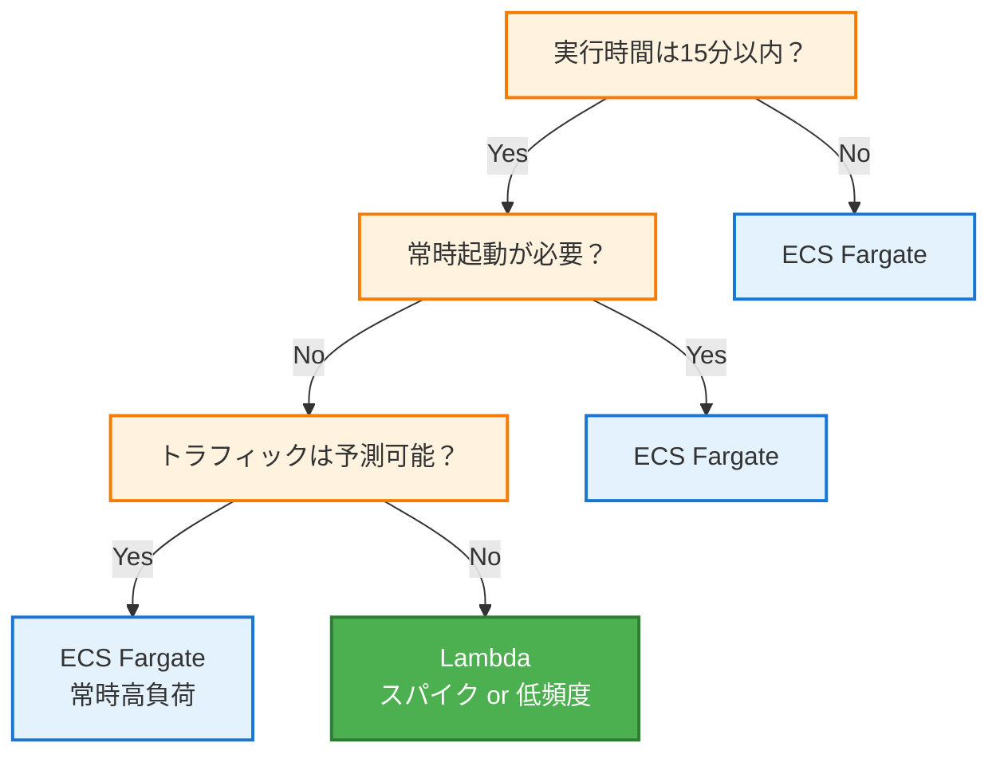

## はじめに

「コンテナを動かしたいだけなのに、選択肢が多すぎる」

ECS、EKS、Fargate、Lambda、Cloud Run、Azure Container Instances...

どれを選べばいいのか、わからなくなる。

この混乱の原因は、**抽象度の違い**を理解していないことにある。

- 何を自分で管理したいのか
- 何をマネージドに任せたいのか
- どの程度のスケールが必要か

この記事では、ECS Fargateを起点に、コンテナ実行基盤の抽象化レベルを整理し、実務での選択基準を解説する。

---

## コンテナ実行基盤の抽象化レベル

### レベル1: 自前管理（EC2 + Docker）

```
┌─────────────────────────────────────────────────────────┐
│                    自分で管理                           │
│  ┌─────────────────────────────────────────────────┐   │
│  │  EC2 Instance                                   │   │
│  │  ┌─────────┐ ┌─────────┐ ┌─────────┐          │   │
│  │  │Container│ │Container│ │Container│          │   │
│  │  └─────────┘ └─────────┘ └─────────┘          │   │
│  │  ┌─────────────────────────────────┐          │   │
│  │  │         Docker Engine           │          │   │
│  │  └─────────────────────────────────┘          │   │
│  │  ┌─────────────────────────────────┐          │   │
│  │  │         OS (Amazon Linux)       │          │   │
│  │  └─────────────────────────────────┘          │   │
│  └─────────────────────────────────────────────────┘   │
└─────────────────────────────────────────────────────────┘
```

**自分で管理するもの**:
- EC2インスタンスのプロビジョニング
- OS のパッチ適用
- Docker のインストール・更新
- コンテナの配置・スケジューリング
- ネットワーク設定
- セキュリティグループ

**メリット**: 完全な制御
**デメリット**: 運用負荷が高い

### レベル2: オーケストレーション（ECS on EC2 / EKS on EC2）

```
┌─────────────────────────────────────────────────────────┐
│                    AWS が管理                           │
│  ┌─────────────────────────────────────────────────┐   │
│  │            ECS / EKS Control Plane              │   │
│  └─────────────────────────────────────────────────┘   │
└─────────────────────────────────────────────────────────┘
┌─────────────────────────────────────────────────────────┐
│                    自分で管理                           │
│  ┌──────────────────┐  ┌──────────────────┐           │
│  │   EC2 Instance   │  │   EC2 Instance   │           │
│  │  ┌────┐ ┌────┐  │  │  ┌────┐ ┌────┐  │           │
│  │  │ C1 │ │ C2 │  │  │  │ C3 │ │ C4 │  │           │
│  │  └────┘ └────┘  │  │  └────┘ └────┘  │           │
│  └──────────────────┘  └──────────────────┘           │
└─────────────────────────────────────────────────────────┘
```

**AWS が管理**:
- コントロールプレーン
- コンテナのスケジューリング
- サービスディスカバリ

**自分で管理**:
- EC2インスタンス
- OS のパッチ適用
- キャパシティプランニング

### レベル3: サーバーレスコンテナ（ECS on Fargate / EKS on Fargate）

```
┌─────────────────────────────────────────────────────────┐
│                    AWS が管理                           │
│  ┌─────────────────────────────────────────────────┐   │
│  │            ECS / EKS Control Plane              │   │
│  └─────────────────────────────────────────────────┘   │
│  ┌─────────────────────────────────────────────────┐   │
│  │                 Fargate                         │   │
│  │  ┌────────┐  ┌────────┐  ┌────────┐           │   │
│  │  │Task/Pod│  │Task/Pod│  │Task/Pod│           │   │
│  │  └────────┘  └────────┘  └────────┘           │   │
│  └─────────────────────────────────────────────────┘   │
└─────────────────────────────────────────────────────────┘
┌─────────────────────────────────────────────────────────┐
│                    自分で管理                           │
│  ・Dockerイメージ                                       │
│  ・タスク定義                                           │
│  ・アプリケーションコード                               │
└─────────────────────────────────────────────────────────┘
```

**AWS が管理**:
- コントロールプレーン
- インフラストラクチャ（EC2不要）
- OS のパッチ適用
- スケーリング

**自分で管理**:
- Dockerイメージ
- タスク定義（CPU/メモリ）
- アプリケーション

### レベル4: フルマネージド（Lambda / App Runner）

```
┌─────────────────────────────────────────────────────────┐
│                    AWS が管理                           │
│  ┌─────────────────────────────────────────────────┐   │
│  │               Lambda / App Runner               │   │
│  │        コンテナの概念すら隠蔽される              │   │
│  └─────────────────────────────────────────────────┘   │
└─────────────────────────────────────────────────────────┘
┌─────────────────────────────────────────────────────────┐
│                    自分で管理                           │
│  ・コード or Dockerイメージ                             │
└─────────────────────────────────────────────────────────┘
```

---

## ECS Fargate の位置づけ

### ECS とは

**Elastic Container Service**: AWSのコンテナオーケストレーションサービス

```
ECS の役割:
1. コンテナの配置（どのホストで動かすか）
2. スケジューリング（いつ起動するか）
3. サービス管理（常時起動、ヘルスチェック）
4. ロードバランサー連携
5. オートスケーリング
```

### Fargate とは

**コンピューティングエンジン**: サーバーレスでコンテナを実行する基盤

```
Fargate の役割:
1. コンテナ実行環境の提供
2. インフラ管理の抽象化（EC2不要）
3. タスクごとの分離（セキュリティ）
```

### ECS + Fargate = サーバーレスコンテナ

```
┌─────────────────────────────────────────────────────────┐
│                      ECS Cluster                        │
│                                                         │
│  ┌───────────────────────────────────────────────────┐ │
│  │                    Service                        │ │
│  │   ┌─────────────┐  ┌─────────────┐               │ │
│  │   │    Task     │  │    Task     │  ← Fargate で │ │
│  │   │  (Container)│  │  (Container)│    実行       │ │
│  │   └─────────────┘  └─────────────┘               │ │
│  └───────────────────────────────────────────────────┘ │
│                                                         │
│  ┌───────────────────────────────────────────────────┐ │
│  │              Task Definition                      │ │
│  │  - Image: my-app:latest                          │ │
│  │  - CPU: 256 (.25 vCPU)                           │ │
│  │  - Memory: 512 MB                                │ │
│  │  - Port: 8080                                    │ │
│  └───────────────────────────────────────────────────┘ │
└─────────────────────────────────────────────────────────┘
```

---

## 他社サービスとの比較

### AWS 内での比較

| サービス | 抽象度 | 特徴 |
|---------|-------|------|
| EC2 + Docker | 低 | 完全な制御、運用負荷高い |
| ECS on EC2 | 中 | オーケストレーション、EC2管理必要 |
| EKS on EC2 | 中 | Kubernetes、EC2管理必要 |
| **ECS on Fargate** | **高** | **サーバーレス、ECS API** |
| EKS on Fargate | 高 | サーバーレス、Kubernetes API |
| App Runner | 最高 | フルマネージド、設定最小 |
| Lambda | 最高 | 関数単位、イベント駆動 |

### クラウド間比較

| AWS | GCP | Azure | 説明 |
|-----|-----|-------|------|
| ECS on EC2 | GKE (Standard) | AKS | コンテナ + VM管理 |
| **ECS Fargate** | **Cloud Run** | **ACI** | **サーバーレスコンテナ** |
| EKS Fargate | GKE Autopilot | AKS + Virtual Nodes | K8s + サーバーレス |
| App Runner | Cloud Run | Azure Container Apps | フルマネージド |
| Lambda | Cloud Functions | Azure Functions | FaaS |

### GCP Cloud Run との比較

```
┌─────────────────────────────────────────────────────────┐
│                    Cloud Run                            │
│                                                         │
│  特徴:                                                  │
│  - リクエストベースの課金                               │
│  - 0にスケールダウン可能                                │
│  - HTTPリクエストがトリガー                             │
│  - コールドスタートあり                                 │
│  - 設定がシンプル                                       │
│                                                         │
│  向いているケース:                                      │
│  - Webアプリ、API                                       │
│  - トラフィックが不定期                                 │
│  - コスト最適化重視                                     │
└─────────────────────────────────────────────────────────┘

┌─────────────────────────────────────────────────────────┐
│                    ECS Fargate                          │
│                                                         │
│  特徴:                                                  │
│  - タスク単位の課金（起動時間）                         │
│  - 最小1タスクは常時起動（設定次第）                    │
│  - 様々なトリガー（HTTP、スケジュール、イベント）       │
│  - VPC統合が強力                                        │
│  - 設定項目が多い（柔軟）                               │
│                                                         │
│  向いているケース:                                      │
│  - 常時起動のサービス                                   │
│  - VPC内リソースへのアクセス                            │
│  - 複雑なネットワーク要件                               │
│  - AWS サービスとの深い統合                             │
└─────────────────────────────────────────────────────────┘
```

### Azure Container Instances (ACI) との比較

| 項目 | ECS Fargate | ACI |
|------|-------------|-----|
| オーケストレーション | ECS（組み込み） | なし（AKS連携で対応） |
| スケーリング | Service Auto Scaling | 手動 or AKS |
| 永続ボリューム | EFS | Azure Files |
| GPU | サポート | サポート |
| Windows | サポート | サポート |
| 料金モデル | vCPU + メモリ × 時間 | vCPU + メモリ × 秒 |

---

## Lambda との比較

### 根本的な違い

```
Lambda:
- 関数単位
- イベント駆動
- 最大15分
- ステートレス前提

ECS Fargate:
- コンテナ単位
- 常時起動可能
- 実行時間制限なし
- ステートフル可能
```

### 詳細比較

| 項目 | Lambda | ECS Fargate |
|------|--------|-------------|
| 実行単位 | 関数 | コンテナ |
| 最大実行時間 | 15分 | 制限なし |
| メモリ | 128MB〜10GB | 512MB〜120GB |
| vCPU | メモリに比例（最大6） | 0.25〜16 vCPU |
| コールドスタート | あり（数百ms〜数秒） | なし（常時起動の場合） |
| スケーリング | 自動（同時実行数制限） | 設定ベース |
| 料金 | リクエスト + 実行時間 | vCPU + メモリ × 時間 |
| VPC | オプション（ENI作成に時間） | 標準（VPC内で動作） |
| カスタムランタイム | コンテナイメージ対応 | 任意のコンテナ |

### コスト比較（概算）

```
シナリオ: 月間100万リクエスト、平均処理時間500ms、512MBメモリ

Lambda:
- リクエスト料金: $0.20 (100万 × $0.0000002)
- 実行時間: $4.17 (100万 × 0.5秒 × 512MB × $0.0000166667/GB-秒)
- 合計: 約 $4.37/月

ECS Fargate (常時1タスク起動):
- 0.25 vCPU: $7.29 (730時間 × $0.0099875)
- 0.5GB メモリ: $0.80 (730時間 × $0.0010975)
- 合計: 約 $8.09/月

ECS Fargate (リクエスト時のみ起動):
- 実行時間に応じて変動
- Lambda より安くなることも
```

### 使い分けの指針



---

## 実務での選択基準

### ECS Fargate を選ぶべきケース

#### 1. 常時起動のWebアプリ/API

```python
# 常にリクエストを受け付けるAPIサーバー
# コールドスタートを避けたい

from flask import Flask
app = Flask(__name__)

@app.route('/api/users')
def get_users():
    return {'users': [...]}

# 24時間365日、レスポンスタイムを安定させたい
```

#### 2. バックグラウンドワーカー

```python
# SQSからメッセージを常時ポーリングして処理
# 長時間実行（15分超）

import boto3

sqs = boto3.client('sqs')

while True:
    messages = sqs.receive_message(
        QueueUrl='...',
        WaitTimeSeconds=20
    )
    for msg in messages.get('Messages', []):
        process_message(msg)  # 処理時間が長い可能性
        sqs.delete_message(...)
```

#### 3. VPC内リソースへの高頻度アクセス

```python
# RDS、ElastiCacheへの常時接続
# コネクションプール維持

import psycopg2
from psycopg2 import pool

# コネクションプールを維持
db_pool = psycopg2.pool.ThreadedConnectionPool(
    minconn=5,
    maxconn=20,
    host='rds-instance.xxx.ap-northeast-1.rds.amazonaws.com',
    ...
)

# Lambda だとコールドスタート時にプール再作成
# Fargate なら常時接続を維持
```

#### 4. 既存アプリのコンテナ化

```dockerfile
# 既存のモノリシックアプリをそのままコンテナ化
FROM python:3.11

WORKDIR /app
COPY . .
RUN pip install -r requirements.txt

# 既存のアプリ構成を変えずにクラウド移行
CMD ["gunicorn", "app:app", "-b", "0.0.0.0:8080"]
```

### Lambda を選ぶべきケース

#### 1. イベント駆動処理

```python
# S3にファイルがアップロードされたら処理
def lambda_handler(event, context):
    bucket = event['Records'][0]['s3']['bucket']['name']
    key = event['Records'][0]['s3']['object']['key']

    # 画像リサイズなど
    process_file(bucket, key)
```

#### 2. 低頻度 or スパイクのあるAPI

```python
# 1日数回しか呼ばれないAPI
# でも呼ばれたときは大量に来る

def lambda_handler(event, context):
    # 同時実行数で自動スケール
    return {
        'statusCode': 200,
        'body': json.dumps(result)
    }
```

#### 3. スケジュール実行

```python
# 毎日深夜にバッチ処理（15分以内）
def lambda_handler(event, context):
    # CloudWatch Events でトリガー
    run_daily_batch()
```

### App Runner を選ぶべきケース

#### 1. とにかく簡単に動かしたい

```yaml
# apprunner.yaml
version: 1.0
runtime: python3
build:
  commands:
    build:
      - pip install -r requirements.txt
run:
  command: python app.py
  network:
    port: 8080
```

```bash
# デプロイ
aws apprunner create-service \
  --service-name my-app \
  --source-configuration '{
    "CodeRepository": {
      "RepositoryUrl": "https://github.com/...",
      "SourceCodeVersion": {"Type": "BRANCH", "Value": "main"}
    }
  }'
```

#### 2. 自動スケール + 0へのスケールダウン

```
リクエストがない時間帯:
- App Runner: 0インスタンス（コスト0）
- ECS Fargate: 最低1タスク（コスト発生）
```

---

## 【実装】ECS Fargate の構成

### Terraform での構成

```hcl
# VPC（既存 or 新規）
data "aws_vpc" "main" {
  id = var.vpc_id
}

data "aws_subnets" "private" {
  filter {
    name   = "vpc-id"
    values = [data.aws_vpc.main.id]
  }
  tags = {
    Tier = "private"
  }
}

# ECS クラスター
resource "aws_ecs_cluster" "main" {
  name = "my-app-cluster"

  setting {
    name  = "containerInsights"
    value = "enabled"
  }
}

# タスク定義
resource "aws_ecs_task_definition" "app" {
  family                   = "my-app"
  network_mode             = "awsvpc"
  requires_compatibilities = ["FARGATE"]
  cpu                      = "256"   # 0.25 vCPU
  memory                   = "512"   # 512 MB
  execution_role_arn       = aws_iam_role.ecs_execution.arn
  task_role_arn            = aws_iam_role.ecs_task.arn

  container_definitions = jsonencode([
    {
      name  = "app"
      image = "${aws_ecr_repository.app.repository_url}:latest"

      portMappings = [
        {
          containerPort = 8080
          protocol      = "tcp"
        }
      ]

      environment = [
        {
          name  = "ENV"
          value = "production"
        }
      ]

      secrets = [
        {
          name      = "DATABASE_URL"
          valueFrom = aws_secretsmanager_secret.db_url.arn
        }
      ]

      logConfiguration = {
        logDriver = "awslogs"
        options = {
          awslogs-group         = aws_cloudwatch_log_group.app.name
          awslogs-region        = var.region
          awslogs-stream-prefix = "ecs"
        }
      }

      healthCheck = {
        command     = ["CMD-SHELL", "curl -f http://localhost:8080/health || exit 1"]
        interval    = 30
        timeout     = 5
        retries     = 3
        startPeriod = 60
      }
    }
  ])
}

# ECS サービス
resource "aws_ecs_service" "app" {
  name            = "my-app-service"
  cluster         = aws_ecs_cluster.main.id
  task_definition = aws_ecs_task_definition.app.arn
  desired_count   = 2
  launch_type     = "FARGATE"

  network_configuration {
    subnets          = data.aws_subnets.private.ids
    security_groups  = [aws_security_group.ecs_tasks.id]
    assign_public_ip = false
  }

  load_balancer {
    target_group_arn = aws_lb_target_group.app.arn
    container_name   = "app"
    container_port   = 8080
  }

  deployment_configuration {
    minimum_healthy_percent = 50
    maximum_percent         = 200
  }

  deployment_circuit_breaker {
    enable   = true
    rollback = true
  }
}

# オートスケーリング
resource "aws_appautoscaling_target" "ecs" {
  max_capacity       = 10
  min_capacity       = 2
  resource_id        = "service/${aws_ecs_cluster.main.name}/${aws_ecs_service.app.name}"
  scalable_dimension = "ecs:service:DesiredCount"
  service_namespace  = "ecs"
}

resource "aws_appautoscaling_policy" "ecs_cpu" {
  name               = "cpu-scaling"
  policy_type        = "TargetTrackingScaling"
  resource_id        = aws_appautoscaling_target.ecs.resource_id
  scalable_dimension = aws_appautoscaling_target.ecs.scalable_dimension
  service_namespace  = aws_appautoscaling_target.ecs.service_namespace

  target_tracking_scaling_policy_configuration {
    predefined_metric_specification {
      predefined_metric_type = "ECSServiceAverageCPUUtilization"
    }
    target_value       = 70.0
    scale_in_cooldown  = 300
    scale_out_cooldown = 60
  }
}

# ALB
resource "aws_lb" "app" {
  name               = "my-app-alb"
  internal           = false
  load_balancer_type = "application"
  security_groups    = [aws_security_group.alb.id]
  subnets            = data.aws_subnets.public.ids
}

resource "aws_lb_target_group" "app" {
  name        = "my-app-tg"
  port        = 8080
  protocol    = "HTTP"
  vpc_id      = data.aws_vpc.main.id
  target_type = "ip"  # Fargate は IP ターゲット

  health_check {
    path                = "/health"
    healthy_threshold   = 2
    unhealthy_threshold = 3
    timeout             = 5
    interval            = 30
    matcher             = "200"
  }
}
```

### CI/CD（GitHub Actions）

```yaml
# .github/workflows/deploy.yml
name: Deploy to ECS Fargate

on:
  push:
    branches: [main]

env:
  AWS_REGION: ap-northeast-1
  ECR_REPOSITORY: my-app
  ECS_SERVICE: my-app-service
  ECS_CLUSTER: my-app-cluster

jobs:
  deploy:
    runs-on: ubuntu-latest

    steps:
      - uses: actions/checkout@v4

      - name: Configure AWS credentials
        uses: aws-actions/configure-aws-credentials@v4
        with:
          aws-access-key-id: ${{ secrets.AWS_ACCESS_KEY_ID }}
          aws-secret-access-key: ${{ secrets.AWS_SECRET_ACCESS_KEY }}
          aws-region: ${{ env.AWS_REGION }}

      - name: Login to Amazon ECR
        id: login-ecr
        uses: aws-actions/amazon-ecr-login@v2

      - name: Build, tag, and push image to Amazon ECR
        id: build-image
        env:
          ECR_REGISTRY: ${{ steps.login-ecr.outputs.registry }}
          IMAGE_TAG: ${{ github.sha }}
        run: |
          docker build -t $ECR_REGISTRY/$ECR_REPOSITORY:$IMAGE_TAG .
          docker push $ECR_REGISTRY/$ECR_REPOSITORY:$IMAGE_TAG
          echo "image=$ECR_REGISTRY/$ECR_REPOSITORY:$IMAGE_TAG" >> $GITHUB_OUTPUT

      - name: Download task definition
        run: |
          aws ecs describe-task-definition \
            --task-definition my-app \
            --query taskDefinition > task-definition.json

      - name: Update task definition with new image
        id: task-def
        uses: aws-actions/amazon-ecs-render-task-definition@v1
        with:
          task-definition: task-definition.json
          container-name: app
          image: ${{ steps.build-image.outputs.image }}

      - name: Deploy to Amazon ECS
        uses: aws-actions/amazon-ecs-deploy-task-definition@v1
        with:
          task-definition: ${{ steps.task-def.outputs.task-definition }}
          service: ${{ env.ECS_SERVICE }}
          cluster: ${{ env.ECS_CLUSTER }}
          wait-for-service-stability: true
```

---

## コスト最適化

### Fargate Spot の活用

```hcl
# 開発環境やバッチ処理に Fargate Spot を使用
resource "aws_ecs_service" "app_spot" {
  name            = "my-app-service"
  cluster         = aws_ecs_cluster.main.id
  task_definition = aws_ecs_task_definition.app.arn
  desired_count   = 2

  capacity_provider_strategy {
    capacity_provider = "FARGATE_SPOT"
    weight            = 4  # 80% を Spot
    base              = 1  # 最低1タスクは通常Fargate
  }

  capacity_provider_strategy {
    capacity_provider = "FARGATE"
    weight            = 1  # 20% を通常
  }
}
```

**Fargate Spot の料金**: 通常の最大70%オフ

### 適切なサイジング

```hcl
# CPU/メモリの組み合わせ（Fargate）
# 小さすぎると性能問題、大きすぎるとコスト増

# 軽量API（Node.js/Python）
cpu    = "256"   # 0.25 vCPU
memory = "512"   # 512 MB

# 標準的なWebアプリ
cpu    = "512"   # 0.5 vCPU
memory = "1024"  # 1 GB

# 重い処理（画像処理、ML推論）
cpu    = "1024"  # 1 vCPU
memory = "2048"  # 2 GB

# 高負荷アプリ
cpu    = "2048"  # 2 vCPU
memory = "4096"  # 4 GB
```

### Lambda との併用

```
┌─────────────────────────────────────────────────────────┐
│                    Architecture                         │
│                                                         │
│  ┌───────────────────────────────────────────────────┐ │
│  │              API Gateway                          │ │
│  └─────────────────────┬─────────────────────────────┘ │
│                        │                               │
│        ┌───────────────┴───────────────┐               │
│        │                               │               │
│  ┌─────▼─────┐                   ┌─────▼─────┐        │
│  │  Lambda   │                   │ECS Fargate│        │
│  │ (軽量API) │                   │(重い処理) │        │
│  │           │                   │           │        │
│  │ /health   │                   │ /process  │        │
│  │ /status   │                   │ /analyze  │        │
│  └───────────┘                   └───────────┘        │
│                                                         │
│  軽量なエンドポイント → Lambda（コスト最適化）          │
│  重い処理 → ECS Fargate（性能優先）                     │
└─────────────────────────────────────────────────────────┘
```

---

## 監視とログ

### CloudWatch Container Insights

```hcl
resource "aws_ecs_cluster" "main" {
  name = "my-app-cluster"

  setting {
    name  = "containerInsights"
    value = "enabled"
  }
}
```

**取得できるメトリクス**:
- CPU/メモリ使用率
- ネットワーク I/O
- ストレージ I/O
- タスク数

### ログ設定

```json
{
  "logConfiguration": {
    "logDriver": "awslogs",
    "options": {
      "awslogs-group": "/ecs/my-app",
      "awslogs-region": "ap-northeast-1",
      "awslogs-stream-prefix": "ecs",
      "awslogs-create-group": "true"
    }
  }
}
```

### アラート設定

```hcl
resource "aws_cloudwatch_metric_alarm" "high_cpu" {
  alarm_name          = "ecs-high-cpu"
  comparison_operator = "GreaterThanThreshold"
  evaluation_periods  = 2
  metric_name         = "CPUUtilization"
  namespace           = "AWS/ECS"
  period              = 60
  statistic           = "Average"
  threshold           = 80

  dimensions = {
    ClusterName = aws_ecs_cluster.main.name
    ServiceName = aws_ecs_service.app.name
  }

  alarm_actions = [aws_sns_topic.alerts.arn]
}

resource "aws_cloudwatch_metric_alarm" "task_count" {
  alarm_name          = "ecs-running-task-count"
  comparison_operator = "LessThanThreshold"
  evaluation_periods  = 2
  metric_name         = "RunningTaskCount"
  namespace           = "ECS/ContainerInsights"
  period              = 60
  statistic           = "Average"
  threshold           = 1

  dimensions = {
    ClusterName = aws_ecs_cluster.main.name
    ServiceName = aws_ecs_service.app.name
  }

  alarm_actions = [aws_sns_topic.alerts.arn]
}
```

---

## 実務チェックリスト

### 選択時

- [ ] 実行時間の要件は確認したか（15分以内 → Lambda も候補）
- [ ] トラフィックパターンは把握しているか（常時 vs スパイク）
- [ ] VPC内リソースへのアクセスは必要か
- [ ] コールドスタートの許容度は確認したか
- [ ] コスト試算は行ったか

### 実装時

- [ ] タスク定義のCPU/メモリは適切か
- [ ] ヘルスチェックは設定されているか
- [ ] ログ設定は適切か
- [ ] シークレット管理は適切か（Secrets Manager / Parameter Store）
- [ ] オートスケーリングは設定されているか

### 運用時

- [ ] Container Insights は有効か
- [ ] アラートは設定されているか
- [ ] デプロイパイプラインは整備されているか
- [ ] Fargate Spot の活用は検討したか

---

## まとめ

### 抽象度による分類

```
低い ←──────── 抽象度 ────────→ 高い

EC2+Docker → ECS/EC2 → ECS/Fargate → App Runner → Lambda
   ↑           ↑           ↑            ↑          ↑
 全部自分    VM管理     コンテナ       コード     関数
             必要      だけ考える    だけ考える   だけ考える
```

### 選択の指針

| 要件 | 選択 |
|------|------|
| 完全な制御が必要 | ECS on EC2 / EKS |
| サーバーレスでコンテナ | **ECS Fargate** |
| とにかく簡単に | App Runner |
| イベント駆動、短時間処理 | Lambda |
| 0へのスケールダウン重視 | App Runner / Cloud Run |

### ECS Fargate のポジション

**「コンテナを動かしたい、でもサーバー管理はしたくない」**

この要件に最もフィットするのが ECS Fargate だ。

- Lambda より柔軟（実行時間、サイジング）
- EC2 より楽（インフラ管理不要）
- App Runner より細かい制御が可能

**迷ったら ECS Fargate から始めて、要件に応じて Lambda や App Runner に移行するのが現実的なアプローチだ。**
