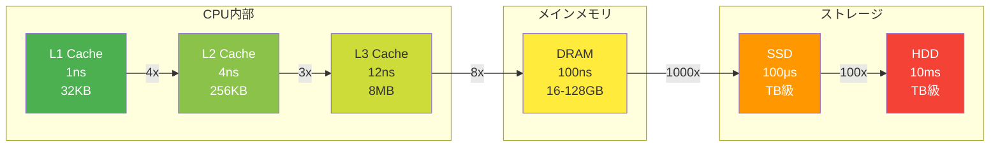
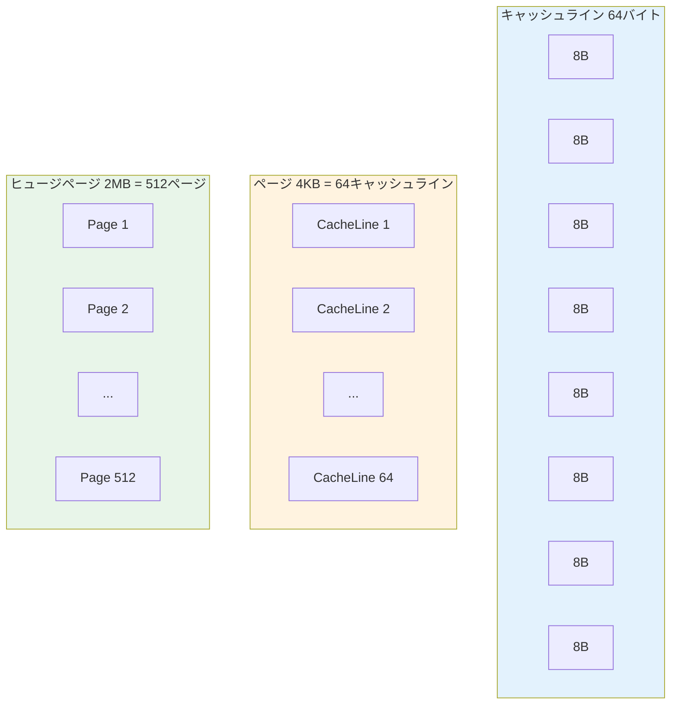

## この記事の対象読者

- 「この処理、何秒くらいかかる？」と聞かれて即答したい人
- 設計レビューで「その数字、根拠は？」と言われたくない人
- パフォーマンスチューニングの勘所を身につけたい人
- 技術面接で「オーダー感」を問われたときに困りたくない人

**この記事を読めば、今日から「数字で語れるエンジニア」になれます。**

---

## TL;DR：暗記すべき数字一覧表

まず結論。以下を暗記してください。詳細は後述。

### レイテンシ早見表

| 操作 | 時間 | 覚え方 |
|-----|------|--------|
| L1キャッシュ参照 | 1ns | 「イチナノ」 |
| L2キャッシュ参照 | 4ns | 「シナノ」 |
| L3キャッシュ参照 | 12ns | 「イチニナノ」 |
| メインメモリ参照 | 100ns | 「ヒャクナノ」 |
| SSD読み取り | 100μs | 「ヒャクマイクロ」 |
| HDD読み取り | 10ms | 「ジュウミリ」 |
| 東京↔大阪RTT | 10ms | 「国内ジュウミリ」 |
| 東京↔米国RTT | 100ms | 「太平洋ヒャクミリ」 |
| 東京↔欧州RTT | 200ms | 「地球半周ニヒャク」 |

### 容量・帯域早見表

| 項目 | 数値 | 覚え方 |
|-----|------|--------|
| L1キャッシュ | 32KB | 「サンニー」 |
| L2キャッシュ | 256KB | 「ニゴロ」 |
| L3キャッシュ | 8MB | 「ハチメガ」 |
| 1Gbps実効 | 100MB/s | 「ギガは100メガ毎秒」 |
| 10Gbps実効 | 1GB/s | 「10ギガは1ギガ毎秒」 |
| NVMe SSD | 3GB/s | 「エヌブイは3ギガ」 |
| DDR4メモリ | 25GB/s | 「メモリ25ギガ」 |

### データベース早見表

| 項目 | 数値 | 覚え方 |
|-----|------|--------|
| インデックス検索 | 1ms以下 | 「インデックスはミリ以下」 |
| フルスキャン100万行 | 1秒 | 「100万は1秒」 |
| INSERT/秒（単体） | 1,000〜10,000 | 「千から万」 |
| コネクション上限 | 100〜500 | 「ヒャクからゴヒャク」 |
| B-Tree深さ | 3〜4 | 「サンシ」 |

### Web性能早見表

| 項目 | 数値 | 覚え方 |
|-----|------|--------|
| 人が「速い」と感じる | 100ms以下 | 「ヒャクミリ以下」 |
| 人が「待てる」限界 | 1秒 | 「1秒の壁」 |
| 離脱が始まる | 3秒 | 「3秒ルール」 |
| FCP目標 | 1.8秒以下 | 「イチハチ」 |
| LCP目標 | 2.5秒以下 | 「ニゴー」 |
| TTI目標 | 3.8秒以下 | 「サンハチ」 |

---

## 1. レイテンシ（速度感の指標）

### メモリ階層のレイテンシ



| 操作 | 時間 | 比較 | 覚える理由 |
|-----|------|------|-----------|
| **L1キャッシュ** | 1ns ±0.5ns | 基準 | CPUの1サイクル相当。最速の参照 |
| **L2キャッシュ** | 4ns ±1ns | L1の4倍 | L1ミスのペナルティ |
| **L3キャッシュ** | 12ns ±3ns | L1の12倍 | マルチコア共有キャッシュ |
| **メインメモリ** | 100ns ±20ns | L1の100倍 | キャッシュミスの代償 |
| **SSD（NVMe）** | 100μs ±50μs | メモリの1000倍 | ランダムアクセス時 |
| **HDD** | 10ms ±5ms | SSDの100倍 | シーク時間が支配的 |

**語呂合わせ：「イチ・シ・ジュウニ・ヒャク」**
- L1=1ns、L2=4ns、L3=12ns、RAM=100ns

**アラートライン：**
- キャッシュミス率 > 5% → メモリアクセスパターン見直し
- L3ミス多発 → データ構造の局所性改善

---

### ネットワークレイテンシ

| 経路 | RTT | 覚え方 | 覚える理由 |
|-----|-----|--------|-----------|
| **localhost** | 0.1ms | 「ゼロコンマイチ」 | プロセス間通信の基準 |
| **同一DC内** | 0.5ms | 「ゼロゴ」 | マイクロサービス間通信 |
| **東京↔大阪** | 10ms | 「国内ジュウ」 | DR構成の判断基準 |
| **東京↔シンガポール** | 70ms | 「ナナジュウ」 | アジア圏展開 |
| **東京↔米国西海岸** | 100ms | 「太平洋ヒャク」 | グローバル展開 |
| **東京↔欧州** | 200ms | 「地球半周ニヒャク」 | CDN必須の判断 |

**物理限界：光速 = 200km/ms（光ファイバー中）**

```
東京〜大阪 = 約500km → 理論値 2.5ms × 往復 = 5ms
実測値 ≈ 10ms（ルーティング・機器遅延込み）
```

**アラートライン：**
- API応答 > 100ms → 非同期化検討
- RTT > 300ms → UX影響大、CDN/エッジ必須

---

## 2. CPU / メモリ / キャッシュ階層

### CPUの数字

| 項目 | 数値 | 覚え方 | 覚える理由 |
|-----|------|--------|-----------|
| **クロック周波数** | 3GHz ±0.5GHz | 「サンギガ」 | 1サイクル ≈ 0.3ns |
| **1サイクル** | 0.3ns | 「ゼロサン」 | レイテンシ計算の基準 |
| **コア数（一般）** | 4〜16コア | 「ヨンジュウロク」 | 並列度の上限 |
| **コア数（サーバー）** | 32〜128コア | 「サンニーイチニッパ」 | スケールアップ限界 |
| **コンテキストスイッチ** | 1〜10μs | 「イチジュウマイクロ」 | スレッド切り替えコスト |
| **システムコール** | 0.5〜1μs | 「ゼロゴイチマイクロ」 | カーネル遷移コスト |

### メモリの数字

| 項目 | 数値 | 覚え方 | 覚える理由 |
|-----|------|--------|-----------|
| **DDR4帯域** | 25GB/s | 「ニジュウゴ」 | メモリバウンド判定 |
| **DDR5帯域** | 50GB/s | 「ゴジュウ」 | 次世代の基準 |
| **ページサイズ** | 4KB | 「ヨンキロ」 | アラインメント基準 |
| **ヒュージページ** | 2MB/1GB | 「ニメガ・イチギガ」 | TLBミス削減 |
| **TLBエントリ数** | 64〜1536 | 「ロクヨン」 | ページテーブル参照 |
| **キャッシュライン** | 64バイト | 「ロクヨンバイト」 | False Sharing防止 |

**語呂合わせ：「キャッシュラインはロクヨン（64）バイト」**



**アラートライン：**
- CPU使用率 > 80%持続 → スケールアウト検討
- メモリ使用率 > 90% → OOMKiller発動リスク

---

## 3. ネットワーク帯域・パケット

### 帯域の実効速度

| 規格 | 理論値 | 実効値 | 覚え方 |
|-----|--------|--------|--------|
| **1GbE** | 1Gbps | 100MB/s | 「ギガは100メガ毎秒」 |
| **10GbE** | 10Gbps | 1GB/s | 「10ギガは1ギガ毎秒」 |
| **25GbE** | 25Gbps | 2.5GB/s | 「25は2.5」 |
| **100GbE** | 100Gbps | 10GB/s | 「100ギガは10ギガ毎秒」 |
| **Wi-Fi 6** | 9.6Gbps | 1GB/s | 「実効は1ギガ」 |

**換算公式：**
```
理論帯域(Gbps) × 0.8(オーバーヘッド) ÷ 8(bit→byte) = 実効速度(GB/s)
1Gbps × 0.8 ÷ 8 = 0.1GB/s = 100MB/s
```

### パケット・MTUの数字

| 項目 | 数値 | 覚え方 | 覚える理由 |
|-----|------|--------|-----------|
| **MTU（標準）** | 1500バイト | 「イチゴーゼロゼロ」 | フラグメント回避 |
| **MTU（ジャンボ）** | 9000バイト | 「キューセン」 | DC内高速転送 |
| **TCPヘッダ** | 20バイト | 「ニジュウ」 | ペイロード計算 |
| **IPヘッダ** | 20バイト | 「ニジュウ」 | 同上 |
| **イーサネットヘッダ** | 14バイト | 「ジュウヨン」 | 同上 |
| **MSS（実効ペイロード）** | 1460バイト | 「イチヨンロクゼロ」 | 実データサイズ |

**アラートライン：**
- パケットロス > 0.1% → ネットワーク品質問題
- 帯域使用率 > 70%持続 → 増速検討

---

## 4. データベース性能・容量単価

### クエリ性能の目安

| 操作 | 時間 | 条件 | 覚える理由 |
|-----|------|------|-----------|
| **インデックス検索** | 1ms以下 | 適切なインデックス | 基本性能の基準 |
| **フルスキャン** | 1秒/100万行 | インデックスなし | 遅さの目安 |
| **JOIN（適切）** | 10ms以下 | インデックスあり | 正規化DBの基準 |
| **INSERT単発** | 1ms | トランザクション内 | 書き込み性能 |
| **バルクINSERT** | 10万行/秒 | 最適化済み | バッチ処理目安 |
| **コネクション確立** | 5〜10ms | TCP+認証込み | プール必須の理由 |

### B-Treeインデックスの数字

| 項目 | 数値 | 計算根拠 | 覚える理由 |
|-----|------|---------|-----------|
| **1ノードの子** | 約100〜500 | ページサイズ依存 | 分岐数 |
| **深さ** | 3〜4 | 1億行でも4段 | ディスクI/O回数 |
| **1億行の検索** | 3〜4回I/O | 深さ×ランダムリード | インデックスの威力 |

```
1億行 = 10^8
深さ3のB-Tree: 500^3 = 1.25億 → 3段で足りる
深さ4のB-Tree: 500^4 = 625億 → 余裕
```

### コネクションの数字

| DB | デフォルト上限 | 推奨上限 | 覚え方 |
|----|--------------|---------|--------|
| **MySQL** | 151 | 100〜500 | 「イチゴイチ」 |
| **PostgreSQL** | 100 | 100〜300 | 「ヒャク」 |
| **Oracle** | 無制限 | 〜1000 | 「セン」 |

**アラートライン：**
- クエリ > 100ms → インデックス見直し
- コネクション使用率 > 80% → プール設定見直し
- ロック待ち > 1秒 → デッドロック調査

---

## 5. Web性能 / UI応答速度

### ユーザー体感の数字

| 時間 | 体感 | 覚え方 | 対応 |
|-----|------|--------|------|
| **0〜100ms** | 即座 | 「ヒャクミリ以下は神」 | 目標 |
| **100〜300ms** | 速い | 「サンビャク以下は優秀」 | 許容 |
| **300〜1000ms** | 普通 | 「1秒以下は合格」 | 改善余地 |
| **1〜3秒** | 遅い | 「3秒で離脱開始」 | 要改善 |
| **3秒以上** | 耐えられない | 「3秒超えは危険」 | 緊急対応 |

### Core Web Vitals

| 指標 | Good | 要改善 | 覚え方 |
|-----|------|--------|--------|
| **LCP** | ≤2.5秒 | >4秒 | 「ニゴー」 |
| **FID** | ≤100ms | >300ms | 「ヒャク」 |
| **CLS** | ≤0.1 | >0.25 | 「ゼロイチ」 |
| **INP** | ≤200ms | >500ms | 「ニヒャク」 |
| **FCP** | ≤1.8秒 | >3秒 | 「イチハチ」 |
| **TTI** | ≤3.8秒 | >7.3秒 | 「サンハチ」 |

**語呂合わせ：「LCP=ニゴー、FID=ヒャク、CLS=ゼロイチ」**

### フレームレートの数字

| 項目 | 数値 | 覚え方 | 覚える理由 |
|-----|------|--------|-----------|
| **60fps** | 16.67ms/frame | 「ジュウロク」 | アニメーション基準 |
| **120fps** | 8.33ms/frame | 「ハチ」 | 高リフレッシュレート |
| **ジャンク閾値** | >50ms | 「ゴジュウ」 | フレーム落ち検知 |

**アラートライン：**
- LCP > 2.5秒 → 画像最適化、サーバー高速化
- CLS > 0.1 → レイアウトシフト対策
- 60fps維持できない → JavaScript最適化

---

## 6. ストレージ（HDD/SSD/NVMe）性能

### シーケンシャルアクセス

| 種類 | 読み取り | 書き込み | 覚え方 |
|-----|---------|---------|--------|
| **HDD（7200rpm）** | 150MB/s | 150MB/s | 「イチゴー」 |
| **SATA SSD** | 550MB/s | 520MB/s | 「ゴゴー」 |
| **NVMe SSD** | 3.5GB/s | 3GB/s | 「サンゴ」 |
| **NVMe Gen5** | 10GB/s | 10GB/s | 「ジュウ」 |

### ランダムアクセス（IOPS）

| 種類 | 読み取り | 書き込み | 覚え方 |
|-----|---------|---------|--------|
| **HDD** | 100 IOPS | 100 IOPS | 「ヒャク」 |
| **SATA SSD** | 10万 IOPS | 5万 IOPS | 「ジュウマン」 |
| **NVMe SSD** | 50万 IOPS | 50万 IOPS | 「ゴジュウマン」 |
| **Optane** | 100万 IOPS | 100万 IOPS | 「ヒャクマン」 |

**SSD vs HDD比較：**
```
シーケンシャル: SSD = HDD × 4〜20倍
ランダム: SSD = HDD × 100〜1000倍
```

**アラートライン：**
- IOPS使用率 > 80% → ストレージ増強
- レイテンシ > 10ms → SSD化検討

---

## 7. クラウド料金の覚えるべき数字

### AWSの目安（東京リージョン、2024年基準）

| リソース | 月額目安 | 覚え方 |
|---------|---------|--------|
| **t3.micro** | $10 | 「ジュウドル」 |
| **t3.medium** | $40 | 「ヨンジュウ」 |
| **m5.large** | $100 | 「ヒャク」 |
| **m5.xlarge** | $200 | 「ニヒャク」 |
| **RDS db.t3.micro** | $15 | 「ジュウゴ」 |
| **RDS db.m5.large** | $150 | 「イチゴー」 |
| **S3 (1TB)** | $23 | 「ニジュウサン」 |
| **データ転送 (1TB)** | $114 | 「イチイチヨン」 |

### ストレージ単価（1GB/月）

| サービス | 単価 | 覚え方 |
|---------|------|--------|
| **S3 Standard** | $0.023 | 「ニセン」 |
| **S3 IA** | $0.0125 | 「イチセン」 |
| **S3 Glacier** | $0.004 | 「ヨン」 |
| **EBS gp3** | $0.08 | 「ハチセン」 |
| **EBS io2** | $0.125 | 「イチニゴ」 |

**語呂合わせ：「S3はニセン、Glacierはヨン」**

### コスト最適化の判断基準

| 状況 | 判断 |
|-----|------|
| 稼働率 > 70% | リザーブド検討（30〜40%割引） |
| スポット可能なワークロード | スポット利用（60〜90%割引） |
| データ転送 > 10TB/月 | 専用線検討 |
| S3 > 100TB | Glacier/IA階層化 |

---

## 8. 通信プロトコル＆暗号化の数字

### プロトコルのオーバーヘッド

| プロトコル | ヘッダサイズ | 覚え方 |
|-----------|-------------|--------|
| **Ethernet** | 14+4バイト | 「ジュウハチ」 |
| **IP** | 20バイト | 「ニジュウ」 |
| **TCP** | 20バイト | 「ニジュウ」 |
| **UDP** | 8バイト | 「ハチ」 |
| **HTTP/1.1** | 200〜800バイト | 「ニヒャク」 |
| **HTTP/2** | 9バイト〜 | 「キュウ」 |
| **TLS** | +40〜100バイト | 「ヨンジュウ」 |

### 暗号化の速度

| アルゴリズム | 速度 | 覚え方 |
|-------------|------|--------|
| **AES-256-GCM** | 10GB/s | 「ジュウギガ」 |
| **ChaCha20** | 5GB/s | 「ゴギガ」 |
| **RSA-2048署名** | 1000回/秒 | 「セン」 |
| **RSA-2048検証** | 50000回/秒 | 「ゴマン」 |
| **ECDSA署名** | 20000回/秒 | 「ニマン」 |

### TLSハンドシェイク

| 方式 | RTT | 覚え方 |
|-----|-----|--------|
| **TLS 1.2** | 2 RTT | 「ニ」 |
| **TLS 1.3** | 1 RTT | 「イチ」 |
| **TLS 1.3 0-RTT** | 0 RTT | 「ゼロ」 |
| **QUIC** | 0〜1 RTT | 「ゼロイチ」 |

---

## 9. 文字コード・画像・動画の重量感

### 文字データの目安

| 内容 | サイズ | 覚え方 |
|-----|--------|--------|
| **1文字（ASCII）** | 1バイト | 「イチ」 |
| **1文字（UTF-8日本語）** | 3バイト | 「サン」 |
| **1ツイート（140字）** | 420バイト | 「ヨンニゼロ」 |
| **1ページ（2000字）** | 6KB | 「ロッキロ」 |
| **小説1冊（10万字）** | 300KB | 「サンビャク」 |

### 画像の目安

| 形式 | フルHD | 4K | 覚え方 |
|-----|--------|-----|--------|
| **PNG（非圧縮）** | 6MB | 24MB | 「ロク」 |
| **JPEG（高品質）** | 500KB | 2MB | 「ゴヒャク」 |
| **JPEG（Web用）** | 100KB | 400KB | 「ヒャク」 |
| **WebP** | 70KB | 280KB | 「ナナジュウ」 |
| **AVIF** | 50KB | 200KB | 「ゴジュウ」 |

### 動画の目安（1分あたり）

| 品質 | サイズ | 覚え方 |
|-----|--------|--------|
| **1080p 30fps** | 150MB | 「イチゴー」 |
| **1080p 60fps** | 300MB | 「サンビャク」 |
| **4K 30fps** | 400MB | 「ヨンヒャク」 |
| **4K 60fps** | 800MB | 「ハッピャク」 |
| **YouTube 1080p** | 15MB | 「ジュウゴ」 |

**語呂合わせ：「生1080pはイチゴー、YouTubeはジュウゴ」**

---

## 10. 「直感」を鍛えるための換算チート

### 時間の換算

| 元 | 換算 | 覚え方 |
|---|------|--------|
| 1秒 | 1,000ms | 「センミリ」 |
| 1ms | 1,000μs | 「センマイクロ」 |
| 1μs | 1,000ns | 「センナノ」 |
| 1日 | 86,400秒 | 「ハチマン」 |
| 1年 | 3,150万秒 | 「サンゼンマン」 |

### 容量の換算

| 元 | 換算 | 覚え方 |
|---|------|--------|
| 1KB | 1,024バイト | 「センニジュウヨン」 |
| 1MB | 1,000KB | 「センキロ」 |
| 1GB | 1,000MB | 「センメガ」 |
| 1TB | 1,000GB | 「センギガ」 |
| 1PB | 1,000TB | 「センテラ」 |

### 2の累乗（暗記必須）

| 指数 | 値 | 覚え方 |
|-----|-----|--------|
| 2^10 | 1,024 ≈ 1K | 「キロ」 |
| 2^20 | 1,048,576 ≈ 1M | 「メガ」 |
| 2^30 | 約10億 ≈ 1G | 「ギガ」 |
| 2^32 | 約43億 | 「ヨンサンオク」 |
| 2^64 | 約1800京 | 「無限大」 |

### 処理量の直感

| 秒間処理数 | 1日の処理量 | 覚え方 |
|-----------|------------|--------|
| 1/秒 | 8.6万/日 | 「ハチマン」 |
| 10/秒 | 86万/日 | 「ハチジュウロクマン」 |
| 100/秒 | 860万/日 | 「ハッピャクロクジュウマン」 |
| 1,000/秒 | 8,600万/日 | 「ハチセンロッピャクマン」 |
| 10,000/秒 | 8.6億/日 | 「ハチオク」 |

**語呂合わせ：「1秒1回で日にハチマン」**

---

## ダウンロード用チートシート

以下をコピーして手元に置いておくと便利です。

```markdown
# エンジニア数字チートシート

## レイテンシ
- L1: 1ns / L2: 4ns / L3: 12ns / RAM: 100ns
- SSD: 100μs / HDD: 10ms
- 国内RTT: 10ms / 太平洋: 100ms / 地球半周: 200ms

## 帯域
- 1Gbps = 100MB/s / 10Gbps = 1GB/s
- NVMe: 3GB/s / DDR4: 25GB/s

## DB
- インデックス検索: 1ms以下
- フルスキャン: 1秒/100万行
- B-Tree深さ: 3〜4

## Web
- 即座: 100ms以下 / 限界: 1秒 / 離脱: 3秒
- LCP: 2.5秒 / FID: 100ms / CLS: 0.1
- 60fps = 16.67ms/frame

## 容量
- ツイート: 420B / 1ページ: 6KB / 小説: 300KB
- 写真: 100KB(Web) / 1分動画: 150MB(1080p)

## 換算
- 1日 = 86,400秒 ≈ 8万秒
- 2^10 = 1K / 2^20 = 1M / 2^30 = 1G
- 1秒1回 = 8.6万/日

## アラート
- キャッシュミス > 5% → 要改善
- CPU > 80% → スケールアウト
- クエリ > 100ms → インデックス見直し
- LCP > 2.5秒 → 画像最適化
```

---

## まとめ

### 今日から使える3つの数字

1. **100msの壁** — ユーザーが「速い」と感じる限界
2. **L1の100倍がRAM** — キャッシュミスの代償
3. **1秒/100万行** — フルスキャンの遅さ

### 覚え方のコツ

- **オーダーで覚える** — 1, 10, 100, 1000の位置関係
- **比較で覚える** — 「SSDはHDDの100倍速い」
- **体感で覚える** — 「100msは即座、1秒は待てる」

### 最後に

数字を暗記する目的は「正確な値を答える」ことではありません。

**「桁を間違えない」こと。**

- 10msと100msを間違えない
- 1GBと1TBを間違えない
- 100回/秒と10万回/秒を間違えない

この「オーダー感」があれば、設計レビューでも障害対応でも、**最初の一手を間違えなくなります。**

---

## 参考リンク

- [Latency Numbers Every Programmer Should Know](https://gist.github.com/jboner/2841832)
- [Google: Core Web Vitals](https://web.dev/vitals/)
- [AWS Pricing Calculator](https://calculator.aws/)
- [Numbers Everyone Should Know (Jeff Dean)](https://research.google/people/jeff/)

<!--
SEO Keywords:
エンジニア 数字 暗記, レイテンシ 一覧, CPU キャッシュ 速度,
ネットワーク 帯域 計算, データベース 性能 目安, Web 性能 指標,
Core Web Vitals 基準, クラウド 料金 目安, AWS 料金 計算,
パフォーマンス チューニング, 性能 最適化, インフラ 数字,
SSD HDD 速度 比較, メモリ レイテンシ, RTT 一覧
-->
