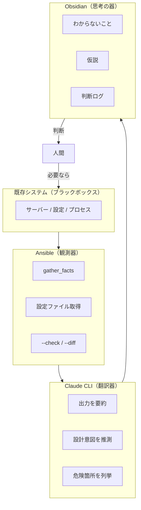

## この記事の前提

多くの自動化やAI活用の記事は、「新しく作る」ことを前提にしている。

しかし実務の大半は、**すでに動いているシステムを理解し、壊さずに判断すること**だ。

仕様書はない。前任者はいない。コードとサーバーだけが残っている。
「触ると怒られる」「壊したら終わり」という空気の中で、何かを判断しなければならない。

本記事では、Obsidian × Claude CLI × Ansible を組み合わせて、既存案件を**観測し、言語化し、差分として捉え、判断できるようにする**ための「OS的な考え方」を解説する。

---

## 目次

1. [なぜ「新規案件向けOS」は既存案件では役に立たないのか](#1-なぜ新規案件向けosは既存案件では役に立たないのか)
2. [既存案件対応OSの役割定義](#2-既存案件対応osの役割定義)
3. [役割を反転させた三層構造](#3-役割を反転させた三層構造)
4. [Obsidianでやること（既存案件特化）](#4-obsidianでやること既存案件特化)
5. [Ansibleを「観測ツール」として使う発想](#5-ansibleを観測ツールとして使う発想)
6. [Claude CLIの正しい使いどころ](#6-claude-cliの正しい使いどころ)
7. [差分を「設計のズレ」として扱う](#7-差分を設計のズレとして扱う)
8. [このOSが刺さる実務シーン](#8-このosが刺さる実務シーン)
9. [結論](#9-結論)

---

## 1. なぜ「新規案件向けOS」は既存案件では役に立たないのか

### 既存案件の特徴

既存案件には、新規開発とは根本的に異なる特徴がある。

- **仕様が不明**：ドキュメントがない、あっても古い、あっても嘘
- **人依存**：「あの人に聞かないと分からない」が常態化している
- **暗黙知**：なぜこの構成なのか、誰も説明できない
- **動いているという事実だけが正**：理由は分からないが、止めると困る

この状況で「新しく作る」前提のワークフローを持ち込んでも、噛み合わない。

### 生成前提のOSがハマらない理由

最近のAI活用やIaCの議論は、「生成」を中心に組み立てられていることが多い。

- 「プロンプトを書けば、playbookが生成される」
- 「設計を書けば、コードが出てくる」
- 「自動化すれば、効率が上がる」

これは正しい。**新規案件では**。

しかし既存案件では、生成の前に「理解」が必要だ。

今何が動いているのか分からない状態で、何かを生成しても意味がない。
むしろ危険だ。

### 既存案件で一番重要なのは「理解」

既存案件で最も価値があるのは、**壊さずに触っていいかを判断できること**だ。

生成でも自動化でもない。理解だ。

- 今、何が動いているのか
- なぜ、この構成になっているのか（推測でいい）
- 触ったら、何が壊れそうか
- 触らないほうがいいのか

この判断ができるようになることが、既存案件対応の本質だ。

---

## 2. 既存案件対応OSの役割定義

### このOSは「作るため」ではない

本記事で提案する Obsidian × Claude CLI × Ansible の組み合わせは、「何かを作るため」のOSではない。

**「壊さずに触っていいか判断するため」のOS**だ。

目的が違えば、使い方も変わる。

### 「壊さずに触っていいか判断するため」のOS

このOSがやることは：

1. **観測する**：今どうなっているかを取得する
2. **言語化する**：分からないこと、違和感、仮説を書き出す
3. **差分を捉える**：あるべき姿との差分を検出する
4. **判断する**：触るか、触らないかを決める

生成は目的ではない。判断が目的だ。

### 変更しないという判断も成果であること

既存案件では、「変更しない」という判断も立派な成果だ。

- 「この構成は古いが、今触ると影響範囲が読めない。今回は見送る」
- 「この設定は非推奨だが、動いている以上、無理に変えない」
- 「ここは次のリプレース時にまとめて対応する」

これらは怠慢ではない。**判断**だ。

判断できるためには、観測と言語化が必要だ。
このOSは、その判断を支援するために存在する。

---

## 3. 役割を反転させた三層構造

新規案件向けのワークフローでは、各ツールは以下のように使われる：

| ツール | 新規案件での役割 |
|--------|------------------|
| Obsidian | 設計・仕様を書く |
| Claude CLI | コードを生成する |
| Ansible | 構成を適用する |

既存案件では、この役割を**反転**させる。

| ツール | 既存案件での役割 |
|--------|------------------|
| Obsidian | **わからないこと**を書く |
| Claude CLI | **翻訳・要約・推測**をさせる |
| Ansible | **観測・棚卸し・差分検出**を行う |



**Obsidianは仕様書ではなく、疑問と仮説の置き場**になる。
**Claude CLIは生成器ではなく、翻訳・要約器**になる。
**Ansibleは構築ツールではなく、観測ツール**になる。

---

## 4. Obsidianでやること（既存案件特化）

### System Snapshot（現状の把握）

まず、今分かっていることを書き出す。

```markdown
# System Snapshot: 本番サーバー A

## 基本情報
- OS: CentOS 7（EOL）
- 用途: 社内向けファイルサーバー
- 前任者: 退職済み（2023年）
- ドキュメント: なし

## 確認済みの事実
- nginx が 80 で Listen している
- /var/www/html に静的ファイルがある
- cron に不明なスクリプトが登録されている

## 未確認
- nginx の設定ファイルの詳細
- cron スクリプトの内容と依存関係
- バックアップの有無と取得先
```

これは仕様書ではない。**現時点での観測結果**だ。

### 疑問点・違和感・不安点を書く

分からないことを素直に書く。

```markdown
## 疑問点
- なぜ nginx の DocumentRoot が /var/www/html ではなく /opt/legacy/public なのか
- cron の backup.sh は何をバックアップしているのか
- このサーバーにSSHできるのは誰か

## 違和感
- /etc/nginx/conf.d に .bak ファイルが大量にある
- root の .bash_history に rm -rf が複数回出てくる

## 不安点
- 再起動したら nginx が自動起動するか不明
- ディスク使用率が 85% を超えている
```

これらは解決すべき「課題」ではない。**観測すべき対象**だ。

### 仮説（なぜこうなっていそうか）を書く

完璧な答えは要らない。推測を書く。

```markdown
## 仮説
- DocumentRoot が /opt/legacy/public なのは、過去にアプリ移行があったから？
- .bak ファイルが多いのは、手動で設定変更を繰り返したから？
- backup.sh は別サーバーに rsync しているが、そのサーバーはもう存在しない？
```

仮説は間違っていていい。**言語化することに意味がある**。

### 判断ログを残す意味

最終的に、判断を記録する。

```markdown
## 判断ログ

### 2026-01-03
- cron の backup.sh は停止しない
  - 理由: 何をしているか不明なため、まず内容を確認する
  - 次のアクション: Ansible で backup.sh の内容を取得する

### 2026-01-04
- nginx の設定変更は見送り
  - 理由: .bak ファイルが多く、過去の変更履歴が追えない
  - 次のアクション: 設定ファイルを Git 管理下に置いてから再検討
```

判断ログは、**未来の自分と後任者への説明責任**を果たす。

---

## 5. Ansibleを「観測ツール」として使う発想

### gather_facts

Ansibleは、接続先の情報を自動収集する `gather_facts` 機能を持っている。

```yaml
- name: Gather system facts
  hosts: legacy_servers
  gather_facts: yes
  tasks:
    - name: Show OS info
      debug:
        msg: "{{ ansible_distribution }} {{ ansible_distribution_version }}"

    - name: Show disk usage
      debug:
        msg: "{{ ansible_mounts }}"

    - name: Show memory
      debug:
        msg: "{{ ansible_memtotal_mb }} MB"
```

これは構築ではない。**観測**だ。

### プロセス・cron・設定ファイルの取得

既存案件では、「何が動いているか」を知ることが最優先だ。

```yaml
- name: Observe running processes
  hosts: legacy_servers
  tasks:
    - name: Get running processes
      command: ps aux
      register: ps_output
      changed_when: false

    - name: Get cron jobs
      command: crontab -l
      register: cron_output
      changed_when: false
      ignore_errors: yes

    - name: Fetch nginx config
      fetch:
        src: /etc/nginx/nginx.conf
        dest: ./fetched/{{ inventory_hostname }}/
        flat: no
```

`changed_when: false` は重要だ。**何も変更していないことを明示する**。

### 破壊しない playbook の考え方

既存案件向けのplaybookには、鉄則がある。

1. **`command` / `shell` モジュールには `changed_when: false` を付ける**
2. **`fetch` で取得するだけ、`copy` で書き込まない**
3. **`--check` を前提に書く**
4. **冪等性より「副作用がないこと」を優先する**

```yaml
# ❌ 破壊する可能性があるplaybook
- name: Update nginx config
  template:
    src: nginx.conf.j2
    dest: /etc/nginx/nginx.conf
  notify: reload nginx

# ✅ 観測に徹するplaybook
- name: Check nginx config syntax
  command: nginx -t
  register: nginx_syntax
  changed_when: false

- name: Show config check result
  debug:
    msg: "{{ nginx_syntax.stderr }}"
```

### 実行ではなく「取得」が主目的であること

このplaybookの目的は、**実行ではなく取得**だ。

取得した情報を元に、人間が判断する。
Ansibleは観測器であり、実行器ではない。

---

## 6. Claude CLIの正しい使いどころ

### Ansibleの出力を要約させる

Ansibleで取得した情報は、量が多い。
Claude CLIに要約させる。

```bash
ansible-playbook observe.yml | claude "この出力から、以下を抽出してください：
1. OSとバージョン
2. ディスク使用率が80%を超えているマウントポイント
3. メモリ使用率
4. 気になる点があれば"
```

生成ではない。**要約**だ。

### 構成から設計意図を推測させる

取得した設定ファイルの意図を推測させる。

```bash
cat fetched/server-a/etc/nginx/nginx.conf | claude "このnginx設定から、
以下を推測してください：
1. このサーバーの用途
2. なぜこの構成になっていると思われるか
3. 一般的なベストプラクティスとの差分"
```

正解を求めているのではない。**仮説の材料**を求めている。

### 危険そうな箇所を列挙させる

「触ると壊れそうな箇所」を列挙させる。

```bash
cat fetched/server-a/etc/crontab | claude "このcrontab設定で、
以下の観点からリスクがありそうな箇所を列挙してください：
1. 依存関係が不明なスクリプト
2. 実行タイミングが他と競合しそうなジョブ
3. エラーハンドリングがなさそうなジョブ"
```

これは「修正案」ではない。**観察の補助**だ。

### 「何を変更すると壊れそうか」を言語化させる

最も重要な使い方がこれだ。

```bash
cat fetched/server-a/etc/nginx/nginx.conf | claude "この設定で、
以下の変更を行った場合の影響を推測してください：

変更案: worker_connections を 1024 から 2048 に変更

推測してほしいこと：
1. この変更で壊れそうな箇所
2. 他の設定との整合性
3. 変更前に確認すべきこと"
```

Claude CLIは、**変更の影響を言語化する**役割を担う。
実際に変更するかどうかは、人間が判断する。

---

## 7. 差分を「設計のズレ」として扱う

### あるべき姿（雑でいい）を書く

まず、「あるべき姿」を雑に書く。完璧でなくていい。

```yaml
# desired-state/nginx.yml
# これは「理想」ではなく「期待値」

nginx:
  worker_processes: auto
  worker_connections: 1024
  gzip: on
  ssl: 有効であるべき
  log_format: combined
```

これは設計書ではない。**比較対象**だ。

### Ansible --check / --diff を使う

「あるべき姿」を playbook 化し、`--check --diff` で差分を見る。

```bash
ansible-playbook desired-state.yml --check --diff
```

出力例：

```diff
TASK [Ensure gzip is enabled] ***************************************
--- before: /etc/nginx/nginx.conf
+++ after: /etc/nginx/nginx.conf
@@ -15,7 +15,7 @@
     sendfile on;
     keepalive_timeout 65;
-    # gzip off;
+    gzip on;
```

この差分は、**「現状」と「期待値」のズレ**を示している。

### 差分を見て「やる／やらない」を判断する

差分を見たら、判断する。

```markdown
## 差分検出結果（2026-01-03）

### gzip 設定
- 現状: コメントアウト（off）
- 期待値: on
- 判断: **今回は変更しない**
- 理由: gzip を有効にすると CPU 負荷が上がる可能性がある。
        現状のサーバースペックを確認してから判断する。

### SSL 設定
- 現状: 80 のみ Listen
- 期待値: 443 で SSL
- 判断: **今回は変更しない**
- 理由: 証明書の有無と取得方法を確認してから。
```

### 変更しない決断もログに残す

「変更しない」という判断を、必ずログに残す。

なぜ変更しなかったのかを書いておけば、次に検討するときの材料になる。
後任者が「なぜこのままなのか」を理解できる。

**変更しない判断は、サボりではなく成果だ。**

---

## 8. このOSが刺さる実務シーン

### 引き継ぎ直後

前任者から「このサーバー、よろしく」と言われた瞬間。
ドキュメントはない。口頭説明は30分。

まずやるべきは、**観測**だ。

Ansibleで情報を取得し、Obsidianに「分からないこと」を書き出す。
Claude CLIで設定ファイルの意図を推測させる。

構築を始めるのは、その後だ。

### 退職者が出た案件

「あの人しか分からない」サーバーが残された。
誰も触りたがらない。触ると怒られる。

このOSは、**安全に触れる範囲を明確にする**。

観測して、言語化して、差分を出して、判断する。
「ここは触れる」「ここは触れない」を切り分ける。

### ブラックボックス化したサーバー

何が動いているか分からない。
止めていいのかも分からない。

まず `gather_facts` と `ps aux` で観測する。
cronを取得する。設定ファイルを取得する。

**何が動いているかを知ることが、最初の成果だ。**

### 触ると怒られるシステム

「勝手に変えるな」と言われている。
しかし、問題は起きている。

このOSは、**変更せずに状況を言語化する**。

「ここがこうなっているから、こういう問題が起きていると推測される」
「変更するなら、こういう影響がありそう」

言語化できれば、交渉ができる。
交渉ができれば、判断を仰げる。

---

## 9. 結論

### 既存案件で一番価値があるのは「安全な判断」

新規案件では、「作れること」が価値になる。
既存案件では、**「壊さずに判断できること」**が価値になる。

生成能力ではない。観測能力と言語化能力だ。

### このOSは生産性ではなく安心感を生む

Obsidian × Claude CLI × Ansible の組み合わせは、生産性を劇的に上げるものではない。

しかし、**安心感を生む**。

- 「何が動いているか、分かっている」
- 「触っていい範囲が、分かっている」
- 「なぜ変更しないのか、説明できる」

この安心感は、既存案件において何より重要だ。

### AI時代に残るのは「壊さずに理解できる人」

AIはコードを書ける。設定を生成できる。

しかし、**壊さずに理解する**ことは、まだ人間の仕事だ。

既存システムを観測し、言語化し、差分を捉え、判断する。
この能力を持つ人は、AI時代でも必要とされ続ける。

Obsidian × Claude CLI × Ansible は、その能力を支援するOSだ。

生成のためではない。
**理解のために。**
