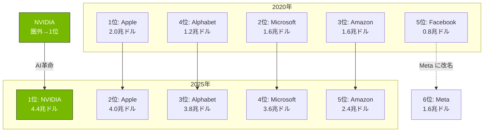
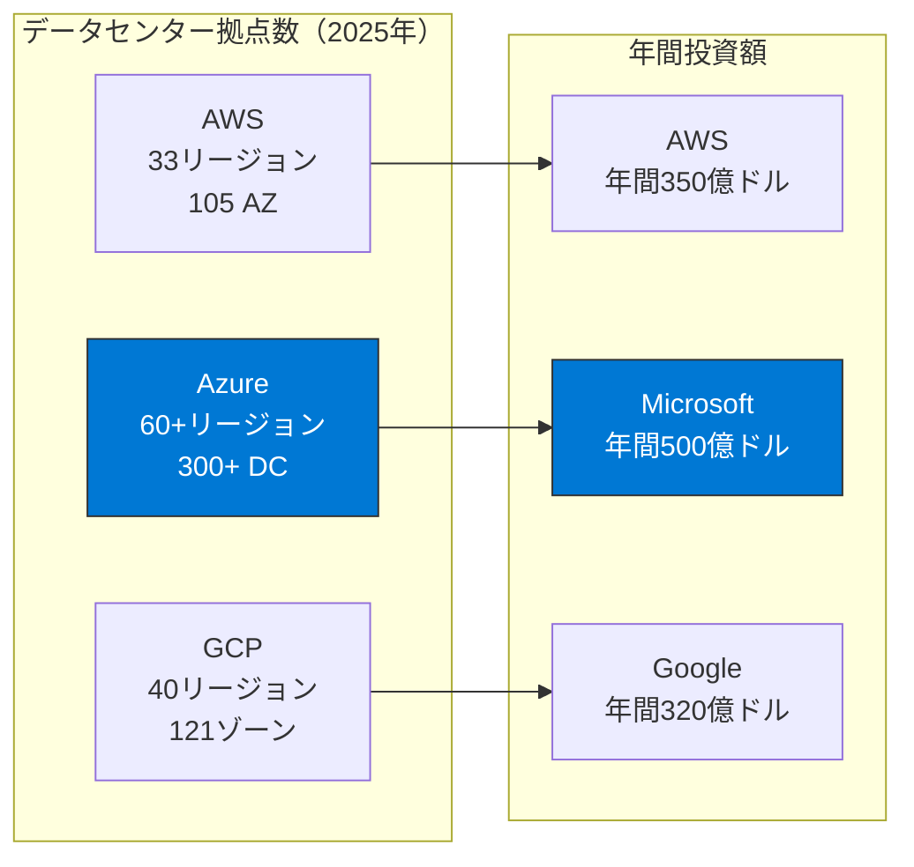
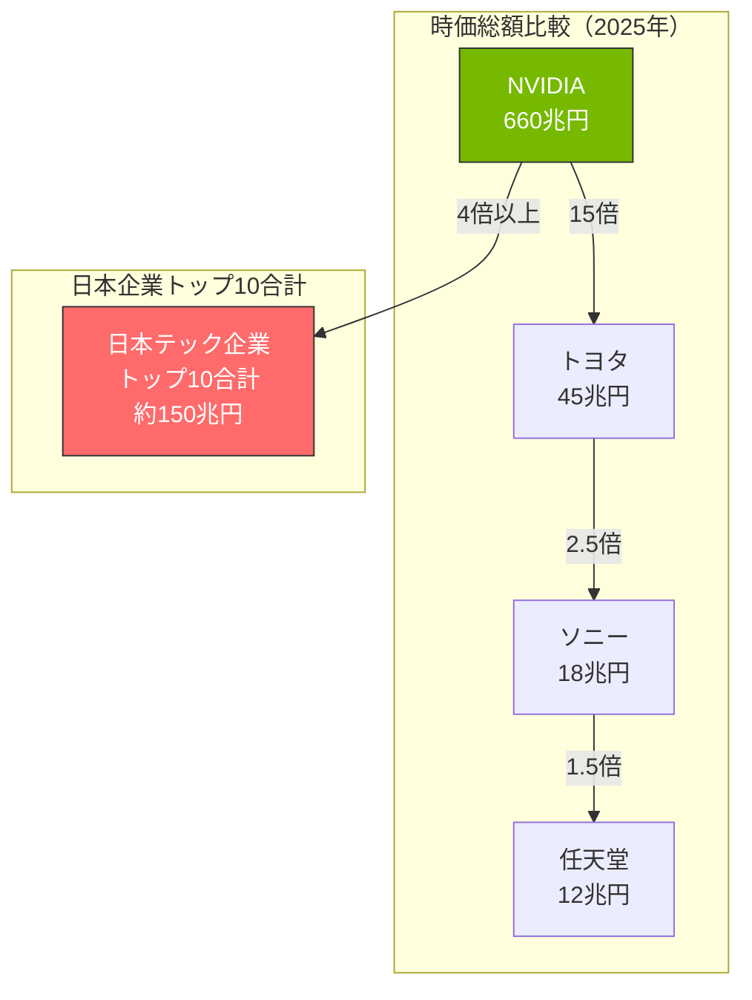
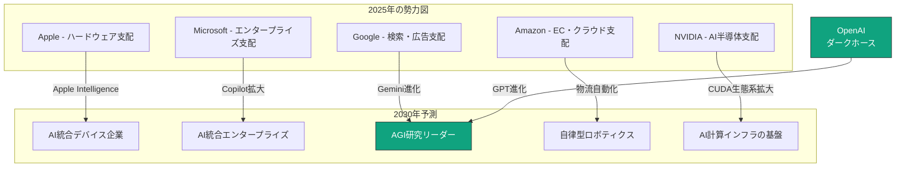

## はじめに：数字で語るテック企業の真の実力

「Apple と Microsoft、どっちが大きい？」「Google のサーバーって何台あるの？」

こんな疑問を持ったことはありませんか？IT企業の規模を比較するとき、私たちは漠然と「大きい」「すごい」と感じますが、**具体的な数字**で見ると、その圧倒的なスケールに驚かされます。

この記事では、世界のテック巨人たちを**時価総額**、**サーバー数**、**ユーザー規模**、**売上高**など、様々な指標で比較し、IT業界の真の勢力図を明らかにします。

---

## 時価総額ランキング：4兆ドル時代の到来

まずは企業の「値段」を示す時価総額から見ていきましょう。

### 世界テック企業 時価総額ランキング（2025年12月時点）

| 順位 | 企業名 | 時価総額（兆ドル） | 時価総額（兆円換算） | 国 |
|:---:|:---|:---:|:---:|:---:|
| 1 | **NVIDIA** | 4.4 | 660 | 🇺🇸 |
| 2 | Apple | 4.0 | 600 | 🇺🇸 |
| 3 | Alphabet (Google) | 3.8 | 570 | 🇺🇸 |
| 4 | Microsoft | 3.6 | 540 | 🇺🇸 |
| 5 | Amazon | 2.4 | 360 | 🇺🇸 |
| 6 | Meta | 1.6 | 240 | 🇺🇸 |
| 7 | TSMC | 1.1 | 165 | 🇹🇼 |
| 8 | Broadcom | 1.0 | 150 | 🇺🇸 |
| 9 | Tesla | 1.3 | 195 | 🇺🇸 |
| 10 | Samsung Electronics | 0.3 | 45 | 🇰🇷 |

### 驚きのポイント

**🏆 NVIDIA が史上初の4兆ドル突破で首位！**
- 2023年初頭：約3,000億ドル
- 2025年7月：史上初の4兆ドル達成
- 2025年12月：約4.4兆ドル
- **わずか2年半で15倍！** AI半導体需要で爆発的成長

**📱 Apple が2位に転落**
- 2024年まで時価総額1位を維持していたが、NVIDIAに抜かれる
- それでも4兆ドル規模を維持し、日本のGDPに匹敵

**📈 Alphabet (Google) が3位に浮上**
- AI統合とクラウド事業の成長で躍進
- Microsoftを抜いて3位に

**🔻 Samsung の意外な低さ**
- 世界最大の半導体メーカーの1つなのに、NVIDIAの1/15
- メモリ市況とAI半導体競争での遅れが影響

---

## 時価総額の推移：勢力図の変遷

**NVIDIAの躍進が一目瞭然！** 2020年には10位にも入っていなかった企業が、AI革命により**2025年には首位**に立ちました。史上初の4兆ドル企業です。

---

## サーバー数・データセンター規模：見えないインフラの巨人たち

クラウドサービスを支えるサーバー数を比較してみましょう。公式発表がない企業も多いため、推計値を含みます。

### 推定サーバー台数ランキング

| 順位 | 企業名 | 推定サーバー台数 | 主要サービス |
|:---:|:---|:---:|:---|
| 1 | Google | 数百万台（推定400万台以上） | 検索、YouTube、GCP |
| 2 | Microsoft | 数百万台（推定300万台以上） | Azure、Microsoft 365 |
| 3 | Amazon | 数百万台（推定300万台以上） | AWS |
| 4 | Meta | 推定100万台以上 | Facebook、Instagram、WhatsApp |
| 5 | Apple | 推定50万台以上 | iCloud、App Store |
| 6 | Alibaba | 推定100万台以上 | Alibaba Cloud |
| 7 | Tencent | 推定80万台以上 | WeChat、クラウド |

### データセンター拠点数

### 驚きの数字感覚

**🔌 電力消費**
- Google のデータセンター：年間約15.5TWh（テラワットアワー）
- これは**デンマーク1国の年間消費電力**に匹敵

**🌡️ 冷却コスト**
- データセンターの電力の約40%は冷却に使用
- Microsoft は海底データセンター「Project Natick」を実験

**💰 建設費用**
- 大規模データセンター1棟：約10億ドル（1,500億円）
- Google は年間に10棟以上を新設

---

## ユーザー数・トラフィック：人類の何割が使っているのか？

### 月間アクティブユーザー数（MAU）

| 順位 | サービス | MAU（億人） | 世界人口比 |
|:---:|:---|:---:|:---:|
| 1 | Google検索 | 45+ | 56% |
| 2 | YouTube | 27 | 34% |
| 3 | Facebook | 31 | 39% |
| 4 | WhatsApp | 27 | 34% |
| 5 | Instagram | 25 | 31% |
| 6 | WeChat | 13 | 16% |
| 7 | TikTok | 15 | 19% |
| 8 | Amazon | 3+ | 4% |

### 1日あたりの処理量

| サービス | 1日あたりの処理量 |
|:---|:---|
| Google検索 | 85億回のクエリ |
| YouTube | 10億時間の視聴 |
| Gmail | 3,000億通のメール |
| WhatsApp | 1,000億メッセージ |
| Instagram | 20億いいね |

**🤯 これらの数字が意味すること**
- Google検索は**1秒間に約10万回**のクエリを処理
- YouTube では**1分間に500時間分**の動画がアップロード
- 人類の3人に1人以上がFacebookアカウントを持つ

---

## 売上高・利益：誰が一番稼いでいるのか？

### 年間売上高ランキング（2025年度）

| 順位 | 企業名 | 年間売上高（億ドル） | 営業利益（億ドル） | 利益率 |
|:---:|:---|:---:|:---:|:---:|
| 1 | Apple | 3,850 | 1,200 | 31% |
| 2 | Amazon | 5,750 | 360 | 6% |
| 3 | Alphabet | 3,500 | 950 | 27% |
| 4 | Microsoft | 2,450 | 1,090 | 44% |
| 5 | Meta | 1,350 | 540 | 40% |
| 6 | Samsung | 2,200 | 65 | 3% |
| 7 | NVIDIA | 610 | 330 | 54% |

### 驚きのポイント

**💎 NVIDIA の異常な利益率**
- 売上高はAppleの1/6だが、利益率は54%（Apple の2倍近く）
- AI半導体の独占的地位が生み出す驚異的マージン

**📦 Amazon の薄利多売**
- 売上高は最大だが、利益率はわずか6%
- 小売事業は利益率1-3%、AWSが利益の大半を稼ぐ

**💼 Microsoft の安定高収益**
- 利益率44%は大企業として驚異的
- サブスクリプション型ビジネスモデルの強さ

---

## 従業員数：人的リソースの規模

| 順位 | 企業名 | 従業員数（万人） | 1人あたり売上高（万ドル） |
|:---:|:---|:---:|:---:|
| 1 | Amazon | 150 | 38 |
| 2 | Foxconn（Apple製造） | 80 | - |
| 3 | Samsung | 27 | 81 |
| 4 | Alphabet | 18 | 194 |
| 5 | Microsoft | 22 | 111 |
| 6 | Apple | 16 | 240 |
| 7 | Meta | 7 | 193 |
| 8 | NVIDIA | 3 | 203 |

### 驚きのポイント

**👨‍💻 Apple の生産性**
- 従業員1人あたり年間売上高：約240万ドル（3.6億円）
- 製造は外注のため、企画・設計・販売に特化

**🤖 NVIDIA の少数精鋭**
- わずか3万人で610億ドルの売上
- 従業員1人あたり203万ドルの売上を達成

**📦 Amazon の労働集約型**
- 150万人を雇用（一般企業ならGDP規模の国に匹敵）
- 物流センター運営に多くの人員が必要

---

## 日本企業の立ち位置：世界との差はどれくらい？

### 日本テック企業 vs 世界

| 企業名 | 時価総額（兆円） | 世界順位相当 |
|:---|:---:|:---:|
| トヨタ自動車 | 40 | Apple の 7% |
| ソニーグループ | 16 | Microsoft の 3% |
| キーエンス | 14 | - |
| NTT | 13 | - |
| 日立製作所 | 11 | - |
| 任天堂 | 10 | - |
| リクルート | 9 | - |
| ソフトバンクG | 8 | - |

### 時価総額の比較図

**🇯🇵 厳しい現実**
- 日本のテック企業トップ10社を足しても、NVIDIA 1社に届かない
- 時価総額で見ると、日本のテック産業は「周回遅れ」の状態

---

## R&D投資額：未来への投資

| 順位 | 企業名 | 年間R&D費（億ドル） | 売上高比率 |
|:---:|:---|:---:|:---:|
| 1 | Amazon | 860 | 15% |
| 2 | Alphabet | 450 | 13% |
| 3 | Meta | 380 | 28% |
| 4 | Microsoft | 270 | 11% |
| 5 | Apple | 260 | 7% |
| 6 | Samsung | 180 | 8% |
| 7 | Intel | 160 | 30% |
| 8 | NVIDIA | 85 | 14% |

**🔬 研究開発の注目点**

- **Meta の異常なR&D比率（28%）**：メタバース・AI に全力投資
- **Apple の効率性（7%）**：少ない投資で最大のリターン
- **Amazon の規模**：年間860億ドル（日本の国家R&D予算の2倍以上）

---

## AI・クラウド市場シェア：次の覇権争い

### クラウドインフラ市場シェア（2025年Q4）

| 順位 | 企業名 | シェア | 年間成長率 |
|:---:|:---|:---:|:---:|
| 1 | AWS | 31% | +12% |
| 2 | Azure | 24% | +29% |
| 3 | Google Cloud | 11% | +28% |
| 4 | Alibaba Cloud | 4% | +6% |
| 5 | その他 | 30% | - |

### AI半導体市場シェア

| 企業名 | データセンターGPU市場シェア |
|:---|:---:|
| NVIDIA | 約80% |
| AMD | 約12% |
| Intel | 約3% |
| その他 | 約5% |

**NVIDIA の独占的地位**が際立ちます。AI学習に必須のGPU市場で80%のシェアを握り、これが驚異的な利益率の源泉です。

---

## 未来予測：2030年の勢力図

### AI が変えるパワーバランス

### 2030年に向けた注目ポイント

1. **AI半導体競争の激化**
   - AMD、Intel、Google TPU、Amazon Graviton が NVIDIA に挑戦
   - 中国の自主開発半導体の進展

2. **エッジAIの台頭**
   - クラウドからデバイスへの処理シフト
   - Apple の Neural Engine が重要に

3. **量子コンピューティング**
   - Google、IBM、Microsoft が先行
   - 2030年頃に実用化の可能性

4. **規制環境の変化**
   - 独占禁止法の強化
   - AI規制法案の影響

---

## 数字感覚クイズ：あなたの予想は？

最後に、記事で紹介した数字から問題です。正解は記事内を振り返ってみてください！

**Q1**: Google は1日に何回の検索クエリを処理している？
- A) 8,500万回
- B) 8億5,000万回
- C) 85億回

**Q2**: Apple の従業員1人あたりの年間売上高は？
- A) 約2,400万円
- B) 約2億4,000万円
- C) 約3億6,000万円

**Q3**: NVIDIA の営業利益率は何%？
- A) 約25%
- B) 約40%
- C) 約54%

**Q4**: 日本のテック企業トップ10社の時価総額合計は、Apple の何分の1？
- A) 約2分の1
- B) 約4分の1
- C) 約10分の1

---

## まとめ：数字が語る「規模の暴力」

この記事を通じて見えてきたのは、**GAFAMとNVIDIA による圧倒的な「規模の暴力」** です。

| 指標 | 勝者 | 驚きのポイント |
|:---|:---|:---|
| 時価総額 | Apple（3.7兆ドル） | 日本のGDPに迫る規模 |
| サーバー数 | Google（400万台以上） | デンマーク1国分の電力消費 |
| ユーザー数 | Google検索（45億人） | 世界人口の56%が利用 |
| 売上高 | Amazon（5,750億ドル） | 日本の国家予算の半分 |
| 利益率 | NVIDIA（54%） | AI半導体の独占が生む異常値 |
| 生産性 | Apple（1人あたり240万ドル） | 製造外注モデルの極致 |

### 日本企業への示唆

厳しい現実として、日本のテック企業は世界との差が開いています。しかし、いくつかの可能性も見えます：

1. **ニッチ領域での勝負** - キーエンスのような高付加価値モデル
2. **製造技術の強み** - 半導体製造装置では日本企業が健闘
3. **コンテンツ産業** - 任天堂、ソニーのゲーム・エンタメ分野

数字を知ることで、IT業界の構造が見えてきます。次にテック企業のニュースを見るとき、この記事の数字を思い出してみてください。「あ、Apple の時価総額の何%だな」と考えられるようになると、ビジネスの見方が変わるはずです。

---

## 参考情報

- 各社財務諸表・決算発表資料（2025年）
- Statista, Gartner, IDC 各種レポート
- 各社公式発表・プレスリリース

※ 記事中の数字は2025年12月時点の情報に基づいています。時価総額は日々変動します。
※ サーバー台数など非公開情報は、業界レポートや技術者の推計に基づく概算値です。
