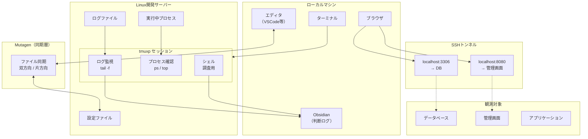
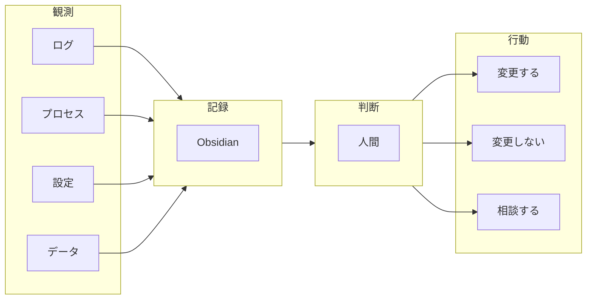
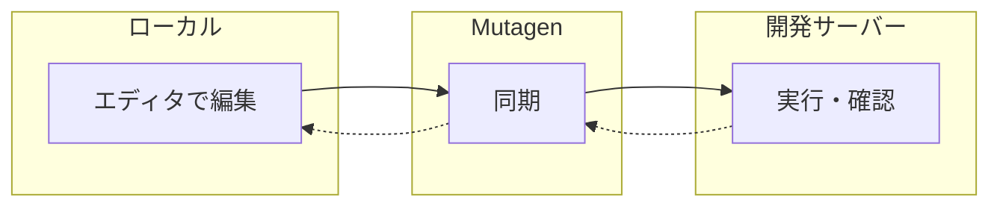
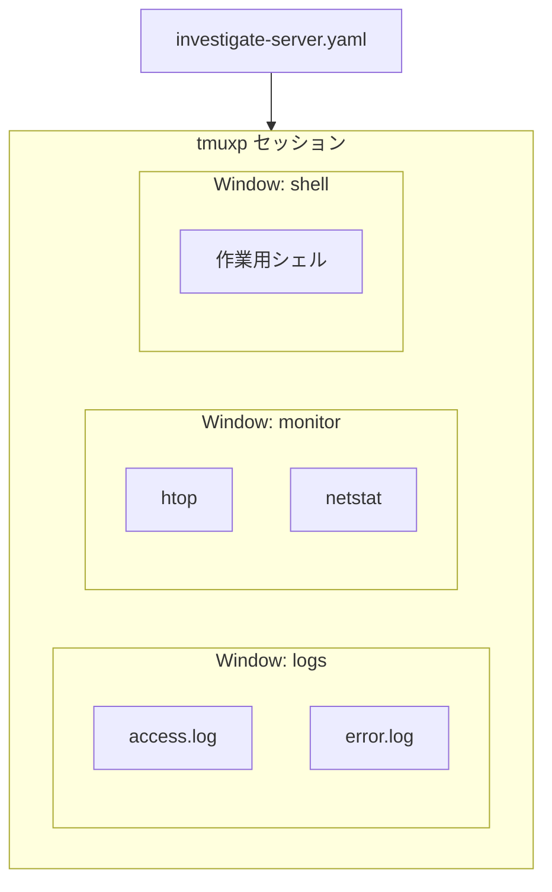
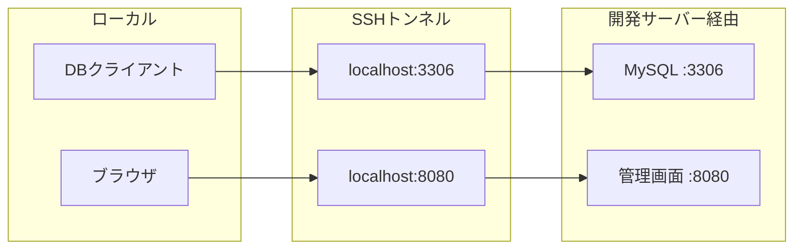
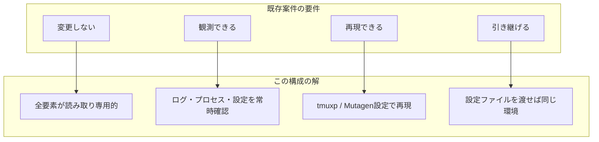
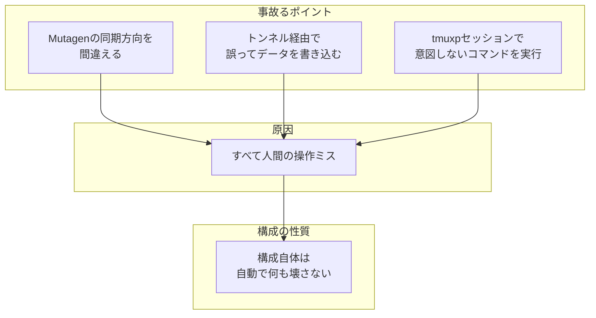
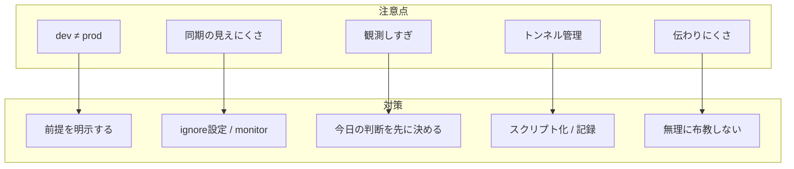

## この記事の結論

先に結論を書く。

**Linux開発サーバー × Mutagen × tmuxp × SSHトンネル × log は、既存案件OSとして"かなり完成度が高い"。**

致命的なデメリットはない。
あるのは**注意点**だけであり、それは理解して使えば回避できる。

以下、その理由と背景、注意点を掘り下げる。

---

## 目次

1. [なぜこの構成に行き着いたのか](#1-なぜこの構成に行き着いたのか)
2. [全体構成図](#2-全体構成図)
3. [各要素の役割](#3-各要素の役割)
4. [なぜ「完成度が高い」と言えるのか](#4-なぜ完成度が高いと言えるのか)
5. [致命的デメリットが「ない」理由](#5-致命的デメリットがない理由)
6. [実際にある「注意点」](#6-実際にある注意点)
7. [注意点をどう扱えばいいか](#7-注意点をどう扱えばいいか)
8. [どんな人・案件に向いているか](#8-どんな人案件に向いているか)
9. [結論](#9-結論)

---

## 1. なぜこの構成に行き着いたのか

### 既存案件の現実

既存案件には、特有の現実がある。

- **触れない**：本番に近い環境を勝手に変更できない
- **壊せない**：「動いている」ことが最優先
- **分からない**：仕様書がない、前任者がいない、暗黙知だらけ

この状況で「まず環境を構築しよう」は、順序が逆だ。

### 「まず観測したい」という要求

既存案件で最初に必要なのは、**観測**だ。

- 何が動いているのか
- どこに設定があるのか
- ログに何が出ているのか
- 変えたら何が壊れそうか

この「観測」を安全に、効率よく、再現可能にできる構成が必要だった。

### 観測から判断へ

観測は、判断のためにある。

「このサーバーを触っていいのか」
「この設定を変えても大丈夫か」
「今日は何もしないほうがいいのか」

これらを判断するために、まず観測する。

その答えが、Linux開発サーバー × Mutagen × tmuxp × SSHトンネル × log だった。

---

## 2. 全体構成図

この構成の全体像を図で示す。



### 情報の流れ



**重要なのは、「観測→記録→判断→行動」の流れが一方向であること。**

観測したものを記録し、記録を元に判断し、判断に基づいて行動する。
この構成は、この流れを自然に支援する。

---

## 3. 各要素の役割

各要素の役割を整理する。

### Linux開発サーバー：本番に近い現実

開発サーバーは、本番に近い環境だ。

実際のLinuxが動いている。
パッケージマネージャも、ファイルシステムも、プロセス管理も、本番と同じ挙動をする。

既存案件の調査において、「本番と同じ挙動」は価値がある。

### Mutagen：編集と実行の分離

Mutagenは、ローカルとリモートのファイルを同期する。



ローカルで編集し、リモートで確認する。
この分離により、「手元のエディタ」と「本番に近い環境」を両立できる。

**Mutagenは実行しない。同期するだけ。**
実行するかどうかは人間が判断する。

### tmuxp：観測状態の保存

tmuxpは、tmuxのセッション構成をYAMLで定義し、再現する。



「このサーバーを調査するときは、この画面構成で」を保存できる。
調査のたびにtmuxを手動で組み立てる必要がない。

**観測状態を保存し、いつでも再現できる。**

### SSHトンネル：触らずに覗く穴

SSHトンネルは、リモートのポートをローカルに転送する。



データベースに直接接続せず、トンネル経由で覗く。
管理画面に直接アクセスせず、トンネル経由で確認する。

**触らずに覗く**ための穴だ。

### log：唯一の事実

ログは、唯一の事実だ。

設定ファイルは「あるべき姿」を示す。
ログは「実際に何が起きたか」を示す。

既存案件では、設定ファイルよりログのほうが信用できることが多い。
「設定上はこうなっているはずだが、ログを見るとそうなっていない」はよくある。

---

## 4. なぜ「完成度が高い」と言えるのか

既存案件で必要な条件を列挙し、この構成がどう満たすかを示す。



### 条件1：変更しない

この構成は、**変更しないことを前提にしている**。

- Mutagenは同期するだけ。実行しない
- tmuxpは画面を作るだけ。コマンドを自動実行しない
- SSHトンネルは穴を開けるだけ。データを書き込まない
- ログは読むだけ。書き込まない

変更するかどうかは、すべて人間が判断する。

### 条件2：観測できる

この構成は、**観測に特化している**。

- ログを常時流せる
- プロセスを監視できる
- 設定ファイルを手元で見れる
- データベースの中身を覗ける（トンネル経由）

観測するための道具が揃っている。

### 条件3：再現できる

この構成は、**再現性が高い**。

- tmuxpで画面構成を再現できる
- Mutagenで同期状態を再現できる
- SSHトンネルの設定をスクリプト化できる

「昨日の続き」をすぐに始められる。

### 条件4：引き継げる

この構成は、**引き継ぎやすい**。

- tmuxpのYAMLを渡せば、同じ画面構成を再現できる
- Mutagenの設定ファイルを渡せば、同じ同期ができる
- 「何を見ていたか」が設定ファイルに残る

暗黙知が設定ファイルに外部化される。

---

## 5. 致命的デメリットが「ない」理由

「致命的デメリットがない」と言い切る理由を説明する。

### 事故るポイントが明確

この構成で事故るとしたら、以下のどれかだ。



構成自体が自動で何かを壊すことはない。
事故るポイントが明確だから、注意すれば回避できる。

### 自動で壊す要素がない

この構成には、「自動で実行される」要素がない。

- Mutagenは同期するだけ
- tmuxpは画面を作るだけ
- SSHトンネルは穴を開けるだけ

CI/CDのように「pushしたら自動でデプロイ」という仕組みはない。
cronのように「定期的に何かを実行」という仕組みもない。

**自動で壊す要素がないから、致命的なデメリットにならない。**

### 人間の判断を前提にしている

この構成は、人間の判断を前提にしている。

観測するのは人間。
判断するのは人間。
実行するのも人間。

人間の判断が介在する構成だから、「勝手に壊れる」ことがない。

---

## 6. 実際にある「注意点」

致命的デメリットはないが、注意点はある。



### dev ≠ prod 問題

開発サーバーは、本番サーバーではない。

どれだけ「本番に近い」と言っても、完全に同じではない。
バージョンが微妙に違う。データが違う。負荷が違う。

**対策**：「これは開発サーバーでの確認結果」という前提を常に明示する。

### Mutagen同期の見えにくさ

Mutagenの同期は、バックグラウンドで動く。

「今、同期されているのか」が見えにくい。
意図しないファイルが同期されて、開発サーバーの状態が変わる可能性がある。

**対策**：`.mutagen.yml` の `ignore` を適切に設定する。`mutagen sync monitor` で同期状態を確認する。

### 観測しすぎて判断が遅れる

この構成は観測に強い。強すぎる場合もある。

「もう少し調べてから判断しよう」が続き、判断が遅れる。

**対策**：「今日は何を判断するか」を先に決める。観測は判断の手段であり、目的ではない。

### トンネル管理の煩雑さ

SSHトンネルが増えると、管理が煩雑になる。

「このポートは何のトンネルだっけ」が分からなくなる。

**対策**：トンネル設定をスクリプト化する。Obsidianに「どのポートが何に繋がっているか」を記録する。

### 他人に伝わりにくい構成

この構成は、慣れていない人には伝わりにくい。

「Mutagenって何？」から説明が始まる。

**対策**：無理に布教しない。この構成が必要な人だけが使えばいい。

---

## 7. 注意点をどう扱えばいいか

### Obsidianで前提を書く

調査を始める前に、Obsidianに前提を書く。

```markdown
# 調査ノート: サーバーA

## 前提
- これは開発サーバーでの確認である
- 本番との差異: バージョンが1つ古い
- 今日の目的: nginx の設定構造を把握する

## 今日判断すること
- nginx の設定を変更すべきか、現状維持か

## 今日判断しないこと
- データベースの最適化（別日に検討）
```

前提を書くことで、「dev ≠ prod 問題」と「観測しすぎ問題」を軽減できる。

### tmuxpでライフサイクル管理

tmuxpのセッション定義を、調査の単位で作る。

```yaml
# investigate-server-a.yaml
session_name: investigate-server-a
windows:
  - window_name: logs
    panes:
      - tail -f /var/log/nginx/access.log
      - tail -f /var/log/nginx/error.log
  - window_name: config
    panes:
      - less /etc/nginx/nginx.conf
  - window_name: shell
    panes:
      -
```

調査を始めるときは `tmuxp load investigate-server-a.yaml`。
調査を終えるときは `tmux kill-session`。

ライフサイクルが明確になる。

### 「今日は触らない」という判断を肯定する

観測した結果、「今日は触らない」という判断をすることがある。

これは怠慢ではない。**判断**だ。

「触らない」と決めたなら、それを記録する。
なぜ触らないのか、次はいつ検討するのか、を書く。

観測は判断のためにある。
「触らない」も立派な判断であり、観測の成果だ。

---

## 8. どんな人・案件に向いているか

### 向いているケース

- **引き継ぎ直後の案件**：何が動いているか分からない状態からスタートする
- **ブラックボックス化したサーバー**：誰も仕様を知らない
- **触ると怒られるシステム**：変更より観測が優先される
- **長期保守案件**：定期的に状態を確認する必要がある

### 向いていないケース

- **新規開発**：作ることが目的なら、別のアプローチが適している
- **CI/CDが整備された環境**：自動化が進んでいるなら、この構成は過剰
- **本番環境を直接触る案件**：開発サーバーがない場合は使えない

### 無理に真似する必要はない

この構成は、特定の状況で強い。万能ではない。

今の環境で困っていないなら、変える必要はない。

「既存案件の観測が辛い」という状況で、この構成は力を発揮する。

---

## 9. 結論

改めて、結論を書く。

### これは万能ではない

Linux開発サーバー × Mutagen × tmuxp × SSHトンネル × log は、万能ではない。

新規開発には向かない。
CI/CDが整備された環境には過剰だ。

### しかし既存案件では非常に強い

しかし、既存案件では非常に強い。

- 変更せずに観測できる
- 観測状態を再現できる
- 引き継ぎやすい
- 事故るポイントが明確で、回避できる

致命的なデメリットはない。
あるのは注意点だけで、それは理解すれば回避できる。

### 「注意点を理解した上で使うOS」として完成度が高い

この構成は、「何も考えずに使えるOS」ではない。

dev ≠ prod の問題を理解している必要がある。
Mutagenの同期を意識する必要がある。
観測と判断の区別をつける必要がある。

しかし、それらを理解した上で使うなら、既存案件OSとして**かなり完成度が高い**。

既存案件で「壊さずに観測する」ことを目的とするなら、この構成は有力な選択肢だ。
