## はじめに

「サーバー1台で限界が来た」

この瞬間、ロードバランサーが必要になる。

でも、なんとなくALBを置いて終わりにしていないだろうか。

- なぜL4とL7があるのか
- ラウンドロビンで本当にいいのか
- スティッキーセッションの罠
- ヘルスチェックの設計

ロードバランサーは「置くだけ」では不十分だ。

この記事では、ロードバランサーの本質から、実務で必要な設計・実装パターンまでを解説する。

---

## なぜロードバランサーが必要か

### 単一サーバーの限界

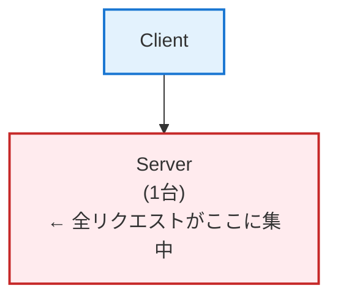

**問題点**:
- 処理能力の限界（CPU、メモリ、I/O）
- 単一障害点（落ちたら全停止）
- メンテナンス時にサービス停止

### ロードバランサーによる解決

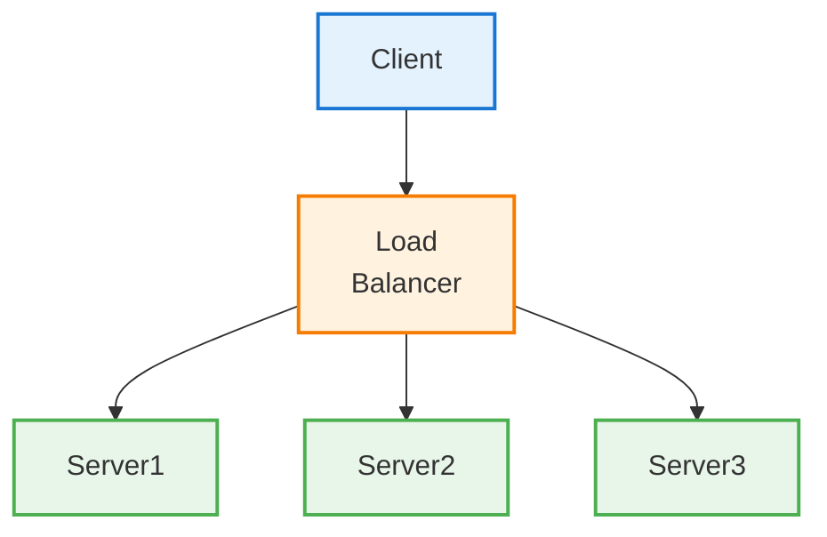

**メリット**:

| メリット | 説明 |
|---------|------|
| スケーラビリティ | サーバーを増やせば処理能力が上がる |
| 可用性 | 1台落ちても他が処理を継続 |
| メンテナンス性 | ローリングアップデートが可能 |
| 柔軟性 | サーバーの追加・削除が容易 |

---

## L4 vs L7：どの層で分散するか

### OSI参照モデルのおさらい

```
Layer 7: アプリケーション層（HTTP, HTTPS, WebSocket）
Layer 6: プレゼンテーション層
Layer 5: セッション層
Layer 4: トランスポート層（TCP, UDP）
Layer 3: ネットワーク層（IP）
Layer 2: データリンク層
Layer 1: 物理層
```

### L4ロードバランサー

**トランスポート層（TCP/UDP）で動作**

```
クライアント → [L4 LB] → サーバー
           IPとポートを見て振り分け
```

**特徴**:
- 高速（パケットの中身を見ない）
- シンプル
- SSL終端はサーバー側で行う
- HTTPの内容（URL、ヘッダー）は見えない

**ユースケース**:
- 高スループットが必要
- TCP/UDPレベルの分散で十分
- データベース接続の分散

### L7ロードバランサー

**アプリケーション層（HTTP/HTTPS）で動作**

```
クライアント → [L7 LB] → サーバー
           HTTPの内容を見て振り分け
```

**特徴**:
- HTTPヘッダー、URL、Cookie等を見て振り分けできる
- SSL終端をLBで行える
- コンテンツベースのルーティング
- L4より遅い（パケットを解析するため）

**ユースケース**:
- URLパスで振り分け（/api/* → APIサーバー）
- ホスト名で振り分け（api.example.com → APIサーバー）
- 認証・認可をLBで行う
- A/Bテスト

### L4 vs L7 比較

| 項目 | L4 | L7 |
|------|----|----|
| 処理速度 | ✅ 高速 | ⚪ 普通 |
| 機能 | ⚪ シンプル | ✅ 高機能 |
| SSL終端 | サーバー側 | LBで可能 |
| コンテンツルーティング | ❌ 不可 | ✅ 可能 |
| WebSocket | ✅ そのまま通る | ⚪ 設定必要 |
| 料金（AWS） | NLB: 安い | ALB: やや高い |

### 実務での選択

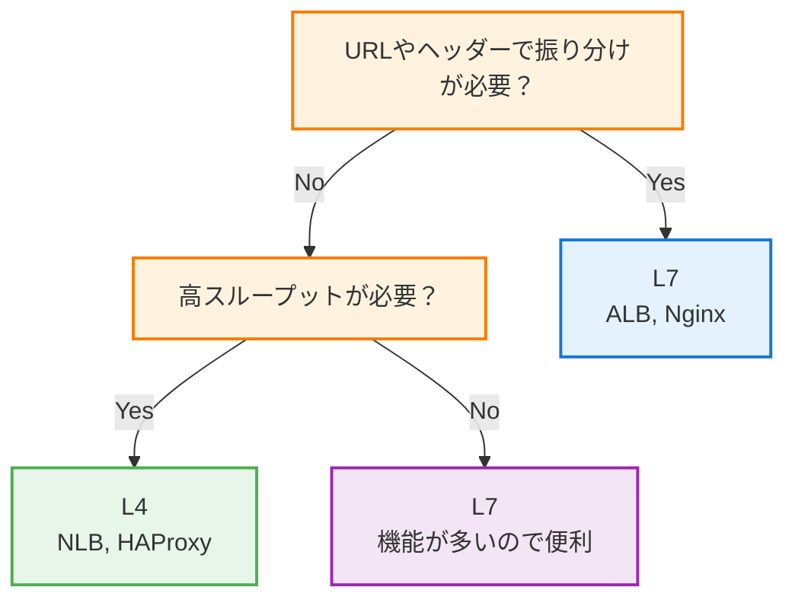

---

## ロードバランシングアルゴリズム

### 1. ラウンドロビン（Round Robin）

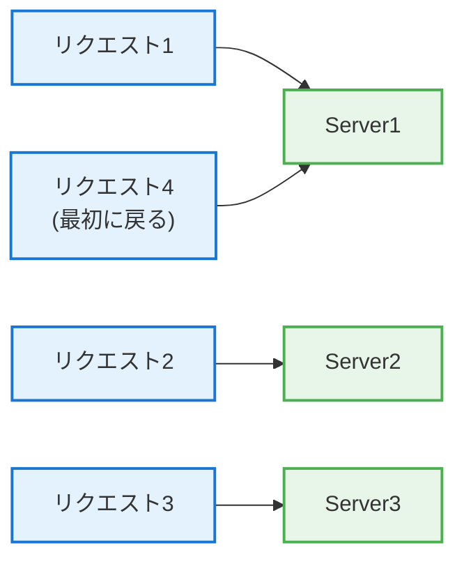

**特徴**:
- シンプル
- サーバーの性能が均一なら公平
- サーバーの負荷状況を考慮しない

**設定例（Nginx）**:

```nginx
upstream backend {
    server server1.example.com;
    server server2.example.com;
    server server3.example.com;
    # デフォルトでラウンドロビン
}
```

### 2. 重み付きラウンドロビン（Weighted Round Robin）

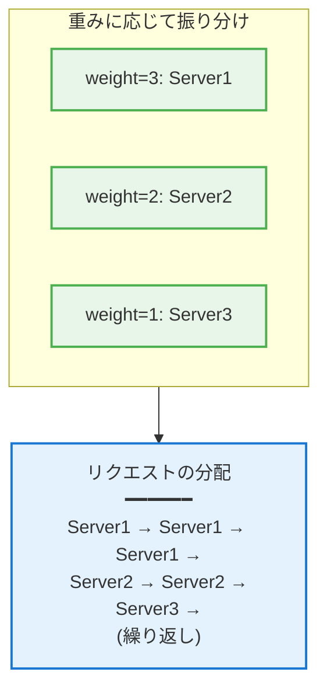

**特徴**:
- サーバー性能の違いを考慮できる
- 高性能サーバーに多くリクエストを振る

**設定例（Nginx）**:

```nginx
upstream backend {
    server server1.example.com weight=3;  # 3倍のリクエスト
    server server2.example.com weight=2;  # 2倍のリクエスト
    server server3.example.com weight=1;  # 基準
}
```

### 3. 最小接続数（Least Connections）

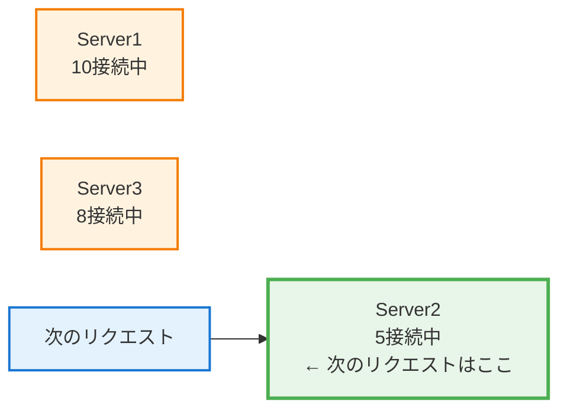

**特徴**:
- 現在の接続数が少ないサーバーに振る
- 処理時間にばらつきがある場合に有効
- 実際の負荷を考慮できる

**設定例（Nginx）**:

```nginx
upstream backend {
    least_conn;
    server server1.example.com;
    server server2.example.com;
    server server3.example.com;
}
```

### 4. IPハッシュ（IP Hash）

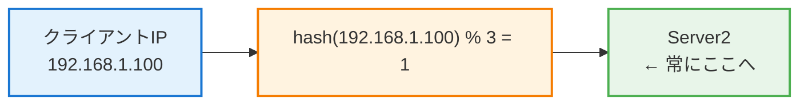

**特徴**:
- 同じクライアントは常に同じサーバーへ
- セッション維持が必要な場合に使用
- サーバー台数が変わると再配分される

**設定例（Nginx）**:

```nginx
upstream backend {
    ip_hash;
    server server1.example.com;
    server server2.example.com;
    server server3.example.com;
}
```

### 5. 一貫性ハッシュ（Consistent Hashing）

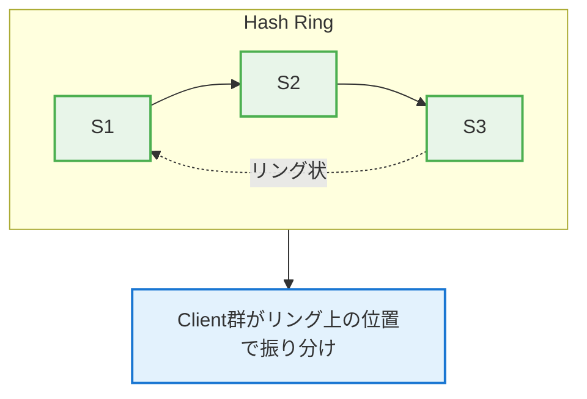

**特徴**:
- サーバー追加・削除時の影響が最小限
- キャッシュサーバーの分散に最適
- 再配分されるキーが少ない

**通常のハッシュとの違い**:

```
# 通常のハッシュ：サーバー3台→2台になった場合
hash(key) % 3 → hash(key) % 2
→ ほとんどのキーが再配分される

# 一貫性ハッシュ：サーバー3台→2台になった場合
→ 削除されたサーバーのキーだけが再配分される
```

### 6. 最小応答時間（Least Response Time）

```
Server1: 平均応答50ms
Server2: 平均応答30ms  ← 次のリクエストはここ
Server3: 平均応答45ms
```

**特徴**:
- 最も応答が速いサーバーに振る
- 実際のパフォーマンスを考慮
- 動的な負荷分散

**設定例（Nginx Plus）**:

```nginx
upstream backend {
    least_time header;  # 最初のバイトまでの時間
    server server1.example.com;
    server server2.example.com;
}
```

### アルゴリズムの選択指針

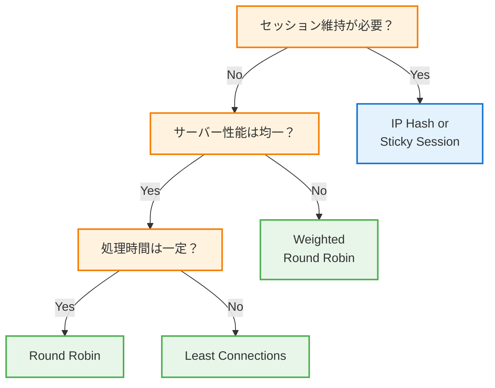

---

## 【実装】Nginx

### 基本設定

```nginx
http {
    # アップストリーム定義
    upstream backend {
        least_conn;

        server 10.0.0.1:8080 weight=3;
        server 10.0.0.2:8080 weight=2;
        server 10.0.0.3:8080 weight=1 backup;  # バックアップサーバー
    }

    server {
        listen 80;
        server_name example.com;

        location / {
            proxy_pass http://backend;
            proxy_set_header Host $host;
            proxy_set_header X-Real-IP $remote_addr;
            proxy_set_header X-Forwarded-For $proxy_add_x_forwarded_for;
            proxy_set_header X-Forwarded-Proto $scheme;
        }
    }
}
```

### SSL終端

```nginx
server {
    listen 443 ssl;
    server_name example.com;

    ssl_certificate /etc/nginx/ssl/example.com.crt;
    ssl_certificate_key /etc/nginx/ssl/example.com.key;
    ssl_protocols TLSv1.2 TLSv1.3;
    ssl_ciphers HIGH:!aNULL:!MD5;

    location / {
        proxy_pass http://backend;  # バックエンドはHTTP
    }
}
```

### パスベースルーティング

```nginx
upstream api_servers {
    server api1.internal:8080;
    server api2.internal:8080;
}

upstream web_servers {
    server web1.internal:3000;
    server web2.internal:3000;
}

server {
    listen 80;

    # /api/* は API サーバーへ
    location /api/ {
        proxy_pass http://api_servers;
    }

    # それ以外は Web サーバーへ
    location / {
        proxy_pass http://web_servers;
    }
}
```

### ヘルスチェック

```nginx
upstream backend {
    server 10.0.0.1:8080;
    server 10.0.0.2:8080;

    # パッシブヘルスチェック
    # 3回失敗したら30秒間除外
    server 10.0.0.1:8080 max_fails=3 fail_timeout=30s;
}

# Nginx Plus ではアクティブヘルスチェックが可能
upstream backend {
    zone backend 64k;
    server 10.0.0.1:8080;
    server 10.0.0.2:8080;

    health_check interval=5s fails=3 passes=2;
}
```

### WebSocket対応

```nginx
location /ws/ {
    proxy_pass http://websocket_servers;
    proxy_http_version 1.1;
    proxy_set_header Upgrade $http_upgrade;
    proxy_set_header Connection "upgrade";
    proxy_set_header Host $host;

    # タイムアウト設定（長めに）
    proxy_read_timeout 86400s;
    proxy_send_timeout 86400s;
}
```

---

## 【実装】HAProxy

### 基本設定

```haproxy
global
    log stdout format raw local0
    maxconn 4096

defaults
    mode http
    log global
    option httplog
    option dontlognull
    timeout connect 5s
    timeout client 50s
    timeout server 50s

frontend http_front
    bind *:80
    default_backend http_back

backend http_back
    balance roundrobin
    option httpchk GET /health
    http-check expect status 200

    server server1 10.0.0.1:8080 check weight 3
    server server2 10.0.0.2:8080 check weight 2
    server server3 10.0.0.3:8080 check weight 1 backup

# 統計画面
listen stats
    bind *:8404
    stats enable
    stats uri /stats
    stats refresh 10s
```

### L4モード（TCP）

```haproxy
defaults
    mode tcp
    timeout connect 5s
    timeout client 30s
    timeout server 30s

frontend mysql_front
    bind *:3306
    default_backend mysql_back

backend mysql_back
    balance leastconn
    option mysql-check user haproxy
    server mysql1 10.0.0.1:3306 check
    server mysql2 10.0.0.2:3306 check backup
```

### ACL（アクセス制御リスト）によるルーティング

```haproxy
frontend http_front
    bind *:80

    # ACL定義
    acl is_api path_beg /api
    acl is_websocket hdr(Upgrade) -i websocket
    acl is_admin path_beg /admin
    acl is_internal src 10.0.0.0/8

    # ルーティング
    use_backend api_servers if is_api
    use_backend websocket_servers if is_websocket
    use_backend admin_servers if is_admin is_internal
    default_backend web_servers

backend api_servers
    balance roundrobin
    server api1 10.0.0.1:8080 check
    server api2 10.0.0.2:8080 check

backend websocket_servers
    balance source
    timeout tunnel 1h
    server ws1 10.0.0.3:8080 check
    server ws2 10.0.0.4:8080 check

backend web_servers
    balance roundrobin
    server web1 10.0.0.5:3000 check
    server web2 10.0.0.6:3000 check
```

---

## 【実装】AWS ALB/NLB

### ALB（Application Load Balancer）

```hcl
# Terraform

# ALB作成
resource "aws_lb" "main" {
  name               = "my-alb"
  internal           = false
  load_balancer_type = "application"
  security_groups    = [aws_security_group.alb.id]
  subnets            = var.public_subnets

  enable_deletion_protection = true

  tags = {
    Environment = "production"
  }
}

# ターゲットグループ
resource "aws_lb_target_group" "main" {
  name     = "my-target-group"
  port     = 8080
  protocol = "HTTP"
  vpc_id   = var.vpc_id

  health_check {
    enabled             = true
    healthy_threshold   = 2
    unhealthy_threshold = 3
    timeout             = 5
    interval            = 30
    path                = "/health"
    matcher             = "200"
  }

  stickiness {
    type            = "lb_cookie"
    cookie_duration = 86400
    enabled         = true
  }
}

# リスナー
resource "aws_lb_listener" "https" {
  load_balancer_arn = aws_lb.main.arn
  port              = "443"
  protocol          = "HTTPS"
  ssl_policy        = "ELBSecurityPolicy-TLS-1-2-2017-01"
  certificate_arn   = var.certificate_arn

  default_action {
    type             = "forward"
    target_group_arn = aws_lb_target_group.main.arn
  }
}

# パスベースルーティング
resource "aws_lb_listener_rule" "api" {
  listener_arn = aws_lb_listener.https.arn
  priority     = 100

  action {
    type             = "forward"
    target_group_arn = aws_lb_target_group.api.arn
  }

  condition {
    path_pattern {
      values = ["/api/*"]
    }
  }
}
```

### NLB（Network Load Balancer）

```hcl
# NLB作成
resource "aws_lb" "nlb" {
  name               = "my-nlb"
  internal           = false
  load_balancer_type = "network"
  subnets            = var.public_subnets

  enable_cross_zone_load_balancing = true
}

# ターゲットグループ（TCP）
resource "aws_lb_target_group" "tcp" {
  name     = "my-nlb-target"
  port     = 8080
  protocol = "TCP"
  vpc_id   = var.vpc_id

  health_check {
    enabled             = true
    healthy_threshold   = 2
    unhealthy_threshold = 2
    interval            = 10
    protocol            = "TCP"
  }
}

# リスナー（TCP）
resource "aws_lb_listener" "tcp" {
  load_balancer_arn = aws_lb.nlb.arn
  port              = "443"
  protocol          = "TCP"

  default_action {
    type             = "forward"
    target_group_arn = aws_lb_target_group.tcp.arn
  }
}
```

### ALB vs NLB 比較

| 項目 | ALB | NLB |
|------|-----|-----|
| レイヤー | L7 | L4 |
| プロトコル | HTTP/HTTPS/gRPC | TCP/UDP/TLS |
| 性能 | 良い | 非常に高い |
| 固定IP | ❌ | ✅ |
| WebSocket | ✅（設定必要） | ✅（そのまま） |
| パスルーティング | ✅ | ❌ |
| 料金 | やや高い | 安い |

---

## 【実務】ヘルスチェックの設計

### ヘルスチェックの種類

#### 1. TCP接続チェック

```
LB → TCP SYN → Server
LB ← TCP ACK ← Server
→ ポートが開いていればOK
```

**メリット**: 軽量、シンプル
**デメリット**: アプリケーションの状態はわからない

#### 2. HTTPチェック

```
LB → GET /health → Server
LB ← 200 OK ← Server
→ 200が返ればOK
```

**メリット**: アプリケーションの状態がわかる
**デメリット**: オーバーヘッドがある

#### 3. カスタムチェック

```python
# /health エンドポイントの実装
@app.route('/health')
def health():
    checks = {
        'database': check_database(),
        'redis': check_redis(),
        'disk': check_disk_space(),
    }

    if all(checks.values()):
        return jsonify({'status': 'healthy', 'checks': checks}), 200
    else:
        return jsonify({'status': 'unhealthy', 'checks': checks}), 503
```

### ヘルスチェックの設計ポイント

#### 1. 適切な間隔

```
interval = 10s     # チェック間隔
timeout = 5s       # タイムアウト
unhealthy = 3      # 何回失敗で除外
healthy = 2        # 何回成功で復帰
```

**検出時間の計算**:
```
最大検出時間 = interval × unhealthy = 10 × 3 = 30秒
```

間隔を短くすると検出が早くなるが、負荷が増える。

#### 2. 深さの選択

```python
# Shallow（浅い）: プロセスが動いているか
@app.route('/health/live')
def liveness():
    return 'OK', 200

# Deep（深い）: 依存サービスも含めて正常か
@app.route('/health/ready')
def readiness():
    if not database.is_connected():
        return 'Database unavailable', 503
    if not redis.is_connected():
        return 'Redis unavailable', 503
    return 'OK', 200
```

**LBには Shallow チェック**を使うことが多い。

Deep チェックだと、DBが落ちたら全サーバーが unhealthy になり、全滅する。

#### 3. グレースフルシャットダウン

```python
import signal

# シャットダウンシグナルを受けたら
is_shutting_down = False

def shutdown_handler(signum, frame):
    global is_shutting_down
    is_shutting_down = True
    # 既存リクエストの処理完了を待つ
    time.sleep(30)
    sys.exit(0)

signal.signal(signal.SIGTERM, shutdown_handler)

@app.route('/health')
def health():
    if is_shutting_down:
        return 'Shutting down', 503  # LBから除外される
    return 'OK', 200
```

---

## 【実務】セッション管理

### 問題：セッションの不整合

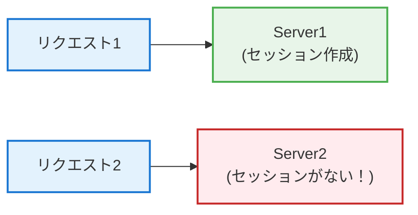

### 解決策1: スティッキーセッション

```nginx
upstream backend {
    ip_hash;  # 同じIPは同じサーバーへ
    server server1.example.com;
    server server2.example.com;
}
```

または Cookie ベース:

```nginx
upstream backend {
    server server1.example.com;
    server server2.example.com;
    sticky cookie srv_id expires=1h;
}
```

**メリット**: 実装が簡単
**デメリット**:
- サーバーがダウンするとセッションが消える
- 負荷が偏る可能性
- スケールしにくい

### 解決策2: 外部セッションストア

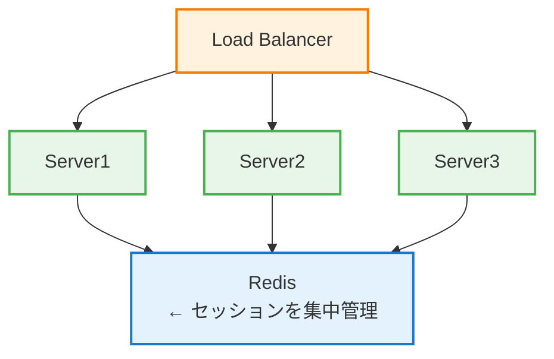

```python
# Python + Flask + Redis Sessions
from flask import Flask
from flask_session import Session
import redis

app = Flask(__name__)
app.config['SESSION_TYPE'] = 'redis'
app.config['SESSION_REDIS'] = redis.from_url('redis://localhost:6379')
Session(app)

# どのサーバーでも同じセッションにアクセス可能
@app.route('/login', methods=['POST'])
def login():
    session['user_id'] = request.form['user_id']
    return 'Logged in'
```

**メリット**: サーバー間でセッション共有、スケールしやすい
**デメリット**: Redisが単一障害点になりうる（クラスタ化で対応）

### 解決策3: ステートレス設計（JWT）

```
クライアント → [JWT in Header] → サーバー
                ↑
         署名を検証するだけ
         セッションストア不要
```

```python
import jwt

# ログイン時にJWTを発行
@app.route('/login', methods=['POST'])
def login():
    user = authenticate(request.form)
    token = jwt.encode(
        {'user_id': user.id, 'exp': datetime.utcnow() + timedelta(hours=24)},
        SECRET_KEY,
        algorithm='HS256'
    )
    return jsonify({'token': token})

# リクエスト時にJWTを検証
@app.before_request
def verify_token():
    token = request.headers.get('Authorization', '').replace('Bearer ', '')
    try:
        payload = jwt.decode(token, SECRET_KEY, algorithms=['HS256'])
        g.user_id = payload['user_id']
    except jwt.InvalidTokenError:
        return 'Unauthorized', 401
```

**メリット**: 完全にステートレス、セッションストア不要
**デメリット**: トークンの無効化が難しい

---

## 【実務】高可用性構成

### LBの冗長化

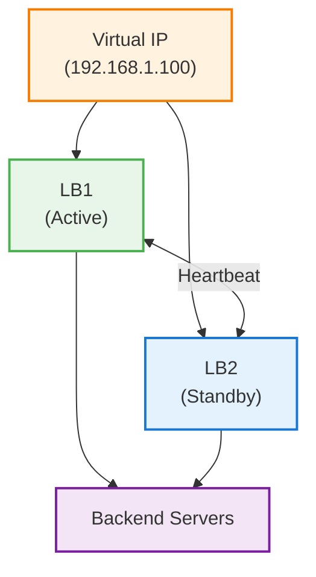

### Keepalivedによる冗長化

```conf
# /etc/keepalived/keepalived.conf (Master)
vrrp_instance VI_1 {
    state MASTER
    interface eth0
    virtual_router_id 51
    priority 100
    advert_int 1

    authentication {
        auth_type PASS
        auth_pass secret
    }

    virtual_ipaddress {
        192.168.1.100
    }

    track_script {
        chk_nginx
    }
}

vrrp_script chk_nginx {
    script "/usr/bin/pgrep nginx"
    interval 2
    weight 2
}
```

```conf
# /etc/keepalived/keepalived.conf (Backup)
vrrp_instance VI_1 {
    state BACKUP
    interface eth0
    virtual_router_id 51
    priority 99  # Masterより低い
    advert_int 1

    authentication {
        auth_type PASS
        auth_pass secret
    }

    virtual_ipaddress {
        192.168.1.100
    }
}
```

### AWSでの高可用性

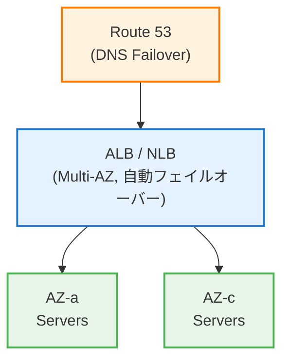

AWSのALB/NLBは、複数AZにまたがって自動的に冗長化される。

---

## 実務チェックリスト

### 設計時

- [ ] L4とL7、どちらが適切か検討したか
- [ ] アルゴリズムの選択は適切か
- [ ] セッション管理の方法は決まっているか
- [ ] LBの冗長化は考慮されているか

### ヘルスチェック

- [ ] ヘルスチェックエンドポイントは実装されているか
- [ ] チェック間隔とタイムアウトは適切か
- [ ] グレースフルシャットダウンは実装されているか
- [ ] Deep/Shallowの使い分けは適切か

### セキュリティ

- [ ] SSL終端の場所は適切か
- [ ] セキュリティグループ/ファイアウォールは設定されているか
- [ ] アクセスログは取れているか

### 運用

- [ ] メトリクス（接続数、レイテンシ、エラー率）は監視されているか
- [ ] アラートは設定されているか
- [ ] 負荷テストは実施したか

---

## まとめ

ロードバランサーの本質は、**トラフィックの分散と可用性の向上**だ。

### 使い分け

| 要件 | 選択 |
|------|------|
| 高スループット、シンプル | L4（NLB, HAProxy TCP mode） |
| パスルーティング、SSL終端 | L7（ALB, Nginx, HAProxy HTTP mode） |

### アルゴリズム

| 要件 | アルゴリズム |
|------|-------------|
| シンプル、均一性能 | Round Robin |
| 性能差あり | Weighted Round Robin |
| 処理時間にばらつき | Least Connections |
| セッション維持 | IP Hash / Sticky Session |

### セッション管理

| 要件 | 方法 |
|------|------|
| シンプル | Sticky Session |
| スケーラブル | 外部セッションストア（Redis） |
| 完全ステートレス | JWT |

「とりあえずALB」ではなく、**要件に合った選択**をしよう。

それが、スケールする設計の第一歩だ。
