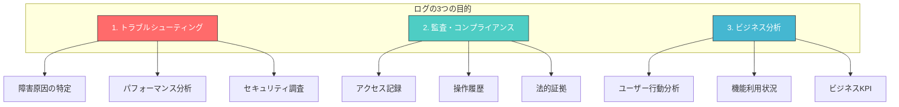
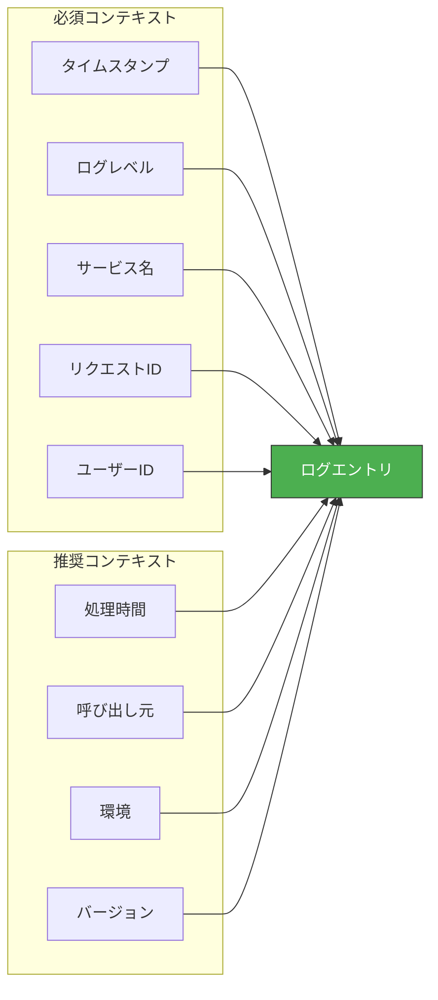
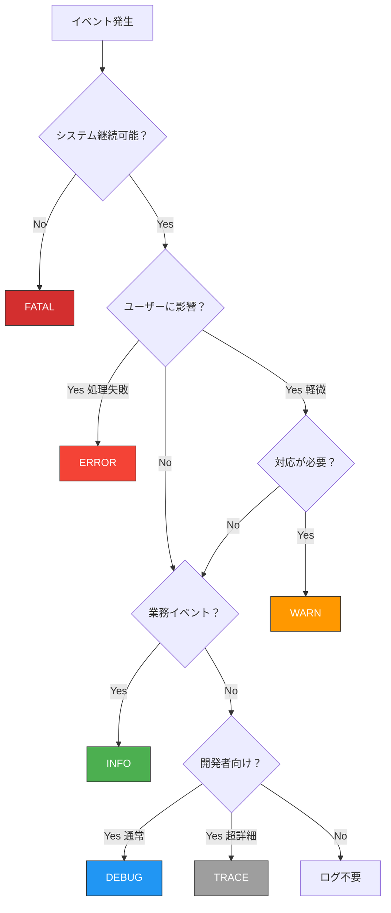
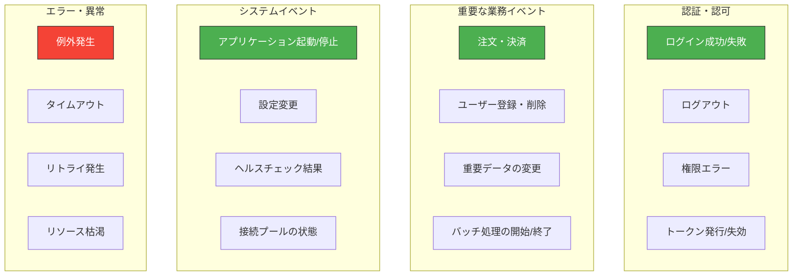
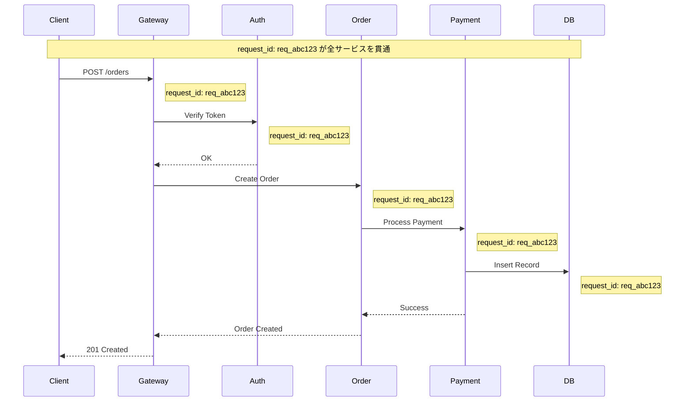
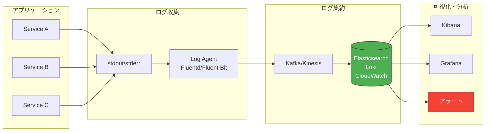
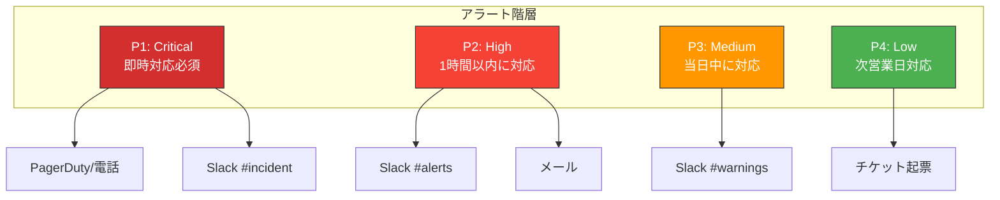
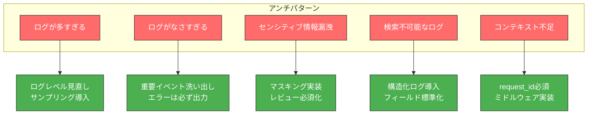

## TL;DR（忙しい人向けまとめ）

```
┌─────────────────────────────────────────────────────────────────┐
│  ログ設計の黄金律                                                │
├─────────────────────────────────────────────────────────────────┤
│  1. 構造化ログ（JSON）を使え                                     │
│  2. リクエストIDで追跡可能にしろ                                 │
│  3. 機密情報は絶対に出すな                                       │
│  4. ログレベルを正しく使い分けろ                                 │
│  5. 「後で調査に必要な情報」を意識しろ                           │
└─────────────────────────────────────────────────────────────────┘
```

### ログレベル早見表

| レベル | 使いどころ | 本番で出す？ | 例 |
|:---|:---|:---:|:---|
| **FATAL** | システム停止レベル | ✅ | DB接続不可、メモリ枯渇 |
| **ERROR** | 処理失敗（要対応） | ✅ | API呼び出し失敗、例外発生 |
| **WARN** | 異常だが継続可能 | ✅ | リトライ発生、deprecated使用 |
| **INFO** | 正常な業務イベント | ✅ | ユーザーログイン、注文完了 |
| **DEBUG** | 開発用詳細情報 | ❌ | 変数の値、処理ステップ |
| **TRACE** | 最詳細トレース | ❌ | ループ内の値、全メソッド呼び出し |

### 出すべき情報 vs 出してはいけない情報

| ✅ 出すべき | ❌ 絶対NG |
|:---|:---|
| リクエストID | パスワード |
| ユーザーID（匿名化） | クレジットカード番号 |
| 処理時間 | APIキー・トークン |
| エラーコード・メッセージ | 個人情報（氏名・住所・電話） |
| HTTPステータス | セッションID（フル） |
| 呼び出し元IP | 医療・金融情報 |

---

## はじめに：なぜログ設計が重要なのか

深夜3時、あなたの携帯が鳴る。

「本番環境で障害が発生しています。至急対応をお願いします。」

眠い目をこすりながらログを確認する。すると——

**パターンA：地獄**
```
Error occurred
Something went wrong
Process failed
null
```

**パターンB：天国**
```json
{
  "timestamp": "2025-01-15T03:15:23.456Z",
  "level": "ERROR",
  "request_id": "req_abc123",
  "user_id": "usr_789",
  "service": "payment-service",
  "message": "Payment processing failed",
  "error_code": "CARD_DECLINED",
  "amount": 5000,
  "currency": "JPY",
  "retry_count": 2,
  "duration_ms": 1523,
  "stack_trace": "PaymentError: Card declined at processPayment..."
}
```

**どちらのログで障害対応したいですか？**

この記事では、「パターンB」のような**本当に役立つログ**を設計するための完全ガイドを提供します。

---

## 第1章：ログの基本設計思想

### 1.1 ログの3つの目的



### 1.2 ログ設計の原則

#### 原則1：「後で調査する自分」を想像する

```
❌ 悪い例：書いた時点の自分しか考えていない
logger.error("failed")

✅ 良い例：深夜3時の寝ぼけた自分でも分かる
logger.error("Payment failed", {
  request_id: "req_abc123",
  user_id: "usr_789",
  error_code: "CARD_DECLINED",
  amount: 5000
})
```

#### 原則2：「検索可能性」を意識する

```
❌ 悪い例：検索しづらい
logger.info("User " + userId + " logged in at " + time)
// → "User usr_123 logged in at 2025-01-15T10:00:00Z"

✅ 良い例：構造化されていて検索しやすい
logger.info("User logged in", { user_id: userId, timestamp: time })
// → {"message":"User logged in","user_id":"usr_123","timestamp":"2025-01-15T10:00:00Z"}
```

#### 原則3：「コンテキスト」を常に含める



---

## 第2章：ログレベル設計

### 2.1 各ログレベルの正しい使い方

#### FATAL / CRITICAL

**定義**: システムが継続不能な致命的エラー

```python
# ✅ 正しい使用例
logger.fatal("Database connection pool exhausted - system shutdown required", {
    "pool_size": 100,
    "active_connections": 100,
    "waiting_requests": 523
})

logger.fatal("Out of memory - cannot allocate buffer", {
    "requested_bytes": 1073741824,
    "available_bytes": 0
})
```

**FATALを出すべき場面**:
- データベース接続が完全に不可能
- 必須の設定ファイルが読めない
- メモリ枯渇でプロセス継続不能
- 致命的なデータ破損を検知

#### ERROR

**定義**: 処理が失敗し、ユーザーに影響がある状態

```python
# ✅ 正しい使用例
logger.error("Payment processing failed", {
    "request_id": "req_abc123",
    "user_id": "usr_789",
    "error_code": "CARD_DECLINED",
    "amount": 5000,
    "retry_count": 3,
    "will_retry": False
})

# ❌ 間違った使用例（WARNにすべき）
logger.error("Cache miss")  # これはエラーではない
logger.error("Retrying request")  # リトライ自体は正常な動作
```

#### WARN

**定義**: 異常だが処理は継続できる状態

```python
# ✅ 正しい使用例
logger.warn("API rate limit approaching", {
    "current_rate": 950,
    "limit": 1000,
    "reset_at": "2025-01-15T11:00:00Z"
})

logger.warn("Deprecated API endpoint called", {
    "endpoint": "/api/v1/users",
    "recommended": "/api/v2/users",
    "sunset_date": "2025-06-01"
})

logger.warn("Retry succeeded after temporary failure", {
    "request_id": "req_abc123",
    "retry_count": 2,
    "total_duration_ms": 3500
})
```

#### INFO

**定義**: 正常な業務イベントの記録

```python
# ✅ 正しい使用例
logger.info("User logged in", {
    "user_id": "usr_789",
    "login_method": "oauth",
    "ip_address": "203.0.113.50"
})

logger.info("Order completed", {
    "order_id": "ord_456",
    "user_id": "usr_789",
    "total_amount": 15000,
    "items_count": 3
})

logger.info("Batch job completed", {
    "job_name": "daily_report",
    "processed_records": 50000,
    "duration_seconds": 120
})
```

#### DEBUG

**定義**: 開発・デバッグ用の詳細情報（本番では通常OFF）

```python
# ✅ 正しい使用例
logger.debug("Processing request payload", {
    "request_id": "req_abc123",
    "payload_size": 1024,
    "content_type": "application/json"
})

logger.debug("Database query executed", {
    "query": "SELECT * FROM users WHERE id = ?",
    "params": ["usr_789"],
    "rows_returned": 1,
    "duration_ms": 5
})
```

#### TRACE

**定義**: 最も詳細なトレース（パフォーマンスに影響あり）

```python
# ✅ 正しい使用例（ほぼ使わない）
logger.trace("Entering function", {"function": "processPayment", "args": {...}})
logger.trace("Loop iteration", {"index": 5, "value": "..."})
logger.trace("Exiting function", {"function": "processPayment", "result": "..."})
```

### 2.2 ログレベル判断フローチャート



### 2.3 環境別ログレベル設定

| 環境 | 推奨レベル | 理由 |
|:---|:---|:---|
| 開発（local） | DEBUG | 開発効率優先 |
| ステージング | DEBUG | 本番相当のテスト |
| 本番 | INFO | ノイズ削減 + コスト |
| 本番（障害時） | DEBUG | 一時的に詳細化 |

```yaml
# 環境変数で制御する例
# config.yaml
logging:
  level: ${LOG_LEVEL:-INFO}
  format: json

# 本番
LOG_LEVEL=INFO

# 障害調査時（一時的）
LOG_LEVEL=DEBUG
```

---

## 第3章：構造化ログの設計

### 3.1 なぜ構造化ログなのか

```mermaid
graph LR
    subgraph "非構造化ログ"
        A1["2025-01-15 10:00:00 ERROR Payment failed for user usr_789 amount 5000"]
    end

    subgraph "構造化ログ（JSON）"
        B1["{timestamp, level, message, user_id, amount}"]
    end

    A1 -->|正規表現で<br/>パース必要| Parse1[解析困難]
    B1 -->|JSONパース| Parse2[即座に検索可能]

    Parse1 --> Search1["grep 'usr_789' | awk '{print $8}'"]
    Parse2 --> Search2["jq '.user_id == \"usr_789\"'"]

    style Parse1 fill:#ff6b6b,stroke:#333,color:#fff
    style Parse2 fill:#4caf50,stroke:#333,color:#fff
```

### 3.2 構造化ログのスキーマ設計

#### 基本スキーマ

```json
{
  // === 必須フィールド ===
  "timestamp": "2025-01-15T10:00:00.123Z",  // ISO 8601形式
  "level": "INFO",                            // ログレベル
  "message": "User logged in",                // 人間が読むメッセージ

  // === トレーシング ===
  "request_id": "req_abc123",                 // リクエスト追跡ID
  "trace_id": "trace_xyz789",                 // 分散トレーシングID
  "span_id": "span_456",                      // スパンID

  // === コンテキスト ===
  "service": "auth-service",                  // サービス名
  "version": "1.2.3",                         // アプリバージョン
  "environment": "production",                // 環境
  "host": "auth-service-pod-abc",             // ホスト名

  // === ビジネスコンテキスト ===
  "user_id": "usr_789",                       // ユーザーID
  "tenant_id": "tenant_001",                  // テナントID（マルチテナント）

  // === パフォーマンス ===
  "duration_ms": 150,                         // 処理時間

  // === エラー情報（エラー時のみ） ===
  "error": {
    "code": "AUTH_FAILED",
    "message": "Invalid credentials",
    "stack_trace": "..."
  },

  // === 追加データ ===
  "metadata": {
    "login_method": "oauth",
    "ip_address": "203.0.113.50"
  }
}
```

#### イベント別スキーマ例

**HTTPリクエストログ**:
```json
{
  "timestamp": "2025-01-15T10:00:00.123Z",
  "level": "INFO",
  "message": "HTTP request completed",
  "request_id": "req_abc123",
  "http": {
    "method": "POST",
    "path": "/api/v1/orders",
    "status_code": 201,
    "request_size_bytes": 1024,
    "response_size_bytes": 256,
    "duration_ms": 150,
    "user_agent": "Mozilla/5.0...",
    "referer": "https://example.com/cart"
  },
  "client": {
    "ip": "203.0.113.50",
    "country": "JP"
  },
  "user_id": "usr_789"
}
```

**データベースクエリログ**:
```json
{
  "timestamp": "2025-01-15T10:00:00.123Z",
  "level": "DEBUG",
  "message": "Database query executed",
  "request_id": "req_abc123",
  "database": {
    "type": "mysql",
    "host": "db-primary.internal",
    "database": "orders",
    "query_type": "SELECT",
    "table": "orders",
    "rows_examined": 1000,
    "rows_returned": 10,
    "duration_ms": 45
  }
}
```

**外部API呼び出しログ**:
```json
{
  "timestamp": "2025-01-15T10:00:00.123Z",
  "level": "INFO",
  "message": "External API call completed",
  "request_id": "req_abc123",
  "external_api": {
    "service": "payment-gateway",
    "endpoint": "POST /v1/charges",
    "status_code": 200,
    "duration_ms": 1200,
    "retry_count": 0
  }
}
```

### 3.3 フィールド命名規則

| 規則 | 例 | 理由 |
|:---|:---|:---|
| snake_case | `user_id`, `request_id` | JSON標準、検索しやすい |
| 単位を接尾辞に | `duration_ms`, `size_bytes` | 曖昧さを排除 |
| 動詞は過去形 | `created_at`, `processed` | イベント発生時点を表す |
| ネストは2階層まで | `http.status_code` | 深すぎると検索困難 |

```javascript
// ✅ 良い例
{
  "duration_ms": 150,           // 単位明確
  "request_size_bytes": 1024,   // 単位明確
  "created_at": "2025-01-15...", // 過去形
  "http": {
    "status_code": 200          // 2階層以内
  }
}

// ❌ 悪い例
{
  "duration": 150,              // ms? s? 不明
  "size": 1024,                 // bytes? KB? 不明
  "time": "2025-01-15...",      // 何の時間？
  "data": {
    "http": {
      "response": {
        "status": {
          "code": 200           // 深すぎる
        }
      }
    }
  }
}
```

---

## 第4章：何をログに出すか

### 4.1 必ずログに出すべきイベント



#### 認証・認可イベント

```python
# ログイン成功
logger.info("User login successful", {
    "user_id": user.id,
    "login_method": "password",
    "ip_address": request.remote_addr,
    "user_agent": request.user_agent
})

# ログイン失敗（重要：攻撃検知に使用）
logger.warn("User login failed", {
    "username": username,  # user_idは不明なのでusername
    "reason": "invalid_password",
    "ip_address": request.remote_addr,
    "attempt_count": get_attempt_count(username)
})

# 権限エラー
logger.warn("Authorization denied", {
    "user_id": user.id,
    "resource": "/admin/users",
    "required_role": "admin",
    "user_role": "member"
})
```

#### 業務イベント

```python
# 注文完了
logger.info("Order completed", {
    "order_id": order.id,
    "user_id": user.id,
    "total_amount": order.total,
    "items_count": len(order.items),
    "payment_method": order.payment_method
})

# 決済処理
logger.info("Payment processed", {
    "payment_id": payment.id,
    "order_id": order.id,
    "amount": payment.amount,
    "currency": "JPY",
    "status": "success",
    "gateway": "stripe",
    "duration_ms": elapsed_time
})
```

### 4.2 絶対にログに出してはいけない情報

```
┌─────────────────────────────────────────────────────────────────┐
│  ⚠️ 絶対NG：ログに出すと法的責任を問われる可能性あり            │
├─────────────────────────────────────────────────────────────────┤
│  ・パスワード（平文・ハッシュ含む）                             │
│  ・クレジットカード番号（PCI DSS違反）                          │
│  ・APIキー・シークレットトークン                                │
│  ・個人情報（氏名・住所・電話番号・メールアドレス）             │
│  ・マイナンバー・社会保障番号                                   │
│  ・医療情報・健康情報                                           │
│  ・金融口座情報                                                 │
│  ・セッションID（フル）                                         │
└─────────────────────────────────────────────────────────────────┘
```

#### マスキング・匿名化の実装

```python
import re
import hashlib

class LogSanitizer:
    """ログ出力前にセンシティブ情報をマスク"""

    PATTERNS = {
        'credit_card': r'\b\d{4}[-\s]?\d{4}[-\s]?\d{4}[-\s]?\d{4}\b',
        'email': r'\b[A-Za-z0-9._%+-]+@[A-Za-z0-9.-]+\.[A-Z|a-z]{2,}\b',
        'phone': r'\b0\d{1,4}[-\s]?\d{1,4}[-\s]?\d{4}\b',
        'password': r'(?i)(password|passwd|pwd)["\s:=]+[^\s,}]+',
        'api_key': r'(?i)(api[_-]?key|secret|token)["\s:=]+[^\s,}]+',
    }

    @classmethod
    def sanitize(cls, data: dict) -> dict:
        """辞書内のセンシティブ情報をマスク"""
        sanitized = {}
        for key, value in data.items():
            if cls._is_sensitive_key(key):
                sanitized[key] = "***REDACTED***"
            elif isinstance(value, str):
                sanitized[key] = cls._mask_patterns(value)
            elif isinstance(value, dict):
                sanitized[key] = cls.sanitize(value)
            else:
                sanitized[key] = value
        return sanitized

    @classmethod
    def _is_sensitive_key(cls, key: str) -> bool:
        sensitive_keys = {'password', 'passwd', 'pwd', 'secret',
                          'token', 'api_key', 'credit_card', 'ssn'}
        return key.lower() in sensitive_keys

    @classmethod
    def _mask_patterns(cls, text: str) -> str:
        for pattern_name, pattern in cls.PATTERNS.items():
            text = re.sub(pattern, f'***{pattern_name.upper()}_REDACTED***', text)
        return text

    @classmethod
    def hash_pii(cls, value: str) -> str:
        """個人情報をハッシュ化（検索可能性を維持）"""
        return hashlib.sha256(value.encode()).hexdigest()[:16]

# 使用例
log_data = {
    "user_id": "usr_123",
    "email": "user@example.com",
    "password": "secret123",
    "message": "User with card 4111-1111-1111-1111 logged in"
}

sanitized = LogSanitizer.sanitize(log_data)
# {
#   "user_id": "usr_123",
#   "email": "***EMAIL_REDACTED***",
#   "password": "***REDACTED***",
#   "message": "User with card ***CREDIT_CARD_REDACTED*** logged in"
# }
```

### 4.3 リクエストIDによる追跡



#### リクエストID実装例

```python
# Flask での実装例
import uuid
from flask import Flask, g, request
from functools import wraps

app = Flask(__name__)

@app.before_request
def set_request_id():
    """リクエストIDを設定（ヘッダーから取得 or 生成）"""
    request_id = request.headers.get('X-Request-ID')
    if not request_id:
        request_id = f"req_{uuid.uuid4().hex[:12]}"
    g.request_id = request_id

@app.after_request
def add_request_id_header(response):
    """レスポンスにリクエストIDを含める"""
    response.headers['X-Request-ID'] = g.request_id
    return response

# ロガーにリクエストIDを自動付与
class RequestContextFilter(logging.Filter):
    def filter(self, record):
        record.request_id = getattr(g, 'request_id', 'no-request-id')
        return True
```

```go
// Go での実装例
package middleware

import (
    "context"
    "github.com/google/uuid"
    "net/http"
)

type contextKey string
const RequestIDKey contextKey = "request_id"

func RequestIDMiddleware(next http.Handler) http.Handler {
    return http.HandlerFunc(func(w http.ResponseWriter, r *http.Request) {
        requestID := r.Header.Get("X-Request-ID")
        if requestID == "" {
            requestID = "req_" + uuid.New().String()[:12]
        }

        ctx := context.WithValue(r.Context(), RequestIDKey, requestID)
        w.Header().Set("X-Request-ID", requestID)
        next.ServeHTTP(w, r.WithContext(ctx))
    })
}

func GetRequestID(ctx context.Context) string {
    if id, ok := ctx.Value(RequestIDKey).(string); ok {
        return id
    }
    return "unknown"
}
```

---

## 第5章：ログの出力先と収集

### 5.1 ログ出力アーキテクチャ



### 5.2 コンテナ環境でのログ出力

**原則**: コンテナでは**stdout/stderr**に出力する

```dockerfile
# ❌ 悪い例：コンテナ内にファイル出力
RUN mkdir -p /var/log/app
CMD ["./app", "--log-file=/var/log/app/app.log"]

# ✅ 良い例：stdout/stderrに出力
CMD ["./app", "--log-output=stdout"]
```

```yaml
# docker-compose.yml
services:
  app:
    image: myapp:latest
    logging:
      driver: "json-file"
      options:
        max-size: "10m"
        max-file: "3"

  # Fluent Bit でログ収集
  fluent-bit:
    image: fluent/fluent-bit:latest
    volumes:
      - /var/lib/docker/containers:/var/lib/docker/containers:ro
```

### 5.3 主要なログ収集スタック

#### ELK Stack (Elasticsearch + Logstash + Kibana)

```yaml
# logstash.conf
input {
  beats {
    port => 5044
  }
}

filter {
  json {
    source => "message"
  }

  date {
    match => ["timestamp", "ISO8601"]
    target => "@timestamp"
  }

  # センシティブ情報のマスク
  mutate {
    gsub => [
      "message", "\b\d{4}[-\s]?\d{4}[-\s]?\d{4}[-\s]?\d{4}\b", "****-****-****-****"
    ]
  }
}

output {
  elasticsearch {
    hosts => ["elasticsearch:9200"]
    index => "logs-%{[service]}-%{+YYYY.MM.dd}"
  }
}
```

#### Loki + Grafana（軽量な選択肢）

```yaml
# promtail-config.yaml
server:
  http_listen_port: 9080

positions:
  filename: /tmp/positions.yaml

clients:
  - url: http://loki:3100/loki/api/v1/push

scrape_configs:
  - job_name: containers
    static_configs:
      - targets:
          - localhost
        labels:
          job: containerlogs
          __path__: /var/lib/docker/containers/*/*log

    pipeline_stages:
      - json:
          expressions:
            output: log
            stream: stream
      - json:
          source: output
          expressions:
            level: level
            service: service
            request_id: request_id
      - labels:
          level:
          service:
```

#### AWS CloudWatch Logs

```python
# Python + boto3 での直接送信
import boto3
import json
import time

class CloudWatchLogger:
    def __init__(self, log_group: str, log_stream: str):
        self.client = boto3.client('logs')
        self.log_group = log_group
        self.log_stream = log_stream
        self.sequence_token = None

    def log(self, level: str, message: str, **kwargs):
        log_event = {
            "timestamp": int(time.time() * 1000),
            "level": level,
            "message": message,
            **kwargs
        }

        params = {
            'logGroupName': self.log_group,
            'logStreamName': self.log_stream,
            'logEvents': [{
                'timestamp': log_event['timestamp'],
                'message': json.dumps(log_event)
            }]
        }

        if self.sequence_token:
            params['sequenceToken'] = self.sequence_token

        response = self.client.put_log_events(**params)
        self.sequence_token = response.get('nextSequenceToken')
```

### 5.4 ログ保持期間の設計

| ログ種別 | 保持期間 | 理由 |
|:---|:---:|:---|
| アクセスログ | 90日 | 通常調査に十分 |
| エラーログ | 180日 | 長期的な傾向分析 |
| 監査ログ | 7年 | 法的要件（業種による） |
| デバッグログ | 7日 | 容量削減 |
| セキュリティログ | 1年 | インシデント調査 |

```yaml
# Elasticsearch ILM (Index Lifecycle Management)
PUT _ilm/policy/logs_policy
{
  "policy": {
    "phases": {
      "hot": {
        "min_age": "0ms",
        "actions": {
          "rollover": {
            "max_size": "50GB",
            "max_age": "1d"
          }
        }
      },
      "warm": {
        "min_age": "7d",
        "actions": {
          "shrink": { "number_of_shards": 1 },
          "forcemerge": { "max_num_segments": 1 }
        }
      },
      "cold": {
        "min_age": "30d",
        "actions": {
          "freeze": {}
        }
      },
      "delete": {
        "min_age": "90d",
        "actions": {
          "delete": {}
        }
      }
    }
  }
}
```

---

## 第6章：アラート設計

### 6.1 アラートの階層設計



### 6.2 アラート条件の設計

#### 良いアラート vs 悪いアラート

```yaml
# ❌ 悪いアラート：ノイズが多い
- alert: ErrorLogDetected
  expr: count(log_level="error") > 0
  for: 0m
  # 1件のエラーでも発報 → オオカミ少年化

# ✅ 良いアラート：本当に対応が必要な時だけ
- alert: HighErrorRate
  expr: |
    (
      sum(rate(http_requests_total{status=~"5.."}[5m]))
      /
      sum(rate(http_requests_total[5m]))
    ) > 0.05
  for: 5m
  labels:
    severity: critical
  annotations:
    summary: "Error rate above 5% for 5 minutes"
    description: "Service {{ $labels.service }} has {{ $value | humanizePercentage }} error rate"
```

#### 推奨アラート条件

| メトリクス | 閾値 | 重要度 | 対応 |
|:---|:---|:---:|:---|
| エラー率 | > 5% (5分間) | Critical | 即時 |
| エラー率 | > 1% (5分間) | Warning | 確認 |
| レイテンシ P99 | > 3秒 (5分間) | Critical | 即時 |
| レイテンシ P99 | > 1秒 (5分間) | Warning | 確認 |
| 5xx エラー数 | > 100/分 | Critical | 即時 |
| ログイン失敗 | > 50/分 (同一IP) | Critical | セキュリティ |
| DB接続プール | > 80% 使用 | Warning | 確認 |
| ディスク使用率 | > 85% | Warning | 確認 |
| ディスク使用率 | > 95% | Critical | 即時 |

### 6.3 アラートの実装例

#### Prometheus Alertmanager

```yaml
# alertmanager.yml
global:
  slack_api_url: 'https://hooks.slack.com/services/xxx'

route:
  receiver: 'slack-default'
  group_by: ['alertname', 'service']
  group_wait: 30s
  group_interval: 5m
  repeat_interval: 4h

  routes:
    - match:
        severity: critical
      receiver: 'pagerduty-critical'
      continue: true
    - match:
        severity: critical
      receiver: 'slack-critical'

receivers:
  - name: 'slack-default'
    slack_configs:
      - channel: '#alerts'
        title: '{{ .Status | toUpper }}: {{ .CommonLabels.alertname }}'
        text: '{{ range .Alerts }}{{ .Annotations.description }}{{ end }}'

  - name: 'slack-critical'
    slack_configs:
      - channel: '#incident'
        title: '🚨 CRITICAL: {{ .CommonLabels.alertname }}'
        color: 'danger'

  - name: 'pagerduty-critical'
    pagerduty_configs:
      - service_key: 'xxxxx'
```

#### Grafana Loki アラート

```yaml
# loki-rules.yaml
groups:
  - name: application-errors
    rules:
      - alert: HighErrorLogRate
        expr: |
          sum(rate({job="app"} |= "level=ERROR" [5m])) by (service)
          /
          sum(rate({job="app"} [5m])) by (service)
          > 0.05
        for: 5m
        labels:
          severity: critical
        annotations:
          summary: "High error rate in {{ $labels.service }}"

      - alert: PaymentFailures
        expr: |
          sum(rate({job="app", service="payment"}
            |= "Payment processing failed" [5m])) > 10
        for: 2m
        labels:
          severity: critical
        annotations:
          summary: "Payment failures exceeding threshold"

      - alert: SuspiciousLoginActivity
        expr: |
          sum(rate({job="app"}
            |= "login failed"
            | json
            | ip_address != "" [5m])) by (ip_address) > 50
        for: 1m
        labels:
          severity: critical
        annotations:
          summary: "Possible brute force attack from {{ $labels.ip_address }}"
```

---

## 第7章：言語別実装ガイド

### 7.1 Python

```python
import logging
import json
import sys
from datetime import datetime
from typing import Any
from flask import g, has_request_context

class JSONFormatter(logging.Formatter):
    """構造化ログ用JSONフォーマッター"""

    def format(self, record: logging.LogRecord) -> str:
        log_data = {
            "timestamp": datetime.utcnow().isoformat() + "Z",
            "level": record.levelname,
            "message": record.getMessage(),
            "logger": record.name,
            "module": record.module,
            "function": record.funcName,
            "line": record.lineno,
        }

        # リクエストコンテキストがあれば追加
        if has_request_context():
            log_data["request_id"] = getattr(g, 'request_id', None)
            log_data["user_id"] = getattr(g, 'user_id', None)

        # 追加フィールド
        if hasattr(record, 'extra_fields'):
            log_data.update(record.extra_fields)

        # 例外情報
        if record.exc_info:
            log_data["exception"] = self.formatException(record.exc_info)

        return json.dumps(log_data, ensure_ascii=False, default=str)


class StructuredLogger:
    """構造化ログを簡単に出力するラッパー"""

    def __init__(self, name: str):
        self.logger = logging.getLogger(name)
        self.logger.setLevel(logging.DEBUG)

        handler = logging.StreamHandler(sys.stdout)
        handler.setFormatter(JSONFormatter())
        self.logger.addHandler(handler)

    def _log(self, level: int, message: str, **kwargs: Any):
        extra = {'extra_fields': kwargs} if kwargs else {}
        self.logger.log(level, message, extra=extra)

    def debug(self, message: str, **kwargs): self._log(logging.DEBUG, message, **kwargs)
    def info(self, message: str, **kwargs): self._log(logging.INFO, message, **kwargs)
    def warn(self, message: str, **kwargs): self._log(logging.WARNING, message, **kwargs)
    def error(self, message: str, **kwargs): self._log(logging.ERROR, message, **kwargs)
    def critical(self, message: str, **kwargs): self._log(logging.CRITICAL, message, **kwargs)


# 使用例
logger = StructuredLogger(__name__)

logger.info("User logged in",
    user_id="usr_123",
    login_method="oauth",
    ip_address="203.0.113.50"
)

logger.error("Payment failed",
    order_id="ord_456",
    error_code="CARD_DECLINED",
    amount=5000,
    duration_ms=1500
)
```

### 7.2 Node.js / TypeScript

```typescript
import pino from 'pino';
import { v4 as uuidv4 } from 'uuid';
import { AsyncLocalStorage } from 'async_hooks';

// リクエストコンテキスト用
interface RequestContext {
  requestId: string;
  userId?: string;
}

const asyncLocalStorage = new AsyncLocalStorage<RequestContext>();

// Pinoロガー設定
const logger = pino({
  level: process.env.LOG_LEVEL || 'info',
  formatters: {
    level: (label) => ({ level: label.toUpperCase() }),
  },
  timestamp: () => `,"timestamp":"${new Date().toISOString()}"`,
  base: {
    service: process.env.SERVICE_NAME || 'unknown',
    version: process.env.APP_VERSION || 'unknown',
    environment: process.env.NODE_ENV || 'development',
  },
  mixin: () => {
    const context = asyncLocalStorage.getStore();
    return context ? {
      request_id: context.requestId,
      user_id: context.userId,
    } : {};
  },
});

// Express ミドルウェア
export function requestContextMiddleware(req: any, res: any, next: any) {
  const requestId = req.headers['x-request-id'] || `req_${uuidv4().slice(0, 12)}`;
  res.setHeader('X-Request-ID', requestId);

  const context: RequestContext = {
    requestId,
    userId: req.user?.id,
  };

  asyncLocalStorage.run(context, () => {
    next();
  });
}

// HTTPリクエストログミドルウェア
export function httpLoggerMiddleware(req: any, res: any, next: any) {
  const startTime = Date.now();

  res.on('finish', () => {
    const duration = Date.now() - startTime;

    logger.info({
      message: 'HTTP request completed',
      http: {
        method: req.method,
        path: req.path,
        status_code: res.statusCode,
        duration_ms: duration,
        user_agent: req.headers['user-agent'],
      },
      client: {
        ip: req.ip,
      },
    });
  });

  next();
}

// 使用例
logger.info({ user_id: 'usr_123', action: 'login' }, 'User logged in');

logger.error({
  order_id: 'ord_456',
  error_code: 'CARD_DECLINED',
  amount: 5000,
}, 'Payment failed');
```

### 7.3 Go

```go
package logging

import (
    "context"
    "os"
    "time"

    "go.uber.org/zap"
    "go.uber.org/zap/zapcore"
)

type contextKey string

const (
    RequestIDKey contextKey = "request_id"
    UserIDKey    contextKey = "user_id"
)

var Logger *zap.Logger

func init() {
    config := zap.NewProductionConfig()
    config.EncoderConfig.TimeKey = "timestamp"
    config.EncoderConfig.EncodeTime = zapcore.ISO8601TimeEncoder
    config.EncoderConfig.LevelKey = "level"
    config.EncoderConfig.EncodeLevel = zapcore.CapitalLevelEncoder

    // 追加フィールド
    config.InitialFields = map[string]interface{}{
        "service":     os.Getenv("SERVICE_NAME"),
        "version":     os.Getenv("APP_VERSION"),
        "environment": os.Getenv("ENVIRONMENT"),
    }

    var err error
    Logger, err = config.Build()
    if err != nil {
        panic(err)
    }
}

// コンテキストからフィールドを抽出
func WithContext(ctx context.Context) *zap.Logger {
    fields := []zap.Field{}

    if requestID, ok := ctx.Value(RequestIDKey).(string); ok {
        fields = append(fields, zap.String("request_id", requestID))
    }
    if userID, ok := ctx.Value(UserIDKey).(string); ok {
        fields = append(fields, zap.String("user_id", userID))
    }

    return Logger.With(fields...)
}

// HTTPリクエストログ用ヘルパー
func LogHTTPRequest(ctx context.Context, method, path string, statusCode int, duration time.Duration) {
    WithContext(ctx).Info("HTTP request completed",
        zap.String("http.method", method),
        zap.String("http.path", path),
        zap.Int("http.status_code", statusCode),
        zap.Int64("http.duration_ms", duration.Milliseconds()),
    )
}

// 使用例
func handleLogin(ctx context.Context, userID string) {
    logger := WithContext(ctx)

    logger.Info("User logged in",
        zap.String("user_id", userID),
        zap.String("login_method", "oauth"),
    )
}

func handlePaymentError(ctx context.Context, orderID string, err error) {
    logger := WithContext(ctx)

    logger.Error("Payment failed",
        zap.String("order_id", orderID),
        zap.String("error_code", "CARD_DECLINED"),
        zap.Int("amount", 5000),
        zap.Error(err),
    )
}
```

---

## 第8章：アンチパターンと解決策

### 8.1 よくあるアンチパターン



### 8.2 具体的なアンチパターン集

#### ❌ アンチパターン1：例外を握りつぶす

```python
# ❌ 悪い例
try:
    process_payment(order)
except Exception:
    pass  # 何も起きなかったことに...

# ✅ 良い例
try:
    process_payment(order)
except Exception as e:
    logger.error("Payment processing failed",
        order_id=order.id,
        error_type=type(e).__name__,
        error_message=str(e),
        exc_info=True  # スタックトレースも出力
    )
    raise  # 必要に応じて再送出
```

#### ❌ アンチパターン2：ログが役に立たない

```python
# ❌ 悪い例
logger.error("Error occurred")
logger.info("Processing...")
logger.debug("Done")

# ✅ 良い例
logger.error("Payment gateway timeout",
    gateway="stripe",
    timeout_ms=30000,
    order_id="ord_123",
    retry_count=2
)
logger.info("Order processing started",
    order_id="ord_123",
    items_count=5,
    total_amount=15000
)
logger.debug("Cache lookup completed",
    cache_key="user:123:profile",
    hit=True,
    duration_ms=2
)
```

#### ❌ アンチパターン3：ログイン/ループ内での大量ログ

```python
# ❌ 悪い例：100万回ループで100万行のログ
for item in items:  # 100万件
    logger.debug(f"Processing item {item.id}")
    process(item)

# ✅ 良い例：サマリーログ
logger.info("Batch processing started", total_items=len(items))

processed = 0
errors = 0
for item in items:
    try:
        process(item)
        processed += 1
    except Exception as e:
        errors += 1
        if errors <= 10:  # 最初の10件だけ詳細ログ
            logger.error("Item processing failed",
                item_id=item.id, error=str(e))

    # 進捗は10%ごとに出力
    if processed % (len(items) // 10) == 0:
        logger.info("Batch progress",
            processed=processed,
            total=len(items),
            percent=processed * 100 // len(items))

logger.info("Batch processing completed",
    processed=processed,
    errors=errors,
    duration_seconds=elapsed)
```

#### ❌ アンチパターン4：環境別設定がない

```python
# ❌ 悪い例：どの環境でもDEBUG
logging.basicConfig(level=logging.DEBUG)

# ✅ 良い例：環境変数で制御
import os

LOG_LEVEL = os.getenv('LOG_LEVEL', 'INFO')
logging.basicConfig(level=getattr(logging, LOG_LEVEL))

# 設定ファイル例（config.yaml）
# development:
#   log_level: DEBUG
# staging:
#   log_level: DEBUG
# production:
#   log_level: INFO
```

---

## 第9章：ログ設計チェックリスト

### 9.1 設計時チェックリスト

```
□ ログレベルの定義と使い分けが明確か
□ 構造化ログ（JSON）フォーマットを使用しているか
□ リクエストIDで一連の処理を追跡できるか
□ センシティブ情報のマスキング処理があるか
□ 環境別のログレベル設定ができるか
□ ログの出力先が適切か（stdout/ファイル/サービス）
□ ログの保持期間が定義されているか
□ アラート条件が設計されているか
```

### 9.2 実装時チェックリスト

```
□ 全てのエラーハンドリングでログを出力しているか
□ 重要な業務イベントがログに記録されているか
□ パフォーマンス計測（duration_ms）が含まれているか
□ ログに含まれるフィールドが統一されているか
□ 例外発生時にスタックトレースが出力されているか
□ ログ出力がパフォーマンスに影響していないか
□ ログのテストが実装されているか
```

### 9.3 運用時チェックリスト

```
□ ログが正常に収集・集約されているか
□ ログ検索が実用的な速度で動作するか
□ アラートが適切に発報されているか
□ アラートのノイズが多すぎないか
□ ログ保持期間のポリシーが適用されているか
□ ログストレージのコストが予算内か
□ 障害対応時にログが役立っているか
```

---

## 第10章：まとめと実践へのステップ

### 10.1 ログ設計の優先順位

```
┌─────────────────────────────────────────────────────────────────┐
│  Step 1（今すぐやる）                                           │
│  ・構造化ログ（JSON）への移行                                   │
│  ・リクエストIDの導入                                           │
│  ・センシティブ情報のマスキング                                 │
├─────────────────────────────────────────────────────────────────┤
│  Step 2（1週間以内）                                            │
│  ・ログレベルの見直しと統一                                     │
│  ・重要イベントのログ追加                                       │
│  ・環境別設定の導入                                             │
├─────────────────────────────────────────────────────────────────┤
│  Step 3（1ヶ月以内）                                            │
│  ・ログ収集パイプラインの構築                                   │
│  ・ダッシュボード作成                                           │
│  ・アラート設計                                                 │
├─────────────────────────────────────────────────────────────────┤
│  Step 4（継続的）                                               │
│  ・障害対応でのログ改善                                         │
│  ・コスト最適化                                                 │
│  ・チーム教育                                                   │
└─────────────────────────────────────────────────────────────────┘
```

### 10.2 最終チェックポイント

良いログ設計ができているかの最終確認：

| チェック項目 | 合格基準 |
|:---|:---|
| **追跡性** | request_idで1リクエストの全ログを抽出できる |
| **可読性** | 構造化されており、検索・フィルタが容易 |
| **安全性** | センシティブ情報がマスクされている |
| **実用性** | 障害発生時に原因特定に役立つ |
| **効率性** | ログ量が適切で、コストが管理可能 |
| **即応性** | 重要なエラーはアラートで通知される |

### 10.3 おすすめリソース

**ツール・ライブラリ**:
- Python: [structlog](https://www.structlog.org/)
- Node.js: [pino](https://getpino.io/)
- Go: [zap](https://github.com/uber-go/zap)
- Java: [logback](https://logback.qos.ch/) + [logstash-logback-encoder](https://github.com/logfellow/logstash-logback-encoder)

**ログ集約・分析**:
- [Elasticsearch + Kibana](https://www.elastic.co/)
- [Grafana Loki](https://grafana.com/oss/loki/)
- [Datadog](https://www.datadoghq.com/)
- [AWS CloudWatch Logs](https://aws.amazon.com/cloudwatch/)

**参考資料**:
- [The Twelve-Factor App - Logs](https://12factor.net/logs)
- [Google SRE Book - Chapter 16: Tracking Outages](https://sre.google/sre-book/tracking-outages/)

---

ログは「書いておしまい」ではなく、**「読む時に役立つか」**で価値が決まります。

深夜3時の障害対応で、「ログがあってよかった」と思えるログ設計を目指しましょう。
