## TL;DR（忙しい人向け）

```
┌─────────────────────────────────────────────────────────────────┐
│  Mutagen + Neovim = 最強のリモート開発環境                      │
├─────────────────────────────────────────────────────────────────┤
│  ✅ 定義ジャンプ: 1.2秒 → 0.05秒（24倍高速）                    │
│  ✅ ファイル検索: 4.5秒 → 0.3秒（15倍高速）                     │
│  ✅ リモートCPU負荷: 30% → 1%以下                               │
│  ✅ ネット切断時: 作業継続可能                                   │
└─────────────────────────────────────────────────────────────────┘
```

| 項目 | VSCode Remote SSH | Mutagen + Neovim |
|:---|:---:|:---:|
| ファイルを開く | 0.5〜2秒 | **即座** |
| 定義ジャンプ | 1〜3秒 | **0.05秒** |
| 補完候補表示 | 0.3〜1秒 | **即座** |
| ファイル検索 | 数秒〜十数秒 | **0.3秒** |
| ネットワーク切断時 | 作業不能 | **継続可能** |

---

## はじめに：なぜVSCode Remote SSHは遅いのか

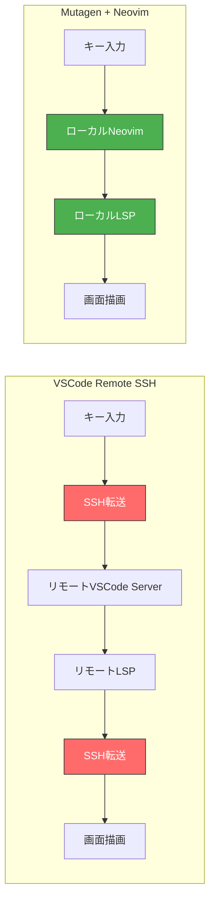

**VSCode Remote SSHは「リモートで全部やる」設計。**

キー入力のたびにSSH往復が発生し、LSPもリモートで動く。ネットワークレイテンシがそのまま操作遅延になる。

**Mutagen + Neovimは「ローカルでやって同期する」設計。**

エディタもLSPもローカルで動く。ファイルはバックグラウンドで同期。操作遅延はゼロ。

---

## 全体アーキテクチャ

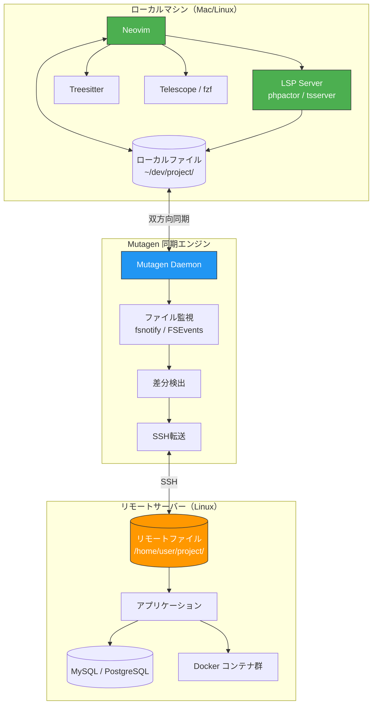

### レイテンシ発生ポイントの比較

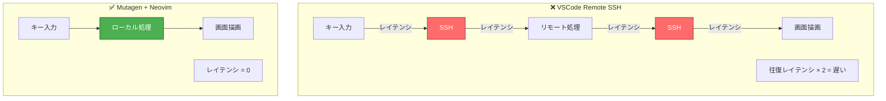

---

## Mutagenの同期メカニズム

### ファイル同期フロー

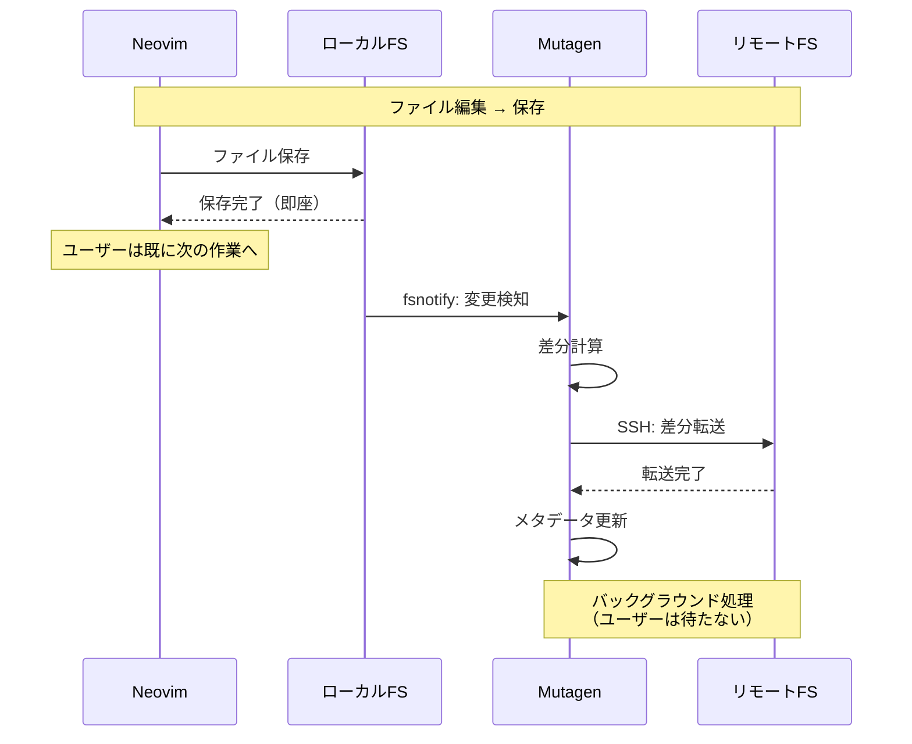

### 双方向同期の仕組み

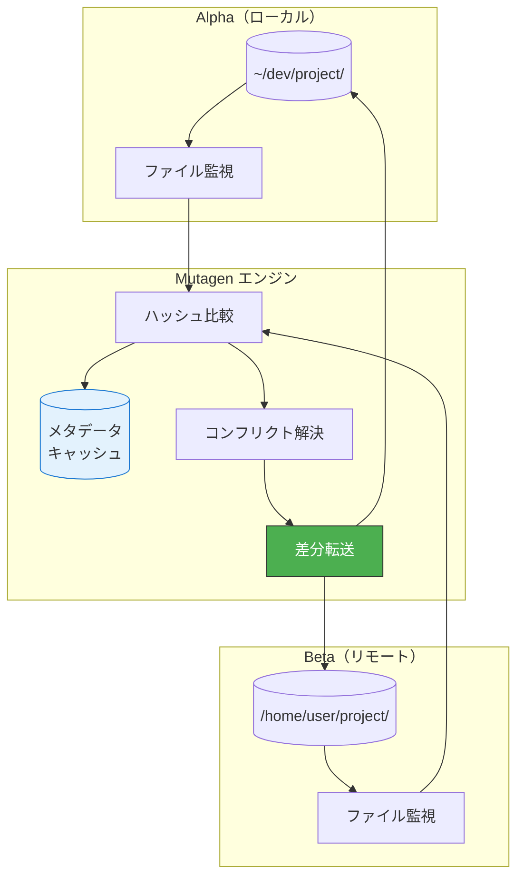

---

## SSHFSとの決定的な違い

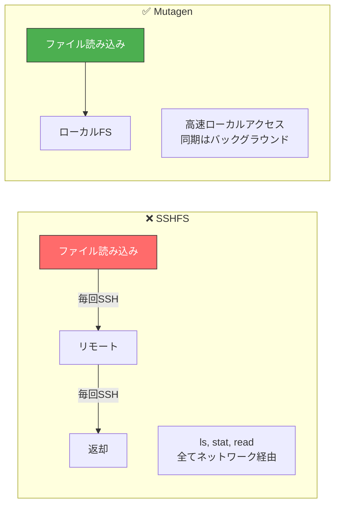

| 項目 | SSHFS | Mutagen |
|:---|:---|:---|
| 動作原理 | FUSEでリモートをマウント | 双方向ファイル同期 |
| ファイル読み込み | 毎回SSH経由 | ローカルから直接 |
| メタデータ取得 | 毎回SSH経由 | ローカルにキャッシュ |
| LSP動作場所 | リモート必須 | ローカルで動作 |
| ネットワーク切断時 | 即死 | ローカルで作業継続 |

**SSHFSは「リモートをローカルに見せかける」だけ。Mutagenは「実際にファイルをコピーして同期する」。**

---

## 実装手順（コピペで完成）

### セットアップフロー

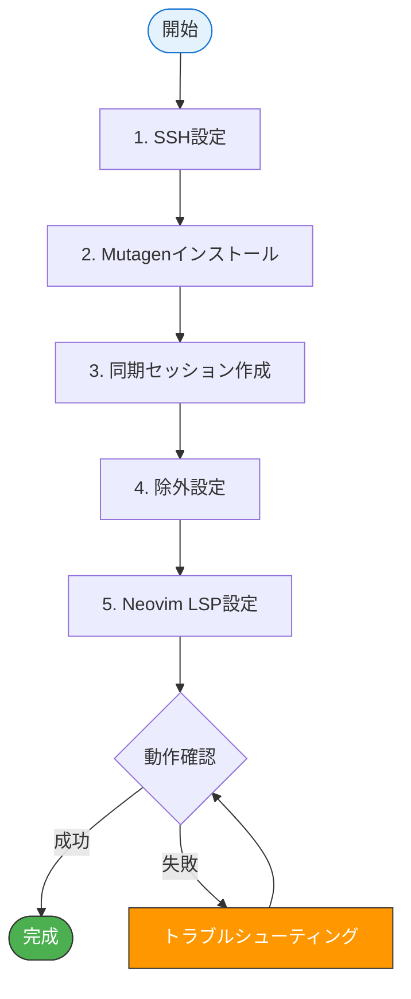

### 1. SSH設定

`~/.ssh/config` に以下を追加：

```ssh
Host devserver
    HostName 192.168.1.100  # リモートサーバーのIP
    User developer
    IdentityFile ~/.ssh/id_ed25519
    # 接続の高速化（重要）
    ControlMaster auto
    ControlPath ~/.ssh/sockets/%r@%h-%p
    ControlPersist 600
    # Keep Alive
    ServerAliveInterval 60
    ServerAliveCountMax 3
```

ソケットディレクトリを作成：

```bash
mkdir -p ~/.ssh/sockets
chmod 700 ~/.ssh/sockets
```

### 2. Mutagenインストール

**macOS（Homebrew）**:

```bash
brew install mutagen-io/mutagen/mutagen
```

**Linux**:

```bash
# 最新バージョンをダウンロード
curl -LO https://github.com/mutagen-io/mutagen/releases/download/v0.18.1/mutagen_linux_amd64_v0.18.1.tar.gz
tar xzf mutagen_linux_amd64_v0.18.1.tar.gz
sudo mv mutagen /usr/local/bin/
```

デーモン起動：

```bash
mutagen daemon start
```

### 3. 同期セッション作成

```bash
# 基本的な同期セッション作成
mutagen sync create \
  --name=myproject \
  ~/dev/myproject \
  devserver:/home/developer/myproject
```

### 4. 除外設定（超重要）

**node_modulesやvendorを同期すると地獄を見る。必ず除外設定を行うこと。**

プロジェクトルートに `.mutagen.yml` を作成：

```yaml
sync:
  defaults:
    ignore:
      vcs: true  # .git を除外
      paths:
        # Node.js
        - "node_modules/"
        - ".npm/"
        - ".pnpm-store/"

        # PHP
        - "vendor/"

        # ビルド成果物
        - "dist/"
        - "build/"
        - "out/"
        - ".next/"
        - ".nuxt/"

        # ログ・キャッシュ
        - "logs/"
        - "*.log"
        - ".cache/"
        - "storage/logs/"
        - "storage/framework/cache/"

        # IDE
        - ".idea/"
        - ".vscode/"

        # OS
        - ".DS_Store"
        - "Thumbs.db"
```

設定ファイルを使って同期セッションを作成：

```bash
mutagen sync create \
  --name=myproject \
  --configuration-file=~/dev/myproject/.mutagen.yml \
  ~/dev/myproject \
  devserver:/home/developer/myproject
```

### 5. 同期状態の確認

```bash
mutagen sync list
```

成功時の出力例：

```
--------------------------------------------------------------------------------
Name: myproject
Identifier: sync_xxxxxxxx-xxxx-xxxx-xxxx-xxxxxxxxxxxx
Alpha:
        URL: /Users/developer/dev/myproject
        Connection state: Connected
Beta:
        URL: devserver:/home/developer/myproject
        Connection state: Connected
Status: Watching for changes
--------------------------------------------------------------------------------
```

**「Watching for changes」と表示されていれば成功！**

---

## Neovim LSP設定

### LSPが爆速になる理由

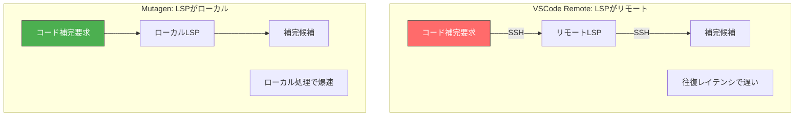

### 設定例（PHP + TypeScript）

`~/.config/nvim/lua/plugins/lsp.lua`:

```lua
local lspconfig = require('lspconfig')

-- PHP（intelephense）
lspconfig.intelephense.setup({
  settings = {
    intelephense = {
      stubs = {
        "apache", "bcmath", "bz2", "calendar", "Core",
        "curl", "date", "dom", "fileinfo", "filter",
        "gd", "hash", "iconv", "intl", "json", "libxml",
        "mbstring", "mysqli", "openssl", "pcre", "PDO",
        "pdo_mysql", "pdo_sqlite", "Phar", "posix",
        "readline", "Reflection", "session", "SimpleXML",
        "SPL", "standard", "tokenizer", "xml", "xmlreader",
        "xmlwriter", "zip", "zlib", "wordpress", "laravel"
      },
    },
  },
})

-- TypeScript
lspconfig.ts_ls.setup({})

-- LSPキーマッピング
vim.api.nvim_create_autocmd('LspAttach', {
  callback = function(args)
    local opts = { buffer = args.buf }

    -- 定義ジャンプ（最重要）
    vim.keymap.set('n', 'gd', vim.lsp.buf.definition, opts)
    -- 型定義ジャンプ
    vim.keymap.set('n', 'gy', vim.lsp.buf.type_definition, opts)
    -- 参照一覧
    vim.keymap.set('n', 'gr', vim.lsp.buf.references, opts)
    -- ホバー情報
    vim.keymap.set('n', 'K', vim.lsp.buf.hover, opts)
    -- リネーム
    vim.keymap.set('n', '<leader>rn', vim.lsp.buf.rename, opts)
  end,
})
```

---

## 実測ベンチマーク

### テスト環境

- **ローカル**: MacBook Pro M2, 16GB RAM
- **リモート**: Ubuntu 22.04, 4 vCPU, 8GB RAM
- **ネットワーク**: 同一LAN内（レイテンシ約1ms）
- **プロジェクト**: Laravel + Vue.js（PHPファイル約500、JSファイル約200）

### 結果

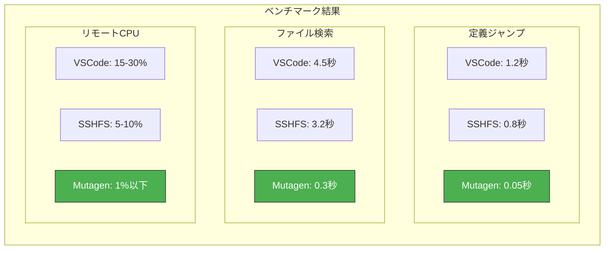

| 操作 | VSCode Remote | SSHFS + Neovim | Mutagen + Neovim |
|:---|---:|---:|---:|
| Neovim/VSCode起動 | 3.2秒 | 1.8秒 | **0.4秒** |
| 定義ジャンプ（PHP） | 1.2秒 | 0.8秒 | **0.05秒** |
| 定義ジャンプ（TS） | 0.9秒 | 0.6秒 | **0.03秒** |
| プロジェクト全体検索 | 4.5秒 | 3.2秒 | **0.3秒** |
| ファイル保存→反映 | 即時 | 即時 | **0.2秒**（非同期） |
| リモートCPU使用率 | 15-30% | 5-10% | **1%以下** |

**WAN経由（VPN等）では差がさらに顕著になる。**

---

## トラブルシューティング

### 問題解決フローチャート

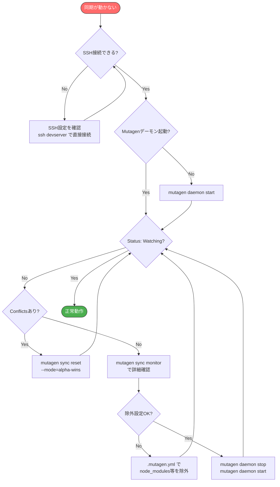

### よくある問題と解決策

#### 「Connecting...」のまま進まない

```bash
# SSHで直接接続できるか確認
ssh devserver

# できない場合はSSH設定を見直す
# できる場合はMutagenデーモンを再起動
mutagen daemon stop
mutagen daemon start
```

#### 「Conflicts detected」が出る

両方で同じファイルを編集した場合に発生。

```bash
# ローカルを優先する場合
mutagen sync reset myproject --mode=alpha-wins

# リモートを優先する場合
mutagen sync reset myproject --mode=beta-wins
```

#### 同期が遅い・止まる

```bash
# 同期状況の詳細確認
mutagen sync monitor myproject

# 除外設定を確認（node_modules等が含まれていないか）
cat .mutagen.yml
```

---

## 操作リファレンス

### Neovim キーマップ

| キー | 動作 |
|:---|:---|
| `gd` | 定義ジャンプ |
| `Ctrl-o` | 前の位置に戻る |
| `Ctrl-i` | 次の位置に進む |
| `gr` | 参照一覧 |
| `K` | ホバー情報表示 |
| `<leader>rn` | リネーム |

### Mutagen コマンド

```bash
# 同期状態確認
mutagen sync list

# 同期を一時停止
mutagen sync pause myproject

# 同期を再開
mutagen sync resume myproject

# 強制的に再同期
mutagen sync reset myproject

# セッション削除
mutagen sync terminate myproject

# リアルタイム監視
mutagen sync monitor myproject
```

### 便利エイリアス

`~/.zshrc` または `~/.bashrc` に追加：

```bash
# Mutagen同期管理
alias devsync='mutagen sync list'
alias devstart='mutagen sync resume --all'
alias devstop='mutagen sync pause --all'
alias devmon='mutagen sync monitor'
```

---

## セキュリティ考慮事項

### リスクと対策

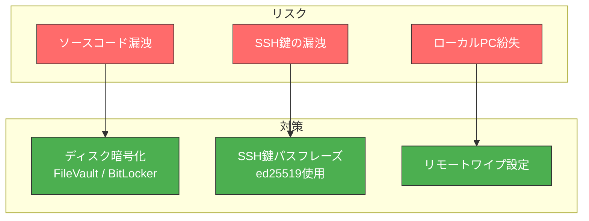

### 会社に確認すべきこと

1. **ソースコードをローカルにコピーして良いか**
2. **私物PC使用の場合、セキュリティ要件を満たしているか**
3. **退職時のデータ削除手順**

**許可を得ずに勝手にやると懲戒対象になりうる。必ず確認すること。**

---

## まとめ

### この構成の価値

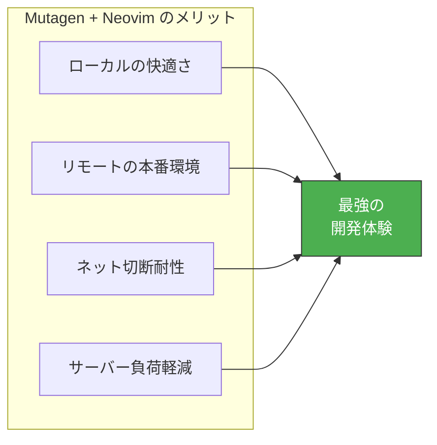

- **ローカルの快適さ**と**リモートの本番同等環境**を両立
- VSCode Remote SSHの「もっさり感」から完全に解放
- ネットワークが不安定でもローカルで作業継続可能
- リモートサーバーの負荷を大幅に軽減

### 最後に

VSCode Remote SSHは「誰でも使える」という点では優れている。だが、**速度を求めるなら選択肢にならない。**

Mutagenの初期設定は少し手間がかかる。だが一度設定すれば、**その後の開発体験は別次元になる。**

**Mutagenで開発速度を爆上げして、人生の時間を取り戻そう。**
