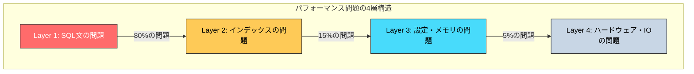
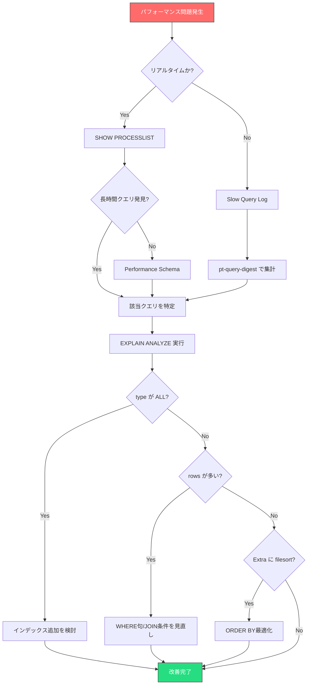
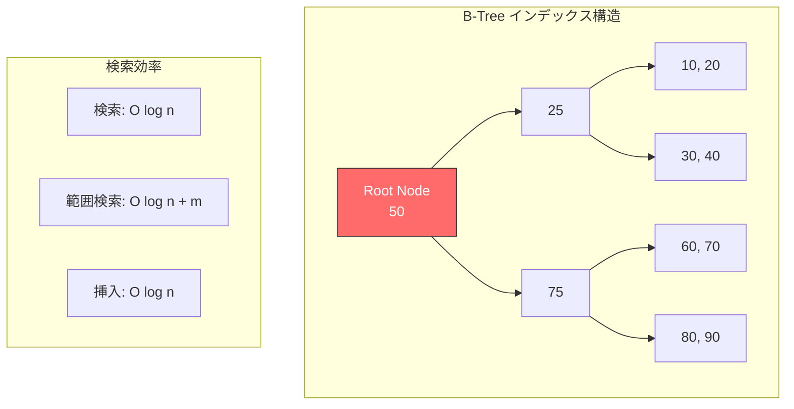
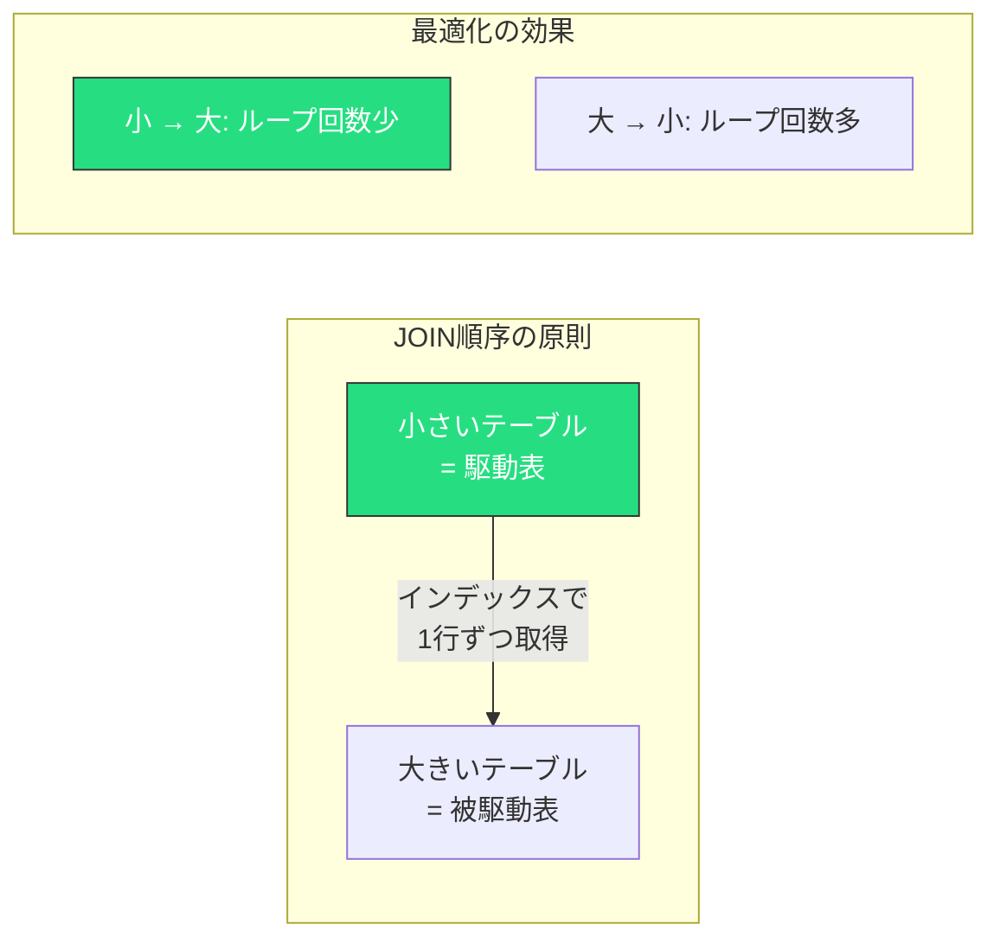
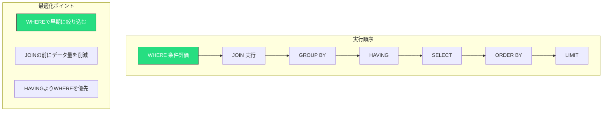
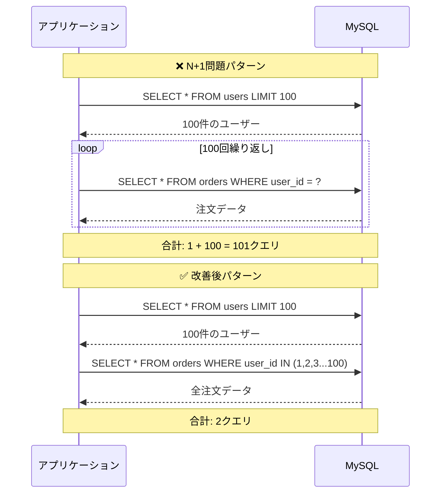
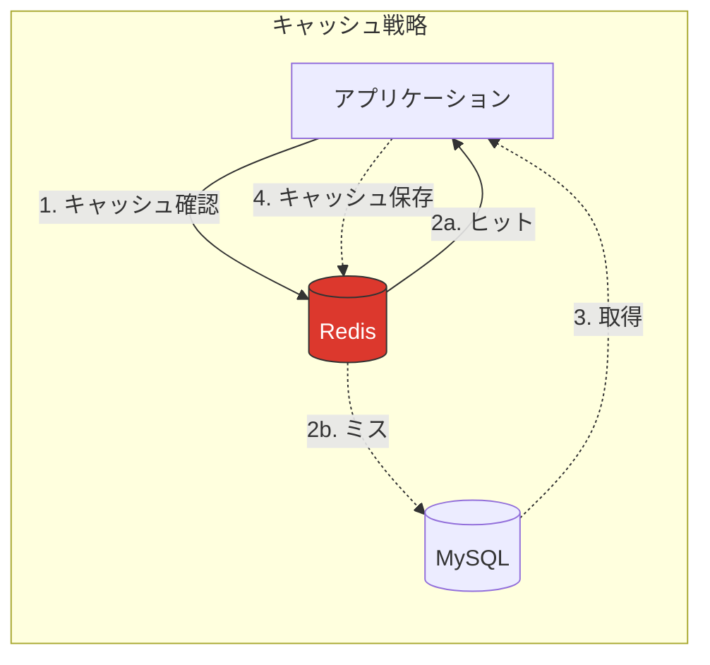
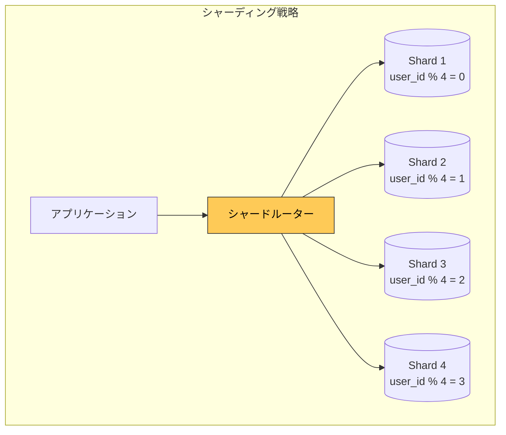

## TL;DR（結論だけ先に知りたい人向け）

| 問題 | 最速解決策 | 効果 |
|:---|:---|:---:|
| スロークエリの特定 | `EXPLAIN ANALYZE` + Performance Schema | ★★★ |
| フルテーブルスキャン | 適切なインデックス追加 | ★★★ |
| インデックス未使用 | 複合インデックスの列順見直し | ★★★ |
| LIKE '%xxx%' | 全文検索 or Elasticsearch導入 | ★★☆ |
| N+1問題 | JOIN化 or Eager Loading | ★★★ |
| バッファ不足 | `innodb_buffer_pool_size` を RAM の 70-80% に | ★★★ |
| ロック競合 | トランザクション分割 + インデックス追加 | ★★☆ |

### 改善優先度マトリクス

```
        影響度 大
            │
    ┌───────┼───────┐
    │ 優先度2 │ 優先度1 │  ← まずここから
    │インデックス│バッファ設定│
    ├───────┼───────┤
    │ 優先度4 │ 優先度3 │
    │SQL微調整│ JOIN最適化│
    └───────┼───────┘
            │
  工数 大 ←─┴─→ 工数 小
```

---

## はじめに：なぜMySQLは遅くなるのか？

本番環境で突然「DBが重い！」と言われたとき、あなたはどこから調査を始めますか？

MySQLのパフォーマンス問題は、大きく分けて以下の4層で発生します：



**重要な事実**: パフォーマンス問題の約95%は、SQL文とインデックスの改善で解決できます。

---

## 第1章：スロークエリ調査の基本フロー

### 1.1 調査フローの全体像



### 1.2 SHOW PROCESSLIST：リアルタイム監視

**今まさに実行中のクエリ**を確認する最速の方法です。

```sql
-- 基本形
SHOW PROCESSLIST;

-- 完全なクエリ文を表示（truncateされない）
SHOW FULL PROCESSLIST;

-- information_schema 経由（WHERE句が使える）
SELECT
    id,
    user,
    host,
    db,
    command,
    time,
    state,
    LEFT(info, 100) AS query_preview
FROM information_schema.processlist
WHERE command != 'Sleep'
  AND time > 5  -- 5秒以上実行中
ORDER BY time DESC;
```

**実行結果例**:
```
+--------+------+-----------+--------+---------+------+----------------+---------------------------+
| id     | user | host      | db     | command | time | state          | query_preview             |
+--------+------+-----------+--------+---------+------+----------------+---------------------------+
| 102934 | app  | 10.0.1.5  | prod   | Query   | 47   | Sending data   | SELECT * FROM orders o ...|
| 102891 | app  | 10.0.1.6  | prod   | Query   | 23   | Creating sort  | SELECT u.name, COUNT(*... |
+--------+------+-----------+--------+---------+------+----------------+---------------------------+
```

**見るべきポイント**:
- `time` が 10秒以上 → 要調査
- `state` が `Sending data` で長時間 → 大量データ転送 or フルスキャン
- `state` が `Creating sort index` → filesort発生中

### 1.3 Slow Query Log：過去のスロークエリを記録

```sql
-- 現在の設定確認
SHOW VARIABLES LIKE 'slow_query%';
SHOW VARIABLES LIKE 'long_query_time';

-- 動的に有効化（再起動不要）
SET GLOBAL slow_query_log = 1;
SET GLOBAL long_query_time = 1;  -- 1秒以上をログ
SET GLOBAL log_queries_not_using_indexes = 1;  -- インデックス未使用も記録
```

**my.cnf での永続設定**:
```ini
[mysqld]
slow_query_log = 1
slow_query_log_file = /var/log/mysql/slow.log
long_query_time = 1
log_queries_not_using_indexes = 1
```

**pt-query-digest で解析**（Percona Toolkit）:
```bash
# インストール
sudo apt install percona-toolkit

# 解析実行
pt-query-digest /var/log/mysql/slow.log > slow_report.txt

# 上位10クエリを表示
pt-query-digest --limit=10 /var/log/mysql/slow.log
```

**pt-query-digest 出力例**:
```
# Profile
# Rank Query ID                      Response time  Calls R/Call  V/M
# ==== ============================= ============== ===== ======= ====
#    1 0x4E1B8B5D6F2A3C8E9D0F1A2B...  45.2310 71.2%   892  0.0507  0.03
#    2 0x7A8B9C0D1E2F3A4B5C6D7E8F...  12.4521 19.6%  2341  0.0053  0.01
#    3 0x1234567890ABCDEF12345678...   3.8901  6.1%   127  0.0306  0.02

# Query 1: 14.87 QPS, 0.75x concurrency, ID 0x4E1B8B5D6F2A3C8E...
# This item is included in the report because it matches --limit.
# Scores: V/M = 0.03
# Time range: 2024-01-15 10:00:00 to 10:59:59
# Attribute    pct   total     min     max     avg     95%  stddev  median
# ============ === ======= ======= ======= ======= ======= ======= =======
# Count          3     892
# Exec time     71   45.23s   21ms   312ms   50.7ms   89ms   18ms    47ms
# Lock time      2   45.2ms    10us   890us    50us    98us    45us    38us
# Rows sent     12   8.92k       0      89   10.24    28.75    8.21    9.83
# Rows examine  45 892.31k     102   2.3k   1.02k   1.89k  456.23  987.65
# Query_time distribution
#   1us
#  10us
# 100us
#   1ms
#  10ms  ################################################################
# 100ms  ########
#    1s
#  10s+
# Tables
#    SHOW TABLE STATUS FROM `prod` LIKE 'orders'\G
#    SHOW CREATE TABLE `prod`.`orders`\G
# EXPLAIN /*!50100 PARTITIONS*/
SELECT * FROM orders WHERE status = 'pending' AND created_at > '2024-01-01'\G
```

### 1.4 Performance Schema：詳細な内部メトリクス

MySQL 8.0 ではデフォルトで有効です。

```sql
-- 最も時間がかかっているクエリ TOP 10
SELECT
    DIGEST_TEXT,
    COUNT_STAR AS exec_count,
    ROUND(SUM_TIMER_WAIT/1000000000000, 2) AS total_time_sec,
    ROUND(AVG_TIMER_WAIT/1000000000, 2) AS avg_time_ms,
    SUM_ROWS_EXAMINED AS rows_examined,
    SUM_ROWS_SENT AS rows_sent,
    FIRST_SEEN,
    LAST_SEEN
FROM performance_schema.events_statements_summary_by_digest
ORDER BY SUM_TIMER_WAIT DESC
LIMIT 10;
```

**実行結果例**:
```
+------------------------------------------+------------+----------------+-------------+---------------+-----------+
| DIGEST_TEXT                              | exec_count | total_time_sec | avg_time_ms | rows_examined | rows_sent |
+------------------------------------------+------------+----------------+-------------+---------------+-----------+
| SELECT * FROM `orders` WHERE `status`... |      15234 |         892.34 |       58.56 |     152340000 |    762340 |
| SELECT `u`.`name`, COUNT(*) FROM `use... |       8921 |         234.56 |       26.29 |      89210000 |      8921 |
| UPDATE `products` SET `stock` = ? WHE... |      45123 |         123.45 |        2.74 |      45123000 |         0 |
+------------------------------------------+------------+----------------+-------------+---------------+-----------+
```

### 1.5 EXPLAIN の見方一覧表

```sql
-- 基本形
EXPLAIN SELECT * FROM orders WHERE user_id = 123;

-- 実行計画 + 実際の実行統計（MySQL 8.0.18+）
EXPLAIN ANALYZE SELECT * FROM orders WHERE user_id = 123;

-- JSON形式（詳細情報）
EXPLAIN FORMAT=JSON SELECT * FROM orders WHERE user_id = 123;
```

#### type カラムの読み方（上ほど高速）

| type | 説明 | 目安 | 対策 |
|:---|:---|:---:|:---|
| `system` | テーブルに1行のみ | ★★★ | 最速、対策不要 |
| `const` | PRIMARY/UNIQUE で1行特定 | ★★★ | 最速、対策不要 |
| `eq_ref` | JOINで1行ずつ一致 | ★★★ | 良好 |
| `ref` | インデックスで複数行 | ★★☆ | 許容範囲 |
| `range` | インデックスの範囲スキャン | ★★☆ | 許容範囲 |
| `index` | インデックスフルスキャン | ★☆☆ | 要改善 |
| `ALL` | テーブルフルスキャン | ☆☆☆ | **即改善必須** |

#### Extra カラムの警告サイン

| Extra | 意味 | 深刻度 | 対策 |
|:---|:---|:---:|:---|
| `Using index` | カバリングインデックス使用 | 良好 | そのまま |
| `Using where` | WHERE句でフィルタ | 普通 | - |
| `Using temporary` | 一時テーブル作成 | ⚠️ | インデックス追加 |
| `Using filesort` | ソート処理発生 | ⚠️ | ORDER BY最適化 |
| `Using join buffer` | JOINバッファ使用 | ⚠️ | インデックス追加 |
| `Full scan on NULL key` | NULLキーでフルスキャン | ⚠️ | NOT NULL制約追加 |

#### EXPLAIN ANALYZE の出力例

```sql
EXPLAIN ANALYZE
SELECT o.id, o.total, u.name
FROM orders o
JOIN users u ON o.user_id = u.id
WHERE o.status = 'pending'
  AND o.created_at > '2024-01-01';
```

```
-> Nested loop inner join  (cost=1234.56 rows=892) (actual time=0.234..45.678 rows=847 loops=1)
    -> Filter: ((o.status = 'pending') and (o.created_at > TIMESTAMP'2024-01-01 00:00:00'))
       (cost=456.78 rows=892) (actual time=0.156..34.567 rows=847 loops=1)
        -> Table scan on o  (cost=456.78 rows=10000) (actual time=0.123..12.345 rows=10000 loops=1)
    -> Single-row index lookup on u using PRIMARY (id=o.user_id)
       (cost=0.87 rows=1) (actual time=0.012..0.013 rows=1 loops=847)
```

**読み方**:
- `cost`: オプティマイザの推定コスト
- `rows`: 推定行数
- `actual time`: 実際の実行時間（最初の行取得..全行取得）
- `loops`: ループ回数

上記例では `Table scan on o` がボトルネック。`status` と `created_at` の複合インデックスが有効です。

---

## 第2章：インデックス最適化パターン

### 2.1 B-Tree インデックスの特性を理解する

MySQLのデフォルトインデックスはB-Tree構造です。



**B-Treeが高速な条件**:
- `=` 等価検索
- `>`, `<`, `>=`, `<=` 範囲検索
- `BETWEEN` 範囲検索
- `LIKE 'prefix%'` 前方一致
- `ORDER BY` ソート（インデックス順）

**B-Treeが使えない条件**:
- `LIKE '%suffix'` 後方一致
- `LIKE '%middle%'` 中間一致
- 関数を適用した列 `WHERE YEAR(created_at) = 2024`
- 暗黙の型変換 `WHERE varchar_col = 123`

### 2.2 複合インデックスの列順序

**左端から順にマッチ**することが重要です。

```sql
-- インデックス定義
CREATE INDEX idx_status_created ON orders(status, created_at);

-- ✅ インデックス使用
SELECT * FROM orders WHERE status = 'pending';
SELECT * FROM orders WHERE status = 'pending' AND created_at > '2024-01-01';

-- ❌ インデックス未使用（左端の status がない）
SELECT * FROM orders WHERE created_at > '2024-01-01';
```

#### 複合インデックスの列順序の決め方

```
                優先度 高
                   │
    ┌──────────────┴──────────────┐
    │                              │
    │   1. 等価条件 (=) の列       │
    │   2. 範囲条件 (>, <) の列    │
    │   3. ORDER BY の列          │
    │   4. SELECT の列            │
    │                              │
    └──────────────────────────────┘
                   │
                優先度 低
```

**例**: `SELECT * FROM orders WHERE status = 'pending' AND created_at > '2024-01-01' ORDER BY total DESC`

```sql
-- 最適なインデックス
CREATE INDEX idx_optimal ON orders(status, created_at, total);

-- status (等価) → created_at (範囲) → total (ORDER BY)
```

### 2.3 Cardinality（選択性）の重要性

**Cardinality**: インデックス内のユニーク値の数

```sql
-- Cardinalityの確認
SHOW INDEX FROM orders;
```

```
+--------+------------+-------------------+--------------+-------------+-----------+
| Table  | Non_unique | Key_name          | Seq_in_index | Column_name | Cardinality|
+--------+------------+-------------------+--------------+-------------+-----------+
| orders |          1 | idx_status        |            1 | status      |          5 |
| orders |          1 | idx_user_id       |            1 | user_id     |      89234 |
| orders |          1 | idx_created_at    |            1 | created_at  |     123456 |
+--------+------------+-------------------+--------------+-------------+-----------+
```

**Selectivity（選択率）** = Cardinality / 総行数

| 列 | Cardinality | 総行数 | Selectivity | 評価 |
|:---|---:|---:|---:|:---|
| status | 5 | 100,000 | 0.005% | ❌ 低すぎる |
| user_id | 89,234 | 100,000 | 89.2% | ✅ 良好 |
| created_at | 123,456 | 100,000 | 100%+ | ✅ 良好 |

**目安**: Selectivity が 10% 以上ならインデックス効果あり

### 2.4 悪い例 → 良い例 改善パターン

#### パターン1: 関数使用によるインデックス無効化

```sql
-- ❌ BAD: 関数でインデックス無効
SELECT * FROM orders
WHERE DATE(created_at) = '2024-01-15';

-- EXPLAIN結果
-- type: ALL (フルテーブルスキャン)
-- rows: 1,000,000
```

```sql
-- ✅ GOOD: 範囲条件に書き換え
SELECT * FROM orders
WHERE created_at >= '2024-01-15 00:00:00'
  AND created_at < '2024-01-16 00:00:00';

-- EXPLAIN結果
-- type: range
-- rows: 3,456
```

**改善効果**: 実行時間 12.3秒 → 0.02秒

#### パターン2: 暗黙の型変換

```sql
-- ❌ BAD: VARCHAR列に数値で検索
SELECT * FROM users WHERE phone = 09012345678;

-- 暗黙的に CAST(phone AS SIGNED) が実行される
-- type: ALL
```

```sql
-- ✅ GOOD: 文字列で検索
SELECT * FROM users WHERE phone = '09012345678';

-- type: ref
-- key: idx_phone
```

#### パターン3: OR条件の最適化

```sql
-- ❌ BAD: ORでインデックス効率低下
SELECT * FROM orders
WHERE status = 'pending' OR status = 'processing';

-- type: ALL または index (状況による)
```

```sql
-- ✅ GOOD: INに書き換え
SELECT * FROM orders
WHERE status IN ('pending', 'processing');

-- type: range
-- key: idx_status
```

#### パターン4: 前方不一致LIKE

```sql
-- ❌ BAD: 前方一致できない
SELECT * FROM products WHERE name LIKE '%スマホ%';

-- type: ALL
-- 対策: フルテキストインデックス or Elasticsearch
```

```sql
-- ✅ GOOD: フルテキストインデックス
ALTER TABLE products ADD FULLTEXT INDEX ft_name (name) WITH PARSER ngram;

SELECT * FROM products
WHERE MATCH(name) AGAINST('スマホ' IN NATURAL LANGUAGE MODE);

-- type: fulltext
```

### 2.5 実行計画の改善比較

**改善前**:
```sql
EXPLAIN SELECT o.*, u.name
FROM orders o
JOIN users u ON o.user_id = u.id
WHERE o.created_at > '2024-01-01'
  AND o.status = 'pending';
```

```
+----+-------------+-------+------+---------------+------+---------+------+--------+-------------+
| id | select_type | table | type | possible_keys | key  | key_len | ref  | rows   | Extra       |
+----+-------------+-------+------+---------------+------+---------+------+--------+-------------+
|  1 | SIMPLE      | o     | ALL  | NULL          | NULL | NULL    | NULL | 892341 | Using where |
|  1 | SIMPLE      | u     | ALL  | PRIMARY       | NULL | NULL    | NULL |  45123 | Using where |
+----+-------------+-------+------+---------------+------+---------+------+--------+-------------+
```

**インデックス追加**:
```sql
CREATE INDEX idx_status_created ON orders(status, created_at);
```

**改善後**:
```
+----+-------------+-------+--------+--------------------+--------------------+---------+---------------+------+-------------+
| id | select_type | table | type   | possible_keys      | key                | key_len | ref           | rows | Extra       |
+----+-------------+-------+--------+--------------------+--------------------+---------+---------------+------+-------------+
|  1 | SIMPLE      | o     | range  | idx_status_created | idx_status_created | 48      | NULL          | 2341 | Using where |
|  1 | SIMPLE      | u     | eq_ref | PRIMARY            | PRIMARY            | 4       | prod.o.user_id|    1 | NULL        |
+----+-------------+-------+--------+--------------------+--------------------+---------+---------------+------+-------------+
```

**改善効果**:

| 指標 | 改善前 | 改善後 | 改善率 |
|:---|---:|---:|---:|
| スキャン行数 | 892,341 | 2,341 | 99.7%削減 |
| 実行時間 | 4.56秒 | 0.012秒 | 99.7%削減 |
| type | ALL | range | - |

---

## 第3章：SQLリライト例

### 3.1 避けるべき構文パターン

#### ❌ LIKE '%xxx%'（中間一致）

```sql
-- ❌ BAD: フルテーブルスキャン必須
SELECT * FROM products WHERE description LIKE '%高性能%';

-- ✅ ALTERNATIVE 1: フルテキスト検索
ALTER TABLE products ADD FULLTEXT INDEX ft_desc (description) WITH PARSER ngram;
SELECT * FROM products
WHERE MATCH(description) AGAINST('高性能' IN BOOLEAN MODE);

-- ✅ ALTERNATIVE 2: 検索用のタグテーブルを別途用意
SELECT p.* FROM products p
JOIN product_tags pt ON p.id = pt.product_id
JOIN tags t ON pt.tag_id = t.id
WHERE t.name = '高性能';
```

#### ❌ OR の乱用

```sql
-- ❌ BAD: インデックス効率低下
SELECT * FROM orders
WHERE user_id = 123 OR created_at > '2024-01-01';

-- ✅ GOOD: UNIONに分割
SELECT * FROM orders WHERE user_id = 123
UNION
SELECT * FROM orders WHERE created_at > '2024-01-01' AND user_id != 123;

-- ✅ BETTER: ロジック見直し（可能な場合）
SELECT * FROM orders
WHERE user_id = 123 AND created_at > '2024-01-01';
```

#### ❌ IN句に大量の値

```sql
-- ❌ BAD: 10,000個のIDを列挙
SELECT * FROM users WHERE id IN (1, 2, 3, ..., 10000);

-- ✅ GOOD: 一時テーブル + JOIN
CREATE TEMPORARY TABLE tmp_ids (id INT PRIMARY KEY);
INSERT INTO tmp_ids VALUES (1), (2), (3), ...;  -- バルクインサート

SELECT u.* FROM users u
JOIN tmp_ids t ON u.id = t.id;

-- ✅ ALTERNATIVE: サブクエリ（条件による）
SELECT * FROM users
WHERE id IN (SELECT user_id FROM active_sessions WHERE expires_at > NOW());
```

### 3.2 JOIN最適化

#### 駆動表（最初に読む表）の選択



**例**: users（1万行） と orders（100万行）

```sql
-- ❌ BAD: ordersを先に読むと100万回ループ
SELECT * FROM orders o
STRAIGHT_JOIN users u ON o.user_id = u.id
WHERE u.status = 'active';

-- ✅ GOOD: usersを先に読む（オプティマイザが自動判断）
SELECT * FROM users u
JOIN orders o ON u.id = o.user_id
WHERE u.status = 'active';

-- ヒントで明示（オプティマイザを信頼できない場合）
SELECT /*+ JOIN_ORDER(u, o) */ *
FROM users u
JOIN orders o ON u.id = o.user_id
WHERE u.status = 'active';
```

#### 不要なJOINの削除

```sql
-- ❌ BAD: 使わないテーブルをJOIN
SELECT o.id, o.total
FROM orders o
JOIN users u ON o.user_id = u.id      -- uの列を使っていない！
JOIN products p ON o.product_id = p.id -- pの列を使っていない！
WHERE o.status = 'pending';

-- ✅ GOOD: 必要なテーブルのみ
SELECT o.id, o.total
FROM orders o
WHERE o.status = 'pending';
```

### 3.3 GROUP BY / ORDER BY チューニング

#### filesort を避ける

```sql
-- ❌ BAD: filesort発生
SELECT user_id, COUNT(*) as order_count
FROM orders
WHERE created_at > '2024-01-01'
GROUP BY user_id
ORDER BY order_count DESC;

-- EXPLAIN: Using temporary; Using filesort
```

```sql
-- ✅ GOOD: インデックスでソート
CREATE INDEX idx_created_user ON orders(created_at, user_id);

SELECT user_id, COUNT(*) as order_count
FROM orders
WHERE created_at > '2024-01-01'
GROUP BY user_id
ORDER BY user_id;  -- インデックス順

-- EXPLAIN: Using index; なし（filesortなし）
```

#### LIMIT + ORDER BY の最適化

```sql
-- ❌ BAD: 全件ソート後にLIMIT
SELECT * FROM orders
ORDER BY created_at DESC
LIMIT 10;

-- 100万行をソートしてから10件返す
```

```sql
-- ✅ GOOD: インデックスで直接取得
CREATE INDEX idx_created_desc ON orders(created_at DESC);

SELECT * FROM orders
ORDER BY created_at DESC
LIMIT 10;

-- インデックスから10件読むだけ
```

### 3.4 WHERE句の絞り込み順序



```sql
-- ❌ BAD: HAVINGで絞り込み
SELECT user_id, COUNT(*) as cnt
FROM orders
GROUP BY user_id
HAVING user_id > 1000;

-- ✅ GOOD: WHEREで事前絞り込み
SELECT user_id, COUNT(*) as cnt
FROM orders
WHERE user_id > 1000
GROUP BY user_id;
```

---

## 第4章：N+1問題の検出と対策

### 4.1 N+1問題とは



### 4.2 N+1問題の検出方法

#### MySQL側での検出

```sql
-- Performance Schemaで同一クエリの大量実行を検出
SELECT
    DIGEST_TEXT,
    COUNT_STAR as exec_count,
    ROUND(SUM_TIMER_WAIT/1000000000, 2) as total_ms,
    ROUND(AVG_TIMER_WAIT/1000000, 2) as avg_us
FROM performance_schema.events_statements_summary_by_digest
WHERE DIGEST_TEXT LIKE '%orders%WHERE%user_id%'
  AND COUNT_STAR > 100  -- 100回以上実行
ORDER BY COUNT_STAR DESC
LIMIT 10;
```

```
+------------------------------------------+------------+----------+--------+
| DIGEST_TEXT                              | exec_count | total_ms | avg_us |
+------------------------------------------+------------+----------+--------+
| SELECT * FROM `orders` WHERE `user_id`=? |      15234 |  1234.56 | 81.05  |
+------------------------------------------+------------+----------+--------+
```

**15,234回の実行** → 典型的なN+1パターン！

#### アプリケーション側での検出

```ruby
# Rails: Bulletジェムでの検出
# Gemfile
gem 'bullet', group: 'development'

# config/environments/development.rb
config.after_initialize do
  Bullet.enable = true
  Bullet.alert = true
  Bullet.console = true
  Bullet.add_footer = true
end
```

### 4.3 N+1の解決パターン

#### パターン1: JOIN化

```sql
-- ❌ N+1: アプリで2段階クエリ
-- 1回目
SELECT * FROM users WHERE status = 'active';
-- N回目（ユーザーごと）
SELECT * FROM orders WHERE user_id = ?;
```

```sql
-- ✅ 1クエリでJOIN
SELECT u.*, o.*
FROM users u
LEFT JOIN orders o ON u.id = o.user_id
WHERE u.status = 'active';
```

#### パターン2: IN句でバッチ取得

```sql
-- ❌ N+1
SELECT * FROM users WHERE status = 'active';  -- 100件取得
-- 100回実行
SELECT * FROM orders WHERE user_id = 1;
SELECT * FROM orders WHERE user_id = 2;
...

-- ✅ 2クエリ
SELECT * FROM users WHERE status = 'active';  -- 100件取得
SELECT * FROM orders WHERE user_id IN (1, 2, 3, ..., 100);  -- 一括取得
```

#### パターン3: ORMのEager Loading

```ruby
# Rails ActiveRecord
# ❌ N+1
users = User.where(status: 'active')
users.each { |u| puts u.orders.count }

# ✅ Eager Loading
users = User.includes(:orders).where(status: 'active')
users.each { |u| puts u.orders.count }

# ✅ preloadとincludesの使い分け
# preload: 常に2クエリ（JOINしない）
User.preload(:orders).where(status: 'active')

# includes: 条件次第で自動判断
User.includes(:orders).where(orders: { status: 'pending' })

# eager_load: 常にLEFT JOIN
User.eager_load(:orders).where(status: 'active')
```

```python
# SQLAlchemy
# ❌ N+1
users = session.query(User).filter_by(status='active').all()
for u in users:
    print(len(u.orders))  # 毎回クエリ発行

# ✅ Eager Loading
from sqlalchemy.orm import joinedload
users = session.query(User)\
    .options(joinedload(User.orders))\
    .filter_by(status='active').all()
```

### 4.4 Redisキャッシュとの併用



```python
import redis
import json
import hashlib

redis_client = redis.Redis(host='localhost', port=6379, db=0)

def get_user_orders(user_id):
    cache_key = f"user:{user_id}:orders"

    # キャッシュ確認
    cached = redis_client.get(cache_key)
    if cached:
        return json.loads(cached)

    # MySQL取得
    orders = db.execute(
        "SELECT * FROM orders WHERE user_id = %s",
        (user_id,)
    ).fetchall()

    # キャッシュ保存（TTL: 5分）
    redis_client.setex(
        cache_key,
        300,
        json.dumps(orders)
    )

    return orders

def get_users_with_orders(user_ids):
    """バッチ取得 + キャッシュ"""
    result = {}
    cache_misses = []

    # 一括キャッシュ確認
    pipe = redis_client.pipeline()
    for uid in user_ids:
        pipe.get(f"user:{uid}:orders")
    cached_values = pipe.execute()

    for uid, cached in zip(user_ids, cached_values):
        if cached:
            result[uid] = json.loads(cached)
        else:
            cache_misses.append(uid)

    # ミスしたもののみDB取得
    if cache_misses:
        orders = db.execute(
            "SELECT * FROM orders WHERE user_id IN %s",
            (tuple(cache_misses),)
        ).fetchall()

        # 結果をユーザーごとにグループ化
        for order in orders:
            uid = order['user_id']
            if uid not in result:
                result[uid] = []
            result[uid].append(order)

        # キャッシュ保存
        pipe = redis_client.pipeline()
        for uid in cache_misses:
            pipe.setex(
                f"user:{uid}:orders",
                300,
                json.dumps(result.get(uid, []))
            )
        pipe.execute()

    return result
```

---

## 第5章：インフラ改善

### 5.1 innodb_buffer_pool_size 最適化

**最重要パラメータ**です。データとインデックスをメモリにキャッシュします。

```sql
-- 現在の設定確認
SHOW VARIABLES LIKE 'innodb_buffer_pool_size';
SHOW VARIABLES LIKE 'innodb_buffer_pool_instances';

-- バッファプールの使用状況
SHOW STATUS LIKE 'Innodb_buffer_pool%';
```

```
+---------------------------------------+--------------+
| Variable_name                         | Value        |
+---------------------------------------+--------------+
| Innodb_buffer_pool_read_requests      | 892341567    |
| Innodb_buffer_pool_reads              | 12345        |
| Innodb_buffer_pool_pages_total        | 131072       |
| Innodb_buffer_pool_pages_data         | 125000       |
| Innodb_buffer_pool_pages_free         | 6072         |
+---------------------------------------+--------------+
```

#### ヒット率の計算

```sql
SELECT
    (1 - (
        (SELECT VARIABLE_VALUE FROM performance_schema.global_status
         WHERE VARIABLE_NAME = 'Innodb_buffer_pool_reads') /
        (SELECT VARIABLE_VALUE FROM performance_schema.global_status
         WHERE VARIABLE_NAME = 'Innodb_buffer_pool_read_requests')
    )) * 100 AS hit_rate_percent;
```

**目標値**: 99%以上

| ヒット率 | 状態 | 対策 |
|:---|:---|:---|
| 99%以上 | 良好 | 現状維持 |
| 95-99% | 要注意 | buffer_pool_size 増加検討 |
| 95%未満 | 要改善 | **即座に増加** |

#### 適切なサイズの設定

```ini
# my.cnf
[mysqld]
# 専用DBサーバー: 物理メモリの70-80%
innodb_buffer_pool_size = 12G  # 16GBマシンの場合

# 共用サーバー: 物理メモリの50-60%
innodb_buffer_pool_size = 8G   # 16GBマシンの場合

# インスタンス数（buffer_pool_size / 1GB、最大64）
innodb_buffer_pool_instances = 12
```

### 5.2 その他の重要パラメータ

| パラメータ | 推奨値 | 説明 |
|:---|:---|:---|
| `innodb_log_file_size` | 1-2GB | REDOログサイズ |
| `innodb_log_buffer_size` | 64MB | ログバッファ |
| `innodb_flush_log_at_trx_commit` | 1（安全）/ 2（高速） | ログフラッシュタイミング |
| `innodb_io_capacity` | SSD:2000-10000 / HDD:200 | IOPS上限 |
| `innodb_read_io_threads` | 4-8 | 読み取りスレッド数 |
| `innodb_write_io_threads` | 4-8 | 書き込みスレッド数 |
| `max_connections` | 151（デフォルト） | 同時接続数上限 |
| `thread_cache_size` | 16-32 | スレッドキャッシュ |

```ini
# my.cnf パフォーマンスチューニング例
[mysqld]
# Buffer Pool
innodb_buffer_pool_size = 12G
innodb_buffer_pool_instances = 12

# Redo Log
innodb_log_file_size = 2G
innodb_log_buffer_size = 64M

# I/O
innodb_io_capacity = 4000
innodb_io_capacity_max = 8000
innodb_read_io_threads = 8
innodb_write_io_threads = 8

# Flush
innodb_flush_log_at_trx_commit = 1  # ACID保証
innodb_flush_method = O_DIRECT      # OSキャッシュをバイパス

# Connection
max_connections = 200
thread_cache_size = 32

# Temp Table
tmp_table_size = 256M
max_heap_table_size = 256M
```

### 5.3 IOPS / Latency の監視

```sql
-- ファイルI/O統計
SELECT
    FILE_NAME,
    COUNT_READ,
    COUNT_WRITE,
    ROUND(SUM_TIMER_READ/1000000000, 2) as read_time_sec,
    ROUND(SUM_TIMER_WRITE/1000000000, 2) as write_time_sec
FROM performance_schema.file_summary_by_instance
WHERE FILE_NAME LIKE '%ibdata%' OR FILE_NAME LIKE '%.ibd'
ORDER BY SUM_TIMER_READ + SUM_TIMER_WRITE DESC
LIMIT 10;
```

#### ディスクI/Oのボトルネック診断

```bash
# Linux iostat
iostat -x 1

# 確認ポイント
# - %util > 80%: ディスク飽和
# - await > 10ms: レイテンシ高い
# - r/s + w/s: 総IOPS
```

```
Device    r/s     w/s   rMB/s   wMB/s  await  %util
nvme0n1  2500    1500    125     75    0.8    45
sda        50     100      2      5   25.0    85  ← 問題あり
```

### 5.4 パーティショニング

大量データを論理的に分割し、スキャン範囲を限定します。

```sql
-- 日付でパーティション
CREATE TABLE orders_partitioned (
    id BIGINT NOT NULL,
    user_id INT NOT NULL,
    total DECIMAL(10,2),
    created_at DATETIME NOT NULL,
    PRIMARY KEY (id, created_at)
) PARTITION BY RANGE (TO_DAYS(created_at)) (
    PARTITION p202301 VALUES LESS THAN (TO_DAYS('2023-02-01')),
    PARTITION p202302 VALUES LESS THAN (TO_DAYS('2023-03-01')),
    PARTITION p202303 VALUES LESS THAN (TO_DAYS('2023-04-01')),
    -- ...
    PARTITION p_future VALUES LESS THAN MAXVALUE
);

-- パーティションプルーニングの確認
EXPLAIN SELECT * FROM orders_partitioned
WHERE created_at BETWEEN '2023-02-01' AND '2023-02-28';
```

```
+----+-------------+---------------------+------------+-------+
| id | select_type | table               | partitions | type  |
+----+-------------+---------------------+------------+-------+
|  1 | SIMPLE      | orders_partitioned  | p202302    | range |
+----+-------------+---------------------+------------+-------+
```

**p202302 パーティションのみスキャン！**

### 5.5 シャーディング概要



**シャーディングの検討タイミング**:
- 単一DBで **1TB以上** のデータ
- 書き込みが **10,000 QPS** を超える
- レプリカでは読み取りが追いつかない

**推奨ツール**:
- Vitess（YouTube製）
- ProxySQL
- MySQL Router

---

## 第6章：診断チェックリスト & 実践テンプレート

### 6.1 上位10件の悪玉クエリを洗い出す手順

```sql
-- Step 1: 最も時間がかかっているクエリ TOP 10
SELECT
    DIGEST_TEXT,
    COUNT_STAR as exec_count,
    ROUND(SUM_TIMER_WAIT/1000000000000, 2) as total_sec,
    ROUND(AVG_TIMER_WAIT/1000000000, 2) as avg_ms,
    ROUND(MAX_TIMER_WAIT/1000000000, 2) as max_ms,
    SUM_ROWS_EXAMINED as rows_examined,
    SUM_ROWS_SENT as rows_sent,
    ROUND(SUM_ROWS_EXAMINED / NULLIF(SUM_ROWS_SENT, 0), 1) as scan_ratio
FROM performance_schema.events_statements_summary_by_digest
WHERE SCHEMA_NAME = 'your_database'
ORDER BY SUM_TIMER_WAIT DESC
LIMIT 10\G
```

#### 判断基準表

| 指標 | 良好 | 要注意 | 要改善 |
|:---|:---:|:---:|:---:|
| avg_ms（平均実行時間） | < 10ms | 10-100ms | > 100ms |
| max_ms（最大実行時間） | < 100ms | 100ms-1s | > 1s |
| scan_ratio（スキャン/送信比） | < 10 | 10-100 | > 100 |
| exec_count（1時間あたり） | - | > 10,000 | > 100,000 |

### 6.2 クイック診断スクリプト

```sql
-- ===============================================
-- MySQL パフォーマンス診断スクリプト
-- ===============================================

-- 1. 基本情報
SELECT @@version AS mysql_version;
SELECT @@innodb_buffer_pool_size / 1024 / 1024 / 1024 AS buffer_pool_gb;

-- 2. バッファプールヒット率
SELECT
    ROUND((1 - (
        (SELECT VARIABLE_VALUE FROM performance_schema.global_status
         WHERE VARIABLE_NAME = 'Innodb_buffer_pool_reads') /
        NULLIF((SELECT VARIABLE_VALUE FROM performance_schema.global_status
         WHERE VARIABLE_NAME = 'Innodb_buffer_pool_read_requests'), 0)
    )) * 100, 2) AS buffer_pool_hit_rate;

-- 3. スロークエリ設定
SHOW VARIABLES LIKE 'slow_query%';
SHOW VARIABLES LIKE 'long_query_time';

-- 4. 現在の接続数
SHOW STATUS LIKE 'Threads_connected';
SHOW STATUS LIKE 'Max_used_connections';
SHOW VARIABLES LIKE 'max_connections';

-- 5. テーブルロック状況
SHOW STATUS LIKE 'Table_locks%';

-- 6. 一時テーブル使用状況
SHOW STATUS LIKE 'Created_tmp%';

-- 7. インデックス未使用クエリ（直近）
SELECT
    DIGEST_TEXT,
    COUNT_STAR,
    SUM_NO_INDEX_USED
FROM performance_schema.events_statements_summary_by_digest
WHERE SUM_NO_INDEX_USED > 0
ORDER BY COUNT_STAR DESC
LIMIT 5;
```

### 6.3 改善施策の優先度テンプレート

| 優先度 | 施策 | 工数 | 効果 | 実施条件 |
|:---:|:---|:---:|:---:|:---|
| 1 | `innodb_buffer_pool_size` 増加 | 低 | 高 | ヒット率 < 99% |
| 2 | 悪玉クエリにインデックス追加 | 低 | 高 | type=ALL のクエリ存在 |
| 3 | N+1問題の解消 | 中 | 高 | 同一クエリ100回以上/分 |
| 4 | 複合インデックスの列順序最適化 | 低 | 中 | key_len が短い |
| 5 | SQL リライト（OR→IN等） | 低 | 中 | OR条件が多い |
| 6 | パーティショニング導入 | 高 | 中 | テーブルサイズ > 100GB |
| 7 | Redisキャッシュ導入 | 高 | 高 | 読み取り負荷が高い |
| 8 | リードレプリカ追加 | 高 | 高 | 書き込みは少ないが読み取り多い |
| 9 | シャーディング | 極高 | 極高 | 他の手段が限界 |

### 6.4 改善報告テンプレート

```markdown
## パフォーマンス改善報告

### 対象クエリ
```sql
SELECT * FROM orders WHERE status = 'pending' AND created_at > '2024-01-01';
```

### 問題点
- type: ALL（フルテーブルスキャン）
- rows: 892,341
- 実行時間: 4.56秒

### 改善策
```sql
CREATE INDEX idx_status_created ON orders(status, created_at);
```

### 改善結果
| 指標 | 改善前 | 改善後 | 改善率 |
|:---|---:|---:|---:|
| type | ALL | range | - |
| rows | 892,341 | 2,341 | 99.7% |
| 実行時間 | 4.56秒 | 0.012秒 | 99.7% |

### 本番適用手順
1. ステージング環境でテスト
2. 本番でインデックス作成（オンラインDDL）
3. 30分後に効果確認
```

### 6.5 定期監視クエリ（毎日実行推奨）

```sql
-- 日次パフォーマンスレポート
SELECT
    DATE(NOW()) as report_date,

    -- バッファプールヒット率
    (SELECT ROUND((1 - (
        (SELECT VARIABLE_VALUE FROM performance_schema.global_status
         WHERE VARIABLE_NAME = 'Innodb_buffer_pool_reads') /
        NULLIF((SELECT VARIABLE_VALUE FROM performance_schema.global_status
         WHERE VARIABLE_NAME = 'Innodb_buffer_pool_read_requests'), 0)
    )) * 100, 2)) as buffer_hit_rate,

    -- スロークエリ数（1秒以上）
    (SELECT COUNT(*)
     FROM performance_schema.events_statements_summary_by_digest
     WHERE AVG_TIMER_WAIT > 1000000000000) as slow_query_types,

    -- フルスキャンクエリ数
    (SELECT COUNT(*)
     FROM performance_schema.events_statements_summary_by_digest
     WHERE SUM_NO_INDEX_USED > 0) as no_index_query_types,

    -- 最大接続数使用率
    (SELECT ROUND(
        (SELECT VARIABLE_VALUE FROM performance_schema.global_status
         WHERE VARIABLE_NAME = 'Max_used_connections') /
        (SELECT VARIABLE_VALUE FROM performance_schema.global_variables
         WHERE VARIABLE_NAME = 'max_connections') * 100, 1
    )) as max_conn_usage_pct;
```

---

## まとめ：パフォーマンス改善の心得

### 改善の黄金律

```
┌─────────────────────────────────────────────────────────┐
│  1. 計測なくして改善なし                                 │
│     → EXPLAIN ANALYZE, Performance Schema を活用        │
│                                                          │
│  2. 80%の問題は20%の原因から                            │
│     → 上位10件の悪玉クエリに集中                        │
│                                                          │
│  3. インデックスは銀の弾丸ではない                       │
│     → 書き込み性能とのトレードオフを意識                │
│                                                          │
│  4. アプリケーション側の改善が最も効果的                 │
│     → N+1解消、キャッシュ活用                           │
│                                                          │
│  5. インフラ増強は最後の手段                             │
│     → まずSQLとインデックスを見直す                     │
└─────────────────────────────────────────────────────────┘
```

### クイックリファレンス

| 症状 | 確認コマンド | よくある原因 | 対策 |
|:---|:---|:---|:---|
| 全体的に遅い | `SHOW STATUS` | バッファ不足 | buffer_pool_size増加 |
| 特定クエリが遅い | `EXPLAIN ANALYZE` | インデックス不足 | インデックス追加 |
| 同じクエリが大量 | Performance Schema | N+1問題 | JOIN化/キャッシュ |
| ロック待ち多発 | `SHOW ENGINE INNODB STATUS` | 長時間トランザクション | トランザクション分割 |
| 接続数上限 | `SHOW STATUS LIKE 'Threads%'` | コネクションリーク | プール設定見直し |

---

## 参考リンク

### 公式ドキュメント
- [MySQL 8.0 Reference Manual - Optimization](https://dev.mysql.com/doc/refman/8.0/en/optimization.html)
- [MySQL Performance Schema](https://dev.mysql.com/doc/refman/8.0/en/performance-schema.html)
- [InnoDB Configuration](https://dev.mysql.com/doc/refman/8.0/en/innodb-configuration.html)

### ツール
- [Percona Toolkit](https://www.percona.com/software/database-tools/percona-toolkit) - pt-query-digest など
- [MySQLTuner](https://github.com/major/MySQLTuner-perl) - 自動診断スクリプト
- [Percona Monitoring and Management (PMM)](https://www.percona.com/software/database-tools/percona-monitoring-and-management) - 監視ツール

### 書籍・記事
- [High Performance MySQL, 4th Edition](https://www.oreilly.com/library/view/high-performance-mysql/9781492080503/) - O'Reilly
- [Use The Index, Luke](https://use-the-index-luke.com/) - インデックス設計の名著（無料）

---

この記事が、あなたの本番環境でのパフォーマンス問題解決の一助となれば幸いです。
