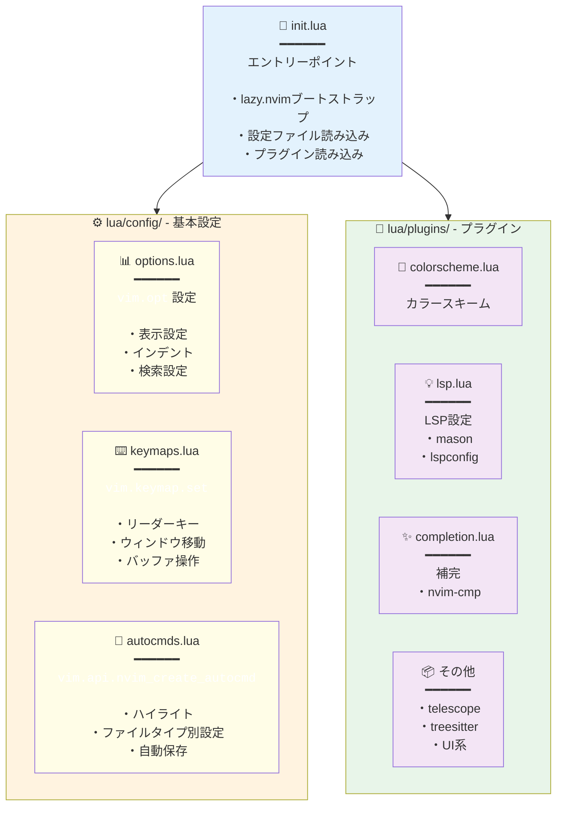
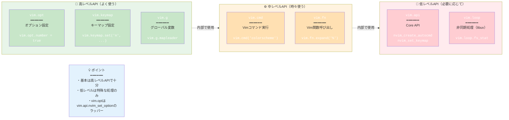
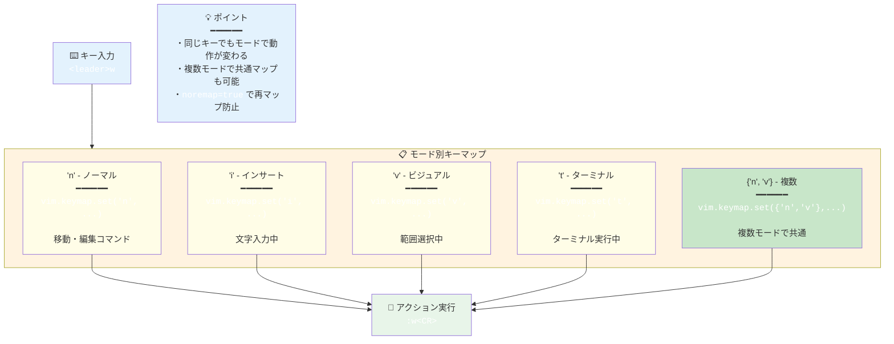
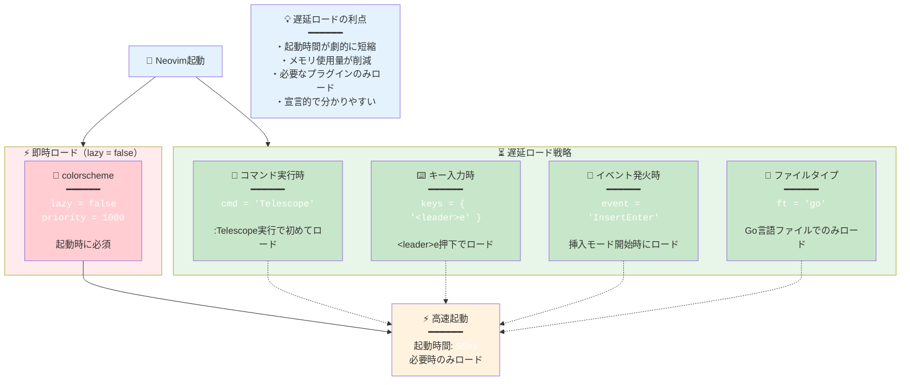
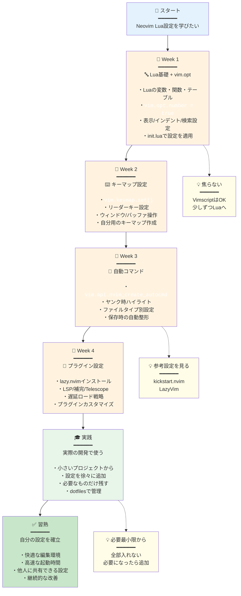

## この記事の対象読者

- Neovimを使い始めたけど、Lua設定がよく分からない人
- Vimscriptから移行したいけど、Luaの書き方が分からない人
- LazyVimなどのフレームワークを使っているけど、中身を理解したい人
- Neovim設定を一から構築したい人

この記事では、**Neovim Lua設定の基礎から実践まで**、覚えるべきすべてを網羅します。

---

## なぜLuaなのか？

### VimscriptとLuaの比較

| 特徴 | Vimscript | Lua |
|------|-----------|-----|
| **実行速度** | 遅い | 高速（LuaJIT） |
| **可読性** | 独特の文法 | 一般的なプログラミング言語 |
| **エコシステム** | Vim専用 | 汎用言語（学習が活きる） |
| **非同期処理** | 複雑 | シンプル |
| **型システム** | なし | 動的型付け |

### Neovim 0.5以降の方針

Neovim 0.5から、**Luaがファーストクラスの設定言語**になりました。

```
~/.config/nvim/
├── init.lua          ← メインの設定ファイル（Luaで書く）
├── lua/
│   ├── options.lua   ← vim.opt設定
│   ├── keymaps.lua   ← キーマップ
│   ├── autocmds.lua  ← 自動コマンド
│   └── plugins/      ← プラグイン設定
```



---

## Lua基礎：Neovimで使う最小限の知識

### 変数と型

```lua
-- 変数定義（local推奨）
local name = "Neovim"
local version = 0.9
local is_awesome = true

-- テーブル（配列とハッシュマップ両方に使う）
local array = { "a", "b", "c" }
local hash = { key1 = "value1", key2 = "value2" }

-- アクセス
print(array[1])        -- "a" （1始まり！）
print(hash.key1)       -- "value1"
print(hash["key1"])    -- "value1"（同じ）
```

### 条件分岐

```lua
if vim.fn.has("mac") == 1 then
  print("macOS")
elseif vim.fn.has("unix") == 1 then
  print("Linux")
else
  print("Windows")
end

-- 三項演算子的な書き方
local result = condition and "true_value" or "false_value"
```

### ループ

```lua
-- 配列のループ
for index, value in ipairs(array) do
  print(index, value)
end

-- ハッシュマップのループ
for key, value in pairs(hash) do
  print(key, value)
end

-- 数値ループ
for i = 1, 10 do
  print(i)
end
```

### 関数

```lua
-- 関数定義
local function greet(name)
  return "Hello, " .. name  -- 文字列結合は ..
end

-- 無名関数
local square = function(x)
  return x * x
end

-- 呼び出し
print(greet("Neovim"))
```

### モジュール

```lua
-- lua/mymodule.lua
local M = {}

M.hello = function()
  print("Hello from module")
end

return M

-- init.lua
local mymodule = require("mymodule")
mymodule.hello()
```

---

## Neovim API概要

### 3つの主要な名前空間

```lua
-- 1. vim.opt - オプション設定（:set相当）
vim.opt.number = true

-- 2. vim.api - Neovim Core API（低レベル）
vim.api.nvim_set_keymap('n', '<leader>w', ':w<CR>', { noremap = true })

-- 3. vim.fn - Vimの関数を呼び出す
local current_file = vim.fn.expand('%')
```

### よく使うAPI一覧

| API | 用途 |
|-----|------|
| `vim.opt` | オプション設定 |
| `vim.g` | グローバル変数 |
| `vim.keymap.set()` | キーマップ設定 |
| `vim.api.nvim_create_autocmd()` | 自動コマンド |
| `vim.cmd()` | Vimコマンド実行 |
| `vim.fn` | Vim関数呼び出し |
| `vim.loop` | 非同期処理（libuv） |



---

## vim.opt：覚えるべきすべてのオプション

### 基本的な書き方

```lua
-- 旧: :set number
-- 新: vim.opt.number = true
vim.opt.number = true

-- 旧: :set tabstop=2
-- 新: vim.opt.tabstop = 2
vim.opt.tabstop = 2

-- 旧: :set nobackup
-- 新: vim.opt.backup = false
vim.opt.backup = false
```

### オプションの種類

```lua
-- 1. ブール値
vim.opt.number = true           -- 行番号表示
vim.opt.relativenumber = true   -- 相対行番号

-- 2. 数値
vim.opt.tabstop = 2             -- タブの幅
vim.opt.shiftwidth = 2          -- インデント幅

-- 3. 文字列
vim.opt.encoding = "utf-8"      -- エンコーディング

-- 4. リスト（append/prepend/remove可能）
vim.opt.iskeyword:append("-")   -- 単語区切り文字に-を追加
```

### 完全なオプション設定例

```lua
-- lua/options.lua

local opt = vim.opt

-- 1. 表示設定
opt.number = true                 -- 行番号表示
opt.relativenumber = true         -- 相対行番号
opt.cursorline = true             -- カーソル行ハイライト
opt.signcolumn = "yes"            -- サインカラムを常に表示
opt.wrap = false                  -- 行の折り返しなし
opt.scrolloff = 8                 -- スクロール時の余白
opt.sidescrolloff = 8             -- 横スクロール時の余白
opt.colorcolumn = "80"            -- 80文字目に線を表示

-- 2. インデント設定
opt.expandtab = true              -- タブをスペースに変換
opt.tabstop = 2                   -- タブ幅
opt.shiftwidth = 2                -- インデント幅
opt.softtabstop = 2               -- タブキー押下時の幅
opt.autoindent = true             -- 自動インデント
opt.smartindent = true            -- スマートインデント

-- 3. 検索設定
opt.ignorecase = true             -- 大文字小文字を無視
opt.smartcase = true              -- 大文字が含まれる場合は区別
opt.hlsearch = true               -- 検索結果をハイライト
opt.incsearch = true              -- インクリメンタル検索

-- 4. ファイル設定
opt.backup = false                -- バックアップファイルを作らない
opt.writebackup = false           -- 保存時にバックアップを作らない
opt.swapfile = false              -- スワップファイルを作らない
opt.undofile = true               -- undoファイルを作る
opt.undodir = vim.fn.stdpath("data") .. "/undo"  -- undoファイルの保存先

-- 5. エディタ挙動
opt.mouse = "a"                   -- マウス有効化
opt.clipboard = "unnamedplus"     -- システムクリップボード連携
opt.timeoutlen = 300              -- キーマップのタイムアウト
opt.updatetime = 250              -- スワップファイル書き込み間隔
opt.splitright = true             -- 縦分割時に右に開く
opt.splitbelow = true             -- 横分割時に下に開く
opt.termguicolors = true          -- True Colorサポート

-- 6. 補完設定
opt.completeopt = { "menu", "menuone", "noselect" }  -- 補完メニューの挙動

-- 7. その他
opt.showmode = false              -- モード表示を消す（ステータスラインで表示するため）
opt.hidden = true                 -- 編集中でもバッファ切り替え可能
opt.fileencoding = "utf-8"        -- ファイルエンコーディング
```

### オプションの種類別メソッド

```lua
-- append（追加）
vim.opt.iskeyword:append("-")     -- 単語区切りに-を追加

-- prepend（前に追加）
vim.opt.path:prepend(".")         -- カレントディレクトリを検索パスの先頭に

-- remove（削除）
vim.opt.iskeyword:remove("_")     -- 単語区切りから_を削除

-- get（取得）
local current_tab = vim.opt.tabstop:get()
```

---

## vim.keymap.set：キーマップ設定

### 基本的な書き方

```lua
-- vim.keymap.set(mode, lhs, rhs, opts)
-- mode: モード（n=ノーマル, i=インサート, v=ビジュアル, x=ビジュアルモードのみ）
-- lhs: 入力キー
-- rhs: 実行内容
-- opts: オプション（noremap, silent等）

vim.keymap.set('n', '<leader>w', ':w<CR>', { noremap = true, silent = true })
```

### モード一覧

```lua
-- 'n'  - ノーマルモード
-- 'i'  - インサートモード
-- 'v'  - ビジュアル + セレクトモード
-- 'x'  - ビジュアルモードのみ
-- 't'  - ターミナルモード
-- 'c'  - コマンドラインモード
-- ''   - ノーマル + ビジュアル + セレクト + オペレータペンディング
-- '!'  - インサート + コマンドライン

-- 複数モードを配列で指定
vim.keymap.set({'n', 'v'}, '<leader>y', '"+y')  -- ノーマルとビジュアルで共通
```



### オプション

```lua
local opts = {
  noremap = true,    -- 再マップを無効化（ほぼ常にtrue）
  silent = true,     -- コマンドラインに表示しない
  expr = false,      -- 式として評価
  buffer = nil,      -- バッファローカル（数値でバッファ番号指定）
  desc = "説明文"     -- キーマップの説明（which-key等で表示）
}

vim.keymap.set('n', '<leader>w', ':w<CR>', opts)
```

### 実践的なキーマップ例

```lua
-- lua/keymaps.lua

local keymap = vim.keymap.set
local opts = { noremap = true, silent = true }

-- 1. リーダーキー設定
vim.g.mapleader = " "        -- スペースをリーダーキーに
vim.g.maplocalleader = " "

-- 2. 基本操作
keymap('n', '<leader>w', ':w<CR>', opts)                    -- 保存
keymap('n', '<leader>q', ':q<CR>', opts)                    -- 終了
keymap('n', '<leader>x', ':x<CR>', opts)                    -- 保存して終了
keymap('n', '<Esc>', ':nohlsearch<CR>', opts)               -- 検索ハイライト解除

-- 3. ウィンドウ操作
keymap('n', '<C-h>', '<C-w>h', opts)                        -- 左のウィンドウへ
keymap('n', '<C-j>', '<C-w>j', opts)                        -- 下のウィンドウへ
keymap('n', '<C-k>', '<C-w>k', opts)                        -- 上のウィンドウへ
keymap('n', '<C-l>', '<C-w>l', opts)                        -- 右のウィンドウへ
keymap('n', '<leader>sv', ':vsplit<CR>', opts)              -- 縦分割
keymap('n', '<leader>sh', ':split<CR>', opts)               -- 横分割

-- 4. バッファ操作
keymap('n', '<S-h>', ':bprevious<CR>', opts)                -- 前のバッファ
keymap('n', '<S-l>', ':bnext<CR>', opts)                    -- 次のバッファ
keymap('n', '<leader>bd', ':bdelete<CR>', opts)             -- バッファ削除

-- 5. テキスト操作
keymap('v', '<', '<gv', opts)                               -- インデント（選択を維持）
keymap('v', '>', '>gv', opts)                               -- インデント（選択を維持）
keymap('v', 'J', ":m '>+1<CR>gv=gv", opts)                  -- 行を下に移動
keymap('v', 'K', ":m '<-2<CR>gv=gv", opts)                  -- 行を上に移動

-- 6. クリップボード連携
keymap({'n', 'v'}, '<leader>y', '"+y', opts)                -- システムクリップボードにコピー
keymap('n', '<leader>Y', '"+Y', opts)                       -- 行をコピー
keymap({'n', 'v'}, '<leader>p', '"+p', opts)                -- システムクリップボードから貼り付け

-- 7. 検索・置換
keymap('n', '<leader>s', ':%s/', { noremap = true })        -- 置換コマンド開始
keymap('v', '<leader>s', ':s/', { noremap = true })         -- 選択範囲で置換

-- 8. ターミナル
keymap('t', '<Esc>', '<C-\\><C-n>', opts)                   -- ターミナルモードを抜ける

-- 9. 関数を使ったキーマップ
keymap('n', '<leader>ff', function()
  require('telescope.builtin').find_files()
end, { desc = 'Find files' })

-- 10. バッファローカルなキーマップ（特定のバッファでのみ有効）
vim.api.nvim_create_autocmd('FileType', {
  pattern = 'lua',
  callback = function()
    keymap('n', '<leader>r', ':luafile %<CR>', { buffer = true, desc = 'Run Lua file' })
  end,
})
```

---

## vim.api.nvim_create_autocmd：自動コマンド

### 基本的な書き方

```lua
-- vim.api.nvim_create_autocmd(event, opts)
vim.api.nvim_create_autocmd("BufWritePre", {
  pattern = "*.lua",
  callback = function()
    -- Lua保存時に実行する処理
    print("Lua file saved!")
  end,
})
```

### イベント一覧

```lua
-- ファイル操作
BufNewFile       -- 新しいバッファ作成
BufRead          -- バッファ読み込み
BufReadPost      -- バッファ読み込み後
BufEnter         -- バッファに入った時
BufLeave         -- バッファから出る時
BufWritePre      -- 保存前
BufWritePost     -- 保存後
BufDelete        -- バッファ削除

-- ファイルタイプ
FileType         -- ファイルタイプ設定時

-- UI
VimEnter         -- Vim起動時
VimLeave         -- Vim終了時
WinEnter         -- ウィンドウに入った時
InsertEnter      -- インサートモード開始
InsertLeave      -- インサートモード終了

-- その他
TextYankPost     -- テキストをヤンク（コピー）した時
LspAttach        -- LSPがアタッチした時
```



```mermaid
flowchart LR
    subgraph Startup["🚀 起動時"]
        VimEnter["VimEnter<br/>━━━━━━<br/>Vim起動完了"]
    end

    subgraph FileOpen["📂 ファイルを開く"]
        BufRead["BufRead<br/>━━━━━━<br/>バッファ読み込み"]
        BufReadPost["BufReadPost<br/>━━━━━━<br/>読み込み後<br/><br/>最後の位置に戻る"]
        FileType["FileType<br/>━━━━━━<br/>タイプ判定<br/><br/>言語別設定"]
        BufEnter["BufEnter<br/>━━━━━━<br/>バッファ表示"]
    end

    subgraph Edit["✏️ 編集"]
        InsertEnter["InsertEnter<br/>━━━━━━<br/>挿入開始"]
        InsertLeave["InsertLeave<br/>━━━━━━<br/>挿入終了<br/><br/>自動保存"]
        TextYankPost["TextYankPost<br/>━━━━━━<br/>ヤンク時<br/><br/>ハイライト"]
    end

    subgraph Save["💾 保存"]
        BufWritePre["BufWritePre<br/>━━━━━━<br/>保存前<br/><br/>末尾空白削除"]
        BufWritePost["BufWritePost<br/>━━━━━━<br/>保存後"]
    end

    subgraph Close["🚪 終了"]
        BufLeave["BufLeave<br/>━━━━━━<br/>バッファ退出"]
        VimLeave["VimLeave<br/>━━━━━━<br/>Vim終了"]
    end

    Startup --> FileOpen
    FileOpen --> Edit
    Edit --> Save
    Save --> Close

    VimEnter --> BufRead
    BufRead --> BufReadPost
    BufReadPost --> FileType
    FileType --> BufEnter

    BufEnter --> InsertEnter
    InsertEnter --> InsertLeave
    InsertLeave --> TextYankPost

    TextYankPost --> BufWritePre
    BufWritePre --> BufWritePost

    BufWritePost --> BufLeave
    BufLeave --> VimLeave

    style Startup fill:#e3f2fd
    style FileOpen fill:#fff3e0
    style Edit fill:#e8f5e9
    style Save fill:#ffe0b2
    style Close fill:#ffcdd2
```

### 実践的な自動コマンド例

```lua
-- lua/autocmds.lua

local autocmd = vim.api.nvim_create_autocmd
local augroup = vim.api.nvim_create_augroup

-- 1. ハイライトグループ（自動コマンドをグループ化）
local general = augroup('General', { clear = true })

-- 2. ヤンク時にハイライト
autocmd('TextYankPost', {
  group = general,
  callback = function()
    vim.highlight.on_yank({ higroup = 'IncSearch', timeout = 200 })
  end,
  desc = 'Highlight on yank',
})

-- 3. ファイルタイプ別の設定
autocmd('FileType', {
  pattern = { 'json', 'jsonc' },
  callback = function()
    vim.opt_local.shiftwidth = 2
    vim.opt_local.tabstop = 2
  end,
  desc = 'JSON indent 2 spaces',
})

-- 4. 保存時に末尾の空白を削除
autocmd('BufWritePre', {
  group = general,
  pattern = '*',
  callback = function()
    local save_cursor = vim.fn.getpos('.')
    vim.cmd([[%s/\s\+$//e]])
    vim.fn.setpos('.', save_cursor)
  end,
  desc = 'Remove trailing whitespace on save',
})

-- 5. 最後に開いていた位置に戻る
autocmd('BufReadPost', {
  group = general,
  callback = function()
    local mark = vim.api.nvim_buf_get_mark(0, '"')
    local lcount = vim.api.nvim_buf_line_count(0)
    if mark[1] > 0 and mark[1] <= lcount then
      pcall(vim.api.nvim_win_set_cursor, 0, mark)
    end
  end,
  desc = 'Go to last cursor position',
})

-- 6. ターミナルモードの設定
autocmd('TermOpen', {
  group = general,
  callback = function()
    vim.opt_local.number = false
    vim.opt_local.relativenumber = false
    vim.cmd('startinsert')
  end,
  desc = 'Terminal settings',
})

-- 7. LSPがアタッチした時のキーマップ
autocmd('LspAttach', {
  group = general,
  callback = function(args)
    local bufnr = args.buf
    local opts = { buffer = bufnr }

    vim.keymap.set('n', 'gd', vim.lsp.buf.definition, opts)
    vim.keymap.set('n', 'K', vim.lsp.buf.hover, opts)
    vim.keymap.set('n', 'gr', vim.lsp.buf.references, opts)
    vim.keymap.set('n', '<leader>rn', vim.lsp.buf.rename, opts)
  end,
  desc = 'LSP keymaps',
})

-- 8. ウィンドウサイズ自動調整
autocmd('VimResized', {
  group = general,
  callback = function()
    vim.cmd('wincmd =')
  end,
  desc = 'Auto resize windows',
})

-- 9. 特定のファイルで自動保存
local autosave = augroup('AutoSave', { clear = true })
autocmd({ 'InsertLeave', 'TextChanged' }, {
  group = autosave,
  pattern = { '*.md', '*.txt' },
  callback = function()
    if vim.fn.expand('%') ~= '' then
      vim.cmd('silent! write')
    end
  end,
  desc = 'Auto save markdown and text files',
})

-- 10. 大きなファイルの最適化
autocmd('BufReadPre', {
  group = general,
  callback = function()
    local ok, stats = pcall(vim.loop.fs_stat, vim.api.nvim_buf_get_name(0))
    if ok and stats and stats.size > 1000000 then  -- 1MB以上
      vim.opt_local.eventignore:append('FileType')
      vim.opt_local.undolevels = -1
      vim.opt_local.syntax = 'off'
    end
  end,
  desc = 'Optimize large files',
})
```

---

## プラグイン設定：lazy.nvim

### lazy.nvimとは

**lazy.nvim**は、モダンなNeovimプラグインマネージャーです。

- **遅延ロード**：必要になるまでプラグインを読み込まない
- **高速起動**：起動時間を劇的に短縮
- **宣言的設定**：Luaテーブルで設定を記述

### インストール

```lua
-- init.lua

-- lazy.nvim自身のブートストラップ
local lazypath = vim.fn.stdpath("data") .. "/lazy/lazy.nvim"
if not vim.loop.fs_stat(lazypath) then
  vim.fn.system({
    "git",
    "clone",
    "--filter=blob:none",
    "https://github.com/folke/lazy.nvim.git",
    "--branch=stable",
    lazypath,
  })
end
vim.opt.rtp:prepend(lazypath)

-- プラグインの読み込み
require("lazy").setup("plugins")
```

### プラグイン設定の基本

```lua
-- lua/plugins/example.lua

return {
  -- 1. シンプルな例
  "nvim-lua/plenary.nvim",

  -- 2. 設定付き
  {
    "nvim-treesitter/nvim-treesitter",
    build = ":TSUpdate",  -- インストール後に実行
    config = function()
      require('nvim-treesitter.configs').setup({
        ensure_installed = { "lua", "vim", "javascript" },
        highlight = { enable = true },
      })
    end,
  },

  -- 3. 遅延ロード（コマンド実行時）
  {
    "nvim-telescope/telescope.nvim",
    cmd = "Telescope",  -- Telescopeコマンド実行時にロード
    dependencies = { "nvim-lua/plenary.nvim" },
    config = function()
      require('telescope').setup({})
    end,
  },

  -- 4. 遅延ロード（キー入力時）
  {
    "nvim-tree/nvim-tree.lua",
    keys = {
      { "<leader>e", "<cmd>NvimTreeToggle<cr>", desc = "Explorer" },
    },
  },

  -- 5. 遅延ロード（イベント）
  {
    "numToStr/Comment.nvim",
    event = "VeryLazy",  -- 遅延ロード
    config = function()
      require('Comment').setup()
    end,
  },

  -- 6. ファイルタイプ別ロード
  {
    "fatih/vim-go",
    ft = "go",  -- Goファイルを開いた時のみロード
  },

  -- 7. 条件付きロード
  {
    "nvim-tree/nvim-web-devicons",
    enabled = vim.fn.has("mac") == 1,  -- macOSでのみ有効
  },
}
```



### 実践的なプラグイン構成例

```lua
-- lua/plugins/colorscheme.lua
return {
  {
    "folke/tokyonight.nvim",
    lazy = false,  -- 起動時にロード
    priority = 1000,  -- 優先度高（他より先にロード）
    config = function()
      vim.cmd([[colorscheme tokyonight]])
    end,
  },
}

-- lua/plugins/lsp.lua
return {
  {
    "neovim/nvim-lspconfig",
    event = { "BufReadPre", "BufNewFile" },
    dependencies = {
      "williamboman/mason.nvim",
      "williamboman/mason-lspconfig.nvim",
    },
    config = function()
      require("mason").setup()
      require("mason-lspconfig").setup({
        ensure_installed = { "lua_ls", "tsserver" },
      })

      local lspconfig = require("lspconfig")
      lspconfig.lua_ls.setup({})
      lspconfig.tsserver.setup({})
    end,
  },
}

-- lua/plugins/completion.lua
return {
  {
    "hrsh7th/nvim-cmp",
    event = "InsertEnter",
    dependencies = {
      "hrsh7th/cmp-nvim-lsp",
      "hrsh7th/cmp-buffer",
      "hrsh7th/cmp-path",
      "L3MON4D3/LuaSnip",
    },
    config = function()
      local cmp = require("cmp")
      cmp.setup({
        mapping = {
          ['<C-n>'] = cmp.mapping.select_next_item(),
          ['<C-p>'] = cmp.mapping.select_prev_item(),
          ['<CR>'] = cmp.mapping.confirm({ select = true }),
        },
        sources = {
          { name = 'nvim_lsp' },
          { name = 'buffer' },
          { name = 'path' },
        },
      })
    end,
  },
}
```

---

## 実践的な設定例

### 完全なディレクトリ構成

```
~/.config/nvim/
├── init.lua                 # エントリーポイント
├── lua/
│   ├── config/
│   │   ├── options.lua      # vim.opt設定
│   │   ├── keymaps.lua      # キーマップ
│   │   └── autocmds.lua     # 自動コマンド
│   └── plugins/
│       ├── colorscheme.lua  # カラースキーム
│       ├── treesitter.lua   # Treesitter
│       ├── lsp.lua          # LSP
│       ├── completion.lua   # 補完
│       ├── telescope.lua    # ファジーファインダー
│       └── ui.lua           # UI系プラグイン
```

### init.lua

```lua
-- init.lua

-- lazy.nvimのブートストラップ
local lazypath = vim.fn.stdpath("data") .. "/lazy/lazy.nvim"
if not vim.loop.fs_stat(lazypath) then
  vim.fn.system({
    "git", "clone", "--filter=blob:none",
    "https://github.com/folke/lazy.nvim.git",
    "--branch=stable",
    lazypath,
  })
end
vim.opt.rtp:prepend(lazypath)

-- 基本設定の読み込み
require("config.options")
require("config.keymaps")
require("config.autocmds")

-- プラグインの読み込み
require("lazy").setup("plugins", {
  checker = { enabled = true },  -- 更新チェック
  performance = {
    rtp = {
      disabled_plugins = {
        "gzip",
        "netrwPlugin",
        "tarPlugin",
        "tohtml",
        "tutor",
        "zipPlugin",
      },
    },
  },
})
```

### lua/config/options.lua

```lua
-- lua/config/options.lua

local opt = vim.opt

-- 表示
opt.number = true
opt.relativenumber = true
opt.cursorline = true
opt.signcolumn = "yes"
opt.wrap = false
opt.scrolloff = 8
opt.termguicolors = true

-- インデント
opt.expandtab = true
opt.tabstop = 2
opt.shiftwidth = 2
opt.smartindent = true

-- 検索
opt.ignorecase = true
opt.smartcase = true
opt.hlsearch = true

-- ファイル
opt.backup = false
opt.swapfile = false
opt.undofile = true

-- その他
opt.clipboard = "unnamedplus"
opt.mouse = "a"
opt.splitright = true
opt.splitbelow = true
```

### lua/config/keymaps.lua

```lua
-- lua/config/keymaps.lua

local keymap = vim.keymap.set
vim.g.mapleader = " "

-- 基本操作
keymap('n', '<leader>w', ':w<CR>')
keymap('n', '<leader>q', ':q<CR>')

-- ウィンドウ移動
keymap('n', '<C-h>', '<C-w>h')
keymap('n', '<C-j>', '<C-w>j')
keymap('n', '<C-k>', '<C-w>k')
keymap('n', '<C-l>', '<C-w>l')

-- バッファ移動
keymap('n', '<S-h>', ':bprevious<CR>')
keymap('n', '<S-l>', ':bnext<CR>')
```

### 設定のデバッグ

```lua
-- エラーが出た時の確認方法

-- 1. Luaの構文エラーチェック
:luafile %

-- 2. プラグインのロード状況確認
:Lazy

-- 3. オプションの値確認
:lua print(vim.inspect(vim.opt.tabstop:get()))

-- 4. キーマップの確認
:nmap <leader>

-- 5. 自動コマンドの確認
:autocmd
```

---

## よくある質問

### Q1: VimscriptとLuaを混在させられる？

**A: 可能です。**

```lua
-- init.lua でVimscriptを実行
vim.cmd([[
  set number
  nnoremap <leader>w :w<CR>
]])

-- または
vim.cmd("set number")
```

### Q2: グローバル変数の設定方法は？

```lua
-- グローバル変数
vim.g.mapleader = " "
vim.g.loaded_netrw = 1  -- netrwを無効化

-- バッファローカル変数
vim.b.did_ftplugin = 1

-- ウィンドウローカル変数
vim.w.quickfix_title = "My Quickfix"
```

### Q3: Vimコマンドを実行したい

```lua
-- 1つのコマンド
vim.cmd("colorscheme tokyonight")

-- 複数行
vim.cmd([[
  highlight Normal guibg=NONE
  highlight NormalFloat guibg=NONE
]])

-- または
vim.api.nvim_command("colorscheme tokyonight")
```

### Q4: Vimの関数を呼び出したい

```lua
-- vim.fn.{function_name}
local current_file = vim.fn.expand('%')
local file_exists = vim.fn.filereadable('README.md')
local lines = vim.fn.getline(1, 10)
```

### Q5: エラー処理はどうする？

```lua
-- pcall（protected call）を使う
local ok, result = pcall(function()
  return require("nonexistent_module")
end)

if not ok then
  print("Error:", result)
end

-- 実践例：プラグインが存在するか確認
local status_ok, telescope = pcall(require, "telescope")
if not status_ok then
  return
end

telescope.setup({})
```

---

## まとめ

### 最小限覚えるべきこと

| カテゴリ | 内容 |
|----------|------|
| **オプション** | `vim.opt.{option} = value` |
| **キーマップ** | `vim.keymap.set(mode, key, action, opts)` |
| **自動コマンド** | `vim.api.nvim_create_autocmd(event, opts)` |
| **プラグイン** | `lazy.nvim`で宣言的に設定 |

### 学習ロードマップ

1. **Week 1**: Lua基礎 + vim.opt設定
2. **Week 2**: キーマップ設定
3. **Week 3**: 自動コマンド設定
4. **Week 4**: プラグイン設定（lazy.nvim）



### 次のステップ

- [Neovim公式ドキュメント](https://neovim.io/doc/)
- [lazy.nvim](https://github.com/folke/lazy.nvim)
- [kickstart.nvim](https://github.com/nvim-lua/kickstart.nvim)（参考設定）
- [LazyVim](https://www.lazyvim.org/)（フレームワーク）

---

**Neovim Lua設定は一度覚えれば、快適な編集環境を自由にカスタマイズできます。**

少しずつ、必要なものから追加していきましょう。
