## はじめに：テストを書かない勇気、ありますか？

**「テスト書く時間があったら機能開発したい」**

この言葉、何回聞いただろう。そして何回言っただろう。

でも考えてみてほしい。

深夜2時、本番障害の電話で叩き起こされる。原因は「誰かが3ヶ月前に入れた小さな修正」。影響範囲がわからない。どこまで直せばいいかわからない。そして朝まで格闘する。

**その「小さな修正」に、テストがあったら？**

この記事は、「テストなんて必要ない」と思っているあなたに向けて書いた。

読み終わる頃には、「テストを書かない勇気」がなくなっているはずだ。

---

## 1. ユニットテストの歴史 / History of Unit Testing

### なぜテストは「当たり前」になったのか

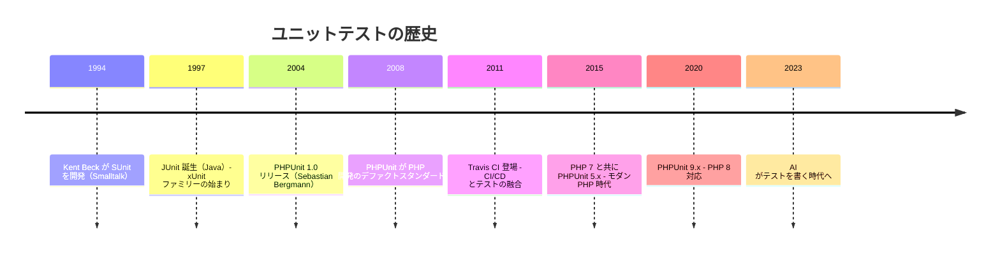

#### SUnit から始まった「自動テスト」の概念

1994年、Kent Beck は Smalltalk で **SUnit** を開発した。これが全ての始まり。

彼の考えはシンプルだった：

> **「手動でテストするのは面倒。だからコードでテストを書こう」**

この考えが Java の **JUnit**（1997年）に受け継がれ、そこから **xUnit ファミリー** として世界中の言語に広がった。

- NUnit（.NET）
- PyUnit / pytest（Python）
- RSpec（Ruby）
- **PHPUnit**（PHP）

### 欧米と日本の文化差

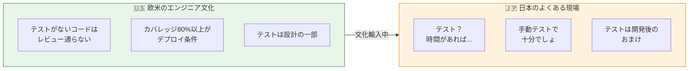

**欧米の開発現場では：**
- テストがないPRは **マージされない**
- "Test coverage is a first-class citizen"（カバレッジは一級市民）
- CI/CDでテストが通らないと **デプロイできない**

**日本の多くの現場では：**
- テストは「余裕があれば書く」もの
- 「動けばOK」の文化が根強い
- テストを書く人が「変わり者」扱い

でも、これは **変わりつつある**。

大手企業も、スタートアップも、テストの重要性に気づき始めている。この記事を読んでいるあなたも、その一人だ。

---

## 2. なぜPHPでユニットテストが必要なのか / Why Unit Testing Matters in PHP

### 実務で感じる3つのメリット

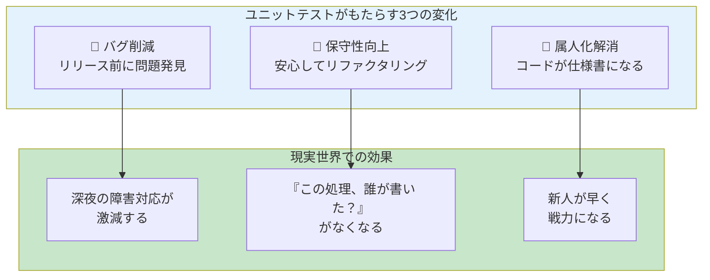

#### 1. バグ削減：リリース前に問題を発見

```php
// テストがない世界
function calculateTax(int $price): int
{
    return $price * 0.1; // float が返る！int を期待しているのに...
}

// 本番で発覚: "Price must be integer, float given"
```

テストがあれば、**リリース前に気づける**。

#### 2. 保守性向上：安心してリファクタリング

レガシーコードを触るとき、こう思ったことはないか？

> 「この処理、直したいけど...他に影響あったらどうしよう...」

テストがあれば、**壊したらすぐわかる**。安心して直せる。

#### 3. 属人化解消：コードが仕様書になる

```php
public function testユーザーは1日3回までしかログインできない(): void
{
    // このテスト名が仕様書になる
}
```

テストを読めば、**そのコードが何をすべきか** がわかる。

### 「レビューが優しくなる」という副作用

テストがあるPRのレビューは、圧倒的に楽になる。

```
// テストなしPRのレビュー
「この条件分岐、全パターン手動で確認した？」
「境界値は？」
「既存機能への影響は？」

// テストありPRのレビュー
「テスト通ってるね、LGTM」
```

### 名言：テストは未来の自分へのラブレター

> **"A test is a love letter to the future."**
> （テストは未来へのラブレター）
> — Sandi Metz

今日書いたテストは、**3ヶ月後の自分** を救う。

6ヶ月後に「誰だこのコード書いたの...あ、俺か」となったとき、テストがあれば **何を壊してはいけないか** がわかる。

---

## 3. どこまでテストするべきか / What to Test and What Not To

### テストピラミッド：優先順位の考え方

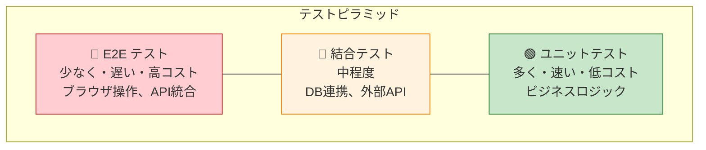

| テスト種類 | 速度 | コスト | 安定性 | 書くべき量 |
|-----------|------|--------|--------|-----------|
| **ユニットテスト** | 超速い | 低い | 高い | 多く |
| **結合テスト** | 普通 | 中程度 | 中程度 | 適度に |
| **E2Eテスト** | 遅い | 高い | 低い | 最小限 |

### 守るべきは「ビジネスロジック」

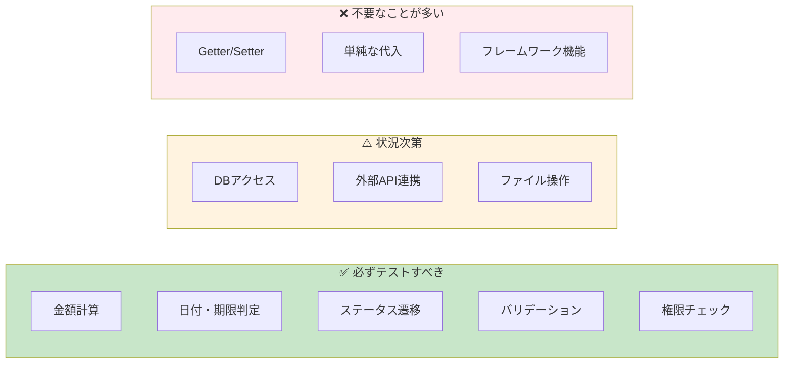

#### テストすべき：「壊れたら困る順」

1. **金額計算** — 1円でも間違えたら大問題
2. **日付・期限判定** — 月末処理、閏年、タイムゾーン
3. **ステータス遷移** — 不正な遷移を許可したら大惨事
4. **バリデーション** — セキュリティに直結
5. **権限チェック** — 情報漏洩のリスク

#### テスト不要：Getter/Setter

```php
// これにテストは不要
public function getName(): string
{
    return $this->name;
}

public function setName(string $name): void
{
    $this->name = $name;
}
```

ロジックがないものにテストを書いても、**メンテナンスコストが増えるだけ**。

### カバレッジ目標：「怖いところ80%、全体50%で十分」

| 対象 | 目標カバレッジ | 理由 |
|-----|---------------|------|
| **ビジネスロジック** | 80%以上 | 壊れたら困る |
| **ユーティリティ** | 60%程度 | よく使われる |
| **コントローラー** | 30%程度 | 結合テストで補完 |
| **全体** | 50%程度 | 現実的な目標 |

> **100%を目指すな。80%で十分。**
>
> 残りの20%を埋めるコストは、最初の80%の3倍かかる。

---

## 4. テスト文化がない会社での導入ロードマップ / Roadmap for Test-less Companies

### 現実的な導入ステップ

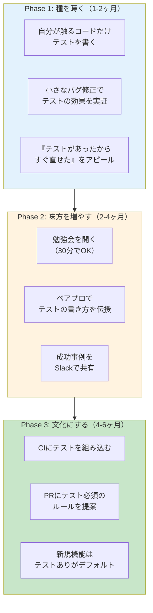

### Phase 1：まず「自分だけ」始める

```php
// 修正前：バグ報告が来た
class PriceCalculator
{
    public function calculate(int $basePrice, int $quantity): int
    {
        return $basePrice * $quantity; // 消費税忘れてた！
    }
}

// 修正と同時にテストを追加
class PriceCalculatorTest extends TestCase
{
    public function test消費税込みの金額が計算される(): void
    {
        $calculator = new PriceCalculator();

        // 100円 × 10個 × 1.1 = 1100円
        $this->assertSame(1100, $calculator->calculate(100, 10));
    }
}
```

修正の報告時に、こう言う：

> 「テストも追加したので、**同じバグは二度と起きません**」

### Phase 2：「あの人もやってる」を作る

勉強会で話すこと（30分版）：

1. **なぜテストか**（5分）— バグ再発防止の話
2. **簡単なデモ**（15分）— 実際にテストを書いて動かす
3. **質疑応答**（10分）— 「時間かかるでしょ？」への回答

### Phase 3：仕組みにする

CIにテストを組み込めば、**個人の努力から組織の仕組み** になる。

```yaml
# .github/workflows/test.yml
name: PHPUnit Tests

on: [push, pull_request]

jobs:
  test:
    runs-on: ubuntu-latest
    steps:
      - uses: actions/checkout@v4
      - name: Setup PHP
        uses: shivammathur/setup-php@v2
        with:
          php-version: '8.3'
      - name: Install dependencies
        run: composer install
      - name: Run tests
        run: vendor/bin/phpunit
```

### マネージャー向け：費用対効果説明テンプレート

```markdown
## ユニットテスト導入の費用対効果

### 現状の問題
- 月平均 X 件の本番バグ
- バグ対応に平均 Y 時間/件
- 年間コスト: X × Y × 12 × 時給 = **約 Z 万円**

### テスト導入後の予測
- バグ 50% 削減（業界平均）
- 年間削減: Z × 0.5 = **約 W 万円**

### 導入コスト
- 初期学習: 1人 × 40時間
- 既存コードへの追加: 段階的に実施（通常業務内）

### 結論
**3ヶ月で投資回収、以降は純粋なコスト削減**
```

---

## 5. PHP特有のテスト観点 / PHP-Specific Testing Concerns

### よくある「罠」とテストケース

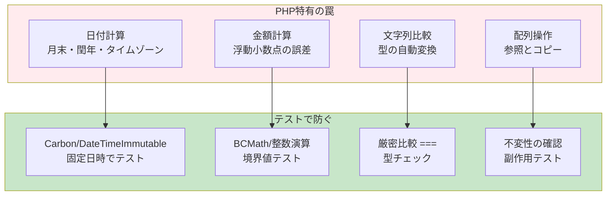

### 日付計算の罠

```php
class SubscriptionService
{
    public function calculateExpiryDate(DateTimeImmutable $startDate): DateTimeImmutable
    {
        // 1ヶ月後を計算
        return $startDate->modify('+1 month');
    }
}

class SubscriptionServiceTest extends TestCase
{
    public function test月末の1ヶ月後が正しく計算される(): void
    {
        $service = new SubscriptionService();

        // 1月31日の1ヶ月後は2月28日（閏年でない場合）
        $start = new DateTimeImmutable('2025-01-31');
        $expiry = $service->calculateExpiryDate($start);

        // 注意: 2月31日にはならない！
        $this->assertSame('2025-02-28', $expiry->format('Y-m-d'));
    }

    public function test閏年の2月末が正しく処理される(): void
    {
        $service = new SubscriptionService();

        // 2024年（閏年）の1月31日 → 2月29日
        $start = new DateTimeImmutable('2024-01-31');
        $expiry = $service->calculateExpiryDate($start);

        $this->assertSame('2024-02-29', $expiry->format('Y-m-d'));
    }
}
```

### 金額計算の罠

```php
// ❌ 浮動小数点の罠
$price = 0.1 + 0.2;
var_dump($price == 0.3); // false! (0.30000000000000004)

// ✅ 整数で計算（銭単位）
class MoneyCalculator
{
    /**
     * 金額を計算（引数・戻り値は銭単位の整数）
     */
    public function addTax(int $priceInSen, float $taxRate): int
    {
        return (int) round($priceInSen * (1 + $taxRate));
    }
}

class MoneyCalculatorTest extends TestCase
{
    public function test消費税10パーセントが正しく計算される(): void
    {
        $calculator = new MoneyCalculator();

        // 1000銭（10円）× 1.1 = 1100銭（11円）
        $this->assertSame(1100, $calculator->addTax(1000, 0.1));
    }

    public function test端数が正しく四捨五入される(): void
    {
        $calculator = new MoneyCalculator();

        // 105銭 × 1.1 = 115.5銭 → 116銭（四捨五入）
        $this->assertSame(116, $calculator->addTax(105, 0.1));
    }
}
```

### ステータス遷移の罠

```php
class OrderStatus
{
    public const PENDING = 'pending';
    public const PAID = 'paid';
    public const SHIPPED = 'shipped';
    public const DELIVERED = 'delivered';
    public const CANCELLED = 'cancelled';

    private const ALLOWED_TRANSITIONS = [
        self::PENDING => [self::PAID, self::CANCELLED],
        self::PAID => [self::SHIPPED, self::CANCELLED],
        self::SHIPPED => [self::DELIVERED],
        self::DELIVERED => [], // 終了状態
        self::CANCELLED => [], // 終了状態
    ];

    public function canTransitionTo(string $from, string $to): bool
    {
        return in_array($to, self::ALLOWED_TRANSITIONS[$from] ?? [], true);
    }
}

class OrderStatusTest extends TestCase
{
    private OrderStatus $status;

    protected function setUp(): void
    {
        $this->status = new OrderStatus();
    }

    /**
     * @dataProvider validTransitionsProvider
     */
    public function test有効な遷移が許可される(string $from, string $to): void
    {
        $this->assertTrue($this->status->canTransitionTo($from, $to));
    }

    public static function validTransitionsProvider(): array
    {
        return [
            '未払い→支払済' => [OrderStatus::PENDING, OrderStatus::PAID],
            '未払い→キャンセル' => [OrderStatus::PENDING, OrderStatus::CANCELLED],
            '支払済→発送済' => [OrderStatus::PAID, OrderStatus::SHIPPED],
            '発送済→配達完了' => [OrderStatus::SHIPPED, OrderStatus::DELIVERED],
        ];
    }

    /**
     * @dataProvider invalidTransitionsProvider
     */
    public function test無効な遷移が拒否される(string $from, string $to): void
    {
        $this->assertFalse($this->status->canTransitionTo($from, $to));
    }

    public static function invalidTransitionsProvider(): array
    {
        return [
            '未払い→発送済（支払いをスキップ）' => [OrderStatus::PENDING, OrderStatus::SHIPPED],
            '配達完了→キャンセル（終了状態から変更）' => [OrderStatus::DELIVERED, OrderStatus::CANCELLED],
            'キャンセル→支払済（キャンセル後の復活）' => [OrderStatus::CANCELLED, OrderStatus::PAID],
        ];
    }
}
```

---

## 6. 具体的なPHPUnit実装例 / PHPUnit Implementation Examples

### 基本構造：正常系 / 境界値 / 異常系

```php
<?php

declare(strict_types=1);

namespace App\Service;

/**
 * ユーザー登録サービス
 *
 * - ユーザー名は3〜20文字
 * - メールアドレスは有効な形式
 * - 年齢は18歳以上
 */
class UserRegistrationService
{
    public function __construct(
        private UserRepositoryInterface $userRepository,
        private EmailServiceInterface $emailService,
    ) {
    }

    /**
     * ユーザーを登録する
     *
     * @throws ValidationException バリデーションエラー
     * @throws DuplicateEmailException メールアドレス重複
     */
    public function register(string $name, string $email, int $age): User
    {
        // バリデーション
        $this->validateName($name);
        $this->validateEmail($email);
        $this->validateAge($age);

        // 重複チェック
        if ($this->userRepository->existsByEmail($email)) {
            throw new DuplicateEmailException("Email already exists: {$email}");
        }

        // ユーザー作成
        $user = new User($name, $email, $age);
        $this->userRepository->save($user);

        // ウェルカムメール送信
        $this->emailService->sendWelcomeEmail($user);

        return $user;
    }

    private function validateName(string $name): void
    {
        $length = mb_strlen($name);
        if ($length < 3 || $length > 20) {
            throw new ValidationException('Name must be 3-20 characters');
        }
    }

    private function validateEmail(string $email): void
    {
        if (!filter_var($email, FILTER_VALIDATE_EMAIL)) {
            throw new ValidationException('Invalid email format');
        }
    }

    private function validateAge(int $age): void
    {
        if ($age < 18) {
            throw new ValidationException('Must be 18 or older');
        }
    }
}
```

### テストクラス（完全版）

```php
<?php

declare(strict_types=1);

namespace Tests\Unit\Service;

use App\Entity\User;
use App\Exception\DuplicateEmailException;
use App\Exception\ValidationException;
use App\Repository\UserRepositoryInterface;
use App\Service\EmailServiceInterface;
use App\Service\UserRegistrationService;
use PHPUnit\Framework\MockObject\MockObject;
use PHPUnit\Framework\TestCase;

class UserRegistrationServiceTest extends TestCase
{
    private UserRegistrationService $service;
    private UserRepositoryInterface&MockObject $userRepository;
    private EmailServiceInterface&MockObject $emailService;

    protected function setUp(): void
    {
        // モックを作成
        $this->userRepository = $this->createMock(UserRepositoryInterface::class);
        $this->emailService = $this->createMock(EmailServiceInterface::class);

        // テスト対象のサービスを作成
        $this->service = new UserRegistrationService(
            $this->userRepository,
            $this->emailService,
        );
    }

    // ========================================
    // 正常系テスト
    // ========================================

    public function test正常なユーザーが登録できる(): void
    {
        // Arrange（準備）
        $name = 'テスト太郎';
        $email = 'test@example.com';
        $age = 25;

        $this->userRepository
            ->expects($this->once())
            ->method('existsByEmail')
            ->with($email)
            ->willReturn(false);

        $this->userRepository
            ->expects($this->once())
            ->method('save')
            ->with($this->isInstanceOf(User::class));

        $this->emailService
            ->expects($this->once())
            ->method('sendWelcomeEmail')
            ->with($this->isInstanceOf(User::class));

        // Act（実行）
        $user = $this->service->register($name, $email, $age);

        // Assert（検証）
        $this->assertSame($name, $user->getName());
        $this->assertSame($email, $user->getEmail());
        $this->assertSame($age, $user->getAge());
    }

    // ========================================
    // 境界値テスト
    // ========================================

    public function testユーザー名が3文字の場合は登録できる(): void
    {
        $this->userRepository->method('existsByEmail')->willReturn(false);

        $user = $this->service->register('abc', 'test@example.com', 18);

        $this->assertSame('abc', $user->getName());
    }

    public function testユーザー名が20文字の場合は登録できる(): void
    {
        $this->userRepository->method('existsByEmail')->willReturn(false);

        $name = str_repeat('あ', 20); // 20文字
        $user = $this->service->register($name, 'test@example.com', 18);

        $this->assertSame($name, $user->getName());
    }

    public function test年齢が18歳の場合は登録できる(): void
    {
        $this->userRepository->method('existsByEmail')->willReturn(false);

        $user = $this->service->register('テスト', 'test@example.com', 18);

        $this->assertSame(18, $user->getAge());
    }

    // ========================================
    // 異常系テスト
    // ========================================

    public function testユーザー名が2文字の場合は例外が発生する(): void
    {
        $this->expectException(ValidationException::class);
        $this->expectExceptionMessage('Name must be 3-20 characters');

        $this->service->register('ab', 'test@example.com', 18);
    }

    public function testユーザー名が21文字の場合は例外が発生する(): void
    {
        $this->expectException(ValidationException::class);
        $this->expectExceptionMessage('Name must be 3-20 characters');

        $name = str_repeat('あ', 21); // 21文字
        $this->service->register($name, 'test@example.com', 18);
    }

    public function test無効なメールアドレスの場合は例外が発生する(): void
    {
        $this->expectException(ValidationException::class);
        $this->expectExceptionMessage('Invalid email format');

        $this->service->register('テスト', 'invalid-email', 18);
    }

    /**
     * @dataProvider invalidEmailProvider
     */
    public function test様々な無効メールアドレスで例外が発生する(string $invalidEmail): void
    {
        $this->expectException(ValidationException::class);

        $this->service->register('テスト', $invalidEmail, 18);
    }

    public static function invalidEmailProvider(): array
    {
        return [
            'アットマークなし' => ['invalidemail.com'],
            'ドメインなし' => ['test@'],
            '空文字' => [''],
            'スペースのみ' => ['   '],
            '日本語メール' => ['テスト@example.com'],
        ];
    }

    public function test17歳の場合は例外が発生する(): void
    {
        $this->expectException(ValidationException::class);
        $this->expectExceptionMessage('Must be 18 or older');

        $this->service->register('テスト', 'test@example.com', 17);
    }

    public function test重複メールアドレスの場合は例外が発生する(): void
    {
        $this->userRepository
            ->method('existsByEmail')
            ->willReturn(true); // 重複あり

        $this->expectException(DuplicateEmailException::class);
        $this->expectExceptionMessage('Email already exists: test@example.com');

        $this->service->register('テスト', 'test@example.com', 18);
    }

    // ========================================
    // 副作用の検証
    // ========================================

    public function testバリデーションエラー時はDBに保存されない(): void
    {
        $this->userRepository
            ->expects($this->never())
            ->method('save');

        try {
            $this->service->register('ab', 'test@example.com', 18);
        } catch (ValidationException) {
            // 例外は期待通り
        }
    }

    public function testバリデーションエラー時はメールが送信されない(): void
    {
        $this->emailService
            ->expects($this->never())
            ->method('sendWelcomeEmail');

        try {
            $this->service->register('ab', 'test@example.com', 18);
        } catch (ValidationException) {
            // 例外は期待通り
        }
    }
}
```

### レガシーコード向け：挙動固定テスト（Golden Master Test）

```php
<?php

declare(strict_types=1);

namespace Tests\Legacy;

use App\Legacy\MysteriousCalculator;
use PHPUnit\Framework\TestCase;

/**
 * レガシーコードの挙動を固定するテスト
 *
 * 目的: リファクタリング前に「今の挙動」を記録する
 * 注意: このテストは「正しい動作」を保証するものではない
 */
class MysteriousCalculatorTest extends TestCase
{
    private MysteriousCalculator $calculator;

    protected function setUp(): void
    {
        $this->calculator = new MysteriousCalculator();
    }

    /**
     * 既存の挙動を記録（リファクタリング後も同じ結果になることを保証）
     *
     * @dataProvider goldenMasterProvider
     */
    public function test既存の挙動が維持される(
        int $input1,
        int $input2,
        string $operation,
        mixed $expectedOutput
    ): void {
        $result = $this->calculator->calculate($input1, $input2, $operation);

        $this->assertSame(
            $expectedOutput,
            $result,
            "入力: ({$input1}, {$input2}, {$operation})"
        );
    }

    /**
     * 既存の挙動を記録したデータ
     *
     * このデータは実際に動かして取得した「今の結果」
     * 正しいかどうかは別として、この結果が変わったら壊れている
     */
    public static function goldenMasterProvider(): array
    {
        return [
            // [入力1, 入力2, 操作, 期待される出力]
            [10, 5, 'add', 15],
            [10, 5, 'subtract', 5],
            [10, 5, 'multiply', 50],
            [10, 5, 'divide', 2],
            [10, 0, 'divide', null], // ゼロ除算時の挙動
            [0, 0, 'divide', null],
            [-5, 3, 'add', -2],
            [PHP_INT_MAX, 1, 'add', PHP_INT_MIN], // オーバーフロー時の挙動（バグかも？）
        ];
    }

    /**
     * 例外が発生するケースも記録
     */
    public function test未知の操作で例外が発生する(): void
    {
        $this->expectException(\InvalidArgumentException::class);

        $this->calculator->calculate(10, 5, 'unknown');
    }
}
```

---

## 7. AI（ChatGPT）でユニットテストを書く方法 / Writing Tests with AI

### AI時代のテスト開発フロー

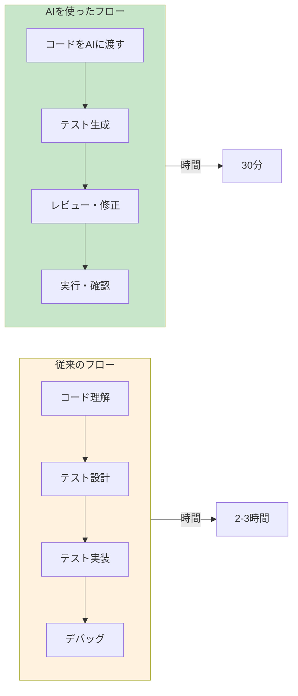

### 効果的なプロンプト例

#### プロンプト1：基本テスト生成

```markdown
# PHPUnit テスト生成依頼

## 対象クラス
```php
<?php
// ここに対象クラスのコードを貼り付け
```

## 要件
- PHPUnit 10.x 形式で書いてください
- 正常系、境界値、異常系をそれぞれ含めてください
- テストメソッド名は日本語で「何をテストしているか」がわかるようにしてください
- Arrange/Act/Assert パターンでコメントを入れてください
- データプロバイダーが適切な場合は使用してください

## 特に注意してほしい点
- 金額計算があるので、浮動小数点の誤差に注意
- 日付処理があるので、月末・閏年のケースを含めて
- null許容の引数があるので、nullのケースも含めて
```

#### プロンプト2：レガシーコード向け

```markdown
# レガシーコードの挙動固定テスト生成

## 対象クラス
```php
<?php
// ここにレガシーコードを貼り付け
```

## 目的
このクラスをリファクタリングしたいので、「今の挙動」を固定するテストを書いてください。

## 要件
- 正しい動作かどうかは判断せず、「今の挙動」をそのまま記録してください
- 特に、エッジケース（0、負数、null、空文字）での挙動を確認してください
- 例外が発生するケースも記録してください
- テストデータは `@dataProvider` で管理してください
- 各テストケースに「この挙動が意図的かどうか不明」などのコメントを入れてください
```

#### プロンプト3：モック・DI込み

```markdown
# 依存性のあるクラスのテスト生成

## 対象クラス
```php
<?php
// ここに対象クラスのコードを貼り付け
```

## 依存インターフェース
```php
<?php
// ここに依存しているインターフェースを貼り付け
```

## 要件
- PHPUnit のモック機能を使用してください
- `setUp()` でモックとテスト対象を初期化してください
- 各テストで `expects()` を使って呼び出し回数を検証してください
- 依存サービスがエラーを返すケースもテストしてください
- 副作用（DBへの保存、メール送信など）が適切にモック化されているか確認してください
```

### AIが生成したテストのレビュー手順

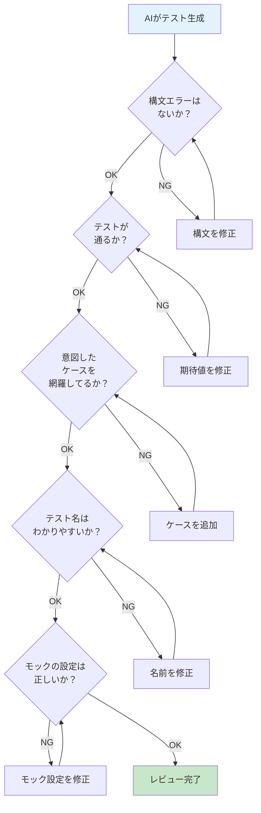

#### チェックリスト

| 確認項目 | チェック内容 |
|---------|-------------|
| **構文** | `vendor/bin/phpunit` でエラーなく実行できるか |
| **網羅性** | 正常系・境界値・異常系が含まれているか |
| **命名** | テスト名を読めば何をテストしているかわかるか |
| **モック** | 依存サービスが正しくモック化されているか |
| **副作用** | DB保存やメール送信が意図せず実行されていないか |
| **データ** | テストデータが現実的な値か（極端すぎないか） |

### 「テストを書く人」→「テストをチェックする人」へ

```
【従来】
エンジニア = テスト設計者 + テスト実装者 + デバッガー

【AI時代】
エンジニア = テスト設計者 + レビュアー
AI        = テスト実装者

結果: エンジニアの生産性が3倍に
```

AIに任せるべきこと：
- テストコードの雛形作成
- 境界値ケースの洗い出し
- データプロバイダーの生成

人間がやるべきこと：
- ビジネス要件の理解
- テスト戦略の決定
- AIが生成したテストのレビュー
- 「このケース、本当に必要？」の判断

---

## 8. 英語まとめ / English Summary: Testing Culture Abroad

### 海外エンジニアのテスト観

| 英語フレーズ | 日本語訳 | 意味 |
|-------------|---------|------|
| "Code without tests is legacy code" | テストのないコードはレガシーコード | Michael Feathers の名言 |
| "Test first, code second" | テストが先、コードが後 | TDDの原則 |
| "Red, Green, Refactor" | 赤、緑、リファクタリング | TDDのサイクル |
| "Tests are documentation that never lies" | テストは嘘をつかないドキュメント | テストの価値 |
| "If it's not tested, it's broken" | テストされてないなら壊れてる | 厳しいけど真実 |

### TDDの「Red, Green, Refactor」サイクル

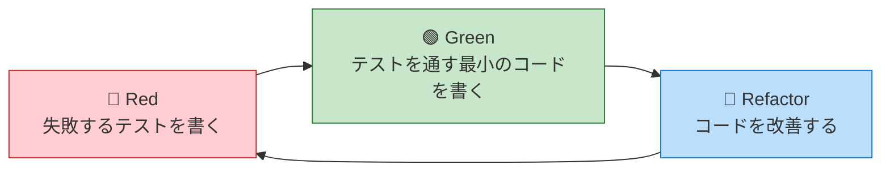

### 覚えておきたい英語表現

```php
// テストメソッドの命名（英語スタイル）

// Given-When-Then パターン
public function testGivenValidUser_WhenRegistering_ThenUserIsCreated(): void

// Should パターン
public function testUserShouldBeCreatedWithValidInput(): void

// It パターン（BDD風）
public function testItCreatesUserSuccessfully(): void
```

### 海外の採用面接での質問例

```
Q: "How do you ensure code quality?"
   （コード品質をどう担保しますか？）

A: "I write unit tests for business logic,
    maintain 80% coverage for critical paths,
    and use CI/CD to run tests on every commit."
   （ビジネスロジックにはユニットテストを書き、
    重要なパスは80%のカバレッジを維持し、
    コミットごとにCI/CDでテストを実行します）
```

---

## 9. 結論：テストは投資、未来の自分を救う / Conclusion

### テストはコストではなく「投資」

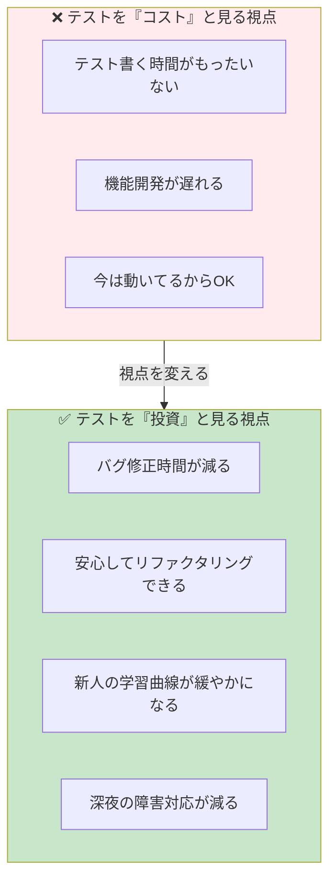

### 明日から実践できる3ステップ

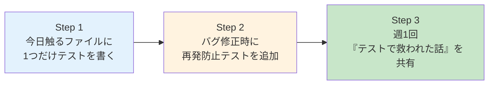

#### Step 1：今日触るファイルに1つだけテストを書く

新しいことを始めるハードルは高い。だから最初は「1つだけ」でいい。

```php
// 今日直すバグがあるなら
public function testこのバグが再発しないことを確認(): void
{
    // 再発防止のテスト
}
```

#### Step 2：バグ修正時に再発防止テストを追加

バグを直したら、**必ず** そのバグを検出するテストを書く。

> 「同じバグは二度と起こさない」

これだけで、テストの価値を実感できる。

#### Step 3：週1回「テストで救われた話」を共有

Slack でも、朝会でも、何でもいい。

> 「昨日、テストが壊れたおかげで本番障害を防げました」

この一言が、**チームのテスト文化を育てる**。

---

## おわりに：未来の自分へ

今日書いたテストは、**3ヶ月後の深夜2時** に効いてくる。

あの日、テストを書いていたおかげで、障害の原因がすぐわかった。
あの日、テストを書いていたおかげで、影響範囲がすぐわかった。
あの日、テストを書いていたおかげで、朝まで格闘しなくて済んだ。

**テストは、未来の自分へのラブレターだ。**

今日から、あなたも書き始めよう。

---

## 参考リンク

- [PHPUnit 公式ドキュメント](https://phpunit.de/documentation.html)
- [PHP The Right Way - Testing](https://phptherightway.com/#testing)
- [Martin Fowler - Test Pyramid](https://martinfowler.com/articles/practical-test-pyramid.html)
- [Kent Beck - Test Driven Development](https://www.amazon.co.jp/dp/4274217884)

<!--
SEO Keywords:
PHP ユニットテスト, PHPUnit, テスト駆動開発, TDD, PHP テスト 書き方,
PHPUnit 使い方, PHP テスト 入門, モック, テストピラミッド,
レガシーコード テスト, PHP テスト 導入, テスト文化, CI/CD テスト,
PHP 品質, ChatGPT テスト, AI テスト生成
-->
