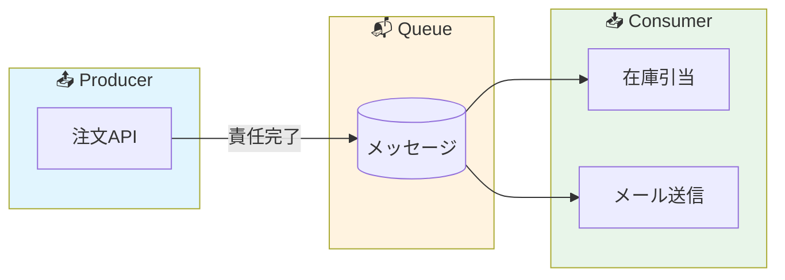

## 障害対応で一番つらいのは「犯人探し」

深夜の障害対応を想像してほしい。

「注文処理が失敗している」という報告が入った。ログを追うと、注文データはデータベースに入っている。でも在庫は引き当てられていない。メール通知も飛んでいない。決済は...どうだろう、中途半端な状態かもしれない。

こういうとき、最初に起きるのが「犯人探し」だ。

- 「注文APIチームの責任では？」
- 「いや、在庫管理側が落ちてたんじゃないの？」
- 「決済システムのタイムアウトが原因では？」

結局、誰の責任なのか分からないまま、なんとなく復旧作業を進める。そして事後報告書を書くとき、「複合的な要因により...」という曖昧な表現でお茶を濁す。

この状況、心当たりがある人は多いのではないだろうか。

私は長年、業務システムの設計レビューを行ってきた。そして、この手の「責任が曖昧な障害」は、ほとんどの場合、**設計段階で「責任境界」を明確にしていなかったこと**が原因だと感じている。

今回は、Producer と Consumer という概念を使って、この「責任境界」をどう設計すべきかを考えてみたい。

---

## 「全部やる」設計が招く悲劇

まず、ProducerとConsumerを分けない設計がどんな問題を起こすか見てみよう。

典型的な例は、1つのAPI呼び出しの中で「全部やろうとする」設計だ。

```
注文API
├── 注文データをDBに保存
├── 在庫を引き当てる
├── 決済処理を実行
├── 確認メールを送信
└── 分析用ログを記録
```

一見、シンプルで分かりやすい。処理の流れが見える。

でも、これには致命的な問題がある。

**「どこまで成功すれば、この処理は成功なのか？」が曖昧なのだ。**

在庫引き当てが失敗したら、注文は失敗？ でも決済は通っているかもしれない。
メール送信が失敗したら、注文は失敗？ でも注文自体は完了しているのでは？

つまり、この設計では「成功」と「失敗」の定義が、処理の途中結果によって変わってしまう。これが障害時の混乱の元凶だ。

さらに厄介なのは、**リトライの判断ができない**ことだ。

処理の途中で失敗したとき、最初からやり直していいのか？ 決済が二重に走らないか？ そもそもどこまで進んでいたのか、正確に分かるのか？

こうした疑問に答えられない設計は、障害時に必ず人間の判断を要求する。そして人間は、深夜3時に正しい判断ができるほど万能ではない。

---

## Producer の責任：「届けたら終わり」

では、Producer と Consumer を分けるとはどういうことか。

**Producer（生産者）** とは、処理の依頼を「キュー」に投げる側のことだ。キューとは、処理待ちのデータを一時的に溜めておく仕組みと考えてほしい。

重要なのは、Producer の責任範囲を明確に定義することだ。

**Producer の責任は「メッセージをキューに正しく投入すること」で終わる。**

さっきの注文処理で言えば、こう変わる：

```
注文API（Producer）
├── 注文データをDBに保存
└── 「注文が作成された」というメッセージをキューに投入
    └── ここで責任完了 ✓
```

注文APIの責任は、「注文データを保存し、後続処理のためのメッセージをキューに入れること」だけになる。

在庫引き当てがどうなるか、メールが届くかどうか、それは注文APIの責任ではない。**注文APIは、メッセージをキューに入れた時点で「成功」と言える。**

これがProducerの責任境界だ。

この設計の良いところは、**「成功」の定義が単純明快**なことだ。

- DBへの書き込みが成功した
- キューへのメッセージ投入が成功した

この2つが両方OKなら、Producerとしての仕事は完了。障害時の切り分けも簡単になる。

---

## Consumer の責任：「失敗しても大丈夫」な前提で設計する

**Consumer（消費者）** は、キューからメッセージを取り出して実際の処理を行う側だ。

```
在庫引当Consumer
└── キューから「注文作成」メッセージを受け取る
    └── 在庫を引き当てる

メール送信Consumer
└── キューから「注文作成」メッセージを受け取る
    └── 確認メールを送信する
```

Consumer の設計で最も重要な考え方は、**「失敗することを前提にする」**ことだ。

なぜか？

Consumerは、外部システムとの連携や、時間のかかる処理を担当することが多い。メールサーバーが落ちているかもしれない。外部APIがタイムアウトするかもしれない。つまり、**Consumer は Producer よりも失敗しやすい**のだ。

だからこそ、Consumer は以下のように設計する：

1. **失敗したら、メッセージをキューに戻す**（または別のキューに移す）
2. **一定回数失敗したら、Dead Letter Queue（DLQ）に移動させる**
3. **処理結果を記録し、後から確認できるようにする**

Dead Letter Queue とは、「処理できなかったメッセージの墓場」のようなものだ。ここに入ったメッセージは、人間が確認して対処する。

重要なのは、**Consumer が失敗しても、Producer には何の影響もない**ということだ。

注文APIは「注文を受け付けました」と返していい。在庫引当が失敗しても、それは在庫引当Consumer の責任であり、注文APIの問題ではない。

この分離があるから、障害時に「どこが悪いのか」が明確になる。

---

## 冪等性：「何度やっても同じ結果」という安心感

Producer と Consumer を分けると、必ず出てくるのが「再実行」の話だ。

Consumer が途中で落ちたとき、そのメッセージはどうなるか？ 多くのキューシステムでは、「処理完了」を明示的に伝えない限り、メッセージは再度配信される。

つまり、**同じ処理が2回以上実行される可能性がある**。

これは問題だろうか？

答えは「設計次第」だ。そして、正しい設計とは「冪等性（べきとうせい）」を確保することだ。

冪等性とは、**「同じ操作を何度実行しても、結果が変わらない」**という性質のこと。

たとえば：
- ❌ 冪等でない：「在庫を1つ減らす」→ 2回実行すると2つ減る
- ✅ 冪等：「注文ID: 12345 の在庫を引き当て済みにする」→ 何度実行しても1回分

冪等性を確保する典型的な方法は：

1. **処理対象を一意に識別する**（注文ID、メッセージIDなど）
2. **処理済みかどうかを確認してから実行する**
3. **または、処理結果を「上書き」する形で設計する**

```
// 冪等な在庫引当の例
function 在庫引当(注文ID) {
    if (すでに引当済み(注文ID)) {
        return; // 何もしない
    }
    在庫を引き当てる(注文ID);
    引当済みとしてマーク(注文ID);
}
```

冪等性があれば、Consumer は安心して再実行できる。「2回処理されたらどうしよう」という心配がなくなる。

---

## よくある設計ミス：Consumer に責任を持たせすぎる

ここまで読んで、「なるほど、じゃあ複雑な処理は全部 Consumer に任せればいいんだな」と思った人がいるかもしれない。

それは、半分正解で半分間違いだ。

**Consumer に「判断」を持たせすぎると、責任境界がまた曖昧になる。**

たとえば、こんな Consumer を見たことがある：

```
注文処理Consumer（悪い例）
├── 注文データを検証する
├── 在庫があるか確認する
├── 在庫がなければ代替品を提案する
├── 顧客の購入履歴を確認してレコメンドを追加する
├── 決済処理を実行する
└── 各種通知を送信する
```

これは、さっきの「全部やる API」と同じ問題を Consumer 側で再現しているだけだ。

**Consumer の責任は、できるだけシンプルにすべきだ。**

良い設計では、1つの Consumer は1つの責務だけを持つ：

```
在庫引当Consumer → 在庫を引き当てるだけ
メール送信Consumer → メールを送るだけ
分析ログConsumer → ログを記録するだけ
```

複数の Consumer が同じメッセージを処理してもいい。それぞれが自分の責任を果たせばいい。

この「1 Consumer = 1責務」の原則を守ると、障害の影響範囲も最小限になる。メールサーバーが落ちても、在庫引当には影響しない。分析システムがパンクしても、注文処理は続行できる。

---

## まとめ：「分ける」ことは「守る」こと

Producer と Consumer を分けることの本質は、**「責任の範囲を明確にして、お互いを守ること」**だ。

- Producer は「メッセージを届けること」に責任を持つ。後続処理の成否は関知しない。
- Consumer は「自分の処理を完了すること」に責任を持つ。失敗しても Producer に迷惑をかけない。

この分離があるから：

1. **障害時の切り分けが速くなる**
   - 「キューにメッセージは入っているか？」→ 入っていれば Producer は正常
   - 「Consumer は動いているか？」→ 動いていなければ Consumer 側の問題

2. **リトライが安全にできる**
   - Consumer は冪等に設計されているから、何度再実行しても大丈夫

3. **影響範囲を局所化できる**
   - 1つの Consumer が落ちても、他の処理には影響しない

設計レビューをしていると、「パフォーマンスのために非同期にしました」という説明をよく聞く。

でも私が見ているのは、パフォーマンスではない。

**「障害が起きたとき、この設計で誰が責任を持つか明確ですか？」**

この問いに答えられない設計は、いつか必ず深夜の障害対応で人を苦しめる。

Producer と Consumer を分けるのは、パフォーマンスのためではない。**チームを守るため**だ。

---

## 補足：この設計を検討するときのチェックリスト

最後に、設計レビューで私が確認するポイントを共有しておく：

- [ ] Producer の「成功」の定義は明確か？
- [ ] Consumer が失敗したとき、Producer に影響はないか？
- [ ] Consumer は冪等に設計されているか？
- [ ] Dead Letter Queue など、失敗メッセージの扱いは決まっているか？
- [ ] 1つの Consumer が複数の責務を持っていないか？
- [ ] 障害時に「どこまで処理が進んだか」を確認できるか？

これらが全部 Yes なら、その設計はきっと障害に強い。

そして何より、深夜に呼び出されたエンジニアを守ってくれるはずだ。

---

## 設計判断の背景

この記事では「非同期処理=パフォーマンス向上」という一般的な文脈ではなく、「責任境界の明確化」という観点を選んだ。同期的な一括処理のほうがコードは単純になるし、デバッグも容易だ。しかし、障害発生時の原因特定や復旧作業の負荷を考えると、初期の実装コストを払ってでも責任を分離しておく価値があると判断している。

## 現場での判断基準

Producer/Consumer 分離を導入するかどうかは、「その処理が失敗したとき、誰が対処するか」を考えて判断している。対処する人が明確に決まらない処理、あるいは複数チームにまたがる処理は、分離の候補になる。一方で、単一チームで完結する小規模な処理に無理にキューを挟むと、かえって複雑さが増すこともある。

## 見るべきポイント

設計レビューでは、まず「Consumer が失敗したとき、何が起きるか」を確認する。ここが曖昧だと、本番障害時に必ず混乱が起きる。次に「同じメッセージが2回来たらどうなるか」を聞く。冪等性の考慮が抜けている設計は、リトライ時に二重処理のリスクを抱えることになる。
