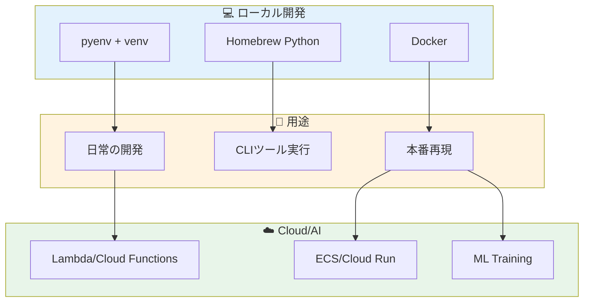

## 「また Python が動かない」問題

macOS で Python 開発をしていると、こんな経験がないだろうか。

```bash
$ python --version
Python 2.7.18  # え、まだ 2.7？

$ pip install tensorflow
ERROR: Could not find a version that satisfies the requirement...

$ brew upgrade
# Python がアップデートされて、今まで動いてたものが壊れた
```

あるいは、AI 開発でこんな地獄を見たことは？

```bash
$ pip install torch torchvision
# 30分かかってビルドエラー

$ pip install cuda-toolkit
# macOS には CUDA がない（そもそも NVIDIA GPU がない）

$ python train.py
# ローカルでは動くのに、AWS で動かない
```

**なぜ、こんなに環境構築で苦労するのか？**

答えは単純だ。**pyenv、Homebrew、Docker は、それぞれ解決しようとしている問題が違う**からだ。

目的が違うツールを混ぜて使うから、混乱が起きる。

この記事では、各ツールの「思想」を理解し、Cloud・AI 開発で本当に使える環境構築のベストプラクティスを解説する。

---

## 混乱の原因：3つのツールが解決する問題は全く違う

### 根本的な思想の違い

| ツール | 解決したい問題 | 思想 |
|--------|---------------|------|
| **pyenv** | 「複数の Python バージョンを切り替えたい」 | 言語バージョン管理 |
| **Homebrew** | 「macOS にパッケージを簡単にインストールしたい」 | OS パッケージ管理 |
| **Docker** | 「どの環境でも同じように動かしたい」 | 環境の完全再現 |

この違いを理解せずに「とりあえず brew install python」「とりあえず Docker で」とやるから、環境が壊れる。

---

## pyenv系の役割：Python バージョンの切り替え

### pyenv とは

```bash
# 複数バージョンをインストール
pyenv install 3.9.18
pyenv install 3.11.7
pyenv install 3.12.1

# プロジェクトごとにバージョンを指定
cd ~/project-a
pyenv local 3.11.7

cd ~/project-b
pyenv local 3.12.1
```

pyenv の仕事は**「Python 本体のバージョンを管理すること」**だけだ。

### pyenv + venv の組み合わせ

```bash
# 1. pyenv でバージョンを指定
pyenv local 3.11.7

# 2. venv で仮想環境を作成
python -m venv .venv

# 3. 仮想環境を有効化
source .venv/bin/activate

# 4. パッケージをインストール
pip install -r requirements.txt
```

**この組み合わせが、ローカル Python 開発の王道だ。**

### pyenv が向いているケース

```
✅ 複数プロジェクトで異なる Python バージョンが必要
✅ 新しい Python バージョンを試したい
✅ pip でインストールするライブラリ中心の開発
✅ 軽量に開発を始めたい
```

### pyenv が向かないケース

```
❌ システムライブラリ（OpenCV、CUDA等）に依存する開発
❌ 本番環境と完全に同じ環境を再現したい
❌ チームメンバー全員の環境を揃えたい
```

### pyenv のインストールと設定

```bash
# Homebrew でインストール（これは OK）
brew install pyenv

# シェル設定に追加（~/.zshrc）
export PYENV_ROOT="$HOME/.pyenv"
export PATH="$PYENV_ROOT/bin:$PATH"
eval "$(pyenv init -)"

# Python のビルド依存関係をインストール
brew install openssl readline sqlite3 xz zlib
```

---

## Homebrew の役割：システムツールの管理

### Homebrew の本来の用途

Homebrew は **macOS のパッケージマネージャー**だ。

```bash
# CLI ツールをインストール
brew install git
brew install jq
brew install awscli
brew install terraform
```

**Homebrew で Python 開発環境を構築するのは、本来の用途ではない。**

### なぜ brew install python は危険か

```bash
$ brew install python@3.11
$ brew upgrade  # 半年後...

# Python 3.11 → 3.12 に勝手にアップグレード
# 今まで動いてたスクリプトが壊れる
# pip でインストールしたパッケージも消える
```

Homebrew は「最新版を使いたい」思想で設計されている。**バージョンを固定したい開発には向かない。**

### Homebrew Python が適切なケース

```
✅ aws-cli や git など、Python製 CLI ツールの実行環境として
✅ システム全体で使う汎用スクリプト用
✅ 一時的な検証や、バージョンにこだわらない用途
```

### Homebrew Python を避けるべきケース

```
❌ プロジェクト開発（バージョン固定が必要）
❌ AI/ML 開発（依存関係が複雑）
❌ チーム開発（環境の再現性が必要）
```

### Homebrew と pyenv の共存

```bash
# pyenv の Python を優先させる設定
# ~/.zshrc に追加
export PATH="$PYENV_ROOT/shims:$PATH"

# Homebrew の Python を直接使いたい場合は絶対パス
/opt/homebrew/bin/python3 script.py
```

---

## Docker の役割：環境の完全再現

### Docker が解決する問題

Docker は「**私のマシンでは動く**」問題を解決する。

```dockerfile
# Dockerfile
FROM python:3.11-slim

WORKDIR /app
COPY requirements.txt .
RUN pip install --no-cache-dir -r requirements.txt

COPY . .
CMD ["python", "main.py"]
```

```bash
# どの環境でも同じように動く
docker build -t myapp .
docker run myapp
```

### Docker が本当に必要なケース

```
✅ 本番環境と同じ環境でローカル開発したい
✅ システムライブラリ（OpenCV、FFmpeg等）に依存する
✅ チーム全員の環境を完全に揃えたい
✅ CI/CD と同じ環境でテストしたい
✅ GPU + CUDA 環境が必要（nvidia-docker）
```

### Docker のオーバーヘッドを理解する

```
⚠️ Docker のデメリット

- macOS での I/O パフォーマンス低下（volume mount が遅い）
- メモリ・CPU リソースの消費
- ファイル変更の反映にラグがある場合がある
- デバッグが複雑になる
- 学習コスト
```

### Docker が向かないケース

```
❌ 小規模なスクリプト開発
❌ 依存関係がシンプルなプロジェクト
❌ 高速なイテレーションが必要な開発初期
❌ Docker の学習コストをかけられない状況
```

---

## 比較表：どのツールを使うべきか

### 機能比較

| 機能 | pyenv + venv | Homebrew | Docker |
|------|-------------|----------|--------|
| **Python バージョン管理** | ◎ | △ | ○ |
| **パッケージ分離** | ○ (venv) | × | ◎ |
| **環境の再現性** | △ | × | ◎ |
| **起動速度** | ◎ | ◎ | △ |
| **I/O パフォーマンス** | ◎ | ◎ | △ (macOS) |
| **システムライブラリ対応** | △ | △ | ◎ |
| **学習コスト** | 低 | 低 | 中〜高 |
| **CI/CD 連携** | ○ | △ | ◎ |

### 用途別の推奨

| 用途 | 推奨 | 理由 |
|------|------|------|
| **Web API 開発** | pyenv + venv | 軽量、高速なイテレーション |
| **AI/ML 開発（CPU）** | pyenv + venv | pip でほぼ完結 |
| **AI/ML 開発（GPU）** | Docker | CUDA 環境の再現が必要 |
| **データ分析** | pyenv + venv | Jupyter との相性 |
| **マイクロサービス** | Docker | 本番環境との一致 |
| **CLI ツール開発** | pyenv + venv | 軽量、デバッグしやすい |
| **レガシー Python 2.x** | pyenv | バージョン固定 |

---

## Cloud・AI 開発での具体的な使い分け

### パターン1：AWS Lambda / Cloud Functions

```
ローカル: pyenv + venv で開発
デプロイ: requirements.txt + ランタイム指定
```

```bash
# ローカル開発
pyenv local 3.11.7
python -m venv .venv
source .venv/bin/activate
pip install -r requirements.txt

# テスト
python -m pytest tests/

# デプロイ（SAM の場合）
sam build
sam deploy
```

**Docker は不要。** Lambda ランタイムと Python バージョンを合わせれば動く。

### パターン2：ECS / Cloud Run

```
ローカル: Docker で開発
デプロイ: 同じ Docker イメージを使用
```

```dockerfile
# Dockerfile
FROM python:3.11-slim

WORKDIR /app

# 依存関係を先にインストール（キャッシュ効率化）
COPY requirements.txt .
RUN pip install --no-cache-dir -r requirements.txt

COPY . .

EXPOSE 8000
CMD ["uvicorn", "main:app", "--host", "0.0.0.0", "--port", "8000"]
```

```yaml
# docker-compose.yml（ローカル開発用）
services:
  app:
    build: .
    ports:
      - "8000:8000"
    volumes:
      - .:/app  # ホットリロード用
    environment:
      - DEBUG=true
```

### パターン3：AI/ML 開発（ローカル CPU）

```
ローカル: pyenv + venv で開発
学習: クラウド GPU インスタンス or Docker
```

```bash
# ローカルでモデル開発
pyenv local 3.11.7
python -m venv .venv
source .venv/bin/activate

pip install torch torchvision --index-url https://download.pytorch.org/whl/cpu
pip install transformers datasets

# 小さいデータで動作確認
python train.py --debug --max-samples 100
```

### パターン4：AI/ML 開発（GPU 学習）

```
ローカル: pyenv + venv（CPU で動作確認）
学習: Docker + nvidia-docker
```

```dockerfile
# Dockerfile.gpu
FROM nvidia/cuda:12.1-cudnn8-runtime-ubuntu22.04

RUN apt-get update && apt-get install -y python3 python3-pip

WORKDIR /app
COPY requirements-gpu.txt .
RUN pip3 install --no-cache-dir -r requirements-gpu.txt

COPY . .
CMD ["python3", "train.py"]
```

```bash
# GPU インスタンスで実行
docker run --gpus all -v $(pwd)/data:/app/data myapp-gpu
```

### パターン5：データパイプライン（Airflow / Prefect）

```
ローカル: Docker Compose で Airflow を起動
開発: pyenv + venv で DAG を開発
デプロイ: マネージドサービス or Kubernetes
```

```yaml
# docker-compose.yml
services:
  airflow:
    image: apache/airflow:2.7.3-python3.11
    volumes:
      - ./dags:/opt/airflow/dags
    ports:
      - "8080:8080"
```

```bash
# DAG の開発は pyenv で
pyenv local 3.11.7
python -m venv .venv
pip install apache-airflow

# 単体テスト
python -m pytest dags/tests/
```

---

## 初心者がやりがちな失敗パターン

### 失敗1：システム Python を直接使う

```bash
# ❌ 絶対にやってはいけない
sudo pip install package-name
pip install --user package-name  # これも危険
```

**システム Python は OS が使う。** 壊すと macOS の機能に影響する。

```bash
# ✅ 正解
python -m venv .venv
source .venv/bin/activate
pip install package-name
```

### 失敗2：Homebrew Python でプロジェクト開発

```bash
# ❌ バージョンが勝手に変わる
brew install python@3.11
pip install -r requirements.txt

# 半年後...
brew upgrade  # Python 3.12 になって環境崩壊
```

```bash
# ✅ pyenv でバージョンを固定
pyenv install 3.11.7
pyenv local 3.11.7
python -m venv .venv
```

### 失敗3：何でも Docker にする

```bash
# ❌ 簡単なスクリプトに Docker は過剰
docker run -v $(pwd):/app python:3.11 python /app/hello.py
```

```bash
# ✅ venv で十分
python -m venv .venv && source .venv/bin/activate
python hello.py
```

### 失敗4：requirements.txt のバージョン未指定

```
# ❌ バージョン未指定
requests
pandas
numpy
```

```
# ✅ バージョンを固定
requests==2.31.0
pandas==2.1.4
numpy==1.26.3
```

さらに良い方法：

```bash
# pip-tools で依存関係を管理
pip install pip-tools

# requirements.in（直接依存のみ）
echo "requests" > requirements.in
echo "pandas" >> requirements.in

# requirements.txt を自動生成（推移的依存も含む）
pip-compile requirements.in
```

### 失敗5：Docker の volume mount を理解していない

```yaml
# ❌ パフォーマンスが悪い
volumes:
  - .:/app  # 全ファイルを同期
```

```yaml
# ✅ node_modules / .venv 等は除外
volumes:
  - .:/app
  - /app/.venv  # 無名ボリュームで除外
  - /app/node_modules
```

---

## ベストプラクティス：この構成を覚えておけば迷わない

### 推奨構成

```
.
├── .python-version      # pyenv 用（3.11.7）
├── .venv/               # 仮想環境（git ignore）
├── requirements.in      # 直接依存
├── requirements.txt     # 固定バージョン（pip-compile で生成）
├── Dockerfile           # 本番用（必要な場合のみ）
├── docker-compose.yml   # ローカル開発用（必要な場合のみ）
└── src/
    └── ...
```

### プロジェクト開始時のテンプレート

```bash
#!/bin/bash
# setup.sh

# Python バージョンを設定
pyenv install -s 3.11.7
pyenv local 3.11.7

# 仮想環境を作成
python -m venv .venv
source .venv/bin/activate

# pip-tools をインストール
pip install --upgrade pip pip-tools

# 依存関係をインストール
if [ -f requirements.txt ]; then
    pip install -r requirements.txt
fi

echo "環境構築完了: $(python --version)"
```

### .gitignore

```gitignore
# Python
.venv/
__pycache__/
*.py[cod]
*.egg-info/
dist/
build/

# IDE
.vscode/
.idea/

# 環境変数
.env
.env.local
```

---

## 使い分け早見表

### 意思決定フローチャート

```
Q1: システムライブラリ（CUDA, OpenCV等）に依存する？
    Yes → Docker
    No  → Q2

Q2: 本番環境と完全に同じ環境が必要？
    Yes → Docker
    No  → Q3

Q3: チーム開発で環境を揃える必要がある？
    Yes（厳密に） → Docker
    Yes（Python版のみ） → pyenv + venv
    No  → Q4

Q4: 複数の Python バージョンを使い分ける？
    Yes → pyenv + venv
    No  → pyenv + venv（それでも推奨）
```

### 一覧表

| 状況 | pyenv + venv | Docker |
|------|:-----------:|:------:|
| 新規プロジェクト開始 | ◎ | △ |
| Web API 開発 | ○ | ○ |
| AI/ML 開発（CPU） | ◎ | △ |
| AI/ML 開発（GPU） | △ | ◎ |
| データ分析・Jupyter | ◎ | △ |
| マイクロサービス | △ | ◎ |
| CI/CD パイプライン | ○ | ◎ |
| レガシーシステム | ○ | ◎ |

---

## まとめ：この考え方を覚えておけば迷わない

### 3つのツールの役割

1. **pyenv** = Python バージョン管理
   - 複数バージョンの切り替え
   - プロジェクトごとのバージョン固定

2. **Homebrew** = システムツール管理
   - CLI ツールのインストール
   - **Python 開発環境としては非推奨**

3. **Docker** = 環境の完全再現
   - 本番との一致が必要な場合
   - システムライブラリ依存がある場合

### 基本方針

```
1. 迷ったら pyenv + venv から始める
2. 本番環境の再現が必要になったら Docker を導入
3. Homebrew Python は CLI ツール実行用と割り切る
```

### Cloud・AI 開発での現実解

```
- Lambda / Cloud Functions → pyenv + venv で十分
- ECS / Cloud Run → Docker
- ML 開発（CPU） → pyenv + venv で開発、必要なら Docker でビルド
- ML 開発（GPU） → Docker（nvidia-docker）
```

環境構築で時間を浪費するのは、エンジニアとして最も避けたいことだ。

**ツールの思想を理解して、適材適所で使い分ける。**

これができれば、「また Python が動かない」問題から解放される。

---

## 設計判断の背景

「全部 Docker にすれば統一できる」という意見もあるが、それは理想論だ。macOS での Docker の I/O オーバーヘッド、学習コスト、デバッグの複雑さを考えると、すべてを Docker にするのは現実的ではない。特に高速なイテレーションが必要な開発初期は、pyenv + venv の軽量さが大きなアドバンテージになる。

## 現場での判断基準

新しいプロジェクトを始めるとき、まず「本番環境で何が動くか」を確認する。Lambda なら pyenv + venv で十分。ECS/Cloud Run なら最初から Docker。この判断を最初にすることで、後から環境を作り直す手間が省ける。

## 見るべきポイント

他のエンジニアの環境を見るとき、「なぜその構成にしたか」を聞くようにしている。理由なく Homebrew Python を使っていたり、必要ないのに Docker を使っていたりする場合は、ツールの思想を理解していないサインであることが多い。
