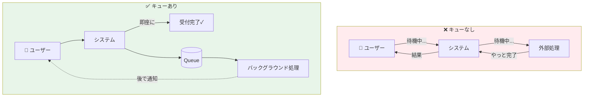

## 忙しいのは、システムが「今すぐ」を要求するから

経理の田中さんは、毎月20日になると憂鬱になる。

請求書の締め日だ。営業から上がってきたデータを確認し、システムに入力し、PDFを生成し、送付先を確認し、メールで送る。1件あたり5分。月に200件。単純計算で16時間以上。

でも実際はもっとかかる。

なぜか？ **システムが「今すぐ判断しろ」と迫ってくるからだ。**

「この顧客の請求先住所、変更されていますが続行しますか？」
「PDFの生成に失敗しました。再試行しますか？」
「メールアドレスが無効です。修正して再送信してください。」

1つ1つは小さな確認だ。でもそれが100回、200回と積み重なると、田中さんの1日は「確認ボタンを押す作業」で埋まっていく。

これは田中さんが悪いわけでも、システムが壊れているわけでもない。

**システムの設計が「人間を待たせる」構造になっていないだけだ。**

---

## キューを使わない世界：「電話応対」のような仕事

キューがない世界のシステムを、電話応対に例えてみよう。

電話は「同期的」なコミュニケーションだ。相手が話している間、こちらは待っていなければならない。保留にされたら、受話器を持ったまま待つしかない。

キューがないシステムも同じだ。

```
[図のイメージ]
ユーザー → システム → 外部サービス → システム → ユーザー
           ↑                              ↓
           └──── ずっと待っている ─────────┘
```

ユーザーが「請求書を作成」ボタンを押す。システムは顧客データを取得し、金額を計算し、PDFを生成し、保存する。その間、ユーザーは画面の前で待っている。

3秒で終われば問題ない。でも30秒かかったら？ 3分かかったら？

そして途中でエラーが起きたら？

**ユーザーは「今すぐ」判断を求められる。**

- 「タイムアウトしました。再試行しますか？」
- 「一部のデータが取得できませんでした。続行しますか？」

この「今すぐ判断しろ」が、人間の仕事を増やしている元凶だ。

電話応対が疲れるのは、**相手のペースに合わせなければならないから**だ。メールなら、自分のペースで返信できる。その差は、1日に数十件の対応をする人にとっては決定的な違いになる。

---

## キューを入れると何が変わるか：「メール」のような仕事になる

キューとは、**処理の依頼を「一旦預かる場所」**だ。

郵便ポストを想像してほしい。手紙を投函したら、あなたの仕事は終わり。届けるのは郵便局の仕事だ。届いたかどうかは、後で追跡番号で確認できる。

キューを入れたシステムは、こうなる：

```
[図のイメージ]
ユーザー → システム → キュー →「受け付けました」→ ユーザーは自由
                       ↓
               バックグラウンド処理
                       ↓
                  完了したら通知
```

ユーザーが「請求書を作成」ボタンを押す。システムは「請求書を作ってください」という依頼をキューに入れる。ユーザーには「受け付けました」と返す。

**ユーザーは待たなくていい。**

PDFの生成には30秒かかるかもしれない。外部サービスとの連携で3分かかるかもしれない。でもユーザーは、その間に別の作業ができる。

処理が終わったら、システムから通知が来る。「請求書が作成されました。ダウンロードはこちら」

これが「メールのような仕事」だ。自分のペースで確認し、自分のペースで次のアクションを取れる。

---

## 本当に変わるのは「判断」の回数

キューを入れて一番変わるのは、実は処理速度ではない。

**「人間が判断しなければならない回数」が激減する。**

キューがない世界では、処理の途中で問題が起きるたびに、人間が呼び出される。

- 「接続がタイムアウトしました」→ 人間が再試行ボタンを押す
- 「データが不整合です」→ 人間が確認して続行を選ぶ
- 「外部サービスがエラーを返しました」→ 人間がどうするか決める

これが1日に何十回も起きると、人間は「確認作業員」になってしまう。

キューがある世界では、こうした「途中の問題」はシステムが自動で対処する。

- タイムアウト → 自動で再試行（3回まで）
- 一時的なエラー → 少し待ってから再実行
- 致命的なエラー → 「失敗リスト」に入れて、後でまとめて人間に報告

人間が判断するのは、**「自動では解決できなかったもの」だけ**になる。

これが「仕事が減る」の正体だ。100回の確認が、10回のまとめて確認になる。

---

## 業務システムでの具体例

### 例1：請求書の一括作成

**キューなし：**
```
200件の請求書を作成
→ 1件ずつ処理
→ 途中でエラーが起きるたびに画面に表示
→ 人間が「スキップ」か「再試行」か選ぶ
→ 2時間かかる（待ち時間 + 判断時間）
```

**キューあり：**
```
200件の請求書作成依頼をキューに投入
→「受け付けました」と表示
→ 人間は別の作業へ
→ バックグラウンドで処理（エラーは自動リトライ）
→ 完了後「195件成功、5件要確認」と通知
→ 人間は5件だけ対処する
```

処理時間は同じかもしれない。でも**人間が拘束される時間**が圧倒的に違う。

### 例2：CSV/PDFの生成

大量データをCSVやPDFにエクスポートする機能。

**キューなし：**
- 「エクスポート」ボタンを押す
- 画面がフリーズしたように見える
- 「処理中...」のまま3分待つ
- ブラウザを閉じたらやり直し
- タイムアウトしたら最初から

**キューあり：**
- 「エクスポート」ボタンを押す
- 「完了したらメールでお知らせします」
- 別の作業をする
- 5分後「ダウンロード可能になりました」とメール
- いつでもダウンロード

「待っている時間」がゼロになる。

### 例3：承認ワークフロー

経費精算の承認フローを考えてみよう。

**キューなし的な設計：**
- 申請者が提出
- 上長にメールで通知
- 上長が承認画面を開く
- **その場で**コメントを入力して承認

上長が忙しいと、申請はずっと「承認待ち」のまま。申請者は「いつ承認されるんだろう」とやきもきする。

**キュー的な考え方を適用：**
- 申請者が提出
- 「承認依頼」がキュー（上長のタスクリスト）に入る
- 上長は**自分のペースで**まとめて処理
- 申請者は進捗をいつでも確認可能

これは技術的な「キュー」を使っていなくても、**「依頼と処理を分離する」という考え方**は同じだ。

---

## よくある誤解：「キューを入れると複雑になる」

「キューを入れると設計が複雑になるのでは？」

この懸念はもっともだ。実際、何でもかんでもキューにすればいいわけではない。

でも、この誤解には2つの視点が抜けている。

### 誤解1：「シンプルな同期処理」は本当にシンプルか？

同期処理がシンプルに見えるのは、**「うまくいっているとき」だけ**だ。

- タイムアウト処理は？
- エラー時のリトライは？
- 途中で失敗したときのロールバックは？
- ユーザーがブラウザを閉じたら？

これらを真面目に実装すると、「シンプルな同期処理」はどんどん複雑になっていく。

キューを入れると、こうした「異常系」の処理が整理される。「失敗したらキューに戻す」「3回失敗したら別のキューに移す」というシンプルなルールで対処できる。

### 誤解2：「複雑さ」はどこに行くべきか？

複雑さは消えない。どこかで引き受ける必要がある。

問題は、**誰が引き受けるか**だ。

キューがない世界では、**人間が複雑さを引き受ける**。エラーが起きるたびに判断し、例外的な状況に対処し、失敗したら手動でやり直す。

キューがある世界では、**システムが複雑さを引き受ける**。人間は「最終的な結果」だけを見て、本当に判断が必要なことだけに集中できる。

設計の複雑さが少し増えても、**運用の複雑さが大幅に減る**。この視点が大事だ。

---

## なぜ業務システムでキューが効くのか

業務システムの特徴を考えてみよう。

1. **大量のデータを扱う** — 請求書200件、勤怠データ1000人分
2. **外部連携が多い** — メール送信、帳票生成、他システム連携
3. **エラーが「日常」** — データ不備、一時的な障害は当たり前
4. **同じ作業の繰り返し** — 毎月、毎週、毎日のルーティン

これらすべてに対して、キューは相性がいい。

- 大量データ → まとめてキューに入れて、順次処理
- 外部連携 → 失敗しても自動リトライ、人間を待たせない
- エラー → 失敗分だけ後でまとめて対処
- 繰り返し → 「依頼を入れたら終わり」で手離れ良く

逆に言えば、**業務システムにこそキューが必要**なのだ。

「リアルタイム性が求められるシステム」にはキューは向かないこともある。でも業務システムの多くは、「今すぐ」ではなく「今日中に」「明日までに」で十分なことが多い。

その「今すぐじゃなくていい」を活かすのが、キューの本質だ。

---

## まとめ：キューは「人間の時間」を守る技術

キューの本質は、非同期処理でも分散処理でもない。

**「人間の判断・作業を、適切なタイミングまで待たせられる構造」**を作ることだ。

これによって：

- 人間は「システムの都合」で待たされなくなる
- エラー対応が「その都度」から「まとめて」になる
- 判断が必要な回数が激減する
- 本当に頭を使うべきことに集中できる

経理の田中さんの話に戻ろう。

キューを入れたシステムなら、田中さんは「請求書200件を処理」ボタンを押して、別の仕事に取りかかれる。30分後に「195件完了、5件エラー」と通知が来る。田中さんが対処するのは、その5件だけだ。

**16時間の作業が、30分のまとめ確認になる。**

これがキューの力だ。

技術的に難しいことをしているわけではない。ただ、**「人間を待たせない」という設計思想**を持っているかどうか。それだけの違いが、毎日の業務を大きく変える。

あなたの作っているシステムは、人間を待たせていないだろうか？

---

## 補足：キューを検討すべきサイン

以下の状況があれば、キューの導入を検討してみてほしい：

- [ ] 「処理中...」の画面で30秒以上待つことがある
- [ ] 大量データの処理中にタイムアウトが起きる
- [ ] エラーが起きるたびに人間が判断を求められる
- [ ] 「一括処理」をすると画面が固まる
- [ ] 外部サービス連携で「待ち」が発生する
- [ ] 同じ処理の「やり直し」が頻繁に起きる

1つでも当てはまるなら、キューを入れることで人間の仕事が減る可能性が高い。

技術の問題ではない。**設計の問題**だ。

---

## 設計判断の背景

キューの導入は「技術的なかっこよさ」のためではなく、「運用する人間の負担を減らせるか」という観点で判断している。同期処理のほうがコードは単純になることが多いが、異常系を含めた全体の複雑さを考えると、キューを入れたほうが結果的にシンプルになるケースは多い。特に「エラー時に誰が対処するか」を考えると、システムに任せられる部分は任せるべきだと考えている。

## 現場での判断基準

「今すぐ結果が必要か」を最初に確認するようにしている。業務システムでは「今日中」「明日まで」で十分なことがほとんどで、その場合はキューが有効な選択肢になる。一方、ユーザーが画面の前で結果を待っている必要がある処理（決済完了の確認など）は同期で処理すべきだ。過去に「とりあえず全部非同期に」して、かえってユーザー体験を損ねた経験があり、それ以来「本当に非同期でいいのか」を意識的に確認するようになった。

## 見るべきポイント

レビュー時は「エラーが起きたときに誰が何をするか」を最初に確認する。同期処理でエラーハンドリングが「ユーザーにメッセージを表示して終わり」になっている場合、運用時に人間の手作業が増えるサインであることが多い。また、処理時間が読めない外部連携がある場合は、キューを検討する価値があるかを確認している。
