## 導入：現場で起きがちな課題

中小企業の現場で、こんな声をよく聞きます。

- 「バッチ処理が終わったかどうか、毎回サーバーにSSHして確認してる」
- 「倉庫の在庫が減ったら通知してほしいけど、クラウド導入は大げさすぎる」
- 「受付にお客さんが来たら、奥のスタッフに通知したい。でも内線は取れないことが多い」

**共通しているのは「今すぐ知りたいのに、気づくのが遅い」という問題です。**

AWS IoTやAzure IoT Hubは確かに優秀ですが、月額費用、学習コスト、ネットワーク構成の複雑さを考えると、「まずは社内LANで試したい」という現場には重すぎます。

---

## 結論：Pi1台 + MQTT + Webhook + Slackで"即通知"が作れる

この記事で作るシステムは、以下の構成です。

- **Raspberry Pi 1台**（ブローカー兼サブスクライバー）
- **MQTT**（軽量メッセージングプロトコル）
- **Webhook**（HTTPでメッセージを受け取る入口）
- **Slack Incoming Webhook**（通知先）

**外部クラウドは不要。** LAN内で完結し、必要になったら後からAWS IoTへ移行できます。

> **Webhookは"入口"、MQTTは"配線"、処理は"外出し"。** この設計思想を押さえれば、現場通知システムは驚くほどシンプルに作れます。

---

## 全体アーキテクチャ

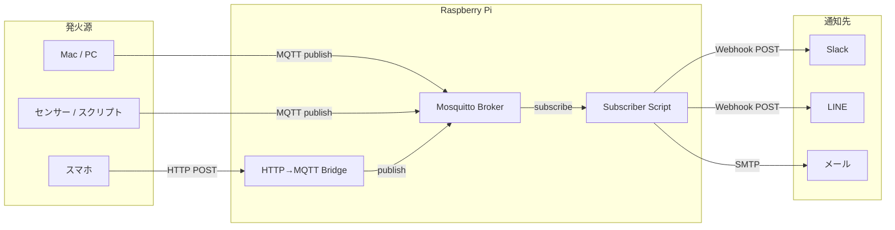

**ポイント：**
- スマホやブラウザからはHTTP経由で、PiがMQTTに変換する
- Subscriber（処理担当）は通知先ごとに分離できる
- **最初は1台でOK。壊れ始めたら分ければいい。**

---

## 用語を最短で整理

| 用語 | 一言で | よくある誤解 |
|------|--------|-------------|
| **MQTT** | 軽量なPub/Subプロトコル | P2Pではない。必ずBrokerを経由する |
| **Broker** | メッセージの仲介サーバー | MosquittoはBrokerの「実装」の一つ |
| **Pub/Sub** | 発行者と購読者の非同期通信 | 1対1ではなく、1対多も可能 |
| **Webhook** | HTTPでイベントを受け取る仕組み | MQTTとは別物。変換が必要 |
| **Incoming Webhook** | Slack等がPOSTを受け付けるURL | SlackがWebhookを「受ける」側 |
| **systemd** | Linuxのサービス管理機構 | 再起動時に自動起動させるために使う |

### MQTT Pub/Sub の仕組み（図解）

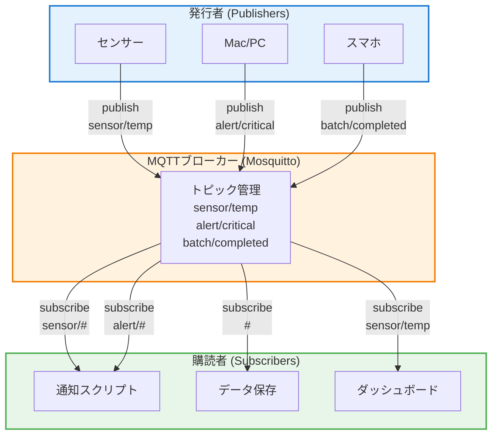

**重要ポイント：**
- PublisherとSubscriberは**直接通信しない**（必ずBrokerを経由）
- トピックで**メッセージを分類**（`#`はワイルドカード）
- 1つのメッセージを**複数のSubscriberが受信可能**
- SubscriberがオフラインでもPublisherは送信できる（非同期）

### MQTTとSQSの違い（よく聞かれる）

| 項目 | MQTT | Amazon SQS |
|------|------|------------|
| プロトコル | MQTT（TCP） | HTTP(S) |
| モデル | Pub/Sub（ブローカー型） | キュー型（ポーリング） |
| 用途 | IoT、リアルタイム通知 | 非同期タスク処理 |
| セルフホスト | 可能（Mosquitto等） | 不可（AWSサービス） |

**SQSはMQTTではありません。** 似たようなメッセージングでも、設計思想が異なります。

---

## データフローの詳細

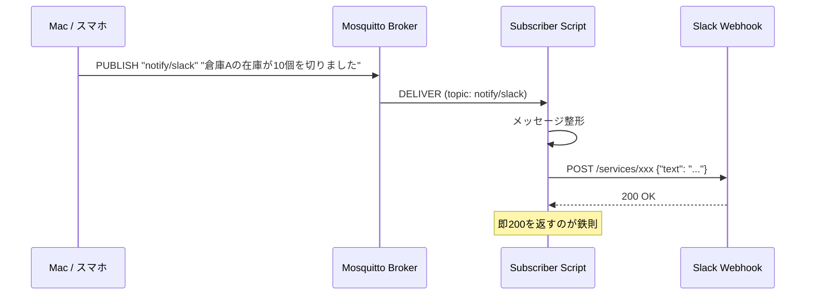

**遅いのはMQTTではなく通知先（Slackなど）。** MQTTは数ミリ秒で届きますが、Slack APIは数百ミリ秒かかることがあります。

---

## 責務分離の設計

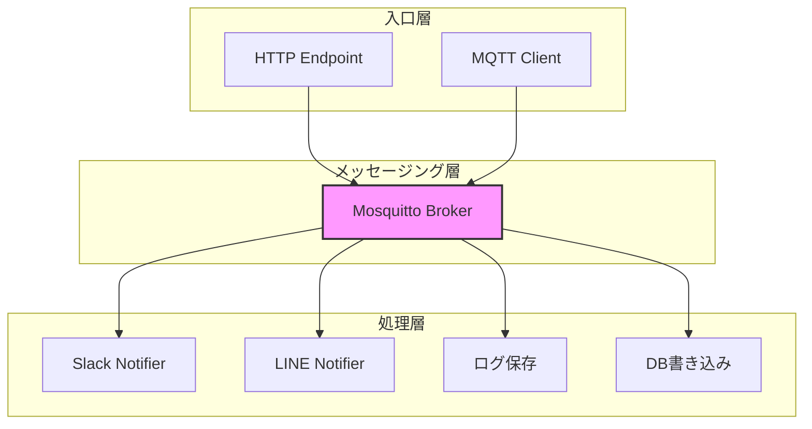

**設計原則：**
1. **入口（Webhook/MQTT Client）** は受け取ったら即座にBrokerへ投げる
2. **Broker** は配送に専念（ロジックを持たない）
3. **処理（Subscriber）** は通知先ごとに独立させる

---

## セットアップ全体フロー

実装を始める前に、全体の流れを把握しましょう。

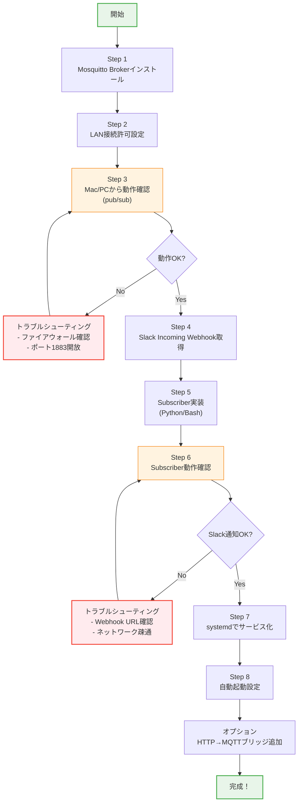

**所要時間目安：**
- Step 1〜3: 15分
- Step 4〜6: 20分
- Step 7〜8: 10分
- オプション: 15分

**合計: 約60分**（トラブルがなければ）

---

## 最小実装チュートリアル

### 前提環境

- Raspberry Pi OS（Bookworm推奨）
- Python 3.9以上
- ネットワーク接続済み

### Step 1: PiにMosquittoを入れて起動

```bash
# Raspberry Pi で実行
sudo apt update
sudo apt install -y mosquitto mosquitto-clients

# 起動確認
sudo systemctl status mosquitto
```

**期待する出力：**
```
● mosquitto.service - Mosquitto MQTT Broker
     Loaded: loaded (/lib/systemd/system/mosquitto.service; enabled)
     Active: active (running) since ...
```

#### LAN内からの接続を許可する設定

```bash
# 設定ファイルを編集
sudo nano /etc/mosquitto/conf.d/local.conf
```

以下を記述：

```conf
listener 1883 0.0.0.0
allow_anonymous true
```

```bash
# 設定を反映
sudo systemctl restart mosquitto

# ポート確認
ss -tlnp | grep 1883
```

> **セキュリティ注意：** `allow_anonymous true` はLAN内専用の設定です。インターネット公開する場合は認証を必ず設定してください（後述）。

### Step 2: MacからpublishしてPiでsubscribe確認

#### Mac側の準備

```bash
# Mac で実行（Homebrewを使用）
brew install mosquitto
```

#### Topic設計（最小構成）

| Topic | 用途 | 例 |
|-------|------|-----|
| `notify/slack` | Slack通知用 | 汎用通知 |
| `events/warehouse/stock` | 倉庫の在庫イベント | 業務別に分離 |
| `cmd/action` | コマンド発行用 | リモート操作 |

#### 動作確認

**ターミナル1（Pi側でsubscribe）：**

```bash
# Raspberry Pi で実行
mosquitto_sub -h localhost -t "notify/slack" -v
```

**ターミナル2（Mac側でpublish）：**

```bash
# Mac で実行（PiのIPアドレスを指定）
mosquitto_pub -h 192.168.1.100 -t "notify/slack" -m "テストメッセージ"
```

**Pi側の出力：**
```
notify/slack テストメッセージ
```

これでMQTTの疎通確認は完了です。

### Step 3: PiのsubscriberがSlack Incoming Webhookへ通知

#### Slack Incoming Webhookの取得

1. [Slack API](https://api.slack.com/apps) で新規アプリを作成
2. 「Incoming Webhooks」を有効化
3. ワークスペースにインストールしてWebhook URLを取得

#### 環境変数の設定

```bash
# Raspberry Pi で実行
echo 'export SLACK_WEBHOOK_URL="https://hooks.slack.com/services/xxx/yyy/zzz"' >> ~/.bashrc
source ~/.bashrc
```

#### Python版 Subscriber（推奨）

```bash
# 必要なライブラリをインストール
pip install paho-mqtt requests
```

`/home/pi/mqtt_to_slack.py` として保存：

```python
#!/usr/bin/env python3
"""
MQTT → Slack 通知スクリプト
Topic: notify/slack を購読し、Slackへ転送する
"""

import os
import json
import requests
import paho.mqtt.client as mqtt
from datetime import datetime

# 設定
BROKER_HOST = "localhost"
BROKER_PORT = 1883
TOPIC = "notify/slack"
SLACK_WEBHOOK_URL = os.environ.get("SLACK_WEBHOOK_URL")

if not SLACK_WEBHOOK_URL:
    raise ValueError("環境変数 SLACK_WEBHOOK_URL が設定されていません")


def send_to_slack(message: str) -> bool:
    """Slackへメッセージを送信"""
    payload = {
        "text": f"📢 *通知* ({datetime.now().strftime('%H:%M:%S')})\n{message}"
    }
    try:
        response = requests.post(
            SLACK_WEBHOOK_URL,
            json=payload,
            timeout=10
        )
        return response.status_code == 200
    except requests.RequestException as e:
        print(f"Slack送信エラー: {e}")
        return False


def on_connect(client, userdata, flags, rc, properties=None):
    """接続時のコールバック"""
    if rc == 0:
        print(f"Brokerに接続しました: {BROKER_HOST}:{BROKER_PORT}")
        client.subscribe(TOPIC)
        print(f"Topic '{TOPIC}' を購読開始")
    else:
        print(f"接続失敗: rc={rc}")


def on_message(client, userdata, msg):
    """メッセージ受信時のコールバック"""
    message = msg.payload.decode("utf-8")
    print(f"[{msg.topic}] {message}")

    if send_to_slack(message):
        print("  → Slack送信成功")
    else:
        print("  → Slack送信失敗")


def main():
    client = mqtt.Client(mqtt.CallbackAPIVersion.VERSION2)
    client.on_connect = on_connect
    client.on_message = on_message

    client.connect(BROKER_HOST, BROKER_PORT, 60)

    print("MQTT Subscriber 起動中... (Ctrl+C で終了)")
    client.loop_forever()


if __name__ == "__main__":
    main()
```

#### 動作確認

```bash
# Raspberry Pi で実行
python3 /home/pi/mqtt_to_slack.py
```

別ターミナルから：

```bash
mosquitto_pub -h localhost -t "notify/slack" -m "倉庫Aの在庫が10個を切りました"
```

Slackに通知が届けば成功です。

#### Bash + curl版（シンプル版）

Python環境がない場合は、bashスクリプトでも実装できます。

`/home/pi/mqtt_to_slack.sh`:

```bash
#!/bin/bash
# MQTT → Slack 通知（bash版）

TOPIC="notify/slack"
WEBHOOK_URL="${SLACK_WEBHOOK_URL}"

mosquitto_sub -h localhost -t "$TOPIC" | while read -r message; do
    timestamp=$(date '+%H:%M:%S')
    payload=$(jq -n --arg text "📢 *通知* ($timestamp)\n$message" '{text: $text}')
    curl -s -X POST -H 'Content-type: application/json' \
        --data "$payload" "$WEBHOOK_URL" > /dev/null
    echo "[$(date)] Sent: $message"
done
```

```bash
chmod +x /home/pi/mqtt_to_slack.sh
```

---

## スマホから叩く方法

MQTTクライアントアプリをインストールする方法もありますが、**現実的にはHTTP経由が最も手軽**です。

### なぜHTTP→MQTTが現実解なのか

| 方式 | メリット | デメリット |
|------|----------|------------|
| MQTTアプリ | 直接通信 | アプリ必須、設定が面倒 |
| HTTP→MQTT | ブラウザ/ショートカットで完結 | 変換用のエンドポイントが必要 |

**結論：HTTP→MQTT変換をPi上に用意するのが最も汎用的。**

### HTTP→MQTTブリッジの処理フロー

```mermaid
sequenceDiagram
    participant Phone as スマホ/ブラウザ
    participant Bridge as HTTP→MQTTブリッジ<br/>(FastAPI)
    participant Broker as Mosquitto Broker
    participant Sub as Subscriber
    participant Slack as Slack

    Phone->>Bridge: POST /publish<br/>{"topic": "alert/critical",<br/>"message": "在庫切れ"}

    Bridge->>Bridge: リクエスト検証<br/>- topic存在確認<br/>- message長さ確認

    alt 検証OK
        Bridge->>Broker: MQTT publish<br/>topic: alert/critical<br/>payload: "在庫切れ"
        Bridge-->>Phone: 200 OK<br/>{"status": "published"}

        Note over Bridge,Broker: ここでHTTPリクエストは完了<br/>（Webhookは即座に返す）

        Broker->>Sub: メッセージ配信<br/>topic: alert/critical
        Sub->>Sub: Slack Webhook作成
        Sub->>Slack: POST Webhook<br/>{"text": "🚨 在庫切れ"}
        Slack-->>Sub: 200 OK

        Note over Sub,Slack: Subscriberが非同期処理<br/>（ブリッジは関与しない）
    else 検証NG
        Bridge-->>Phone: 400 Bad Request<br/>{"error": "invalid topic"}
    end

    style Bridge fill:#fff3e0,stroke:#f57c00,stroke-width:2px
    style Broker fill:#e3f2fd,stroke:#1976d2,stroke-width:2px
    style Sub fill:#e8f5e9,stroke:#4caf50,stroke-width:2px
```

**重要な設計ポイント：**
1. **ブリッジは即座に200を返す**（Slack通知完了を待たない）
2. **検証は最小限**（topic/message存在確認のみ）
3. **重い処理はSubscriberに委譲**（ブリッジは軽量に保つ）
4. **エラーは4xx/5xxで明示**（デバッグしやすく）

### 簡易HTTP→MQTTブリッジ（FastAPI版）

```bash
pip install fastapi uvicorn paho-mqtt
```

`/home/pi/http_to_mqtt.py`:

```python
#!/usr/bin/env python3
"""
HTTP → MQTT ブリッジ
GET/POSTでメッセージを受け取り、MQTTへpublishする
"""

from fastapi import FastAPI, Query
from pydantic import BaseModel
import paho.mqtt.client as mqtt
import uvicorn

app = FastAPI()

# MQTT設定
BROKER_HOST = "localhost"
BROKER_PORT = 1883


class NotifyRequest(BaseModel):
    topic: str = "notify/slack"
    message: str


def publish_mqtt(topic: str, message: str):
    """MQTTへpublish"""
    client = mqtt.Client(mqtt.CallbackAPIVersion.VERSION2)
    client.connect(BROKER_HOST, BROKER_PORT, 60)
    client.publish(topic, message)
    client.disconnect()


@app.get("/notify")
async def notify_get(
    message: str = Query(..., description="通知メッセージ"),
    topic: str = Query("notify/slack", description="MQTTトピック")
):
    """GETで通知（ブラウザ/ショートカット向け）"""
    publish_mqtt(topic, message)
    return {"status": "ok", "topic": topic, "message": message}


@app.post("/notify")
async def notify_post(req: NotifyRequest):
    """POSTで通知（アプリ連携向け）"""
    publish_mqtt(req.topic, req.message)
    return {"status": "ok", "topic": req.topic, "message": req.message}


if __name__ == "__main__":
    uvicorn.run(app, host="0.0.0.0", port=8080)
```

#### 起動

```bash
python3 /home/pi/http_to_mqtt.py
```

#### 使用例

**ブラウザから：**
```
http://192.168.1.100:8080/notify?message=お客様が来店しました
```

**iPhoneショートカットから：**
1. 「ショートカット」アプリを開く
2. 「URLの内容を取得」アクションを追加
3. URL: `http://192.168.1.100:8080/notify?message=帰宅しました`
4. ホーム画面に追加

**curlから：**
```bash
# GET
curl "http://192.168.1.100:8080/notify?message=テスト通知"

# POST
curl -X POST http://192.168.1.100:8080/notify \
  -H "Content-Type: application/json" \
  -d '{"topic": "notify/slack", "message": "在庫補充完了"}'
```

---

## systemdで常駐化

### systemd設定の全体像

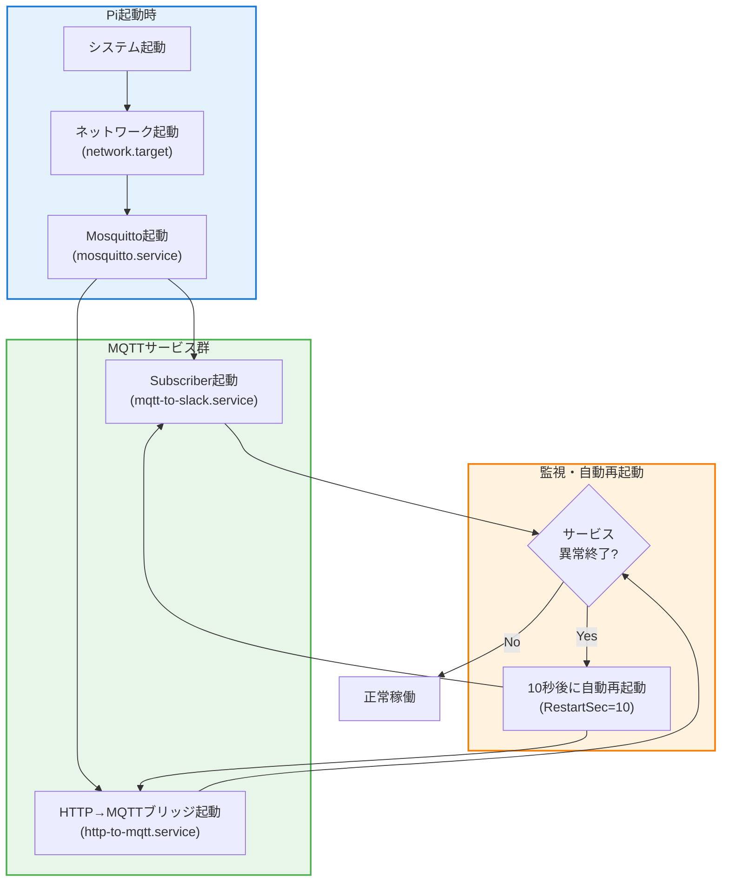

**systemdの利点：**
- **自動起動**：Pi再起動時に自動で全サービス起動
- **依存関係管理**：Mosquitto起動後にSubscriberを起動
- **自動再起動**：異常終了時に自動復旧
- **ログ管理**：journalctlで一元管理

### Subscriberのサービス化

`/etc/systemd/system/mqtt-to-slack.service`:

```ini
[Unit]
Description=MQTT to Slack Notifier
After=network.target mosquitto.service

[Service]
Type=simple
User=pi
Environment="SLACK_WEBHOOK_URL=https://hooks.slack.com/services/xxx/yyy/zzz"
ExecStart=/usr/bin/python3 /home/pi/mqtt_to_slack.py
Restart=always
RestartSec=10

[Install]
WantedBy=multi-user.target
```

```bash
# サービス登録・起動
sudo systemctl daemon-reload
sudo systemctl enable mqtt-to-slack
sudo systemctl start mqtt-to-slack

# 状態確認
sudo systemctl status mqtt-to-slack
```

### HTTP→MQTTブリッジのサービス化

`/etc/systemd/system/http-to-mqtt.service`:

```ini
[Unit]
Description=HTTP to MQTT Bridge
After=network.target mosquitto.service

[Service]
Type=simple
User=pi
ExecStart=/usr/bin/python3 /home/pi/http_to_mqtt.py
Restart=always
RestartSec=10

[Install]
WantedBy=multi-user.target
```

```bash
sudo systemctl daemon-reload
sudo systemctl enable http-to-mqtt
sudo systemctl start http-to-mqtt
```

### ログ閲覧

```bash
# リアルタイムログ
sudo journalctl -u mqtt-to-slack -f

# 過去ログ（直近100行）
sudo journalctl -u mqtt-to-slack -n 100

# 今日のログ
sudo journalctl -u mqtt-to-slack --since today
```

### 再起動コマンド

```bash
# 設定変更後
sudo systemctl restart mqtt-to-slack

# 停止
sudo systemctl stop mqtt-to-slack
```

---

## 壊れやすいポイントと対策

### トラブルシューティングフローチャート

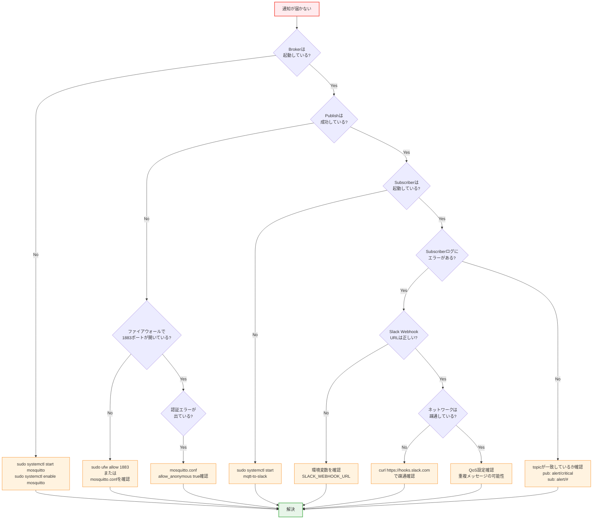

**よくある問題トップ3：**
1. **Mosquitto未起動**（`sudo systemctl status mosquitto`で確認）
2. **topic名の不一致**（`alert/critical` vs `alert/#`）
3. **Slack Webhook URL間違い**（環境変数を再確認）

### 1. 処理が重いとSubscriberが詰まる

**問題：** Slack APIが遅い、またはタイムアウトするとメッセージが滞留

**対策：**
```python
# 非同期処理にする（簡易版）
import threading

def on_message(client, userdata, msg):
    message = msg.payload.decode("utf-8")
    # バックグラウンドで送信
    threading.Thread(target=send_to_slack, args=(message,)).start()
```

### 2. Webhookエンドポイントが即200を返さない

**問題：** 外部からのHTTPリクエストがタイムアウトする

**対策：** Webhookは受け取ったら即座に200を返し、処理はバックグラウンドで実行

```python
@app.post("/notify")
async def notify_post(req: NotifyRequest, background_tasks: BackgroundTasks):
    """即200を返し、MQTT送信はバックグラウンドで"""
    background_tasks.add_task(publish_mqtt, req.topic, req.message)
    return {"status": "accepted"}
```

### 3. QoSと重複メッセージ

| QoS | 意味 | 用途 |
|-----|------|------|
| 0 | 最大1回（届かないかも） | ログ、センサー値 |
| 1 | 最低1回（重複あり） | 通知（推奨） |
| 2 | 必ず1回（オーバーヘッド大） | 決済等（MQTTでは稀） |

**対策：** 通知システムはQoS 1で十分。冪等性を意識した設計にする。

### 4. Brokerがダウンしたら

**対策：**
- systemdの `Restart=always` で自動復旧
- 監視スクリプトを別途用意

```bash
# 簡易監視（cron登録用）
mosquitto_pub -h localhost -t "health/check" -m "ping" || \
  sudo systemctl restart mosquitto
```

---

## セキュリティ注意点

### セキュリティレイヤー構成

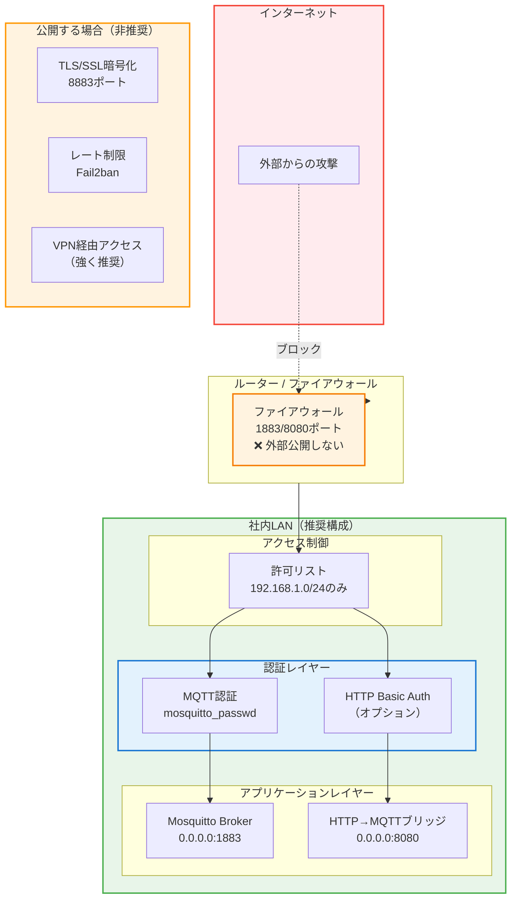

**セキュリティレベル別推奨構成：**

| レベル | 構成 | 用途 |
|--------|------|------|
| **Level 1<br/>（最小）** | LAN限定 + `allow_anonymous true` | 社内PoC、個人利用 |
| **Level 2<br/>（推奨）** | LAN限定 + MQTT認証 + IPフィルタ | 小規模運用 |
| **Level 3<br/>（堅牢）** | VPN + TLS + 認証 + レート制限 | 外部アクセスが必要な場合 |

### LAN限定運用（推奨）

- ルーターで1883/8080ポートを外部公開しない
- `allow_anonymous true` は社内LAN限定

### 認証を追加する場合

```bash
# パスワードファイル作成
sudo mosquitto_passwd -c /etc/mosquitto/passwd mqttuser
```

`/etc/mosquitto/conf.d/local.conf`:
```conf
listener 1883 0.0.0.0
allow_anonymous false
password_file /etc/mosquitto/passwd
```

```bash
sudo systemctl restart mosquitto
```

クライアント側：
```bash
mosquitto_pub -h 192.168.1.100 -u mqttuser -P password -t "notify/slack" -m "test"
```

### Webhook URLの保護

- Slack Webhook URLは漏洩すると誰でも投稿できる
- 環境変数で管理し、GitHubに絶対にpushしない
- 定期的にURLを再生成する運用も検討

### 公開する場合（非推奨だが必要なら）

- TLS/SSL必須（Let's Encrypt + nginx リバースプロキシ）
- API Key認証を追加
- レートリミットを設定

---

## 実践ユースケース集

この構成は以下のような現場で実際に活用できます。

### ユースケース① 倉庫在庫管理

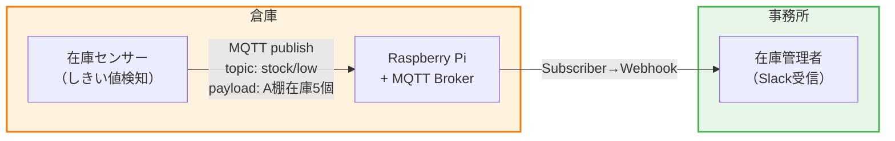

**実装例：**
- センサー：Arduinoでカウント → MQTTで送信
- 通知：「🚨 A棚の在庫が5個まで減少しました」

### ユースケース② バッチ処理完了通知

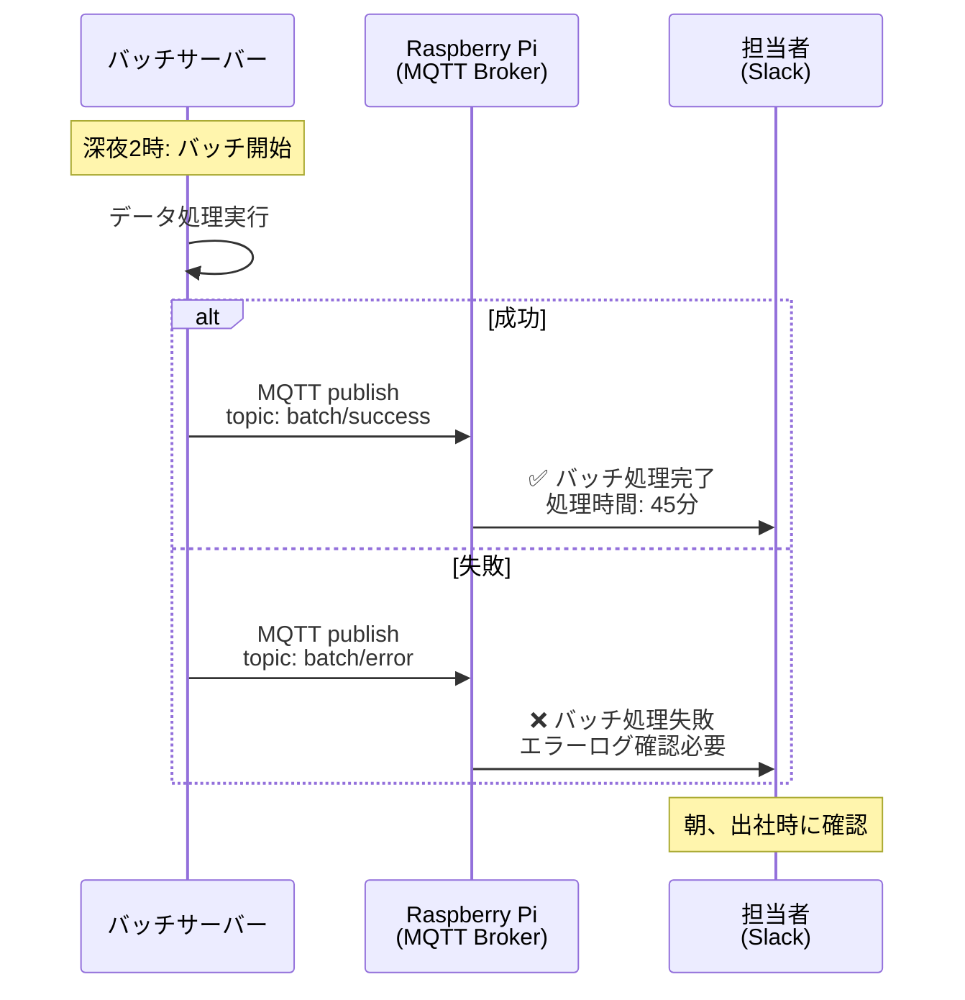

**実装例：**
```bash
# バッチスクリプトの最後に
if [ $? -eq 0 ]; then
  mosquitto_pub -h 192.168.1.100 -t "batch/success" -m "処理完了"
else
  mosquitto_pub -h 192.168.1.100 -t "batch/error" -m "処理失敗"
fi
```

### ユースケース③ 受付呼び出しシステム

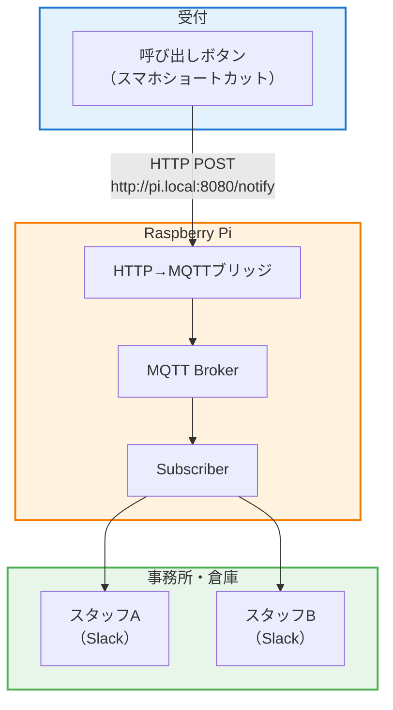

**実装例：**
- iPhoneショートカット：ボタン1タップでHTTP POST
- 通知：「📞 受付にお客様がいらっしゃいました」

---

## まとめ

この記事では、**Raspberry Pi 1台で構築できる現場通知システム**を解説しました。

### 構成のポイント

1. **Mosquitto**をブローカーとしてLAN内に設置
2. **MQTT**でメッセージを配信（軽量・高速）
3. **Webhook**でHTTPからの入力を受け付け
4. **systemd**で常駐化・自動復旧

### この設計の強み

- **AWSなしで動く**：月額費用ゼロ、LAN完結
- **拡張性がある**：通知先を増やすのはSubscriberを追加するだけ
- **移行パスがある**：必要になればAWS IoTへスムーズに移行可能

> **最初は1台でOK。壊れ始めたら分ければいい。**

小さく始めて、効果を確認しながら拡大していく。それが現場通知システム導入の正解です。

