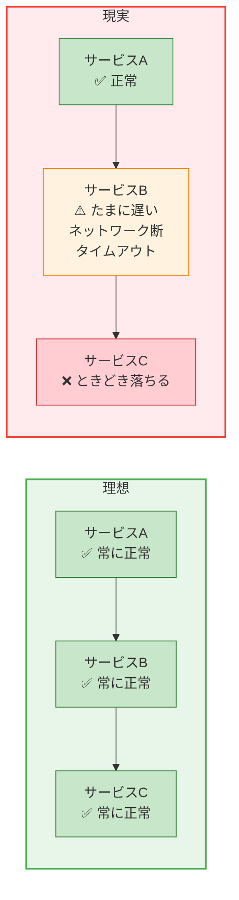
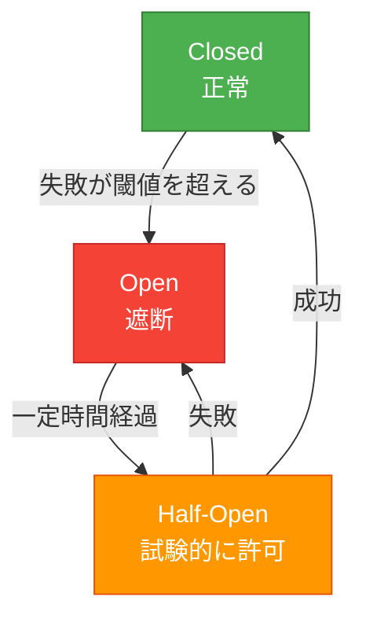
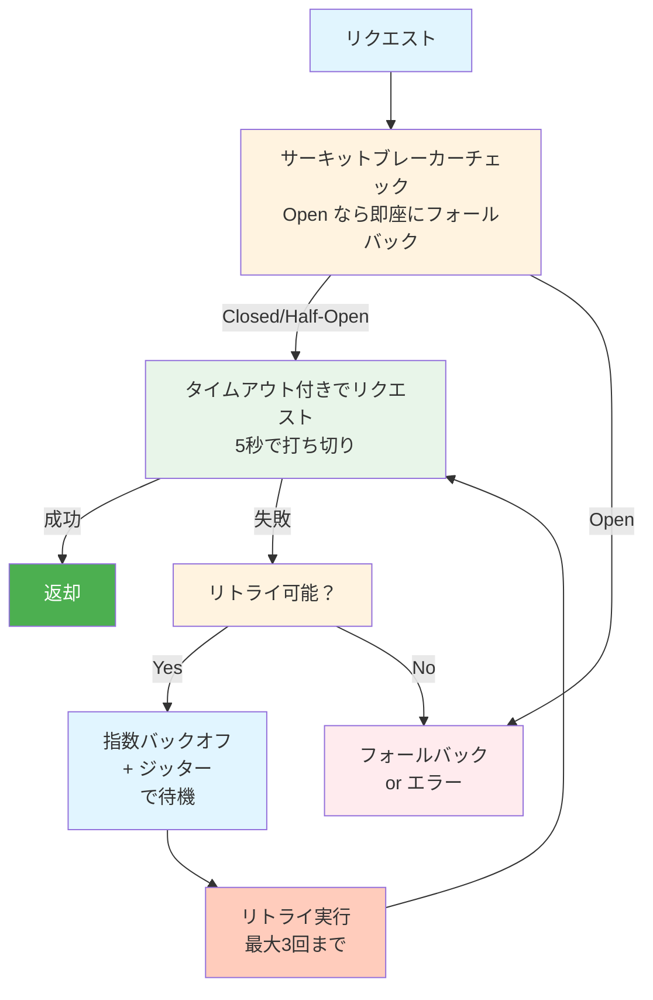
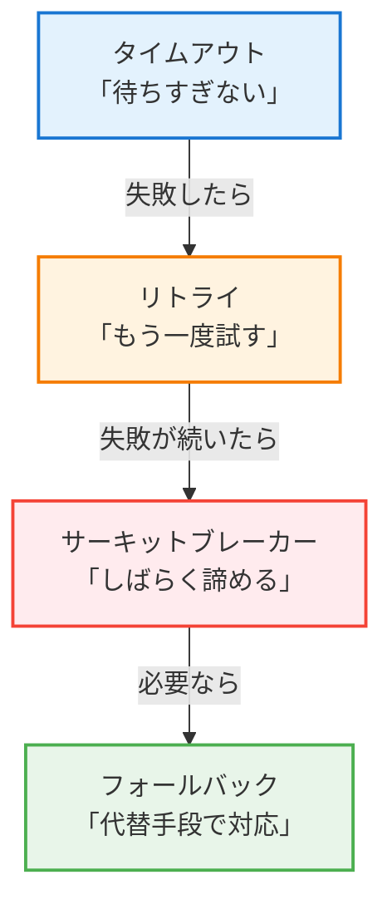

## この記事の対象読者

- 外部APIを呼び出すコードを書いている人
- 「たまに失敗する」処理に悩んでいる人
- 障害が連鎖して全体が落ちた経験がある人
- マイクロサービスを設計・運用している人

この記事では、**リトライ**、**サーキットブレーカー**、**タイムアウト**の3つの耐障害パターンを体系的に解説します。これらは単独でも強力ですが、**組み合わせることで真価を発揮**します。

---

## なぜ耐障害設計が必要なのか

### 分散システムの現実



### 何も対策しないと

```mermaid
sequenceDiagram
    participant A as サービスA
    participant B as サービスB
    participant C as サービスC

    Note over C: 1. サービスCが遅くなる
    A->>B: リクエスト
    B->>C: リクエスト
    Note over B,C: 2. サービスBがCを待ち続ける
    Note over B: 3. スレッド枯渇
    A->>B: 別のリクエスト
    Note over A,B: 4. サービスAもBを待ち続ける
    Note over A: スレッド枯渇
    Note over A,B,C: 5. 全体が連鎖的に死ぬ 💀
```

**これが「障害の連鎖」です。**

### 3つの武器

| パターン | 役割 | 例え |
|---------|------|------|
| **タイムアウト** | 待ち時間を制限 | 「5秒待ってダメなら諦める」 |
| **リトライ** | 一時的な障害を乗り越える | 「失敗したらもう一度」 |
| **サーキットブレーカー** | 連鎖障害を防ぐ | 「壊れた相手に連絡しない」 |

---

# 第1部：タイムアウト

## タイムアウトとは

**タイムアウト** は、処理の待ち時間に上限を設けることです。

```python
# タイムアウトなし（危険）
response = requests.get("https://slow-api.example.com/data")
# → 相手が応答しなければ永遠に待つ

# タイムアウトあり（安全）
response = requests.get("https://slow-api.example.com/data", timeout=5)
# → 5秒で諦める
```

## なぜタイムアウトが必要か


## タイムアウトの種類

### 1. コネクションタイムアウト

TCP接続の確立までの制限時間

```python
import requests

# コネクションタイムアウト: 3秒
# 読み取りタイムアウト: 10秒
response = requests.get(
    "https://api.example.com/data",
    timeout=(3, 10)  # (connect, read)
)
```

### 2. 読み取り（リード）タイムアウト

データ受信の制限時間

```python
import socket

sock = socket.socket(socket.AF_INET, socket.SOCK_STREAM)
sock.settimeout(10)  # 10秒
sock.connect(("example.com", 80))
data = sock.recv(1024)  # 10秒以内にデータが来なければタイムアウト
```

### 3. リクエスト全体のタイムアウト

接続からレスポンス完了までの総時間

```python
import httpx

# 全体で30秒
with httpx.Client(timeout=30.0) as client:
    response = client.get("https://api.example.com/data")

# より細かく設定
timeout = httpx.Timeout(
    connect=5.0,      # 接続
    read=10.0,        # 読み取り
    write=5.0,        # 書き込み
    pool=5.0          # プールからの取得
)
```

## 適切なタイムアウト値の決め方

### 考慮すべき要素

```
タイムアウト値 =
    通常時の応答時間（p99）
    + バッファ（20-50%）
    + 許容できる待ち時間
```

### 実測に基づく設定

```python
import time
import statistics

# 100回リクエストして応答時間を測定
response_times = []
for _ in range(100):
    start = time.time()
    requests.get("https://api.example.com/data", timeout=30)
    response_times.append(time.time() - start)

# 統計を取る
print(f"平均: {statistics.mean(response_times):.3f}s")
print(f"p50: {statistics.median(response_times):.3f}s")
print(f"p99: {statistics.quantiles(response_times, n=100)[98]:.3f}s")
print(f"最大: {max(response_times):.3f}s")

# 結果例:
# 平均: 0.150s
# p50: 0.120s
# p99: 0.450s
# 最大: 1.200s

# → タイムアウト値: 0.450 * 1.5 ≈ 0.7秒 or 1秒
```

### ユースケース別の目安

| ユースケース | 推奨タイムアウト |
|-------------|----------------|
| ヘルスチェック | 1-3秒 |
| 社内API | 3-10秒 |
| 外部API（決済等） | 10-30秒 |
| ファイルアップロード | 60-300秒 |
| バッチ処理 | 処理内容による |

## データベース接続のタイムアウト

### MySQL

```python
import mysql.connector

conn = mysql.connector.connect(
    host="localhost",
    user="root",
    password="password",
    database="mydb",
    connection_timeout=10,    # 接続タイムアウト
    read_timeout=30,          # 読み取りタイムアウト
    write_timeout=30          # 書き込みタイムアウト
)
```

```sql
-- クエリ単位のタイムアウト
SET SESSION MAX_EXECUTION_TIME = 30000;  -- 30秒（ミリ秒）
SELECT * FROM large_table WHERE ...;
```

### PostgreSQL

```python
import psycopg2

conn = psycopg2.connect(
    host="localhost",
    dbname="mydb",
    user="user",
    password="password",
    connect_timeout=10,       # 接続タイムアウト
    options="-c statement_timeout=30000"  # クエリタイムアウト（ミリ秒）
)
```

## HTTPクライアント別の設定

### Python requests

```python
import requests
from requests.adapters import HTTPAdapter
from urllib3.util.retry import Retry

session = requests.Session()

# タイムアウトをデフォルト化
class TimeoutHTTPAdapter(HTTPAdapter):
    def __init__(self, *args, timeout=10, **kwargs):
        self.timeout = timeout
        super().__init__(*args, **kwargs)

    def send(self, request, **kwargs):
        kwargs.setdefault('timeout', self.timeout)
        return super().send(request, **kwargs)

session.mount('http://', TimeoutHTTPAdapter(timeout=10))
session.mount('https://', TimeoutHTTPAdapter(timeout=10))

# これでtimeout指定なしでも10秒でタイムアウト
response = session.get("https://api.example.com/data")
```

### Node.js axios

```javascript
const axios = require('axios');

const client = axios.create({
  timeout: 10000,  // 10秒
  // または個別に設定
  // timeoutErrorMessage: 'Request timed out'
});

// リクエスト
try {
  const response = await client.get('https://api.example.com/data');
} catch (error) {
  if (error.code === 'ECONNABORTED') {
    console.log('Timeout!');
  }
}
```

### Go

```go
package main

import (
    "context"
    "net/http"
    "time"
)

func main() {
    // クライアントレベルのタイムアウト
    client := &http.Client{
        Timeout: 10 * time.Second,
    }

    // または context で制御
    ctx, cancel := context.WithTimeout(context.Background(), 10*time.Second)
    defer cancel()

    req, _ := http.NewRequestWithContext(ctx, "GET", "https://api.example.com/data", nil)
    resp, err := client.Do(req)
    if err != nil {
        // context.DeadlineExceeded ならタイムアウト
    }
}
```

---

# 第2部：リトライ

## リトライとは

**リトライ** は、失敗した処理を再試行することです。

```python
# 単純なリトライ
for attempt in range(3):
    try:
        response = requests.get("https://api.example.com/data")
        break
    except requests.RequestException:
        if attempt == 2:
            raise
        time.sleep(1)
```

## なぜリトライが必要か

ネットワークや外部サービスには **一時的な障害（Transient Fault）** があります：

```
一時的な障害の例：
- ネットワークの瞬断
- サーバーの一時的な過負荷
- DNS解決の失敗
- コネクションプールの枯渇
- ガベージコレクションによる一時停止
```

**これらは少し待てば解消することが多い。**

## リトライすべき場合・すべきでない場合

### リトライすべき

```
✅ ネットワークエラー（タイムアウト、接続拒否）
✅ 5xx エラー（502, 503, 504）
✅ 429 Too Many Requests（レート制限）
✅ データベースのデッドロック
✅ 一時的なリソース不足
```

### リトライすべきでない

```
❌ 4xx エラー（400, 401, 403, 404）
   → クライアント側の問題、リトライしても無駄

❌ ビジネスロジックのエラー
   → 「在庫なし」をリトライしても在庫は増えない

❌ 認証エラー
   → トークンを更新しないと意味がない

❌ 冪等でない操作（注意が必要）
   → 二重課金のリスク
```

## リトライ戦略

### 1. 即時リトライ

```python
# 最もシンプル（ただし危険）
for attempt in range(3):
    try:
        return call_api()
    except Exception:
        if attempt == 2:
            raise
```

**問題:** 障害中のサーバーにリクエストが集中（雪崩効果）

### 2. 固定間隔リトライ

```python
import time

def retry_fixed(func, max_retries=3, delay=1.0):
    for attempt in range(max_retries):
        try:
            return func()
        except Exception as e:
            if attempt == max_retries - 1:
                raise
            time.sleep(delay)  # 固定で1秒待つ
```

**問題:** 全クライアントが同じタイミングでリトライ

### 3. 指数バックオフ（Exponential Backoff）

```python
import time
import random

def retry_exponential_backoff(func, max_retries=5, base_delay=1.0, max_delay=60.0):
    """
    指数バックオフでリトライ
    1回目: 1秒
    2回目: 2秒
    3回目: 4秒
    4回目: 8秒
    ...
    """
    for attempt in range(max_retries):
        try:
            return func()
        except Exception as e:
            if attempt == max_retries - 1:
                raise

            # 指数的に増加する待ち時間
            delay = min(base_delay * (2 ** attempt), max_delay)
            time.sleep(delay)
```

### 4. 指数バックオフ + ジッター（推奨）

```python
import time
import random

def retry_with_jitter(func, max_retries=5, base_delay=1.0, max_delay=60.0):
    """
    指数バックオフ + ランダムなジッター
    → 複数クライアントのリトライタイミングを分散
    """
    for attempt in range(max_retries):
        try:
            return func()
        except RetryableError as e:
            if attempt == max_retries - 1:
                raise

            # 指数バックオフ
            delay = min(base_delay * (2 ** attempt), max_delay)

            # ジッター（0〜delay の範囲でランダム）
            jitter = random.uniform(0, delay)
            actual_delay = delay + jitter

            print(f"Attempt {attempt + 1} failed. Retrying in {actual_delay:.2f}s")
            time.sleep(actual_delay)
```

### ジッターの種類

```python
# Full Jitter（推奨）
delay = random.uniform(0, min(cap, base * 2 ** attempt))

# Equal Jitter
temp = min(cap, base * 2 ** attempt)
delay = temp / 2 + random.uniform(0, temp / 2)

# Decorrelated Jitter
delay = min(cap, random.uniform(base, delay * 3))
```

## 実践的なリトライ実装

### デコレータパターン

```python
import functools
import time
import random
from typing import Type, Tuple

def retry(
    max_retries: int = 3,
    base_delay: float = 1.0,
    max_delay: float = 60.0,
    exceptions: Tuple[Type[Exception], ...] = (Exception,),
    on_retry: callable = None
):
    """
    リトライデコレータ

    @retry(max_retries=5, exceptions=(ConnectionError, TimeoutError))
    def call_external_api():
        ...
    """
    def decorator(func):
        @functools.wraps(func)
        def wrapper(*args, **kwargs):
            last_exception = None

            for attempt in range(max_retries):
                try:
                    return func(*args, **kwargs)

                except exceptions as e:
                    last_exception = e

                    if attempt == max_retries - 1:
                        raise

                    delay = min(base_delay * (2 ** attempt), max_delay)
                    jitter = random.uniform(0, delay * 0.1)
                    sleep_time = delay + jitter

                    if on_retry:
                        on_retry(attempt + 1, e, sleep_time)

                    time.sleep(sleep_time)

            raise last_exception

        return wrapper
    return decorator

# 使用例
@retry(
    max_retries=5,
    base_delay=1.0,
    exceptions=(requests.RequestException,),
    on_retry=lambda a, e, t: print(f"Retry {a}: {e}, waiting {t:.2f}s")
)
def fetch_user(user_id: int):
    response = requests.get(f"https://api.example.com/users/{user_id}", timeout=10)
    response.raise_for_status()
    return response.json()
```

### Tenacity ライブラリ（推奨）

```python
from tenacity import (
    retry,
    stop_after_attempt,
    wait_exponential,
    retry_if_exception_type,
    before_sleep_log
)
import logging

logging.basicConfig(level=logging.INFO)
logger = logging.getLogger(__name__)

@retry(
    stop=stop_after_attempt(5),
    wait=wait_exponential(multiplier=1, min=1, max=60),
    retry=retry_if_exception_type((ConnectionError, TimeoutError)),
    before_sleep=before_sleep_log(logger, logging.WARNING)
)
def call_api():
    response = requests.get("https://api.example.com/data", timeout=10)
    response.raise_for_status()
    return response.json()

# 非同期版
@retry(
    stop=stop_after_attempt(5),
    wait=wait_exponential(multiplier=1, min=1, max=60)
)
async def call_api_async():
    async with httpx.AsyncClient() as client:
        response = await client.get("https://api.example.com/data")
        response.raise_for_status()
        return response.json()
```

## リトライと冪等性

### 冪等でない操作の問題

```python
# 危険：決済処理
def process_payment(order_id, amount):
    response = payment_api.charge(order_id, amount)
    return response

# リトライすると二重課金の可能性！
# 1回目: 成功（課金された）
# レスポンスがタイムアウト
# 2回目: また成功（二重課金！）
```

### 解決策1：冪等キー

```python
import uuid

def process_payment_idempotent(order_id, amount):
    # 冪等キーを生成（同じ注文なら同じキー）
    idempotency_key = f"payment-{order_id}"

    response = payment_api.charge(
        order_id=order_id,
        amount=amount,
        idempotency_key=idempotency_key  # APIが対応している必要あり
    )
    return response
```

### 解決策2：ローカルで重複チェック

```python
def process_payment_with_check(order_id, amount, redis_client):
    lock_key = f"payment_lock:{order_id}"

    # 既に処理中/処理済みかチェック
    if redis_client.exists(lock_key):
        raise AlreadyProcessedError(f"Payment for order {order_id} already in progress")

    # ロックを取得（5分で期限切れ）
    redis_client.setex(lock_key, 300, "processing")

    try:
        result = payment_api.charge(order_id, amount)
        redis_client.setex(lock_key, 86400, "completed")  # 24時間保持
        return result
    except Exception as e:
        redis_client.delete(lock_key)  # 失敗したらロック解除
        raise
```

---

# 第3部：サーキットブレーカー

## サーキットブレーカーとは

**サーキットブレーカー** は、障害が発生しているサービスへのリクエストを一時的に遮断するパターンです。

電気のブレーカーと同じ発想：**異常を検知したら回路を切る**


## 3つの状態



| 状態 | 動作 |
|------|------|
| **Closed** | 通常通りリクエストを通す。失敗をカウント |
| **Open** | リクエストを即座に拒否（試行しない） |
| **Half-Open** | 一部のリクエストだけ通して様子を見る |

## 状態遷移のトリガー

```
Closed → Open:
  - 直近N回のうちM回失敗
  - 直近N秒間の失敗率がX%を超えた
  - 連続でN回失敗

Open → Half-Open:
  - 一定時間（例：30秒）経過

Half-Open → Closed:
  - 試験リクエストが成功

Half-Open → Open:
  - 試験リクエストが失敗
```

## Pythonでの実装

### シンプルな実装

```python
import time
from enum import Enum
from threading import Lock

class CircuitState(Enum):
    CLOSED = "closed"
    OPEN = "open"
    HALF_OPEN = "half_open"

class CircuitBreaker:
    def __init__(
        self,
        failure_threshold: int = 5,
        success_threshold: int = 2,
        timeout: float = 30.0
    ):
        self.failure_threshold = failure_threshold  # Open になる失敗回数
        self.success_threshold = success_threshold  # Closed に戻る成功回数
        self.timeout = timeout                      # Open から Half-Open までの時間

        self.state = CircuitState.CLOSED
        self.failure_count = 0
        self.success_count = 0
        self.last_failure_time = None
        self.lock = Lock()

    def call(self, func, *args, **kwargs):
        with self.lock:
            if self.state == CircuitState.OPEN:
                if self._should_try_reset():
                    self.state = CircuitState.HALF_OPEN
                    self.success_count = 0
                else:
                    raise CircuitBreakerOpenError("Circuit breaker is OPEN")

        try:
            result = func(*args, **kwargs)
            self._on_success()
            return result
        except Exception as e:
            self._on_failure()
            raise

    def _should_try_reset(self) -> bool:
        """Open状態からHalf-Openに移行すべきか"""
        if self.last_failure_time is None:
            return False
        return time.time() - self.last_failure_time >= self.timeout

    def _on_success(self):
        with self.lock:
            if self.state == CircuitState.HALF_OPEN:
                self.success_count += 1
                if self.success_count >= self.success_threshold:
                    self.state = CircuitState.CLOSED
                    self.failure_count = 0
            elif self.state == CircuitState.CLOSED:
                self.failure_count = 0  # 成功したらリセット

    def _on_failure(self):
        with self.lock:
            self.last_failure_time = time.time()

            if self.state == CircuitState.HALF_OPEN:
                self.state = CircuitState.OPEN
            elif self.state == CircuitState.CLOSED:
                self.failure_count += 1
                if self.failure_count >= self.failure_threshold:
                    self.state = CircuitState.OPEN

class CircuitBreakerOpenError(Exception):
    pass

# 使用例
circuit_breaker = CircuitBreaker(
    failure_threshold=5,
    success_threshold=2,
    timeout=30.0
)

def call_external_api():
    return circuit_breaker.call(
        lambda: requests.get("https://api.example.com/data", timeout=5)
    )

try:
    response = call_external_api()
except CircuitBreakerOpenError:
    # サーキットブレーカーが開いている → フォールバック処理
    return get_cached_data()
except requests.RequestException:
    # 通常のエラー
    raise
```

### pybreaker ライブラリ

```python
import pybreaker

# サーキットブレーカーを作成
breaker = pybreaker.CircuitBreaker(
    fail_max=5,              # 5回失敗でOpen
    reset_timeout=30,        # 30秒後にHalf-Open
    exclude=[ValueError],    # この例外は失敗としてカウントしない
)

# リスナーで状態変化を監視
class LoggingListener(pybreaker.CircuitBreakerListener):
    def state_change(self, cb, old_state, new_state):
        print(f"Circuit breaker state: {old_state.name} -> {new_state.name}")

    def failure(self, cb, exc):
        print(f"Circuit breaker failure: {exc}")

breaker.add_listener(LoggingListener())

# デコレータとして使用
@breaker
def call_api():
    response = requests.get("https://api.example.com/data", timeout=5)
    response.raise_for_status()
    return response.json()

# 使用
try:
    data = call_api()
except pybreaker.CircuitBreakerError:
    # サーキットブレーカーがOpen
    data = get_fallback_data()
```

## フォールバック戦略

サーキットブレーカーが開いている時、どうするか？

### 1. キャッシュを返す

```python
def get_user_data(user_id):
    try:
        return circuit_breaker.call(lambda: fetch_from_api(user_id))
    except CircuitBreakerOpenError:
        # キャッシュから返す
        cached = cache.get(f"user:{user_id}")
        if cached:
            return cached
        raise ServiceUnavailableError("Service unavailable and no cache")
```

### 2. デフォルト値を返す

```python
def get_recommendations(user_id):
    try:
        return circuit_breaker.call(lambda: recommendation_api.get(user_id))
    except CircuitBreakerOpenError:
        # デフォルトのおすすめを返す
        return get_default_recommendations()
```

### 3. 代替サービスを使う

```python
def get_exchange_rate(currency):
    try:
        return primary_breaker.call(lambda: primary_api.get_rate(currency))
    except CircuitBreakerOpenError:
        # セカンダリAPIにフォールバック
        return secondary_breaker.call(lambda: secondary_api.get_rate(currency))
```

### 4. 機能を無効化

```python
def get_product_with_reviews(product_id):
    product = product_api.get(product_id)

    try:
        reviews = reviews_breaker.call(lambda: reviews_api.get(product_id))
        product['reviews'] = reviews
    except CircuitBreakerOpenError:
        # レビュー機能を無効化（商品は表示）
        product['reviews'] = []
        product['reviews_unavailable'] = True

    return product
```

---

# 第4部：3つを組み合わせる

## 完全な実装パターン

```python
import time
import random
from typing import Callable, Any, Optional
from dataclasses import dataclass
from enum import Enum
import requests

@dataclass
class ResilienceConfig:
    # タイムアウト
    timeout: float = 10.0

    # リトライ
    max_retries: int = 3
    base_delay: float = 1.0
    max_delay: float = 30.0

    # サーキットブレーカー
    failure_threshold: int = 5
    success_threshold: int = 2
    breaker_timeout: float = 30.0

class ResilientClient:
    """
    タイムアウト + リトライ + サーキットブレーカーを統合したクライアント
    """

    def __init__(self, config: ResilienceConfig = None):
        self.config = config or ResilienceConfig()
        self.circuit_breaker = CircuitBreaker(
            failure_threshold=self.config.failure_threshold,
            success_threshold=self.config.success_threshold,
            timeout=self.config.breaker_timeout
        )

    def call(
        self,
        func: Callable,
        fallback: Optional[Callable] = None,
        *args,
        **kwargs
    ) -> Any:
        """
        耐障害性を持ったAPI呼び出し

        1. サーキットブレーカーをチェック
        2. タイムアウト付きでリクエスト
        3. 失敗したらリトライ
        4. 最終的に失敗したらフォールバック
        """

        # サーキットブレーカーが開いている場合
        if self.circuit_breaker.is_open():
            if fallback:
                return fallback()
            raise CircuitBreakerOpenError("Circuit breaker is open")

        last_exception = None

        for attempt in range(self.config.max_retries):
            try:
                # サーキットブレーカー経由で呼び出し
                result = self.circuit_breaker.call(func, *args, **kwargs)
                return result

            except CircuitBreakerOpenError:
                # サーキットブレーカーが開いた
                if fallback:
                    return fallback()
                raise

            except RetryableError as e:
                last_exception = e

                if attempt < self.config.max_retries - 1:
                    delay = self._calculate_delay(attempt)
                    print(f"Attempt {attempt + 1} failed: {e}. Retrying in {delay:.2f}s")
                    time.sleep(delay)

        # 全リトライ失敗
        if fallback:
            return fallback()
        raise last_exception

    def _calculate_delay(self, attempt: int) -> float:
        """指数バックオフ + ジッター"""
        delay = min(
            self.config.base_delay * (2 ** attempt),
            self.config.max_delay
        )
        jitter = random.uniform(0, delay * 0.1)
        return delay + jitter

class RetryableError(Exception):
    """リトライ可能なエラー"""
    pass

# 使用例
client = ResilientClient(ResilienceConfig(
    timeout=5.0,
    max_retries=3,
    failure_threshold=5,
    breaker_timeout=30.0
))

def fetch_user(user_id: int) -> dict:
    response = requests.get(
        f"https://api.example.com/users/{user_id}",
        timeout=5.0
    )
    if response.status_code >= 500:
        raise RetryableError(f"Server error: {response.status_code}")
    response.raise_for_status()
    return response.json()

def get_cached_user(user_id: int) -> dict:
    return cache.get(f"user:{user_id}") or {"id": user_id, "name": "Unknown"}

# 呼び出し
user = client.call(
    func=lambda: fetch_user(123),
    fallback=lambda: get_cached_user(123)
)
```

## 処理フロー



---

# 第5部：監視とアラート

## 監視すべきメトリクス

### リトライ

```python
from prometheus_client import Counter, Histogram

retry_total = Counter(
    'api_retry_total',
    'Total number of retries',
    ['service', 'endpoint', 'attempt']
)

retry_success = Counter(
    'api_retry_success_total',
    'Retries that eventually succeeded',
    ['service', 'endpoint']
)

# リトライ時に記録
retry_total.labels(service='user-api', endpoint='/users', attempt='2').inc()
```

### サーキットブレーカー

```python
from prometheus_client import Gauge, Counter

circuit_state = Gauge(
    'circuit_breaker_state',
    'Current state of circuit breaker (0=closed, 1=open, 2=half-open)',
    ['service']
)

circuit_state_changes = Counter(
    'circuit_breaker_state_changes_total',
    'Number of circuit breaker state changes',
    ['service', 'from_state', 'to_state']
)

# 状態変化時に記録
circuit_state.labels(service='payment-api').set(1)  # Open
circuit_state_changes.labels(
    service='payment-api',
    from_state='closed',
    to_state='open'
).inc()
```

### タイムアウト

```python
timeout_total = Counter(
    'api_timeout_total',
    'Total number of timeouts',
    ['service', 'endpoint']
)

request_duration = Histogram(
    'api_request_duration_seconds',
    'Request duration in seconds',
    ['service', 'endpoint'],
    buckets=[0.1, 0.5, 1.0, 2.0, 5.0, 10.0, 30.0]
)
```

## Prometheusアラート

```yaml
groups:
  - name: resilience_alerts
    rules:
      # サーキットブレーカーがOpen
      - alert: CircuitBreakerOpen
        expr: circuit_breaker_state == 1
        for: 1m
        labels:
          severity: critical
        annotations:
          summary: "Circuit breaker is OPEN for {{ $labels.service }}"

      # リトライ率が高い
      - alert: HighRetryRate
        expr: |
          sum(rate(api_retry_total[5m])) by (service)
          / sum(rate(api_request_total[5m])) by (service) > 0.1
        for: 5m
        labels:
          severity: warning
        annotations:
          summary: "High retry rate (>10%) for {{ $labels.service }}"

      # タイムアウトが多い
      - alert: HighTimeoutRate
        expr: |
          sum(rate(api_timeout_total[5m])) by (service)
          / sum(rate(api_request_total[5m])) by (service) > 0.05
        for: 5m
        labels:
          severity: warning
        annotations:
          summary: "High timeout rate (>5%) for {{ $labels.service }}"
```

## ダッシュボード

```
┌────────────────────────────────────────────────────────────┐
│                    API Health Dashboard                    │
├────────────────────────────────────────────────────────────┤
│                                                            │
│  サーキットブレーカー状態                                   │
│  ┌──────────┐ ┌──────────┐ ┌──────────┐                  │
│  │ User API │ │Payment API│ │ Email API │                  │
│  │  🟢 OK   │ │  🔴 OPEN │ │  🟡 HALF │                  │
│  └──────────┘ └──────────┘ └──────────┘                  │
│                                                            │
│  リトライ率（過去1時間）                                    │
│  ████████████░░░░░░░░ 12%  ← 要注意                       │
│                                                            │
│  タイムアウト率（過去1時間）                                │
│  ██░░░░░░░░░░░░░░░░░░ 2%   ← 正常                         │
│                                                            │
│  レイテンシ分布（p99）                                      │
│  User API:    ████ 450ms                                   │
│  Payment API: ████████████ 1200ms  ← 遅い                 │
│  Email API:   ██ 200ms                                     │
│                                                            │
└────────────────────────────────────────────────────────────┘
```

---

## ベストプラクティス

### 設計時のチェックリスト

```
□ 全ての外部呼び出しにタイムアウトを設定したか
□ リトライ対象のエラーを明確に定義したか
□ 冪等でない操作のリトライを防いでいるか
□ サーキットブレーカーのフォールバックを用意したか
□ メトリクスを収集しているか
□ アラートを設定したか
```

### 設定値の目安

| 項目 | 推奨値 | 備考 |
|------|--------|------|
| **タイムアウト** | p99 × 1.5 | 実測に基づく |
| **リトライ回数** | 2-3回 | 多すぎると遅延 |
| **リトライ間隔** | 1-2秒から開始 | 指数バックオフ |
| **CB失敗閾値** | 5-10回 | サービスによる |
| **CBタイムアウト** | 30-60秒 | 復旧時間による |

### アンチパターン

| アンチパターン | 問題 | 対策 |
|--------------|------|------|
| タイムアウトなし | リソース枯渇 | 必ず設定 |
| 即時リトライ | 雪崩効果 | バックオフ |
| 無限リトライ | 永遠に終わらない | 上限を設定 |
| 非冪等操作のリトライ | 二重処理 | 冪等キー使用 |
| フォールバックなし | 全体停止 | 必ず用意 |

---

## まとめ

### 3つのパターンの関係



### それぞれの役割

| パターン | 守るもの | タイミング |
|---------|---------|-----------|
| タイムアウト | 自分のリソース | リクエスト中 |
| リトライ | 一時的障害の影響 | 失敗直後 |
| サーキットブレーカー | システム全体 | 障害が続くとき |

### 心がけ

```
1. 外部呼び出しは必ず失敗する前提で設計
2. 3つのパターンを組み合わせる
3. フォールバックを必ず用意
4. 監視とアラートで早期発見
5. 冪等性を確保してリトライ安全に
```

---

## 参考リンク

- [Microsoft: Circuit Breaker Pattern](https://docs.microsoft.com/en-us/azure/architecture/patterns/circuit-breaker)
- [AWS: Timeouts, retries, and backoff with jitter](https://aws.amazon.com/builders-library/timeouts-retries-and-backoff-with-jitter/)
- [Martin Fowler: Circuit Breaker](https://martinfowler.com/bliki/CircuitBreaker.html)
- [Tenacity (Python)](https://tenacity.readthedocs.io/)
- [pybreaker (Python)](https://github.com/danielfm/pybreaker)
- [Resilience4j (Java)](https://resilience4j.readme.io/)
