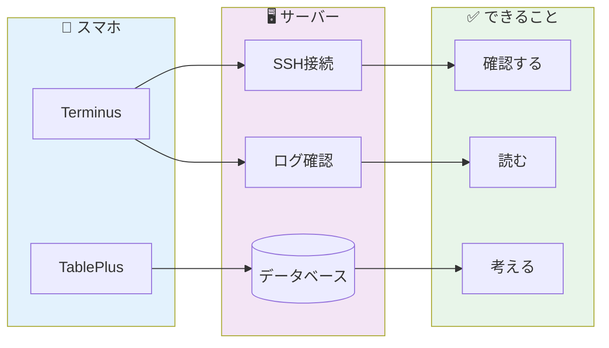
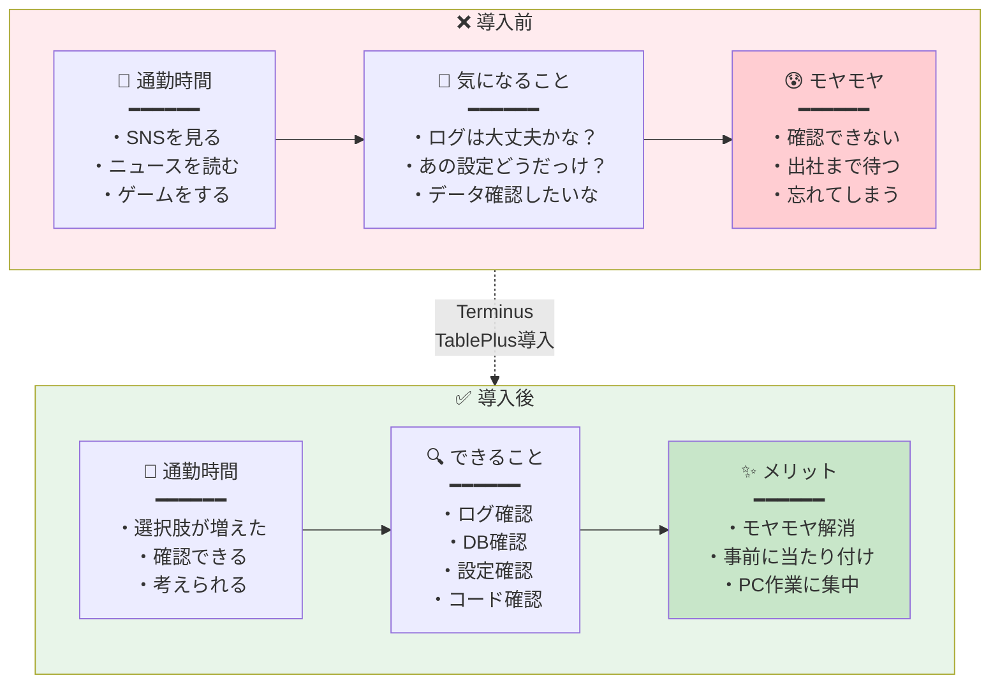
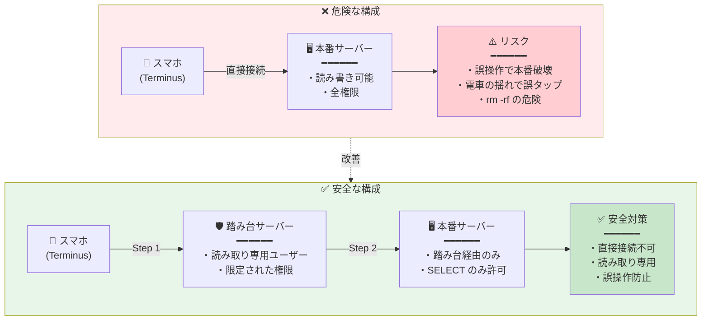
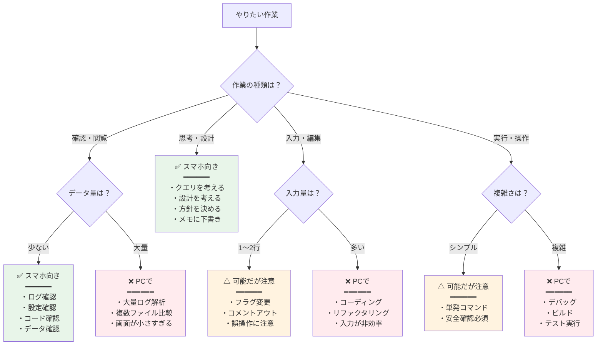
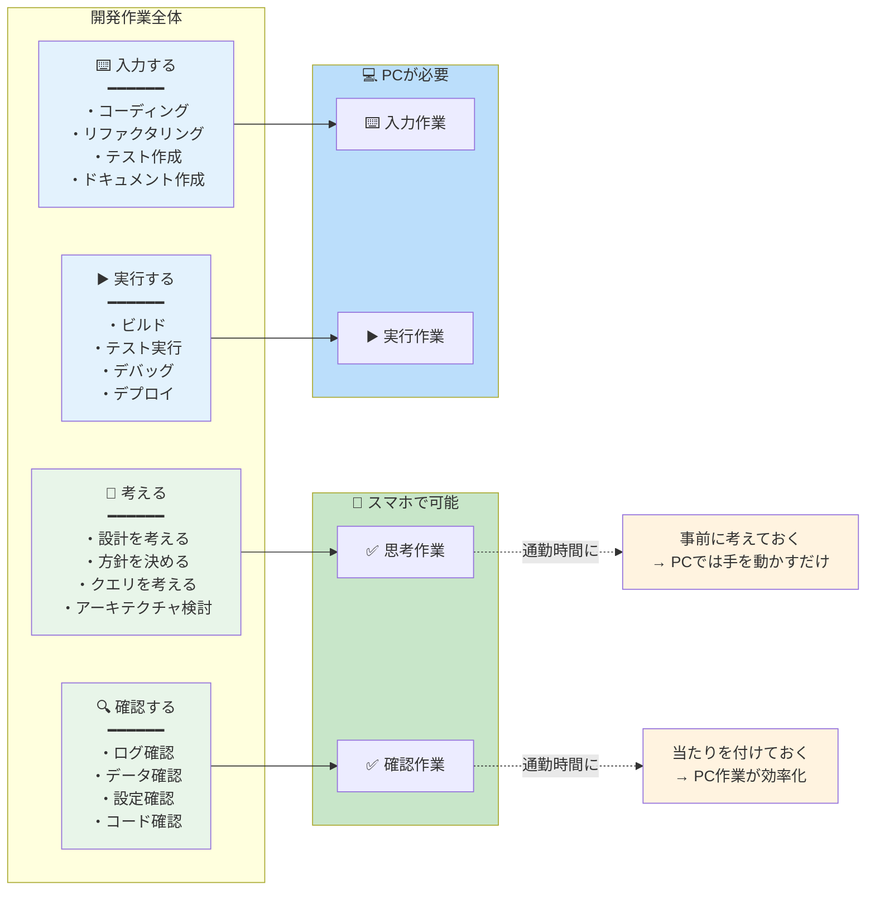

## 通勤時間、なんかもったいなくない？

片道45分。往復で1時間半。週5日で7時間半。

電車の中でスマホを眺めながら、ぼんやり思っていた。この時間、なんとかならないかな、と。

SNSを見る。ニュースを読む。ゲームをする。それはそれで悪くない。でも「今日やらなきゃいけないタスク」が頭の片隅にあると、なんとなく落ち着かない。

かといって、満員電車でノートPCを開くわけにもいかない。立っていることも多い。両手が使えるとは限らない。

「スマホで開発できたらいいのに」

そう思って、試しにいくつかアプリを入れてみた。結論から言うと、**フル開発はできない。でも「開発の一部」はできる**ようになった。

今回は、TerminusとTablePlusという2つのアプリを使って、通勤時間を「開発時間の一部」に変えた話をする。

---

## なぜスマホ開発を試したのか

きっかけは単純だ。**PCを開けない時間が、思った以上に多かった**から。

私の1日を振り返ってみた。

- 通勤電車：往復1時間半
- 昼休み：会社のPCは触りたくない
- 病院の待ち時間：たまに発生
- 子どもの習い事の送迎待ち：週1回

合計すると、週に10時間以上「PCはないけど、スマホはある」時間があった。

この時間のうち、1割でも有効に使えたら？ 週に1時間。月に4時間。年間で50時間近くになる。

もちろん、全部を「生産的な時間」にする必要はない。休息も大事だ。でも「ちょっと確認したいな」というときに、確認できる環境があるのは便利だろうと思った。

### 通勤時間の変化：Before / After



---

## Terminus でできること

最初に入れたのは **Terminus** というSSHクライアントアプリだ。iOSでもAndroidでも使える。

### SSH接続ができる

当たり前だが、これが一番大きい。

自分の開発サーバーや、VPSに接続できる。鍵認証も使える。接続情報を保存しておけば、ワンタップで繋がる。

最初に設定するときだけちょっと面倒だが、一度やってしまえば後は楽だ。

### ログ確認ができる

私がスマホでよくやるのは、ログの確認だ。

```bash
tail -f /var/log/app/error.log
```

本番でエラーが出ていないか、バッチ処理が正常に終わったか。電車の中でサッと確認できる。

問題がなければ安心して出社できる。問題があれば、出社前に頭の中で対応を考えておける。

### 軽い修正・確認ができる

正直、スマホでコードを書くのはしんどい。キーボードが小さすぎる。括弧を打つのに何タップも必要だったりする。

でも、**読む**のはできる。

```bash
cat config/settings.py | grep DATABASE
```

「あれ、この設定どうなってたっけ？」という疑問を、その場で解決できる。

たまに、本当に1行だけの修正をすることもある。コメントアウトするとか、フラグを変えるとか。でも基本は「確認」がメインだ。

### 失敗談：うっかり本番で rm -rf

これは笑えない話なのだが、一度だけ、電車の揺れで誤タップして危ない目に遭いかけた。

幸い、Tab補完の途中で止まっていたので実害はなかった。でもそれ以来、**スマホからは本番サーバーに直接触らない**というルールを自分に課した。

確認用の踏み台サーバーを経由するか、読み取り専用のアカウントを使う。スマホでの操作は「見る」に徹する。これ大事。

### 安全なSSH接続構成



---

## TablePlus を入れて変わったこと

もう1つ入れたのが **TablePlus** だ。iOSアプリがある。データベースクライアントだ。

### DBの状態が見える

MySQL、PostgreSQL、SQLiteなど、主要なDBに接続できる。

私は開発環境のDBに接続して、テーブルの中身を確認するのに使っている。

```sql
SELECT * FROM orders WHERE status = 'pending' LIMIT 10;
```

このくらいのクエリなら、スマホでも十分打てる。

### データの違和感に気づける

これが意外と大きかった。

テーブルをざっと眺めていると、「あれ、このカラムNULLばっかりだな」とか「この日付、おかしくない？」とか、**データの違和感**に気づくことがある。

PCで作業しているときは、コードを書くことに集中している。データをじっくり眺める時間は意外と少ない。

電車の中で、ぼんやりデータを眺める。これが意外とバグの発見につながる。

### クエリの下書きができる

「あとでこのクエリを実行しよう」と思ったとき、スマホでクエリを書いておく。

PCを開いたときに、コピペして実行。考える時間と実行する時間を分離できる。

---

## 実際に捗った作業

具体的に、スマホで何が捗ったかを挙げてみる。

### 1. クエリの確認・調整

「このJOIN、合ってるかな？」

電車の中でTablePlusを開いて、クエリを実行。結果を見て「あ、ここの条件が漏れてる」と気づく。メモアプリに修正版を書いておく。

出社してPCを開いたら、すぐに本実装に入れる。

### 2. データ構造の把握

新しく関わるプロジェクトで、テーブル構造を理解したいとき。

通勤中にTablePlusでテーブル一覧を眺める。カラム名を見る。外部キーの関係を追う。

「なるほど、ordersとorder_itemsがあって、order_itemsにproduct_idがあるのか」

この「把握する時間」を通勤中に済ませておくと、PCの前では「手を動かす」ことに集中できる。

### 3. バグの当たり付け

「なんか動きがおかしい」という報告があったとき。

電車の中でログを見る。エラーは出ていない。じゃあロジックの問題か。DBを見る。データは入っている。値は正しそう。

「ということは、このへんの処理が怪しいな」

当たりを付けておくと、出社してからの調査が速い。

### 4. 「あれどうなってたっけ」の即解消

コードレビューのコメントを読んでいて、「このへんの実装、どうなってたっけ」と思うことがある。

スマホでTerminus開いて、サッとファイルを見る。「あー、こうなってたのか」で解決。

この小さな「引っかかり」が解消されると、レビューへの返信もスムーズに書ける。

---

## 向いている作業・向いていない作業

正直に言うと、スマホでできることは限られている。向き不向きがある。

### 向いている作業

- **確認作業**：ログを見る、データを見る、設定を確認する
- **読む作業**：コードを読む、ドキュメントを読む
- **考える作業**：クエリを考える、設計を考える、方針を考える
- **下書き**：クエリの下書き、コミットメッセージの下書き

### 向いていない作業

- **コーディング**：まとまったコードを書くのは無理
- **デバッグ**：ステップ実行とかは当然できない
- **ビルド・テスト実行**：できなくはないが、出力を追うのがつらい
- **複雑な操作**：複数ファイルを行き来するような作業

要するに、**「入力」より「確認」**、**「作る」より「考える」**がスマホ向きだ。

### スマホでやるべきか判断フロー



---

## 環境構築のポイント

スマホ開発を始めるにあたって、いくつかポイントがある。

### 1. 踏み台サーバーを用意する

本番に直接触らない。開発用のサーバーを用意して、そこからしか本番データにアクセスできないようにする。

スマホは誤操作のリスクが高い。安全策を講じておく。

### 2. 読み取り専用ユーザーを作る

DBに接続するユーザーは、読み取り専用にしておく。SELECT はできるが、UPDATE や DELETE はできない。

うっかり事故を防げる。

### 3. 接続情報は安全に管理する

Terminusも TablePlusも、接続情報を保存できる。便利だが、スマホを落としたときのリスクがある。

端末のロック、アプリのパスワード保護、必要なら二要素認証。セキュリティはちゃんとやる。

### 4. 無理しない

満員電車でスマホを操作するのは、正直しんどい。座れたときだけ、余裕があるときだけでいい。

「通勤時間を全部開発に使う」ではなく、「使えるときに使える環境を用意しておく」くらいのスタンスで。

### セキュリティ設定のチェックリスト

```mermaid
flowchart TB
    Start["🔧 環境構築開始"] --> Step1["1️⃣ サーバー側設定"]

    Step1 --> S1{"踏み台サーバー<br/>用意した？"}
    S1 -->|No| S1A["⚠️ 本番直接接続は危険<br/>━━━━━━<br/>・開発用サーバー準備<br/>・踏み台サーバー設置"]
    S1A --> S2
    S1 -->|Yes| S2

    S2{"読み取り専用<br/>ユーザー作成した？"}
    S2 -->|No| S2A["⚠️ 全権限は危険<br/>━━━━━━<br/><code style='color: white'>GRANT SELECT ON *.* TO 'readonly'@'%';</code><br/>・UPDATE/DELETE禁止<br/>・SELECT のみ許可"]
    S2A --> Step2
    S2 -->|Yes| Step2

    Step2["2️⃣ 端末側設定"] --> S3{"端末ロック<br/>設定済み？"}
    S3 -->|No| S3A["⚠️ 紛失時のリスク<br/>━━━━━━<br/>・PIN/パスワード設定<br/>・生体認証有効化"]
    S3A --> S4
    S3 -->|Yes| S4

    S4{"アプリに<br/>パスワード保護？"}
    S4 -->|No| S4A["⚠️ 他人が見れる<br/>━━━━━━<br/>・Terminus: パスコード設定<br/>・TablePlus: 接続時パスワード"]
    S4A --> S5
    S4 -->|Yes| S5

    S5{"秘密鍵は<br/>安全に管理？"}
    S5 -->|No| S5A["⚠️ 鍵漏洩のリスク<br/>━━━━━━<br/>・パスフレーズ付き鍵<br/>・定期的な鍵ローテーション"]
    S5A --> Step3
    S5 -->|Yes| Step3

    Step3["3️⃣ 運用ルール"] --> S6{"本番操作は<br/>禁止した？"}
    S6 -->|No| S6A["⚠️ 誤操作で本番破壊<br/>━━━━━━<br/>・スマホは「見る」だけ<br/>・更新はPC から"]
    S6A --> Done
    S6 -->|Yes| Done

    Done["✅ 設定完了<br/>━━━━━━<br/>安全にスマホ開発できます"]

    style S1A fill:#fff3e0
    style S2A fill:#fff3e0
    style S3A fill:#fff3e0
    style S4A fill:#fff3e0
    style S5A fill:#fff3e0
    style S6A fill:#fff3e0
    style Done fill:#e8f5e9
```



---

## まとめ：通勤時間を「開発の一部」にする

スマホで開発できるか？ と聞かれたら、「フル開発は無理」と答える。

でも、**開発は「コードを書く」だけではない**。

- 現状を確認する
- データを理解する
- 問題の当たりを付ける
- 設計を考える
- 方針を決める

これらは「開発の一部」だ。そしてスマホでもできる。

### 開発作業の分解：PC vs スマホ



TerminusとTablePlusを入れて、通勤時間が変わった。正確に言えば、**通勤時間の「使い道」が増えた**。

毎日使うわけではない。ぼんやりSNSを見る日もある。それでいい。

ただ、「確認したいな」と思ったときに確認できる。「気になるな」と思ったときに調べられる。その選択肢があるだけで、頭の中のモヤモヤが1つ減る。

週に1時間でも、考える時間が増えれば、PCの前では「手を動かす」ことに集中できる。

開発は「PCを開いた瞬間」だけではない。

---

## 使っているアプリ

最後に、今回紹介したアプリをまとめておく。

- **Terminus**：SSHクライアント。iOS / Android対応。無料でも使える。
- **TablePlus**：データベースクライアント。iOS版あり。主要なDBに対応。

他にも似たアプリはあるので、自分に合うものを探してみてほしい。大事なのはツールではなく、**「スマホでも確認できる環境を作っておく」という発想**だ。

通勤時間、ちょっと試してみませんか。

---

## 設計判断の背景

「スマホでも開発できる」という選択肢を検討したとき、当然「モバイルIDEを入れてコーディングする」というアプローチもあった。でもスマホの入力環境を考えると、それは生産性を下げるだけだと判断した。代わりに「確認と思考」に特化する方針を選んだ。開発作業を「入力」と「確認・思考」に分解し、それぞれに適した環境を割り当てるという考え方だ。

## 現場での判断基準

誤操作で本番に影響を出しかけた経験から、スマホ操作は「見るだけ」に限定するルールを設けている。具体的には、読み取り専用ユーザーの作成と踏み台サーバー経由でのアクセスを必須にした。「便利さ」と「安全性」のトレードオフでは、特にモバイル環境では安全性を優先する。一度でも事故を起こせば、その後の信頼回復コストの方がはるかに大きい。

## 見るべきポイント

モバイル開発環境を導入するときは、まずセキュリティ設計から始めることを勧める。接続情報の管理、権限の最小化、端末紛失時の対策。これらを後回しにすると、便利になった分だけリスクも増える。また、「全部の時間を有効活用する」という目標は長続きしない。使えるときに使える環境を用意しておく、くらいの距離感が現実的だ。
