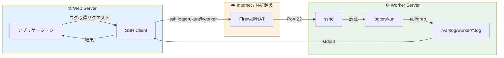
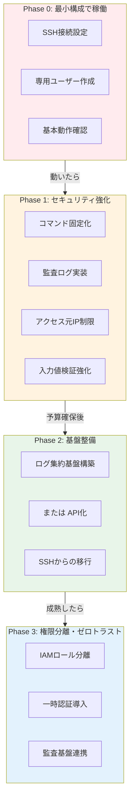

## TL;DR（3行まとめ）

1. **SSHリモートコマンド実行は「最小構成」として現実的に成立する**：VPCピアリングなし、NAT越えでも22番ポートさえ通れば動く
2. **ただし「最小」には落とし穴がある**：コマンドインジェクション、無制限アクセス、監査証跡なしは致命傷になりうる
3. **段階的に改善するロードマップを持て**：Phase0で動かし、Phase1で安全にし、将来的にはログ集約かAPI化へ進む道を残す

---



---

## はじめに：なぜこの記事を書いたか

「ワーカーサーバのログを Web 画面から見たい」

この要件が降ってきたとき、あなたならどうする？

理想を言えば、ログ集約基盤（CloudWatch Logs、Datadog、Elasticsearch）を構築するか、ログ取得用の API を作るのが正解だ。

**でも現実は違う。**

- 「予算がない」
- 「インフラチームのリソースがない」
- 「VPCピアリングの申請に3ヶ月かかる」
- 「まず動くものを見せてから判断したい」

こういう状況で、**「最小構成で動かす」** ことを求められる場面は少なくない。

この記事では、**SSHリモートコマンド実行**という「古典的だが現実的な」方法で、別サーバのログを取得する設計を解説する。

ただし、「動けばいい」で終わらせない。

- **セキュリティ**：コマンドインジェクションをどう防ぐか
- **内部統制**：誰がいつ何を見たか、証跡を残せるか
- **拡張性**：将来的にどう改善していくか

これらを押さえた「最小だけど堅い」設計を目指す。

---

## なぜ「SSHリモートコマンド実行」が最小で通るのか

### 技術的な理由

```
✅ 22番ポートさえ通れば動く
   - VPCピアリング不要
   - NAT越えでもOK（インターネット経由SSH）
   - 既存のSSH鍵管理の仕組みを流用できる

✅ 追加のミドルウェアが不要
   - ログ転送エージェント不要
   - APIサーバ不要
   - メッセージキュー不要

✅ 実装が最小限
   - シェルスクリプト数行で動く
   - アプリ側も exec() 相当で呼ぶだけ
```

### 組織的な理由

```
✅ 承認が通りやすい
   - 「SSH接続の許可」は既存の申請フローで処理できることが多い
   - 新しいサービスの導入より心理的ハードルが低い

✅ 障害時の切り分けが簡単
   - 「SSHで入れるか」「コマンドが通るか」の2点だけ
   - ログ集約基盤の障害調査より圧倒的に楽

✅ 撤退も容易
   - うまくいかなければSSH接続を閉じるだけ
   - 大きな負債を残さない
```

---

## アーキテクチャ比較：SSHリモート実行 vs 他の選択肢

| 観点 | SSHリモート実行 | API構築 | ログ転送 | ジョブ基盤 |
|------|----------------|---------|----------|-----------|
| **初期コスト** | ◎ 最小 | △ 開発必要 | △ 基盤構築 | × 大規模 |
| **運用コスト** | ○ 低い | ○ 普通 | △ 監視必要 | △ 運用負荷 |
| **セキュリティ** | △ 要設計 | ○ 制御しやすい | ○ 経路暗号化 | ○ 分離しやすい |
| **監査対応** | △ 自前実装 | ○ ログ設計可 | ◎ 集約済み | ○ ジョブ履歴 |
| **拡張性** | × 限界あり | ◎ 自由度高 | ◎ スケール可 | ◎ 柔軟 |
| **障害切り分け** | ◎ 単純 | ○ 普通 | △ 複雑 | △ 複雑 |
| **導入スピード** | ◎ 即日可 | △ 週〜月 | △ 週〜月 | × 月単位 |

### 各方式の概要

#### SSHリモート実行（今回の方式）

```bash
# Webサーバから実行
ssh logtorukun@worker-server "tail -n 200 /var/log/worker/app.log"
```

- **向いている**：小規模、緊急対応、PoC
- **向かない**：大量アクセス、リアルタイム監視

#### API構築（理想形）

```
Web Server → HTTPS → Log API Server → Local File Read
```

- **向いている**：本格運用、複数クライアント、認証認可の細かい制御
- **向かない**：予算がない、すぐに動かしたい

#### ログ転送（rsyslog / fluent-bit / CloudWatch Logs 等）

```
Worker → fluent-bit → S3/CloudWatch/Elasticsearch → Web Server
```

- **向いている**：ログの長期保存、横断検索、アラート連携
- **向かない**：単発のログ確認、転送遅延が許容できない

#### ジョブ基盤 / メッセージング（SQS + Lambda 等）

```
Web Server → SQS → Worker（ログ取得）→ S3 → Web Server
```

- **向いている**：非同期処理、大規模分散、耐障害性
- **向かない**：シンプルな要件、即時性が必要

---

## 具体的な実装：SSHリモートコマンド実行

### 前提条件

```
- WebサーバからWorkerサーバへSSH接続可能（22番ポート開放済み）
- Workerサーバに専用ユーザー logtorukun を作成
- SSH公開鍵認証を使用（パスワード認証は禁止）
- logtorukun は対象ログファイルの読み取り権限を持つ
```

### 基本的なコマンド例

#### 1. 最新N行を取得（tail）

```bash
# 最新200行を取得
ssh logtorukun@worker-server "tail -n 200 /var/log/worker/app.log"

# リアルタイムで追従（Ctrl+Cで終了）
ssh logtorukun@worker-server "tail -f /var/log/worker/app.log"
```

#### 2. キーワード検索（grep）

```bash
# ERRORを含む行を取得
ssh logtorukun@worker-server "grep 'ERROR' /var/log/worker/app.log | tail -n 100"

# 特定の時間帯を抽出
ssh logtorukun@worker-server "grep '2024-12-17 14:' /var/log/worker/app.log"
```

#### 3. systemdのジャーナルログ（journalctl）

```bash
# 特定サービスの最新ログ
ssh logtorukun@worker-server "journalctl -u worker-service -n 100 --no-pager"

# 時間指定
ssh logtorukun@worker-server "journalctl -u worker-service --since '1 hour ago' --no-pager"
```

#### 4. Dockerコンテナのログ

```bash
# コンテナログの最新100行
ssh logtorukun@worker-server "docker logs --tail 100 worker-container"

# タイムスタンプ付き
ssh logtorukun@worker-server "docker logs --tail 100 --timestamps worker-container"
```

### アプリケーションからの呼び出し例（Python）

```python
import subprocess
import shlex
from datetime import datetime

class RemoteLogFetcher:
    """SSHリモートコマンドでログを取得するクラス"""

    def __init__(self, host: str, user: str, key_path: str):
        self.host = host
        self.user = user
        self.key_path = key_path

    def fetch_tail(self, log_path: str, lines: int = 200) -> str:
        """指定行数の末尾ログを取得"""
        # 安全のため、引数を検証
        if not self._is_safe_path(log_path):
            raise ValueError(f"Invalid log path: {log_path}")
        if not isinstance(lines, int) or lines < 1 or lines > 10000:
            raise ValueError(f"Invalid lines: {lines}")

        # コマンド構築（インジェクション対策済み）
        remote_cmd = f"tail -n {lines} {shlex.quote(log_path)}"

        return self._execute_ssh(remote_cmd)

    def fetch_grep(self, log_path: str, pattern: str, lines: int = 100) -> str:
        """キーワード検索してログを取得"""
        if not self._is_safe_path(log_path):
            raise ValueError(f"Invalid log path: {log_path}")
        if not self._is_safe_pattern(pattern):
            raise ValueError(f"Invalid pattern: {pattern}")

        # パターンをエスケープ
        safe_pattern = shlex.quote(pattern)
        remote_cmd = f"grep {safe_pattern} {shlex.quote(log_path)} | tail -n {lines}"

        return self._execute_ssh(remote_cmd)

    def _execute_ssh(self, remote_cmd: str) -> str:
        """SSHコマンドを実行"""
        ssh_cmd = [
            "ssh",
            "-i", self.key_path,
            "-o", "StrictHostKeyChecking=yes",
            "-o", "ConnectTimeout=10",
            f"{self.user}@{self.host}",
            remote_cmd
        ]

        # 監査ログを記録
        self._audit_log(remote_cmd)

        try:
            result = subprocess.run(
                ssh_cmd,
                capture_output=True,
                text=True,
                timeout=30
            )
            if result.returncode != 0:
                raise RuntimeError(f"SSH command failed: {result.stderr}")
            return result.stdout

        except subprocess.TimeoutExpired:
            raise RuntimeError("SSH command timed out")

    def _is_safe_path(self, path: str) -> bool:
        """パスの安全性を検証"""
        # 許可されたディレクトリのみ
        allowed_prefixes = [
            "/var/log/worker/",
            "/var/log/app/",
        ]
        # パストラバーサル対策
        if ".." in path or path.startswith("/etc") or path.startswith("/root"):
            return False
        return any(path.startswith(prefix) for prefix in allowed_prefixes)

    def _is_safe_pattern(self, pattern: str) -> bool:
        """検索パターンの安全性を検証"""
        # 危険な文字を禁止
        dangerous_chars = [";", "|", "&", "`", "$", "(", ")", "{", "}", "<", ">"]
        return not any(char in pattern for char in dangerous_chars)

    def _audit_log(self, remote_cmd: str) -> None:
        """監査ログを記録"""
        timestamp = datetime.utcnow().isoformat()
        # 実際の運用では、専用の監査ログ基盤に送信
        print(f"[AUDIT] {timestamp} | host={self.host} | cmd={remote_cmd}")


# 使用例
fetcher = RemoteLogFetcher(
    host="worker-server.example.com",
    user="logtorukun",
    key_path="/home/webapp/.ssh/logtorukun_key"
)

# 最新ログ取得
logs = fetcher.fetch_tail("/var/log/worker/app.log", lines=200)
print(logs)
```

---

## 危険な実装パターン（絶対にやってはいけない）

### NG例1：ユーザー入力をそのままコマンドに渡す

```python
# ❌ 絶対にダメ：コマンドインジェクションの脆弱性
user_input = request.args.get("pattern")  # 例: "; rm -rf /"
cmd = f'ssh user@host "grep {user_input} /var/log/app.log"'
os.system(cmd)  # 致命的
```

**攻撃例：**
```
pattern = "'; cat /etc/passwd; echo '"
→ grep ''; cat /etc/passwd; echo '' /var/log/app.log
```

### NG例2：パスワード直書き

```python
# ❌ 絶対にダメ：認証情報の漏洩
cmd = "sshpass -p 'MyP@ssw0rd' ssh user@host 'tail /var/log/app.log'"
```

### NG例3：無制限のsudo

```bash
# ❌ 絶対にダメ：権限昇格のリスク
# /etc/sudoers
logtorukun ALL=(ALL) NOPASSWD: ALL
```

### NG例4：ワイルドカードの無制限使用

```python
# ❌ 危険：意図しないファイルにアクセス
log_path = request.args.get("path")  # 例: "/var/log/../etc/shadow"
cmd = f'ssh user@host "cat {log_path}"'
```

---

## セキュリティと内部統制：最小でも守るべきライン

### 1. 専用ユーザーの作成

```bash
# Workerサーバで実行
sudo useradd -r -s /bin/bash -m logtorukun
sudo mkdir -p /home/logtorukun/.ssh
sudo chmod 700 /home/logtorukun/.ssh
```

### 2. SSH公開鍵の設定（制限付き）

```bash
# /home/logtorukun/.ssh/authorized_keys
# command= でコマンドを制限することも可能
ssh-rsa AAAA... webapp@webserver
```

より厳格にする場合：

```bash
# authorized_keys でコマンドを固定
command="/usr/local/bin/log-fetcher.sh",no-port-forwarding,no-X11-forwarding,no-agent-forwarding ssh-rsa AAAA...
```

### 3. sshd_config での制限

```bash
# /etc/ssh/sshd_config

# このユーザーのみ許可
AllowUsers logtorukun

# パスワード認証を禁止
PasswordAuthentication no

# ルートログイン禁止
PermitRootLogin no

# 接続元IPを制限（可能な場合）
# Match User logtorukun
#     AllowUsers logtorukun@192.168.1.0/24
```

### 4. ログファイルへのアクセス制御

```bash
# ログファイルのグループを設定
sudo chgrp logtorukun /var/log/worker/*.log
sudo chmod 640 /var/log/worker/*.log

# logrotate後も権限を維持
# /etc/logrotate.d/worker
/var/log/worker/*.log {
    create 640 root logtorukun
    ...
}
```

### 5. コマンド固定スクリプト（ForceCommand用）

```bash
#!/bin/bash
# /usr/local/bin/log-fetcher.sh
# ForceCommand で指定するラッパースクリプト

set -euo pipefail

# 許可されたコマンドのみ実行
case "$SSH_ORIGINAL_COMMAND" in
    "tail -n "*)
        # 引数の検証
        if [[ "$SSH_ORIGINAL_COMMAND" =~ ^tail\ -n\ [0-9]+\ /var/log/worker/[a-zA-Z0-9._-]+\.log$ ]]; then
            eval "$SSH_ORIGINAL_COMMAND"
        else
            echo "ERROR: Invalid command format" >&2
            exit 1
        fi
        ;;
    "grep "*)
        # grep も同様に検証
        # ...
        ;;
    *)
        echo "ERROR: Command not allowed" >&2
        exit 1
        ;;
esac
```

### 6. 監査ログの記録

```bash
# /etc/rsyslog.d/ssh-audit.conf
# SSHコマンド実行を記録
:programname, isequal, "sshd" /var/log/ssh-audit.log
```

```python
# アプリケーション側でも記録
import logging

audit_logger = logging.getLogger("audit")
audit_logger.setLevel(logging.INFO)
handler = logging.FileHandler("/var/log/webapp/log-access-audit.log")
handler.setFormatter(logging.Formatter(
    "%(asctime)s | user=%(user)s | ip=%(ip)s | target=%(target)s | cmd=%(cmd)s"
))
audit_logger.addHandler(handler)

def audit_log_access(user: str, ip: str, target_host: str, command: str):
    audit_logger.info("", extra={
        "user": user,
        "ip": ip,
        "target": target_host,
        "cmd": command
    })
```

---

## 現場のリアル：「最小案じゃないと却下される」あるある

### よくある状況

```
あなた：「ログ集約基盤を構築したいです」
上司　：「予算は？」
あなた：「月額5万円くらいです」
上司　：「今期の予算はもうない。来期まで待って」

あなた：「ではAPIを作ります」
上司　：「工数は？」
あなた：「2週間くらいです」
上司　：「他の案件が優先。1日でできる方法ない？」

あなた：「...SSHでリモートコマンド実行します」
上司　：「それでいこう」
```

**これが現実だ。**

### 「知らなかったことを責められる」悔しさ

後になって問題が起きたとき：

- 「なぜセキュリティを考慮しなかったの？」
- 「監査で引っかかったけど、どうするの？」
- 「最初からちゃんと設計しておけばよかったのに」

**最小構成を選んだのは組織の判断なのに、責任はエンジニアに来る。**

### 設計で勝つ力に変える

だからこそ、**「最小だけど、ここは押さえた」** という設計が重要になる。

1. **リスクを明示する**：「この構成のリスクは○○です」と文書化
2. **最低限の安全策を入れる**：専用ユーザー、鍵認証、コマンド制限
3. **改善ロードマップを示す**：「Phase2でログ集約に移行予定」
4. **監査証跡を残す**：「誰がいつ何を見たか」をログに残す

これがあれば、後から責められても「最小構成の中で、できる限りの対策はしていた」と言える。

---

## 段階的改善ロードマップ



### Phase 0：最小構成で稼働（即日〜1週間）

**目標**：とにかく動かす

```
□ Workerサーバに専用ユーザー作成
□ SSH公開鍵設定
□ ファイアウォール設定（22番ポート）
□ 基本的なコマンド実行確認
□ アプリケーションからの呼び出し実装
```

**この段階のリスク**：
- コマンドインジェクションの可能性
- 監査証跡がない
- 誰でも何でも見られる状態

### Phase 1：セキュリティ強化（1〜2週間）

**目標**：最小限の安全策を入れる

```
□ ForceCommand でコマンドを固定
□ 入力値の検証を厳格化
□ 監査ログの実装
□ アクセス元IPの制限（可能なら）
□ sshd_config の見直し
□ 定期的な鍵のローテーション手順策定
```

### Phase 2：基盤整備（予算確保後）

**目標**：SSHから脱却する

**選択肢A：ログ集約基盤**
```
□ fluent-bit / CloudWatch Logs Agent 導入
□ ログストレージの構築
□ Web画面からの検索UI
□ SSH経由の廃止
```

**選択肢B：API化**
```
□ ログ取得APIの設計・実装
□ 認証認可の実装
□ レートリミット
□ SSH経由の廃止
```

### Phase 3：権限分離・ゼロトラスト（成熟後）

**目標**：エンタープライズレベルの統制

```
□ IAMロールによる細かい権限制御
□ 一時的な認証情報の発行
□ 全アクセスの監査ログを SIEM に連携
□ 異常検知アラート
```

---

## 導入前チェックリスト

### インフラ・ネットワーク

- [ ] WebサーバからWorkerサーバへの22番ポートは開いているか
- [ ] NAT越えの場合、固定IPまたはDDNSで接続先を特定できるか
- [ ] ファイアウォールで接続元IPを制限できるか
- [ ] SSH接続のタイムアウト設定は適切か（10〜30秒）

### ユーザー・認証

- [ ] 専用ユーザー（例：logtorukun）を作成したか
- [ ] SSH公開鍵認証を設定したか（パスワード認証は無効化）
- [ ] 秘密鍵の権限は600になっているか
- [ ] 秘密鍵の保管場所は適切か（Webアプリから読める場所）

### 権限・アクセス制御

- [ ] 専用ユーザーはログファイルの読み取り権限のみを持つか
- [ ] sudo権限は必要最小限か（または不要か）
- [ ] AllowUsersで接続可能ユーザーを制限したか
- [ ] ログファイル以外のディレクトリへのアクセスを制限したか

### セキュリティ

- [ ] ユーザー入力をコマンドに直接渡していないか
- [ ] パストラバーサル対策をしているか（`..` の禁止）
- [ ] 危険な文字（`;` `|` `&` など）をフィルタしているか
- [ ] shlex.quote() などでエスケープしているか
- [ ] コマンド実行のタイムアウトを設定しているか

### 監査・運用

- [ ] 誰がいつ何を見たか、ログに残る仕組みがあるか
- [ ] SSH接続のログがサーバ側に残っているか
- [ ] 鍵のローテーション手順を決めているか
- [ ] 障害時の切り分け手順を文書化しているか
- [ ] この設計のリスクを関係者に共有しているか

### 将来の改善

- [ ] 段階的改善のロードマップを持っているか
- [ ] Phase1（セキュリティ強化）の実施予定を決めているか
- [ ] ログ集約基盤 or API化の検討時期を決めているか

---

## まとめ：最小でも「堅い」設計を目指す

### SSHリモートコマンド実行が成立する理由

1. **技術的に単純**：22番ポートさえ通れば動く
2. **追加コストがほぼゼロ**：既存のSSH基盤を流用
3. **撤退が容易**：うまくいかなければ閉じるだけ

### ただし、落とし穴がある

1. **コマンドインジェクション**：ユーザー入力を絶対にそのまま渡さない
2. **無制限アクセス**：専用ユーザー、コマンド固定、パス制限
3. **監査証跡なし**：誰がいつ何を見たか、必ずログに残す

### 現場で生き残るために

- **「最小」を選ばされても、「最小限の安全策」は入れる**
- **リスクを文書化して、組織的な判断として記録する**
- **将来の改善ロードマップを持ち、脱却する道を残す**

「最小構成」は恥ずかしいことではない。

**「最小構成でも、ここは押さえた」と言える設計ができれば、それはプロの仕事だ。**

---

## 設計判断の背景

「SSHでログを取る」という方法は、モダンな設計思想からすると「アンチパターン」に見えるかもしれない。しかし、予算・工数・組織の制約がある中で「まず動かす」ことが最優先になる場面は確実に存在する。この記事では、その現実を受け入れた上で、最低限守るべきセキュリティラインを明確にした。

## 現場での判断基準

「SSHで最小構成」を選ぶ前に、まず「本当にログ集約基盤やAPIを作れないのか」を確認する。予算や工数の問題であれば、Phase0として SSHで始め、Phase2でログ集約に移行するロードマップを提示することで、関係者の合意を得やすくなる。

## 見るべきポイント

他のエンジニアがSSHリモート実行を実装しているのを見たら、まず「ユーザー入力がコマンドに渡っていないか」を確認する。次に「監査ログがあるか」「専用ユーザーを使っているか」をチェックする。これらが欠けていると、インシデント発生時に対応が困難になる。
