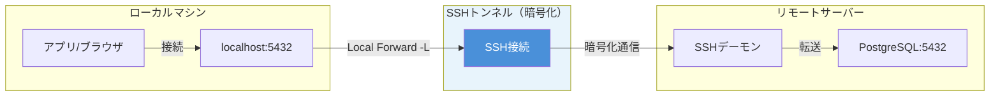
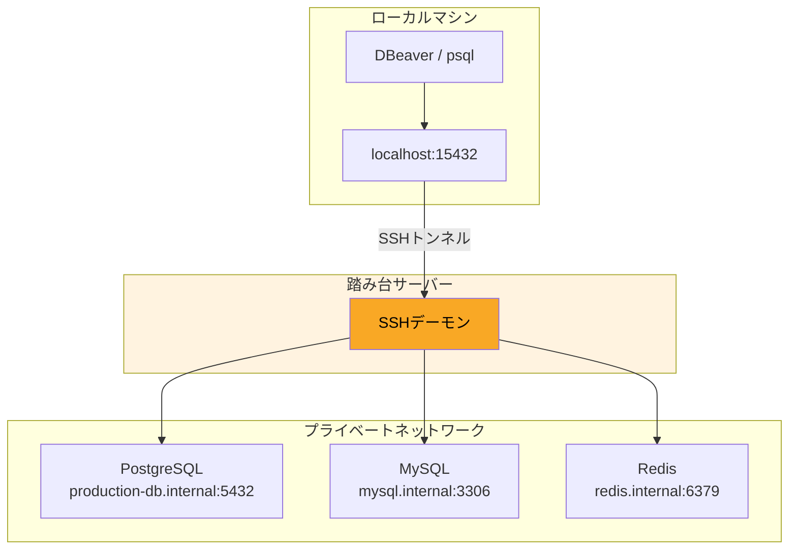
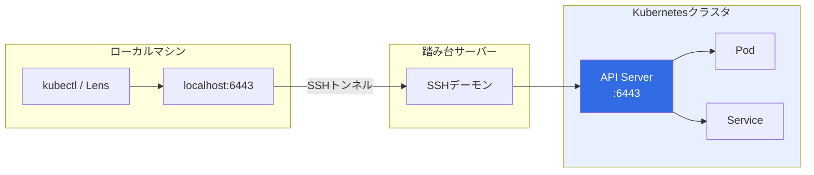

## この記事で得られること

- SSHトンネル3種類（Local/Remote/Dynamic）の違いを**図解で完全理解**
- `~/.ssh/config`の設定方法と**コピペで使えるテンプレ10選**
- PostgreSQL・MySQL・Redisへの**安全なトンネル接続**
- 多段SSH（Bastion経由）の**実務設定パターン**
- トンネル障害時の**トラブルシュート手順**
- **やってはいけない設定**と**セキュリティベストプラクティス**

---

## 目次

1. [SSHトンネルとは？3種類を図解で理解](#1-sshトンネルとは3種類を図解で理解)
2. [~/.ssh/configの基本構文と必須オプション](#2-sshconfigの基本構文と必須オプション)
3. [データベース接続の実務例](#3-データベース接続の実務例)
4. [SOCKSプロキシでブラウザを閉域ネットワークに接続](#4-socksプロキシでブラウザを閉域ネットワークに接続)
5. [IDE連携：VSCode / Neovim](#5-ide連携vscode--neovim)
6. [Docker / Kubernetes との併用](#6-docker--kubernetes-との併用)
7. [多段SSH（Bastion経由）の設定テンプレ](#7-多段sshbastion経由の設定テンプレ)
8. [トンネル障害時のトラブルシュート](#8-トンネル障害時のトラブルシュート)
9. [セキュリティベストプラクティス](#9-セキュリティベストプラクティス)
10. [【危険】やってはいけない設定5選](#10-危険やってはいけない設定5選)
11. [コピペで使える設定テンプレ10選](#11-コピペで使える設定テンプレ10選)
12. [まとめ](#12-まとめ)

---

## 1. SSHトンネルとは？3種類を図解で理解

SSHトンネル（ポートフォワーディング）は、**SSH接続を経由して別のポートへの通信を転送する技術**。暗号化されたSSH接続の中を通るため、安全に閉域ネットワーク内のサービスへアクセスできる。

### 3種類のポートフォワーディング

| 種類 | オプション | 方向 | 主な用途 |
|------|-----------|------|----------|
| **Local Forward** | `-L` | ローカル → リモート | DB接続、内部API |
| **Remote Forward** | `-R` | リモート → ローカル | Webhook受信、デモ公開 |
| **Dynamic Forward** | `-D` | SOCKS Proxy | ブラウザ経由の全通信転送 |

### 通信フロー図



### Local Forward（-L）

**ローカルのポートをリモートのポートに転送する。** 最も使用頻度が高い。

```bash
# 書式: ssh -L [ローカルポート]:[転送先ホスト]:[転送先ポート] [SSHサーバー]
ssh -L 5432:localhost:5432 remote-server

# ローカルの5432番ポートに接続すると、リモートサーバー上のPostgreSQL(5432)に繋がる
psql -h localhost -p 5432 -U postgres
```

### Remote Forward（-R）

**リモートのポートをローカルのポートに転送する。** Webhook開発やローカル環境の一時公開に使う。

```bash
# 書式: ssh -R [リモートポート]:[転送先ホスト]:[転送先ポート] [SSHサーバー]
ssh -R 8080:localhost:3000 remote-server

# リモートサーバーの8080番にアクセスすると、ローカルの3000番に繋がる
# ※リモートサーバーのGatewayPorts設定が必要な場合あり
```

### Dynamic Forward（-D）

**SOCKSプロキシとして動作する。** ブラウザの全通信をSSH経由で転送できる。

```bash
# 書式: ssh -D [ローカルポート] [SSHサーバー]
ssh -D 1080 remote-server

# ブラウザのプロキシ設定でSOCKS5 localhost:1080 を指定
```

---

## 2. ~/.ssh/configの基本構文と必須オプション

毎回コマンドラインでオプションを指定するのは面倒。`~/.ssh/config`に設定を書いておけば、`ssh hostname` だけで全設定が適用される。

### 基本構文

```ssh
# ~/.ssh/config

# ワイルドカードで全ホストに適用
Host *
    # 接続維持（60秒ごとにKeepAlive送信）
    ServerAliveInterval 60
    ServerAliveCountMax 3
    # 接続の多重化（高速化）
    ControlMaster auto
    ControlPath ~/.ssh/sockets/%r@%h-%p
    ControlPersist 600

# 個別ホスト設定
Host myserver
    HostName 192.168.1.100
    User developer
    Port 22
    IdentityFile ~/.ssh/id_ed25519
    IdentitiesOnly yes
```

### 必須オプション一覧

| オプション | 説明 | 推奨値 |
|-----------|------|--------|
| `HostName` | 実際の接続先（IP or ドメイン） | - |
| `User` | SSHユーザー名 | - |
| `Port` | SSHポート番号 | 22（変更推奨） |
| `IdentityFile` | 秘密鍵のパス | `~/.ssh/id_ed25519` |
| `IdentitiesOnly` | 指定した鍵のみ使用 | `yes` |
| `ServerAliveInterval` | KeepAlive間隔（秒） | `60` |
| `ServerAliveCountMax` | KeepAlive失敗許容回数 | `3` |
| `ControlMaster` | 接続多重化 | `auto` |
| `ControlPath` | ソケットファイルパス | `~/.ssh/sockets/%r@%h-%p` |
| `ControlPersist` | 接続維持時間（秒） | `600` |

### ポートフォワーディング設定

```ssh
Host db-tunnel
    HostName bastion.example.com
    User admin
    IdentityFile ~/.ssh/id_ed25519
    # Local Forward: ローカル5432 → リモートのdb-server:5432
    LocalForward 5432 db-server.internal:5432
    # 複数ポート転送も可能
    LocalForward 6379 redis.internal:6379
    LocalForward 3306 mysql.internal:3306

Host socks-proxy
    HostName proxy.example.com
    User admin
    # Dynamic Forward: SOCKSプロキシ
    DynamicForward 1080
```

### ソケットディレクトリの作成

```bash
mkdir -p ~/.ssh/sockets
chmod 700 ~/.ssh/sockets
```

---

## 3. データベース接続の実務例

### PostgreSQL

#### ~/.ssh/config

```ssh
Host pg-tunnel
    HostName bastion.example.com
    User admin
    IdentityFile ~/.ssh/id_ed25519
    # 本番PostgreSQLへのトンネル
    LocalForward 15432 production-db.internal:5432
    # ローカルの5432と被らないよう15432を使用
```

#### 接続方法

```bash
# トンネル接続（バックグラウンド）
ssh -fN pg-tunnel

# psqlで接続
psql -h localhost -p 15432 -U postgres -d myapp

# DBeaver / pgAdmin の場合
# ホスト: localhost
# ポート: 15432
```

### MySQL

#### ~/.ssh/config

```ssh
Host mysql-tunnel
    HostName bastion.example.com
    User admin
    IdentityFile ~/.ssh/id_ed25519
    LocalForward 13306 mysql.internal:3306
```

#### 接続方法

```bash
# トンネル接続
ssh -fN mysql-tunnel

# mysql CLIで接続
mysql -h 127.0.0.1 -P 13306 -u root -p

# MySQL Workbench の場合
# Connection Method: Standard (TCP/IP)
# Hostname: 127.0.0.1
# Port: 13306
```

### Redis

#### ~/.ssh/config

```ssh
Host redis-tunnel
    HostName bastion.example.com
    User admin
    IdentityFile ~/.ssh/id_ed25519
    LocalForward 16379 redis.internal:6379
```

#### 接続方法

```bash
# トンネル接続
ssh -fN redis-tunnel

# redis-cliで接続
redis-cli -h localhost -p 16379

# RedisInsight の場合
# Host: localhost
# Port: 16379
```

### DB接続フロー図



---

## 4. SOCKSプロキシでブラウザを閉域ネットワークに接続

Dynamic Forward（-D）を使うと、**ブラウザの全通信をSSH経由で転送できる**。閉域ネットワーク内のWebシステムにアクセスする際に便利。

### ~/.ssh/config

```ssh
Host socks-proxy
    HostName bastion.example.com
    User admin
    IdentityFile ~/.ssh/id_ed25519
    DynamicForward 1080
    # 圧縮を有効化（低速回線で有効）
    Compression yes
```

### 接続

```bash
# トンネル接続
ssh -fN socks-proxy
```

### Chromeの設定

macOSの場合：

```bash
# SOCKS プロキシ経由でChromeを起動
/Applications/Google\ Chrome.app/Contents/MacOS/Google\ Chrome \
  --proxy-server="socks5://localhost:1080" \
  --user-data-dir="/tmp/chrome-proxy"
```

### Firefoxの設定

1. 設定 → ネットワーク設定 → 接続設定
2. 「手動でプロキシを設定する」を選択
3. SOCKSホスト: `localhost`、ポート: `1080`
4. 「SOCKS v5」を選択
5. 「SOCKSでDNSをプロキシする」にチェック（重要）

### FoxyProxy拡張の活用

ブラウザ拡張「FoxyProxy」を使うと、**URLパターンごとにプロキシを切り替え**できる。

- `*.internal/*` → SOCKSプロキシ経由
- それ以外 → 直接接続

### ユースケース

- AWS管理コンソール（VPC内のプライベートリソース）
- 社内システム（イントラネット）
- 開発環境のWebアプリ確認

---

## 5. IDE連携：VSCode / Neovim

### VSCode Remote SSH

VSCodeの「Remote - SSH」拡張は、`~/.ssh/config`を自動で読み込む。

#### 設定例

```ssh
Host dev-server
    HostName 192.168.1.100
    User developer
    IdentityFile ~/.ssh/id_ed25519
    # ポートフォワーディングも自動で有効
    LocalForward 3000 localhost:3000
    LocalForward 5432 localhost:5432
```

#### 接続方法

1. VSCodeで `Cmd+Shift+P` → `Remote-SSH: Connect to Host`
2. `dev-server` を選択
3. リモートでVSCodeが起動

### Neovim + Mutagen

**VSCode Remote SSHはレイテンシが課題。** Neovim + Mutagenを使えば、ローカルで編集しながらリモート同期できる。

詳しくは関連記事を参照：
→ [Mutagen × Neovim × SSH で最強のリモート開発環境を構築する](/blog/posts/mutagen-neovim-ssh-remote-development/)

---

## 6. Docker / Kubernetes との併用

### Docker APIへのトンネル

リモートサーバーのDockerデーモンにローカルから接続する。

#### ~/.ssh/config

```ssh
Host docker-remote
    HostName docker-host.example.com
    User admin
    IdentityFile ~/.ssh/id_ed25519
    # Dockerソケットをトンネル経由で転送
    LocalForward 2375 /var/run/docker.sock
```

#### 接続方法

```bash
# トンネル接続
ssh -fN docker-remote

# 環境変数でDockerホストを指定
export DOCKER_HOST=tcp://localhost:2375

# ローカルのdockerコマンドでリモート操作
docker ps
docker images
```

### kubectl port-forward との違い

| 項目 | SSHトンネル | kubectl port-forward |
|------|-------------|---------------------|
| 認証 | SSH鍵 | kubeconfig |
| 対象 | 任意のホスト・ポート | Pod/Service限定 |
| 永続性 | ControlPersist可 | 切断されやすい |
| 用途 | インフラ全般 | K8sリソース限定 |

### K8sクラスタへのトンネル構成



#### ~/.ssh/config

```ssh
Host k8s-tunnel
    HostName bastion.example.com
    User admin
    IdentityFile ~/.ssh/id_ed25519
    LocalForward 6443 k8s-master.internal:6443
```

#### kubeconfig設定

```yaml
# ~/.kube/config
clusters:
- cluster:
    server: https://localhost:6443
    # 証明書検証をスキップ（開発環境のみ）
    insecure-skip-tls-verify: true
  name: production
```

---

## 7. 多段SSH（Bastion経由）の設定テンプレ

閉域ネットワーク内のサーバーには、踏み台（Bastion）を経由してアクセスする。

### ProxyJump（推奨）

OpenSSH 7.3以降で使用可能。**最もシンプルで推奨される方法。**

```ssh
# ~/.ssh/config

# 踏み台サーバー
Host bastion
    HostName bastion.example.com
    User admin
    IdentityFile ~/.ssh/id_ed25519

# 最終接続先（踏み台経由）
Host internal-server
    HostName 10.0.1.100
    User developer
    IdentityFile ~/.ssh/id_ed25519
    ProxyJump bastion
```

#### 接続

```bash
# これだけで踏み台経由で接続
ssh internal-server
```

### ProxyCommand（レガシー環境用）

古いOpenSSHバージョンや特殊な要件がある場合。

```ssh
Host internal-server
    HostName 10.0.1.100
    User developer
    IdentityFile ~/.ssh/id_ed25519
    ProxyCommand ssh -W %h:%p bastion
```

### 3段以上の多段構成

```ssh
# 1段目：インターネット → 踏み台A
Host bastion-a
    HostName bastion-a.example.com
    User admin
    IdentityFile ~/.ssh/id_ed25519

# 2段目：踏み台A → 踏み台B
Host bastion-b
    HostName 10.0.1.50
    User admin
    IdentityFile ~/.ssh/id_ed25519
    ProxyJump bastion-a

# 3段目：踏み台B → 最終サーバー
Host final-server
    HostName 10.0.2.100
    User developer
    IdentityFile ~/.ssh/id_ed25519
    ProxyJump bastion-b
```

---

## 8. トンネル障害時のトラブルシュート

### 接続が切れる

**原因：** KeepAliveが設定されていない、またはNAT/ファイアウォールのタイムアウト。

**対策：**

```ssh
Host *
    ServerAliveInterval 60
    ServerAliveCountMax 3
```

### ポート競合

**症状：** `bind: Address already in use`

**確認方法：**

```bash
# 使用中のポートを確認（macOS / Linux）
lsof -i :5432

# または
netstat -an | grep 5432
```

**対策：**

```bash
# 競合しているプロセスを終了
kill $(lsof -t -i :5432)

# または別のローカルポートを使用
ssh -L 15432:localhost:5432 remote-server
```

### Permission denied

**原因候補：**

1. 秘密鍵のパーミッション（600であるべき）
2. リモートサーバーのSecurity Group / ファイアウォール
3. authorized_keys の設定ミス

**確認方法：**

```bash
# 秘密鍵のパーミッション確認
ls -la ~/.ssh/id_ed25519
# -rw------- であること

# パーミッション修正
chmod 600 ~/.ssh/id_ed25519
chmod 700 ~/.ssh
```

### Connection refused

**原因候補：**

1. 転送先サービスが起動していない
2. 転送先がlocalhostのみ待ち受け
3. ファイアウォールでブロック

**確認方法：**

```bash
# リモートサーバーにSSH接続後、サービス確認
ssh remote-server
netstat -tlnp | grep 5432
systemctl status postgresql
```

### デバッグモードで詳細確認

```bash
# -v: 詳細ログ（-vvvで最大詳細）
ssh -vvv -L 5432:localhost:5432 remote-server
```

---

## 9. セキュリティベストプラクティス

### 鍵の種類：ed25519を使うべき理由

| 鍵の種類 | 鍵長 | セキュリティ | 速度 | 推奨 |
|---------|------|-------------|------|------|
| RSA | 2048-4096 | ○（4096bit） | 遅い | △ |
| ECDSA | 256-521 | ○ | 速い | △ |
| **ed25519** | 256 | ◎ | 最速 | **◎** |

```bash
# ed25519鍵の生成
ssh-keygen -t ed25519 -C "your_email@example.com"

# パスフレーズは必ず設定する
```

### known_hostsの管理

```bash
# 初回接続時のフィンガープリント確認は必ず行う
ssh remote-server
# The authenticity of host 'remote-server' can't be established.
# ED25519 key fingerprint is SHA256:xxxxx
# → 正しいフィンガープリントか確認してからyes

# known_hostsから特定ホストを削除（IP変更時など）
ssh-keygen -R remote-server
```

### agent forwardingの危険性

`ForwardAgent yes` は**踏み台サーバーの管理者に秘密鍵を悪用されるリスク**がある。

**安全な代替手段：**

```ssh
# ProxyJumpを使えばagent forwardingは不要
Host internal-server
    ProxyJump bastion
    # ForwardAgent yes  ← 設定しない
```

### ログ監査と接続制限

サーバー側（`/etc/ssh/sshd_config`）：

```ssh
# パスワード認証を無効化
PasswordAuthentication no

# rootログインを禁止
PermitRootLogin no

# 接続元IPを制限（必要に応じて）
AllowUsers admin@192.168.1.0/24
```

---

## 10. 【危険】やってはいけない設定5選

> ⚠️ **警告**: 以下の設定は重大なセキュリティリスクを招く

### ⚠️ 1. StrictHostKeyChecking=no の常用

```ssh
# 絶対にやってはいけない
Host *
    StrictHostKeyChecking no
    UserKnownHostsFile /dev/null
```

**リスク：** 中間者攻撃（MITM）を検知できなくなる。接続先が偽サーバーでも気づかない。

**正しい対応：** 初回接続時にフィンガープリントを確認し、known_hostsに登録する。

### ⚠️ 2. 秘密鍵のパスフレーズなし運用

```bash
# パスフレーズなしで生成（危険）
ssh-keygen -t ed25519 -N ""
```

**リスク：** 秘密鍵が漏洩した時点で即座に不正アクセス可能。

**正しい対応：** パスフレーズを設定し、ssh-agentでキャッシュする。

```bash
# ssh-agentに鍵を登録（セッション中はパスフレーズ入力不要）
ssh-add ~/.ssh/id_ed25519
```

### ⚠️ 3. ForwardAgent の無制限許可

```ssh
# 危険な設定
Host *
    ForwardAgent yes
```

**リスク：** 踏み台サーバーの管理者（または侵入者）が、あなたの秘密鍵を使って他のサーバーにアクセスできる。

**正しい対応：** ProxyJumpを使う。どうしても必要な場合は特定ホストのみ許可。

### ⚠️ 4. ワイルドカードHost設定の乱用

```ssh
# 危険：全ホストに同じ設定
Host *
    IdentityFile ~/.ssh/production_key
    User root
```

**リスク：** 意図しないサーバーにも本番用の認証情報で接続してしまう。

**正しい対応：** ホストごとに明示的に設定する。

### ⚠️ 5. ポート22の直接インターネット公開

**リスク：** ブルートフォース攻撃の標的になる。

**正しい対応：**

- 踏み台サーバー経由のみ許可
- ポート番号を変更（22 → 2222など）
- fail2banの導入
- Security Group / ファイアウォールで接続元IP制限

---

## 11. コピペで使える設定テンプレ10選

### テンプレ①：基本の踏み台経由接続

```ssh
# 踏み台サーバー
Host bastion
    HostName bastion.example.com
    User admin
    IdentityFile ~/.ssh/id_ed25519
    ServerAliveInterval 60
    ServerAliveCountMax 3

# 内部サーバー（踏み台経由）
Host internal
    HostName 10.0.1.100
    User developer
    IdentityFile ~/.ssh/id_ed25519
    ProxyJump bastion
```

### テンプレ②：PostgreSQLトンネル

```ssh
Host pg-tunnel
    HostName bastion.example.com
    User admin
    IdentityFile ~/.ssh/id_ed25519
    LocalForward 15432 db.internal:5432
    ServerAliveInterval 60
    # 自動切断防止
    ControlMaster auto
    ControlPath ~/.ssh/sockets/%r@%h-%p
    ControlPersist 600
```

### テンプレ③：MySQLトンネル

```ssh
Host mysql-tunnel
    HostName bastion.example.com
    User admin
    IdentityFile ~/.ssh/id_ed25519
    LocalForward 13306 mysql.internal:3306
    ServerAliveInterval 60
```

### テンプレ④：Redisトンネル

```ssh
Host redis-tunnel
    HostName bastion.example.com
    User admin
    IdentityFile ~/.ssh/id_ed25519
    LocalForward 16379 redis.internal:6379
    ServerAliveInterval 60
```

### テンプレ⑤：SOCKSプロキシ

```ssh
Host socks
    HostName bastion.example.com
    User admin
    IdentityFile ~/.ssh/id_ed25519
    DynamicForward 1080
    Compression yes
    ServerAliveInterval 60
```

### テンプレ⑥：Docker APIトンネル

```ssh
Host docker-tunnel
    HostName docker-host.example.com
    User admin
    IdentityFile ~/.ssh/id_ed25519
    LocalForward 2375 /var/run/docker.sock
    ServerAliveInterval 60
```

### テンプレ⑦：複数ポート同時転送

```ssh
Host multi-tunnel
    HostName bastion.example.com
    User admin
    IdentityFile ~/.ssh/id_ed25519
    # DB
    LocalForward 15432 postgres.internal:5432
    LocalForward 13306 mysql.internal:3306
    LocalForward 16379 redis.internal:6379
    # Web
    LocalForward 18080 web.internal:8080
    LocalForward 18443 web.internal:443
    ServerAliveInterval 60
```

### テンプレ⑧：ControlMasterで高速化

```ssh
# 全ホスト共通設定
Host *
    ControlMaster auto
    ControlPath ~/.ssh/sockets/%r@%h-%p
    ControlPersist 600
    ServerAliveInterval 60
    ServerAliveCountMax 3
    # 初回接続を高速化
    AddKeysToAgent yes
```

### テンプレ⑨：多段SSH（3段）

```ssh
Host bastion-1
    HostName bastion1.example.com
    User admin
    IdentityFile ~/.ssh/id_ed25519

Host bastion-2
    HostName 10.0.1.50
    User admin
    IdentityFile ~/.ssh/id_ed25519
    ProxyJump bastion-1

Host final-server
    HostName 10.0.2.100
    User developer
    IdentityFile ~/.ssh/id_ed25519
    ProxyJump bastion-2
```

### テンプレ⑩：VSCode Remote SSH用

```ssh
Host vscode-dev
    HostName dev-server.example.com
    User developer
    IdentityFile ~/.ssh/id_ed25519
    # VSCode用に最適化
    ControlMaster auto
    ControlPath ~/.ssh/sockets/%r@%h-%p
    ControlPersist 600
    ServerAliveInterval 60
    # 開発用ポートフォワード
    LocalForward 3000 localhost:3000
    LocalForward 5173 localhost:5173
    LocalForward 5432 localhost:5432
```

---

## 12. まとめ

### SSHトンネルで得られるメリット

| 項目 | 効果 |
|------|------|
| **セキュリティ** | 閉域ネットワークへの安全なアクセス |
| **利便性** | ローカルツールでリモートリソースを操作 |
| **効率性** | VPNなしで必要なポートだけ転送 |
| **柔軟性** | 多段SSH、SOCKSプロキシなど多様な構成 |

### 現場での活用シーン

- 本番DBへのメンテナンス接続
- 閉域環境のWebシステム確認
- 開発サーバーへのIDE接続
- Kubernetes APIへのアクセス

### 次のステップ

1. `~/.ssh/config`に基本設定を追加
2. ControlMasterで接続を高速化
3. 業務に必要なトンネル設定をテンプレ化
4. チームで設定を共有・標準化

---

## 参考リンク

- [OpenSSH公式マニュアル - ssh_config](https://man.openbsd.org/ssh_config)
- [OpenSSH公式マニュアル - ssh](https://man.openbsd.org/ssh)
- [SSH.com - SSH Tunneling](https://www.ssh.com/academy/ssh/tunneling)

---

## 関連記事

- [Mutagen × Neovim × SSH で最強のリモート開発環境を構築する](/blog/posts/mutagen-neovim-ssh-remote-development/)

---

## X(旧Twitter)投稿用

**投稿案①**
```
SSHトンネル完全ガイド書いた🔥

・Local/Remote/Dynamic転送の違い
・DB接続（PostgreSQL/MySQL/Redis）
・多段SSH（ProxyJump）
・コピペで使えるテンプレ10選
・やってはいけない設定5選

閉域ネットワークへのアクセスで困ってる人、これ読めば解決する👇
```

**投稿案②**
```
~/.ssh/config ちゃんと設定してる？

毎回 ssh -L 5432:localhost:5432 user@host って打つの、マジで時間の無駄。

configに書いておけば ssh db-tunnel だけで済む。

設定テンプレまとめた👇
```

**投稿案③**
```
SSHトンネルの「やってはいけない設定」5選

⚠️ StrictHostKeyChecking=no
⚠️ パスフレーズなし秘密鍵
⚠️ ForwardAgent yes を全ホストに
⚠️ Host * で本番鍵を指定
⚠️ ポート22を直接公開

心当たりある人、今すぐ直して👇
```

**投稿案④**
```
「VPN重いから使いたくない」

→ SSHトンネルでいい

必要なポートだけ転送すれば、VPNなしで本番DBにも繋がる。

設定方法まとめた👇
```

**投稿案⑤**
```
VSCode Remote SSHが遅い？

それ、ControlMasterとControlPersist設定してないからだよ。

~/.ssh/config に3行追加するだけで接続が爆速になる。

設定例はこちら👇
```
