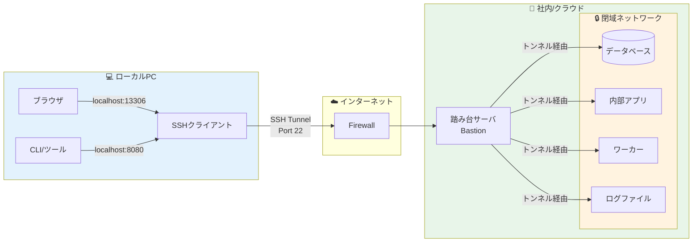
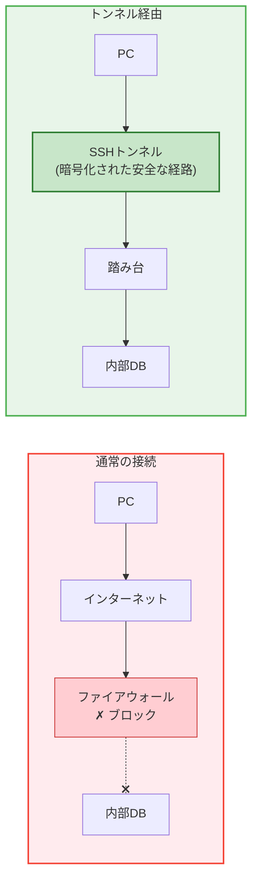
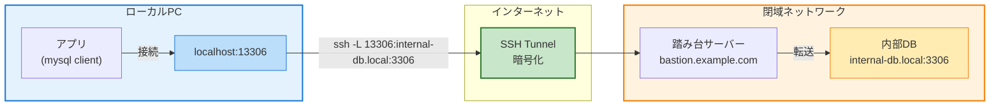
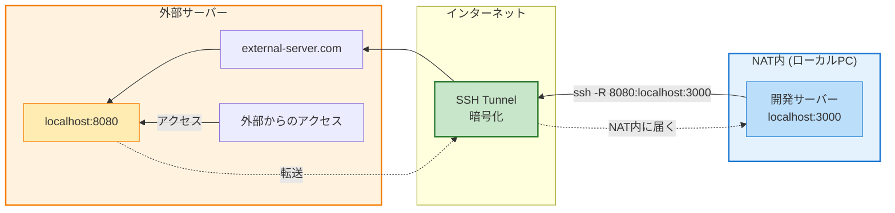
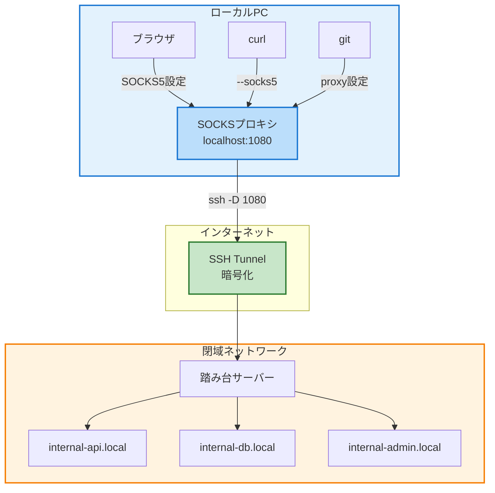
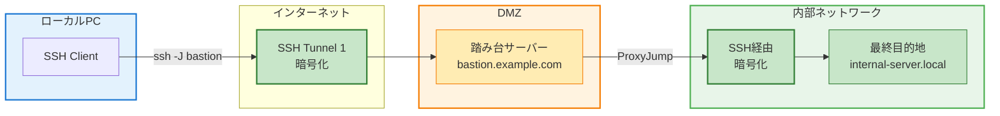
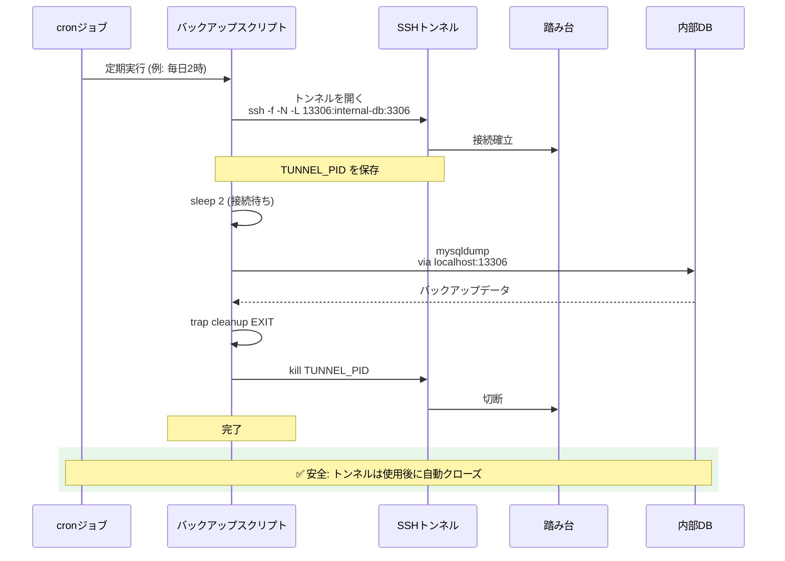
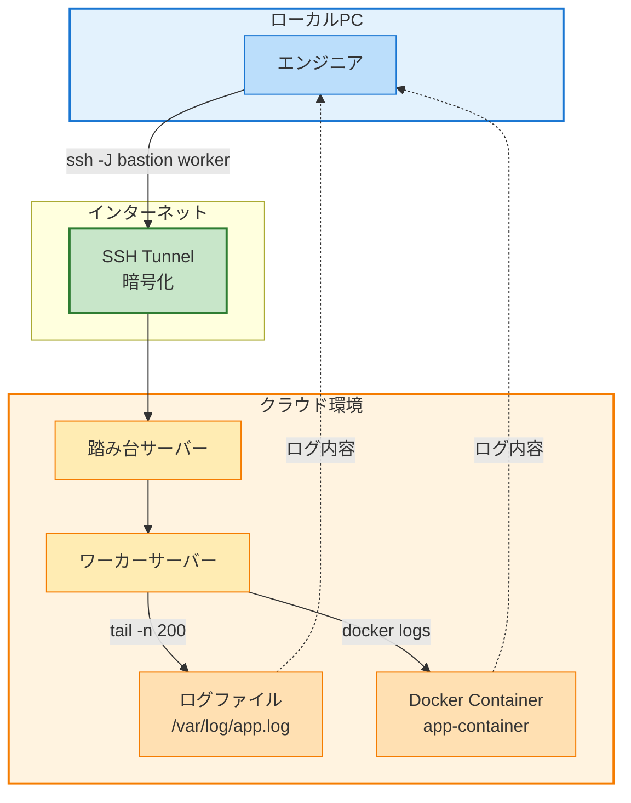
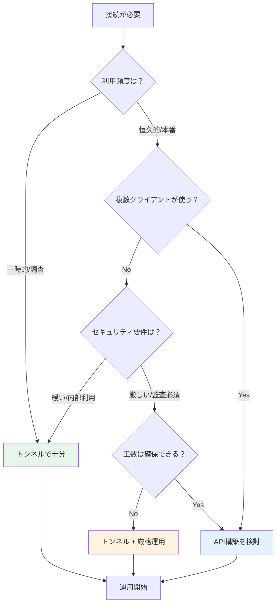
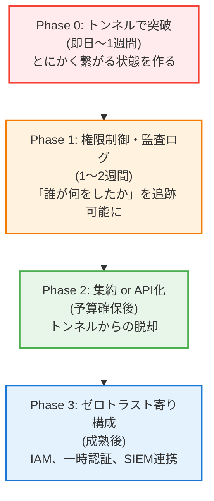

## TL;DR

- **トンネルは「逃げ」ではなく「現実解」**：API構築やVPCピアリングが難しい現場では、SSHトンネルが最も早く安全に繋げる手段になる
- **正しく制御すれば、監査・セキュリティも通せる**：専用ユーザー、鍵管理、ForceCommandで「誰が何をしたか」を追跡可能
- **7つの神テクニック**を押さえれば、ほとんどの「繋がらない」問題は突破できる
- **APIを作るべきか、トンネルで済ますか**の判断基準を持つことで、設計の説明責任を果たせる
- **段階的に改善するロードマップ**があれば、「最小構成」から始めても後から怒られない

---



---

## そもそも「トンネル」とは何か

### 一言で言うと

**「直接繋がらない2点を、安全な経路で繋ぐ技術」**

よくある誤解：
- ❌「外から内に穴をあける危険な行為」
- ✅「内から外に安全な経路を確立する」

### 仕組みの本質（深入りしすぎない）



トンネルは「通信を別の通信で包んで運ぶ」技術だ。SSHトンネルの場合、すべての通信がSSHの暗号化された経路を通るため、盗聴やなりすましのリスクを軽減できる。

**覚えておくべきこと：**
- トンネル自体は「危険」ではない
- 危険なのは「制御されていないトンネル」
- 正しく制御すれば、最強の実務武器になる

---

## 神テクニック集

### 神テク① SSHローカルポートフォワード

**用途**：ローカルPCから、閉域ネットワーク内のDB・管理画面に接続



```bash
# 基本形
ssh -L [ローカルポート]:[接続先ホスト]:[接続先ポート] [踏み台ユーザー]@[踏み台ホスト]

# 例：ローカルの13306を、踏み台経由で内部DBの3306に繋ぐ
ssh -L 13306:internal-db.local:3306 bastion-user@bastion.example.com

# その後、ローカルで
mysql -h 127.0.0.1 -P 13306 -u dbuser -p
```

**実務あるある：踏み台（Bastion）経由**

```bash
# 踏み台を経由して、内部の管理画面に接続
ssh -L 8080:admin.internal:80 bastion@bastion.example.com

# ブラウザで http://localhost:8080 にアクセス
```

**バックグラウンドで実行**

```bash
# -f: バックグラウンド、-N: コマンド実行しない
ssh -f -N -L 13306:internal-db.local:3306 bastion@bastion.example.com

# 確認
ps aux | grep ssh
lsof -i :13306
```

**どんな時にAPIより強いか**

```
✅ 一時的な調査・デバッグ
✅ 既存ツール（MySQL Workbench、pgAdmin等）をそのまま使いたい
✅ API開発の時間がない
✅ 閉域DBへの接続を、特定の人だけに許可したい
```

---

### 神テク② SSHリモートポートフォワード

**用途**：NAT内のサービスを、外部から一時的にアクセス可能にする



```bash
# 基本形
ssh -R [リモートポート]:[ローカルホスト]:[ローカルポート] [外部サーバー]

# 例：NAT内のlocalhost:3000を、外部サーバーの8080で公開
ssh -R 8080:localhost:3000 user@external-server.com

# 外部サーバーの8080にアクセス → NAT内の3000に到達
```

**実務での用途**

```
✅ Webhook受信のテスト（ngrok的な使い方）
✅ CI/CDからNAT内環境へのデプロイ確認
✅ 一時的なデモ・検証
```

**⚠️ 危険ポイントと対策**

```bash
# 危険：外部サーバーの全インターフェースで公開してしまう
ssh -R 0.0.0.0:8080:localhost:3000 user@server  # ❌

# 対策：localhost限定にする
ssh -R 127.0.0.1:8080:localhost:3000 user@server  # ✅

# sshd_config で制限
GatewayPorts no  # リモートフォワードを localhost に限定
```

**注意**：リモートポートフォワードは「穴を開ける」行為に近い。必要な時だけ使い、使い終わったら必ず閉じる。

---

### 神テク③ SSH動的ポートフォワード（SOCKS）

**用途**：ブラウザやCLIをまとめて、トンネル経由で通す



```bash
# 基本形：SOCKSプロキシを立てる
ssh -D [ローカルポート] [踏み台]

# 例：localhost:1080 に SOCKSプロキシを作成
ssh -D 1080 bastion@bastion.example.com
```

**ブラウザで使う（Firefox）**

```
設定 → ネットワーク設定 → 手動でプロキシを設定
SOCKSホスト: 127.0.0.1
ポート: 1080
SOCKS v5 を選択
```

**curlで使う**

```bash
# SOCKS5プロキシ経由でアクセス
curl --socks5 127.0.0.1:1080 http://internal-server.local/api/health

# 環境変数で設定
export ALL_PROXY=socks5://127.0.0.1:1080
curl http://internal-server.local/api/health
```

**gitで使う**

```bash
# .gitconfig に設定
git config --global http.proxy socks5://127.0.0.1:1080

# または環境変数
export GIT_PROXY_COMMAND='nc -x 127.0.0.1:1080 %h %p'
```

**proxychains で何でも通す**

```bash
# インストール（macOS）
brew install proxychains-ng

# /etc/proxychains.conf または ~/.proxychains/proxychains.conf
[ProxyList]
socks5 127.0.0.1 1080

# 任意のコマンドをプロキシ経由で実行
proxychains4 curl http://internal-server.local
proxychains4 nmap -sT internal-server.local
```

**開発・調査・障害対応での強さ**

```
✅ 複数の内部サーバーにアクセスする調査作業
✅ 内部APIを叩きながらの開発
✅ 障害時に複数サービスを横断的に確認
✅ ポートフォワードを1つずつ設定するのが面倒な時
```

---

### 神テク④ Bastion + 多段トンネル

**用途**：「直接は繋がらない」を突破する



**ProxyJump（-J）を使う（推奨）**

```bash
# 基本形
ssh -J [踏み台] [最終目的地]

# 例：bastion経由でinternal-serverに接続
ssh -J bastion@bastion.example.com admin@internal-server.local

# 多段（bastion1 → bastion2 → 目的地）
ssh -J bastion1@host1,bastion2@host2 admin@final-server.local
```

**~/.ssh/config で設定（超便利）**

```bash
# ~/.ssh/config

# 踏み台サーバー
Host bastion
    HostName bastion.example.com
    User bastion-user
    IdentityFile ~/.ssh/bastion_key

# 内部サーバー（bastion経由で自動接続）
Host internal-db
    HostName internal-db.local
    User admin
    ProxyJump bastion
    IdentityFile ~/.ssh/internal_key

Host internal-app
    HostName internal-app.local
    User deploy
    ProxyJump bastion
    IdentityFile ~/.ssh/internal_key
```

```bash
# 設定後は簡単に接続
ssh internal-db
ssh internal-app

# ポートフォワードも簡単
ssh -L 13306:localhost:3306 internal-db
```

**複雑化しすぎないコツ**

```
✅ ~/.ssh/config を活用して、コマンドをシンプルに保つ
✅ 多段は2段まで。3段以上は設計を見直す
✅ 各サーバーの役割を明確にする（踏み台は踏み台だけ）
✅ 接続経路を図にして、チームで共有する
```

---

### 神テク⑤ トンネル × cron / バッチ

**用途**：定期ジョブでトンネルを活用



**ワンショット設計（推奨）**

```bash
#!/bin/bash
# daily_backup.sh - 毎日のバックアップをSSH経由で取得

set -euo pipefail

REMOTE_HOST="internal-db.local"
BASTION="bastion@bastion.example.com"
LOCAL_PORT=13306
BACKUP_DIR="/var/backups/db"

# 1. トンネルを開く
ssh -f -N -L ${LOCAL_PORT}:${REMOTE_HOST}:3306 ${BASTION}
TUNNEL_PID=$!

# クリーンアップ関数
cleanup() {
    kill ${TUNNEL_PID} 2>/dev/null || true
}
trap cleanup EXIT

# 2. 接続待ち
sleep 2

# 3. バックアップ実行
mysqldump -h 127.0.0.1 -P ${LOCAL_PORT} -u backup_user -p"${DB_PASSWORD}" \
    --single-transaction mydb > "${BACKUP_DIR}/mydb_$(date +%Y%m%d).sql"

# 4. トンネルは trap で自動クリーンアップ
echo "Backup completed"
```

**接続失敗時の設計思想**

```bash
# 接続確認を入れる
ssh -o ConnectTimeout=10 -o BatchMode=yes -f -N -L ... || {
    echo "SSH tunnel failed" >&2
    exit 1
}

# リトライロジック
MAX_RETRIES=3
for i in $(seq 1 $MAX_RETRIES); do
    if ssh -o ConnectTimeout=10 -f -N -L ...; then
        break
    fi
    if [ $i -eq $MAX_RETRIES ]; then
        echo "Failed after $MAX_RETRIES attempts" >&2
        exit 1
    fi
    sleep 5
done
```

**autosshで永続化（長時間ジョブ向け）**

```bash
# autosshは切断時に自動再接続
brew install autossh  # macOS
apt install autossh   # Ubuntu

# -M 0: モニタリングポート無効（ServerAliveInterval使用）
autossh -M 0 -f -N \
    -o "ServerAliveInterval 30" \
    -o "ServerAliveCountMax 3" \
    -L 13306:internal-db.local:3306 \
    bastion@bastion.example.com
```

---

### 神テク⑥ トンネル × ログ取得

**用途**：SSH経由でリモートサーバーのログを取得



**基本パターン**

```bash
# 最新ログを取得
ssh bastion-user@bastion "ssh internal-user@worker 'tail -n 200 /var/log/app.log'"

# ProxyJump版（シンプル）
ssh -J bastion worker-user@worker "tail -n 200 /var/log/app.log"
```

**ForceCommand と組み合わせた安全運用**

```bash
# worker サーバーの /home/logtorukun/.ssh/authorized_keys
command="/usr/local/bin/safe-log-reader.sh",no-port-forwarding,no-X11-forwarding ssh-rsa AAAA...
```

```bash
#!/bin/bash
# /usr/local/bin/safe-log-reader.sh

# 許可されたコマンドのみ実行
case "$SSH_ORIGINAL_COMMAND" in
    "tail -n "[0-9]*" /var/log/app/"*.log)
        eval "$SSH_ORIGINAL_COMMAND"
        ;;
    "grep "[a-zA-Z0-9]*" /var/log/app/"*.log" | tail -n "[0-9]*)
        eval "$SSH_ORIGINAL_COMMAND"
        ;;
    "journalctl -u app-service -n "[0-9]*" --no-pager")
        eval "$SSH_ORIGINAL_COMMAND"
        ;;
    *)
        echo "Command not allowed: $SSH_ORIGINAL_COMMAND" >&2
        exit 1
        ;;
esac
```

**docker logs の取得**

```bash
# コンテナログを取得
ssh -J bastion deploy@worker "docker logs --tail 100 app-container"

# 複数コンテナを一括
ssh -J bastion deploy@worker "docker-compose logs --tail 50"
```

---

### 神テク⑦ トンネル × クラウド（AWS/GCP）

```mermaid
graph TB
    subgraph Local["ローカルPC"]
        PC["ローカル端末"]
    end

    subgraph AWS["AWS"]
        SSM["Session Manager<br/>(IAM認証)"]
        EC2["EC2 (Private)<br/>外部IP不要"]
        RDS["RDS<br/>(Private)"]
    end

    subgraph GCP["GCP"]
        IAP["Identity-Aware Proxy<br/>(IAM認証)"]
        GCE["GCE Instance<br/>(内部IPのみ)"]
    end

    PC -->|"aws ssm start-session<br/>--document-name<br/>AWS-StartPortForwardingSession"| SSM
    SSM -->|"22番ポート不要"| EC2
    EC2 --> RDS

    PC -->|"gcloud compute ssh<br/>--tunnel-through-iap"| IAP
    IAP -->|"外部IP不要"| GCE

    style Local fill:#e3f2fd,stroke:#1976d2,stroke-width:2px
    style AWS fill:#fff3e0,stroke:#ff9900,stroke-width:2px
    style GCP fill:#e8f5e9,stroke:#4285f4,stroke-width:2px
    style SSM fill:#ff9900,stroke:#232f3e,stroke-width:2px
    style IAP fill:#4285f4,stroke:#1a73e8,stroke-width:2px
    style EC2 fill:#ffecb3,stroke:#ff9900
    style GCE fill:#c8e6c9,stroke:#4285f4
    style RDS fill:#ffe0b2,stroke:#ff9900

    rect rgb(232, 245, 233)
        Note over SSM,IAP: ✅ セキュリティグループで22番ポートを開放不要<br/>✅ IAM認証で制御<br/>✅ 監査ログ自動取得
    end
```

**AWS EC2：Session Manager + ポートフォワード**

```bash
# SSM経由でポートフォワード（SSHキー不要）
aws ssm start-session \
    --target i-0123456789abcdef0 \
    --document-name AWS-StartPortForwardingSession \
    --parameters '{"portNumber":["3306"],"localPortNumber":["13306"]}'

# ローカルで接続
mysql -h 127.0.0.1 -P 13306 -u admin -p
```

**EC2：従来のSSHトンネル**

```bash
# セキュリティグループで22番ポートを特定IPに限定

# ~/.ssh/config
Host aws-bastion
    HostName ec2-xxx.ap-northeast-1.compute.amazonaws.com
    User ec2-user
    IdentityFile ~/.ssh/aws-key.pem

Host aws-private-db
    HostName 10.0.1.50
    User ec2-user
    ProxyJump aws-bastion
    IdentityFile ~/.ssh/aws-key.pem

# 接続
ssh -L 13306:localhost:3306 aws-private-db
```

**GCP：IAP（Identity-Aware Proxy）トンネル**

```bash
# IAP経由でSSHトンネル（外部IPなしでOK）
gcloud compute ssh instance-name \
    --tunnel-through-iap \
    -- -L 13306:localhost:3306

# IAP経由でポートフォワードのみ
gcloud compute start-iap-tunnel instance-name 3306 \
    --local-host-port=localhost:13306 \
    --zone=asia-northeast1-a
```

**セキュリティグループ最小化の発想**

```
【従来】
- 22番ポートを 0.0.0.0/0 に開放
- または特定IPに限定（IP変わると詰む）

【IAP / Session Manager】
- 22番ポートを開放しない
- IAM認証で制御
- 監査ログも自動取得
```

---

## 「APIを作る vs トンネル」の判断基準



### 比較表

| 観点 | トンネル | API構築 |
|------|---------|---------|
| **初期コスト** | ◎ ほぼゼロ | △ 開発工数が必要 |
| **運用コスト** | ○ 低い | △ 保守が必要 |
| **セキュリティ** | △ 設計次第 | ○ 制御しやすい |
| **監査対応** | △ 自前実装 | ○ 設計に組み込める |
| **スケール** | × 限界あり | ◎ 水平拡張可能 |
| **一時利用** | ◎ 最適 | × オーバースペック |
| **恒久利用** | △ 要検討 | ◎ 推奨 |
| **複数クライアント** | × 管理困難 | ◎ 想定済み |

### 判断のポイント

```
トンネルを選ぶべき時：
✅ 一時的な調査・デバッグ
✅ 開発環境での接続
✅ 緊急対応（今すぐ繋ぎたい）
✅ 利用者が限られている（1〜3人）
✅ APIを作る時間・予算がない

APIを検討すべき時：
✅ 本番環境での恒久利用
✅ 複数のクライアント/チームが使う
✅ 細かい認証認可が必要
✅ 監査要件が厳しい
✅ 将来的な拡張が見込まれる
```

---

## セキュリティ・内部統制のリアル

### よくある誤解

| 誤解 | 現実 |
|------|------|
| 「トンネル=セキュリティホール」 | 制御されたトンネルは安全な経路 |
| 「SSHは古い、危険」 | 適切に管理されたSSHは今でも堅牢 |
| 「踏み台を使えば何でもOK」 | 踏み台自体のセキュリティが最重要 |
| 「一度設定すれば終わり」 | 定期的な鍵ローテーション・監査が必要 |

### 最小で通すための実装ルール

#### 1. 専用ユーザーを作る

```bash
# 接続用の専用ユーザー
sudo useradd -r -s /bin/bash -m tunnel-user
sudo mkdir -p /home/tunnel-user/.ssh
sudo chmod 700 /home/tunnel-user/.ssh
```

#### 2. 鍵管理を徹底する

```bash
# 用途ごとに鍵を分ける
~/.ssh/bastion_key      # 踏み台用
~/.ssh/internal_db_key  # DB接続用
~/.ssh/deploy_key       # デプロイ用

# パスフレーズを設定
ssh-keygen -t ed25519 -f ~/.ssh/bastion_key -C "bastion-access"
# パスフレーズを聞かれるので、必ず設定

# ssh-agent で管理
eval "$(ssh-agent -s)"
ssh-add ~/.ssh/bastion_key
```

#### 3. AllowUsers で制限

```bash
# /etc/ssh/sshd_config
AllowUsers tunnel-user bastion-user

# 接続元IPも制限（可能なら）
Match User tunnel-user
    AllowUsers tunnel-user@192.168.1.0/24
```

#### 4. ForceCommand でコマンドを固定

```bash
# authorized_keys
command="/usr/local/bin/allowed-commands.sh",no-port-forwarding ssh-rsa AAAA...

# ポートフォワードだけ許可する場合
restrict,port-forwarding ssh-rsa AAAA...
```

#### 5. sudo を最小限に

```bash
# /etc/sudoers.d/tunnel-user
# 必要なコマンドだけ許可
tunnel-user ALL=(ALL) NOPASSWD: /usr/bin/journalctl -u app-service *

# ❌ 絶対にダメ
# tunnel-user ALL=(ALL) NOPASSWD: ALL
```

#### 6. 実行ログを保存

```bash
# sshd のログ
/var/log/auth.log      # Ubuntu/Debian
/var/log/secure        # RHEL/CentOS

# 詳細ログを有効化
# /etc/ssh/sshd_config
LogLevel VERBOSE

# auditd でコマンド実行を記録
sudo auditctl -a always,exit -F arch=b64 -S execve -F uid=tunnel-user
```

### 「何をやるとアウトか」

```
❌ パスワード認証を許可する
❌ ルートログインを許可する
❌ 秘密鍵をパスフレーズなしで共有する
❌ 踏み台サーバーに本番データを置く
❌ トンネルを開きっぱなしで放置する
❌ 誰がいつ接続したか追跡できない状態
❌ 鍵を何年もローテーションしない
```

---

## 現場あるある（共感パート）

### 「API作れって言われるけど、時間も権限もない」

```
PM「この内部システムのデータ、Web画面から見られるようにして」
私「APIを作りましょうか」
PM「いつできる？」
私「設計含めて2週間くらい」
PM「長い。明日のデモで見せたいんだけど」
私「...SSHトンネルで一時的に」
PM「それでいいじゃん」
```

### 「最小案じゃないと却下される」

```
私「ログ集約基盤を構築したいです」
上司「予算は？」
私「月5万円です」
上司「高い。SSHで見られないの？」
私「見られますけど、スケールしないし...」
上司「まずSSHでやって。困ったら考えよう」
```

### 「後から理想論を言われがち」

```
（半年後）
セキュリティ担当「このSSHトンネル、監査ログはどこ？」
私「...（あの時は急いでたんだよ）」

（だからこそ、最初から最低限の監査ログは入れておく）
```

### 「知らなかったことを責められる」悔しさ

最小構成を選んだのは組織の判断なのに、問題が起きると責任はエンジニアに来る。

**だからこそ**：
- リスクを文書化しておく
- 最低限の安全策は入れる
- 改善ロードマップを示す

これがあれば、「最小構成の中で、できる限りのことはしていた」と言える。

---

## 段階的改善ロードマップ



### Phase 0：トンネルで突破

```
□ SSH接続の確立
□ ポートフォワード設定
□ 基本動作確認
□ ~/.ssh/config の整備
```

### Phase 1：権限制御・監査ログ

```
□ 専用ユーザーの作成
□ 鍵の分離（用途ごと）
□ AllowUsers 設定
□ ForceCommand 検討
□ 接続ログの保存設定
□ 定期的な鍵ローテーション手順
```

### Phase 2：集約 or API化

```
□ 要件の整理（何が本当に必要か）
□ ログ集約基盤 or API の選定
□ 移行計画の策定
□ 段階的な移行
□ トンネルの廃止
```

### Phase 3：ゼロトラスト寄り構成

```
□ IAM認証の導入
□ 一時的な認証情報の発行
□ 全アクセスの監査ログをSIEM連携
□ 異常検知アラート
```

---

## 導入前チェックリスト

### 接続・ネットワーク

- [ ] 踏み台サーバーへの22番ポートは開いているか
- [ ] 踏み台から内部サーバーへの接続は可能か
- [ ] ファイアウォールルールを把握しているか
- [ ] 接続元IPの制限は必要か・可能か

### 認証・鍵管理

- [ ] SSH公開鍵認証を使用しているか（パスワード認証は無効化）
- [ ] 秘密鍵にパスフレーズを設定しているか
- [ ] 鍵は用途ごとに分離しているか
- [ ] 鍵のローテーション手順を決めているか

### ユーザー・権限

- [ ] 接続用の専用ユーザーを作成したか
- [ ] AllowUsers で接続可能ユーザーを制限したか
- [ ] sudo権限は最小限か（または不要か）
- [ ] ForceCommand での制限を検討したか

### セキュリティ

- [ ] ルートログインを無効化したか
- [ ] 不要なポートフォワードを禁止したか
- [ ] 接続タイムアウトを設定したか
- [ ] 踏み台サーバー自体のセキュリティは十分か

### 監査・運用

- [ ] 接続ログが保存される設定になっているか
- [ ] 誰がいつ接続したか追跡できるか
- [ ] 異常な接続を検知する仕組みがあるか
- [ ] 障害時の切り分け手順を文書化したか

### ドキュメント

- [ ] 接続手順を文書化したか
- [ ] ~/.ssh/config のテンプレートを用意したか
- [ ] この設計のリスクを関係者に共有したか
- [ ] 段階的改善のロードマップを持っているか

---

## まとめ

### トンネルは「逃げ」ではなく「現実解」

- API構築やVPCピアリングが難しい現場では、SSHトンネルが最も早く確実に繋げる手段
- 正しく制御すれば、監査・セキュリティ要件も満たせる
- 「最小構成」でも、押さえるべきポイントを押さえれば、後から怒られない

### 7つの神テクニック

1. **ローカルポートフォワード**：閉域DB・管理画面への接続
2. **リモートポートフォワード**：NAT内サービスの一時公開
3. **動的ポートフォワード（SOCKS）**：まとめてトンネル経由
4. **Bastion + 多段トンネル**：「直接繋がらない」の突破
5. **cron / バッチ連携**：定期ジョブでの活用
6. **ログ取得**：ForceCommandと組み合わせた安全運用
7. **クラウド連携**：IAP / Session Manager でセキュリティグループ最小化

### 判断基準を持つ

- **一時的・調査・少人数** → トンネル
- **恒久的・本番・複数クライアント** → API構築を検討
- **どちらにしても、段階的改善のロードマップを持つ**

### 最低限守るべきこと

- 専用ユーザー
- 公開鍵認証（パスワード禁止）
- AllowUsers 制限
- 監査ログの保存
- 鍵のローテーション

**トンネルを制する者が、現場を制す。**

---

## 設計判断の背景

「トンネルはアンチパターン」という意見もあるが、現実には予算・工数・組織の制約で「理想の構成」を選べない場面が多い。この記事では、トンネルを「必要悪」としてではなく、「制御された現実解」として捉え、安全に運用するためのガイドラインを示した。

## 現場での判断基準

トンネルを選ぶ前に「本当にAPIやログ集約基盤を作れないのか」を確認する。それでも難しい場合は、Phase0としてトンネルで始め、Phase1で安全策を入れ、将来的にはPhase2以降に進むロードマップを提示することで、関係者の合意を得やすくなる。

## 見るべきポイント

他のエンジニアがトンネルを使っているのを見たら、まず「専用ユーザーを使っているか」「パスワード認証になっていないか」「監査ログがあるか」を確認する。これらが欠けていると、インシデント発生時に「誰が何をしたか分からない」状態になり、対応が困難になる。
