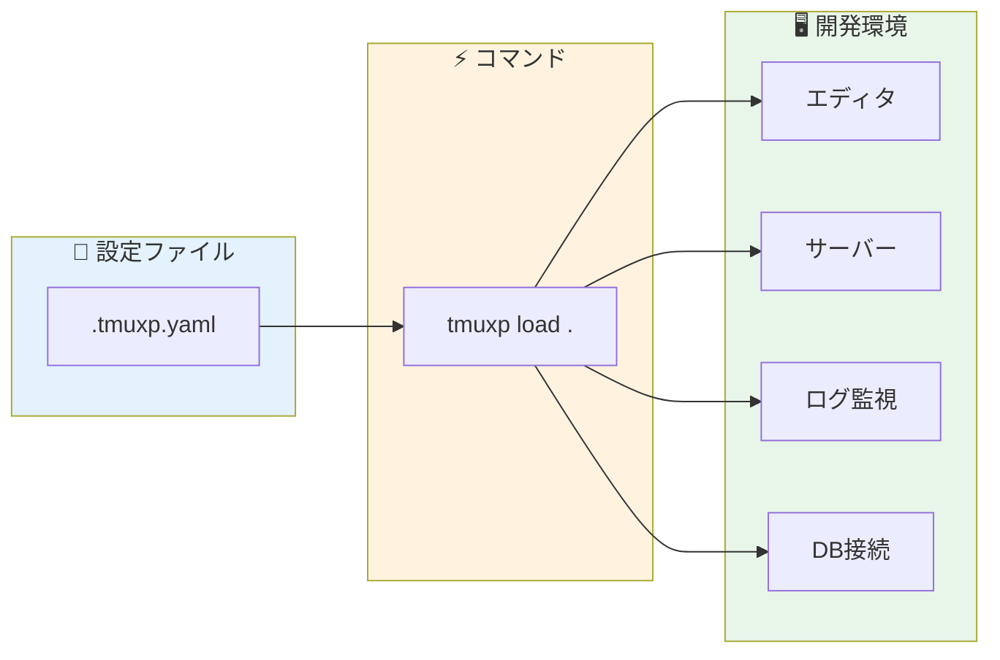
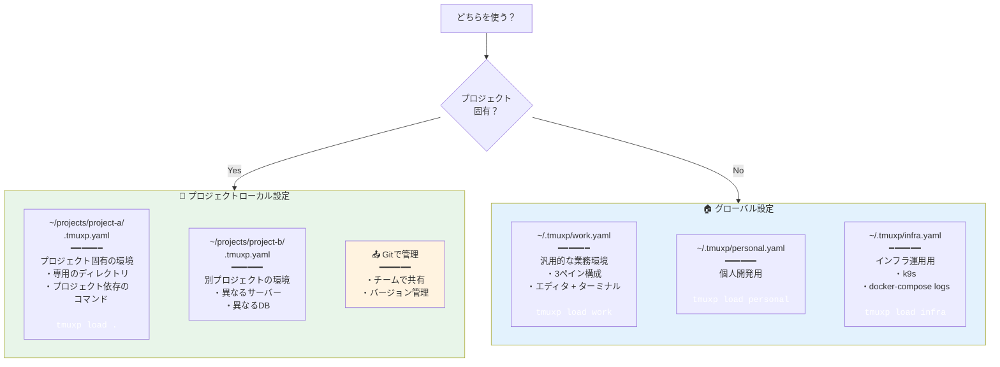
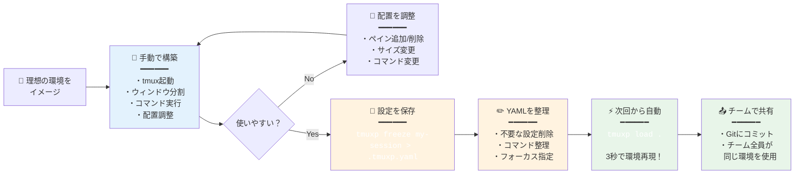
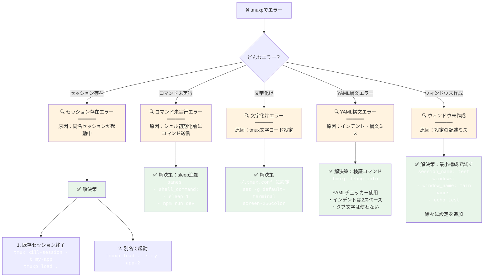

## 毎朝、同じことをしていないか？

出社する。PCを開く。ターミナルを起動する。

```bash
cd ~/projects/my-app
tmux new -s myapp
# ウィンドウを分割して...
# 左側でvimを開いて...
# 右上でサーバーを起動して...
# 右下でログを流して...
```

これを毎日やっている。プロジェクトが3つあれば、3回やる。

「慣れてるから別に」と思うかもしれない。でも、この作業に毎日5分かけているとしたら、月に100分。年間で20時間。

**20時間あれば、小さな機能を1つ作れる。**

今回紹介する `tmuxp` は、この「毎朝の儀式」をYAMLファイル1つで自動化するツールだ。

### 手動セットアップ vs tmuxp自動化

```mermaid
flowchart TB
    subgraph Manual[" "]
        direction TB
        ManualTitle["❌ 手動セットアップ（毎朝5分）"]
        M1["1. ターミナル起動"] --> M2["2. プロジェクトに移動<br/><code style='color: white'>cd ~/projects/my-app</code>"]
        M2 --> M3["3. tmuxセッション作成<br/><code style='color: white'>tmux new -s myapp</code>"]
        M3 --> M4["4. ウィンドウ分割<br/><code style='color: white'>Ctrl-b %</code><br/><code style='color: white'>Ctrl-b</code> <code style='color: white'>\"</code>"]
        M4 --> M5["5. 各ペインでコマンド実行<br/>・vim起動<br/>・サーバー起動<br/>・ログ監視<br/>・DB接続"]
        M5 --> M6["⏱️ 5分後<br/>━━━━━━<br/>やっと開発開始"]
        ManualTitle ~~~ M1
    end

    subgraph Auto[" "]
        direction TB
        AutoTitle["✅ tmuxp自動化（3秒）"]
        A1["1. プロジェクトに移動<br/><code style='color: white'>cd ~/projects/my-app</code>"]
        A2["2. コマンド一発<br/><code style='color: white'>tmuxp load .</code>"]
        A3["⚡ 3秒後<br/>━━━━━━<br/>すぐに開発開始"]

        AutoTitle ~~~ A1
        A1 --> A2 --> A3
    end

    Manual -.-> Auto

    TimeCalc["💡 時間の計算<br/>━━━━━━<br/>5分/日 × 20営業日 = 100分/月<br/>100分/月 × 12ヶ月 = 20時間/年<br/><br/>20時間 = 小さな機能1つ分"]

    style Manual fill:#ffebee
    style Auto fill:#e8f5e9
    style M6 fill:#ffcdd2
    style A3 fill:#c8e6c9
    style TimeCalc fill:#fff3e0
```

---

## tmuxpとは何か

tmuxpは、tmuxのセッションマネージャーだ。

YAMLまたはJSONで「どんなウィンドウを開くか」「どんなコマンドを実行するか」を定義しておくと、`tmuxp load` 一発でその環境が再現される。

```bash
# これだけで開発環境が立ち上がる
tmuxp load .
```

似たツールに `tmuxinator` があるが、tmuxpはPython製で、より柔軟な設定ができる。既存のtmuxセッションを「フリーズ」して設定ファイルに書き出す機能もある。

---

## インストール

```bash
# pipでインストール（推奨）
pip install tmuxp

# Homebrewでも可
brew install tmuxp

# 確認
tmuxp --version
```

前提として、tmux 3.2以上とPython 3.10以上が必要だ。

---

## 基本の設定ファイル

まずは最小構成から。プロジェクトのルートに `.tmuxp.yaml` を作る。

```yaml
session_name: my-app
start_directory: ./
windows:
  - window_name: main
    panes:
      - echo "Hello, tmuxp!"
```

これを読み込む：

```bash
cd ~/projects/my-app
tmuxp load .
```

`my-app` という名前のtmuxセッションが作られ、1つのウィンドウに1つのペインが開く。

---

## 実践的な設定例

### Webアプリ開発環境

フロントエンド＋バックエンド＋DBという典型的な構成：

```yaml
session_name: webapp
start_directory: ./
windows:
  # メイン開発ウィンドウ
  - window_name: editor
    layout: main-vertical
    options:
      main-pane-width: 60%
    panes:
      - vim .
      - # 空のペイン（コマンド実行用）

  # サーバー系
  - window_name: servers
    layout: even-horizontal
    panes:
      - shell_command:
          - cd frontend
          - npm run dev
      - shell_command:
          - cd backend
          - python manage.py runserver

  # ログ・監視
  - window_name: logs
    layout: even-vertical
    panes:
      - tail -f logs/app.log
      - docker logs -f postgres

  # DB接続
  - window_name: db
    panes:
      - psql -h localhost -U postgres myapp_dev
```

これで4つのウィンドウが立ち上がる：

1. **editor** - 左側にvim、右側に空のペイン
2. **servers** - フロントエンドとバックエンドのサーバー
3. **logs** - アプリログとDBログ
4. **db** - PostgreSQLに接続済み

### マイクロサービス開発環境

複数サービスを同時に扱う場合：

```yaml
session_name: microservices
start_directory: ~/projects/platform
windows:
  - window_name: api-gateway
    start_directory: ./api-gateway
    layout: main-horizontal
    options:
      main-pane-height: 70%
    panes:
      - vim .
      - make run

  - window_name: user-service
    start_directory: ./user-service
    layout: main-horizontal
    options:
      main-pane-height: 70%
    panes:
      - vim .
      - make run

  - window_name: order-service
    start_directory: ./order-service
    layout: main-horizontal
    options:
      main-pane-height: 70%
    panes:
      - vim .
      - make run

  - window_name: infra
    layout: tiled
    panes:
      - docker-compose logs -f
      - k9s
      - htop
```

### データ分析環境

Jupyter + ターミナル + ログの構成：

```yaml
session_name: data-analysis
start_directory: ~/projects/analysis
shell_command_before:
  - source ~/.venv/analysis/bin/activate
windows:
  - window_name: notebook
    panes:
      - jupyter lab --no-browser

  - window_name: work
    layout: main-vertical
    options:
      main-pane-width: 50%
    panes:
      - ipython
      - # コマンド用

  - window_name: data
    panes:
      - shell_command:
          - cd data
          - ls -la
```

`shell_command_before` を使うと、すべてのペインで共通のコマンド（仮想環境のactivateなど）を実行できる。

---

## 覚えておきたい設定オプション

### レイアウト

tmuxの組み込みレイアウトが使える：

```yaml
layout: main-horizontal   # 上がメイン、下に小さいペイン
layout: main-vertical     # 左がメイン、右に小さいペイン
layout: tiled             # 均等に分割
layout: even-horizontal   # 横に均等分割
layout: even-vertical     # 縦に均等分割
```

#### tmuxレイアウトの視覚化

```mermaid
flowchart TB
    subgraph MainH["main-horizontal"]
        MH1["━━━━━━━━━━━━━━━<br/>メインペイン（70%）<br/>━━━━━━━━━━━━━━━"]
        MH2["サブペイン1（15%）"]
        MH3["サブペイン2（15%）"]
        MH1 ~~~ MH2 ~~~ MH3
    end

    subgraph MainV["main-vertical"]
        direction LR
        MV1["メイン<br/>ペイン<br/>━━━<br/>60%"]
        MV2["サブ1<br/>20%"]
        MV3["サブ2<br/>20%"]
        MV1 ~~~ MV2 ~~~ MV3
    end

    subgraph Tiled["tiled（4ペインの場合）"]
        T1["ペイン1"] ~~~ T2["ペイン2"]
        T3["ペイン3"] ~~~ T4["ペイン4"]
        T1 ~~~ T3
        T2 ~~~ T4
    end

    subgraph EvenH["even-horizontal"]
        EH1["━━━ ペイン1（33%） ━━━"]
        EH2["━━━ ペイン2（33%） ━━━"]
        EH3["━━━ ペイン3（33%） ━━━"]
        EH1 ~~~ EH2 ~~~ EH3
    end

    subgraph EvenV["even-vertical"]
        direction LR
        EV1["ペイン1<br/>33%"]
        EV2["ペイン2<br/>33%"]
        EV3["ペイン3<br/>33%"]
        EV1 ~~~ EV2 ~~~ EV3
    end

    Usage["💡 使い分け<br/>━━━━━━<br/>・main-*: エディタ中心<br/>・even-*: サーバー監視<br/>・tiled: ダッシュボード"]

    style MainH fill:#e3f2fd
    style MainV fill:#e8f5e9
    style Tiled fill:#fff3e0
    style EvenH fill:#f3e5f5
    style EvenV fill:#fce4ec
    style Usage fill:#fffde7
```



### ペインサイズの調整

```yaml
options:
  main-pane-width: 60%    # main-verticalのときのメインペイン幅
  main-pane-height: 70%   # main-horizontalのときのメインペイン高さ
```

### フォーカス指定

起動時にどのウィンドウ・ペインにフォーカスするか：

```yaml
windows:
  - window_name: editor
    focus: true  # このウィンドウにフォーカス
    panes:
      - focus: true  # このペインにフォーカス
        shell_command:
          - vim .
      - # サブペイン
```

### 環境変数

```yaml
environment:
  NODE_ENV: development
  DEBUG: "true"
```

### 起動前スクリプト

```yaml
before_script: ./scripts/setup.sh  # セッション作成前に実行
```

---

## 便利なコマンド

### セッションの読み込み

```bash
# カレントディレクトリの .tmuxp.yaml を読み込む
tmuxp load .

# 指定したファイルを読み込む
tmuxp load ~/configs/project.yaml

# バックグラウンドで起動（アタッチしない）
tmuxp load . -d

# 複数セッションを同時に起動
tmuxp load project1.yaml project2.yaml
```

### 既存セッションのフリーズ

今動いているtmuxセッションを設定ファイルに書き出す：

```bash
# 現在のセッションをYAMLに書き出す
tmuxp freeze my-session

# JSON形式で書き出す
tmuxp freeze my-session --format json
```

「手動で作った理想の配置」を保存して再利用できる。これが地味に便利。

### 設定ファイルの変換

```bash
# YAML → JSON
tmuxp convert config.yaml

# JSON → YAML
tmuxp convert config.json
```

### 設定の検証

```bash
# 設定ファイルの文法チェック
tmuxp debug-info
```

---

## 実際の運用Tips

### 1. プロジェクトごとに `.tmuxp.yaml` を置く

```
~/projects/
├── project-a/
│   ├── .tmuxp.yaml  ← プロジェクトA用
│   └── ...
├── project-b/
│   ├── .tmuxp.yaml  ← プロジェクトB用
│   └── ...
```

各プロジェクトに入って `tmuxp load .` するだけ。Gitで管理すれば、チームで環境を共有できる。

### 2. グローバル設定は `~/.tmuxp/` に

```
~/.tmuxp/
├── work.yaml      # 仕事用の汎用設定
├── personal.yaml  # 個人開発用
└── infra.yaml     # インフラ作業用
```

```bash
tmuxp load work
tmuxp load personal
```

#### 設定ファイルの管理戦略



### 3. エイリアスを設定する

```bash
# ~/.bashrc or ~/.zshrc
alias tl='tmuxp load .'
alias tw='tmuxp load work'
```

`tl` だけで開発環境が立ち上がる。

### 4. フリーズ → 編集 → 読み込みのサイクル

1. 手動でtmuxの配置を作り込む
2. `tmuxp freeze session-name > .tmuxp.yaml`
3. 生成されたYAMLを編集して整理
4. 次回から `tmuxp load .`

「まず手で作って、良かったら保存」という流れが自然。

#### tmuxpの理想的なワークフロー



---

## よくあるトラブルと対処

### 「セッションが既に存在する」エラー

```bash
# 既存セッションを終了してから読み込む
tmux kill-session -t my-app && tmuxp load .

# または、新しい名前で起動
tmuxp load . -s my-app-2
```

### コマンドが実行されない

シェルの初期化が終わる前にコマンドが送られている可能性：

```yaml
panes:
  - shell_command:
      - sleep 1  # 少し待つ
      - npm run dev
```

### 日本語が文字化けする

tmux側の設定を確認：

```bash
# ~/.tmux.conf
set -g default-terminal "screen-256color"
set -g terminal-overrides ",xterm-256color:Tc"
```

### トラブルシューティングフロー



---

## なぜtmuxpを使うべきか

「tmuxの操作は覚えている。手動でも作れる」

その通りだ。でも問題は「手動でできる」ことではない。

**「毎回手動でやっている」ことだ。**

開発環境のセットアップは、本来の仕事ではない。コードを書くこと、問題を解決することが仕事だ。

tmuxpは、その「本来の仕事」に1秒でも早く到達するためのツールだ。

```bash
cd ~/projects/my-app
tmuxp load .
# 3秒後には、いつもの開発環境
```

YAMLファイルを1つ書くだけで、毎日の5分が3秒になる。

---

## まとめ

tmuxpは「開発環境の起動を自動化するツール」だ。

1. **YAMLで定義** - ウィンドウ、ペイン、実行コマンドを宣言的に書く
2. **一発で再現** - `tmuxp load .` で環境が立ち上がる
3. **プロジェクトごとに管理** - `.tmuxp.yaml` をGitで共有できる
4. **フリーズ機能** - 今の配置を保存して再利用できる

設定ファイルの書き方を覚えるのに30分。それで毎日5分を取り戻せる。

ROIは悪くないはずだ。

---

## 参考リンク

- [tmuxp公式ドキュメント](https://tmuxp.git-pull.com/)
- [GitHub - tmux-python/tmuxp](https://github.com/tmux-python/tmuxp)
- [設定例集（公式）](https://tmuxp.git-pull.com/examples.html)

---

## 私の設定ファイル

最後に、私が実際に使っている設定を共有しておく。参考になれば。

```yaml
session_name: dev
start_directory: ./
windows:
  - window_name: code
    focus: true
    layout: main-vertical
    options:
      main-pane-width: 65%
    panes:
      - focus: true
        shell_command:
          - vim .
      - # git操作用
      - # テスト実行用

  - window_name: server
    layout: even-horizontal
    panes:
      - make dev
      - make watch

  - window_name: misc
    layout: tiled
    panes:
      - # 自由に使うペイン
      - lazygit
      - htop
```

まずはシンプルな設定から始めて、自分の作業スタイルに合わせてカスタマイズしていけばいい。
